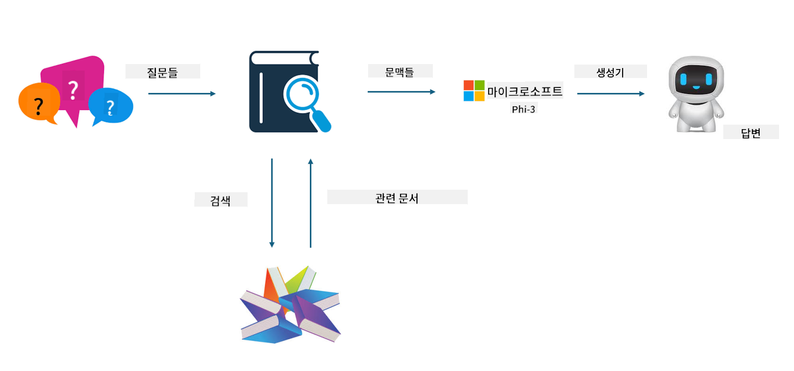
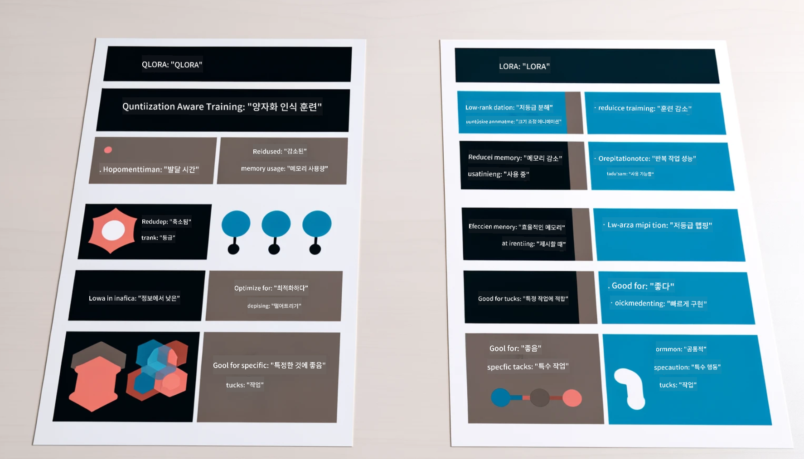

<!--
CO_OP_TRANSLATOR_METADATA:
{
  "original_hash": "ef0e3b9f4e65cc05e80efb30723aed40",
  "translation_date": "2025-04-04T07:18:57+00:00",
  "source_file": "md\\03.FineTuning\\LetPhi3gotoIndustriy.md",
  "language_code": "ko"
}
-->
# **Phi-3을 산업 전문가로 만들기**

Phi-3 모델을 산업에 적용하려면 산업 비즈니스 데이터를 Phi-3 모델에 추가해야 합니다. 이를 위한 두 가지 옵션이 있습니다. 첫 번째는 RAG(Retrieval Augmented Generation)이고, 두 번째는 Fine-Tuning입니다.

## **RAG vs Fine-Tuning**

### **Retrieval Augmented Generation**

RAG는 데이터 검색과 텍스트 생성을 결합한 방식입니다. 기업의 구조화된 데이터와 비구조화된 데이터를 벡터 데이터베이스에 저장합니다. 관련 콘텐츠를 검색할 때, 관련 요약과 콘텐츠를 찾아 컨텍스트를 형성하고, LLM/SLM의 텍스트 생성 기능과 결합하여 콘텐츠를 생성합니다.

### **Fine-Tuning**

Fine-Tuning은 특정 모델을 개선하는 데 기반을 둡니다. 모델 알고리즘에서 시작할 필요는 없지만 데이터를 지속적으로 축적해야 합니다. 산업 응용 프로그램에서 더 정밀한 용어와 언어 표현이 필요하다면 Fine-Tuning이 더 나은 선택입니다. 하지만 데이터가 자주 변경된다면 Fine-Tuning은 복잡해질 수 있습니다.

### **어떻게 선택할까**

1. 답변에 외부 데이터를 도입해야 한다면, RAG가 최적의 선택입니다.

2. 안정적이고 정밀한 산업 지식을 출력해야 한다면 Fine-Tuning이 좋은 선택입니다. RAG는 관련 콘텐츠를 우선적으로 가져오지만, 항상 전문적인 뉘앙스를 정확히 전달하지는 못할 수 있습니다.

3. Fine-Tuning은 고품질 데이터 세트가 필요하며, 데이터 범위가 작다면 큰 차이를 만들지 못합니다. RAG는 더 유연합니다.

4. Fine-Tuning은 블랙박스와 같아서 내부 메커니즘을 이해하기 어렵습니다. 하지만 RAG는 데이터의 출처를 더 쉽게 찾을 수 있어 환각이나 콘텐츠 오류를 효과적으로 조정하고 더 나은 투명성을 제공합니다.

### **적용 시나리오**

1. 특정 전문 용어와 표현이 필요한 수직 산업에서는 ***Fine-Tuning***이 최적의 선택입니다.

2. 다양한 지식 포인트를 통합하는 QA 시스템에서는 ***RAG***가 최적의 선택입니다.

3. 자동화된 비즈니스 흐름의 조합에서는 ***RAG + Fine-Tuning***이 최적의 선택입니다.

## **RAG 사용 방법**

벡터 데이터베이스는 데이터를 수학적 형태로 저장한 컬렉션입니다. 벡터 데이터베이스는 기계 학습 모델이 이전 입력을 더 쉽게 기억할 수 있도록 하며, 검색, 추천, 텍스트 생성과 같은 사용 사례를 지원하는 데 기계 학습을 활용할 수 있게 합니다. 데이터는 정확히 일치하는 것이 아니라 유사성 메트릭을 기반으로 식별될 수 있어 컴퓨터 모델이 데이터의 컨텍스트를 이해할 수 있습니다.

벡터 데이터베이스는 RAG를 실현하는 핵심입니다. 텍스트-임베딩-3, jina-ai-embedding 등과 같은 벡터 모델을 통해 데이터를 벡터 스토리지로 변환할 수 있습니다.

RAG 애플리케이션 생성에 대해 더 알아보세요: [https://github.com/microsoft/Phi-3CookBook](https://github.com/microsoft/Phi-3CookBook?WT.mc_id=aiml-138114-kinfeylo)

## **Fine-Tuning 사용 방법**

Fine-Tuning에서 일반적으로 사용되는 알고리즘은 Lora와 QLora입니다. 어떤 것을 선택해야 할까요?
- [이 샘플 노트북에서 더 알아보기](../../../../code/04.Finetuning/Phi_3_Inference_Finetuning.ipynb)
- [Python Fine-Tuning 샘플 예제](../../../../code/04.Finetuning/FineTrainingScript.py)

### **Lora와 QLora**

LoRA(Low-Rank Adaptation)와 QLoRA(Quantized Low-Rank Adaptation)는 모두 Parameter Efficient Fine Tuning(PEFT)을 사용하여 대형 언어 모델(LLMs)을 Fine-Tuning하는 기술입니다. PEFT 기술은 기존 방식보다 모델을 더 효율적으로 훈련할 수 있도록 설계되었습니다.  
LoRA는 독립적인 Fine-Tuning 기술로, 가중치 업데이트 행렬에 저순위 근사를 적용하여 메모리 사용량을 줄입니다. 이 방식은 빠른 훈련 시간을 제공하며 기존 Fine-Tuning 방식과 유사한 성능을 유지합니다.

QLoRA는 LoRA의 확장 버전으로, 양자화 기술을 포함하여 메모리 사용량을 더욱 줄입니다. QLoRA는 사전 학습된 LLM의 가중치 파라미터 정밀도를 4비트로 양자화하여 LoRA보다 메모리를 효율적으로 사용합니다. 하지만 추가적인 양자화 및 비양자화 단계로 인해 QLoRA 훈련 속도는 LoRA보다 약 30% 느립니다.

QLoRA는 양자화 과정에서 발생하는 오류를 수정하기 위해 LoRA를 보조적으로 사용합니다. QLoRA는 수십억 개의 파라미터를 가진 대형 모델을 상대적으로 소규모이면서 쉽게 구할 수 있는 GPU에서 Fine-Tuning할 수 있게 합니다. 예를 들어, QLoRA는 36개의 GPU가 필요한 70B 파라미터 모델을 단 2개의 GPU로 Fine-Tuning할 수 있습니다.

**면책 조항**:  
이 문서는 AI 번역 서비스 [Co-op Translator](https://github.com/Azure/co-op-translator)를 사용하여 번역되었습니다. 정확성을 위해 최선을 다하고 있지만, 자동 번역에는 오류나 부정확성이 포함될 수 있습니다. 원본 문서의 원어 버전을 신뢰할 수 있는 권위 있는 자료로 간주해야 합니다. 중요한 정보의 경우, 전문적인 인간 번역을 권장합니다. 이 번역 사용으로 인해 발생하는 오해나 잘못된 해석에 대해 당사는 책임을 지지 않습니다.