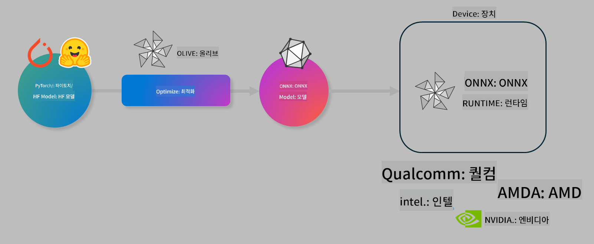

<!--
CO_OP_TRANSLATOR_METADATA:
{
  "original_hash": "6bbe47de3b974df7eea29dfeccf6032b",
  "translation_date": "2025-05-08T05:24:17+00:00",
  "source_file": "md/03.FineTuning/olive-lab/readme.md",
  "language_code": "ko"
}
-->
# Lab. 온디바이스 추론을 위한 AI 모델 최적화

## 소개

> [!IMPORTANT]
> 이 실습에는 **Nvidia A10 또는 A100 GPU**와 관련 드라이버, CUDA 툴킷(버전 12 이상)이 설치되어 있어야 합니다.

> [!NOTE]
> 이 실습은 **35분** 정도 소요되며, OLIVE를 사용해 온디바이스 추론용 모델 최적화의 핵심 개념을 직접 체험할 수 있습니다.

## 학습 목표

이 실습을 완료하면 OLIVE를 사용하여 다음을 수행할 수 있습니다:

- AWQ 양자화 방법을 사용해 AI 모델 양자화하기
- 특정 작업에 맞게 AI 모델 미세 조정하기
- ONNX Runtime에서 효율적인 온디바이스 추론을 위한 LoRA 어댑터(미세 조정된 모델) 생성하기

### Olive란 무엇인가

Olive(*O*NNX *live*)는 ONNX 런타임 +++https://onnxruntime.ai+++에서 실행할 수 있는 모델을 품질과 성능 면에서 최적화하여 제공할 수 있는 모델 최적화 툴킷과 CLI를 함께 제공합니다.



Olive의 입력은 보통 PyTorch 또는 Hugging Face 모델이며, 출력은 ONNX 런타임이 실행되는 디바이스(배포 대상)에서 실행되는 최적화된 ONNX 모델입니다. Olive는 Qualcomm, AMD, Nvidia, Intel과 같은 하드웨어 벤더가 제공하는 AI 가속기(NPU, GPU, CPU)에 맞춰 모델을 최적화합니다.

Olive는 *워크플로우*를 실행하는데, 워크플로우는 *패스*라고 불리는 개별 모델 최적화 작업들의 순차적 집합입니다. 예를 들어 모델 압축, 그래프 캡처, 양자화, 그래프 최적화 등이 있습니다. 각 패스는 최적의 정확도와 지연 시간 등의 지표를 달성할 수 있도록 조정 가능한 파라미터 집합을 가지고 있습니다. Olive는 각 패스를 하나씩 또는 여러 패스를 동시에 자동 조정하는 탐색 알고리즘을 활용한 탐색 전략을 사용합니다.

#### Olive의 장점

- 그래프 최적화, 압축, 양자화에 대한 시행착오식 수동 실험의 번거로움과 시간을 **줄여줍니다**. 품질과 성능 제약 조건을 정의하면 Olive가 자동으로 최적 모델을 찾아줍니다.
- 양자화, 압축, 그래프 최적화, 미세 조정 등 최첨단 기술을 포함한 **40개 이상의 내장 모델 최적화 컴포넌트** 제공
- 일반적인 모델 최적화 작업을 위한 **사용하기 쉬운 CLI** (예: olive quantize, olive auto-opt, olive finetune)
- 모델 패키징 및 배포 기능 내장
- **Multi LoRA 서빙**용 모델 생성 지원
- YAML/JSON을 사용해 모델 최적화 및 배포 작업을 조율하는 워크플로우 구성 가능
- **Hugging Face** 및 **Azure AI** 통합
- 비용 절감을 위한 내장 **캐싱** 메커니즘 제공

## 실습 안내
> [!NOTE]
> Azure AI Hub와 프로젝트를 준비하고 Lab 1에 따라 A100 컴퓨트 환경을 설정했는지 확인하세요.

### Step 0: Azure AI 컴퓨트에 연결하기

**VS Code**의 원격 기능을 사용해 Azure AI 컴퓨트에 연결합니다.

1. **VS Code** 데스크톱 앱을 엽니다.
2. **Shift+Ctrl+P**를 눌러 **명령 팔레트**를 엽니다.
3. 명령 팔레트에서 **AzureML - remote: Connect to compute instance in New Window**를 검색합니다.
4. 화면 지시에 따라 Azure 구독, 리소스 그룹, 프로젝트, Lab 1에서 설정한 컴퓨트 이름을 선택해 연결합니다.
5. Azure ML 컴퓨트 노드에 연결되면 **VS Code 왼쪽 하단**에 연결 상태가 표시됩니다 `><Azure ML: Compute Name`

### Step 1: 저장소 클론하기

VS Code에서 **Ctrl+J**를 눌러 터미널을 열고 이 저장소를 클론하세요.

터미널에 다음 프롬프트가 표시됩니다.

```
azureuser@computername:~/cloudfiles/code$ 
```  
솔루션 클론하기

```bash
cd ~/localfiles
git clone https://github.com/microsoft/phi-3cookbook.git
```

### Step 2: VS Code에서 폴더 열기

다음 명령어를 터미널에 입력하면 새 창에서 해당 폴더가 열립니다.

```bash
code phi-3cookbook/code/04.Finetuning/Olive-lab
```

또는 **파일** > **폴더 열기**를 선택해 폴더를 열 수 있습니다.

### Step 3: 의존성 설치

Azure AI 컴퓨트 인스턴스에서 VS Code 터미널을 열고(팁: **Ctrl+J**) 다음 명령어를 실행해 의존성을 설치하세요.

```bash
conda create -n olive-ai python=3.11 -y
conda activate olive-ai
pip install -r requirements.txt
az extension remove -n azure-cli-ml
az extension add -n ml
```

> [!NOTE]
> 모든 의존성 설치에는 약 5분 정도 소요됩니다.

이 실습에서는 Azure AI 모델 카탈로그에서 모델을 다운로드하고 업로드합니다. 모델 카탈로그에 접근하려면 다음 명령어로 Azure에 로그인해야 합니다.

```bash
az login
```

> [!NOTE]
> 로그인 시 구독을 선택하라는 메시지가 표시됩니다. 실습에 제공된 구독을 선택했는지 확인하세요.

### Step 4: Olive 명령어 실행

Azure AI 컴퓨트 인스턴스에서 VS Code 터미널을 열고(팁: **Ctrl+J**) `olive-ai` conda 환경이 활성화되어 있는지 확인하세요.

```bash
conda activate olive-ai
```

다음으로, 명령줄에서 아래 Olive 명령어들을 실행합니다.

1. **데이터 확인:** 예제에서는 Phi-3.5-Mini 모델을 여행 관련 질문에 특화되도록 미세 조정할 예정입니다. 아래 코드는 JSON lines 형식인 데이터셋의 첫 몇 개 레코드를 보여줍니다.

    ```bash
    head data/data_sample_travel.jsonl
    ```

1. **모델 양자화:** 모델 훈련 전에 먼저 Active Aware Quantization (AWQ) +++https://arxiv.org/abs/2306.00978+++ 기법을 사용해 양자화합니다. AWQ는 추론 중 생성되는 활성화를 고려해 모델 가중치를 양자화합니다. 이는 실제 활성화 데이터 분포를 반영하기 때문에 기존 가중치 양자화보다 모델 정확도 보존에 유리합니다.

    ```bash
    olive quantize \
       --model_name_or_path microsoft/Phi-3.5-mini-instruct \
       --trust_remote_code \
       --algorithm awq \
       --output_path models/phi/awq \
       --log_level 1
    ```

    AWQ 양자화 완료까지 **약 8분** 소요되며, 모델 크기는 **약 7.5GB에서 2.5GB로 줄어듭니다**.

    이 실습에서는 Hugging Face에서 모델을 입력하는 방법(예: `microsoft/Phi-3.5-mini-instruct`). However, Olive also allows you to input models from the Azure AI catalog by updating the `model_name_or_path` argument to an Azure AI asset ID (for example:  `azureml://registries/azureml/models/Phi-3.5-mini-instruct/versions/4`). 

1. **Train the model:** Next, the `olive finetune` 명령어로 양자화된 모델을 미세 조정)을 보여줍니다. 미세 조정 전에 양자화하면 미세 조정 과정에서 양자화로 인한 손실 일부를 회복해 정확도가 더 좋아집니다.

    ```bash
    olive finetune \
        --method lora \
        --model_name_or_path models/phi/awq \
        --data_files "data/data_sample_travel.jsonl" \
        --data_name "json" \
        --text_template "<|user|>\n{prompt}<|end|>\n<|assistant|>\n{response}<|end|>" \
        --max_steps 100 \
        --output_path ./models/phi/ft \
        --log_level 1
    ```

    미세 조정(100 스텝) 완료까지 **약 6분** 소요됩니다.

1. **최적화:** 모델 훈련이 완료되면 Olive의 `auto-opt` command, which will capture the ONNX graph and automatically perform a number of optimizations to improve the model performance for CPU by compressing the model and doing fusions. It should be noted, that you can also optimize for other devices such as NPU or GPU by just updating the `--device` and `--provider` 인자를 사용해 모델을 최적화합니다. 이 실습에서는 CPU를 사용합니다.

    ```bash
    olive auto-opt \
       --model_name_or_path models/phi/ft/model \
       --adapter_path models/phi/ft/adapter \
       --device cpu \
       --provider CPUExecutionProvider \
       --use_ort_genai \
       --output_path models/phi/onnx-ao \
       --log_level 1
    ```

    최적화 완료까지 **약 5분** 소요됩니다.

### Step 5: 모델 추론 간단 테스트

모델 추론을 테스트하려면 폴더에 **app.py**라는 파이썬 파일을 만들고 아래 코드를 복사해 붙여넣으세요.

```python
import onnxruntime_genai as og
import numpy as np

print("loading model and adapters...", end="", flush=True)
model = og.Model("models/phi/onnx-ao/model")
adapters = og.Adapters(model)
adapters.load("models/phi/onnx-ao/model/adapter_weights.onnx_adapter", "travel")
print("DONE!")

tokenizer = og.Tokenizer(model)
tokenizer_stream = tokenizer.create_stream()

params = og.GeneratorParams(model)
params.set_search_options(max_length=100, past_present_share_buffer=False)
user_input = "what is the best thing to see in chicago"
params.input_ids = tokenizer.encode(f"<|user|>\n{user_input}<|end|>\n<|assistant|>\n")

generator = og.Generator(model, params)

generator.set_active_adapter(adapters, "travel")

print(f"{user_input}")

while not generator.is_done():
    generator.compute_logits()
    generator.generate_next_token()

    new_token = generator.get_next_tokens()[0]
    print(tokenizer_stream.decode(new_token), end='', flush=True)

print("\n")
```

아래 명령어로 코드를 실행합니다.

```bash
python app.py
```

### Step 6: 모델을 Azure AI에 업로드하기

모델을 Azure AI 모델 저장소에 업로드하면 개발팀 내 다른 구성원과 모델을 공유할 수 있고, 모델 버전 관리도 가능합니다. 모델을 업로드하려면 다음 명령어를 실행하세요.

> [!NOTE]
> `{}` 안에 있는 `resourceGroup`과 Azure AI 프로젝트 이름을 본인 환경에 맞게 수정한 후 명령어를 실행하세요.

```
az ml workspace show
```

또는 +++ai.azure.com+++에 접속해 **관리 센터** > **프로젝트** > **개요**를 선택해 업로드할 수 있습니다.

`{}` 자리에는 리소스 그룹 이름과 Azure AI 프로젝트 이름을 입력하세요.

```bash
az ml model create \
    --name ft-for-travel \
    --version 1 \
    --path ./models/phi/onnx-ao \
    --resource-group {RESOURCE_GROUP_NAME} \
    --workspace-name {PROJECT_NAME}
```

업로드한 모델은 https://ml.azure.com/model/list 에서 확인하고 배포할 수 있습니다.

**면책 조항**:  
이 문서는 AI 번역 서비스 [Co-op Translator](https://github.com/Azure/co-op-translator)를 사용하여 번역되었습니다. 정확성을 위해 최선을 다하고 있으나, 자동 번역에는 오류나 부정확한 부분이 있을 수 있음을 유의하시기 바랍니다. 원본 문서의 원어 버전이 권위 있는 자료로 간주되어야 합니다. 중요한 정보의 경우, 전문적인 사람 번역을 권장합니다. 본 번역 사용으로 인한 오해나 잘못된 해석에 대해 당사는 책임을 지지 않습니다.