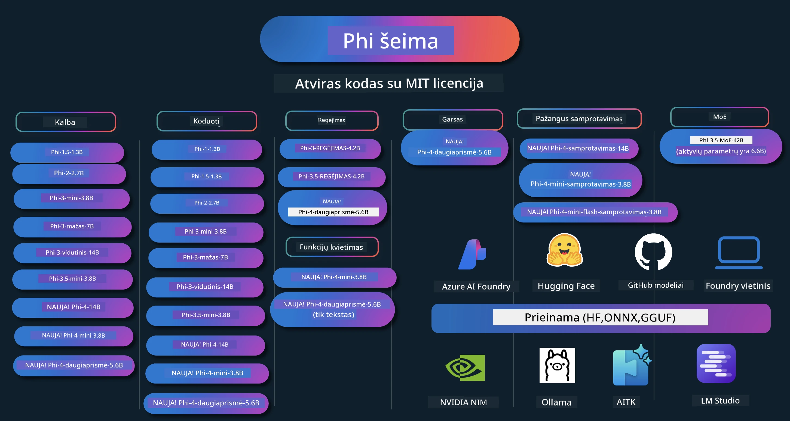

# Phi Vadovėlis: Praktiniai pavyzdžiai su Microsoft Phi modeliais

[](https://codespaces.new/microsoft/phicookbook)
[](https://vscode.dev/redirect?url=vscode://ms-vscode-remote.remote-containers/cloneInVolume?url=https://github.com/microsoft/phicookbook)

[](https://GitHub.com/microsoft/phicookbook/graphs/contributors/?WT.mc_id=aiml-137032-kinfeylo)
[](https://GitHub.com/microsoft/phicookbook/issues/?WT.mc_id=aiml-137032-kinfeylo)
[](https://GitHub.com/microsoft/phicookbook/pulls/?WT.mc_id=aiml-137032-kinfeylo)
[](http://makeapullrequest.com?WT.mc_id=aiml-137032-kinfeylo)

[](https://GitHub.com/microsoft/phicookbook/watchers/?WT.mc_id=aiml-137032-kinfeylo)
[](https://GitHub.com/microsoft/phicookbook/network/?WT.mc_id=aiml-137032-kinfeylo)
[](https://GitHub.com/microsoft/phicookbook/stargazers/?WT.mc_id=aiml-137032-kinfeylo)

[](https://discord.com/invite/ByRwuEEgH4)

Phi yra Microsoft sukurti atviro kodo dirbtinio intelekto modeliai.

Phi šiuo metu yra galingiausias ir ekonomiškai efektyviausias mažųjų kalbų modelis (SLM), turintis labai gerus rezultatus daugakalbėje aplinkoje, loginėje analizėje, teksto/pokalbio generavime, programavime, vaizduose, garse ir kitose sferose.

Galite diegti Phi į debesį arba periferines įrenginius, taip pat lengvai kurti generatyvias DI programas turint ribotą skaičiavimo galią.

Sekite šiuos veiksmus, kad pradėtumėte naudotis šiomis priemonėmis:
1. **Sukurkite šaką (fork) saugykloje**: Spustelėkite [](https://GitHub.com/microsoft/phicookbook/network/?WT.mc_id=aiml-137032-kinfeylo)
2. **Klonuokite saugyklą**: `git clone https://github.com/microsoft/PhiCookBook.git`
3. [**Prisijunkite prie Microsoft AI Discord bendruomenės ir susipažinkite su ekspertais bei kitais kūrėjais**](https://discord.com/invite/ByRwuEEgH4?WT.mc_id=aiml-137032-kinfeylo)



### 🌐 Daugakalbė palaikymas

#### Palaikoma per GitHub Action (Automatizuota ir nuolat atnaujinama)

<!-- CO-OP TRANSLATOR LANGUAGES TABLE START -->
[Arabų](../ar/README.md) | [Bengalų](../bn/README.md) | [Bulgarų](../bg/README.md) | [Burmių (Mjanma)](../my/README.md) | [Kinų (Supaprastinta)](../zh-CN/README.md) | [Kinų (Tradici̇ni̇a, Honk Konga)](../zh-HK/README.md) | [Kinų (Tradici̇ni̇a, Makao)](../zh-MO/README.md) | [Kinų (Tradici̇ni̇a, Taivanas)](../zh-TW/README.md) | [Kroatų](../hr/README.md) | [Čekų](../cs/README.md) | [Danų](../da/README.md) | [Olandų](../nl/README.md) | [Estų](../et/README.md) | [Suomių](../fi/README.md) | [Prancūzų](../fr/README.md) | [Vokiečių](../de/README.md) | [Graikų](../el/README.md) | [Hebrajų](../he/README.md) | [Hindi](../hi/README.md) | [Vengrų](../hu/README.md) | [Indoneziečių](../id/README.md) | [Italų](../it/README.md) | [Japonų](../ja/README.md) | [Kannada](../kn/README.md) | [Korėjiečių](../ko/README.md) | [Lietuvių](./README.md) | [Malajų](../ms/README.md) | [Malajalamių](../ml/README.md) | [Marathi](../mr/README.md) | [Nepaliečių](../ne/README.md) | [Nigerijos pidžino](../pcm/README.md) | [Norvegų](../no/README.md) | [Persų (Farsi)](../fa/README.md) | [Lenkų](../pl/README.md) | [Portugalų (Brazilija)](../pt-BR/README.md) | [Portugalų (Portugalija)](../pt-PT/README.md) | [Punjabi (Gurmukhi)](../pa/README.md) | [Rumunų](../ro/README.md) | [Rusų](../ru/README.md) | [Serbų (Kirilica)](../sr/README.md) | [Slovakų](../sk/README.md) | [Slovėnų](../sl/README.md) | [Ispanų](../es/README.md) | [Svahilio](../sw/README.md) | [Švedų](../sv/README.md) | [Tagalogų (Filipinų)](../tl/README.md) | [Tamilų](../ta/README.md) | [Telugų](../te/README.md) | [Tajų](../th/README.md) | [Turkų](../tr/README.md) | [Ukrainiečių](../uk/README.md) | [Urdu](../ur/README.md) | [Vietnamiečių](../vi/README.md)

> **Norite klonuoti lokaliai?**

> Ši saugykla apima daugiau nei 50 kalbų vertimus, todėl atsisiuntimo dydis žymiai didėja. Norėdami klonuoti be vertimų, naudokite sparse checkout:
> ```bash
> git clone --filter=blob:none --sparse https://github.com/microsoft/PhiCookBook.git
> cd PhiCookBook
> git sparse-checkout set --no-cone '/*' '!translations' '!translated_images'
> ```
> Tai suteiks viską, ko reikia kursui baigti, su daug greitesniu atsisiuntimu.
<!-- CO-OP TRANSLATOR LANGUAGES TABLE END -->

## Turinys

- Įvadas
  - [Sveiki atvykę į Phi šeimą](./md/01.Introduction/01/01.PhiFamily.md)
  - [Aplinkos paruošimas](./md/01.Introduction/01/01.EnvironmentSetup.md)
  - [Svarbiausių technologijų supratimas](./md/01.Introduction/01/01.Understandingtech.md)
  - [Dirbtinio intelekto saugumas Phi modeliams](./md/01.Introduction/01/01.AISafety.md)
  - [Phi techninės įrangos palaikymas](./md/01.Introduction/01/01.Hardwaresupport.md)
  - [Phi modeliai & prieinamumas platformose](./md/01.Introduction/01/01.Edgeandcloud.md)
  - [Guidance-ai ir Phi naudojimas](./md/01.Introduction/01/01.Guidance.md)
  - [GitHub Marketplace modeliai](https://github.com/marketplace/models)
  - [Azure AI modelių katalogas](https://ai.azure.com)

- Phi išvestis skirtingose aplinkose
    -  [Hugging face](./md/01.Introduction/02/01.HF.md)
    -  [GitHub modeliai](./md/01.Introduction/02/02.GitHubModel.md)
    -  [Azure AI Foundry modelių katalogas](./md/01.Introduction/02/03.AzureAIFoundry.md)
    -  [Ollama](./md/01.Introduction/02/04.Ollama.md)
    -  [AI Toolkit VSCode (AITK)](./md/01.Introduction/02/05.AITK.md)
    -  [NVIDIA NIM](./md/01.Introduction/02/06.NVIDIA.md)
    -  [Foundry lokalus](./md/01.Introduction/02/07.FoundryLocal.md)

- Phi šeimos išvestis
    - [Phi išvestis iOS](./md/01.Introduction/03/iOS_Inference.md)
    - [Phi išvestis Android](./md/01.Introduction/03/Android_Inference.md)
    - [Phi išvestis Jetson](./md/01.Introduction/03/Jetson_Inference.md)
    - [Phi išvestis AI PC](./md/01.Introduction/03/AIPC_Inference.md)
    - [Phi išvestis su Apple MLX framework](./md/01.Introduction/03/MLX_Inference.md)
    - [Phi išvestis vietiniame serveryje](./md/01.Introduction/03/Local_Server_Inference.md)
    - [Phi išvestis nuotoliniame serveryje naudojant AI Toolkit](./md/01.Introduction/03/Remote_Interence.md)
    - [Phi išvestis su Rust](./md/01.Introduction/03/Rust_Inference.md)
    - [Phi išvestis -- vizija vietoje](./md/01.Introduction/03/Vision_Inference.md)
    - [Phi išvestis su Kaito AKS, Azure konteineriai (oficialus palaikymas)](./md/01.Introduction/03/Kaito_Inference.md)
-  [Phi šeimos kiekybinimas](./md/01.Introduction/04/QuantifyingPhi.md)
    - [Phi-3.5 / 4 kiekybinimas naudojant llama.cpp](./md/01.Introduction/04/UsingLlamacppQuantifyingPhi.md)
    - [Phi-3.5 / 4 kiekybinimas naudojant Generative AI praplėtimus onnxruntime](./md/01.Introduction/04/UsingORTGenAIQuantifyingPhi.md)
    - [Phi-3.5 / 4 kiekybinimas naudojant Intel OpenVINO](./md/01.Introduction/04/UsingIntelOpenVINOQuantifyingPhi.md)
    - [Phi-3.5 / 4 kiekybinimas naudojant Apple MLX framework](./md/01.Introduction/04/UsingAppleMLXQuantifyingPhi.md)

-  Phi vertinimas
    - [Atsakingas DI](./md/01.Introduction/05/ResponsibleAI.md)
    - [Azure AI Foundry vertinimui](./md/01.Introduction/05/AIFoundry.md)
    - [Vertinimui naudojant Promptflow](./md/01.Introduction/05/Promptflow.md)
 
- RAG su Azure AI paieška
    - [Kaip naudoti Phi-4-mini ir Phi-4-multimodal(RAG) su Azure AI paieška](https://github.com/microsoft/PhiCookBook/blob/main/code/06.E2E/E2E_Phi-4-RAG-Azure-AI-Search.ipynb)

- Phi programų kūrimo pavyzdžiai
  - Teksto ir pokalbių programos
    - Phi-4 pavyzdžiai 🆕
      - [📓] [Pokalbis su Phi-4-mini ONNX modeliu](./md/02.Application/01.TextAndChat/Phi4/ChatWithPhi4ONNX/README.md)
      - [Pokalbis su Phi-4 vietiniu ONNX modeliu .NET](../../md/04.HOL/dotnet/src/LabsPhi4-Chat-01OnnxRuntime)
      - [Pokalbių .NET konsolės programa su Phi-4 ONNX naudojant Semantic Kernel](../../md/04.HOL/dotnet/src/LabsPhi4-Chat-02SK)
    - Phi-3 / 3.5 pavyzdžiai
      - [Vietinis pokalbių robotas naršyklėje naudojant Phi3, ONNX Runtime Web ir WebGPU](https://github.com/microsoft/onnxruntime-inference-examples/tree/main/js/chat)
      - [OpenVINO pokalbis](./md/02.Application/01.TextAndChat/Phi3/E2E_OpenVino_Chat.md)
      - [Daugiamodelis - Interaktyvus Phi-3-mini ir OpenAI Whisper](./md/02.Application/01.TextAndChat/Phi3/E2E_Phi-3-mini_with_whisper.md)
      - [MLFlow - Apvado kūrimas ir Phi-3 naudojimas su MLFlow](./md//02.Application/01.TextAndChat/Phi3/E2E_Phi-3-MLflow.md)
      - [Modelio optimizavimas - Kaip optimizuoti Phi-3-min modelį ONNX Runtime Web naudojimui su Olive](https://github.com/microsoft/Olive/tree/main/examples/phi3)
      - [WinUI3 programa su Phi-3 mini-4k-instruct-onnx](https://github.com/microsoft/Phi3-Chat-WinUI3-Sample/)
      -[WinUI3 Daugiamodelių DI varoma užrašų programėlės pavyzdys](https://github.com/microsoft/ai-powered-notes-winui3-sample)
      - [Fine-tune ir integruokite pasirinktinius Phi-3 modelius su Prompt flow](./md/02.Application/01.TextAndChat/Phi3/E2E_Phi-3-FineTuning_PromptFlow_Integration.md)
      - [Fine-tune ir integruokite pasirinktinius Phi-3 modelius su Prompt flow Azure AI Foundry aplinkoje](./md/02.Application/01.TextAndChat/Phi3/E2E_Phi-3-FineTuning_PromptFlow_Integration_AIFoundry.md)
      - [Įvertinkite fine-tuned Phi-3 / Phi-3.5 modelį Azure AI Foundry, akcentuojant Microsoft atsakingos DI principus](./md/02.Application/01.TextAndChat/Phi3/E2E_Phi-3-Evaluation_AIFoundry.md)
      - [📓] [Phi-3.5-mini-instruct kalbos prognozavimo pavyzdys (kinų/anglų)](./md/02.Application/01.TextAndChat/Phi3/phi3-instruct-demo.ipynb)
      - [Phi-3.5-Instruct WebGPU RAG chatbotas](./md/02.Application/01.TextAndChat/Phi3/WebGPUWithPhi35Readme.md)
      - [Windows GPU naudojimas kuriant Prompt flow sprendimą su Phi-3.5-Instruct ONNX](./md/02.Application/01.TextAndChat/Phi3/UsingPromptFlowWithONNX.md)
      - [Microsoft Phi-3.5 tflite naudojimas Android programos kūrimui](./md/02.Application/01.TextAndChat/Phi3/UsingPhi35TFLiteCreateAndroidApp.md)
      - [Klausimų ir atsakymų .NET pavyzdys naudojant vietinį ONNX Phi-3 modelį su Microsoft.ML.OnnxRuntime](../../md/04.HOL/dotnet/src/LabsPhi301)
      - [Konsolinė pokalbių .NET programa su Semantic Kernel ir Phi-3](../../md/04.HOL/dotnet/src/LabsPhi302)

  - Azure AI Inference SDK kodo pavyzdžiai 
    - Phi-4 pavyzdžiai 🆕
      - [📓] [Projektų kodo generavimas naudojant Phi-4-multimodal](./md/02.Application/02.Code/Phi4/GenProjectCode/README.md)
    - Phi-3 / 3.5 pavyzdžiai
      - [Sukurkite savo Visual Studio Code GitHub Copilot pokalbį su Microsoft Phi-3 šeima](./md/02.Application/02.Code/Phi3/VSCodeExt/README.md)
      - [Sukurkite savo Visual Studio Code Chat Copilot Agent su Phi-3.5 naudojant GitHub modelius](/md/02.Application/02.Code/Phi3/CreateVSCodeChatAgentWithGitHubModels.md)

  - Pažangios loginės išvados pavyzdžiai
    - Phi-4 pavyzdžiai 🆕
      - [📓] [Phi-4-mini-reasoning arba Phi-4-reasoning pavyzdžiai](./md/02.Application/03.AdvancedReasoning/Phi4/AdvancedResoningPhi4mini/README.md)
      - [📓] [Fine-tune Phi-4-mini-reasoning su Microsoft Olive](./md/02.Application/03.AdvancedReasoning/Phi4/AdvancedResoningPhi4mini/olive_ft_phi_4_reasoning_with_medicaldata.ipynb)
      - [📓] [Fine-tune Phi-4-mini-reasoning su Apple MLX](./md/02.Application/03.AdvancedReasoning/Phi4/AdvancedResoningPhi4mini/mlx_ft_phi_4_reasoning_with_medicaldata.ipynb)
      - [📓] [Phi-4-mini-reasoning su GitHub modeliais](./md/02.Application/02.Code/Phi4r/github_models_inference.ipynb)
      - [📓] [Phi-4-mini-reasoning su Azure AI Foundry modeliais](./md/02.Application/02.Code/Phi4r/azure_models_inference.ipynb)
  - Demonstracijos
      - [Phi-4-mini demonstracijos talpinamos Hugging Face Spaces](https://huggingface.co/spaces/microsoft/phi-4-mini?WT.mc_id=aiml-137032-kinfeylo)
      - [Phi-4-multimodal demonstracijos talpinamos Hugging Face Spaces](https://huggingface.co/spaces/microsoft/phi-4-multimodal?WT.mc_id=aiml-137032-kinfeylo)
  - Vizijos pavyzdžiai
    - Phi-4 pavyzdžiai 🆕
      - [📓] [Naudokite Phi-4-multimodal paveikslėliams skaityti ir kodo generavimui](./md/02.Application/04.Vision/Phi4/CreateFrontend/README.md) 
    - Phi-3 / 3.5 pavyzdžiai
      -  [📓][Phi-3-vision - Vaizdo tekstas į tekstą](./md/02.Application/04.Vision/Phi3/E2E_Phi-3-vision-image-text-to-text-online-endpoint.ipynb)
      - [Phi-3-vision-ONNX](https://onnxruntime.ai/docs/genai/tutorials/phi3-v.html)
      - [📓][Phi-3-vision CLIP Embedding](./md/02.Application/04.Vision/Phi3/E2E_Phi-3-vision-image-text-to-text-online-endpoint.ipynb)
      - [DEMO: Phi-3 Perdirbimas](https://github.com/jennifermarsman/PhiRecycling/)
      - [Phi-3-vision - Vizualaus kalbos asistento - su Phi3-Vision ir OpenVINO](https://docs.openvino.ai/nightly/notebooks/phi-3-vision-with-output.html)
      - [Phi-3 Vizija Nvidia NIM](./md/02.Application/04.Vision/Phi3/E2E_Nvidia_NIM_Vision.md)
      - [Phi-3 Vizija OpenVino](./md/02.Application/04.Vision/Phi3/E2E_OpenVino_Phi3Vision.md)
      - [📓][Phi-3.5 Vizija daugiakadris arba daugiavaizdis pavyzdys](./md/02.Application/04.Vision/Phi3/phi3-vision-demo.ipynb)
      - [Phi-3 Vizija Vietinis ONNX modelis naudojant Microsoft.ML.OnnxRuntime .NET](../../md/04.HOL/dotnet/src/LabsPhi303)
      - [Meniu pagrindu veikiantis Phi-3 Vizija Vietinis ONNX modelis naudojant Microsoft.ML.OnnxRuntime .NET](../../md/04.HOL/dotnet/src/LabsPhi304)

  - Matematikos pavyzdžiai
    -  Phi-4-Mini-Flash-Reasoning-Instruct pavyzdžiai 🆕 [Matematikos demonstracija su Phi-4-Mini-Flash-Reasoning-Instruct](./md/02.Application/09.Math/MathDemo.ipynb)

  - Garso pavyzdžiai
    - Phi-4 pavyzdžiai 🆕
      - [📓] [Garso transkriptų išgavimas naudojant Phi-4-multimodal](./md/02.Application/05.Audio/Phi4/Transciption/README.md)
      - [📓] [Phi-4-multimodal garso pavyzdys](./md/02.Application/05.Audio/Phi4/Siri/demo.ipynb)
      - [📓] [Phi-4-multimodal kalbos vertimo pavyzdys](./md/02.Application/05.Audio/Phi4/Translate/demo.ipynb)
      - [.NET konsolinė programa naudojant Phi-4-multimodal garso failo analizei ir transkripto generavimui](../../md/04.HOL/dotnet/src/LabsPhi4-MultiModal-02Audio)

  - MOE pavyzdžiai
    - Phi-3 / 3.5 pavyzdžiai
      - [📓] [Phi-3.5 Ekspertų mišinio modeliai (MoEs) socialinių medijų pavyzdys](./md/02.Application/06.MoE/Phi3/phi3_moe_demo.ipynb)
      - [📓] [Paieškos sustiprinimo generavimo (RAG) grandinės kūrimas su NVIDIA NIM Phi-3 MOE, Azure AI Search ir LlamaIndex](./md/02.Application/06.MoE/Phi3/azure-ai-search-nvidia-rag.ipynb)
      - 
  - Funkcijų kvietimo pavyzdžiai
    - Phi-4 pavyzdžiai 🆕
      -  [📓] [Funkcijų kvietimo naudojimas su Phi-4-mini](./md/02.Application/07.FunctionCalling/Phi4/FunctionCallingBasic/README.md)
      -  [📓] [Funkcijų kvietimo naudojimas kuriant daugiaagentų sistemas su Phi-4-mini](./md/02.Application/07.FunctionCalling/Phi4/Multiagents/Phi_4_mini_multiagent.ipynb)
      -  [📓] [Funkcijų kvietimo naudojimas su Ollama](./md/02.Application/07.FunctionCalling/Phi4/Ollama/ollama_functioncalling.ipynb)
      -  [📓] [Funkcijų kvietimo naudojimas su ONNX](./md/02.Application/07.FunctionCalling/Phi4/ONNX/onnx_parallel_functioncalling.ipynb)
  - Daugiamodelių miksavimo pavyzdžiai
    - Phi-4 pavyzdžiai 🆕
      -  [📓] [Phi-4-multimodal naudojimas kaip technologijų žurnalistas](./md/02.Application/08.Multimodel/Phi4/TechJournalist/phi_4_mm_audio_text_publish_news.ipynb)
      - [.NET konsolinė programa naudojant Phi-4-multimodal paveikslėlių analizei](../../md/04.HOL/dotnet/src/LabsPhi4-MultiModal-01Images)

- Fine-tuning Phi pavyzdžiai
  - [Fine-tuning scenarijai](./md/03.FineTuning/FineTuning_Scenarios.md)
  - [Fine-tuning prieš RAG](./md/03.FineTuning/FineTuning_vs_RAG.md)
  - [Leiskite Phi-3 tapti pramonės ekspertu fine-tuning metu](./md/03.FineTuning/LetPhi3gotoIndustriy.md)
  - [Fine-tuning Phi-3 su AI įrankių rinkiniu VS Code](./md/03.FineTuning/Finetuning_VSCodeaitoolkit.md)
  - [Fine-tuning Phi-3 su Azure Machine Learning paslauga](./md/03.FineTuning/Introduce_AzureML.md)
  - [Fine-tuning Phi-3 su Lora](./md/03.FineTuning/FineTuning_Lora.md)
  - [Fine-tuning Phi-3 su QLora](./md/03.FineTuning/FineTuning_Qlora.md)
  - [Fine-tuning Phi-3 su Azure AI Foundry](./md/03.FineTuning/FineTuning_AIFoundry.md)
  - [Fine-tuning Phi-3 su Azure ML CLI/SDK](./md/03.FineTuning/FineTuning_MLSDK.md)
  - [Fine-tuning su Microsoft Olive](./md/03.FineTuning/FineTuning_MicrosoftOlive.md)
  - [Praktinis Microsoft Olive fine-tuning laboratorinis darbas](./md/03.FineTuning/olive-lab/readme.md)
  - [Fine-tuning Phi-3-vision su Weights and Bias](./md/03.FineTuning/FineTuning_Phi-3-visionWandB.md)
  - [Fine-tuning Phi-3 su Apple MLX sistema](./md/03.FineTuning/FineTuning_MLX.md)
  - [Fine-tuning Phi-3-vision (oficialus palaikymas)](./md/03.FineTuning/FineTuning_Vision.md)
  - [Fine-tuning Phi-3 su Kaito AKS, Azure konteineriais (oficialus palaikymas)](./md/03.FineTuning/FineTuning_Kaito.md)
  - [Fine-tuning Phi-3 ir 3.5 Vizija](https://github.com/2U1/Phi3-Vision-Finetune)

- Praktiniai laboratoriniai darbai
  - [Naujausių modelių tyrinėjimas: LLM, SLM, vietinė vystymas ir daugiau](https://github.com/microsoft/aitour-exploring-cutting-edge-models)
  - [NLP potencialo atskleidimas: Fine-tuning su Microsoft Olive](https://github.com/azure/Ignite_FineTuning_workshop)

- Akademiniai moksliniai darbai ir publikacijos
  - [Vadovėliai yra viskas, ko jums reikia II: phi-1.5 techninis pranešimas](https://arxiv.org/abs/2309.05463)
  - [Phi-3 techninis pranešimas: labai pajėgus kalbos modelis vietoje jūsų telefone](https://arxiv.org/abs/2404.14219)
  - [Phi-4 techninis pranešimas](https://arxiv.org/abs/2412.08905)
  - [Phi-4-Mini techninis pranešimas: kompaktiški, bet galingi daugiamodaliai kalbos modeliai per Mixture-of-LoRAs](https://arxiv.org/abs/2503.01743)
  - [Mažų kalbos modelių optimizavimas funkcijų kvietimui transporto priemonėje](https://arxiv.org/abs/2501.02342)
  - [(WhyPHI) PHI-3 tobulinimas daugybės pasirinkimų klausimams atsakyti: metodika, rezultatai ir iššūkiai](https://arxiv.org/abs/2501.01588)
  - [Phi-4-argumentavimo techninis pranešimas](https://www.microsoft.com/en-us/research/wp-content/uploads/2025/04/phi_4_reasoning.pdf)
  - [Phi-4-mini-argumentavimo techninis pranešimas](https://huggingface.co/microsoft/Phi-4-mini-reasoning/blob/main/Phi-4-Mini-Reasoning.pdf)

## Phi modelių naudojimas

### Phi Azure AI Foundry

Galite sužinoti, kaip naudoti Microsoft Phi ir kaip kurti E2E sprendimus skirtinguose savo aparatinės įrangos įrenginiuose. Norėdami patys išbandyti Phi, pradėkite žaisdami su modeliais ir pritaikydami Phi savo scenarijams naudodamiesi [Azure AI Foundry Azure AI Model Catalog](https://aka.ms/phi3-azure-ai) daugiau galite sužinoti skyriuje Pradžia su [Azure AI Foundry](/md/02.QuickStart/AzureAIFoundry_QuickStart.md)

**Žaidimų aikštelė**
Kiekvienam modeliui yra skirta žaidimų aikštelė modelio testavimui [Azure AI Playground](https://aka.ms/try-phi3).

### Phi GitHub modeliuose

Galite sužinoti, kaip naudoti Microsoft Phi ir kaip kurti E2E sprendimus skirtinguose savo aparatinės įrangos įrenginiuose. Norėdami patys išbandyti Phi, pradėkite žaisdami su modeliu ir pritaikydami Phi savo scenarijams naudodamiesi [GitHub Model Catalog](https://github.com/marketplace/models?WT.mc_id=aiml-137032-kinfeylo) daugiau galite sužinoti skyriuje Pradžia su [GitHub Model Catalog](/md/02.QuickStart/GitHubModel_QuickStart.md)

**Žaidimų aikštelė**
Kiekvienam modeliui yra skirta [žaidimų aikštelė modelio testavimui](/md/02.QuickStart/GitHubModel_QuickStart.md).

### Phi Hugging Face platformoje

Modelį taip pat galite rasti [Hugging Face](https://huggingface.co/microsoft)

**Žaidimų aikštelė**
 [Hugging Chat žaidimų aikštelė](https://huggingface.co/chat/models/microsoft/Phi-3-mini-4k-instruct)

 ## 🎒 Kiti kursai

Mūsų komanda kuria ir kitus kursus! Peržiūrėkite:

<!-- CO-OP TRANSLATOR OTHER COURSES START -->
### LangChain
[](https://aka.ms/langchain4j-for-beginners)
[](https://aka.ms/langchainjs-for-beginners?WT.mc_id=m365-94501-dwahlin)
[](https://github.com/microsoft/langchain-for-beginners?WT.mc_id=m365-94501-dwahlin)
---

### Azure / Edge / MCP / Agentai
[](https://github.com/microsoft/AZD-for-beginners?WT.mc_id=academic-105485-koreyst)
[](https://github.com/microsoft/edgeai-for-beginners?WT.mc_id=academic-105485-koreyst)
[](https://github.com/microsoft/mcp-for-beginners?WT.mc_id=academic-105485-koreyst)
[](https://github.com/microsoft/ai-agents-for-beginners?WT.mc_id=academic-105485-koreyst)

---
 
### Generatyvioji AI serija
[](https://github.com/microsoft/generative-ai-for-beginners?WT.mc_id=academic-105485-koreyst)
[-9333EA?style=for-the-badge&labelColor=E5E7EB&color=9333EA)](https://github.com/microsoft/Generative-AI-for-beginners-dotnet?WT.mc_id=academic-105485-koreyst)
[-C084FC?style=for-the-badge&labelColor=E5E7EB&color=C084FC)](https://github.com/microsoft/generative-ai-for-beginners-java?WT.mc_id=academic-105485-koreyst)
[-E879F9?style=for-the-badge&labelColor=E5E7EB&color=E879F9)](https://github.com/microsoft/generative-ai-with-javascript?WT.mc_id=academic-105485-koreyst)

---
 
### Esminis mokymasis
[](https://aka.ms/ml-beginners?WT.mc_id=academic-105485-koreyst)
[](https://aka.ms/datascience-beginners?WT.mc_id=academic-105485-koreyst)
[](https://aka.ms/ai-beginners?WT.mc_id=academic-105485-koreyst)
[](https://github.com/microsoft/Security-101?WT.mc_id=academic-96948-sayoung)
[](https://aka.ms/webdev-beginners?WT.mc_id=academic-105485-koreyst)
[](https://aka.ms/iot-beginners?WT.mc_id=academic-105485-koreyst)
[](https://github.com/microsoft/xr-development-for-beginners?WT.mc_id=academic-105485-koreyst)

---
 
### Copilot serija
[](https://aka.ms/GitHubCopilotAI?WT.mc_id=academic-105485-koreyst)
[](https://github.com/microsoft/mastering-github-copilot-for-dotnet-csharp-developers?WT.mc_id=academic-105485-koreyst)
[](https://github.com/microsoft/CopilotAdventures?WT.mc_id=academic-105485-koreyst)
<!-- CO-OP TRANSLATOR OTHER COURSES END -->

## Atsakingas DI

Microsoft įsipareigoja padėti savo klientams atsakingai naudoti mūsų DI produktus, dalintis savo įžvalgomis ir kurti pasitikėjimu pagrįstas partnerystes naudodama priemones, tokias kaip Skaidrumo pastabos ir Poveikio vertinimai. Dauguma šių išteklių yra prieinami adresu [https://aka.ms/RAI](https://aka.ms/RAI).
Microsoft požiūris į atsakingą DI grindžiamas mūsų DI principais: sąžiningumas, patikimumas ir saugumas, privatumas ir apsauga, įtrauktis, skaidrumas ir atsakomybė.

Didelio masto natūralios kalbos, vaizdų ir balso modeliai – tokie, kaip naudojami šiame pavyzdyje – gali elgtis neteisingai, nepatikimai ar įžeidžiančiai, kas gali sukelti žalą. Prašome pasitarti su [Azure OpenAI paslaugos Skaidrumo pastaba](https://learn.microsoft.com/legal/cognitive-services/openai/transparency-note?tabs=text), kad sužinotumėte apie rizikas ir apribojimus.

Rekomenduojamas rizikos mažinimo būdas yra įtraukti saugumo sistemą į savo architektūrą, kuri gali aptikti ir užkirsti kelią kenksmingam elgesiui. [Azure AI Content Safety](https://learn.microsoft.com/azure/ai-services/content-safety/overview) suteikia nepriklausomą apsaugos sluoksnį, galintį aptikti kenksmingą vartotojų ir DI sugeneruotą turinį programose ir paslaugose. Azure AI Content Safety apima teksto ir vaizdų API, leidžiančias aptikti kenksmingą medžiagą. Azure AI Foundry, Content Safety paslauga leidžia peržiūrėti, tyrinėti ir išbandyti pavyzdinį kodą, skirtą kenksmingam turiniui aptikti įvairiomis formomis. Ši [greito starto dokumentacija](https://learn.microsoft.com/azure/ai-services/content-safety/quickstart-text?tabs=visual-studio%2Clinux&pivots=programming-language-rest) jums padės atlikti užklausas paslaugai.
Kitas svarbus aspektas yra bendras programos našumas. Naudojant daugiasluoksnes ir daugiamodelines programas, našumas reiškia, kad sistema veikia taip, kaip tikisi jūs ir jūsų vartotojai, įskaitant ir tai, kad nėra generuojami kenksmingi rezultatai. Svarbu įvertinti bendrą programos našumą naudojant [Našumo ir Kokybės bei Rizikos ir Saugos vertintuvus](https://learn.microsoft.com/azure/ai-studio/concepts/evaluation-metrics-built-in). Taip pat galite kurti ir vertinti naudodami [pasirinktinius vertintuvus](https://learn.microsoft.com/azure/ai-studio/how-to/develop/evaluate-sdk#custom-evaluators).

Galite vertinti savo DI programą savo kūrimo aplinkoje naudodami [Azure AI vertinimo SDK](https://microsoft.github.io/promptflow/index.html). Turėdami testinį duomenų rinkinį arba tikslą, jūsų generatyvios DI programos generuojami rezultatai kiekybiškai matuojami naudojant įmontuotus ar pasirinktinius jus dominančius vertintuvus. Norėdami pradėti naudotis azure ai vertinimo sdk savo sistemos vertinimui, galite sekti [greitojo paleidimo gidą](https://learn.microsoft.com/azure/ai-studio/how-to/develop/flow-evaluate-sdk). Kai įvykdysite vertinimo vykdymą, galite [vizualizuoti rezultatus Azure AI Foundry](https://learn.microsoft.com/azure/ai-studio/how-to/evaluate-flow-results).

## Prekių ženklai

Šiame projekte gali būti naudojami prekių ženklai arba logotipai, skirti projektams, produktams ar paslaugoms. Leidžiamas Microsoft prekių ženklų ar logotipų naudojimas priklauso nuo ir turi atitikti [Microsoft prekių ženklų ir prekės ženklo gaires](https://www.microsoft.com/legal/intellectualproperty/trademarks/usage/general).
Microsoft prekių ženklų ar logotipų naudojimas modifikuotose šio projekto versijose neturi sukelti painiavos ar reikšti, kad Microsoft remia projektą. Bet koks trečiųjų šalių prekių ženklų ar logotipų naudojimas priklauso nuo tų trečiųjų šalių politikos.

## Pagalbos gavimas

Jei įstringate arba turite klausimų apie DI programų kūrimą, prisijunkite prie:

[](https://aka.ms/foundry/discord)

Jei turite produkto atsiliepimų arba klaidų statant, apsilankykite:

[](https://aka.ms/foundry/forum)

---

<!-- CO-OP TRANSLATOR DISCLAIMER START -->
**Atsakomybės apribojimas**:
Šis dokumentas buvo išverstas naudojant dirbtinio intelekto vertimo paslaugą [Co-op Translator](https://github.com/Azure/co-op-translator). Nors siekiame tikslumo, prašome atkreipti dėmesį, kad automatizuoti vertimai gali turėti klaidų ar netikslumų. Originalus dokumentas gimtąja kalba turėtų būti laikomas autoritetingu šaltiniu. Esant svarbiai informacijai, rekomenduojamas profesionalus žmogiškas vertimas. Mes neprisiimame atsakomybės už bet kokius nesusipratimus ar klaidingus aiškinimus, kilusius dėl šio vertimo naudojimo.
<!-- CO-OP TRANSLATOR DISCLAIMER END -->