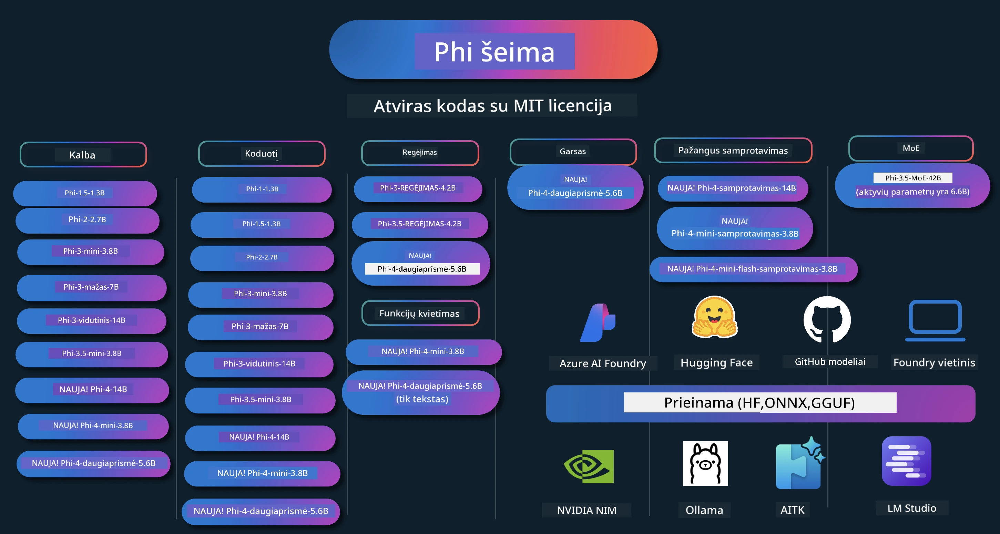

# Phi Virtuvės knyga: Praktiniai pavyzdžiai su Microsoft Phi modeliais

[](https://codespaces.new/microsoft/phicookbook)
[](https://vscode.dev/redirect?url=vscode://ms-vscode-remote.remote-containers/cloneInVolume?url=https://github.com/microsoft/phicookbook)

[](https://GitHub.com/microsoft/phicookbook/graphs/contributors/?WT.mc_id=aiml-137032-kinfeylo)
[](https://GitHub.com/microsoft/phicookbook/issues/?WT.mc_id=aiml-137032-kinfeylo)
[](https://GitHub.com/microsoft/phicookbook/pulls/?WT.mc_id=aiml-137032-kinfeylo)
[](http://makeapullrequest.com?WT.mc_id=aiml-137032-kinfeylo)

[](https://GitHub.com/microsoft/phicookbook/watchers/?WT.mc_id=aiml-137032-kinfeylo)
[](https://GitHub.com/microsoft/phicookbook/network/?WT.mc_id=aiml-137032-kinfeylo)
[](https://GitHub.com/microsoft/phicookbook/stargazers/?WT.mc_id=aiml-137032-kinfeylo)

[](https://discord.com/invite/ByRwuEEgH4)

Phi yra atviro kodo dirbtinio intelekto modelių serija, sukurta Microsoft. 

Phi šiuo metu yra galingiausias ir ekonomiškiausias mažo dydžio kalbos modelis (SLM), turintis labai gerus rezultatus daugiakalbystės, samprotavimo, teksto/pokalbių generavimo, programavimo, vaizdų, garso ir kitose situacijose.

Phi galite įdiegti debesyje arba krašto įrenginiuose, ir galite lengvai kurti generatyvias DI programas turėdami ribotus skaičiavimo išteklius.

Sekite šiuos žingsnius, kad pradėtumėte naudotis šiomis ištekliais:
1. **Fork'inkite repozitoriją**: Spauskite [](https://GitHub.com/microsoft/phicookbook/network/?WT.mc_id=aiml-137032-kinfeylo)
2. **Klonuokite repozitoriją**: `git clone https://github.com/microsoft/PhiCookBook.git`
3. [**Prisijunkite prie Microsoft AI Discord bendruomenės ir susipažinkite su ekspertais bei kolegomis kūrėjais**](https://discord.com/invite/ByRwuEEgH4?WT.mc_id=aiml-137032-kinfeylo)



### 🌐 Daugiakalbė palaikymas

#### Palaikoma per GitHub Action (Automatizuota ir visada atnaujinta)

<!-- CO-OP TRANSLATOR LANGUAGES TABLE START -->
[Arabų](../ar/README.md) | [Bengalų](../bn/README.md) | [Bulgarių](../bg/README.md) | [Birmos (Mianmaras)](../my/README.md) | [Kinų (Supaprastinta)](../zh-CN/README.md) | [Kinų (Tradicinė, Honkongas)](../zh-HK/README.md) | [Kinų (Tradicinė, Makao)](../zh-MO/README.md) | [Kinų (Tradicinė, Taivanas)](../zh-TW/README.md) | [Kroatų](../hr/README.md) | [Čekų](../cs/README.md) | [Danų](../da/README.md) | [Olandų](../nl/README.md) | [Estų](../et/README.md) | [Suomių](../fi/README.md) | [Prancūzų](../fr/README.md) | [Vokiečių](../de/README.md) | [Graikų](../el/README.md) | [Hebrajų](../he/README.md) | [Hindi](../hi/README.md) | [Vengrų](../hu/README.md) | [Indoneziečių](../id/README.md) | [Italų](../it/README.md) | [Japonų](../ja/README.md) | [Kannadų](../kn/README.md) | [Korėjiečių](../ko/README.md) | [Lietuvių](./README.md) | [Malajų](../ms/README.md) | [Malajalamų](../ml/README.md) | [Maratų](../mr/README.md) | [Nepalų](../ne/README.md) | [Nigerijos pidžino](../pcm/README.md) | [Norvegų](../no/README.md) | [Persų (Farsi)](../fa/README.md) | [Lenkų](../pl/README.md) | [Portugalų (Brazilija)](../pt-BR/README.md) | [Portugalų (Portugalija)](../pt-PT/README.md) | [Pandžabų (Gurmukhi)](../pa/README.md) | [Rumunų](../ro/README.md) | [Rusų](../ru/README.md) | [Serbų (Kirilica)](../sr/README.md) | [Slovakų](../sk/README.md) | [Slovėnų](../sl/README.md) | [Ispanų](../es/README.md) | [Suahelio](../sw/README.md) | [Švedų](../sv/README.md) | [Tagalo (Filipinų)](../tl/README.md) | [Tamilų](../ta/README.md) | [Telugų](../te/README.md) | [Tailando](../th/README.md) | [Turkų](../tr/README.md) | [Ukrainiečių](../uk/README.md) | [Urdu](../ur/README.md) | [Vietnamiečių](../vi/README.md)

> **Verčiau klonuoti vietoje?**
>
> Ši repozitorija apima daugiau nei 50 kalbų vertimų, kurie ženkliai padidina atsisiuntimo dydį. Norėdami klonuoti be vertimų, naudokite sparse checkout:
>
> **Bash / macOS / Linux:**
> ```bash
> git clone --filter=blob:none --sparse https://github.com/microsoft/PhiCookBook.git
> cd PhiCookBook
> git sparse-checkout set --no-cone '/*' '!translations' '!translated_images'
> ```
>
> **CMD (Windows):**
> ```cmd
> git clone --filter=blob:none --sparse https://github.com/microsoft/PhiCookBook.git
> cd PhiCookBook
> git sparse-checkout set --no-cone "/*" "!translations" "!translated_images"
> ```
>
> Tai suteikia jums viską, ko reikia kursui užbaigti, su daug greitesniu atsisiuntimu.
<!-- CO-OP TRANSLATOR LANGUAGES TABLE END -->

## Turinys

- Įvadas
  - [Sveiki atvykę į Phi šeimą](./md/01.Introduction/01/01.PhiFamily.md)
  - [Aplinkos paruošimas](./md/01.Introduction/01/01.EnvironmentSetup.md)
  - [Pagrindinių technologijų supratimas](./md/01.Introduction/01/01.Understandingtech.md)
  - [Dirbtinio intelekto sauga Phi modeliams](./md/01.Introduction/01/01.AISafety.md)
  - [Phi aparatinės įrangos palaikymas](./md/01.Introduction/01/01.Hardwaresupport.md)
  - [Phi modeliai ir prieinamumas įvairiose platformose](./md/01.Introduction/01/01.Edgeandcloud.md)
  - [Vadovavimasis guidance-ai ir Phi naudojimu](./md/01.Introduction/01/01.Guidance.md)
  - [GitHub Marketplace modeliai](https://github.com/marketplace/models)
  - [Azure AI modelių katalogas](https://ai.azure.com)

- Phi inferencija skirtingose aplinkose
    -  [Hugging face](./md/01.Introduction/02/01.HF.md)
    -  [GitHub modeliai](./md/01.Introduction/02/02.GitHubModel.md)
    -  [Microsoft Foundry modelių katalogas](./md/01.Introduction/02/03.AzureAIFoundry.md)
    -  [Ollama](./md/01.Introduction/02/04.Ollama.md)
    -  [AI Toolkit VSCode (AITK)](./md/01.Introduction/02/05.AITK.md)
    -  [NVIDIA NIM](./md/01.Introduction/02/06.NVIDIA.md)
    -  [Foundry lokaliai](./md/01.Introduction/02/07.FoundryLocal.md)

- Phi šeimos inferencija
    - [Phi inferencija iOS](./md/01.Introduction/03/iOS_Inference.md)
    - [Phi inferencija Android](./md/01.Introduction/03/Android_Inference.md)
    - [Phi inferencija Jetson](./md/01.Introduction/03/Jetson_Inference.md)
    - [Phi inferencija AI PC](./md/01.Introduction/03/AIPC_Inference.md)
    - [Phi inferencija su Apple MLX sistema](./md/01.Introduction/03/MLX_Inference.md)
    - [Phi inferencija lokaliame serveryje](./md/01.Introduction/03/Local_Server_Inference.md)
    - [Phi inferencija nuotoliniame serveryje naudojant AI Toolkit](./md/01.Introduction/03/Remote_Interence.md)
    - [Phi inferencija su Rust](./md/01.Introduction/03/Rust_Inference.md)
    - [Phi vision inferencija lokaliai](./md/01.Introduction/03/Vision_Inference.md)
    - [Phi inferencija su Kaito AKS, Azure konteineriais (oficialus palaikymas)](./md/01.Introduction/03/Kaito_Inference.md)
-  [Phi šeimos kvantifikavimas](./md/01.Introduction/04/QuantifyingPhi.md)
    - [Phi-3.5 / 4 kvantifikavimas naudojant llama.cpp](./md/01.Introduction/04/UsingLlamacppQuantifyingPhi.md)
    - [Phi-3.5 / 4 kvantifikavimas naudojant generatyvios DI plėtinius onnxruntime](./md/01.Introduction/04/UsingORTGenAIQuantifyingPhi.md)
    - [Phi-3.5 / 4 kvantifikavimas naudojant Intel OpenVINO](./md/01.Introduction/04/UsingIntelOpenVINOQuantifyingPhi.md)
    - [Phi-3.5 / 4 kvantifikavimas naudojant Apple MLX sistemą](./md/01.Introduction/04/UsingAppleMLXQuantifyingPhi.md)

-  Phi vertinimas
    - [Atsakingas DI](./md/01.Introduction/05/ResponsibleAI.md)
    - [Microsoft Foundry vertinimui](./md/01.Introduction/05/AIFoundry.md)
    - [Vertinimas naudojant Promptflow](./md/01.Introduction/05/Promptflow.md)
 
- RAG su Azure AI paieška
    - [Kaip naudoti Phi-4-mini ir Phi-4-multimodal (RAG) su Azure AI paieška](https://github.com/microsoft/PhiCookBook/blob/main/code/06.E2E/E2E_Phi-4-RAG-Azure-AI-Search.ipynb)

- Phi programų kūrimo pavyzdžiai
  - Teksto ir pokalbių programos
    - Phi-4 pavyzdžiai 🆕
      - [📓] [Pokalbis su Phi-4-mini ONNX modeliu](./md/02.Application/01.TextAndChat/Phi4/ChatWithPhi4ONNX/README.md)
      - [Pokalbis su Phi-4 vietiniu ONNX modeliu .NET](../../md/04.HOL/dotnet/src/LabsPhi4-Chat-01OnnxRuntime)
      - [Pokalbių .NET konsolės programa su Phi-4 ONNX naudojant Semantic Kernel](../../md/04.HOL/dotnet/src/LabsPhi4-Chat-02SK)
    - Phi-3 / 3.5 pavyzdžiai
      - [Vietinis pokalbių robotas naršyklėje naudojant Phi3, ONNX Runtime Web ir WebGPU](https://github.com/microsoft/onnxruntime-inference-examples/tree/main/js/chat)
      - [OpenVino Pokalbis](./md/02.Application/01.TextAndChat/Phi3/E2E_OpenVino_Chat.md)
      - [Daugelio modelių - Interaktyvus Phi-3-mini ir OpenAI Whisper](./md/02.Application/01.TextAndChat/Phi3/E2E_Phi-3-mini_with_whisper.md)
      - [MLFlow – Sukurkite apvalkalą ir naudokite Phi-3 su MLFlow](./md//02.Application/01.TextAndChat/Phi3/E2E_Phi-3-MLflow.md)
      - [Modelio optimizavimas – kaip optimizuoti Phi-3-mini modelį ONNX Runtime Web su Olive](https://github.com/microsoft/Olive/tree/main/examples/phi3)
      - [WinUI3 programa su Phi-3 mini-4k-instruct-onnx](https://github.com/microsoft/Phi3-Chat-WinUI3-Sample/)
      -[WinUI3 Multi Model AI varoma užrašų programos pavyzdys](https://github.com/microsoft/ai-powered-notes-winui3-sample)
      - [Tikslinis apmokymas ir pritaikymas su individualiais Phi-3 modeliais naudojant Prompt flow](./md/02.Application/01.TextAndChat/Phi3/E2E_Phi-3-FineTuning_PromptFlow_Integration.md)
      - [Tikslinis apmokymas ir pritaikymas su individualiais Phi-3 modeliais naudojant Prompt flow Microsoft Foundry](./md/02.Application/01.TextAndChat/Phi3/E2E_Phi-3-FineTuning_PromptFlow_Integration_AIFoundry.md)
      - [Įvertinkite tiksliai apmokytą Phi-3 / Phi-3.5 modelį Microsoft Foundry laikantis Microsoft atsakingo AI principų](./md/02.Application/01.TextAndChat/Phi3/E2E_Phi-3-Evaluation_AIFoundry.md)
      - [📓] [Phi-3.5-mini-instruct kalbos prognozės pavyzdys (Kinų/Anglų)](./md/02.Application/01.TextAndChat/Phi3/phi3-instruct-demo.ipynb)
      - [Phi-3.5-Instruct WebGPU RAG pokalbių botas](./md/02.Application/01.TextAndChat/Phi3/WebGPUWithPhi35Readme.md)
      - [Naudojant Windows GPU kurti Prompt flow sprendimą su Phi-3.5-Instruct ONNX](./md/02.Application/01.TextAndChat/Phi3/UsingPromptFlowWithONNX.md)
      - [Naudojant Microsoft Phi-3.5 tflite kurti Android programą](./md/02.Application/01.TextAndChat/Phi3/UsingPhi35TFLiteCreateAndroidApp.md)
      - [Klausimai ir atsakymai .NET pavyzdys naudojant vietinį ONNX Phi-3 modelį su Microsoft.ML.OnnxRuntime](../../md/04.HOL/dotnet/src/LabsPhi301)
      - [Konsolinė pokalbių .NET programa su Semantic Kernel ir Phi-3](../../md/04.HOL/dotnet/src/LabsPhi302)

  - Azure AI Inference SDK pagal kodo pavyzdžius
    - Phi-4 pavyzdžiai 🆕
      - [📓] [Generuoti projekto kodą naudojant Phi-4-multimodal](./md/02.Application/02.Code/Phi4/GenProjectCode/README.md)
    - Phi-3 / 3.5 pavyzdžiai
      - [Sukurkite savo Visual Studio Code GitHub Copilot pokalbį su Microsoft Phi-3 šeima](./md/02.Application/02.Code/Phi3/VSCodeExt/README.md)
      - [Sukurkite savo Visual Studio Code pokalbių Copilot Agent su Phi-3.5 pagal GitHub modelius](/md/02.Application/02.Code/Phi3/CreateVSCodeChatAgentWithGitHubModels.md)

  - Pažangių samprotavimų pavyzdžiai
    - Phi-4 pavyzdžiai 🆕
      - [📓] [Phi-4-mini-samprotavimų arba Phi-4 samprotavimų pavyzdžiai](./md/02.Application/03.AdvancedReasoning/Phi4/AdvancedResoningPhi4mini/README.md)
      - [📓] [Tikslinis Phi-4-mini-samprotavimų apmokymas su Microsoft Olive](./md/02.Application/03.AdvancedReasoning/Phi4/AdvancedResoningPhi4mini/olive_ft_phi_4_reasoning_with_medicaldata.ipynb)
      - [📓] [Tikslinis Phi-4-mini-samprotavimų apmokymas su Apple MLX](./md/02.Application/03.AdvancedReasoning/Phi4/AdvancedResoningPhi4mini/mlx_ft_phi_4_reasoning_with_medicaldata.ipynb)
      - [📓] [Phi-4-mini-samprotavimų su GitHub modeliais](./md/02.Application/02.Code/Phi4r/github_models_inference.ipynb)
      - [📓] [Phi-4-mini-samprotavimų su Microsoft Foundry modeliais](./md/02.Application/02.Code/Phi4r/azure_models_inference.ipynb)
  - Demonstracijos
      - [Phi-4-mini demonstracijos prieinamos Hugging Face Spaces](https://huggingface.co/spaces/microsoft/phi-4-mini?WT.mc_id=aiml-137032-kinfeylo)
      - [Phi-4-multimodal demonstracijos prieinamos Hugging Face Spaces](https://huggingface.co/spaces/microsoft/phi-4-multimodal?WT.mc_id=aiml-137032-kinfeylo)
  - Vaizdo pavyzdžiai
    - Phi-4 pavyzdžiai 🆕
      - [📓] [Naudokite Phi-4-multimodal nuskaityti vaizdus ir generuoti kodą](./md/02.Application/04.Vision/Phi4/CreateFrontend/README.md) 
    - Phi-3 / 3.5 pavyzdžiai
      -  [📓][Phi-3-vaizdo teksto tekstui konvertavimo pavyzdys](./md/02.Application/04.Vision/Phi3/E2E_Phi-3-vision-image-text-to-text-online-endpoint.ipynb)
      - [Phi-3-vaizdas-ONNX](https://onnxruntime.ai/docs/genai/tutorials/phi3-v.html)
      - [📓][Phi-3-vaizdo CLIP įterpimas](./md/02.Application/04.Vision/Phi3/E2E_Phi-3-vision-image-text-to-text-online-endpoint.ipynb)
      - [DEMO: Phi-3 perdirbimas](https://github.com/jennifermarsman/PhiRecycling/)
      - [Phi-3-vaizdas – vizualaus kalbos asistento - su Phi3-Vision ir OpenVINO](https://docs.openvino.ai/nightly/notebooks/phi-3-vision-with-output.html)
      - [Phi-3 Vaizdas Nvidia NIM](./md/02.Application/04.Vision/Phi3/E2E_Nvidia_NIM_Vision.md)
      - [Phi-3 Vaizdas OpenVino](./md/02.Application/04.Vision/Phi3/E2E_OpenVino_Phi3Vision.md)
      - [📓][Phi-3.5 vaizdo daugiasluoksnis ar daugiamatės nuotraukos pavyzdys](./md/02.Application/04.Vision/Phi3/phi3-vision-demo.ipynb)
      - [Phi-3 vaizdo vietinis ONNX modelis naudojant Microsoft.ML.OnnxRuntime .NET](../../md/04.HOL/dotnet/src/LabsPhi303)
      - [Meniu pagrindu Phi-3 Vaizdo vietinis ONNX modelis naudojant Microsoft.ML.OnnxRuntime .NET](../../md/04.HOL/dotnet/src/LabsPhi304)

  - Matematikos pavyzdžiai
    -  Phi-4-mini-Flash-samprotavimų-instrukcijų pavyzdžiai 🆕 [Matematikos demonstracija su Phi-4-mini-Flash-samprotavimų-instrukcijų](./md/02.Application/09.Math/MathDemo.ipynb)

  - Garso pavyzdžiai
    - Phi-4 pavyzdžiai 🆕
      - [📓] [Ištraukti garso transkripcijas naudojant Phi-4-multimodal](./md/02.Application/05.Audio/Phi4/Transciption/README.md)
      - [📓] [Phi-4-multimodal garso pavyzdys](./md/02.Application/05.Audio/Phi4/Siri/demo.ipynb)
      - [📓] [Phi-4-multimodal kalbos vertimo pavyzdys](./md/02.Application/05.Audio/Phi4/Translate/demo.ipynb)
      - [.NET konsolinė programa naudojant Phi-4-multimodal garso failo analizavimui ir transkripcijos generavimui](../../md/04.HOL/dotnet/src/LabsPhi4-MultiModal-02Audio)

  - MOE pavyzdžiai
    - Phi-3 / 3.5 pavyzdžiai
      - [📓] [Phi-3.5 Ekspertų mišiniai modelių (MoEs) socialinių tinklų pavyzdys](./md/02.Application/06.MoE/Phi3/phi3_moe_demo.ipynb)
      - [📓] [Kūriant paieškos papildytos generavimo (RAG) sistemą su NVIDIA NIM Phi-3 MOE, Azure AI Search ir LlamaIndex](./md/02.Application/06.MoE/Phi3/azure-ai-search-nvidia-rag.ipynb)
      - 
  - Funkcijų kvietimų pavyzdžiai
    - Phi-4 pavyzdžiai 🆕
      -  [📓] [Funkcijų kvietimų naudojimas su Phi-4-mini](./md/02.Application/07.FunctionCalling/Phi4/FunctionCallingBasic/README.md)
      -  [📓] [Funkcijų kvietimų naudojimas kuriant kelių agentų sistemas su Phi-4-mini](./md/02.Application/07.FunctionCalling/Phi4/Multiagents/Phi_4_mini_multiagent.ipynb)
      -  [📓] [Funkcijų kvietimų naudojimas su Ollama](./md/02.Application/07.FunctionCalling/Phi4/Ollama/ollama_functioncalling.ipynb)
      -  [📓] [Funkcijų kvietimų naudojimas su ONNX](./md/02.Application/07.FunctionCalling/Phi4/ONNX/onnx_parallel_functioncalling.ipynb)
  - Daugiapakopio maišymo pavyzdžiai
    - Phi-4 pavyzdžiai 🆕
      -  [📓] [Phi-4-multimodal kaip technologijų žurnalistas](./md/02.Application/08.Multimodel/Phi4/TechJournalist/phi_4_mm_audio_text_publish_news.ipynb)
      - [.NET konsolinė programa naudojant Phi-4-multimodal vaizdų analizei](../../md/04.HOL/dotnet/src/LabsPhi4-MultiModal-01Images)

- Tikslinio apmokymo Phi pavyzdžiai
  - [Tikslinio apmokymo scenarijai](./md/03.FineTuning/FineTuning_Scenarios.md)
  - [Tikslinis apmokymas vs RAG](./md/03.FineTuning/FineTuning_vs_RAG.md)
  - [Tikslinis apmokymas – leiskite Phi-3 tapti pramonės ekspertu](./md/03.FineTuning/LetPhi3gotoIndustriy.md)
  - [Tikslinis apmokymas Phi-3 su AI įrankių rinkiniu VS Code](./md/03.FineTuning/Finetuning_VSCodeaitoolkit.md)
  - [Tikslinis apmokymas Phi-3 su Azure Machine Learning Service](./md/03.FineTuning/Introduce_AzureML.md)
  - [Tikslinis apmokymas Phi-3 su Lora](./md/03.FineTuning/FineTuning_Lora.md)
  - [Tikslinis apmokymas Phi-3 su QLora](./md/03.FineTuning/FineTuning_Qlora.md)
  - [Tikslinis apmokymas Phi-3 su Microsoft Foundry](./md/03.FineTuning/FineTuning_AIFoundry.md)
  - [Tikslinis apmokymas Phi-3 su Azure ML CLI/SDK](./md/03.FineTuning/FineTuning_MLSDK.md)
  - [Tikslinis apmokymas su Microsoft Olive](./md/03.FineTuning/FineTuning_MicrosoftOlive.md)
  - [Tikslinis apmokymas su Microsoft Olive praktinis užsiėmimas](./md/03.FineTuning/olive-lab/readme.md)
  - [Tikslinis apmokymas Phi-3-vaizdu su Weights and Bias](./md/03.FineTuning/FineTuning_Phi-3-visionWandB.md)
  - [Tikslinis apmokymas Phi-3 su Apple MLX sistema](./md/03.FineTuning/FineTuning_MLX.md)
  - [Tikslinis apmokymas Phi-3-vaizdu (oficiali parama)](./md/03.FineTuning/FineTuning_Vision.md)
  - [Tikslinis apmokymas Phi-3 su Kaito AKS, Azure konteineriais (oficiali parama)](./md/03.FineTuning/FineTuning_Kaito.md)
  - [Tikslinis apmokymas Phi-3 ir 3.5 vaizdu](https://github.com/2U1/Phi3-Vision-Finetune)

- Praktinis užsiėmimas
  - [Naujausių modelių tyrinėjimas: LLM, SLM, vietinė plėtra ir dar daugiau](https://github.com/microsoft/aitour-exploring-cutting-edge-models)
  - [Išlaisvinkite NLP potencialą: tikslinis apmokymas su Microsoft Olive](https://github.com/azure/Ignite_FineTuning_workshop)
- Akademiniai tyrimai ir publikacijos
  - [Textbooks Are All You Need II: phi-1.5 techninis pranešimas](https://arxiv.org/abs/2309.05463)
  - [Phi-3 techninis pranešimas: itin pajėgus kalbos modelis vietoje jūsų telefone](https://arxiv.org/abs/2404.14219)
  - [Phi-4 techninis pranešimas](https://arxiv.org/abs/2412.08905)
  - [Phi-4-Mini techninis pranešimas: kompaktiški, bet galingi multimodaliniai kalbos modeliai per LoRA mišinius](https://arxiv.org/abs/2503.01743)
  - [Mažų kalbos modelių optimizavimas funkcijų iškvietimui transporto priemonėse](https://arxiv.org/abs/2501.02342)
  - [(WhyPHI) PHI-3 detalesnis pritaikymas daugiapriešinių klausimų atsakymui: metodika, rezultatai ir iššūkiai](https://arxiv.org/abs/2501.01588)
  - [Phi-4-proto švietimo techninis pranešimas](https://www.microsoft.com/en-us/research/wp-content/uploads/2025/04/phi_4_reasoning.pdf)
  - [Phi-4-mini-proto švietimo techninis pranešimas](https://huggingface.co/microsoft/Phi-4-mini-reasoning/blob/main/Phi-4-Mini-Reasoning.pdf)

## Phi modelių naudojimas

### Phi su Microsoft Foundry

Galite sužinoti, kaip naudoti Microsoft Phi ir kaip kurti E2E sprendimus savo skirtinguose įrenginiuose. Norėdami patirti Phi patys, pradėkite žaisti su modeliais ir pritaikyti Phi savo scenarijams naudodami [Microsoft Foundry Azure AI Model Catalog](https://aka.ms/phi3-azure-ai). Daugiau sužinokite apie tai pradžioje su [Microsoft Foundry](/md/02.QuickStart/AzureAIFoundry_QuickStart.md)

**Žaidimų aikštelė**
Kiekvienas modelis turi skirtą žaidimų aikštelę modeliui išbandyti [Azure AI Playground](https://aka.ms/try-phi3).

### Phi su GitHub modeliais

Galite sužinoti, kaip naudoti Microsoft Phi ir kaip kurti E2E sprendimus savo skirtinguose įrenginiuose. Norėdami patirti Phi patys, pradėkite eksperimentuoti su modeliu ir pritaikyti Phi savo scenarijams naudodami [GitHub Model Catalog](https://github.com/marketplace/models?WT.mc_id=aiml-137032-kinfeylo). Daugiau sužinokite pradžioje su [GitHub Model Catalog](/md/02.QuickStart/GitHubModel_QuickStart.md)

**Žaidimų aikštelė**
Kiekvienas modelis turi skirtą [žaidimų aikštelę modeliui išbandyti](/md/02.QuickStart/GitHubModel_QuickStart.md).

### Phi su Hugging Face

Modelį taip pat galite rasti [Hugging Face](https://huggingface.co/microsoft)

**Žaidimų aikštelė**  
[Hugging Chat žaidimų aikštelė](https://huggingface.co/chat/models/microsoft/Phi-3-mini-4k-instruct)

## 🎒 Kiti kursai

Mūsų komanda kuria ir kitus kursus! Peržiūrėkite:

<!-- CO-OP TRANSLATOR OTHER COURSES START -->
### LangChain
[](https://aka.ms/langchain4j-for-beginners)
[](https://aka.ms/langchainjs-for-beginners?WT.mc_id=m365-94501-dwahlin)
[](https://github.com/microsoft/langchain-for-beginners?WT.mc_id=m365-94501-dwahlin)
---

### Azure / Edge / MCP / Agentai
[](https://github.com/microsoft/AZD-for-beginners?WT.mc_id=academic-105485-koreyst)
[](https://github.com/microsoft/edgeai-for-beginners?WT.mc_id=academic-105485-koreyst)
[](https://github.com/microsoft/mcp-for-beginners?WT.mc_id=academic-105485-koreyst)
[](https://github.com/microsoft/ai-agents-for-beginners?WT.mc_id=academic-105485-koreyst)

---
 
### Generatyvinis AI serija
[](https://github.com/microsoft/generative-ai-for-beginners?WT.mc_id=academic-105485-koreyst)
[-9333EA?style=for-the-badge&labelColor=E5E7EB&color=9333EA)](https://github.com/microsoft/Generative-AI-for-beginners-dotnet?WT.mc_id=academic-105485-koreyst)
[-C084FC?style=for-the-badge&labelColor=E5E7EB&color=C084FC)](https://github.com/microsoft/generative-ai-for-beginners-java?WT.mc_id=academic-105485-koreyst)
[-E879F9?style=for-the-badge&labelColor=E5E7EB&color=E879F9)](https://github.com/microsoft/generative-ai-with-javascript?WT.mc_id=academic-105485-koreyst)

---
 
### Pagrindinis mokymasis
[](https://aka.ms/ml-beginners?WT.mc_id=academic-105485-koreyst)
[](https://aka.ms/datascience-beginners?WT.mc_id=academic-105485-koreyst)
[](https://aka.ms/ai-beginners?WT.mc_id=academic-105485-koreyst)
[](https://github.com/microsoft/Security-101?WT.mc_id=academic-96948-sayoung)
[](https://aka.ms/webdev-beginners?WT.mc_id=academic-105485-koreyst)
[](https://aka.ms/iot-beginners?WT.mc_id=academic-105485-koreyst)
[](https://github.com/microsoft/xr-development-for-beginners?WT.mc_id=academic-105485-koreyst)

---
 
### Copilot serija
[](https://aka.ms/GitHubCopilotAI?WT.mc_id=academic-105485-koreyst)
[](https://github.com/microsoft/mastering-github-copilot-for-dotnet-csharp-developers?WT.mc_id=academic-105485-koreyst)
[](https://github.com/microsoft/CopilotAdventures?WT.mc_id=academic-105485-koreyst)
<!-- CO-OP TRANSLATOR OTHER COURSES END -->

## Atsakingas dirbtinis intelektas

Microsoft įsipareigoja padėti mūsų klientams atsakingai naudoti mūsų DI produktus, dalintis mūsų patirtimi ir kurti pasitikėjimu grįstus partnerystės ryšius per įrankius, tokius kaip Skaidrumo pastabos ir Poveikio vertinimai. Daugelį šių išteklių rasite adresu [https://aka.ms/RAI](https://aka.ms/RAI).  
Microsoft atsakingo DI požiūris remiasi mūsų DI principais: sąžiningumo, patikimumo ir saugumo, privatumą ir saugumą, įtrauktį, skaidrumą bei atsakomybę.

Didelio masto natūralios kalbos, vaizdų ir balso modeliai – tokie, kaip naudojami šiame pavyzdyje – gali elgtis neteisingai, nepatikimai ar įžeidžiančiai, o tai gali sukelti žalą. Prašome susipažinti su [Azure OpenAI paslaugos Skaidrumo pastaba](https://learn.microsoft.com/legal/cognitive-services/openai/transparency-note?tabs=text), kad sužinotumėte apie rizikas ir apribojimus.

Rekomenduojamas rizikų mažinimo būdas – į architektūrą įtraukti saugumo sistemą, galinčią aptikti ir užkirsti kelią kenksmingam elgesiui. [Azure AI Content Safety](https://learn.microsoft.com/azure/ai-services/content-safety/overview) suteikia nepriklausomą apsaugos sluoksnį, galintį aptikti žalingą naudotojų generuotą ir DI generuotą turinį programėlėse ir paslaugose. Azure AI Content Safety apima teksto ir vaizdų API, leidžiančias aptikti kenksmingą turinį. Microsoft Foundry, Content Safety paslauga leidžia peržiūrėti, tyrinėti ir išbandyti pavyzdinį kodą, skirtą kenksmingam turiniui aptikti įvairiose modalitetuose. Ši [greito pradžios dokumentacija](https://learn.microsoft.com/azure/ai-services/content-safety/quickstart-text?tabs=visual-studio%2Clinux&pivots=programming-language-rest) padės jums atlikti užklausas paslaugai.
Kitas aspektas, į kurį reikia atsižvelgti, yra bendra programos našumas. Multi-modalėse ir multi-modelinėse programose našumu laikome tai, kad sistema veikia taip, kaip tikitės jūs ir jūsų vartotojai, įskaitant ir kenksmingų išvesties rezultatų vengimą. Svarbu įvertinti visos jūsų programos veikimą, naudojant [Veikimo, Kokybės, Rizikos ir Saugumo vertintojus](https://learn.microsoft.com/azure/ai-studio/concepts/evaluation-metrics-built-in). Taip pat turite galimybę kurti ir vertinti naudojant [individualius vertintojus](https://learn.microsoft.com/azure/ai-studio/how-to/develop/evaluate-sdk#custom-evaluators).

Galite įvertinti savo AI programą kūrimo aplinkoje naudodami [Azure AI vertinimo SDK](https://microsoft.github.io/promptflow/index.html). Turint testinį duomenų rinkinį arba tikslą, jūsų generuojamos AI programos išvestys kiekybiškai matuojamos su įtaisytų vertintojų arba jūsų pasirinkimų individualių vertintojų pagalba. Norėdami pradėti naudotis azure ai vertinimo sdk, kad įvertintumėte savo sistemą, galite sekti [spartaus pradžios vadovą](https://learn.microsoft.com/azure/ai-studio/how-to/develop/flow-evaluate-sdk). Vykdę vertinimą, galite [vizualizuoti rezultatus Microsoft Foundry](https://learn.microsoft.com/azure/ai-studio/how-to/evaluate-flow-results).

## Prekių ženklai

Šiame projekte gali būti prekių ženklų ar logotipų, susijusių su projektais, produktais ar paslaugomis. Microsoft prekių ženklų ar logotipų naudojimas yra leidžiamas tik laikantis [Microsoft prekių ženklų ir prekės ženklo gairių](https://www.microsoft.com/legal/intellectualproperty/trademarks/usage/general).
Modifikuotose šio projekto versijose Microsoft prekių ženklų ar logotipų naudojimas neturi sukelti painiavos ar teigti, kad Microsoft remia. Bet koks trečiųjų šalių prekių ženklų ar logotipų naudojimas yra reglamentuojamas tų trečiųjų šalių taisyklių.

## Pagalbos gavimas

Jei įstringate arba turite klausimų apie AI programų kūrimą, prisijunkite prie:

[](https://aka.ms/foundry/discord)

Jei turite produktų atsiliepimų arba susiduriate su klaidomis kūrimo metu, apsilankykite:

[](https://aka.ms/foundry/forum)

---

<!-- CO-OP TRANSLATOR DISCLAIMER START -->
**Atsakomybės apribojimas**:
Šis dokumentas buvo išverstas naudojant dirbtinio intelekto vertimo paslaugą [Co-op Translator](https://github.com/Azure/co-op-translator). Nors siekiame tikslumo, prašome atkreipti dėmesį, kad automatiniai vertimai gali turėti klaidų ar netikslumų. Originalus dokumentas gimtąja kalba turi būti laikomas autoritetingu šaltiniu. Esant svarbiai informacijai, rekomenduojama pasinaudoti profesionaliomis žmogaus vertimo paslaugomis. Mes neatsakome už bet kokius nesusipratimus ar klaidingus aiškinimus, kylantčius dėl šio vertimo naudojimo.
<!-- CO-OP TRANSLATOR DISCLAIMER END -->