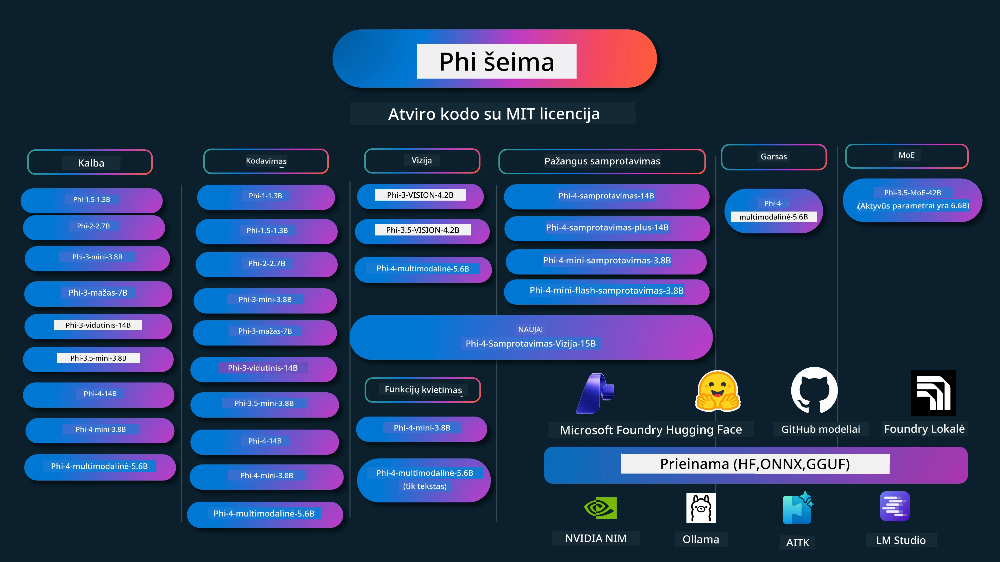

# Phi Vartojimo vadovas: Praktiniai pavyzdžiai su Microsoft Phi modeliais

[](https://codespaces.new/microsoft/phicookbook)
[](https://vscode.dev/redirect?url=vscode://ms-vscode-remote.remote-containers/cloneInVolume?url=https://github.com/microsoft/phicookbook)

[](https://GitHub.com/microsoft/phicookbook/graphs/contributors/?WT.mc_id=aiml-137032-kinfeylo)
[](https://GitHub.com/microsoft/phicookbook/issues/?WT.mc_id=aiml-137032-kinfeylo)
[](https://GitHub.com/microsoft/phicookbook/pulls/?WT.mc_id=aiml-137032-kinfeylo)
[](http://makeapullrequest.com?WT.mc_id=aiml-137032-kinfeylo)

[](https://GitHub.com/microsoft/phicookbook/watchers/?WT.mc_id=aiml-137032-kinfeylo)
[](https://GitHub.com/microsoft/phicookbook/network/?WT.mc_id=aiml-137032-kinfeylo)
[](https://GitHub.com/microsoft/phicookbook/stargazers/?WT.mc_id=aiml-137032-kinfeylo)

[](https://discord.com/invite/ByRwuEEgH4)

Phi yra atvirojo kodo DI modelių serija, sukurta Microsoft. 

Šiuo metu Phi yra galingiausias ir ekonomiškiausias mažas kalbos modelis (SLM), turintis puikius rezultatus daugeliu kalbų, loginio mąstymo, teksto/pokalbio generavimo, programavimo, vaizdų, garso ir kitose srityse.

Galite diegti Phi debesyje arba kraštinėse įrenginiuose, ir lengvai kurti generatyvias DI programas su ribotais skaičiavimo ištekliais.

Sekite šiuos žingsnius, kad pradėtumėte naudotis šiais ištekliais:
1. **Šakoti saugyklą**: Spauskite [](https://GitHub.com/microsoft/phicookbook/network/?WT.mc_id=aiml-137032-kinfeylo)
2. **Klonuoti saugyklą**:   `git clone https://github.com/microsoft/PhiCookBook.git`
3. [**Prisijunkite prie Microsoft DI Discord bendruomenės ir susipažinkite su ekspertais bei kitais kūrėjais**](https://discord.com/invite/ByRwuEEgH4?WT.mc_id=aiml-137032-kinfeylo)



### 🌐 Daugiakalbė palaikymas

#### Palaikoma per GitHub Action (automatizuota ir visada atnaujinama)

<!-- CO-OP TRANSLATOR LANGUAGES TABLE START -->
[Arabic](../ar/README.md) | [Bengali](../bn/README.md) | [Bulgarian](../bg/README.md) | [Burmese (Myanmar)](../my/README.md) | [Chinese (Simplified)](../zh-CN/README.md) | [Chinese (Traditional, Hong Kong)](../zh-HK/README.md) | [Chinese (Traditional, Macau)](../zh-MO/README.md) | [Chinese (Traditional, Taiwan)](../zh-TW/README.md) | [Croatian](../hr/README.md) | [Czech](../cs/README.md) | [Danish](../da/README.md) | [Dutch](../nl/README.md) | [Estonian](../et/README.md) | [Finnish](../fi/README.md) | [French](../fr/README.md) | [German](../de/README.md) | [Greek](../el/README.md) | [Hebrew](../he/README.md) | [Hindi](../hi/README.md) | [Hungarian](../hu/README.md) | [Indonesian](../id/README.md) | [Italian](../it/README.md) | [Japanese](../ja/README.md) | [Kannada](../kn/README.md) | [Khmer](../km/README.md) | [Korean](../ko/README.md) | [Lithuanian](./README.md) | [Malay](../ms/README.md) | [Malayalam](../ml/README.md) | [Marathi](../mr/README.md) | [Nepali](../ne/README.md) | [Nigerian Pidgin](../pcm/README.md) | [Norwegian](../no/README.md) | [Persian (Farsi)](../fa/README.md) | [Polish](../pl/README.md) | [Portuguese (Brazil)](../pt-BR/README.md) | [Portuguese (Portugal)](../pt-PT/README.md) | [Punjabi (Gurmukhi)](../pa/README.md) | [Romanian](../ro/README.md) | [Russian](../ru/README.md) | [Serbian (Cyrillic)](../sr/README.md) | [Slovak](../sk/README.md) | [Slovenian](../sl/README.md) | [Spanish](../es/README.md) | [Swahili](../sw/README.md) | [Swedish](../sv/README.md) | [Tagalog (Filipino)](../tl/README.md) | [Tamil](../ta/README.md) | [Telugu](../te/README.md) | [Thai](../th/README.md) | [Turkish](../tr/README.md) | [Ukrainian](../uk/README.md) | [Urdu](../ur/README.md) | [Vietnamese](../vi/README.md)

> **Norite klonuoti vietoje?**
>
> Ši saugykla turi daugiau nei 50 vertimų, kurie ženkliai padidina atsisiuntimo dydį. Norėdami klonuoti be vertimų, naudokite sparse checkout:
>
> **Bash / macOS / Linux:**
> ```bash
> git clone --filter=blob:none --sparse https://github.com/microsoft/PhiCookBook.git
> cd PhiCookBook
> git sparse-checkout set --no-cone '/*' '!translations' '!translated_images'
> ```
>
> **CMD (Windows):**
> ```cmd
> git clone --filter=blob:none --sparse https://github.com/microsoft/PhiCookBook.git
> cd PhiCookBook
> git sparse-checkout set --no-cone "/*" "!translations" "!translated_images"
> ```
>
> Tai suteiks viską, ko reikia kursui, su daug greitesniu atsisiuntimu.
<!-- CO-OP TRANSLATOR LANGUAGES TABLE END -->

## Turinys
- Įvadas - [Sveiki atvykę į Phi šeimą](./md/01.Introduction/01/01.PhiFamily.md) - [Aplinkos nustatymas](./md/01.Introduction/01/01.EnvironmentSetup.md) - [Svarbiausių technologijų supratimas](./md/01.Introduction/01/01.Understandingtech.md) - [Dirbtinio intelekto saugumas Phi modeliams](./md/01.Introduction/01/01.AISafety.md) - [Phi aparatinės įrangos palaikymas](./md/01.Introduction/01/01.Hardwaresupport.md) - [Phi modeliai ir jų prieinamumas skirtingose platformose](./md/01.Introduction/01/01.Edgeandcloud.md) - [Guidance-ai ir Phi naudojimas](./md/01.Introduction/01/01.Guidance.md) - [GitHub Marketplace modeliai](https://github.com/marketplace/models) - [Azure AI modelių katalogas](https://ai.azure.com) - Phi prognozavimas skirtingose aplinkose - [Hugging face](./md/01.Introduction/02/01.HF.md) - [GitHub modeliai](./md/01.Introduction/02/02.GitHubModel.md) - [Microsoft Foundry modelių katalogas](./md/01.Introduction/02/03.AzureAIFoundry.md) - [Ollama](./md/01.Introduction/02/04.Ollama.md) - [AI Toolkit VSCode (AITK)](./md/01.Introduction/02/05.AITK.md) - [NVIDIA NIM](./md/01.Introduction/02/06.NVIDIA.md) - [Foundry vietinis naudojimas](./md/01.Introduction/02/07.FoundryLocal.md) - Phi šeimos prognozavimas - [Phi prognozavimas iOS](./md/01.Introduction/03/iOS_Inference.md) - [Phi prognozavimas Android](./md/01.Introduction/03/Android_Inference.md) - [Phi prognozavimas Jetson](./md/01.Introduction/03/Jetson_Inference.md) - [Phi prognozavimas AI PC](./md/01.Introduction/03/AIPC_Inference.md) - [Phi prognozavimas su Apple MLX karkasu](./md/01.Introduction/03/MLX_Inference.md) - [Phi prognozavimas vietiniame serveryje](./md/01.Introduction/03/Local_Server_Inference.md) - [Phi prognozavimas nuotoliniame serveryje naudojant AI Toolkit](./md/01.Introduction/03/Remote_Interence.md) - [Phi prognozavimas su Rust](./md/01.Introduction/03/Rust_Inference.md) - [Phi prognozavimas–Vizija vietoje](./md/01.Introduction/03/Vision_Inference.md) - [Phi prognozavimas su Kaito AKS, Azure konteineriais (oficialus palaikymas)](./md/01.Introduction/03/Kaito_Inference.md) - [Phi šeimos kiekinis vertinimas](./md/01.Introduction/04/QuantifyingPhi.md) - [Phi-3.5 / 4 kiekinis vertinimas naudojant llama.cpp](./md/01.Introduction/04/UsingLlamacppQuantifyingPhi.md) - [Phi-3.5 / 4 kiekinis vertinimas naudojant generatyvius dirbtinio intelekto papildinius onnxruntime](./md/01.Introduction/04/UsingORTGenAIQuantifyingPhi.md) - [Phi-3.5 / 4 kiekinis vertinimas naudojant Intel OpenVINO](./md/01.Introduction/04/UsingIntelOpenVINOQuantifyingPhi.md) - [Phi-3.5 / 4 kiekinis vertinimas naudojant Apple MLX karkasą](./md/01.Introduction/04/UsingAppleMLXQuantifyingPhi.md) - Phi vertinimas - [Atsakingas DI](./md/01.Introduction/05/ResponsibleAI.md) - [Microsoft Foundry vertinimui](./md/01.Introduction/05/AIFoundry.md) - [Promptflow naudojimas vertinimui](./md/01.Introduction/05/Promptflow.md) - RAG su Azure AI paieška - [Kaip naudoti Phi-4-mini ir Phi-4-multimodal (RAG) su Azure AI paieška](https://github.com/microsoft/PhiCookBook/blob/main/code/06.E2E/E2E_Phi-4-RAG-Azure-AI-Search.ipynb) - Phi programų kūrimo pavyzdžiai - Teksto ir pokalbių programos - Phi-4 pavyzdžiai - [📓] [Pokalbis su Phi-4-mini ONNX modeliu](./md/02.Application/01.TextAndChat/Phi4/ChatWithPhi4ONNX/README.md) - [Pokalbis su Phi-4 vietiniu ONNX modeliu .NET](../../md/04.HOL/dotnet/src/LabsPhi4-Chat-01OnnxRuntime) - [Konsolės pokalbių programa .NET su Phi-4 ONNX naudojant Semantikos branduolį](../../md/04.HOL/dotnet/src/LabsPhi4-Chat-02SK) - Phi-3 / 3.5 pavyzdžiai - [Vietinė pokalbių programa naršyklėje naudojant Phi3, ONNX Runtime Web ir WebGPU](https://github.com/microsoft/onnxruntime-inference-examples/tree/main/js/chat) - [OpenVino pokalbis](./md/02.Application/01.TextAndChat/Phi3/E2E_OpenVino_Chat.md) - [Daugmodelių - interaktyvus Phi-3-mini ir OpenAI Whisper](./md/02.Application/01.TextAndChat/Phi3/E2E_Phi-3-mini_with_whisper.md) - [MLFlow - wrapper kūrimas ir Phi-3 naudojimas su MLFlow](./md//02.Application/01.TextAndChat/Phi3/E2E_Phi-3-MLflow.md) - [Modelio optimizavimas - kaip optimizuoti Phi-3-min modelį ONNX Runtime Web su Olive](https://github.com/microsoft/Olive/tree/main/examples/phi3) - [WinUI3 programa su Phi-3 mini-4k-instruct-onnx](https://github.com/microsoft/Phi3-Chat-WinUI3-Sample/) -[WinUI3 daugmodelių DI pastabų programa pavyzdys](https://github.com/microsoft/ai-powered-notes-winui3-sample) - [Individualių Phi-3 modelių tikslinimas ir integravimas su Promptflow](./md/02.Application/01.TextAndChat/Phi3/E2E_Phi-3-FineTuning_PromptFlow_Integration.md) - [Individualių Phi-3 modelių tikslinimas ir integravimas su Promptflow Microsoft Foundry](./md/02.Application/01.TextAndChat/Phi3/E2E_Phi-3-FineTuning_PromptFlow_Integration_AIFoundry.md) - [Individualiai tikslinto Phi-3 / Phi-3.5 modelio vertinimas Microsoft Foundry atsižvelgiant į Microsoft atsakingo DI principus](./md/02.Application/01.TextAndChat/Phi3/E2E_Phi-3-Evaluation_AIFoundry.md) - [📓] [Phi-3.5-mini-instruct kalbos prognozavimo pavyzdys (kinų/anglų kalbomis)](./md/02.Application/01.TextAndChat/Phi3/phi3-instruct-demo.ipynb) - [Phi-3.5-instruct WebGPU RAG pokalbių robotas](./md/02.Application/01.TextAndChat/Phi3/WebGPUWithPhi35Readme.md) - [Windows GPU naudojimas kuriant Prompt flow sprendimą su Phi-3.5-Instruct ONNX](./md/02.Application/01.TextAndChat/Phi3/UsingPromptFlowWithONNX.md) - [Microsoft Phi-3.5 tflite naudojimas Android programos kūrimui](./md/02.Application/01.TextAndChat/Phi3/UsingPhi35TFLiteCreateAndroidApp.md) - [Klausimų ir atsakymų .NET pavyzdys naudojant vietinį ONNX Phi-3 modelį su Microsoft.ML.OnnxRuntime](../../md/04.HOL/dotnet/src/LabsPhi301) - [Konsolės pokalbių .NET programa su semantikos branduoliu ir Phi-3](../../md/04.HOL/dotnet/src/LabsPhi302) - Azure AI prognozavimo SDK kodo pavyzdžiai - Phi-4 pavyzdžiai - [📓] [Projekto kodo generavimas naudojant Phi-4-multimodal](./md/02.Application/02.Code/Phi4/GenProjectCode/README.md) - Phi-3 / 3.5 pavyzdžiai - [Sukurti savo Visual Studio Code GitHub Copilot pokalbių robotą su Microsoft Phi-3 šeima](./md/02.Application/02.Code/Phi3/VSCodeExt/README.md) - [Sukurti savo Visual Studio Code pokalbių Copilot agentą su Phi-3.5 pagal GitHub modelius](/md/02.Application/02.Code/Phi3/CreateVSCodeChatAgentWithGitHubModels.md) - Pažangos samprotavimo pavyzdžiai - Phi-4 pavyzdžiai - [📓] [Phi-4-mini-samprotavimų arba Phi-4-samprotavimų pavyzdžiai](./md/02.Application/03.AdvancedReasoning/Phi4/AdvancedResoningPhi4mini/README.md) - [📓] [Phi-4-mini-samprotavimų tikslinimas su Microsoft Olive](./md/02.Application/03.AdvancedReasoning/Phi4/AdvancedResoningPhi4mini/olive_ft_phi_4_reasoning_with_medicaldata.ipynb) - [📓] [Phi-4-mini-samprotavimų tikslinimas su Apple MLX](./md/02.Application/03.AdvancedReasoning/Phi4/AdvancedResoningPhi4mini/mlx_ft_phi_4_reasoning_with_medicaldata.ipynb) - [📓] [Phi-4-mini-samprotavimų su GitHub modeliais](./md/02.Application/02.Code/Phi4r/github_models_inference.ipynb) - [📓] [Phi-4-mini-samprotavimų su Microsoft Foundry modeliais](./md/02.Application/02.Code/Phi4r/azure_models_inference.ipynb) -
Demonstraicijos - [Phi-4-mini demonstracinės versijos, talpinamos Hugging Face Spaces](https://huggingface.co/spaces/microsoft/phi-4-mini?WT.mc_id=aiml-137032-kinfeylo) - [Phi-4-multimodal demonstracinės versijos, talpinamos Hugginge Face Spaces](https://huggingface.co/spaces/microsoft/phi-4-multimodal?WT.mc_id=aiml-137032-kinfeylo) - Vaizdo pavyzdžiai - Phi-4 pavyzdžiai - [📓] [Naudokite Phi-4-multimodal vaizdų nuskaitymui ir kodo generavimui](./md/02.Application/04.Vision/Phi4/CreateFrontend/README.md) - Phi-3 / 3.5 pavyzdžiai - [📓][Phi-3-vision-Atvaizdo tekstas į tekstą](./md/02.Application/04.Vision/Phi3/E2E_Phi-3-vision-image-text-to-text-online-endpoint.ipynb) - [Phi-3-vision-ONNX](https://onnxruntime.ai/docs/genai/tutorials/phi3-v.html) - [📓][Phi-3-vision CLIP įdėjimas](./md/02.Application/04.Vision/Phi3/E2E_Phi-3-vision-image-text-to-text-online-endpoint.ipynb) - [DEMO: Phi-3 perdirbimas](https://github.com/jennifermarsman/PhiRecycling/) - [Phi-3-vision - Vaizdinės kalbos asistentas - su Phi3-Vision ir OpenVINO](https://docs.openvino.ai/nightly/notebooks/phi-3-vision-with-output.html) - [Phi-3 Vision Nvidia NIM](./md/02.Application/04.Vision/Phi3/E2E_Nvidia_NIM_Vision.md) - [Phi-3 Vision OpenVino](./md/02.Application/04.Vision/Phi3/E2E_OpenVino_Phi3Vision.md) - [📓][Phi-3.5 Vision daugiaekranis ar daugiaatvaizdžių pavyzdys](./md/02.Application/04.Vision/Phi3/phi3-vision-demo.ipynb) - [Phi-3 Vision vietinis ONNX modelis naudojant Microsoft.ML.OnnxRuntime .NET](../../md/04.HOL/dotnet/src/LabsPhi303) - [Meniu pagrindu veikiantis Phi-3 Vision vietinis ONNX modelis naudojant Microsoft.ML.OnnxRuntime .NET](../../md/04.HOL/dotnet/src/LabsPhi304) - Loginio mąstymo vaizdo pavyzdžiai - Phi-4-Loginio mąstymo vaizdas-15B - [📓] [Naudojant Phi-4-Loginio mąstymo vaizdas-15B pėsčiųjų perėjų pažeidimų aptikimui](./md/02.Application/10.ReasoningVision/Phi_4_reasoning_vision_15b_Jaywalking.ipynb) - [📓] [Naudojant Phi-4-Loginio mąstymo vaizdas-15B matematikai](./md/02.Application/10.ReasoningVision/Phi_4_reasoning_vision_15b_Math.ipynb) - [📓] [Naudojant Phi-4-Loginio mąstymo vaizdas-15B vartotojo sąsajos aptikimui](./md/02.Application/10.ReasoningVision/Phi_4_reasoning_vision_15b_ui.ipynb) - Matematikos pavyzdžiai - Phi-4-mini-Flash-Reasoning-Instruct pavyzdžiai [Matematikos demonstracija su Phi-4-Mini-Flash-Reasoning-Instruct](./md/02.Application/09.Math/MathDemo.ipynb) - Garso pavyzdžiai - Phi-4 pavyzdžiai - [📓] [Garso transkriptų išgavimas naudojant Phi-4-multimodal](./md/02.Application/05.Audio/Phi4/Transciption/README.md) - [📓] [Phi-4-multimodal garso pavyzdys](./md/02.Application/05.Audio/Phi4/Siri/demo.ipynb) - [📓] [Phi-4-multimodal kalbos vertimo pavyzdys](./md/02.Application/05.Audio/Phi4/Translate/demo.ipynb) - [.NET konsolės programa, naudojanti Phi-4-multimodal garsui analizuoti ir transkripcijai generuoti](../../md/04.HOL/dotnet/src/LabsPhi4-MultiModal-02Audio) - MOE pavyzdžiai - Phi-3 / 3.5 pavyzdžiai - [📓] [Phi-3.5 Ekspertų mišinio modelių (MoEs) socialinių tinklų pavyzdys](./md/02.Application/06.MoE/Phi3/phi3_moe_demo.ipynb) - [📓] [Retrieval-Augmented Generation (RAG) grandinės kūrimas su NVIDIA NIM Phi-3 MOE, Azure AI Search ir LlamaIndex](./md/02.Application/06.MoE/Phi3/azure-ai-search-nvidia-rag.ipynb) - - Funkcijų kvietimo pavyzdžiai - Phi-4 pavyzdžiai 🆕 - [📓] [Funkcijų kvietimo naudojimas su Phi-4-mini](./md/02.Application/07.FunctionCalling/Phi4/FunctionCallingBasic/README.md) - [📓] [Funkcijų kvietimo naudojimas kuriant daugialypius agentus su Phi-4-mini](./md/02.Application/07.FunctionCalling/Phi4/Multiagents/Phi_4_mini_multiagent.ipynb) - [📓] [Funkcijų kvietimo naudojimas su Ollama](./md/02.Application/07.FunctionCalling/Phi4/Ollama/ollama_functioncalling.ipynb) - [📓] [Funkcijų kvietimo naudojimas su ONNX](./md/02.Application/07.FunctionCalling/Phi4/ONNX/onnx_parallel_functioncalling.ipynb) - Multimodalinio maišymo pavyzdžiai - Phi-4 pavyzdžiai 🆕 - [📓] [Naudojant Phi-4-multimodal kaip technologijų žurnalistą](./md/02.Application/08.Multimodel/Phi4/TechJournalist/phi_4_mm_audio_text_publish_news.ipynb) - [.NET konsolės programa, naudojanti Phi-4-multimodal vaizdų analizei](../../md/04.HOL/dotnet/src/LabsPhi4-MultiModal-01Images) - Phi smulkiojo apmokymo pavyzdžiai - [Smulkiojo apmokymo scenarijai](./md/03.FineTuning/FineTuning_Scenarios.md) - [Smulkusis apmokymas prieš RAG](./md/03.FineTuning/FineTuning_vs_RAG.md) - [Leisk Phi-3 tapti pramonės ekspertu smulkiojo apmokymo metu](./md/03.FineTuning/LetPhi3gotoIndustriy.md) - [Phi-3 smulkusis apmokymas su AI Toolkit for VS Code](./md/03.FineTuning/Finetuning_VSCodeaitoolkit.md) - [Phi-3 smulkusis apmokymas su Azure Machine Learning Service](./md/03.FineTuning/Introduce_AzureML.md) - [Phi-3 smulkusis apmokymas su Lora](./md/03.FineTuning/FineTuning_Lora.md) - [Phi-3 smulkusis apmokymas su QLora](./md/03.FineTuning/FineTuning_Qlora.md) - [Phi-3 smulkusis apmokymas su Microsoft Foundry](./md/03.FineTuning/FineTuning_AIFoundry.md) - [Phi-3 smulkusis apmokymas su Azure ML CLI/SDK](./md/03.FineTuning/FineTuning_MLSDK.md) - [Smulkusis apmokymas su Microsoft Olive](./md/03.FineTuning/FineTuning_MicrosoftOlive.md) - [Microsoft Olive praktinis laboratorinis darbas smulkiam apmokymui](./md/03.FineTuning/olive-lab/readme.md) - [Phi-3-vision smulkusis apmokymas su Weights and Bias](./md/03.FineTuning/FineTuning_Phi-3-visionWandB.md) - [Phi-3 smulkusis apmokymas su Apple MLX Framework](./md/03.FineTuning/FineTuning_MLX.md) - [Phi-3-vision smulkusis apmokymas (oficiali parama)](./md/03.FineTuning/FineTuning_Vision.md) - [Phi-3 smulkusis apmokymas su Kaito AKS, Azure konteineriais (oficiali parama)](./md/03.FineTuning/FineTuning_Kaito.md) - [Phi-3 ir 3.5 Vision smulkusis apmokymas](https://github.com/2U1/Phi3-Vision-Finetune) - Praktinis laboratorinis darbas - [Pažangiausių modelių tyrinėjimas: LLM, SLM, vietinė plėtra ir daugiau](https://github.com/microsoft/aitour-exploring-cutting-edge-models) - [NLP potencialo atrakinimas: smulkusis apmokymas su Microsoft Olive](https://github.com/azure/Ignite_FineTuning_workshop) - Akademiniai tyrimų darbai ir publikacijos - [Visi vadovėliai, ko jums reikia II: phi-1.5 techninė ataskaita](https://arxiv.org/abs/2309.05463) - [Phi-3 techninė ataskaita: itin pajėgus kalbos modelis tiesiog jūsų telefone](https://arxiv.org/abs/2404.14219) - [Phi-4 techninė ataskaita](https://arxiv.org/abs/2412.08905) - [Phi-4-Mini techninė ataskaita: kompaktiški ir galingi multimodaliniai kalbos modeliai naudojant Mixture-of-LoRAs](https://arxiv.org/abs/2503.01743) - [Mažųjų kalbos modelių optimizavimas automobilinėms funkcijų kvietimo sistemoms](https://arxiv.org/abs/2501.02342) - [(WhyPHI) PHI-3 smulkusis apmokymas pasirinkimų klausimams spręsti: metodika, rezultatai ir iššūkiai](https://arxiv.org/abs/2501.01588) - [Phi-4 loginio mąstymo techninė ataskaita](https://www.microsoft.com/en-us/research/wp-content/uploads/2025/04/phi_4_reasoning.pdf)
- [Phi-4-mini-sprendimų techninis pranešimas](https://huggingface.co/microsoft/Phi-4-mini-reasoning/blob/main/Phi-4-Mini-Reasoning.pdf)
# Phi Virtuvės knyga: Praktiniai pavyzdžiai su Microsoft Phi modeliais

[](https://codespaces.new/microsoft/phicookbook)
[](https://vscode.dev/redirect?url=vscode://ms-vscode-remote.remote-containers/cloneInVolume?url=https://github.com/microsoft/phicookbook)

[](https://GitHub.com/microsoft/phicookbook/graphs/contributors/?WT.mc_id=aiml-137032-kinfeylo)
[](https://GitHub.com/microsoft/phicookbook/issues/?WT.mc_id=aiml-137032-kinfeylo)
[](https://GitHub.com/microsoft/phicookbook/pulls/?WT.mc_id=aiml-137032-kinfeylo)
[](http://makeapullrequest.com?WT.mc_id=aiml-137032-kinfeylo)

[](https://GitHub.com/microsoft/phicookbook/watchers/?WT.mc_id=aiml-137032-kinfeylo)
[](https://GitHub.com/microsoft/phicookbook/network/?WT.mc_id=aiml-137032-kinfeylo)
[](https://GitHub.com/microsoft/phicookbook/stargazers/?WT.mc_id=aiml-137032-kinfeylo)

[](https://discord.com/invite/ByRwuEEgH4)

Phi yra serija atviro kodo DI modelių, sukurtų Microsoft. 

Phi šiuo metu yra galingiausias ir ekonomiškiausias mažas kalbos modelis (SLM), turintis labai gerus daugiakalbio, samprotavimo, teksto/pokalbių generavimo, kodavimo, vaizdų, garso ir kitų scenarijų etalonus. 

Galite diegti Phi debesyje arba garsiniuose įrenginiuose, ir galite lengvai kurti generatyvias DI programas su ribota skaičiavimo galia.

Norėdami pradėti naudotis šiomis ištekliais, atlikite šiuos veiksmus:
1. **Padarykite sau šaką**: Spustelėkite [](https://GitHub.com/microsoft/phicookbook/network/?WT.mc_id=aiml-137032-kinfeylo)
2. **Atšakinkite sau vietinę kopiją**:   `git clone https://github.com/microsoft/PhiCookBook.git`
3. [**Prisijunkite prie Microsoft AI Discord bendruomenės ir susipažinkite su ekspertais bei kitais kūrėjais**](https://discord.com/invite/ByRwuEEgH4?WT.mc_id=aiml-137032-kinfeylo)


### 🌐 Daugiakalbė palaikymas

#### Palaikoma per GitHub veiksmą (Automatizuota ir visada atnaujinta)

<!-- CO-OP TRANSLATOR LANGUAGES TABLE START -->
[Arabų](../ar/README.md) | [Bengalų](../bn/README.md) | [Bulgarų](../bg/README.md) | [Birmos (Mianmaro)](../my/README.md) | [Kinų (supaprastinta)](../zh-CN/README.md) | [Kinų (tradicinė, Honkongas)](../zh-HK/README.md) | [Kinų (tradicinė, Makao)](../zh-MO/README.md) | [Kinų (tradicinė, Taivanas)](../zh-TW/README.md) | [Kroatų](../hr/README.md) | [Čekų](../cs/README.md) | [Danų](../da/README.md) | [Olandų](../nl/README.md) | [Estų](../et/README.md) | [Suomių](../fi/README.md) | [Prancūzų](../fr/README.md) | [Vokiečių](../de/README.md) | [Graikų](../el/README.md) | [Hebrajų](../he/README.md) | [Hindų](../hi/README.md) | [Vengrų](../hu/README.md) | [Indoneziečių](../id/README.md) | [Italų](../it/README.md) | [Japonų](../ja/README.md) | [Kanados](../kn/README.md) | [Khmerų](../km/README.md) | [Korėjiečių](../ko/README.md) | [Lietuvių](./README.md) | [Malajų](../ms/README.md) | [Malajalų](../ml/README.md) | [Maratų](../mr/README.md) | [Nepalų](../ne/README.md) | [Nigerijos pidžino](../pcm/README.md) | [Norvegų](../no/README.md) | [Persų (Farsi)](../fa/README.md) | [Lenkų](../pl/README.md) | [Portugalų (Brazilija)](../pt-BR/README.md) | [Portugalų (Portugalija)](../pt-PT/README.md) | [Pendžabų (Gurmukhi)](../pa/README.md) | [Rumunų](../ro/README.md) | [Rusų](../ru/README.md) | [Serbų (kirilica)](../sr/README.md) | [Slovakų](../sk/README.md) | [Slovėnų](../sl/README.md) | [Ispanų](../es/README.md) | [Svahili](../sw/README.md) | [Švedų](../sv/README.md) | [Tagalogų (Filipinų)](../tl/README.md) | [Tamulų](../ta/README.md) | [Telugų](../te/README.md) | [Tajų](../th/README.md) | [Turkų](../tr/README.md) | [Ukrainiečių](../uk/README.md) | [Urdu](../ur/README.md) | [Vietnamiečių](../vi/README.md)

> **Norite atsisiųsti vietoje?**
>
> Šis saugyklos turinys turi 50+ kalbų vertimus, kurie gerokai padidina atsisiuntimo dydį. Norėdami atsisiųsti be vertimų, naudokite selektyvų ištrauką:
>
> **Bash / macOS / Linux:**
> ```bash
> git clone --filter=blob:none --sparse https://github.com/microsoft/PhiCookBook.git
> cd PhiCookBook
> git sparse-checkout set --no-cone '/*' '!translations' '!translated_images'
> ```
>
> **CMD (Windows):**
> ```cmd
> git clone --filter=blob:none --sparse https://github.com/microsoft/PhiCookBook.git
> cd PhiCookBook
> git sparse-checkout set --no-cone "/*" "!translations" "!translated_images"
> ```
>
> Tai suteikia viską, ko reikia kursui, greitesniam atsisiuntimui.
<!-- CO-OP TRANSLATOR LANGUAGES TABLE END -->

## Turinys

## Naudojant Phi modelius

### Phi Microsoft Foundry platformoje

Galite sužinoti, kaip naudoti Microsoft Phi ir kaip kurti galutinius sprendimus savo skirtinguose įrenginiuose. Norėdami patirti Phi patys, pradėkite žaisti su modeliais ir pritaikyti Phi savo scenarijams naudodami [Microsoft Foundry Azure AI Model Catalog](https://aka.ms/phi3-azure-ai). Daugiau sužinokite skyriuje Pradžia su [Microsoft Foundry](/md/02.QuickStart/AzureAIFoundry_QuickStart.md)

**Žaidimų aikštelė**
Kiekvienas modelis turi skirtą žaidimų aikštelę modelio testavimui [Azure AI Playground](https://aka.ms/try-phi3).

### Phi GitHub modeliuose

Galite sužinoti, kaip naudoti Microsoft Phi ir kurti galutinius sprendimus savo skirtinguose įrenginiuose. Norėdami patirti Phi patys, pradėkite žaisti su modeliu ir pritaikyti Phi savo scenarijams naudodami [GitHub Model Catalog](https://github.com/marketplace/models?WT.mc_id=aiml-137032-kinfeylo). Daugiau sužinokite skyriuje Pradžia su [GitHub Model Catalog](/md/02.QuickStart/GitHubModel_QuickStart.md)

**Žaidimų aikštelė**
Kiekvienas modelis turi skirtą [žaidimų aikštelę modelio testavimui](/md/02.QuickStart/GitHubModel_QuickStart.md).

### Phi Hugging Face platformoje

Modelį taip pat rasite [Hugging Face](https://huggingface.co/microsoft)

**Žaidimų aikštelė**
[Hugging Chat žaidimų aikštelė](https://huggingface.co/chat/models/microsoft/Phi-3-mini-4k-instruct)

## 🎒 Kiti kursai

Mūsų komanda kuria ir kitus kursus! Pažiūrėkite:

<!-- CO-OP TRANSLATOR OTHER COURSES START -->
### LangChain
[](https://aka.ms/langchain4j-for-beginners)
[](https://aka.ms/langchainjs-for-beginners?WT.mc_id=m365-94501-dwahlin)
[](https://github.com/microsoft/langchain-for-beginners?WT.mc_id=m365-94501-dwahlin)
---

### Azure / Edge / MCP / Agentai
[](https://github.com/microsoft/AZD-for-beginners?WT.mc_id=academic-105485-koreyst)
[](https://github.com/microsoft/edgeai-for-beginners?WT.mc_id=academic-105485-koreyst)
[](https://github.com/microsoft/mcp-for-beginners?WT.mc_id=academic-105485-koreyst)
[](https://github.com/microsoft/ai-agents-for-beginners?WT.mc_id=academic-105485-koreyst)

---
 
### Generatyvinis DI serija
[](https://github.com/microsoft/generative-ai-for-beginners?WT.mc_id=academic-105485-koreyst)
[-9333EA?style=for-the-badge&labelColor=E5E7EB&color=9333EA)](https://github.com/microsoft/Generative-AI-for-beginners-dotnet?WT.mc_id=academic-105485-koreyst)
[-C084FC?style=for-the-badge&labelColor=E5E7EB&color=C084FC)](https://github.com/microsoft/generative-ai-for-beginners-java?WT.mc_id=academic-105485-koreyst)
[-E879F9?style=for-the-badge&labelColor=E5E7EB&color=E879F9)](https://github.com/microsoft/generative-ai-with-javascript?WT.mc_id=academic-105485-koreyst)

---
 
### Pagrindinis mokymasis
[](https://aka.ms/ml-beginners?WT.mc_id=academic-105485-koreyst)
[](https://aka.ms/datascience-beginners?WT.mc_id=academic-105485-koreyst)
[](https://aka.ms/ai-beginners?WT.mc_id=academic-105485-koreyst)
[](https://github.com/microsoft/Security-101?WT.mc_id=academic-96948-sayoung)
[](https://aka.ms/webdev-beginners?WT.mc_id=academic-105485-koreyst)
[](https://aka.ms/iot-beginners?WT.mc_id=academic-105485-koreyst)
[](https://github.com/microsoft/xr-development-for-beginners?WT.mc_id=academic-105485-koreyst)

---
 
### Copilot serija
[](https://aka.ms/GitHubCopilotAI?WT.mc_id=academic-105485-koreyst)
[](https://github.com/microsoft/mastering-github-copilot-for-dotnet-csharp-developers?WT.mc_id=academic-105485-koreyst)
[](https://github.com/microsoft/CopilotAdventures?WT.mc_id=academic-105485-koreyst)
<!-- CO-OP TRANSLATOR OTHER COURSES END -->

## Atsakingas DI 

Microsoft siekia padėti savo klientams atsakingai naudoti mūsų DI produktus, dalijantis įžvalgomis ir statant pasitikėjimu grįstas partnerystes per įrankius, tokius kaip Skaidrumo pastabos ir Poveikio vertinimai. Daugelį šių išteklių rasite adresu [https://aka.ms/RAI](https://aka.ms/RAI).
Microsoft požiūris į atsakingą DI remiasi mūsų DI principais: sąžiningumas, patikimumas ir saugumas, privatumas ir saugumas, įtrauktis, skaidrumas ir atsakomybė.

Didelio masto natūralaus kalbėjimo, vaizdo ir kalbos modeliai – kaip ir šioje pavyzdinėje aplikacijoje – gali elgtis nesąžiningai, nepatikimai arba žeisti, sukeldami žalos. Prašome peržiūrėti [Azure OpenAI paslaugos Skaidrumo pastabą](https://learn.microsoft.com/legal/cognitive-services/openai/transparency-note?tabs=text), kad sužinotumėte apie rizikas ir apribojimus.

Rekomenduojamas būdas mažinti šias rizikas – įtraukti saugumo sistemą savo architektūroje, galinčią aptikti ir užkirsti kelią žalingam elgesiui. [Azure AI Turinys Saugumas](https://learn.microsoft.com/azure/ai-services/content-safety/overview) suteikia nepriklausomą apsaugos sluoksnį, galintį aptikti žalingą naudotojų ir DI sugeneruotą turinį programose ir paslaugose. Azure AI Turinys Saugumas apima teksto ir vaizdo API, leidžiančias aptikti žalingą turinį. Microsoft Foundry platformoje Turinys Saugumo paslauga leidžia peržiūrėti, tyrinėti ir išbandyti pavyzdinį kodą, skirtą aptikti žalingą turinį įvairiomis formomis. Šis [greitojo starto dokumentas](https://learn.microsoft.com/azure/ai-services/content-safety/quickstart-text?tabs=visual-studio%2Clinux&pivots=programming-language-rest) padės jums pradėti siųsti užklausas paslaugai.

Kitas svarbus aspektas yra bendras programos našumas. Naudojant daugiarūšes ir daugmodeles programas, našumo reiškia, jog sistema veikia taip, kaip jūs ir jūsų vartotojai tikitės, įskaitant ir nekelia žalingų rezultatų. Svarbu įvertinti bendrą programos našumą naudojant [našumo, kokybės, rizikos ir saugumo vertintojus](https://learn.microsoft.com/azure/ai-studio/concepts/evaluation-metrics-built-in). Taip pat galite sukurti ir įvertinti naudodami [pasirinktinius vertintojus](https://learn.microsoft.com/azure/ai-studio/how-to/develop/evaluate-sdk#custom-evaluators).

Galite įvertinti savo DI programą savo kūrimo aplinkoje naudodami [Azure AI vertinimo SDK](https://microsoft.github.io/promptflow/index.html). Turėdami testinį duomenų rinkinį arba tikslą, jūsų generatyvios DI programos generacijos kiekybiškai įvertinamos su įmontuotais arba pasirinktiniais vertintojais. Norėdami pradėti naudoti azure ai vertinimo sdk savo sistemos vertinimui, sekite [greitojo starto gidą](https://learn.microsoft.com/azure/ai-studio/how-to/develop/flow-evaluate-sdk). Kai atliksite vertinimą, galite [vizualizuoti rezultatus Microsoft Foundry](https://learn.microsoft.com/azure/ai-studio/how-to/evaluate-flow-results).

## Prekės ženklai

Šiame projekte gali būti projektų, produktų ar paslaugų prekės ženklų ar logotipų. Leidžiamas Microsoft prekės ženklų ar logotipų naudojimas yra griežtai reglamentuojamas pagal [Microsoft prekės ženklų ir prekių ženklų naudojimo gaires](https://www.microsoft.com/legal/intellectualproperty/trademarks/usage/general).
Keistos šio projekto versijos negali naudoti Microsoft prekės ženklų ar logotipų taip, kad sukurtų nevienareikšmiškumą ar keltų įspūdį, jog Microsoft remia projektą. Bet koks trečiųjų šalių prekės ženklų ar logotipų naudojimas priklauso tų trečiųjų šalių politikoms.

## Pagalbos gavimas

Jei įstringate arba turite klausimų apie DI programų kūrimą, prisijunkite prie:

[](https://aka.ms/foundry/discord)

Jei turite atsiliepimų apie produktą arba pastebite klaidų kūrimo metu, apsilankykite:

[](https://aka.ms/foundry/forum)

---

<!-- CO-OP TRANSLATOR DISCLAIMER START -->
**Atsakomybės atsisakymas**:
Šis dokumentas buvo išverstas naudojant dirbtinio intelekto vertimo paslaugą [Co-op Translator](https://github.com/Azure/co-op-translator). Nors siekiame tikslumo, prašome suprasti, kad automatiniai vertimai gali turėti klaidų ar netikslumų. Originalus dokumentas gimtąja kalba turėtų būti laikomas autoritetingu šaltiniu. Svarbiai informacijai rekomenduojamas profesionalus žmogaus vertimas. Mes neatsakome už jokius nesusipratimus ar neteisingą supratimą, kylančius iš šio vertimo naudojimo.
<!-- CO-OP TRANSLATOR DISCLAIMER END -->