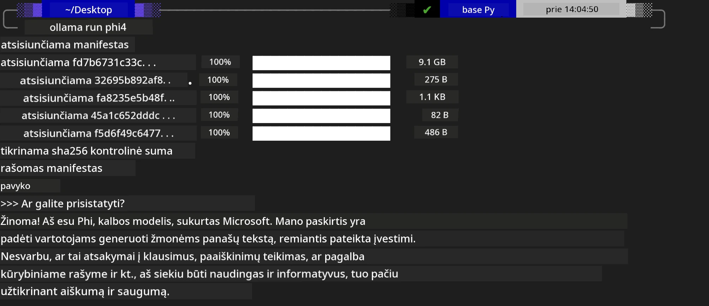
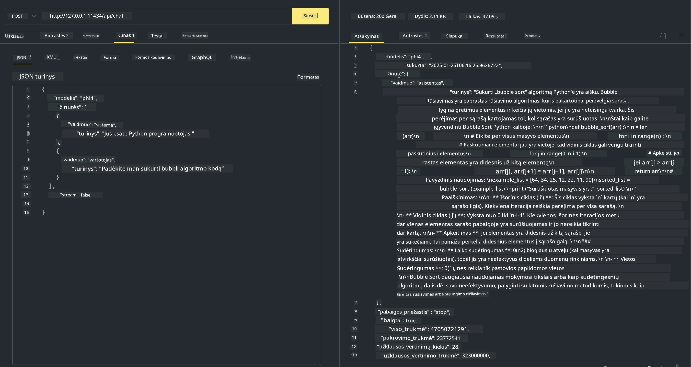

## Phi šeima Ollamoje


[Ollama](https://ollama.com) leidžia daugiau žmonių tiesiogiai diegti atviro kodo LLM ar SLM naudojant paprastus scenarijus, taip pat gali sukurti API, kad padėtų vietinėms Copilot programų scenarijoms.

## **1. Diegimas**

Ollama palaiko veikimą Windows, macOS ir Linux. Ollama galite įdiegti per šią nuorodą ([https://ollama.com/download](https://ollama.com/download)). Sėkmingai įdiegus galite tiesiogiai naudoti Ollama scenarijų, kad terminalo lange iškviestumėte Phi-3. Visas [prieinamas bibliotekas Ollama](https://ollama.com/library) galite peržiūrėti. Jei atidarysite šį saugyklą Codespace, jame Ollama jau bus įdiegta.

```bash

ollama run phi4

```

> [!NOTE]
> Modelis bus pirmiausia atsisiųstas, kai jį paleisite pirmą kartą. Žinoma, taip pat galite tiesiogiai nurodyti jau atsisiųstą Phi-4 modelį. Kaip pavyzdį naudojame WSL vykdyti komandą. Kai modelis bus sėkmingai atsisiųstas, galite tiesiogiai sąveikauti per terminalą.



## **2. Iškvieskite phi-4 API iš Ollama**

Jei norite iškviesti Phi-4 API, kurią sugeneravo Ollama, galite naudoti šią komandą terminale, kad paleistumėte Ollama serverį.

```bash

ollama serve

```

> [!NOTE]
> Jei naudojate macOS arba Linux, atkreipkite dėmesį, kad galite susidurti su šia klaida **"Error: listen tcp 127.0.0.1:11434: bind: address already in use"**. Galite gauti šią klaidą paleidžiant komandą. Galite ją ignoruoti, nes paprastai tai reiškia, kad serveris jau veikia, arba galite sustabdyti ir iš naujo paleisti Ollama:

**macOS**

```bash

brew services restart ollama

```

**Linux**

```bash

sudo systemctl stop ollama

```

Ollama palaiko dvi API: generate ir chat. Galite iškviesti modelio API, kurį teikia Ollama, pagal savo poreikius siųsdami užklausas vietinei paslaugai, veikiančiai prievade 11434.

**Chat**

```bash

curl http://127.0.0.1:11434/api/chat -d '{
  "model": "phi3",
  "messages": [
    {
      "role": "system",
      "content": "Your are a python developer."
    },
    {
      "role": "user",
      "content": "Help me generate a bubble algorithm"
    }
  ],
  "stream": false
  
}'
```

Tai rezultatas Postman'e



## Papildomi ištekliai

Peržiūrėkite prieinamų modelių sąrašą Ollama [jų bibliotekoje](https://ollama.com/library).

Parsisiųskite modelį iš Ollama serverio naudodami šią komandą

```bash
ollama pull phi4
```

Paleiskite modelį naudodami šią komandą

```bash
ollama run phi4
```

***Pastaba:*** Apsilankykite šioje nuorodoje [https://github.com/ollama/ollama/blob/main/docs/api.md](https://github.com/ollama/ollama/blob/main/docs/api.md) kad sužinotumėte daugiau

## Kviesti Ollama iš Python

Galite naudoti `requests` arba `urllib3`, kad siųstumėte užklausas į aukščiau naudojamus vietinius serverio galinius taškus. Tačiau populiarus būdas naudoti Ollama su Python yra per [openai](https://pypi.org/project/openai/) SDK, kadangi Ollama taip pat teikia su OpenAI suderinamus serverio galinius taškus.

Štai pavyzdys phi3-mini:

```python
import openai

client = openai.OpenAI(
    base_url="http://localhost:11434/v1",
    api_key="nokeyneeded",
)

response = client.chat.completions.create(
    model="phi4",
    temperature=0.7,
    n=1,
    messages=[
        {"role": "system", "content": "You are a helpful assistant."},
        {"role": "user", "content": "Write a haiku about a hungry cat"},
    ],
)

print("Response:")
print(response.choices[0].message.content)
```

## Kviesti Ollama iš JavaScript 

```javascript
// Failo santraukimo pavyzdys su Phi-4
script({
    model: "ollama:phi4",
    title: "Summarize with Phi-4",
    system: ["system"],
})

// Santraukimo pavyzdys
const file = def("FILE", env.files)
$`Summarize ${file} in a single paragraph.`
```

## Kviesti Ollama iš C#

Sukurkite naują C# Console programą ir pridėkite šį NuGet paketą:

```bash
dotnet add package Microsoft.SemanticKernel --version 1.34.0
```

Tada faile `Program.cs` pakeiskite šį kodą

```csharp
using Microsoft.SemanticKernel;
using Microsoft.SemanticKernel.ChatCompletion;

// add chat completion service using the local ollama server endpoint
#pragma warning disable SKEXP0001, SKEXP0003, SKEXP0010, SKEXP0011, SKEXP0050, SKEXP0052
builder.AddOpenAIChatCompletion(
    modelId: "phi4",
    endpoint: new Uri("http://localhost:11434/"),
    apiKey: "non required");

// invoke a simple prompt to the chat service
string prompt = "Write a joke about kittens";
var response = await kernel.InvokePromptAsync(prompt);
Console.WriteLine(response.GetValue<string>());
```

Paleiskite programą naudodami komandą:

```bash
dotnet run
```

---

<!-- CO-OP TRANSLATOR DISCLAIMER START -->
Atsakomybės apribojimas:
Šis dokumentas buvo išverstas naudojant dirbtinio intelekto vertimo paslaugą Co‑op Translator (https://github.com/Azure/co-op-translator). Nors siekiame užtikrinti tikslumą, atkreipkite dėmesį, kad automatizuoti vertimai gali turėti klaidų arba netikslumų. Originalus dokumentas jo pradinė kalba turėtų būti laikomas autoritetingu šaltiniu. Svarbios informacijos atveju rekomenduojamas profesionalaus vertėjo atliktas vertimas. Mes neatsakome už jokius nesusipratimus ar neteisingus aiškinimus, kilusius dėl šio vertimo naudojimo.
<!-- CO-OP TRANSLATOR DISCLAIMER END -->