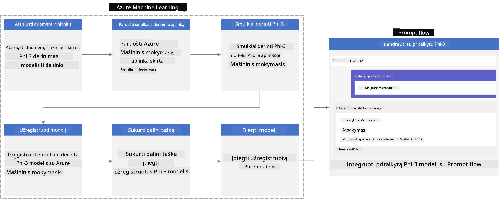
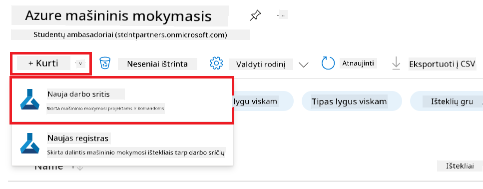
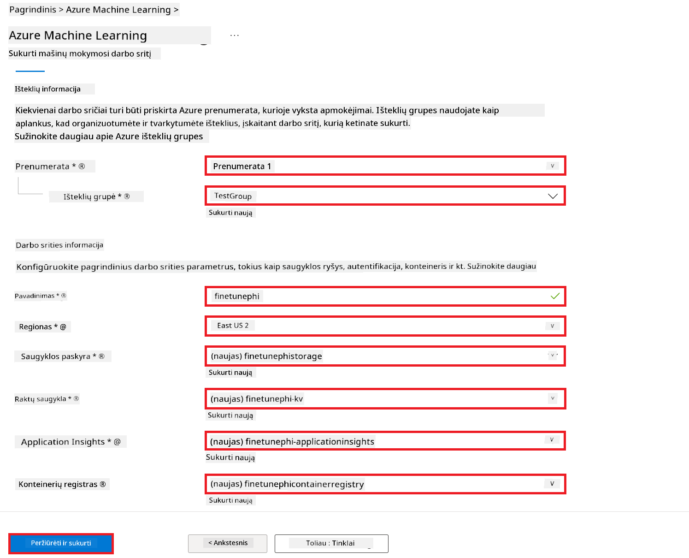
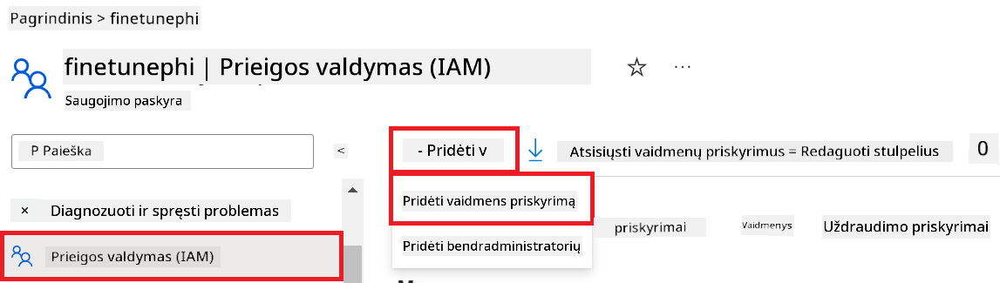
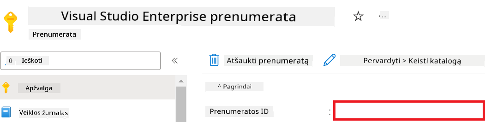
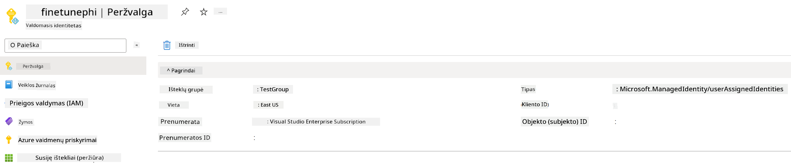
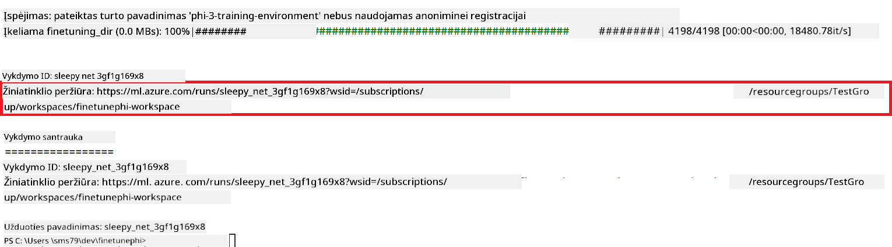
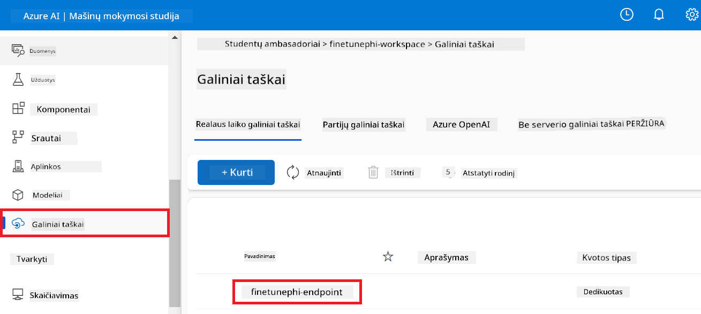
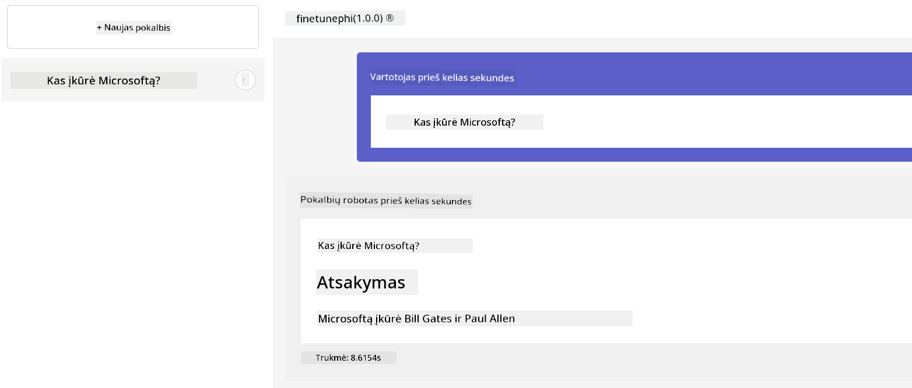

<!--
CO_OP_TRANSLATOR_METADATA:
{
  "original_hash": "7ca2c30fdb802664070e9cfbf92e24fe",
  "translation_date": "2026-01-05T16:06:18+00:00",
  "source_file": "md/02.Application/01.TextAndChat/Phi3/E2E_Phi-3-FineTuning_PromptFlow_Integration.md",
  "language_code": "lt"
}
-->
# Tikslinė reguliacija ir individualių Phi-3 modelių integravimas su Prompt flow

Šis nuo pradžios iki galo (E2E) pavyzdys pagrįstas straipsniu "[Fine-Tune and Integrate Custom Phi-3 Models with Prompt Flow: Step-by-Step Guide](https://techcommunity.microsoft.com/t5/educator-developer-blog/fine-tune-and-integrate-custom-phi-3-models-with-prompt-flow/ba-p/4178612?WT.mc_id=aiml-137032-kinfeylo)" iš Microsoft Tech Community. Jame pristatomi individualių Phi-3 modelių tikslinės reguliacijos, diegimo ir integravimo su Prompt flow procesai.

## Apžvalga

Šiame E2E pavyzdyje išmoksite, kaip tiksliai reguliuoti Phi-3 modelį ir integruoti jį su Prompt flow. Pasinaudodami Azure Machine Learning ir Prompt flow, sukursite darbo eigą individualių AI modelių diegimui ir naudojimui. Šis E2E pavyzdys suskirstytas į tris scenarijus:

**Scenarijus 1: Azure išteklių paruošimas ir pasiruošimas tikslinei reguliacijai**

**Scenarijus 2: Phi-3 modelio tikslinė reguliacija ir diegimas Azure Machine Learning Studio**

**Scenarijus 3: Integracija su Prompt flow ir pokalbis su savo individualiu modeliu**

Čia pateikiama šio E2E pavyzdžio apžvalga.



### Turinys

1. **[Scenarijus 1: Azure išteklių paruošimas ir pasiruošimas tikslinei reguliacijai](../../../../../../md/02.Application/01.TextAndChat/Phi3)**
    - [Azure Machine Learning darbo srities kūrimas](../../../../../../md/02.Application/01.TextAndChat/Phi3)
    - [GPU kvotų užklausos pateikimas Azure prenumeratoje](../../../../../../md/02.Application/01.TextAndChat/Phi3)
    - [Rolės priskyrimas](../../../../../../md/02.Application/01.TextAndChat/Phi3)
    - [Projekto paruošimas](../../../../../../md/02.Application/01.TextAndChat/Phi3)
    - [Duomenų rinkinio paruošimas tikslinei reguliacijai](../../../../../../md/02.Application/01.TextAndChat/Phi3)

1. **[Scenarijus 2: Phi-3 modelio tikslinė reguliacija ir diegimas Azure Machine Learning Studio](../../../../../../md/02.Application/01.TextAndChat/Phi3)**
    - [Azure CLI paruošimas](../../../../../../md/02.Application/01.TextAndChat/Phi3)
    - [Phi-3 modelio tikslinė reguliacija](../../../../../../md/02.Application/01.TextAndChat/Phi3)
    - [Tiksliai reguliuoto modelio diegimas](../../../../../../md/02.Application/01.TextAndChat/Phi3)

1. **[Scenarijus 3: Integracija su Prompt flow ir pokalbis su savo individualiu modeliu](../../../../../../md/02.Application/01.TextAndChat/Phi3)**
    - [Individualaus Phi-3 modelio integracija su Prompt flow](../../../../../../md/02.Application/01.TextAndChat/Phi3)
    - [Pokalbis su savo individualiu modeliu](../../../../../../md/02.Application/01.TextAndChat/Phi3)

## Scenarijus 1: Azure išteklių paruošimas ir pasiruošimas tikslinei reguliacijai

### Azure Machine Learning darbo srities kūrimas

1. Portalas lange viršuje esančiame **paieškos langelyje** įveskite *azure machine learning* ir iš pasirodžiusių pasirinkimų pasirinkite **Azure Machine Learning**.

    

1. Iš navigacijos meniu pasirinkite **+ Create**.

1. Iš navigacijos meniu pasirinkite **New workspace**.

    

1. Atlikite šiuos veiksmus:

    - Pasirinkite savo Azure **Subscription**.
    - Pasirinkite naudoti **Resource group** (jei reikia, sukurkite naują).
    - Įveskite **Workspace Name**. Pavadinimas turi būti unikalus.
    - Pasirinkite norimą naudoti **Region**.
    - Pasirinkite naudoti **Storage account** (jei reikia, sukurkite naują).
    - Pasirinkite naudoti **Key vault** (jei reikia, sukurkite naują).
    - Pasirinkite naudoti **Application insights** (jei reikia, sukurkite naują).
    - Pasirinkite naudoti **Container registry** (jei reikia, sukurkite naują).

    

1. Pasirinkite **Review + Create**.

1. Pasirinkite **Create**.

### GPU kvotų užklausos pateikimas Azure prenumeratoje

Šiame E2E pavyzdyje tikslinei reguliacijai naudosite *Standard_NC24ads_A100_v4 GPU*, kuris reikalauja kvotos užklausos, o diegimui – *Standard_E4s_v3* CPU, kuriam kvota nereikalinga.

> [!NOTE]
>
> GPU paskirstymui tinkamos tik Pay-As-You-Go prenumeratos (standartinio tipo); naudos prenumeratos šiuo metu nepalaikomos.
>
> Tiems, kas naudoja naudos prenumeratas (pvz., Visual Studio Enterprise Subscription) arba nori greitai išbandyti tikslinės reguliacijos ir diegimo procesą, ši pamoka taip pat paaiškina, kaip tikslingai reguliuoti naudojant minimalų duomenų rinkinį su CPU. Tačiau svarbu atkreipti dėmesį, kad rezultatai yra žymiai geresni, kai naudojamas GPU su didesniais duomenų rinkiniais.

1. Apsilankykite [Azure ML Studio](https://ml.azure.com/home?wt.mc_id=studentamb_279723).

1. Atlikite šiuos veiksmus, kad pateiktumėte užklausą *Standard NCADSA100v4 Family* kvotai:

    - Kairėje pusėje esančiame skirtuke pasirinkite **Quota**.
    - Pasirinkite norimą naudoti **Virtual machine family**. Pavyzdžiui, pasirinkite **Standard NCADSA100v4 Family Cluster Dedicated vCPUs**, kuriame yra *Standard_NC24ads_A100_v4* GPU.
    - Iš navigacijos meniu pasirinkite **Request quota**.

        

    - Užklausos puslapyje įveskite norimą **New cores limit**. Pavyzdžiui, 24.
    - Užklausos puslapyje pasirinkite **Submit** GPU kvotos užklausai pateikti.

> [!NOTE]
> Galite pasirinkti tinkamą GPU ar CPU pagal savo poreikius pagal dokumentą [Sizes for Virtual Machines in Azure](https://learn.microsoft.com/azure/virtual-machines/sizes/overview?tabs=breakdownseries%2Cgeneralsizelist%2Ccomputesizelist%2Cmemorysizelist%2Cstoragesizelist%2Cgpusizelist%2Cfpgasizelist%2Chpcsizelist).

### Rolės priskyrimas

Norėdami tiksliai reguliuoti ir diegti savo modelius, pirmiausia turite sukurti vartotojo priskirtą valdomą identitetą (User Assigned Managed Identity, UAI) ir priskirti jam reikiamus leidimus. Šis UAI bus naudojamas autentifikacijai diegimo metu.

#### Vartotojo priskirto valdomo identiteto (UAI) kūrimas

1. Portalas lange viršuje esančiame **paieškos langelyje** įveskite *managed identities* ir iš pasirodžiusių pasirinkimų pasirinkite **Managed Identities**.

    

1. Pasirinkite **+ Create**.

    

1. Atlikite šiuos veiksmus:

    - Pasirinkite savo Azure **Subscription**.
    - Pasirinkite naudoti **Resource group** (jei reikia, sukurkite naują).
    - Pasirinkite norimą naudoti **Region**.
    - Įveskite **Name**. Pavadinimas turi būti unikalus.

1. Pasirinkite **Review + create**.

1. Pasirinkite **+ Create**.

#### Priskirkite valdomam identitetui "Contributor" rolę

1. Eikite į sukurtą valdomo identiteto išteklių.

1. Kairėje pusėje pasirinkite **Azure role assignments**.

1. Iš navigacijos meniu pasirinkite **+Add role assignment**.

1. Pridėjimo puslapyje atlikite šiuos veiksmus:
    - Nustatykite **Scope** į **Resource group**.
    - Pasirinkite savo Azure **Subscription**.
    - Pasirinkite naudoti **Resource group**.
    - Pasirinkite rolę **Contributor**.

    

1. Pasirinkite **Save**.

#### Priskirkite valdomam identitetui "Storage Blob Data Reader" rolę

1. Portalas lange viršuje esančiame **paieškos langelyje** įveskite *storage accounts* ir iš pasirodžiusių pasirinkimų pasirinkite **Storage accounts**.

    

1. Pasirinkite saugojimo abonementą, susietą su jūsų Azure Machine Learning darbo sritimi, kurią sukūrėte. Pavyzdžiui, *finetunephistorage*.

1. Atliekami veiksmai, kad patektumėte į Pridėti rolės priskyrimą puslapį:

    - Eikite į sukurtą Azure Storage abonementą.
    - Kairėje pusėje pasirinkite **Access Control (IAM)**.
    - Iš navigacijos meniu pasirinkite **+ Add**.
    - Iš navigacijos meniu pasirinkite **Add role assignment**.

    

1. Pridėjimo rolės puslapyje atlikite šiuos veiksmus:

    - Rolės puslapyje į paieškos laukelį įveskite *Storage Blob Data Reader* ir iš pasirinkimų pasirinkite **Storage Blob Data Reader**.
    - Rolės puslapyje pasirinkite **Next**.
    - Narių puslapyje nustatykite **Assign access to** į **Managed identity**.
    - Narių puslapyje pasirinkite **+ Select members**.
    - Valdomų identitetų pasirinkimo puslapyje pasirinkite savo Azure **Subscription**.
    - Valdomų identitetų pasirinkimo puslapyje pasirinkite valdomą identitetą, kurį turite kaip **Manage Identity**.
    - Valdomų identitetų pasirinkimo puslapyje pasirinkite sukurtą valdomą identitetą, pvz., *finetunephi-managedidentity*.
    - Valdomų identitetų pasirinkimo puslapyje pasirinkite **Select**.

    

1. Pasirinkite **Review + assign**.

#### Priskirkite valdomam identitetui "AcrPull" rolę

1. Portalas lange viršuje esančiame **paieškos langelyje** įveskite *container registries* ir iš pasirodžiusių pasirinkimų pasirinkite **Container registries**.

    

1. Pasirinkite konteinerių registrą, susietą su jūsų Azure Machine Learning darbo sritimi. Pavyzdžiui, *finetunephicontainerregistries*.

1. Atliekami veiksmai, kad patektumėte į Pridėti rolės priskyrimą puslapį:

    - Kairėje pusėje pasirinkite **Access Control (IAM)**.
    - Iš navigacijos meniu pasirinkite **+ Add**.
    - Iš navigacijos meniu pasirinkite **Add role assignment**.

1. Pridėjimo rolės puslapyje atlikite šiuos veiksmus:

    - Rolės puslapyje į paieškos laukelį įveskite *AcrPull* ir iš pasirinkimų pasirinkite **AcrPull**.
    - Rolės puslapyje pasirinkite **Next**.
    - Narių puslapyje nustatykite **Assign access to** į **Managed identity**.
    - Narių puslapyje pasirinkite **+ Select members**.
    - Valdomų identitetų pasirinkimo puslapyje pasirinkite savo Azure **Subscription**.
    - Valdomų identitetų pasirinkimo puslapyje pasirinkite valdomą identitetą, kuris yra **Manage Identity**.
    - Valdomų identitetų pasirinkimo puslapyje pasirinkite sukurtą valdomą identitetą, pvz., *finetunephi-managedidentity*.
    - Valdomų identitetų pasirinkimo puslapyje pasirinkite **Select**.
    - Pasirinkite **Review + assign**.

### Projekto paruošimas

Dabar sukursite aplanką darbui ir nustatysite virtualią aplinką programos, kuri sąveikaus su vartotojais ir naudos saugomą pokalbių istoriją iš Azure Cosmos DB atsakymams informuoti, kūrimui.

#### Sukurkite darbo aplanką

1. Atidarykite terminalo langą ir įveskite šią komandą, kad sukurtumėte aplanką pavadinimu *finetune-phi* numatytame kelyje.

    ```console
    mkdir finetune-phi
    ```

1. Terminale įveskite šią komandą, kad pereitumėte į sukurtą *finetune-phi* aplanką.

    ```console
    cd finetune-phi
    ```

#### Sukurkite virtualią aplinką

1. Terminale įveskite šią komandą, kad sukurtumėte virtualią aplinką pavadinimu *.venv*.

    ```console
    python -m venv .venv
    ```

1. Terminale įveskite komandą, kad suaktyvintumėte virtualią aplinką.

    ```console
    .venv\Scripts\activate.bat
    ```

> [!NOTE]
>
> Jei viskas veikia, prieš komandų eilutę turėtumėte matyti *(.venv)*.

#### Įdiekite reikalingas paketas

1. Terminale įveskite šias komandas, kad įdiegtumėte reikiamus paketus.

    ```console
    pip install datasets==2.19.1
    pip install transformers==4.41.1
    pip install azure-ai-ml==1.16.0
    pip install torch==2.3.1
    pip install trl==0.9.4
    pip install promptflow==1.12.0
    ```

#### Sukurkite projekto bylas
Šiame pratime sukursite pagrindinius mūsų projekto failus. Šie failai apima scenarijus, skirtus duomenų rinkinio atsisiuntimui, Azure Machine Learning aplinkos nustatymui, Phi-3 modelio tikslinimui ir tikslinto modelio diegimui. Taip pat sukursite *conda.yml* failą, skirtą tikslinimo aplinkos nustatymui.

Šiame pratime jūs:

- Sukursite *download_dataset.py* failą duomenų rinkiniui atsisiųsti.
- Sukursite *setup_ml.py* failą Azure Machine Learning aplinkos nustatymui.
- Sukursite *fine_tune.py* failą *finetuning_dir* kataloge Phi-3 modelio tikslinimui naudojant duomenų rinkinį.
- Sukursite *conda.yml* failą tikslinimo aplinkos nustatymui.
- Sukursite *deploy_model.py* failą tikslinto modelio diegimui.
- Sukursite *integrate_with_promptflow.py* failą, skirtą tikslinto modelio integravimui ir vykdymui naudojant Prompt flow.
- Sukursite flow.dag.yml failą darbo eigos struktūrai Prompt flow sukurti.
- Sukursite *config.py* failą Azure informacijos įvedimui.

> [!NOTE]
>
> Baigtinė aplanko struktūra:
>
> ```text
> └── YourUserName
> .    └── finetune-phi
> .        ├── finetuning_dir
> .        │      └── fine_tune.py
> .        ├── conda.yml
> .        ├── config.py
> .        ├── deploy_model.py
> .        ├── download_dataset.py
> .        ├── flow.dag.yml
> .        ├── integrate_with_promptflow.py
> .        └── setup_ml.py
> ```

1. Atidarykite **Visual Studio Code**.

1. Meniu juostoje pasirinkite **File**.

1. Pasirinkite **Open Folder**.

1. Pasirinkite anksčiau sukurtą *finetune-phi* aplanką, kuris yra vietoje *C:\Users\yourUserName\finetune-phi*.

    

1. Visual Studio Code kairiajame skydelyje spustelėkite dešinį pelės klavišą ir pasirinkite **New File**, kad sukurtumėte naują failą pavadinimu *download_dataset.py*.

1. Visual Studio Code kairiajame skydelyje spustelėkite dešinį pelės klavišą ir pasirinkite **New File**, kad sukurtumėte naują failą pavadinimu *setup_ml.py*.

1. Visual Studio Code kairiajame skydelyje spustelėkite dešinį pelės klavišą ir pasirinkite **New File**, kad sukurtumėte naują failą pavadinimu *deploy_model.py*.

    

1. Visual Studio Code kairiajame skydelyje spustelėkite dešinį pelės klavišą ir pasirinkite **New Folder**, kad sukurtumėte naują aplanką pavadinimu *finetuning_dir*.

1. Aplanke *finetuning_dir* sukurkite naują failą pavadinimu *fine_tune.py*.

#### Sukurkite ir sukonfigūruokite *conda.yml* failą

1. Visual Studio Code kairiajame skydelyje spustelėkite dešinį pelės klavišą ir pasirinkite **New File**, kad sukurtumėte naują failą pavadinimu *conda.yml*.

1. Įtraukite šį kodą į *conda.yml* failą, kad nustatytumėte tikslinimo aplinką Phi-3 modeliui.

    ```yml
    name: phi-3-training-env
    channels:
      - defaults
      - conda-forge
    dependencies:
      - python=3.10
      - pip
      - numpy<2.0
      - pip:
          - torch==2.4.0
          - torchvision==0.19.0
          - trl==0.8.6
          - transformers==4.41
          - datasets==2.21.0
          - azureml-core==1.57.0
          - azure-storage-blob==12.19.0
          - azure-ai-ml==1.16
          - azure-identity==1.17.1
          - accelerate==0.33.0
          - mlflow==2.15.1
          - azureml-mlflow==1.57.0
    ```

#### Sukurkite ir sukonfigūruokite *config.py* failą

1. Visual Studio Code kairiajame skydelyje spustelėkite dešinį pelės klavišą ir pasirinkite **New File**, kad sukurtumėte naują failą pavadinimu *config.py*.

1. Įtraukite šį kodą į *config.py* failą, kad įvestumėte savo Azure informaciją.

    ```python
    # Azure nustatymai
    AZURE_SUBSCRIPTION_ID = "your_subscription_id"
    AZURE_RESOURCE_GROUP_NAME = "your_resource_group_name" # "TestGroup"

    # Azure Mašininio Mokymosi nustatymai
    AZURE_ML_WORKSPACE_NAME = "your_workspace_name" # "finetunephi-workspace"

    # Azure Valdomos Tapatybės nustatymai
    AZURE_MANAGED_IDENTITY_CLIENT_ID = "your_azure_managed_identity_client_id"
    AZURE_MANAGED_IDENTITY_NAME = "your_azure_managed_identity_name" # "finetunephi-mangedidentity"
    AZURE_MANAGED_IDENTITY_RESOURCE_ID = f"/subscriptions/{AZURE_SUBSCRIPTION_ID}/resourceGroups/{AZURE_RESOURCE_GROUP_NAME}/providers/Microsoft.ManagedIdentity/userAssignedIdentities/{AZURE_MANAGED_IDENTITY_NAME}"

    # Duomenų rinkinio failų keliai
    TRAIN_DATA_PATH = "data/train_data.jsonl"
    TEST_DATA_PATH = "data/test_data.jsonl"

    # Koreguoto modelio nustatymai
    AZURE_MODEL_NAME = "your_fine_tuned_model_name" # "finetune-phi-model"
    AZURE_ENDPOINT_NAME = "your_fine_tuned_model_endpoint_name" # "finetune-phi-endpoint"
    AZURE_DEPLOYMENT_NAME = "your_fine_tuned_model_deployment_name" # "finetune-phi-deployment"

    AZURE_ML_API_KEY = "your_fine_tuned_model_api_key"
    AZURE_ML_ENDPOINT = "your_fine_tuned_model_endpoint_uri" # "https://{your-endpoint-name}.{your-region}.inference.ml.azure.com/score"
    ```

#### Įtraukite Azure aplinkos kintamuosius

1. Atlikite šiuos veiksmus, kad pridėtumėte Azure Prenumeratos ID:

    - Įveskite *subscriptions* **paieškos juostoje** puslapio viršuje ir pasirinkite **Subscriptions** iš pasirodančių parinkčių.
    - Pasirinkite Azure prenumeratą, kurią šiuo metu naudojate.
    - Nukopijuokite ir įklijuokite savo Prenumeratos ID į *config.py* failą.

    

1. Atlikite šiuos veiksmus, kad pridėtumėte Azure darbo srities pavadinimą:

    - Pereikite prie jūsų sukurtos Azure Machine Learning išteklių grupės.
    - Nukopijuokite ir įklijuokite paskyros pavadinimą į *config.py* failą.

    

1. Atlikite šiuos veiksmus, kad pridėtumėte Azure Išteklų grupės pavadinimą:

    - Pereikite prie jūsų sukurtos Azure Machine Learning išteklių grupės.
    - Nukopijuokite ir įklijuokite savo Azure Išteklų grupės pavadinimą į *config.py* failą.

    

2. Atlikite šiuos veiksmus, kad pridėtumėte Azure Valdomos Tapatybės pavadinimą

    - Pereikite prie jūsų sukurtos Valdomų Tapatybių išteklių.
    - Nukopijuokite ir įklijuokite savo Azure Valdomos Tapatybės pavadinimą į *config.py* failą.

    

### Paruoškite duomenų rinkinį tikslinimui

Šiame pratime paleisite *download_dataset.py* failą, kad atsisiųstumėte *ULTRACHAT_200k* duomenų rinkinius į savo vietinę aplinką. Tada naudosite šiuos duomenų rinkinius Phi-3 modeliui tikslinti Azure Machine Learning aplinkoje.

#### Atsisiųskite savo duomenų rinkinį naudodami *download_dataset.py*

1. Atidarykite *download_dataset.py* failą Visual Studio Code.

1. Įtraukite šį kodą į *download_dataset.py*.

    ```python
    import json
    import os
    from datasets import load_dataset
    from config import (
        TRAIN_DATA_PATH,
        TEST_DATA_PATH)

    def load_and_split_dataset(dataset_name, config_name, split_ratio):
        """
        Load and split a dataset.
        """
        # Įkelti duomenų rinkinį su nurodytu pavadinimu, konfigūracija ir padalijimo santykiu
        dataset = load_dataset(dataset_name, config_name, split=split_ratio)
        print(f"Original dataset size: {len(dataset)}")
        
        # Padalyti duomenų rinkinį į mokymo ir testavimo rinkinius (80% mokymui, 20% testavimui)
        split_dataset = dataset.train_test_split(test_size=0.2)
        print(f"Train dataset size: {len(split_dataset['train'])}")
        print(f"Test dataset size: {len(split_dataset['test'])}")
        
        return split_dataset

    def save_dataset_to_jsonl(dataset, filepath):
        """
        Save a dataset to a JSONL file.
        """
        # Sukurti katalogą, jei jis neegzistuoja
        os.makedirs(os.path.dirname(filepath), exist_ok=True)
        
        # Atidaryti failą rašymo režimu
        with open(filepath, 'w', encoding='utf-8') as f:
            # Iteruoti per kiekvieną įrašą duomenų rinkinyje
            for record in dataset:
                # Išmesti įrašą kaip JSON objektą ir įrašyti į failą
                json.dump(record, f)
                # Įrašyti naujos eilutės simbolį, kad atskirtų įrašus
                f.write('\n')
        
        print(f"Dataset saved to {filepath}")

    def main():
        """
        Main function to load, split, and save the dataset.
        """
        # Įkelti ir padalyti ULTRACHAT_200k duomenų rinkinį su specifine konfigūracija ir padalijimo santykiu
        dataset = load_and_split_dataset("HuggingFaceH4/ultrachat_200k", 'default', 'train_sft[:1%]')
        
        # Išskirti mokymo ir testavimo duomenų rinkinius iš padalijimo
        train_dataset = dataset['train']
        test_dataset = dataset['test']

        # Išsaugoti mokymo duomenų rinkinį į JSONL failą
        save_dataset_to_jsonl(train_dataset, TRAIN_DATA_PATH)
        
        # Išsaugoti testavimo duomenų rinkinį atskirame JSONL faile
        save_dataset_to_jsonl(test_dataset, TEST_DATA_PATH)

    if __name__ == "__main__":
        main()

    ```

> [!TIP]
>
> **Patarimas, kaip tikslinti su minimaliu duomenų rinkiniu naudojant CPU**
>
> Jei norite naudoti CPU tikslinimui, šis metodas idealus tiems, kurie turi prenumeratas su privilegijomis (pvz., Visual Studio Enterprise Subscription) arba norint greitai išbandyti tikslinimo ir diegimo procesą.
>
> Pakeiskite `dataset = load_and_split_dataset("HuggingFaceH4/ultrachat_200k", 'default', 'train_sft[:1%]')` į `dataset = load_and_split_dataset("HuggingFaceH4/ultrachat_200k", 'default', 'train_sft[:10]')`
>

1. Terminale įveskite šią komandą, kad paleistumėte scenarijų ir atsisiųstumėte duomenų rinkinį į savo vietinę aplinką.

    ```console
    python download_data.py
    ```

1. Patikrinkite, ar duomenų rinkiniai sėkmingai išsaugoti jūsų vietiniame *finetune-phi/data* kataloge.

> [!NOTE]
>
> **Duomenų rinkinio dydis ir tikslinimo laikas**
>
> Šiame E2E pavyzdyje naudojama tik 1% duomenų rinkinio (`train_sft[:1%]`). Tai žymiai sumažina duomenų kiekį, pagreitindama tiek įkėlimą, tiek tikslinimo procesus. Galite reguliuoti procentą, kad rastumėte tinkamą balansą tarp mokymo laiko ir modelio našumo. Naudojant mažesnį duomenų rinkinio subsetą sumažėja tikslinimo laikas, todėl procesas tinka E2E pavyzdiui.

## Scenarijus 2: Tikslinti Phi-3 modelį ir diegti Azure Machine Learning Studio

### Nustatykite Azure CLI

Turite nustatyti Azure CLI autentifikacijai. Azure CLI leidžia valdyti Azure išteklius tiesiai iš komandų eilutės ir suteikia autentifikavimo duomenis, reikalingus Azure Machine Learning prieigai prie šių išteklių. Pradėkite įdiegdami [Azure CLI](https://learn.microsoft.com/cli/azure/install-azure-cli)

1. Atidarykite terminalo langą ir įveskite šią komandą, kad prisijungtumėte prie savo Azure paskyros.

    ```console
    az login
    ```

1. Pasirinkite savo naudojamą Azure paskyrą.

1. Pasirinkite Azure prenumeratą, kurią naudosite.

    

> [!TIP]
>
> Jei kyla problemų prisijungiant prie Azure, pabandykite naudoti įrenginio kodą. Atidarykite terminalo langą ir įveskite šią komandą, kad prisijungtumėte prie savo Azure paskyros:
>
> ```console
> az login --use-device-code
> ```
>

### Tikslinkite Phi-3 modelį

Šiame pratime tikslinsite Phi-3 modelį naudodami pateiktą duomenų rinkinį. Pirmiausia apibrėšite tikslinimo procesą *fine_tune.py* faile. Tada sukonfigūruosite Azure Machine Learning aplinką ir pradėsite tikslinimo procesą paleisdami *setup_ml.py* failą. Šis scenarijus užtikrina, kad tikslinimas vyks Azure Machine Learning aplinkoje.

Paleidę *setup_ml.py*, pradėsite tikslinimo procesą Azure Machine Learning aplinkoje.

#### Įtraukite kodą į *fine_tune.py* failą

1. Pereikite į *finetuning_dir* katalogą ir atidarykite *fine_tune.py* failą Visual Studio Code.

1. Įtraukite šį kodą į *fine_tune.py*.

    ```python
    import argparse
    import sys
    import logging
    import os
    from datasets import load_dataset
    import torch
    import mlflow
    from transformers import AutoModelForCausalLM, AutoTokenizer, TrainingArguments
    from trl import SFTTrainer

    # Norėdami išvengti INVALID_PARAMETER_VALUE klaidos MLflow, išjunkite MLflow integraciją
    os.environ["DISABLE_MLFLOW_INTEGRATION"] = "True"

    # Registravimo nustatymas
    logging.basicConfig(
        format="%(asctime)s - %(levelname)s - %(name)s - %(message)s",
        datefmt="%Y-%m-%d %H:%M:%S",
        handlers=[logging.StreamHandler(sys.stdout)],
        level=logging.WARNING
    )
    logger = logging.getLogger(__name__)

    def initialize_model_and_tokenizer(model_name, model_kwargs):
        """
        Initialize the model and tokenizer with the given pretrained model name and arguments.
        """
        model = AutoModelForCausalLM.from_pretrained(model_name, **model_kwargs)
        tokenizer = AutoTokenizer.from_pretrained(model_name)
        tokenizer.model_max_length = 2048
        tokenizer.pad_token = tokenizer.unk_token
        tokenizer.pad_token_id = tokenizer.convert_tokens_to_ids(tokenizer.pad_token)
        tokenizer.padding_side = 'right'
        return model, tokenizer

    def apply_chat_template(example, tokenizer):
        """
        Apply a chat template to tokenize messages in the example.
        """
        messages = example["messages"]
        if messages[0]["role"] != "system":
            messages.insert(0, {"role": "system", "content": ""})
        example["text"] = tokenizer.apply_chat_template(
            messages, tokenize=False, add_generation_prompt=False
        )
        return example

    def load_and_preprocess_data(train_filepath, test_filepath, tokenizer):
        """
        Load and preprocess the dataset.
        """
        train_dataset = load_dataset('json', data_files=train_filepath, split='train')
        test_dataset = load_dataset('json', data_files=test_filepath, split='train')
        column_names = list(train_dataset.features)

        train_dataset = train_dataset.map(
            apply_chat_template,
            fn_kwargs={"tokenizer": tokenizer},
            num_proc=10,
            remove_columns=column_names,
            desc="Applying chat template to train dataset",
        )

        test_dataset = test_dataset.map(
            apply_chat_template,
            fn_kwargs={"tokenizer": tokenizer},
            num_proc=10,
            remove_columns=column_names,
            desc="Applying chat template to test dataset",
        )

        return train_dataset, test_dataset

    def train_and_evaluate_model(train_dataset, test_dataset, model, tokenizer, output_dir):
        """
        Train and evaluate the model.
        """
        training_args = TrainingArguments(
            bf16=True,
            do_eval=True,
            output_dir=output_dir,
            eval_strategy="epoch",
            learning_rate=5.0e-06,
            logging_steps=20,
            lr_scheduler_type="cosine",
            num_train_epochs=3,
            overwrite_output_dir=True,
            per_device_eval_batch_size=4,
            per_device_train_batch_size=4,
            remove_unused_columns=True,
            save_steps=500,
            seed=0,
            gradient_checkpointing=True,
            gradient_accumulation_steps=1,
            warmup_ratio=0.2,
        )

        trainer = SFTTrainer(
            model=model,
            args=training_args,
            train_dataset=train_dataset,
            eval_dataset=test_dataset,
            max_seq_length=2048,
            dataset_text_field="text",
            tokenizer=tokenizer,
            packing=True
        )

        train_result = trainer.train()
        trainer.log_metrics("train", train_result.metrics)

        mlflow.transformers.log_model(
            transformers_model={"model": trainer.model, "tokenizer": tokenizer},
            artifact_path=output_dir,
        )

        tokenizer.padding_side = 'left'
        eval_metrics = trainer.evaluate()
        eval_metrics["eval_samples"] = len(test_dataset)
        trainer.log_metrics("eval", eval_metrics)

    def main(train_file, eval_file, model_output_dir):
        """
        Main function to fine-tune the model.
        """
        model_kwargs = {
            "use_cache": False,
            "trust_remote_code": True,
            "torch_dtype": torch.bfloat16,
            "device_map": None,
            "attn_implementation": "eager"
        }

        # pretrained_model_name = "microsoft/Phi-3-mini-4k-instruct"
        pretrained_model_name = "microsoft/Phi-3.5-mini-instruct"

        with mlflow.start_run():
            model, tokenizer = initialize_model_and_tokenizer(pretrained_model_name, model_kwargs)
            train_dataset, test_dataset = load_and_preprocess_data(train_file, eval_file, tokenizer)
            train_and_evaluate_model(train_dataset, test_dataset, model, tokenizer, model_output_dir)

    if __name__ == "__main__":
        parser = argparse.ArgumentParser()
        parser.add_argument("--train-file", type=str, required=True, help="Path to the training data")
        parser.add_argument("--eval-file", type=str, required=True, help="Path to the evaluation data")
        parser.add_argument("--model_output_dir", type=str, required=True, help="Directory to save the fine-tuned model")
        args = parser.parse_args()
        main(args.train_file, args.eval_file, args.model_output_dir)

    ```

1. Išsaugokite ir uždarykite *fine_tune.py* failą.

> [!TIP]
> **Galite tikslinti Phi-3.5 modelį**
>
> *fine_tune.py* faile `pretrained_model_name` galite pakeisti iš `"microsoft/Phi-3-mini-4k-instruct"` į bet kurį norimą modelį. Pavyzdžiui, jei pakeisite į `"microsoft/Phi-3.5-mini-instruct"`, naudosite Phi-3.5-mini-instruct modelį tikslinimui. Norėdami rasti ir naudoti jums tinkamą modelio pavadinimą, apsilankykite [Hugging Face](https://huggingface.co/), suraskite dominančią modelį ir nukopijuokite jos pavadinimą į `pretrained_model_name` laukelį savo scenarijuje.
>
> <image type="content" src="../../../../imgs/02/FineTuning-PromptFlow/finetunephi3.5.png" alt-text="Tikslinti Phi-3.5.">
>

#### Įtraukite kodą į *setup_ml.py* failą

1. Atidarykite *setup_ml.py* failą Visual Studio Code.

1. Įtraukite šį kodą į *setup_ml.py*.

    ```python
    import logging
    from azure.ai.ml import MLClient, command, Input
    from azure.ai.ml.entities import Environment, AmlCompute
    from azure.identity import AzureCliCredential
    from config import (
        AZURE_SUBSCRIPTION_ID,
        AZURE_RESOURCE_GROUP_NAME,
        AZURE_ML_WORKSPACE_NAME,
        TRAIN_DATA_PATH,
        TEST_DATA_PATH
    )

    # Konstantos

    # Pašalinkite komentaro ženklus nuo šių eilučių, kad naudotumėte CPU instanciją treniruotėms
    # COMPUTE_INSTANCE_TYPE = "Standard_E16s_v3" # cpu
    # COMPUTE_NAME = "cpu-e16s-v3"
    # DOCKER_IMAGE_NAME = "mcr.microsoft.com/azureml/openmpi4.1.0-ubuntu20.04:latest"

    # Pašalinkite komentaro ženklus nuo šių eilučių, kad naudotumėte GPU instanciją treniruotėms
    COMPUTE_INSTANCE_TYPE = "Standard_NC24ads_A100_v4"
    COMPUTE_NAME = "gpu-nc24s-a100-v4"
    DOCKER_IMAGE_NAME = "mcr.microsoft.com/azureml/curated/acft-hf-nlp-gpu:59"

    CONDA_FILE = "conda.yml"
    LOCATION = "eastus2" # Pakeiskite į savo skaičiavimo klasterio vietą
    FINETUNING_DIR = "./finetuning_dir" # Kelias į smulkiojo derinimo skriptą
    TRAINING_ENV_NAME = "phi-3-training-environment" # Treniruotės aplinkos pavadinimas
    MODEL_OUTPUT_DIR = "./model_output" # Kelias į modelio išvesties katalogą Azure ML

    # Žurnalo nustatymai procesui sekti
    logger = logging.getLogger(__name__)
    logging.basicConfig(
        format="%(asctime)s - %(levelname)s - %(name)s - %(message)s",
        datefmt="%Y-%m-%d %H:%M:%S",
        level=logging.WARNING
    )

    def get_ml_client():
        """
        Initialize the ML Client using Azure CLI credentials.
        """
        credential = AzureCliCredential()
        return MLClient(credential, AZURE_SUBSCRIPTION_ID, AZURE_RESOURCE_GROUP_NAME, AZURE_ML_WORKSPACE_NAME)

    def create_or_get_environment(ml_client):
        """
        Create or update the training environment in Azure ML.
        """
        env = Environment(
            image=DOCKER_IMAGE_NAME,  # Docker vaizdas aplinkai
            conda_file=CONDA_FILE,  # Conda aplinkos failas
            name=TRAINING_ENV_NAME,  # Aplinkos pavadinimas
        )
        return ml_client.environments.create_or_update(env)

    def create_or_get_compute_cluster(ml_client, compute_name, COMPUTE_INSTANCE_TYPE, location):
        """
        Create or update the compute cluster in Azure ML.
        """
        try:
            compute_cluster = ml_client.compute.get(compute_name)
            logger.info(f"Compute cluster '{compute_name}' already exists. Reusing it for the current run.")
        except Exception:
            logger.info(f"Compute cluster '{compute_name}' does not exist. Creating a new one with size {COMPUTE_INSTANCE_TYPE}.")
            compute_cluster = AmlCompute(
                name=compute_name,
                size=COMPUTE_INSTANCE_TYPE,
                location=location,
                tier="Dedicated",  # Skaičiavimo klasterio lygis
                min_instances=0,  # Minimalus instancijų skaičius
                max_instances=1  # Maksimalus instancijų skaičius
            )
            ml_client.compute.begin_create_or_update(compute_cluster).wait()  # Palaukite, kol klasteris bus sukurtas
        return compute_cluster

    def create_fine_tuning_job(env, compute_name):
        """
        Set up the fine-tuning job in Azure ML.
        """
        return command(
            code=FINETUNING_DIR,  # Kelias į fine_tune.py
            command=(
                "python fine_tune.py "
                "--train-file ${{inputs.train_file}} "
                "--eval-file ${{inputs.eval_file}} "
                "--model_output_dir ${{inputs.model_output}}"
            ),
            environment=env,  # Treniruotės aplinka
            compute=compute_name,  # Naudojamas skaičiavimo klasteris
            inputs={
                "train_file": Input(type="uri_file", path=TRAIN_DATA_PATH),  # Kelias į treniravimo duomenų failą
                "eval_file": Input(type="uri_file", path=TEST_DATA_PATH),  # Kelias į vertinimo duomenų failą
                "model_output": MODEL_OUTPUT_DIR
            }
        )

    def main():
        """
        Main function to set up and run the fine-tuning job in Azure ML.
        """
        # Inicializuokite ML klientą
        ml_client = get_ml_client()

        # Sukurkite aplinką
        env = create_or_get_environment(ml_client)
        
        # Sukurkite arba gaukite esamą skaičiavimo klasterį
        create_or_get_compute_cluster(ml_client, COMPUTE_NAME, COMPUTE_INSTANCE_TYPE, LOCATION)

        # Sukurkite ir pateikite smulkiojo derinimo užduotį
        job = create_fine_tuning_job(env, COMPUTE_NAME)
        returned_job = ml_client.jobs.create_or_update(job)  # Pateikite užduotį
        ml_client.jobs.stream(returned_job.name)  # Srautu perduokite užduoties žurnalus
        
        # Užfiksuokite užduoties pavadinimą
        job_name = returned_job.name
        print(f"Job name: {job_name}")

    if __name__ == "__main__":
        main()

    ```

1. Pakeiskite `COMPUTE_INSTANCE_TYPE`, `COMPUTE_NAME` ir `LOCATION` pagal savo specifinius duomenis.

    ```python
   # Pašalinkite komentaro žymes iš toliau pateiktų eilučių, jei norite naudoti GPU instanciją mokymui
    COMPUTE_INSTANCE_TYPE = "Standard_NC24ads_A100_v4"
    COMPUTE_NAME = "gpu-nc24s-a100-v4"
    ...
    LOCATION = "eastus2" # Pakeiskite į savo skaičiavimo klasterio vietą
    ```

> [!TIP]
>
> **Patarimas, kaip tikslinti su minimaliu duomenų rinkiniu naudojant CPU**
>
> Jei norite naudoti CPU tikslinimui, šis metodas idealus tiems, kurie turi prenumeratas su privilegijomis (pvz., Visual Studio Enterprise Subscription) arba norint greitai išbandyti tikslinimo ir diegimo procesą.
>
> 1. Atidarykite *setup_ml* failą.
> 2. Pakeiskite `COMPUTE_INSTANCE_TYPE`, `COMPUTE_NAME` ir `DOCKER_IMAGE_NAME` pagal šiuos duomenis. Jeigu neturite prieigos prie *Standard_E16s_v3*, galite naudoti panašią CPU instanciją arba kreiptis dėl naujo kvoto.
> 3. Pakeiskite `LOCATION` pagal savo specifikacijas.
>
>    ```python
>    # Uncomment the following lines to use a CPU instance for training
>    COMPUTE_INSTANCE_TYPE = "Standard_E16s_v3" # cpu
>    COMPUTE_NAME = "cpu-e16s-v3"
>    DOCKER_IMAGE_NAME = "mcr.microsoft.com/azureml/openmpi4.1.0-ubuntu20.04:latest"
>    LOCATION = "eastus2" # Replace with the location of your compute cluster
>    ```
>

1. Terminale įveskite šią komandą, kad paleistumėte *setup_ml.py* scenarijų ir pradėtumėte tikslinimo procesą Azure Machine Learning.

    ```python
    python setup_ml.py
    ```

1. Šiame pratime sėkmingai tikslinote Phi-3 modelį naudodami Azure Machine Learning. Paleidę *setup_ml.py* scenarijų, nustatėte Azure Machine Learning aplinką ir inicijavote tikslinimą, apibrėžtą *fine_tune.py* faile. Atkreipkite dėmesį, kad tikslinimo procesas gali užtrukti nemažai laiko. Po komandos `python setup_ml.py` paleidimo turėsite palaukti proceso pabaigos. Tikslinimo užduoties būseną galite stebėti spustelėję terminale pateiktą nuorodą į Azure Machine Learning portalą.

    

### Diegti tikslintą modelį

Kad integruotumėte tikslintą Phi-3 modelį su Prompt Flow, turite jį įdiegti, kad jis būtų prieinamas realaus laiko prognozėms. Šis procesas apima modelio registraciją, internetinio galutinio taško sukūrimą ir modelio diegimą.

#### Nustatykite modelio pavadinimą, galutinio taško pavadinimą ir diegimo pavadinimą

1. Atidarykite *config.py* failą.

1. Pakeiskite `AZURE_MODEL_NAME = "your_fine_tuned_model_name"` į norimą savo modelio pavadinimą.

1. Pakeiskite `AZURE_ENDPOINT_NAME = "your_fine_tuned_model_endpoint_name"` į norimą jūsų galutinio taško pavadinimą.

1. Pakeiskite `AZURE_DEPLOYMENT_NAME = "your_fine_tuned_model_deployment_name"` į norimą savo diegimo pavadinimą.

#### Įtraukite kodą į *deploy_model.py* failą

Paleidus *deploy_model.py* failą, visas diegimo procesas bus automatizuotas. Jis registruoja modelį, sukuria galutinį tašką ir vykdo diegimą pagal nustatymus, nurodytus *config.py* faile, kuriame yra modelio, galutinio taško ir diegimo pavadinimai.

1. Atidarykite *deploy_model.py* failą Visual Studio Code.

1. Įtraukite šį kodą į *deploy_model.py*.

    ```python
    import logging
    from azure.identity import AzureCliCredential
    from azure.ai.ml import MLClient
    from azure.ai.ml.entities import Model, ProbeSettings, ManagedOnlineEndpoint, ManagedOnlineDeployment, IdentityConfiguration, ManagedIdentityConfiguration, OnlineRequestSettings
    from azure.ai.ml.constants import AssetTypes

    # Konfigūracijos importai
    from config import (
        AZURE_SUBSCRIPTION_ID,
        AZURE_RESOURCE_GROUP_NAME,
        AZURE_ML_WORKSPACE_NAME,
        AZURE_MANAGED_IDENTITY_RESOURCE_ID,
        AZURE_MANAGED_IDENTITY_CLIENT_ID,
        AZURE_MODEL_NAME,
        AZURE_ENDPOINT_NAME,
        AZURE_DEPLOYMENT_NAME
    )

    # Konstantos
    JOB_NAME = "your-job-name"
    COMPUTE_INSTANCE_TYPE = "Standard_E4s_v3"

    deployment_env_vars = {
        "SUBSCRIPTION_ID": AZURE_SUBSCRIPTION_ID,
        "RESOURCE_GROUP_NAME": AZURE_RESOURCE_GROUP_NAME,
        "UAI_CLIENT_ID": AZURE_MANAGED_IDENTITY_CLIENT_ID,
    }

    # Žurnalų nustatymas
    logging.basicConfig(
        format="%(asctime)s - %(levelname)s - %(name)s - %(message)s",
        datefmt="%Y-%m-%d %H:%M:%S",
        level=logging.DEBUG
    )
    logger = logging.getLogger(__name__)

    def get_ml_client():
        """Initialize and return the ML Client."""
        credential = AzureCliCredential()
        return MLClient(credential, AZURE_SUBSCRIPTION_ID, AZURE_RESOURCE_GROUP_NAME, AZURE_ML_WORKSPACE_NAME)

    def register_model(ml_client, model_name, job_name):
        """Register a new model."""
        model_path = f"azureml://jobs/{job_name}/outputs/artifacts/paths/model_output"
        logger.info(f"Registering model {model_name} from job {job_name} at path {model_path}.")
        run_model = Model(
            path=model_path,
            name=model_name,
            description="Model created from run.",
            type=AssetTypes.MLFLOW_MODEL,
        )
        model = ml_client.models.create_or_update(run_model)
        logger.info(f"Registered model ID: {model.id}")
        return model

    def delete_existing_endpoint(ml_client, endpoint_name):
        """Delete existing endpoint if it exists."""
        try:
            endpoint_result = ml_client.online_endpoints.get(name=endpoint_name)
            logger.info(f"Deleting existing endpoint {endpoint_name}.")
            ml_client.online_endpoints.begin_delete(name=endpoint_name).result()
            logger.info(f"Deleted existing endpoint {endpoint_name}.")
        except Exception as e:
            logger.info(f"No existing endpoint {endpoint_name} found to delete: {e}")

    def create_or_update_endpoint(ml_client, endpoint_name, description=""):
        """Create or update an endpoint."""
        delete_existing_endpoint(ml_client, endpoint_name)
        logger.info(f"Creating new endpoint {endpoint_name}.")
        endpoint = ManagedOnlineEndpoint(
            name=endpoint_name,
            description=description,
            identity=IdentityConfiguration(
                type="user_assigned",
                user_assigned_identities=[ManagedIdentityConfiguration(resource_id=AZURE_MANAGED_IDENTITY_RESOURCE_ID)]
            )
        )
        endpoint_result = ml_client.online_endpoints.begin_create_or_update(endpoint).result()
        logger.info(f"Created new endpoint {endpoint_name}.")
        return endpoint_result

    def create_or_update_deployment(ml_client, endpoint_name, deployment_name, model):
        """Create or update a deployment."""

        logger.info(f"Creating deployment {deployment_name} for endpoint {endpoint_name}.")
        deployment = ManagedOnlineDeployment(
            name=deployment_name,
            endpoint_name=endpoint_name,
            model=model.id,
            instance_type=COMPUTE_INSTANCE_TYPE,
            instance_count=1,
            environment_variables=deployment_env_vars,
            request_settings=OnlineRequestSettings(
                max_concurrent_requests_per_instance=3,
                request_timeout_ms=180000,
                max_queue_wait_ms=120000
            ),
            liveness_probe=ProbeSettings(
                failure_threshold=30,
                success_threshold=1,
                period=100,
                initial_delay=500,
            ),
            readiness_probe=ProbeSettings(
                failure_threshold=30,
                success_threshold=1,
                period=100,
                initial_delay=500,
            ),
        )
        deployment_result = ml_client.online_deployments.begin_create_or_update(deployment).result()
        logger.info(f"Created deployment {deployment.name} for endpoint {endpoint_name}.")
        return deployment_result

    def set_traffic_to_deployment(ml_client, endpoint_name, deployment_name):
        """Set traffic to the specified deployment."""
        try:
            # Gaukite dabartinius galutinio taško duomenis
            endpoint = ml_client.online_endpoints.get(name=endpoint_name)
            
            # Užrašykite dabartinį srauto paskirstymą derinimui
            logger.info(f"Current traffic allocation: {endpoint.traffic}")
            
            # Nustatykite srauto paskirstymą diegimui
            endpoint.traffic = {deployment_name: 100}
            
            # Atnaujinkite galutinį tašką su nauju srauto paskirstymu
            endpoint_poller = ml_client.online_endpoints.begin_create_or_update(endpoint)
            updated_endpoint = endpoint_poller.result()
            
            # Užrašykite atnaujintą srauto paskirstymą derinimui
            logger.info(f"Updated traffic allocation: {updated_endpoint.traffic}")
            logger.info(f"Set traffic to deployment {deployment_name} at endpoint {endpoint_name}.")
            return updated_endpoint
        except Exception as e:
            # Užrašykite visas proceso metu įvykusias klaidas
            logger.error(f"Failed to set traffic to deployment: {e}")
            raise


    def main():
        ml_client = get_ml_client()

        registered_model = register_model(ml_client, AZURE_MODEL_NAME, JOB_NAME)
        logger.info(f"Registered model ID: {registered_model.id}")

        endpoint = create_or_update_endpoint(ml_client, AZURE_ENDPOINT_NAME, "Endpoint for finetuned Phi-3 model")
        logger.info(f"Endpoint {AZURE_ENDPOINT_NAME} is ready.")

        try:
            deployment = create_or_update_deployment(ml_client, AZURE_ENDPOINT_NAME, AZURE_DEPLOYMENT_NAME, registered_model)
            logger.info(f"Deployment {AZURE_DEPLOYMENT_NAME} is created for endpoint {AZURE_ENDPOINT_NAME}.")

            set_traffic_to_deployment(ml_client, AZURE_ENDPOINT_NAME, AZURE_DEPLOYMENT_NAME)
            logger.info(f"Traffic is set to deployment {AZURE_DEPLOYMENT_NAME} at endpoint {AZURE_ENDPOINT_NAME}.")
        except Exception as e:
            logger.error(f"Failed to create or update deployment: {e}")

    if __name__ == "__main__":
        main()

    ```

1. Atlikite šiuos veiksmus norėdami gauti `JOB_NAME`:

    - Pereikite prie sukurtos Azure Machine Learning išteklių paskyros.
    - Pasirinkite **Studio web URL**, kad atidarytumėte Azure Machine Learning darbo sritį.
    - Kairiajame skydelyje pasirinkite **Jobs**.
    - Pasirinkite tikslinimo eksperimentą, pvz., *finetunephi*.
    - Pasirinkite sukurtą užduotį.
- Nukopijuokite ir įklijuokite savo darbo pavadinimą į `JOB_NAME = "your-job-name"` *deploy_model.py* faile.

1. Pakeiskite `COMPUTE_INSTANCE_TYPE` į savo specifinius duomenis.

1. Įveskite šią komandą, kad paleistumėte *deploy_model.py* scenarijų ir pradėtumėte diegimo procesą Azure Machine Learning.

    ```python
    python deploy_model.py
    ```

> [!WARNING]
> Norėdami išvengti papildomų mokesčių savo sąskaitoje, būtinai ištrinkite sukurtą galinį tašką Azure Machine Learning darbo aplinkoje.
>

#### Patikrinkite diegimo būseną Azure Machine Learning darbo aplinkoje

1. Apsilankykite [Azure ML Studio](https://ml.azure.com/home?wt.mc_id=studentamb_279723).

1. Eikite į sukurtą Azure Machine Learning darbo aplinką.

1. Pasirinkite **Studio web URL**, kad atidarytumėte Azure Machine Learning darbo aplinką.

1. Kairėje pusėje esančiame skirtuke pasirinkite **Endpoints**.

    

2. Pasirinkite sukurtą galinį tašką.

    

3. Šiame puslapyje galite tvarkyti diegimo metu sukurtus galinius taškus.

## Scenarijus 3: Integracija su Prompt flow ir bendravimas su savo pasirinktu modeliu

### Integruokite pasirinktinį Phi-3 modelį su Prompt flow

Sėkmingai įdiegę savo patobulintą modelį, dabar galite jį integruoti su Prompt flow, kad naudotumėte savo modelį realaus laiko programose, leidžiančiose atlikti įvairias interaktyvias užduotis su jūsų pasirinktu Phi-3 modeliu.

#### Nustatykite api raktą ir galinio taško URI patobulintam Phi-3 modeliui

1. Eikite į sukurtą Azure Machine Learning darbo aplinką.
1. Kairiajame skirtuke pasirinkite **Endpoints**.
1. Pasirinkite sukurtą galinį tašką.
1. Navigacijos meniu pasirinkite **Consume**.
1. Nukopijuokite ir įklijuokite savo **REST endpoint** į *config.py* failą, pakeisdami `AZURE_ML_ENDPOINT = "your_fine_tuned_model_endpoint_uri"` savo **REST endpoint**.
1. Nukopijuokite ir įklijuokite savo **Primary key** į *config.py* failą, pakeisdami `AZURE_ML_API_KEY = "your_fine_tuned_model_api_key"` savo **Primary key**.

    

#### Pridėkite kodą į *flow.dag.yml* failą

1. Atidarykite *flow.dag.yml* failą Visual Studio Code.

1. Įrašykite šį kodą į *flow.dag.yml*.

    ```yml
    inputs:
      input_data:
        type: string
        default: "Who founded Microsoft?"

    outputs:
      answer:
        type: string
        reference: ${integrate_with_promptflow.output}

    nodes:
    - name: integrate_with_promptflow
      type: python
      source:
        type: code
        path: integrate_with_promptflow.py
      inputs:
        input_data: ${inputs.input_data}
    ```

#### Pridėkite kodą į *integrate_with_promptflow.py* failą

1. Atidarykite *integrate_with_promptflow.py* failą Visual Studio Code.

1. Įrašykite šį kodą į *integrate_with_promptflow.py*.

    ```python
    import logging
    import requests
    from promptflow.core import tool
    import asyncio
    import platform
    from config import (
        AZURE_ML_ENDPOINT,
        AZURE_ML_API_KEY
    )

    # Žurnalo nustatymas
    logging.basicConfig(
        format="%(asctime)s - %(levelname)s - %(name)s - %(message)s",
        datefmt="%Y-%m-%d %H:%M:%S",
        level=logging.DEBUG
    )
    logger = logging.getLogger(__name__)

    def query_azml_endpoint(input_data: list, endpoint_url: str, api_key: str) -> str:
        """
        Send a request to the Azure ML endpoint with the given input data.
        """
        headers = {
            "Content-Type": "application/json",
            "Authorization": f"Bearer {api_key}"
        }
        data = {
            "input_data": [input_data],
            "params": {
                "temperature": 0.7,
                "max_new_tokens": 128,
                "do_sample": True,
                "return_full_text": True
            }
        }
        try:
            response = requests.post(endpoint_url, json=data, headers=headers)
            response.raise_for_status()
            result = response.json()[0]
            logger.info("Successfully received response from Azure ML Endpoint.")
            return result
        except requests.exceptions.RequestException as e:
            logger.error(f"Error querying Azure ML Endpoint: {e}")
            raise

    def setup_asyncio_policy():
        """
        Setup asyncio event loop policy for Windows.
        """
        if platform.system() == 'Windows':
            asyncio.set_event_loop_policy(asyncio.WindowsSelectorEventLoopPolicy())
            logger.info("Set Windows asyncio event loop policy.")

    @tool
    def my_python_tool(input_data: str) -> str:
        """
        Tool function to process input data and query the Azure ML endpoint.
        """
        setup_asyncio_policy()
        return query_azml_endpoint(input_data, AZURE_ML_ENDPOINT, AZURE_ML_API_KEY)

    ```

### Bendraukite su savo pasirinktu modeliu

1. Įveskite šią komandą, kad paleistumėte *deploy_model.py* scenarijų ir pradėtumėte diegimo procesą Azure Machine Learning.

    ```python
    pf flow serve --source ./ --port 8080 --host localhost
    ```

1. Štai pavyzdys rezultatų: dabar galite bendrauti su savo pasirinktu Phi-3 modeliu. Rekomenduojama užduoti klausimus, remiantis duomenimis, naudotais patobulinimui.

    

---

<!-- CO-OP TRANSLATOR DISCLAIMER START -->
**Atsakomybės apribojimas**:
Šis dokumentas buvo išverstas naudojant dirbtinio intelekto vertimo paslaugą [Co-op Translator](https://github.com/Azure/co-op-translator). Nors stengiamės užtikrinti tikslumą, prašome atsižvelgti, kad automatizuotos vertimo paslaugos gali turėti klaidų ar netikslumų. Originalus dokumentas gimtąja kalba turėtų būti laikomas autoritetingu šaltiniu. Svarbiai informacijai rekomenduojama kreiptis į profesionalius vertėjus. Mes neatsakome už bet kokius nesusipratimus ar neteisingas interpretacijas, kylančias naudojant šį vertimą.
<!-- CO-OP TRANSLATOR DISCLAIMER END -->