<!--
CO_OP_TRANSLATOR_METADATA:
{
  "original_hash": "0df910a227098303cc392b6ad204c271",
  "translation_date": "2026-01-06T05:26:43+00:00",
  "source_file": "md/02.Application/01.TextAndChat/Phi3/E2E_Phi-3-FineTuning_PromptFlow_Integration_AIFoundry.md",
  "language_code": "lt"
}
-->
# Koreguokite ir integruokite pritaikytus Phi-3 modelius su Prompt flow Azure AI Foundry

Šis pavyzdys nuo pradžios iki pabaigos (E2E) paremtas „[Fine-Tune and Integrate Custom Phi-3 Models with Prompt Flow in Azure AI Foundry](https://techcommunity.microsoft.com/t5/educator-developer-blog/fine-tune-and-integrate-custom-phi-3-models-with-prompt-flow-in/ba-p/4191726?WT.mc_id=aiml-137032-kinfeylo)“ vadovu iš Microsoft Tech Community. Jis supažindina su koregavimo, diegimo ir pritaikytų Phi-3 modelių integravimo su Prompt flow Azure AI Foundry procesais. Skirtingai nuo E2E pavyzdžio „[Fine-Tune and Integrate Custom Phi-3 Models with Prompt Flow](./E2E_Phi-3-FineTuning_PromptFlow_Integration.md)“, kuriame kodas vykdytas vietoje, ši pamoka visiškai skirta modelio koregavimui ir integravimui Azure AI / ML Studio aplinkoje.

## Apžvalga

Šiame E2E pavyzdyje sužinosite, kaip koreguoti Phi-3 modelį ir integruoti jį su Prompt flow Azure AI Foundry. Naudodami Azure AI / ML Studio sukursite darbo eigą skirtą pritaikytų dirbtinio intelekto modelių diegimui ir naudojimui. Šis E2E pavyzdys suskirstytas į tris scenarijus:

**Scenarijus 1: Azure išteklių paruošimas ir pasiruošimas koregavimui**

**Scenarijus 2: Phi-3 modelio koregavimas ir diegimas Azure Machine Learning Studio**

**Scenarijus 3: Integravimas su Prompt flow ir pokalbis su jūsų pritaikytu modeliu Azure AI Foundry**

Čia pateikiama šio E2E pavyzdžio apžvalga.

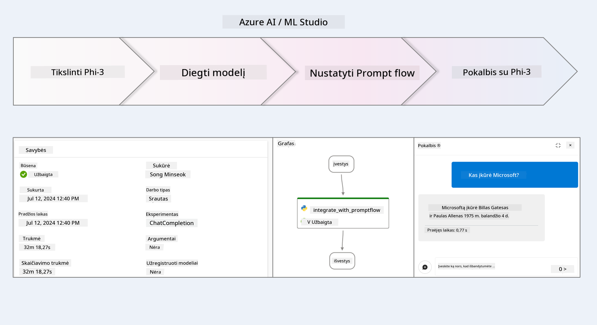

### Turinys

1. **[Scenarijus 1: Azure išteklių paruošimas ir pasiruošimas koregavimui](../../../../../../md/02.Application/01.TextAndChat/Phi3)**
    - [Azure Machine Learning darbalaukio kūrimas](../../../../../../md/02.Application/01.TextAndChat/Phi3)
    - [GPU kvotų užklausa Azure prenumeratoje](../../../../../../md/02.Application/01.TextAndChat/Phi3)
    - [Rolės priskyrimas](../../../../../../md/02.Application/01.TextAndChat/Phi3)
    - [Projekto paruošimas](../../../../../../md/02.Application/01.TextAndChat/Phi3)
    - [Duomenų rinkinio paruošimas koregavimui](../../../../../../md/02.Application/01.TextAndChat/Phi3)

1. **[Scenarijus 2: Phi-3 modelio koregavimas ir diegimas Azure Machine Learning Studio](../../../../../../md/02.Application/01.TextAndChat/Phi3)**
    - [Phi-3 modelio koregavimas](../../../../../../md/02.Application/01.TextAndChat/Phi3)
    - [Pritaikyto Phi-3 modelio diegimas](../../../../../../md/02.Application/01.TextAndChat/Phi3)

1. **[Scenarijus 3: Integravimas su Prompt flow ir pokalbis su jūsų pritaikytu modeliu Azure AI Foundry](../../../../../../md/02.Application/01.TextAndChat/Phi3)**
    - [Pritaikyto Phi-3 modelio integravimas su Prompt flow](../../../../../../md/02.Application/01.TextAndChat/Phi3)
    - [Pokalbis su pritaikytu Phi-3 modeliu](../../../../../../md/02.Application/01.TextAndChat/Phi3)

## Scenarijus 1: Azure išteklių paruošimas ir pasiruošimas koregavimui

### Azure Machine Learning darbalaukio kūrimas

1. Įveskite *azure machine learning* **paieškos juostoje** portalo puslapio viršuje ir iš pasirodžiusių parinkčių pasirinkite **Azure Machine Learning**.

    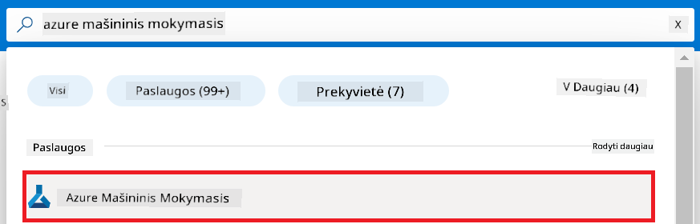

2. Navigacijos meniu pasirinkite **+ Create**.

3. Navigacijos meniu pasirinkite **New workspace**.

    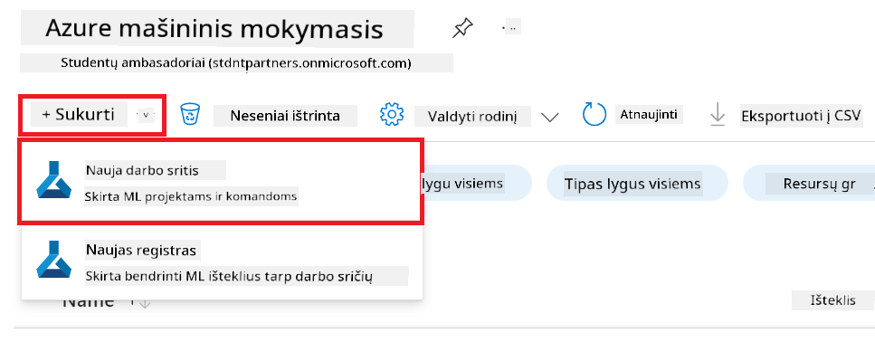

4. Atlikite šiuos veiksmus:

    - Pasirinkite savo Azure **Prenumeratą**.
    - Pasirinkite naudoti **Išteklų grupę** (jei reikia, sukurkite naują).
    - Įveskite **Darbalaukio pavadinimą**. Jis turi būti unikalus.
    - Pasirinkite norimą **Regioną**.
    - Pasirinkite naudoti **Saugyklos paskyrą** (jei reikia, sukurkite naują).
    - Pasirinkite naudoti **Raktų saugyklą** (jei reikia, sukurkite naują).
    - Pasirinkite naudoti **Application insights** (jei reikia, sukurkite naują).
    - Pasirinkite naudoti **Dėžutės registrą** (jei reikia, sukurkite naują).

    

5. Paspauskite **Review + Create**.

6. Paspauskite **Create**.

### GPU kvotų užklausa Azure prenumeratoje

Šioje pamokoje išmoksite, kaip koreguoti ir diegti Phi-3 modelį, naudojant GPU. Koregavimui naudosite *Standard_NC24ads_A100_v4* GPU, kuriam reikalingas kvotos užklausimas. Diegimui naudosite *Standard_NC6s_v3* GPU, kuriam taip pat reikalinga kvotos užklausa.

> [!NOTE]
>
> Tik Pay-As-You-Go prenumeratos (standartinis prenumeratos tipas) yra tinkamos GPU paskyrimui; naudų prenumeratos šiuo metu nepalaikomos.
>

1. Apsilankykite [Azure ML Studio](https://ml.azure.com/home?wt.mc_id=studentamb_279723).

1. Atlikite šiuos veiksmus, kad užklaustumėte *Standard NCADSA100v4 Family* kvotą:

    - Kairiojoje juostoje pasirinkite **Quota**.
    - Pasirinkite norimą **Virtualių mašinų šeimą**. Pavyzdžiui, pasirinkite **Standard NCADSA100v4 Family Cluster Dedicated vCPUs**, kuri apima *Standard_NC24ads_A100_v4* GPU.
    - Navigacijos meniu pasirinkite **Request quota**.

        

    - Kvotos užklausos puslapyje įveskite norimą **Naują branduolių ribą**. Pavyzdžiui, 24.
    - Kvotos užklausos puslapyje spustelėkite **Submit**, kad pateiktumėte GPU kvotos užklausą.

1. Atlikite šiuos veiksmus, kad užklaustumėte *Standard NCSv3 Family* kvotą:

    - Kairiojoje juostoje pasirinkite **Quota**.
    - Pasirinkite norimą **Virtualių mašinų šeimą**. Pavyzdžiui, pasirinkite **Standard NCSv3 Family Cluster Dedicated vCPUs**, kuri apima *Standard_NC6s_v3* GPU.
    - Navigacijos meniu pasirinkite **Request quota**.
    - Kvotos užklausos puslapyje įveskite norimą **Naują branduolių ribą**. Pavyzdžiui, 24.
    - Kvotos užklausos puslapyje spustelėkite **Submit**, kad pateiktumėte GPU kvotos užklausą.

### Rolės priskyrimo pridėjimas

Norėdami koreguoti ir diegti savo modelius, pirmiausia turite sukurti vartotojo priskirtą valdomą tapatybę (User Assigned Managed Identity – UAI) ir jai priskirti tinkamus leidimus. Ši UAI bus naudojama autentifikacijai diegimo metu.

#### Sukurkite vartotojo priskirtą valdomą tapatybę (UAI)

1. Įveskite *managed identities* **paieškos juostoje** portalo puslapio viršuje ir iš pasirodžiusių parinkčių pasirinkite **Managed Identities**.

    

1. Pasirinkite **+ Create**.

    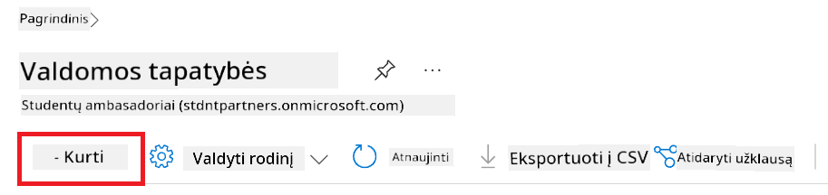

1. Atlikite šiuos veiksmus:

    - Pasirinkite savo Azure **Prenumeratą**.
    - Pasirinkite naudoti **Išteklų grupę** (jei reikia, sukurkite naują).
    - Pasirinkite norimą **Regioną**.
    - Įveskite **Pavadinimą**. Jis turi būti unikalus.

    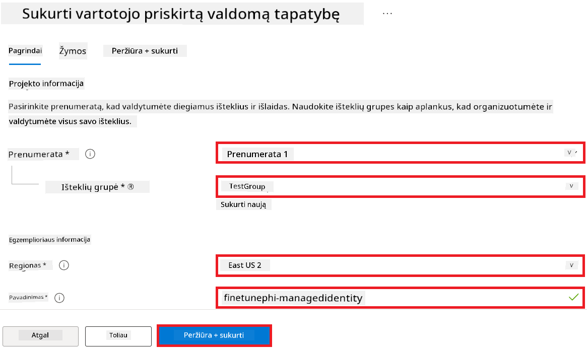

1. Paspauskite **Review + create**.

1. Paspauskite **+ Create**.

#### Pridėkite prie valdomos tapatybės vartotojo vaidmenį „Contributor“

1. Nueikite į sukurtos valdomos tapatybės išteklių puslapį.

1. Kairiojoje juostoje pasirinkite **Azure role assignments**.

1. Navigacijos meniu pasirinkite **+Add role assignment**.

1. „Add role assignment“ puslapyje atlikite šiuos veiksmus:
    - Pasirinkite **Scope** kaip **Resource group**.
    - Pasirinkite savo Azure **Prenumeratą**.
    - Pasirinkite naudoti **Išteklų grupę**.
    - Pasirinkite **Role** kaip **Contributor**.

    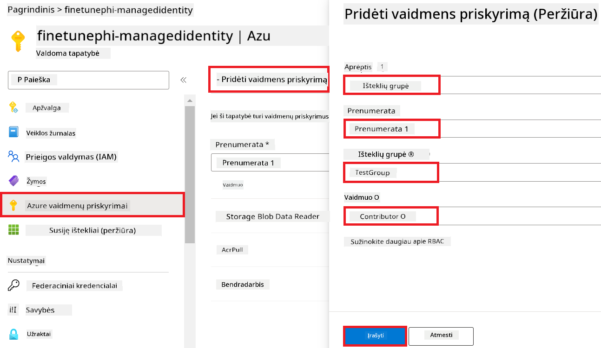

2. Paspauskite **Save**.

#### Pridėkite prie valdomos tapatybės „Storage Blob Data Reader“ vaidmenį

1. Įveskite *storage accounts* **paieškos juostoje** portalo puslapio viršuje ir iš pasirodžiusių parinkčių pasirinkite **Storage accounts**.

    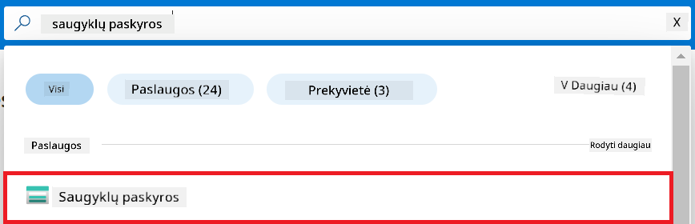

1. Pasirinkite saugyklos paskyrą, susietą su jūsų sukurtu Azure Machine Learning darbalaukiu. Pavyzdžiui, *finetunephistorage*.

1. Atlikite šiuos veiksmus, kad pasiektumėte „Add role assignment“ puslapį:

    - Nueikite į sukurtą Azure Storage paskyrą.
    - Kairiojoje juostoje pasirinkite **Access Control (IAM)**.
    - Navigacijos meniu pasirinkite **+ Add**.
    - Pasirinkite **Add role assignment**.

    

1. „Add role assignment“ puslapyje atlikite šiuos veiksmus:

    - „Role“ puslapyje įveskite *Storage Blob Data Reader* į **paieškos juostą** ir pasirinkite **Storage Blob Data Reader**.
    - Paspauskite **Next**.
    - „Members“ puslapyje pasirinkite **Assign access to** **Managed identity**.
    - Paspauskite **+ Select members**.
    - „Select managed identities“ puslapyje pasirinkite savo Azure **Prenumeratą**.
    - Pasirinkite valdomą tapatybę (**Managed identity**) kaip **Manage Identity**.
    - Pasirinkite savo sukurtą valdomą tapatybę. Pavyzdžiui, *finetunephi-managedidentity*.
    - Paspauskite **Select**.

    

1. Paspauskite **Review + assign**.

#### Pridėkite prie valdomos tapatybės „AcrPull“ vaidmenį

1. Įveskite *container registries* **paieškos juostoje** portalo puslapio viršuje ir iš pasirodžiusių parinkčių pasirinkite **Container registries**.

    

1. Pasirinkite konteinerių registrą, susietą su Azure Machine Learning darbalaukiu. Pavyzdžiui, *finetunephicontainerregistry*.

1. Atlikite šiuos veiksmus, kad pasiektumėte „Add role assignment“ puslapį:

    - Kairiojoje juostoje pasirinkite **Access Control (IAM)**.
    - Navigacijos meniu pasirinkite **+ Add**.
    - Pasirinkite **Add role assignment**.

1. „Add role assignment“ puslapyje atlikite šiuos veiksmus:

    - „Role“ puslapyje įveskite *AcrPull* į **paieškos juostą** ir pasirinkite **AcrPull**.
    - Paspauskite **Next**.
    - „Members“ puslapyje pasirinkite **Assign access to** **Managed identity**.
    - Paspauskite **+ Select members**.
    - „Select managed identities“ puslapyje pasirinkite savo Azure **Prenumeratą**.
    - Pasirinkite valdomą tapatybę (**Managed identity**) kaip **Manage Identity**.
    - Pasirinkite savo sukurtą valdomą tapatybę. Pavyzdžiui, *finetunephi-managedidentity*.
    - Paspauskite **Select**.
    - Paspauskite **Review + assign**.

### Projekto paruošimas

Norėdami atsisiųsti koregavimui reikalingus duomenų rinkinius, paruošite vietinę aplinką.

Šiame pratime jūs

- Sukursite katalogą darbui šiame kataloge.
- Sukursite virtualią aplinką.
- Įdiegs reikalingas paketas.
- Sukursite failą *download_dataset.py*, skirtą duomenų rinkiniui atsisiųsti.

#### Sukurkite katalogą darbui

1. Atidarykite terminalo langą ir įveskite šią komandą, kad numatytojoje vietoje sukurtumėte katalogą pavadinimu *finetune-phi*.

    ```console
    mkdir finetune-phi
    ```

2. Įveskite šią komandą savo terminale, kad pereitumėte į *finetune-phi* aplanką, kurį sukūrėte.

    ```console
    cd finetune-phi
    ```

#### Sukurkite virtualią aplinką

1. Įveskite šią komandą savo terminale, kad sukurtumėte virtualią aplinką pavadinimu *.venv*.

    ```console
    python -m venv .venv
    ```

2. Įveskite šią komandą savo terminale, kad suaktyvintumėte virtualią aplinką.

    ```console
    .venv\Scripts\activate.bat
    ```

> [!NOTE]
> Jei pavyko, prieš komandų eilutę turėtumėte matyti *(.venv)*.

#### Įdiekite reikiamus paketus

1. Įveskite šias komandas savo terminale, kad įdiegtumėte reikiamus paketus.

    ```console
    pip install datasets==2.19.1
    ```

#### Sukurkite `donload_dataset.py`

> [!NOTE]
> Pilna aplanko struktūra:
>
> ```text
> └── YourUserName
> .    └── finetune-phi
> .        └── download_dataset.py
> ```

1. Atidarykite **Visual Studio Code**.

1. Pasirinkite **File** meniu juostoje.

1. Pasirinkite **Open Folder**.

1. Pasirinkite *finetune-phi* aplanką, kurį sukūrėte, esantį *C:\Users\yourUserName\finetune-phi*.

    

1. Kairėje Visual Studio Code skydelio pusėje dešiniuoju pelės mygtuku spustelėkite ir pasirinkite **New File**, kad sukurtumėte naują failą pavadinimu *download_dataset.py*.

    

### Paruoškite duomenų rinkinį tolimesniam pritaikymui

Šiame pratime paleisite *download_dataset.py* failą, kad atsisiųstumėte *ultrachat_200k* duomenų rinkinius į savo vietinę aplinką. Vėliau naudosite šiuos duomenų rinkinius, kad pritaikytumėte Phi-3 modelį Azure Machine Learning aplinkoje.

Šiame pratime jūs:

- Pridėsite kodą į *download_dataset.py* failą, kad atsisiųstumėte duomenų rinkinius.
- Paleisite *download_dataset.py* failą, kad atsisiųstumėte duomenų rinkinius į savo vietinę aplinką.

#### Atsisiųskite savo duomenų rinkinį naudodami *download_dataset.py*

1. Atidarykite *download_dataset.py* failą Visual Studio Code.

1. Įterpkite šį kodą į *download_dataset.py* failą.

    ```python
    import json
    import os
    from datasets import load_dataset

    def load_and_split_dataset(dataset_name, config_name, split_ratio):
        """
        Load and split a dataset.
        """
        # Įkelti duomenų rinkinį su nurodytu pavadinimu, konfigūracija ir skaidymo santykiu
        dataset = load_dataset(dataset_name, config_name, split=split_ratio)
        print(f"Original dataset size: {len(dataset)}")
        
        # Padalinti duomenų rinkinį į mokymo ir testavimo rinkinius (80% mokymui, 20% testavimui)
        split_dataset = dataset.train_test_split(test_size=0.2)
        print(f"Train dataset size: {len(split_dataset['train'])}")
        print(f"Test dataset size: {len(split_dataset['test'])}")
        
        return split_dataset

    def save_dataset_to_jsonl(dataset, filepath):
        """
        Save a dataset to a JSONL file.
        """
        # Sukurti katalogą, jei jis neegzistuoja
        os.makedirs(os.path.dirname(filepath), exist_ok=True)
        
        # Atidaryti failą rašymo režimu
        with open(filepath, 'w', encoding='utf-8') as f:
            # Pereiti per kiekvieną įrašą duomenų rinkinyje
            for record in dataset:
                # Išsaugoti įrašą kaip JSON objektą ir įrašyti į failą
                json.dump(record, f)
                # Įrašyti naujos eilutės simbolį, kad atskirti įrašus
                f.write('\n')
        
        print(f"Dataset saved to {filepath}")

    def main():
        """
        Main function to load, split, and save the dataset.
        """
        # Įkelti ir padalinti ULTRACHAT_200k duomenų rinkinį su specifine konfigūracija ir skaidymo santykiu
        dataset = load_and_split_dataset("HuggingFaceH4/ultrachat_200k", 'default', 'train_sft[:1%]')
        
        # Išskirti mokymo ir testavimo duomenų rinkinius iš padalijimo
        train_dataset = dataset['train']
        test_dataset = dataset['test']

        # Išsaugoti mokymo duomenų rinkinį į JSONL failą
        save_dataset_to_jsonl(train_dataset, "data/train_data.jsonl")
        
        # Išsaugoti testavimo duomenų rinkinį į atskirą JSONL failą
        save_dataset_to_jsonl(test_dataset, "data/test_data.jsonl")

    if __name__ == "__main__":
        main()

    ```

1. Įveskite šią komandą savo terminale, kad paleistumėte skriptą ir atsisiųstumėte duomenų rinkinį į savo vietinę aplinką.

    ```console
    python download_dataset.py
    ```

1. Patikrinkite, ar duomenų rinkiniai buvo sėkmingai išsaugoti jūsų vietiniame *finetune-phi/data* kataloge.

> [!NOTE]
>
> #### Pastaba apie duomenų rinkinio dydį ir tolimesnio pritaikymo laiką
>
> Šiame pamokoje naudojate tik 1% duomenų rinkinio (`split='train[:1%]'`). Tai žymiai sumažina duomenų kiekį, pagreitindama tiek įkėlimą, tiek tolimesnį pritaikymą. Galite reguliuoti procentą, kad surastumėte tinkamą balansą tarp treniruočių laiko ir modelio našumo. Naudojant mažesnę duomenų rinkinio dalį, tolimesnis pritaikymas trunka trumpiau ir yra valdomesnis, kas ypač naudinga mokymosi tikslais.

## Scenarijus 2: Pritaikyti Phi-3 modelį ir diegti Azure Machine Learning Studio

### Pritaikyti Phi-3 modelį

Šiame pratime jūs pritaikysite Phi-3 modelį Azure Machine Learning Studio.

Šiame pratime jūs:

- Sukursite kompiuterių klasterį tolimesniam pritaikymui.
- Pritaikysite Phi-3 modelį Azure Machine Learning Studio.

#### Sukurkite kompiuterių klasterį tolimesniam pritaikymui

1. Apsilankykite adresu [Azure ML Studio](https://ml.azure.com/home?wt.mc_id=studentamb_279723).

1. Kairėje pusėje pasirinkite **Compute**.

1. Navigacijos meniu pasirinkite **Compute clusters**.

1. Paspauskite **+ New**.

    

1. Atlikite šiuos veiksmus:

    - Pasirinkite norimą **Region**.
    - Pasirinkite **Virtual machine tier** į **Dedicated**.
    - Pasirinkite **Virtual machine type** į **GPU**.
    - Pasirinkite **Virtual machine size** filtrą į **Select from all options**.
    - Pasirinkite **Virtual machine size** į **Standard_NC24ads_A100_v4**.

    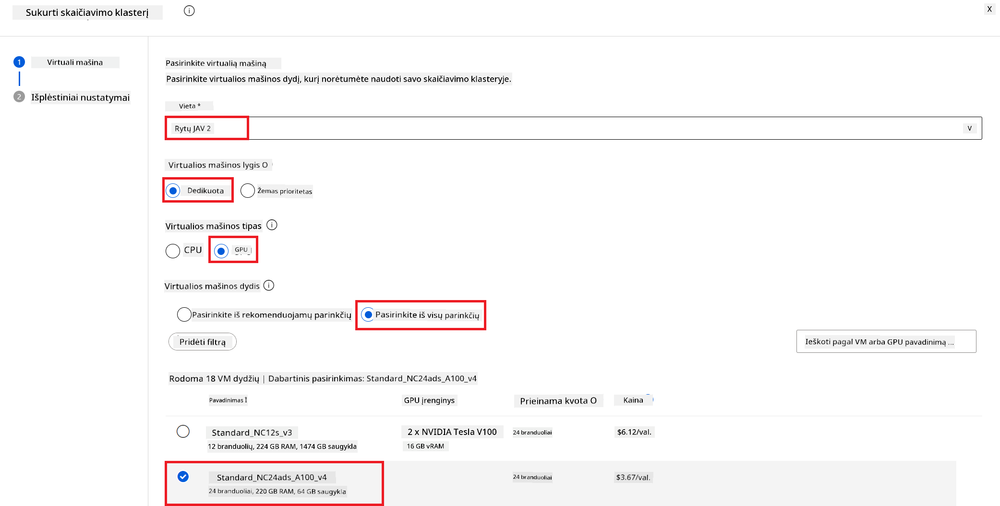

1. Paspauskite **Next**.

1. Atlikite šiuos veiksmus:

    - Įveskite **Compute name**. Jame turi būti unikalus pavadinimas.
    - Pasirinkite **Minimum number of nodes** į **0**.
    - Pasirinkite **Maximum number of nodes** į **1**.
    - Pasirinkite **Idle seconds before scale down** į **120**.

    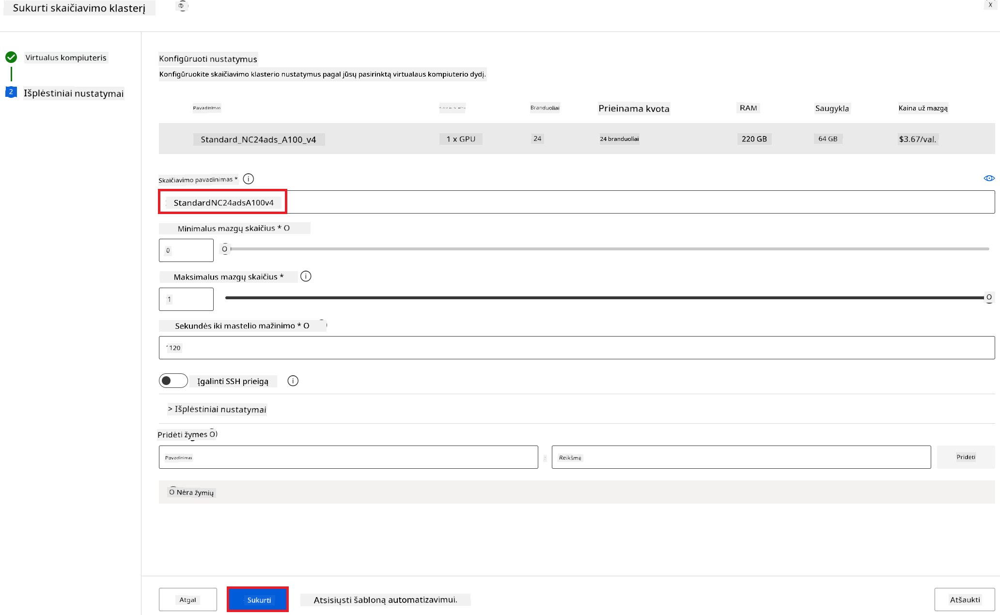

1. Paspauskite **Create**.

#### Pritaikyti Phi-3 modelį

1. Apsilankykite adresu [Azure ML Studio](https://ml.azure.com/home?wt.mc_id=studentamb_279723).

1. Pasirinkite sukurtą Azure Machine Learning darbo sritį.

    

1. Atlikite šiuos veiksmus:

    - Kairėje pasirinkite **Model catalog**.
    - Paieškos juostoje įveskite *phi-3-mini-4k* ir iš sąrašo pasirinkite **Phi-3-mini-4k-instruct**.

    

1. Navigacijos meniu pasirinkite **Fine-tune**.

    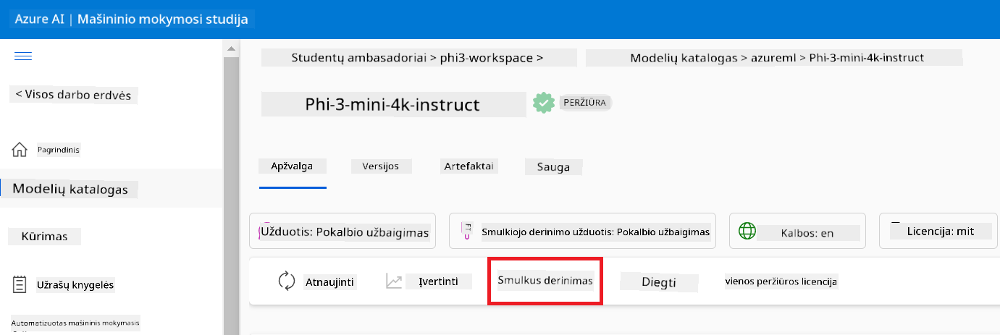

1. Atlikite šiuos veiksmus:

    - Pasirinkite **Select task type** į **Chat completion**.
    - Paspauskite **+ Select data**, kad įkeltumėte **Treniruojamuosius duomenis**.
    - Pasirinkite Validacijos duomenų įkėlimo tipą į **Provide different validation data**.
    - Paspauskite **+ Select data**, kad įkeltumėte **Validacijos duomenis**.

    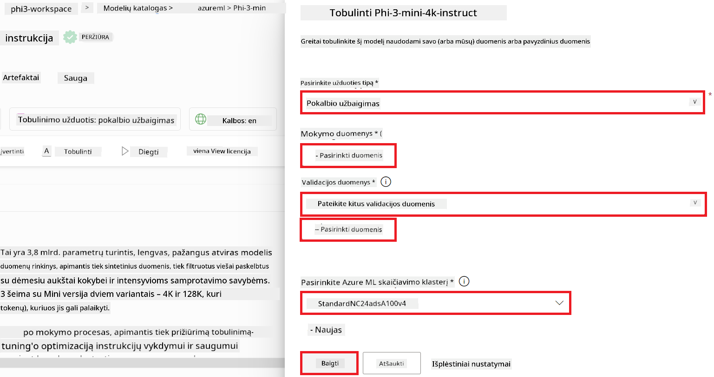

> [!TIP]
>
> Galite pasirinkti **Advanced settings**, kad pritaikytumėte nustatymus, pavyzdžiui, **learning_rate** ir **lr_scheduler_type**, optimizuodami tolimesnio pritaikymo procesą pagal savo poreikius.

1. Paspauskite **Finish**.

1. Šiame pratime sėkmingai pritaikėte Phi-3 modelį naudodami Azure Machine Learning. Atkreipkite dėmesį, kad toks pritaikymo procesas gali užtrukti nemažai laiko. Paleidę tolimesnio pritaikymo užduotį, turite palaukti, kol ji bus įvykdyta. Galite stebėti užduoties būseną pažymėdami Jobs skirtuką Azure Machine Learning darbo srityje kairėje pusėje. Kitoje serijoje diegsite pritaikytą modelį ir integruosite jį su Prompt flow.

    

### Diegti pritaikytą Phi-3 modelį

Norėdami integruoti pritaikytą Phi-3 modelį su Prompt flow, turite jį įdiegti, kad būtų pasiekiamas realaus laiko užklausoms. Šis procesas apima modelio registravimą, internetinio endpoint kūrimą ir modelio diegimą.

Šiame pratime jūs:

- Užregistruosite pritaikytą modelį Azure Machine Learning darbo srityje.
- Sukursite internetinį endpoint.
- Įdiegsite užregistruotą pritaikytą Phi-3 modelį.

#### Užregistruokite pritaikytą modelį

1. Apsilankykite adresu [Azure ML Studio](https://ml.azure.com/home?wt.mc_id=studentamb_279723).

1. Pasirinkite sukurtą Azure Machine Learning darbo sritį.

    

1. Kairėje pusėje pasirinkite **Models**.
1. Paspauskite **+ Register**.
1. Pasirinkite **From a job output**.

    

1. Pasirinkite sukurtą užduotį.

    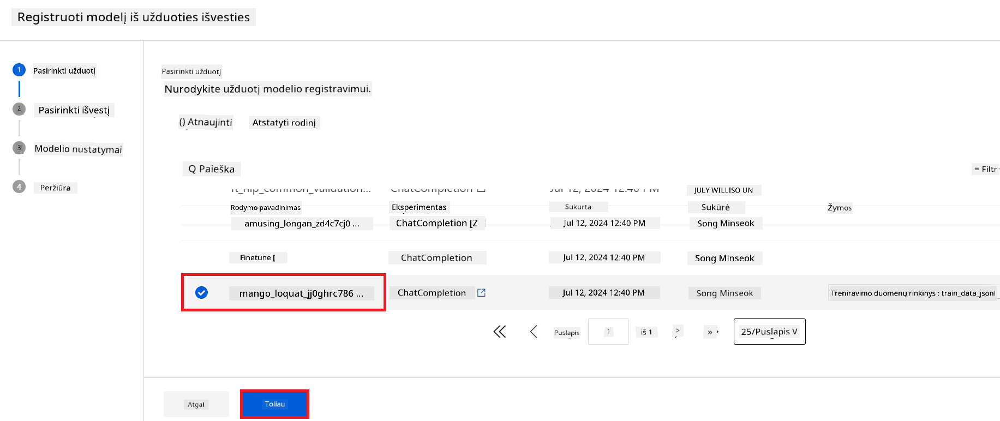

1. Paspauskite **Next**.

1. Pasirinkite **Model type** kaip **MLflow**.

1. Įsitikinkite, kad pasirinktas **Job output**; jis turėtų būti pasirinktas automatiškai.

    

2. Paspauskite **Next**.

3. Paspauskite **Register**.

    

4. Užregistruotą modelį galite peržiūrėti pasirinkę **Models** meniu kairėje pusėje.

    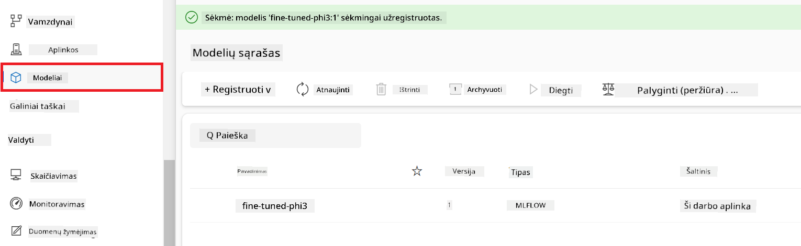

#### Įdiekite pritaikytą modelį

1. Eikite į sukurtą Azure Machine Learning darbo sritį.

1. Kairėje pusėje pasirinkite **Endpoints**.

1. Navigacijos meniu pasirinkite **Real-time endpoints**.

    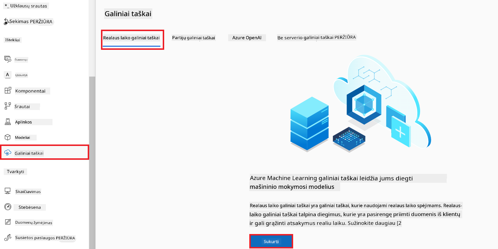

1. Paspauskite **Create**.

1. Pasirinkite užregistruotą modelį, kurį sukūrėte.

    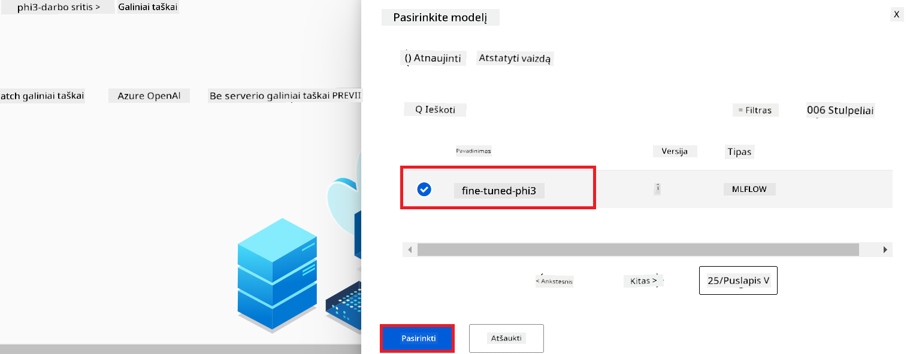

1. Atlikite šiuos veiksmus:

    - Pasirinkite **Virtual machine** į *Standard_NC6s_v3*.
    - Pasirinkite norimą **Instance count**, pavyzdžiui, *1*.
    - Pasirinkite **Endpoint** į **New**, kad sukurtumėte naują endpoint.
    - Įveskite **Endpoint name**. Jis turi būti unikalus.
    - Įveskite **Deployment name**. Jis turi būti unikalus.

    

1. Paspauskite **Deploy**.

> [!WARNING]
> Kad išvengtumėte papildomų mokesčių, įsitikinkite, kad ištrynėte sukurtą endpoint Azure Machine Learning darbo srityje.
>

#### Patikrinkite diegimo būseną Azure Machine Learning darbo srityje

1. Eikite į sukurtą Azure Machine Learning darbo sritį.

1. Kairėje pusėje pasirinkite **Endpoints**.

1. Pasirinkite sukurtą endpoint.

    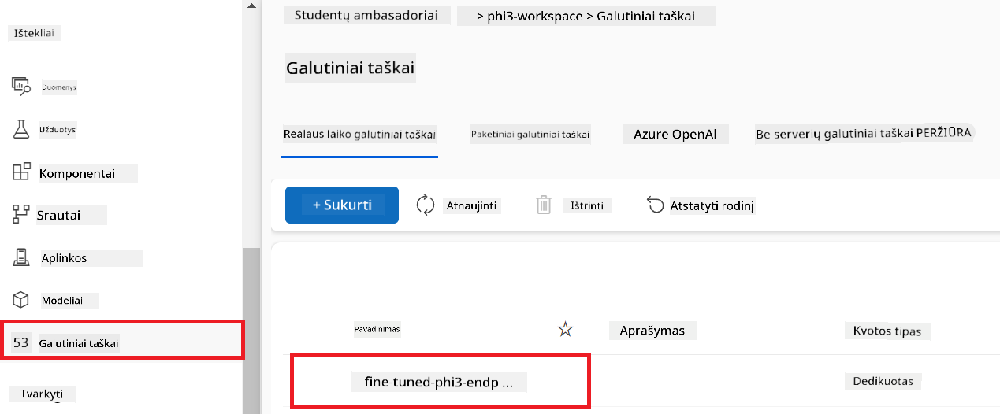

1. Šiame puslapyje galite tvarkyti endpointus diegimo metu.

> [!NOTE]
> Kai diegimas bus baigtas, įsitikinkite, kad **Live traffic** yra nustatytas į **100%**. Jei ne, pasirinkite **Update traffic**, kad pakoreguotumėte srauto nustatymus. Atkreipkite dėmesį, kad negalite testuoti modelio, jei srautas nustatytas 0%.
>
> 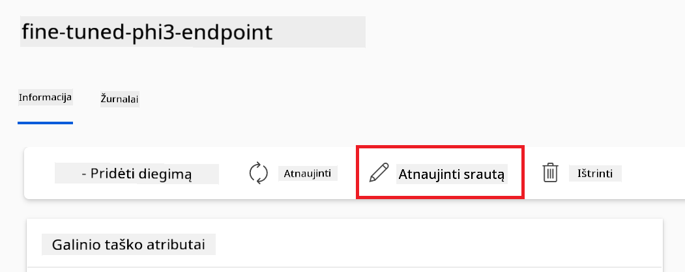
>

## Scenarijus 3: Integruoti su Prompt flow ir bendrauti su savo individualiu modeliu Azure AI Foundry

### Integruoti individualų Phi-3 modelį su Prompt flow

Sėkmingai įdiegę savo pritaikytą modelį, dabar galite integruoti jį su Prompt Flow ir naudoti savo modelį realaus laiko programėlėse, leidžiant atlikti įvairias interaktyvias užduotis su individualiu Phi-3 modeliu.

Šiame pratime jūs:

- Sukursite Azure AI Foundry Hub.
- Sukursite Azure AI Foundry projektą.
- Sukursite Prompt flow.
- Pridėsite individualų ryšį pritaikytam Phi-3 modeliui.
- Suveskite Prompt flow, kad galėtumėte bendrauti su savo individualiu Phi-3 modeliui.

> [!NOTE]
> Taip pat galite integruoti su Promptflow naudodami Azure ML Studio. Tas pats integracijos procesas taikomas ir Azure ML Studio.

#### Sukurkite Azure AI Foundry Hub

Prieš sukuriant projektą, reikia sukurti Hub'ą. Hub'as veikia kaip Resursų grupė, leidžianti jums organizuoti ir valdyti kelis projektus Azure AI Foundry aplinkoje.

1. Apsilankykite adresu [Azure AI Foundry](https://ai.azure.com/?WT.mc_id=aiml-137032-kinfeylo).

1. Kairėje pusėje pasirinkite **All hubs**.

1. Navigacijos meniu pasirinkite **+ New hub**.
    

1. Atlikite šiuos veiksmus:

    - Įveskite **Centro pavadinimą**. Jis turi būti unikalus.
    - Pasirinkite savo Azure **Prenumeratą**.
    - Pasirinkite **Išteklių grupę**, kurią norite naudoti (sukurkite naują, jei reikia).
    - Pasirinkite norimą naudoti **Vietą**.
    - Pasirinkite **Prisijungti prie Azure AI paslaugų** (sukurkite naują, jei reikia).
    - Pasirinkite **Prisijungti prie Azure AI paieškos** ir pasirinkite **Praleisti prisijungimą**.

    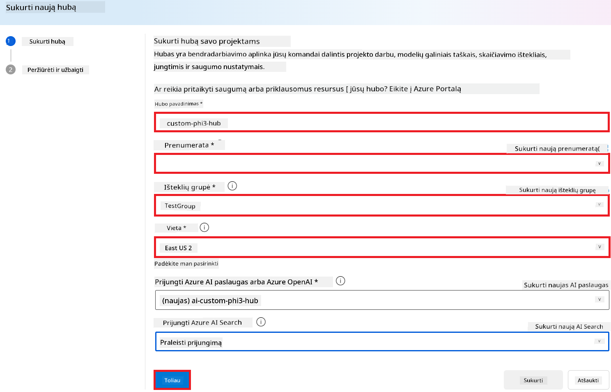

1. Pasirinkite **Toliau**.

#### Sukurti Azure AI Foundry projektą

1. Centre, kurį sukūrėte, pasirinkite **Visi projektai** kairėje puslapio skiltyje.

1. Navigacijos meniu pasirinkite **+ Naujas projektas**.

    

1. Įveskite **Projekto pavadinimą**. Jis turi būti unikalus.

    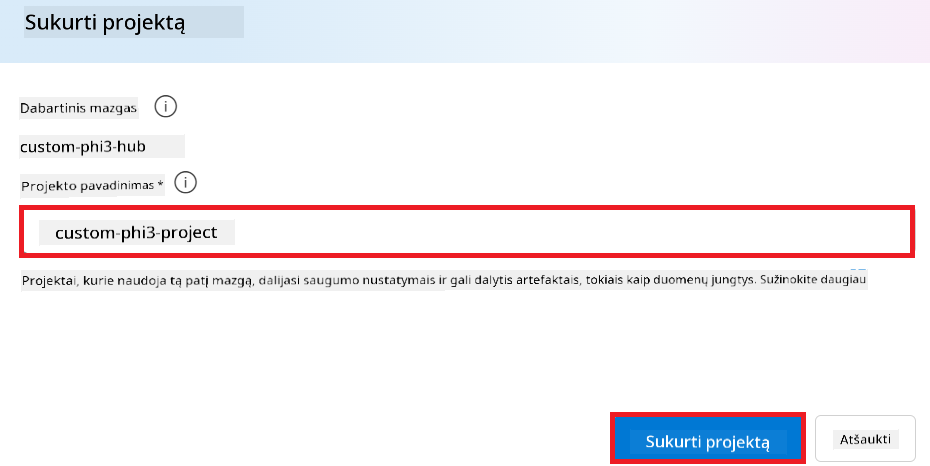

1. Pasirinkite **Sukurti projektą**.

#### Pridėti pasirinktą ryšį su fine-tuninguotu Phi-3 modeliu

Norėdami integruoti savo pasirinktinį Phi-3 modelį su Prompt flow, turite išsaugoti modelio galinį tašką ir raktą pasirinktinio ryšio nustatyme. Šis nustatymas užtikrina prieigą prie jūsų pasirinktinio Phi-3 modelio Prompt flow aplinkoje.

#### Nustatyti api raktą ir galinio taško URI fine-tuninguotam Phi-3 modeliui

1. Apsilankykite [Azure ML Studio](https://ml.azure.com/home?WT.mc_id=aiml-137032-kinfeylo).

1. Eikite į Azure Machine learning darbo sritį, kurią sukūrėte.

1. Pasirinkite **Galiniai taškai (Endpoints)** kairėje puslapio skiltyje.

    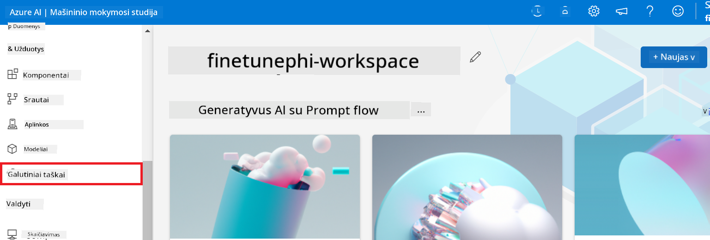

1. Pasirinkite sukurtą galinį tašką.

    

1. Navigacijos meniu pasirinkite **Naudoti (Consume)**.

1. Nukopijuokite savo **REST galinį tašką** ir **Pagrindinį raktą**.

    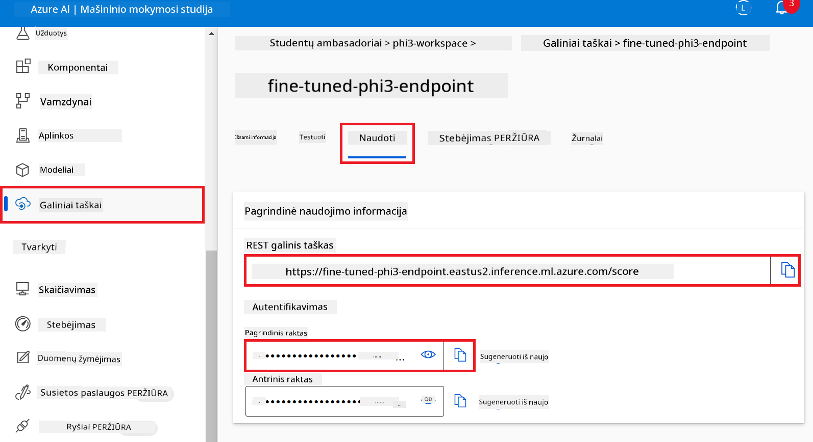

#### Pridėti pasirinktinį ryšį

1. Apsilankykite [Azure AI Foundry](https://ai.azure.com/?WT.mc_id=aiml-137032-kinfeylo).

1. Eikite į sukurtą Azure AI Foundry projektą.

1. Proekte, kurį sukūrėte, pasirinkite **Nustatymai** kairėje puslapio skiltyje.

1. Pasirinkite **+ Naujas ryšys**.

    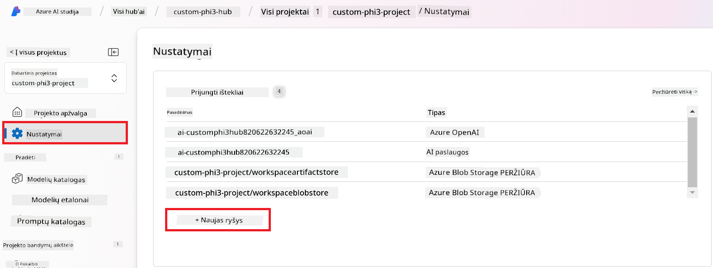

1. Navigacijos meniu pasirinkite **Pasirinktinius raktus**.

    

1. Atlikite šiuos veiksmus:

    - Pasirinkite **+ Pridėti rakto ir reikšmės poras**.
    - Rakto vardui įveskite **endpoint** ir į reikšmės lauką įklijuokite galinį tašką, kurį nukopijavote iš Azure ML Studio.
    - Vėl pasirinkite **+ Pridėti rakto ir reikšmės poras**.
    - Rakto vardui įveskite **key** ir į reikšmės lauką įklijuokite raktą, kurį nukopijavote iš Azure ML Studio.
    - Pridėjus raktus, pažymėkite **yra slaptas (is secret)**, kad raktas nebūtų viešai rodomas.

    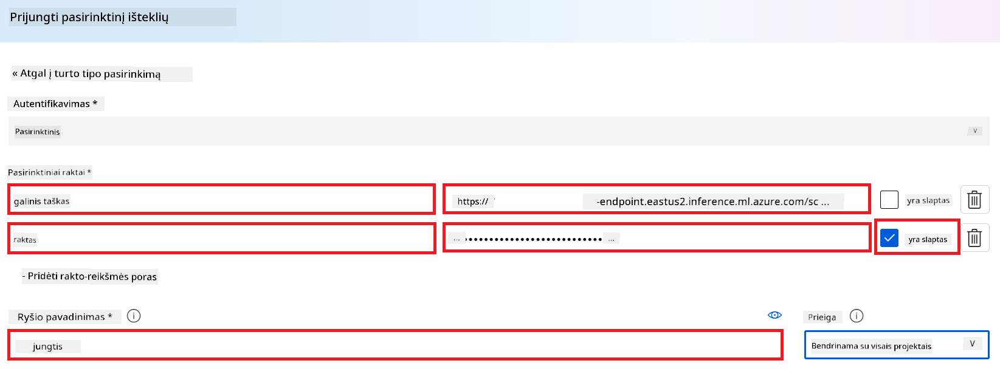

1. Pasirinkite **Pridėti ryšį**.

#### Sukurti Prompt flow

Jūs pridėjote pasirinktą ryšį Azure AI Foundry. Dabar sukurkime Prompt flow naudodami šiuos veiksmus. Tada sujungsime šį Prompt flow su pasirinktu ryšiu, kad galėtumėte naudoti fine-tuninguotą modelį Prompt flow aplinkoje.

1. Eikite į sukurtą Azure AI Foundry projektą.

1. Pasirinkite **Prompt flow** kairėje puslapio skiltyje.

1. Navigacijos meniu pasirinkite **+ Kurti**.

    

1. Navigacijos meniu pasirinkite **Pokalbio srautas (Chat flow)**.

    

1. Įveskite **Aplanko pavadinimą**.

    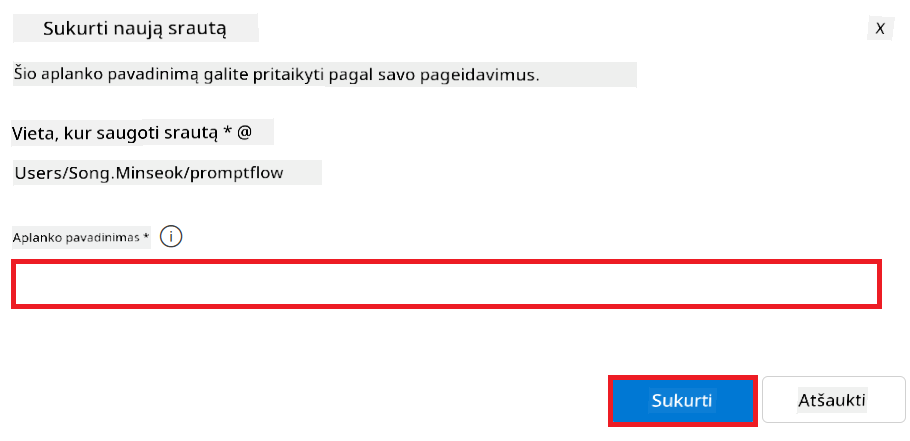

2. Pasirinkite **Sukurti**.

#### Paruošti Prompt flow pokalbiui su jūsų pasirinktu Phi-3 modeliu

Reikia integruoti fine-tuninguotą Phi-3 modelį į Prompt flow. Tačiau esamas Prompt flow nėra sukurtas šiai užduočiai, todėl turite perkurti Prompt flow, kad būtų galima integruoti pasirinktą modelį.

1. Prompt flow aplinkoje atlikite šiuos veiksmus, kad rekonstruotumėte esamą srautą:

    - Pasirinkite **Žaliavos failo režimą (Raw file mode)**.
    - Ištrinkite visą esamą kodą faile *flow.dag.yml*.
    - Įrašykite šį kodą į *flow.dag.yml* failą.

        ```yml
        inputs:
          input_data:
            type: string
            default: "Who founded Microsoft?"

        outputs:
          answer:
            type: string
            reference: ${integrate_with_promptflow.output}

        nodes:
        - name: integrate_with_promptflow
          type: python
          source:
            type: code
            path: integrate_with_promptflow.py
          inputs:
            input_data: ${inputs.input_data}
        ```

    - Pasirinkite **Išsaugoti (Save)**.

    

1. Pridėkite šį kodą į failą *integrate_with_promptflow.py*, kad naudotumėte pasirinktą Phi-3 modelį Prompt flow.

    ```python
    import logging
    import requests
    from promptflow import tool
    from promptflow.connections import CustomConnection

    # Žurnalo nustatymas
    logging.basicConfig(
        format="%(asctime)s - %(levelname)s - %(name)s - %(message)s",
        datefmt="%Y-%m-%d %H:%M:%S",
        level=logging.DEBUG
    )
    logger = logging.getLogger(__name__)

    def query_phi3_model(input_data: str, connection: CustomConnection) -> str:
        """
        Send a request to the Phi-3 model endpoint with the given input data using Custom Connection.
        """

        # "connection" yra pasirinktinės jungties pavadinimas, "endpoint", "key" yra raktai pasirinktinėje jungtyje
        endpoint_url = connection.endpoint
        api_key = connection.key

        headers = {
            "Content-Type": "application/json",
            "Authorization": f"Bearer {api_key}"
        }
        data = {
            "input_data": {
                "input_string": [
                    {"role": "user", "content": input_data}
                ],
                "parameters": {
                    "temperature": 0.7,
                    "max_new_tokens": 128
                }
            }
        }
        try:
            response = requests.post(endpoint_url, json=data, headers=headers)
            response.raise_for_status()
            
            # Užfiksuokite visą JSON atsakymą
            logger.debug(f"Full JSON response: {response.json()}")

            result = response.json()["output"]
            logger.info("Successfully received response from Azure ML Endpoint.")
            return result
        except requests.exceptions.RequestException as e:
            logger.error(f"Error querying Azure ML Endpoint: {e}")
            raise

    @tool
    def my_python_tool(input_data: str, connection: CustomConnection) -> str:
        """
        Tool function to process input data and query the Phi-3 model.
        """
        return query_phi3_model(input_data, connection)

    ```

    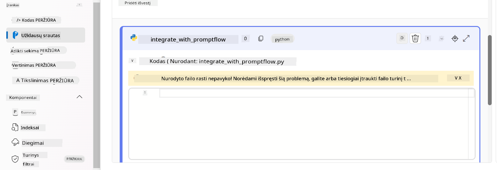

> [!NOTE]
> Daugiau informacijos apie Prompt flow naudojimą Azure AI Foundry aplinkoje rasite [čia](https://learn.microsoft.com/azure/ai-studio/how-to/prompt-flow).

1. Pasirinkite **Pokalbio įvestį (Chat input)** ir **Pokalbio išvestį (Chat output)**, kad būtų galima kalbėtis su modeliu.

    

1. Dabar galite pradėti pokalbį su savo pasirinktu Phi-3 modeliu. Kitame pratime sužinosite, kaip paleisti Prompt flow ir naudoti jį pokalbiui su fine-tuninguotu Phi-3 modeliu.

> [!NOTE]
>
> Perkurta srauto schema turėtų atrodyti panašiai kaip žemiau:
>
> 
>

### Kalbėkitės su savo pasirinktu Phi-3 modeliu

Dabar, kai fine-tuninote ir integravote savo pasirinktinį Phi-3 modelį į Prompt flow, esate pasiruošę pradėti sąveiką su juo. Šis pratimas nukreips jus per proceso nustatymą ir pradžią kalbėtis su modeliu naudojant Prompt flow. Sekdami šiais žingsniais galėsite pilnai išnaudoti savo fine-tuninguoto Phi-3 modelio galimybes įvairioms užduotims ir pokalbiams.

- Kalbėkitės su savo pasirinktu Phi-3 modeliu naudodami Prompt flow.

#### Paleisti Prompt flow

1. Pasirinkite **Paleisti skaičiavimo sesijas (Start compute sessions)**, kad pradėtumėte Prompt flow.

    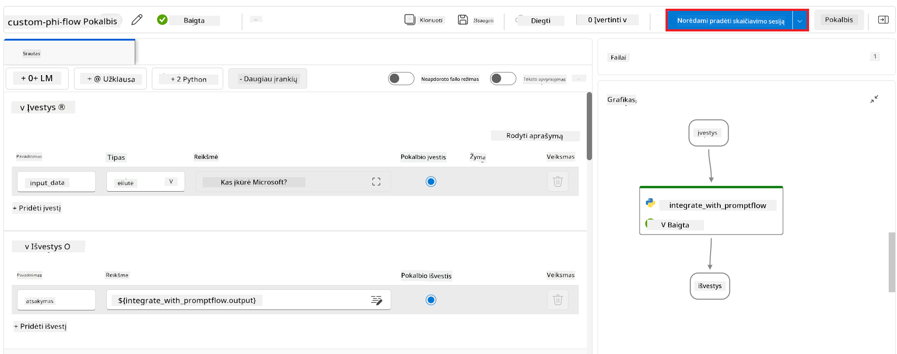

1. Pasirinkite **Patvirtinti ir analizuoti įvestį (Validate and parse input)**, kad atnaujintumėte parametrus.

    

1. Pasirinkite **Connection** reikšmę, kurią susiejote su savo sukurtu pasirinktu ryšiu. Pvz., *connection*.

    

#### Kalbėkitės su savo pasirinktu modeliu

1. Pasirinkite **Pokalbis (Chat)**.

    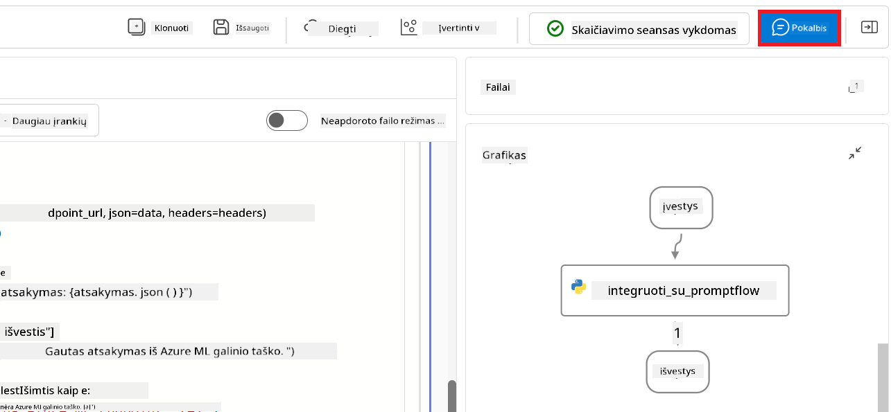

1. Čia pateikiamas rezultatų pavyzdys: Dabar galite kalbėtis su savo pasirinktu Phi-3 modeliu. Rekomenduojama užduoti klausimus, remiantis fine-tuning'o duomenimis.

    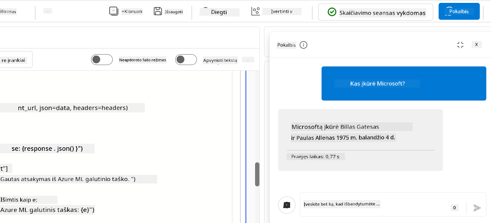

---

<!-- CO-OP TRANSLATOR DISCLAIMER START -->
**Atsakomybės apribojimas**:
Šis dokumentas buvo išverstas naudojant dirbtinio intelekto vertimo paslaugą [Co-op Translator](https://github.com/Azure/co-op-translator). Nors stengiamės užtikrinti tikslumą, prašome atkreipti dėmesį, kad automatiniai vertimai gali turėti klaidų ar netikslumų. Originalus dokumentas jo gimtąja kalba turi būti laikomas autoritetingu šaltiniu. Svarbios informacijos atveju rekomenduojama kreiptis į profesionalius vertėjus. Mes neprisiimame atsakomybės už bet kokius nesusipratimus ar neteisingus aiškinimus, kylantį iš šio vertimo naudojimo.
<!-- CO-OP TRANSLATOR DISCLAIMER END -->