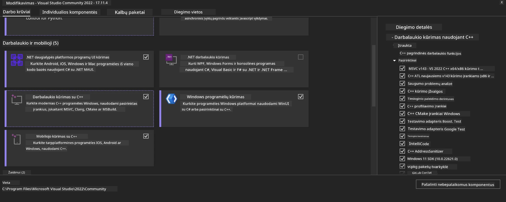
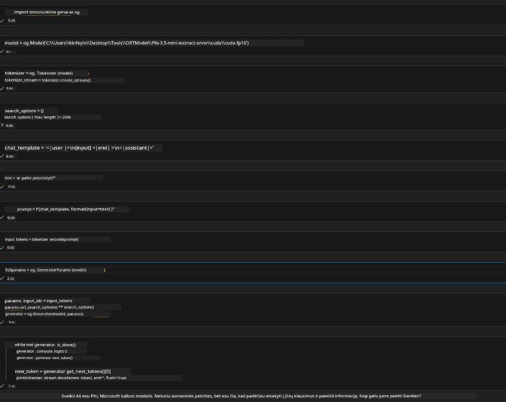
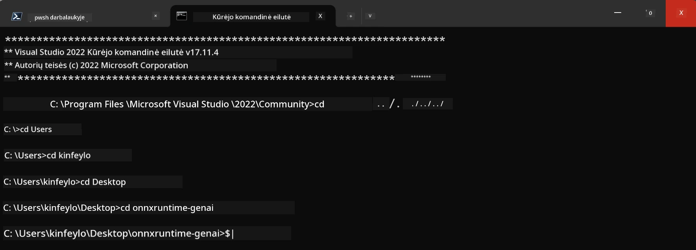

# **Vadovas OnnxRuntime GenAI Windows GPU**

Šis vadovas pateikia žingsnius, kaip nustatyti ir naudoti ONNX Runtime (ORT) su GPU Windows aplinkoje. Jis skirtas padėti jums pasinaudoti GPU pagreitinimu savo modeliams, gerinant našumą ir efektyvumą.

Dokumentas pateikia gaires:

- Aplinkos nustatymas: Nurodymai, kaip įdiegti reikalingas priklausomybes, tokias kaip CUDA, cuDNN ir ONNX Runtime.
- Konfigūracija: Kaip sukonfigūruoti aplinką ir ONNX Runtime, kad efektyviai naudotumėte GPU išteklius.
- Optimizacijos patarimai: Patarimai, kaip patobulinti GPU nustatymus optimaliai veiklai.

### **1. Python 3.10.x /3.11.8**

   ***Pastaba*** Siūloma naudoti [miniforge](https://github.com/conda-forge/miniforge/releases/latest/download/Miniforge3-Windows-x86_64.exe) kaip savo Python aplinką

   ```bash

   conda create -n pydev python==3.11.8

   conda activate pydev

   ```

   ***Priminkite*** Jei turite įdiegtą bet kurią Python ONNX biblioteką, ją prašome pašalinti

### **2. Įdiekite CMake su winget**


   ```bash

   winget install -e --id Kitware.CMake

   ```

### **3. Įdiekite Visual Studio 2022 - Desktop Development su C++**

   ***Pastaba*** Jei nenorite kompiliuoti, galite praleisti šį žingsnį




### **4. Įdiekite NVIDIA tvarkyklę**

1. **NVIDIA GPU tvarkyklė**  [https://www.nvidia.com/en-us/drivers/](https://www.nvidia.com/en-us/drivers/)

2. **NVIDIA CUDA 12.4** [https://developer.nvidia.com/cuda-12-4-0-download-archive](https://developer.nvidia.com/cuda-12-4-0-download-archive)

3. **NVIDIA CUDNN 9.4**  [https://developer.nvidia.com/cudnn-downloads](https://developer.nvidia.com/cudnn-downloads)

***Priminkite*** Prašome naudoti numatytuosius nustatymus diegimo metu

### **5. Nustatykite NVIDIA aplinką**

Nukopijuokite NVIDIA CUDNN 9.4 lib, bin, include į NVIDIA CUDA 12.4 lib, bin, include

- nukopijuokite *'C:\Program Files\NVIDIA\CUDNN\v9.4\bin\12.6'* failus į  *'C:\Program Files\NVIDIA GPU Computing Toolkit\CUDA\v12.4\bin*

- nukopijuokite *'C:\Program Files\NVIDIA\CUDNN\v9.4\include\12.6'* failus į  *'C:\Program Files\NVIDIA GPU Computing Toolkit\CUDA\v12.4\include*

- nukopijuokite *'C:\Program Files\NVIDIA\CUDNN\v9.4\lib\12.6'* failus į  *'C:\Program Files\NVIDIA GPU Computing Toolkit\CUDA\v12.4\lib\x64'*


### **6. Atsisiųskite Phi-3.5-mini-instruct-onnx**


   ```bash

   winget install -e --id Git.Git

   winget install -e --id GitHub.GitLFS

   git lfs install

   git clone https://huggingface.co/microsoft/Phi-3.5-mini-instruct-onnx

   ```

### **7. Paleiskite InferencePhi35Instruct.ipynb**

   Atverkite [Notebook](../../../../code/09.UpdateSamples/Aug/ortgpu-phi35-instruct.ipynb) ir vykdykite 





### **8. Kompiliuokite ORT GenAI GPU**


   ***Pastaba*** 
   
   1. Prašome pirmiausia pašalinti visas onnx, onnxruntime ir onnxruntime-genai bibliotekas

   
   ```bash

   pip list 
   
   ```

   Tada pašalinkite visas onnxruntime bibliotekas, pvz.


   ```bash

   pip uninstall onnxruntime

   pip uninstall onnxruntime-genai

   pip uninstall onnxruntume-genai-cuda
   
   ```

   2. Patikrinkite Visual Studio plėtinius

   Patikrinkite C:\Program Files\NVIDIA GPU Computing Toolkit\CUDA\v12.4\extras, ar yra C:\Program Files\NVIDIA GPU Computing Toolkit\CUDA\v12.4\extras\visual_studio_integration. 
   
   Jei nerandate, patikrinkite kitus Cuda įrankių rinkinio katalogus ir nukopijuokite visual_studio_integration aplanką bei turinį į C:\Program Files\NVIDIA GPU Computing Toolkit\CUDA\v12.4\extras\visual_studio_integration


   - Jei nenorite kompiliuoti, galite praleisti šį žingsnį


   ```bash

   git clone https://github.com/microsoft/onnxruntime-genai

   ```

   - Atsisiųskite [https://github.com/microsoft/onnxruntime/releases/download/v1.19.2/onnxruntime-win-x64-gpu-1.19.2.zip](https://github.com/microsoft/onnxruntime/releases/download/v1.19.2/onnxruntime-win-x64-gpu-1.19.2.zip)

   - Išarchyvuokite onnxruntime-win-x64-gpu-1.19.2.zip, pervardykite jį į **ort**, nukopijuokite ort aplanką į onnxruntime-genai

   - Naudodami Windows Terminal pereikite į Developer Command Prompt for VS 2022 ir eikite į onnxruntime-genai 



   - Kompiliuokite jį su savo Python aplinka

   
   ```bash

   cd onnxruntime-genai

   python build.py --use_cuda  --cuda_home "C:\Program Files\NVIDIA GPU Computing Toolkit\CUDA\v12.4" --config Release
 

   cd build/Windows/Release/Wheel

   pip install .whl

   ```

---

<!-- CO-OP TRANSLATOR DISCLAIMER START -->
**Atsakomybės apribojimas**:
Šis dokumentas buvo išverstas naudojant dirbtinio intelekto vertimo paslaugą [Co-op Translator](https://github.com/Azure/co-op-translator). Nors siekiame tikslumo, prašome atkreipti dėmesį, kad automatiniai vertimai gali turėti klaidų ar netikslumų. Originalus dokumentas jo gimtąja kalba laikomas autoritetingu šaltiniu. Svarbiai informacijai rekomenduojama naudoti profesionalų žmogiškąjį vertimą. Mes neatsakome už jokius nesusipratimus ar neteisingą interpretaciją, kilusią naudojantis šiuo vertimu.
<!-- CO-OP TRANSLATOR DISCLAIMER END -->