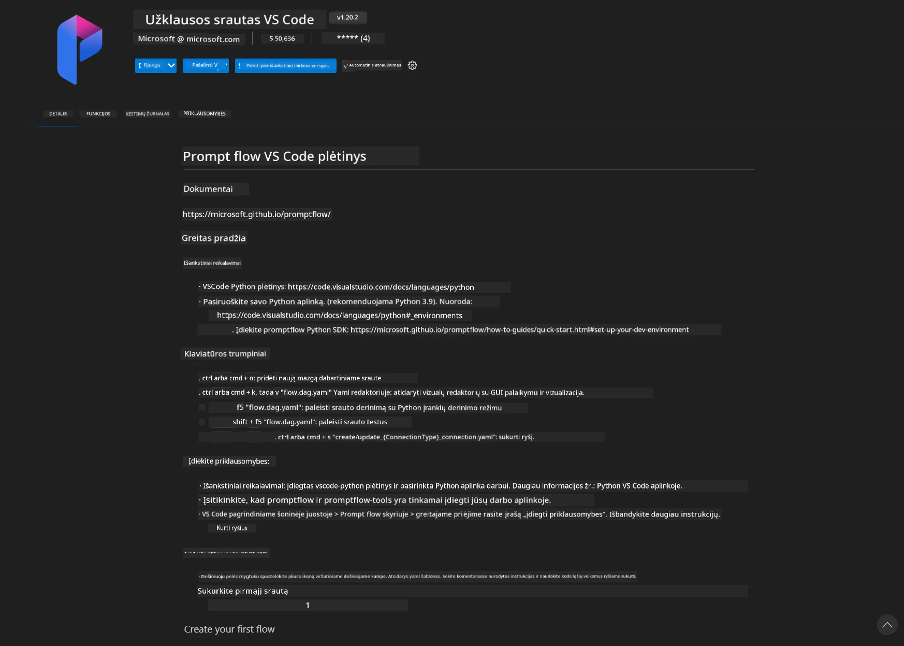
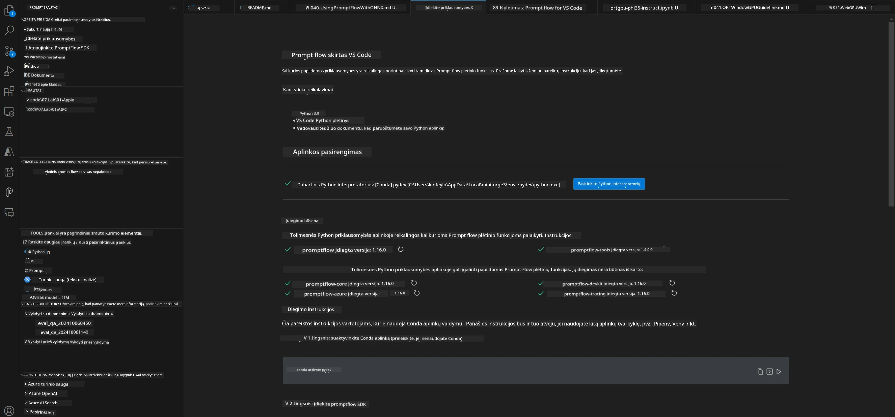
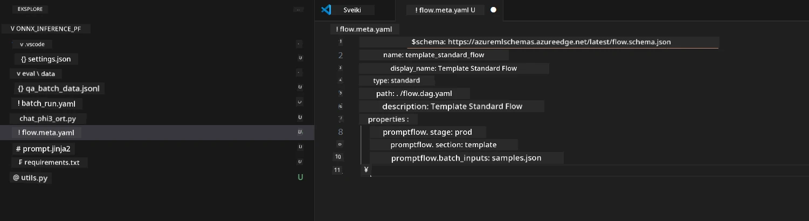
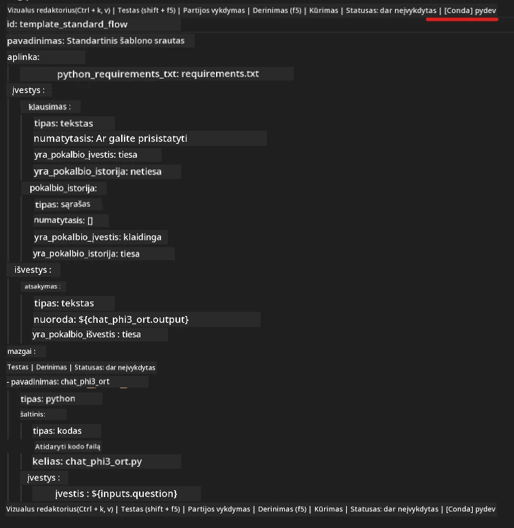
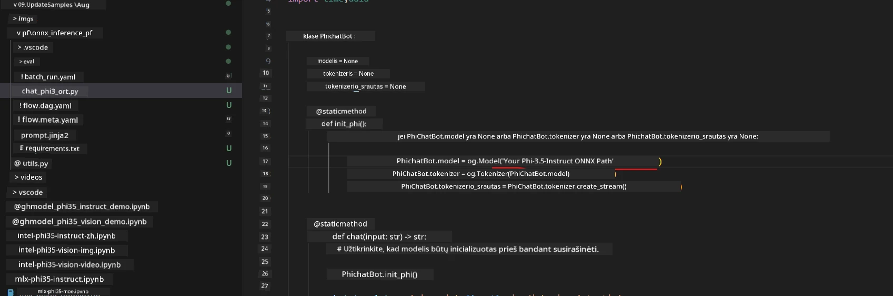
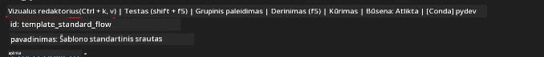
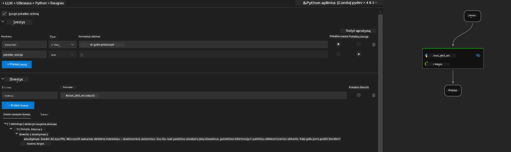
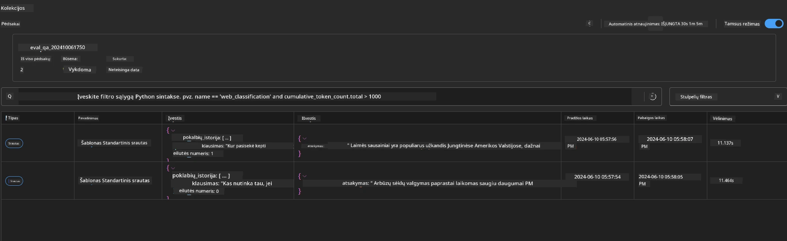

# Kaip naudoti Windows GPU kuriant Prompt flow sprendimą su Phi-3.5-Instruct ONNX 

Šiame dokumente pateikiamas pavyzdys, kaip naudoti PromptFlow su ONNX (Open Neural Network Exchange) kuriant dirbtinio intelekto programas, pagrįstas Phi-3 modeliais.

PromptFlow yra įrankių rinkinys, skirtas supaprastinti visą kūrimo ciklą kuriant DI programas, pagrįstas LLM (dideliųjų kalbos modelių), pradedant idėjų kūrimu ir prototipų ruošimu, baigiant testavimu ir vertinimu.

Integruodami PromptFlow su ONNX, kūrėjai gali:

- Optimizuoti modelio našumą: pasinaudoti ONNX efektyviam modelio prognozavimui ir diegimui.
- Supaprastinti kūrimą: naudoti PromptFlow darbo eigai valdyti ir pasikartojančioms užduotims automatizuoti.
- Pagerinti bendradarbiavimą: sudaryti sąlygas geresniam komandos narių bendradarbiavimui, suteikiant vieningą kūrimo aplinką.

**Prompt flow** yra įrankių rinkinys, sukurtas supaprastinti visą LLM pagrįstų DI programų kūrimo ciklą — nuo idėjų generavimo, prototipų rengimo, testavimo, vertinimo iki gamybos diegimo ir stebėjimo. Tai žymiai palengvina promptų inžineriją ir leidžia kurti gamybos kokybės LLM programas.

Prompt flow gali jungtis prie OpenAI, Azure OpenAI Service ir pritaikomų modelių (Huggingface, vietiniai LLM/SLM). Tikimės diegti Phi-3.5 kiekybinį ONNX modelį vietinėse programose. Prompt flow padeda geriau planuoti verslą ir įgyvendinti vietinius sprendimus, pagrįstus Phi-3.5. Šiame pavyzdyje sujungsime ONNX Runtime GenAI biblioteką, kad sukurtume Prompt flow sprendimą, naudojant Windows GPU.

## **Įdiegimas**

### **ONNX Runtime GenAI Windows GPU**

Perskaitykite šią instrukciją, kaip nustatyti ONNX Runtime GenAI Windows GPU [paspauskite čia](./ORTWindowGPUGuideline.md)

### **Prompt flow nustatymas VSCode**

1. Įdiekite Prompt flow VS Code plėtinį



2. Įdiegę Prompt flow VS Code plėtinį, spustelėkite plėtinį ir pasirinkite **Įdiegimo priklausomybės** pagal šią instrukciją įdiekite Prompt flow SDK savo aplinkoje



3. Atsisiųskite [pavyzdinį kodą](../../../../../../code/09.UpdateSamples/Aug/pf/onnx_inference_pf) ir atidarykite šį pavyzdį VS Code



4. Atidarykite **flow.dag.yaml** ir pasirinkite savo Python aplinką



   Atidarykite **chat_phi3_ort.py**, kad pakeistumėte savo Phi-3.5-instruct ONNX modelio vietą



5. Vykdykite savo prompt flow testavimui

Atidarykite **flow.dag.yaml** ir spustelėkite vizualų redaktorių



paspauskite jį ir paleiskite testavimui



1. Galite vykdyti partijas terminale, kad patikrintumėte daugiau rezultatų


```bash

pf run create --file batch_run.yaml --stream --name 'Your eval qa name'    

```

Rezultatus galite peržiūrėti savo numatytojo naršyklėje




---

<!-- CO-OP TRANSLATOR DISCLAIMER START -->
**Atsakomybės apribojimas**:
Šis dokumentas buvo išverstas naudojant dirbtinio intelekto vertimo paslaugą [Co-op Translator](https://github.com/Azure/co-op-translator). Nors siekiame tikslumo, prašome atkreipti dėmesį, kad automatiniai vertimai gali turėti klaidų ar netikslumų. Originalus dokumentas jo gimtąja kalba laikomas autoritetingu šaltiniu. Svarbiai informacijai rekomenduojama naudoti profesionalų žmogiškąjį vertimą. Mes neatsakome už jokius nesusipratimus ar neteisingą interpretaciją, kilusią naudojantis šiuo vertimu.
<!-- CO-OP TRANSLATOR DISCLAIMER END -->