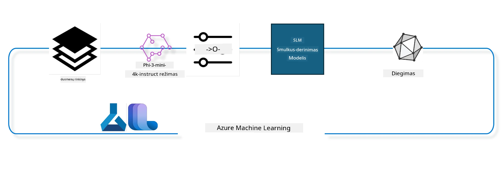

## Kaip naudoti pokalbių užbaigimo komponentus iš Azure ML sistemos registro modeliui tobulinti

Šiame pavyzdyje atliekame Phi-3-mini-4k-instruct modelio tobulinimą, kad užbaigtume pokalbį tarp 2 žmonių, naudojant ultrachat_200k duomenų rinkinį.



Pavyzdyje bus parodyta, kaip atlikti tobulinimą naudojant Azure ML SDK ir Python, o vėliau išdėstyti tobulintą modelį internetiniame taške realaus laiko spėjimams.

### Mokymo duomenys

Naudosime ultrachat_200k duomenų rinkinį. Tai labai filtruota UltraChat duomenų rinkinio versija, kuria buvo treniruojamas Zephyr-7B-β – moderniausias 7b pokalbių modelis.

### Modelis

Naudosime Phi-3-mini-4k-instruct modelį, kad parodytume, kaip vartotojas gali tobulinti modelį pokalbių užbaigimo užduočiai. Jei atidarėte šį užrašų bloką iš konkretos modeliui skirtos kortelės, nepamirškite pakeisti konkretaus modelio pavadinimą.

### Užduotys

- Pasirinkti modelį tobulinimui.
- Pasirinkti ir ištirti mokymo duomenis.
- Suorganizuoti tobulinimo užduotį.
- Vykdyti tobulinimo užduotį.
- Peržiūrėti mokymo ir vertinimo metrikas.
- Užregistruoti tobulintą modelį.
- Išdėstyti tobulintą modelį realaus laiko spėjimui.
- Išvalyti išteklius.

## 1. Paruoškite reikalavimus

- Įdiekite priklausomybes
- Prisijunkite prie AzureML darbo vietos. Daugiau sužinokite apie SDK autentifikavimo nustatymą. Žemiau pakeiskite <WORKSPACE_NAME>, <RESOURCE_GROUP> ir <SUBSCRIPTION_ID>.
- Prisijunkite prie azureml sistemos registro
- Nustatykite pasirenkamą eksperimento pavadinimą
- Patikrinkite arba sukurkite kompiuterį.

> [!NOTE]
> Reikalavimai: vienas GPU mazgas gali turėti kelias GPU korteles. Pvz., viename Standard_NC24rs_v3 mazge yra 4 NVIDIA V100 GPU, o Standard_NC12s_v3 – 2 NVIDIA V100 GPU. Informaciją žr. dokumentacijoje. GPU kortelių skaičius žygyje nustatomas pagal toliau pateiktą parametrą gpus_per_node. Teisingas šio parametro nustatymas užtikrina visų GPU mazge panaudojimą. Rekomenduojamus GPU kompiuterių SKU rasite čia ir čia.

### Python bibliotekos

Įdiekite priklausomybes paleisdami žemiau esantį bloką. Tai nėra neprivalomas žingsnis, jei dirbate naujoje aplinkoje.

```bash
pip install azure-ai-ml
pip install azure-identity
pip install datasets==2.9.0
pip install mlflow
pip install azureml-mlflow
```

### Sąveika su Azure ML

1. Šis Python scenarijus skirtas sąveikai su Azure Machine Learning (Azure ML) paslauga. Štai ką jis atlieka:

    - Importuoja reikalingus modulius iš paketų azure.ai.ml, azure.identity ir azure.ai.ml.entities. Taip pat importuoja time modulį.

    - Bando autentifikuotis naudodamas DefaultAzureCredential(), kuris supaprastina autentifikaciją ir leidžia greitai pradėti programų kūrimą Azure debesyje. Jei nepavyksta, pereina prie InteractiveBrowserCredential(), kuris pateikia interaktyvų prisijungimo langą.

    - Tada bando sukurti MLClient egzempliorių naudodamas from_config metodą, kuris skaito konfigūraciją iš numatyto konfigūracijos failo (config.json). Jei nepavyksta, sukuria MLClient egzempliorių nurodydamas subscription_id, resource_group_name ir workspace_name rankiniu būdu.

    - Sukuria kitą MLClient egzempliorių, šį kartą Azure ML registrui pavadinimu "azureml". Šiame registre saugomi modeliai, tobulinimo vamzdynai ir aplinkos.

    - Nustato experimento pavadinimą "chat_completion_Phi-3-mini-4k-instruct".

    - Sugeneruoja unikalų laiko žymeklį, konvertuodamas esamą laiką (sekundėmis nuo epoch pradžios, kaip slankųjį skaičių) į sveiką skaičių, o vėliau į eilutę. Šis laiko žymeklis gali būti panaudotas unikaliems pavadinimams ir versijoms kurti.

    ```python
    # Importuokite reikalingus modulius iš Azure ML ir Azure Identity
    from azure.ai.ml import MLClient
    from azure.identity import (
        DefaultAzureCredential,
        InteractiveBrowserCredential,
    )
    from azure.ai.ml.entities import AmlCompute
    import time  # Importuokite laiko modulį
    
    # Bandykite autentifikuotis naudodami DefaultAzureCredential
    try:
        credential = DefaultAzureCredential()
        credential.get_token("https://management.azure.com/.default")
    except Exception as ex:  # Jei DefaultAzureCredential nepavyksta, naudokite InteractiveBrowserCredential
        credential = InteractiveBrowserCredential()
    
    # Bandykite sukurti MLClient egzempliorių naudodami numatytąjį konfigūracijos failą
    try:
        workspace_ml_client = MLClient.from_config(credential=credential)
    except:  # Jei tai nepavyksta, sukurkite MLClient egzempliorių rankiniu būdu pateikdami duomenis
        workspace_ml_client = MLClient(
            credential,
            subscription_id="<SUBSCRIPTION_ID>",
            resource_group_name="<RESOURCE_GROUP>",
            workspace_name="<WORKSPACE_NAME>",
        )
    
    # Sukurkite kitą MLClient egzempliorių Azure ML registre pavadinimu "azureml"
    # Šiame registre saugomi modeliai, tikslinimo (fine-tuning) potekiai ir aplinkos
    registry_ml_client = MLClient(credential, registry_name="azureml")
    
    # Nustatykite eksperimento pavadinimą
    experiment_name = "chat_completion_Phi-3-mini-4k-instruct"
    
    # Sugeneruokite unikalų laiko žymą, kuri gali būti naudojama unikaliems pavadinimams ir versijoms
    timestamp = str(int(time.time()))
    ```

## 2. Pasirinkite pradinį modelį tobulinimui

1. Phi-3-mini-4k-instruct yra 3,8 milijardo parametrų, lengvas, pažangiausias atvirojo kodo modelis, paremtas Phi-2 naudotais duomenų rinkiniais. Modelis priklauso Phi-3 modelių šeimai, o Mini versija turi du variantus: 4K ir 128K, kurie reiškia palaikomų konteksto ilgių (simboliais) maksimalų kiekį. Norint naudoti, modelį reikia pritaikyti mūsų konkrečiam tikslui. Šiuos modelius galite peržiūrėti Modelių kataloge AzureML Studio, filtruodami pagal pokalbių užbaigimo užduotį. Šiame pavyzdyje naudojame Phi-3-mini-4k-instruct modelį. Jei atidarėte užrašų bloką kitam modeliui, atitinkamai pakeiskite modelio pavadinimą ir versiją.

> [!NOTE]
> modelio id savybė. Ji bus perduota kaip įvestis tobulinimo užduočiai. Taip pat prieinama kaip Asset ID laukelis modelio detalių puslapyje AzureML Studio Modelių kataloge.

2. Šis Python scenarijus sąveikauja su Azure Machine Learning (Azure ML) paslauga. Štai ką jis atlieka:

    - Nustato model_name reikšmę "Phi-3-mini-4k-instruct".

    - Naudoja get metodą iš registry_ml_client objektų models savybės, kad gautų naujausią nurodyto pavadinimo modelio versiją iš Azure ML registro. Metodas kviečiamas su dviem argumentais: modelio pavadinimu ir žyma, nurodančia, kad reikia gauti naujausią modelio versiją.

    - Išveda į konsolę žinutę apie modelio pavadinimą, versiją ir ID, kurį naudosime tobulinimui. Naudojama string formato metoda, kad įterptų modelio pavadinimą, versiją ir ID į žinutę. Modelio pavadinimas, versija ir ID pasiekiami kaip foundation_model objekto savybės.

    ```python
    # Nustatyti modelio pavadinimą
    model_name = "Phi-3-mini-4k-instruct"
    
    # Gauti naujausią modelio versiją iš Azure ML registracijos
    foundation_model = registry_ml_client.models.get(model_name, label="latest")
    
    # Atspausdinti modelio pavadinimą, versiją ir ID
    # Ši informacija naudinga sekimui ir trikčių šalinimui
    print(
        "\n\nUsing model name: {0}, version: {1}, id: {2} for fine tuning".format(
            foundation_model.name, foundation_model.version, foundation_model.id
        )
    )
    ```

## 3. Sukurkite kompiuterį, skirtą užduočiai vykdyti

Tobulinimo užduotis veikia TIK su GPU kompiuteriu. Kompiuterio dydis priklauso nuo modelio dydžio, ir dažnai sunku pasirinkti tinkamą dydį užduočiai. Šiame bloke padėsime vartotojui pasirinkti tinkamą kompiuterį užduočiai.

> [!NOTE]
> Žemiau pateikti kompiuteriai veikia su optimalia konfigūracija. Bet kokie konfigūracijos pakeitimai gali sukelti Cuda Out Of Memory klaidą. Tokiu atveju patartina pakelti kompiuterio dydį.

> [!NOTE]
> Renkantis compute_cluster_size žemiau, įsitikinkite, kad pasirinktas kompiuteris yra jūsų resursų grupėje. Jei tam tikras kompiuteris nėra pasiekiamas, galite pateikti prašymą gauti prieigą prie jo.

### Modelio palaikymo tobulinimui tikrinimas

1. Šis Python scenarijus tikrina Azure Machine Learning (Azure ML) modelį. Štai ką jis atlieka:

    - Importuoja ast modulį, kuris leidžia apdoroti Python abstrakčios sintaksės medžius.

    - Tikrina, ar foundation_model objektas (Azure ML modelis) turi žymę pavadinimu finetune_compute_allow_list. Azure ML žymos yra raktas-reikšmė poros, kurios leidžia filtruoti ir rūšiuoti modelius.

    - Jei finetune_compute_allow_list žymė yra, naudoja ast.literal_eval funkciją, kad saugiai išanalizuotų žymės reikšmę (eilutę) į Python sąrašą. Šis sąrašas priskiriamas kintamajam computes_allow_list. Tada išveda pranešimą, kad reikia sukurti kompiuterį iš sąrašo.

    - Jei žymė neegzistuoja, nustato computes_allow_list reikšmę į None ir išveda pranešimą, kad finetune_compute_allow_list žymė nėra modelio žymių dalis.

    - Apibendrinant, šis scenarijus tikrina tam tikrą žymę modelio metaduomenyse, jei žymė yra, konvertuoja jos reikšmę į sąrašą ir pateikia vartotojui atitinkamą informaciją.

    ```python
    # Importuokite ast modulį, kuris teikia funkcijas Python abstraktaus sintaksės gramatikos medžių apdorojimui
    import ast
    
    # Patikrinkite, ar modelio žymėse yra žyma 'finetune_compute_allow_list'
    if "finetune_compute_allow_list" in foundation_model.tags:
        # Jei žyma yra, naudokite ast.literal_eval, kad saugiai išskaitytumėte žymos reikšmę (eilutę) į Python sąrašą
        computes_allow_list = ast.literal_eval(
            foundation_model.tags["finetune_compute_allow_list"]
        )  # konvertuoti eilutę į python sąrašą
        # Išveskite pranešimą, nurodantį, kad turi būti sukurtas compute iš sąrašo
        print(f"Please create a compute from the above list - {computes_allow_list}")
    else:
        # Jei žyma nėra, priskirkite computes_allow_list reikšmę None
        computes_allow_list = None
        # Išveskite pranešimą, nurodantį, kad žyma 'finetune_compute_allow_list' nėra modelio žymių dalis
        print("`finetune_compute_allow_list` is not part of model tags")
    ```

### Kompiuterio instancijos tikrinimas

1. Šis Python scenarijus sąveikauja su Azure Machine Learning (Azure ML) paslauga ir atlieka kelis patikrinimus apie kompiuterio instanciją. Štai ką jis daro:

    - Bando gauti kompiuterio instanciją su pavadinimu, saugomu compute_cluster kintamajame, iš Azure ML darbo vietos. Jei instancijos paruošimo būsena yra "failed", sukeliama ValueError.

    - Tikrina, ar computes_allow_list nėra None. Jei ne, paverčia visas sąraše esančias kompiuterio dydžių reikšmes mažosiomis raidėmis ir tikrina, ar dabartinio kompiuterio dydis yra sąraše. Jei ne, sukeliama ValueError.

    - Jei computes_allow_list yra None, tikrina, ar kompiuterio dydis yra tarp nepalaikomų GPU VM dydžių. Jei taip, sukeliama ValueError.

    - Gauti visų prieinamų kompiuterio dydžių sąrašą dirbtuvėse. Tada pereina per šį sąrašą, ir jei kurio nors kompiuterio dydžio pavadinimas sutampa su dabartinio kompiuterio dydžiu, gauna to dydžio GPU skaičių ir nustato gpu_count_found į True.

    - Jei gpu_count_found yra True, išveda kompiuterio GPU skaičių. Jei ne, sukeliama ValueError.

    - Apibendrinant, scenarijus atlieka kelis patikrinimus apie Azure ML darbo vietos kompiuterio instanciją, įskaitant paruošimo būseną, dydžio atitikimą prieinamų arba draudžiamų sąrašų ir GPU skaičiaus tikrinimą.
    
    ```python
    # Atspausdinkite išimties pranešimą
    print(e)
    # Iškelkite ValueError, jei skaičiavimo dydis nėra prieinamas darbinėje aplinkoje
    raise ValueError(
        f"WARNING! Compute size {compute_cluster_size} not available in workspace"
    )
    
    # Gaukite skaičiavimo instanciją iš Azure ML darbinės aplinkos
    compute = workspace_ml_client.compute.get(compute_cluster)
    # Patikrinkite, ar skaičiavimo instancijos teikimo būsena yra „failed“
    if compute.provisioning_state.lower() == "failed":
        # Iškelkite ValueError, jei teikimo būsena yra „failed“
        raise ValueError(
            f"Provisioning failed, Compute '{compute_cluster}' is in failed state. "
            f"please try creating a different compute"
        )
    
    # Patikrinkite, ar computes_allow_list nėra None
    if computes_allow_list is not None:
        # Paverskite visus computes_allow_list skaičiavimo dydžius į mažąsias raides
        computes_allow_list_lower_case = [x.lower() for x in computes_allow_list]
        # Patikrinkite, ar skaičiavimo instancijos dydis yra computes_allow_list_lower_case sąraše
        if compute.size.lower() not in computes_allow_list_lower_case:
            # Iškelkite ValueError, jei skaičiavimo instancijos dydis nėra computes_allow_list_lower_case sąraše
            raise ValueError(
                f"VM size {compute.size} is not in the allow-listed computes for finetuning"
            )
    else:
        # Apibrėžkite nepalaikomų GPU VM dydžių sąrašą
        unsupported_gpu_vm_list = [
            "standard_nc6",
            "standard_nc12",
            "standard_nc24",
            "standard_nc24r",
        ]
        # Patikrinkite, ar skaičiavimo instancijos dydis yra unsupported_gpu_vm_list sąraše
        if compute.size.lower() in unsupported_gpu_vm_list:
            # Iškelkite ValueError, jei skaičiavimo instancijos dydis yra unsupported_gpu_vm_list sąraše
            raise ValueError(
                f"VM size {compute.size} is currently not supported for finetuning"
            )
    
    # Inicializuokite žymeklį, kad patikrintumėte, ar rasta GPU skaičiaus skaičiavimo instancijoje
    gpu_count_found = False
    # Gaukite visų prieinamų skaičiavimo dydžių sąrašą darbinėje aplinkoje
    workspace_compute_sku_list = workspace_ml_client.compute.list_sizes()
    available_sku_sizes = []
    # Iteruokite per prieinamų skaičiavimo dydžių sąrašą
    for compute_sku in workspace_compute_sku_list:
        available_sku_sizes.append(compute_sku.name)
        # Patikrinkite, ar skaičiavimo dydžio pavadinimas atitinka skaičiavimo instancijos dydį
        if compute_sku.name.lower() == compute.size.lower():
            # Jei taip, gaukite GPU skaičių tam skaičiavimo dydžiui ir nustatykite gpu_count_found į True
            gpus_per_node = compute_sku.gpus
            gpu_count_found = True
    # Jei gpu_count_found yra True, atspausdinkite GPU skaičių skaičiavimo instancijoje
    if gpu_count_found:
        print(f"Number of GPU's in compute {compute.size}: {gpus_per_node}")
    else:
        # Jei gpu_count_found yra False, iškelkite ValueError
        raise ValueError(
            f"Number of GPU's in compute {compute.size} not found. Available skus are: {available_sku_sizes}."
            f"This should not happen. Please check the selected compute cluster: {compute_cluster} and try again."
        )
    ```

## 4. Pasirinkite duomenų rinkinį modeliui tobulinti

1. Naudojame ultrachat_200k duomenų rinkinį. Duomenų rinkinys turi keturias dalis, tinkamas priežiūrai prižiūrėtu būdu (Supervised fine-tuning, sft).
Kūrimo vertinimas (gen). Pavyzdžių skaičius kiekvienoje dalyje parodytas taip:

    ```bash
    train_sft test_sft  train_gen  test_gen
    207865  23110  256032  28304
    ```

1. Tolimesnės kelios ląstelės rodo pagrindinį duomenų paruošimą tobulinimui:

### Kai kurių eilučių vizualizavimas

Norime, kad šis pavyzdys veiktų greitai, todėl išsaugojame train_sft ir test_sft failus, kuriuose yra 5% jau atrinktų eilučių. Tai reiškia, kad tobulintas modelis turės mažesnį tikslumą, todėl jo nereikėtų naudoti realiame pasaulyje.
download-dataset.py naudojamas ultrachat_200k duomenų rinkiniui parsisiųsti ir transformuoti duomenų rinkinį į tobulinimo vamzdyno komponentui tinkamą formatą. Kadangi duomenų rinkinys didelis, čia yra tik jo dalis.

1. Paleidus žemiau esančią komandą bus atsisiųsta tik 5% duomenų. Šią reikšmę galima padidinti pakeitus dataset_split_pc parametrą į norimą procentą.

> [!NOTE]
> Kai kurie kalbos modeliai naudoja skirtingus kalbų kodus, todėl stulpelių pavadinimai duomenų rinkinyje turėtų atitikti juos.

1. Štai pavyzdys, kaip duomenys turėtų atrodyti
Pokalbių užbaigimo duomenų rinkinys saugomas parquet formatu, kur kiekvienas įrašas naudoja šią schemą:

    - Tai JSON (JavaScript objekto žymėjimo) dokumentas, populiarus duomenų mainų formatas. Tai nėra vykdomas kodas, o duomenų saugojimo ir perdavimo formatas. Štai jo struktūros paaiškinimas:

    - "prompt": Raktas, turintis eilutės reikšmę, žyminčią užduotį arba klausimą AI asistentui.

    - "messages": Raktas, turintis objektų masyvą. Kiekvienas objektas reiškia pranešimą pokalbyje tarp vartotojo ir AI asistento. Kiekviename pranešime yra du raktai:

    - "content": Eilutės tipo reikšmė, reiškianti pranešimo turinį.
    - "role": Eilutės tipo reikšmė, nurodanti, kas siuntė pranešimą – "user" arba "assistant".
    - "prompt_id": Eilutės tipo reikšmė, unikalus užklausos identifikatorius.

1. Šiame konkrečiame JSON dokumente vaizduojamas pokalbis, kuriame vartotojas prašo AI asistento sukurti pagrindinį veikėją distopinei istorijai. Asistentas atsako, tada vartotojas prašo daugiau detalių, o asistentas sutinka jas pateikti. Visas pokalbis susietas su konkrečiu prompt_id.

    ```python
    {
        // The task or question posed to an AI assistant
        "prompt": "Create a fully-developed protagonist who is challenged to survive within a dystopian society under the rule of a tyrant. ...",
        
        // An array of objects, each representing a message in a conversation between a user and an AI assistant
        "messages":[
            {
                // The content of the user's message
                "content": "Create a fully-developed protagonist who is challenged to survive within a dystopian society under the rule of a tyrant. ...",
                // The role of the entity that sent the message
                "role": "user"
            },
            {
                // The content of the assistant's message
                "content": "Name: Ava\n\n Ava was just 16 years old when the world as she knew it came crashing down. The government had collapsed, leaving behind a chaotic and lawless society. ...",
                // The role of the entity that sent the message
                "role": "assistant"
            },
            {
                // The content of the user's message
                "content": "Wow, Ava's story is so intense and inspiring! Can you provide me with more details.  ...",
                // The role of the entity that sent the message
                "role": "user"
            }, 
            {
                // The content of the assistant's message
                "content": "Certainly! ....",
                // The role of the entity that sent the message
                "role": "assistant"
            }
        ],
        
        // A unique identifier for the prompt
        "prompt_id": "d938b65dfe31f05f80eb8572964c6673eddbd68eff3db6bd234d7f1e3b86c2af"
    }
    ```

### Duomenų atsisiuntimas

1. Šis Python scenarijus naudojamas duomenų rinkiniui atsisiųsti, naudojant pagalbinį scenarijų download-dataset.py. Štai ką jis daro:

    - Importuoja os modulį, kuris leidžia naudoti operacinės sistemos funkcijas.

    - Naudoja os.system funkciją paleisti download-dataset.py scenarijų su komandine eilute, nurodydamas atsisiųsti duomenų rinkinį HuggingFaceH4/ultrachat_200k, išsaugoti jį kataloge ultrachat_200k_dataset ir padalinti 5%. os.system grąžina vykdymo statusą, kuris priskiriamas exit_status.

    - Patikrina, ar exit_status nėra 0. Unix tipo sistemose 0 reiškia sėkmingą vykdymą, bet kiti skaičiai – klaidą. Jei ne 0, kelia Exception su pranešimu apie klaidą.

    - Apibendrinant, scenarijus paleidžia komandą duomenų rinkiniui atsisiųsti naudojant pagalbinį scenarijų, ir jei tai nepavyksta, kelia išimtį.
    
    ```python
    # Importuoti os modulį, kuris suteikia galimybę naudoti operacinės sistemos priklausomą funkcionalumą
    import os
    
    # Naudoti os.system funkciją vykdyti download-dataset.py skriptą shell'e su specifiniais komandų eilutės argumentais
    # Argumentai nurodo atsisiunčiamą duomenų rinkinį (HuggingFaceH4/ultrachat_200k), katalogą, į kurį jį atsisiųsti (ultrachat_200k_dataset), ir duomenų rinkinio padalijimo procentą (5)
    # os.system funkcija grąžina vykdytos komandos išeigos būseną; ši būsena išsaugoma exit_status kintamajame
    exit_status = os.system(
        "python ./download-dataset.py --dataset HuggingFaceH4/ultrachat_200k --download_dir ultrachat_200k_dataset --dataset_split_pc 5"
    )
    
    # Patikrinti, ar exit_status nėra lygi 0
    # Unix tipo operacinėse sistemose išeigos būsenos 0 paprastai reiškia, kad komanda buvo sėkminga, o bet koks kitas skaičius reiškia klaidą
    # Jei exit_status nėra 0, iškelti Exception su žinute, nurodančia, kad atsisiunčiant duomenų rinkinį įvyko klaida
    if exit_status != 0:
        raise Exception("Error downloading dataset")
    ```

### Duomenų įkėlimas į DataFrame

1. Šis Python scenarijus įkrauna JSON Lines failą į pandas DataFrame ir parodo pirmas 5 eiles. Štai ką jis daro:

    - Importuoja pandas biblioteką, kuri yra galinga duomenų manipuliavimo ir analizės biblioteka.

    - Nustato maksimalų stulpelio plotį pandas rodymo nustatymuose į 0. Tai reiškia, kad spausdinant DataFrame bus rodomas visas teksto turinys be sutrumpinimo.
    - Naudoja pd.read_json funkciją, kad įkrautų train_sft.jsonl failą iš ultrachat_200k_dataset katalogo į DataFrame. Argumentas lines=True nurodo, kad failas yra JSON Lines formatu, kur kiekviena eilutė yra atskiras JSON objektas.

    - Naudoja head metodą, kad parodytų pirmas 5 DataFrame eilutes. Jei DataFrame turi mažiau nei 5 eilutes, bus parodytos visos.

    - Apibendrinant, šis scenarijus įkelia JSON Lines failą į DataFrame ir parodo pirmas 5 eilutes su visapusišku stulpelių tekstu.
    
    ```python
    # Importuoti pandas biblioteką, kuri yra galinga duomenų manipuliavimo ir analizės biblioteka
    import pandas as pd
    
    # Nustatyti maksimalų stulpelio plotį pandas rodymo parinktyse į 0
    # Tai reiškia, kad kiekvieno stulpelio visas tekstas bus rodomas be sutrumpinimo, kai bus spausdinamas DataFrame
    pd.set_option("display.max_colwidth", 0)
    
    # Naudoti pd.read_json funkciją, kad būtų įkeliamas train_sft.jsonl failas iš ultrachat_200k_dataset katalogo į DataFrame
    # Argumentas lines=True nurodo, kad failas yra JSON Lines formatu, kur kiekviena eilutė yra atskiras JSON objektas
    df = pd.read_json("./ultrachat_200k_dataset/train_sft.jsonl", lines=True)
    
    # Naudoti head metodą, kad būtų parodytos pirmos 5 DataFrame eilutės
    # Jei DataFrame turi mažiau nei 5 eilutes, bus parodytos visos eilutės
    df.head()
    ```

## 5. Pateikti fine tuning darbą naudojant modelį ir duomenis kaip įvestį

Sukurkite darbą, kuris naudoja chat-completion pipeline komponentą. Sužinokite daugiau apie visus fine tuning palaikomus parametrus.

### Apibrėžkite finetune parametrus

1. Finetune parametrai gali būti suskirstyti į 2 kategorijas - mokymo parametrai, optimizavimo parametrai

1. Mokymo parametrai apibrėžia mokymo aspektus, tokius kaip -

    - Naudojamas optimizatorius, tvarkyklė (scheduler)
    - Matavimo vienetas, kurį optimizuoti finetuning metu
    - Mokymo žingsnių skaičius, partijų dydis ir kt.
    - Optimizavimo parametrai padeda optimizuoti GPU atmintį ir efektyviai naudoti skaičiavimo išteklius.

1. Žemiau pateikti keli parametrai, priklausantys šiai kategorijai. Optimizavimo parametrai skiriasi kiekvienam modeliui ir yra supakuoti su modeliu, kad būtų galima valdyti šiuos skirtumus.

    - Įgalinkite deepspeed ir LoRA
    - Įgalinkite mišraus tikslumo mokymą
    - Įgalinkite treniravimą per kelis mazgus

> [!NOTE]
> Prižiūrimas finetuning gali lemti derinimo praradimą arba katastrofišką pamiršimą (catastrophic forgetting). Rekomenduojame patikrinti šią problemą ir paleisti alinijavimo etapą po finetuning.

### Fine Tuning parametrai

1. Šis Python skriptas nustato parametrus modeliui fine-tuning. Štai ką jis daro:

    - Nustato numatytuosius mokymo parametrus, tokius kaip mokymo epochų skaičius, partijų dydžiai treniravimui ir vertinimui, mokymosi greitis ir mokymosi greičio tvarkyklės tipas.

    - Nustato numatytuosius optimizavimo parametrus, kaip ar taikyti sluoksnių svarbos skverbimąsi (LoRa) ir DeepSpeed, bei DeepSpeed etapą.

    - Sujungia mokymo ir optimizavimo parametrus į vieną žodyną finetune_parameters.

    - Tikrina, ar foundation_model turi modelio specifinius numatytuosius parametrus. Jei taip, išveda įspėjimą ir atnaujina finetune_parameters žodyną šiais modelio specifiniais numatytaisiais parametrais. ast.literal_eval funkcija naudojama modelio specifinių numatytųjų parametrų konvertavimui iš teksto į Python žodyną.

    - Išveda galutinį fine-tuning parametrų rinkinį, kuris bus naudojamas.

    - Apibendrinant, šis skriptas nustato ir parodo fine tuning parametrus mašininiam mokymui, leidžiant viršyti numatytuosius parametrus modelio specifiniais.

    ```python
    # Nustatyti numatytuosius mokymo parametrus, tokius kaip mokymo epochų skaičius, partijos dydžiai mokymui ir vertinimui, mokymosi greitis ir mokymosi greičio tvarkyklės tipas
    training_parameters = dict(
        num_train_epochs=3,
        per_device_train_batch_size=1,
        per_device_eval_batch_size=1,
        learning_rate=5e-6,
        lr_scheduler_type="cosine",
    )
    
    # Nustatyti numatytuosius optimizavimo parametrus, tokius kaip ar taikyti sluoksnių aktualumo propagaciją (LoRa) ir DeepSpeed, bei DeepSpeed sceną
    optimization_parameters = dict(
        apply_lora="true",
        apply_deepspeed="true",
        deepspeed_stage=2,
    )
    
    # Sujungti mokymo ir optimizavimo parametrus į vieną žodyną pavadinimu finetune_parameters
    finetune_parameters = {**training_parameters, **optimization_parameters}
    
    # Patikrinti, ar bazinis modelis turi specifinių modelio numatytųjų parametrų
    # Jei taip, atspausdinti įspėjimo pranešimą ir atnaujinti finetune_parameters žodyną šiais modelio specifiniais numatytaisiais parametrais
    # Funkcija ast.literal_eval naudojama konvertuoti modelio specifinius numatytuosius parametrus iš eilutės į Python žodyną
    if "model_specific_defaults" in foundation_model.tags:
        print("Warning! Model specific defaults exist. The defaults could be overridden.")
        finetune_parameters.update(
            ast.literal_eval(  # konvertuoti eilutę į Python žodyną
                foundation_model.tags["model_specific_defaults"]
            )
        )
    
    # Atspausdinti galutinį fine-tuning parametrų rinkinį, kuris bus naudojamas paleidimui
    print(
        f"The following finetune parameters are going to be set for the run: {finetune_parameters}"
    )
    ```

### Mokymo pipeline

1. Šis Python skriptas apibrėžia funkciją, kuri generuoja rodomą pavadinimą mašininio mokymosi mokymo pipeline, ir tada iškviečia šią funkciją, kad sukurtų ir atspausdintų rodomą pavadinimą. Štai ką jis daro:

1. Apibrėžiama get_pipeline_display_name funkcija. Ji generuoja rodomą pavadinimą pagal įvairius treniravimo pipeline parametrus.

1. Funkcijoje paskaičiuojamas bendras partijos dydis, dauginant vienos įrenginio partijos dydį, gradiento kaupimo žingsnių skaičių, GPU skaičių viename mazge ir mazgų skaičių, naudojamą fine-tuning.

1. Gaunami kiti parametrai: mokymosi greičio tvarkyklės tipas, ar taikomas DeepSpeed, DeepSpeed etapas, ar taikomas LoRa, modelio kontrolinių taškų limitas, ir didžiausias sekos ilgis.

1. Sukuriamas eilutės pavadinimas, kuriame yra visi šie parametrai, atskirti brūkšniais. Jei taikomas DeepSpeed arba LoRa, eilutėje yra atitinkamai „ds“ su DeepSpeed etapu arba „lora“. Jei ne, yra „nods“ arba „nolora“.

1. Funkcija grąžina šią eilutę kaip rodomą pavadinimą mokymo pipeline.

1. Po funkcijos apibrėžimo ji iškviečiama, kad sugeneruotų ir atspausdintų rodomą pavadinimą.

1. Apibendrinant, šis skriptas generuoja ir išveda rodomą pavadinimą mašininio mokymosi pipeline, remiantis įvairiais parametrais.

    ```python
    # Apibrėžkite funkciją, skirtą generuoti treniravimo grandinės rodymo pavadinimą
    def get_pipeline_display_name():
        # Apskaičiuokite bendrą partijų dydį, padauginę vieno įrenginio partijos dydį, gradientų kaupimo žingsnių skaičių, kiekvieno mazgo GPU skaičių ir mazgų skaičių, naudojamą tobulinimui
        batch_size = (
            int(finetune_parameters.get("per_device_train_batch_size", 1))
            * int(finetune_parameters.get("gradient_accumulation_steps", 1))
            * int(gpus_per_node)
            * int(finetune_parameters.get("num_nodes_finetune", 1))
        )
        # Gaukite mokymosi normos planuotojo tipą
        scheduler = finetune_parameters.get("lr_scheduler_type", "linear")
        # Gaukite informaciją, ar naudojamas DeepSpeed
        deepspeed = finetune_parameters.get("apply_deepspeed", "false")
        # Gaukite DeepSpeed etapą
        ds_stage = finetune_parameters.get("deepspeed_stage", "2")
        # Jeigu naudojamas DeepSpeed, pridėkite „ds“ ir DeepSpeed etapą į rodymo pavadinimą; jei ne, pridėkite „nods“
        if deepspeed == "true":
            ds_string = f"ds{ds_stage}"
        else:
            ds_string = "nods"
        # Gaukite informaciją, ar naudojama sluoksnių svarbos sklaida (Layer-wise Relevance Propagation, LoRa)
        lora = finetune_parameters.get("apply_lora", "false")
        # Jeigu naudojama LoRa, pridėkite „lora“ į rodymo pavadinimą; jei ne, pridėkite „nolora“
        if lora == "true":
            lora_string = "lora"
        else:
            lora_string = "nolora"
        # Gaukite apribojimą saugomų modelio kontrolinių taškų skaičiui
        save_limit = finetune_parameters.get("save_total_limit", -1)
        # Gaukite maksimalų sekos ilgį
        seq_len = finetune_parameters.get("max_seq_length", -1)
        # Sudarykite rodymo pavadinimą, sujungdami visus šiuos parametrus, atskirtus brūkšniais
        return (
            model_name
            + "-"
            + "ultrachat"
            + "-"
            + f"bs{batch_size}"
            + "-"
            + f"{scheduler}"
            + "-"
            + ds_string
            + "-"
            + lora_string
            + f"-save_limit{save_limit}"
            + f"-seqlen{seq_len}"
        )
    
    # Iškvieskite funkciją, skirtą generuoti rodymo pavadinimą
    pipeline_display_name = get_pipeline_display_name()
    # Atspausdinkite rodymo pavadinimą
    print(f"Display name used for the run: {pipeline_display_name}")
    ```

### Pipeline konfigūravimas

Šis Python skriptas apibrėžia ir konfigūruoja mašininio mokymosi pipeline naudodamas Azure Machine Learning SDK. Štai ką jis daro:

1. Importuoja reikalingus modulius iš Azure AI ML SDK.

1. Iš registro paima pipeline komponentą pavadinimu "chat_completion_pipeline".

1. Apibrėžia pipeline darbą naudodamas `@pipeline` dekoratorių ir funkciją `create_pipeline`. Pipeline pavadinimas nustatytas kaip `pipeline_display_name`.

1. Funkcijoje `create_pipeline` inicijuoja paimtą pipeline komponentą su įvairiais parametrais, įskaitant modelio kelią, skaičiavimo klasterius įvairiems etapams, duomenų rinkinių dalis treniravimui ir testavimui, GPU skaičių fine-tuning, ir kitus fine-tuning parametrus.

1. Susieja fine-tuning darbo išvestį su pipeline darbo išvestimi, kad fine-tuned modelį būtų lengva registruoti, kas yra būtina modelio diegimui prie online ar batch galinio taško.

1. Sukuria pipeline instanciją iškviesdamas `create_pipeline` funkciją.

1. Nustato pipeline parametrą `force_rerun` kaip `True`, reiškiant, kad anksčiau išsaugoti rezultatai nebus naudojami.

1. Nustato pipeline parametrą `continue_on_step_failure` kaip `False`, reiškiant, kad pipeline nutrauks vykdymą, jei kuris nors žingsnis nepavyks.

1. Apibendrinant, šis skriptas apibrėžia ir konfigūruoja mašininio mokymosi pipeline pokalbių užbaigimo užduočiai naudojant Azure Machine Learning SDK.

    ```python
    # Importuokite reikiamus modulius iš Azure AI ML SDK
    from azure.ai.ml.dsl import pipeline
    from azure.ai.ml import Input
    
    # Gaukite registroje esantį "chat_completion_pipeline" pavadintą vamzdyno komponentą
    pipeline_component_func = registry_ml_client.components.get(
        name="chat_completion_pipeline", label="latest"
    )
    
    # Apibrėžkite vamzdyno užduotį naudojant @pipeline dekoratorių ir funkciją create_pipeline
    # Vamzdyno pavadinimas nustatytas kaip pipeline_display_name
    @pipeline(name=pipeline_display_name)
    def create_pipeline():
        # Inicializuokite gautą vamzdyno komponentą su įvairiais parametrais
        # Tai apima modelio kelią, skaičiavimo klasterius skirtingiems etapams, duomenų rinkinių paskirstymą mokymui ir testavimui, GPU skaičių smulkiajam derinimui ir kitus smulkiojo derinimo parametrus
        chat_completion_pipeline = pipeline_component_func(
            mlflow_model_path=foundation_model.id,
            compute_model_import=compute_cluster,
            compute_preprocess=compute_cluster,
            compute_finetune=compute_cluster,
            compute_model_evaluation=compute_cluster,
            # Susiekite duomenų rinkinio paskirstymus su parametrais
            train_file_path=Input(
                type="uri_file", path="./ultrachat_200k_dataset/train_sft.jsonl"
            ),
            test_file_path=Input(
                type="uri_file", path="./ultrachat_200k_dataset/test_sft.jsonl"
            ),
            # Mokymo nustatymai
            number_of_gpu_to_use_finetuning=gpus_per_node,  # Nustatyta kaip turimų GPU skaičius kompiuteryje
            **finetune_parameters
        )
        return {
            # Perkelkite smulkiojo derinimo užduoties išvestį į vamzdyno užduoties išvestį
            # Tai daroma tam, kad būtų lengviau registruoti smulkiai derintą modelį
            # Modelio registracija reikalinga siekiant diegti modelį į internetinę arba partijinę pabaigos tašką
            "trained_model": chat_completion_pipeline.outputs.mlflow_model_folder
        }
    
    # Sukurkite vamzdyno egzempliorių kviesdami funkciją create_pipeline
    pipeline_object = create_pipeline()
    
    # Nenaudokite ankstesnių užduočių talpyklos rezultatų
    pipeline_object.settings.force_rerun = True
    
    # Nustatykite tęsti žingsnio klaidą į False
    # Tai reiškia, kad vamzdis sustos, jei bet kuris žingsnis nepavyks
    pipeline_object.settings.continue_on_step_failure = False
    ```

### Pateikite darbą

1. Šis Python skriptas siunčia mašininio mokymosi pipeline darbą į Azure Machine Learning darbo erdvę ir laukia, kol darbas bus baigtas. Štai ką jis daro:

    - Iškviečia workspace_ml_client objektų jobs metodo create_or_update, kad pateiktų pipeline darbą. Vykdomas pipeline nurodytas per pipeline_object, o eksperimentas, po kuriuo vykdomas darbas, - per experiment_name.

    - Tada iškviečia workspace_ml_client jobs metodo stream, kad lauktų, kol baigsis pipeline darbas. Laukiamas darbas nurodytas per pipeline_job objekto name atributą.

    - Apibendrinant, šis skriptas pateikia mašininio mokymosi pipeline darbą į Azure ML darbo erdvę ir laukia jo užbaigimo.

    ```python
    # Pateikite duomenų apdorojimo užduotį į Azure Machine Learning darbo aplinką
    # Vykdyti duomenų apdorojimo procesą nurodo pipeline_object
    # Eksperimentas, kuriame vykdoma užduotis, nurodomas per experiment_name
    pipeline_job = workspace_ml_client.jobs.create_or_update(
        pipeline_object, experiment_name=experiment_name
    )
    
    # Palaukite, kol duomenų apdorojimo užduotis bus baigta
    # Laukima užduotis nurodoma per pipeline_job objekto name atributą
    workspace_ml_client.jobs.stream(pipeline_job.name)
    ```

## 6. Registruokite fine-tuned modelį darbo erdvėje

Registruosime modelį, gautą iš fine tuning darbo išvesties. Tai leis stebėti priklausomybę tarp fine-tuned modelio ir fine tuning darbo. Fine tuning darbas, savo ruožtu, stebi priklausomybę nuo pagrindinio modelio, duomenų ir treniravimo kodo.

### ML modelio registracija

1. Šis Python skriptas registruoja mašininio mokymosi modelį, kuris buvo apmokytas Azure Machine Learning pipeline. Štai ką jis daro:

    - Importuoja reikalingus modulius iš Azure AI ML SDK.

    - Tikrina, ar pipeline darbo išvestyje yra treniruotas_modelis, kviesdamas workspace_ml_client jobs metodo get ir prie jo prisijungdamas per outputs atributą.

    - Sudaro kelią į treniruotą modelį formatuodamas eilutę su pipeline darbo pavadinimu ir išvesties pavadinimu ("trained_model").

    - Apibrėžia pavadinimą fine-tuned modeliui pridedant "-ultrachat-200k" prie originalaus modelio pavadinimo ir pakeičiant visas pasvirąsias brūkšnelį į brūkšnelius.

    - Pasiruošia modeliui registruoti kurdamas Model objektą su įvairiais parametrais, įskaitant modelio kelią, modelio tipą (MLflow modelis), modelio vardą ir versiją bei aprašymą.

    - Registruoja modelį kviesdamas workspace_ml_client models objekto create_or_update su Model objektu kaip argumentu.

    - Išveda registruotą modelį.

1. Apibendrinant, šis skriptas registruoja Azure ML pipeline apmokytą mašininio mokymosi modelį.
    
    ```python
    # Importuokite reikalingus modulius iš Azure AI ML SDK
    from azure.ai.ml.entities import Model
    from azure.ai.ml.constants import AssetTypes
    
    # Patikrinkite, ar `trained_model` išvestis yra prieinama iš vykdymo proceso
    print("pipeline job outputs: ", workspace_ml_client.jobs.get(pipeline_job.name).outputs)
    
    # Sukurkite kelią į apmokytą modelį formatuodami eilutę su vykdymo proceso pavadinimu ir išvesties („trained_model“) pavadinimu
    model_path_from_job = "azureml://jobs/{0}/outputs/{1}".format(
        pipeline_job.name, "trained_model"
    )
    
    # Apibrėžkite pavadinimą tobulintam modeliui pridėdami „-ultrachat-200k“ prie pradinio modelio pavadinimo ir pakeisdami bet kokius pasviruosius brūkšnius į brūkšnelius
    finetuned_model_name = model_name + "-ultrachat-200k"
    finetuned_model_name = finetuned_model_name.replace("/", "-")
    
    print("path to register model: ", model_path_from_job)
    
    # Pasiruoškite užregistruoti modelį sukurdami Model objekto su įvairiais parametrais
    # Tai apima kelią iki modelio, modelio tipą (MLflow modelis), modelio pavadinimą ir versiją bei modelio aprašymą
    prepare_to_register_model = Model(
        path=model_path_from_job,
        type=AssetTypes.MLFLOW_MODEL,
        name=finetuned_model_name,
        version=timestamp,  # Naudokite laiko žymą kaip versiją, kad išvengtumėte versijų konfliktų
        description=model_name + " fine tuned model for ultrachat 200k chat-completion",
    )
    
    print("prepare to register model: \n", prepare_to_register_model)
    
    # Užregistruokite modelį kviesdami create_or_update metodą iš models objekto workspace_ml_client su Model objektu kaip argumentu
    registered_model = workspace_ml_client.models.create_or_update(
        prepare_to_register_model
    )
    
    # Atspausdinkite užregistruotą modelį
    print("registered model: \n", registered_model)
    ```

## 7. Diekite fine-tuned modelį į online galinį tašką

Online galiniai taškai suteikia patvarų REST API, kuris gali būti naudojamas integracijai su programomis, kuriose reikia naudoti modelį.

### Galinio taško valdymas

1. Šis Python skriptas kuria valdomą online galinį tašką Azure Machine Learning skirtą registruotam modeliui. Štai ką jis daro:

    - Importuoja reikalingus modulius iš Azure AI ML SDK.

    - Apibrėžia unikalų online galinio taško pavadinimą pridėdamas laiko žymą prie eilutės "ultrachat-completion-".

    - Pasiruošia sukurti online galinį tašką kurdamas ManagedOnlineEndpoint objektą su įvairiais parametrais, įskaitant pavadinimą, aprašymą ir autentifikavimo režimą ("key").

    - Kuria online galinį tašką kviesdamas workspace_ml_client begin_create_or_update su ManagedOnlineEndpoint objektu, tada laukia kūrimo užbaigimo kviesdamas wait metodą.

1. Apibendrinant, šis skriptas sukuria valdomą online galinį tašką Azure ML registruotam modeliui.

    ```python
    # Importuoti reikalingus modulius iš Azure AI ML SDK
    from azure.ai.ml.entities import (
        ManagedOnlineEndpoint,
        ManagedOnlineDeployment,
        ProbeSettings,
        OnlineRequestSettings,
    )
    
    # Apibrėžti unikalų pavadinimą internetiniam galiniam taškui pridėdami laiko žymą prie "ultrachat-completion-" eilutės
    online_endpoint_name = "ultrachat-completion-" + timestamp
    
    # Pasiruošti sukurti internetinį galinį tašką, sukuriant ManagedOnlineEndpoint objektą su įvairiais parametrais
    # Tai apima galinio taško pavadinimą, galinio taško aprašymą ir autentifikavimo režimą ("key")
    endpoint = ManagedOnlineEndpoint(
        name=online_endpoint_name,
        description="Online endpoint for "
        + registered_model.name
        + ", fine tuned model for ultrachat-200k-chat-completion",
        auth_mode="key",
    )
    
    # Sukurti internetinį galinį tašką kviečiant begin_create_or_update metodą iš workspace_ml_client su ManagedOnlineEndpoint objektu kaip argumentu
    # Tada laukti, kol kūrimo operacija bus užbaigta, kviečiant wait metodą
    workspace_ml_client.begin_create_or_update(endpoint).wait()
    ```

> [!NOTE]
> Čia galite rasti sąrašą SKU, palaikomų diegimui - [Managed online endpoints SKU list](https://learn.microsoft.com/azure/machine-learning/reference-managed-online-endpoints-vm-sku-list)

### ML modelio diegimas

1. Šis Python skriptas diegia registruotą mašininio mokymosi modelį į valdomą online galinį tašką Azure Machine Learning. Štai ką jis daro:

    - Importuoja ast modulį, kuris suteikia funkcijas Python abstraktinės sintaksės medžių apdorojimui.

    - Nustato diegimo įrenginio tipą kaip "Standard_NC6s_v3".

    - Tikrina, ar foundation model turi tag'ą inference_compute_allow_list. Jei taip, konvertuoja tag'o reikšmę iš teksto į Python sąrašą ir priskiria inference_computes_allow_list. Jei ne, priskiria None.

    - Tikrina, ar nurodytas įrenginio tipas yra leidžiamų sąraše. Jei ne, išveda pranešimą vartotojui pasirinkti įrenginio tipą iš leidžiamų.

    - Pasiruošia diegimui kurdamas ManagedOnlineDeployment objektą su įvairiais parametrais, įskaitant diegimo pavadinimą, galinio taško pavadinimą, modelio ID, įrenginio tipą ir skaičių, liveness probe nustatymus ir užklausų nustatymus.

    - Kuria diegimą kviesdamas workspace_ml_client begin_create_or_update su ManagedOnlineDeployment objektu, tada laukia operacijos užbaigimo per wait metodą.

    - Nustato galinio taško srauto paskirstymą, nukreipiant 100% srauto į "demo" diegimą.

    - Atnaujina galinį tašką kviesdamas workspace_ml_client begin_create_or_update su galinio taško objektu, tada laukia atnaujinimo pabaigos per result metodą.

1. Apibendrinant, šis skriptas diegia registruotą mašininio mokymosi modelį į valdomą online galinį tašką Azure ML.

    ```python
    # Importuokite ast modulį, kuris teikia funkcijas apdoroti Python abstrakčios sintaksės gramatikos medžius
    import ast
    
    # Nustatykite instancijos tipą diegimui
    instance_type = "Standard_NC6s_v3"
    
    # Patikrinkite, ar pagrindinio modelio žymoje yra `inference_compute_allow_list`
    if "inference_compute_allow_list" in foundation_model.tags:
        # Jei yra, konvertuokite žymos reikšmę iš eilutės į Python sąrašą ir priskirkite `inference_computes_allow_list`
        inference_computes_allow_list = ast.literal_eval(
            foundation_model.tags["inference_compute_allow_list"]
        )
        print(f"Please create a compute from the above list - {computes_allow_list}")
    else:
        # Jei nėra, nustatykite `inference_computes_allow_list` reikšmei None
        inference_computes_allow_list = None
        print("`inference_compute_allow_list` is not part of model tags")
    
    # Patikrinkite, ar nurodytas instancijos tipas yra leidžiamų sąraše
    if (
        inference_computes_allow_list is not None
        and instance_type not in inference_computes_allow_list
    ):
        print(
            f"`instance_type` is not in the allow listed compute. Please select a value from {inference_computes_allow_list}"
        )
    
    # Pasiruoškite sukurti diegimą, sukurdami `ManagedOnlineDeployment` objektą su įvairiais parametrais
    demo_deployment = ManagedOnlineDeployment(
        name="demo",
        endpoint_name=online_endpoint_name,
        model=registered_model.id,
        instance_type=instance_type,
        instance_count=1,
        liveness_probe=ProbeSettings(initial_delay=600),
        request_settings=OnlineRequestSettings(request_timeout_ms=90000),
    )
    
    # Sukurkite diegimą kviesdami `workspace_ml_client` metodo `begin_create_or_update`, perduodant `ManagedOnlineDeployment` objektą kaip argumentą
    # Tada palaukite, kol kūrimo operacija bus baigta, kviesdami `wait` metodą
    workspace_ml_client.online_deployments.begin_create_or_update(demo_deployment).wait()
    
    # Nustatykite galinio taško srautą nukreipti 100% srauto į "demo" diegimą
    endpoint.traffic = {"demo": 100}
    
    # Atnaujinkite galinį tašką kviesdami `workspace_ml_client` metodo `begin_create_or_update` su `endpoint` objektu kaip argumentu
    # Tada palaukite, kol atnaujinimo operacija bus baigta, kviesdami `result` metodą
    workspace_ml_client.begin_create_or_update(endpoint).result()
    ```

## 8. Testuokite galinį tašką su pavyzdiniais duomenimis

Paimsime pavyzdinius duomenis iš testų duomenų rinkinio ir pateiksime juos online galiniam taškui inferencijai. Tada parodysime įvertintas etiketes šalia tikrųjų etikčių.

### Rezultatų skaitymas

1. Šis Python skriptas skaito JSON Lines failą į pandas DataFrame, paima atsitiktinę imtį ir atnaujina indeksą. Štai ką jis daro:

    - Skaito failą ./ultrachat_200k_dataset/test_gen.jsonl į pandas DataFrame. read_json funkcija naudojama su lines=True, nes failas yra JSON Lines formatu, kuriame kiekviena eilutė yra atskiras JSON objektas.

    - Paima atsitiktinę 1 eilutės imtį iš DataFrame. sample funkcija naudojama su n=1 argumentu, kuris nurodo atsitiktinių eilučių skaičių.

    - Atkuria DataFrame indeksą. reset_index funkcija naudojama su drop=True argumentu, kuris pašalina originalų indeksą ir pakeičia jį nauju numatytuoju skaitiniu indeksu.

    - Parodo pirmas 2 DataFrame eilutes naudodamas head funkciją su argumentu 2. Kadangi imtyje yra tik viena eilutė, bus parodyta tik ta viena eilutė.

1. Apibendrinant, šis skriptas skaito JSON Lines failą į pandas DataFrame, paima vieną atsitiktinę eilutę, atnaujina indeksą ir rodo pirmą eilutę.
    
    ```python
    # Importuoti pandas biblioteką
    import pandas as pd
    
    # Nuskaityti JSON Lines failą './ultrachat_200k_dataset/test_gen.jsonl' į pandas DataFrame
    # Argumentas 'lines=True' nurodo, kad failas yra JSON Lines formatu, kur kiekviena eilutė yra atskiras JSON objektas
    test_df = pd.read_json("./ultrachat_200k_dataset/test_gen.jsonl", lines=True)
    
    # Paimti atsitiktinį 1 eilutės pavyzdį iš DataFrame
    # Argumentas 'n=1' nurodo atsitiktinių eilučių, kurios turi būti pasirinktos, skaičių
    test_df = test_df.sample(n=1)
    
    # Atstatyti DataFrame indeksą
    # Argumentas 'drop=True' nurodo, kad originalus indeksas turi būti pašalintas ir pakeistas nauju pagal numatytąjį sveikojo skaičiaus indeksą
    # Argumentas 'inplace=True' nurodo, kad DataFrame turi būti pakeistas tiesiogiai (nesukuriant naujo objekto)
    test_df.reset_index(drop=True, inplace=True)
    
    # Rodyti pirmas 2 DataFrame eilutes
    # Tačiau, kadangi imtyje yra tik viena eilutė, bus parodyta tik ta viena eilutė
    test_df.head(2)
    ```

### Sukurkite JSON objektą

1. Šis Python scenarijus kuria JSON objektą su specifiniais parametrais ir išsaugo jį faile. Štai ką jis daro:

    - Importuoja json modulį, kuris suteikia funkcijas darbui su JSON duomenimis.
    - Sukuria žodyną parameters su raktiniais žodžiais ir reikšmėmis, kurios atitinka mašininio mokymosi modelio parametrus. Raktai yra „temperature“, „top_p“, „do_sample“ ir „max_new_tokens“, o jų atitinkamos reikšmės yra 0.6, 0.9, True ir 200.

    - Sukuria kitą žodyną test_json su dviem raktais: „input_data“ ir „params“. „input_data“ reikšmė yra kitas žodynas su raktais „input_string“ ir „parameters“. „input_string“ reikšmė yra sąrašas, kuriame yra pirmoji žinutė iš test_df DataFrame. „parameters“ reikšmė yra anksčiau sukurtas parameters žodynas. „params“ reikšmė yra tuščias žodynas.

    - Atidaro failą pavadinimu sample_score.json
    
    ```python
    # Importuoti json modulį, kuris teikia funkcijas darbui su JSON duomenimis
    import json
    
    # Sukurti žodyną `parameters` su raktiniais žodžiais ir reikšmėmis, kurios atspindi mašininio mokymosi modelio parametrus
    # Raktiniai žodžiai yra "temperature", "top_p", "do_sample" ir "max_new_tokens", o jų atitinkamos reikšmės yra 0.6, 0.9, True ir 200
    parameters = {
        "temperature": 0.6,
        "top_p": 0.9,
        "do_sample": True,
        "max_new_tokens": 200,
    }
    
    # Sukurti kitą žodyną `test_json` su dviem raktais: "input_data" ir "params"
    # Reikšmė "input_data" yra kitas žodynas su raktais "input_string" ir "parameters"
    # Reikšmė "input_string" yra sąrašas, kuriame yra pirmoji žinutė iš `test_df` DataFrame
    # Reikšmė "parameters" yra anksčiau sukurtas `parameters` žodynas
    # Reikšmė "params" yra tuščias žodynas
    test_json = {
        "input_data": {
            "input_string": [test_df["messages"][0]],
            "parameters": parameters,
        },
        "params": {},
    }
    
    # Atidaryti failą pavadinimu `sample_score.json` kataloge `./ultrachat_200k_dataset` rašymo režimu
    with open("./ultrachat_200k_dataset/sample_score.json", "w") as f:
        # Įrašyti `test_json` žodyną į failą JSON formatu naudojant funkciją `json.dump`
        json.dump(test_json, f)
    ```

### Kreipimasis į galinį tašką

1. Šis Python skriptas kreipiasi į internetinį galinį tašką Azure Machine Learning aplinkoje, kad įvertintų JSON failą. Štai ką jis daro:

    - Jis kviečia invoke metodą per workspace_ml_client objekto online_endpoints savybę. Šis metodas naudojamas išsiųsti užklausą į internetinį galinį tašką ir gauti atsakymą.

    - Nurodo galinio taško pavadinimą ir diegimą per argumentus endpoint_name ir deployment_name. Šiuo atveju galinio taško pavadinimas yra saugomas kintamajame online_endpoint_name, o diegimo pavadinimas yra „demo“.

    - Nurodo JSON failo, kurį reikia įvertinti, kelią per argumentą request_file. Šiuo atveju failas yra ./ultrachat_200k_dataset/sample_score.json.

    - Saugo gautą atsakymą iš galinio taško į kintamąjį response.

    - Išspausdina žalią (neapdorotą) atsakymą.

1. Apibendrinant, šis skriptas kreipiasi į internetinį galinį tašką Azure Machine Learning aplinkoje, kad įvertintų JSON failą, ir išspausdina atsakymą.

    ```python
    # Iškvieskite internetinį „Azure Machine Learning“ galinį tašką, kad įvertintumėte `sample_score.json` failą
    # `workspace_ml_client` objekto savybės `online_endpoints` metodas `invoke` naudojamas užklausai siųsti į internetinį galinį tašką ir gauti atsakymą
    # Argumentas `endpoint_name` nurodo galinio taško pavadinimą, kuris saugomas kintamajame `online_endpoint_name`
    # Argumentas `deployment_name` nurodo diegimo pavadinimą, kuris yra "demo"
    # Argumentas `request_file` nurodo JSON failo, kurį reikia įvertinti, kelią, kuris yra `./ultrachat_200k_dataset/sample_score.json`
    response = workspace_ml_client.online_endpoints.invoke(
        endpoint_name=online_endpoint_name,
        deployment_name="demo",
        request_file="./ultrachat_200k_dataset/sample_score.json",
    )
    
    # Atspausdinkite neapdorotą atsakymą iš galinio taško
    print("raw response: \n", response, "\n")
    ```

## 9. Ištrinti internetinį galinį tašką

1. Nepamirškite ištrinti internetinio galinio taško, kitaip mokėjimo skaitiklis veiks tol, kol galinio taško kompiuteris bus naudojamas. Šis Python kodo eilutė ištrina internetinį galinį tašką Azure Machine Learning aplinkoje. Štai ką ji daro:

    - Jis kviečia begin_delete metodą per workspace_ml_client objekto online_endpoints savybę. Šis metodas pradeda internetinio galinio taško trynimą.

    - Nurodo trinamą galinį tašką per argumentą name. Šiuo atveju galinio taško pavadinimas yra saugomas kintamajame online_endpoint_name.

    - Kviečia wait metodą, kad palauktų, kol trynimo operacija bus baigta. Tai yra blokuojanti operacija, reiškianti, kad skriptas nesitęs tol, kol trynimas nepabaigtas.

    - Apibendrinant, ši kodo eilutė pradeda internetinio galinio taško trynimą Azure Machine Learning aplinkoje ir laukia, kol operacija bus baigta.

    ```python
    # Ištrinti internetinį galinį tašką Azure Machine Learning
    # `workspace_ml_client` objekto `online_endpoints` savybės `begin_delete` metodas naudojamas pradėti internetinio galinio taško ištrynimą
    # `name` argumentas nurodo ištrinamo galinio taško pavadinimą, kuris saugomas `online_endpoint_name` kintamajame
    # Iškviečiamas `wait` metodas, kad būtų palaukta, kol ištrynimo operacija bus baigta. Tai blokuojanti operacija, reiškianti, kad skriptas negalės tęsti, kol ištrynimas nebus baigtas
    workspace_ml_client.online_endpoints.begin_delete(name=online_endpoint_name).wait()
    ```

---

<!-- CO-OP TRANSLATOR DISCLAIMER START -->
**Atsakomybės apribojimas**:
Šis dokumentas buvo išverstas naudojant dirbtinio intelekto vertimo paslaugą [Co-op Translator](https://github.com/Azure/co-op-translator). Nors stengiamės užtikrinti tikslumą, prašome atkreipti dėmesį, kad automatiniai vertimai gali turėti klaidų arba netikslumų. Pirminis dokumentas gimtąja kalba turėtų būti laikomas autoritetingu šaltiniu. Svarbiai informacijai rekomenduojamas profesionalus žmogaus vertimas. Mes neprisiimame atsakomybės už jokius nesusipratimus ar neteisingus interpretavimus, kylančius iš šio vertimo naudojimo.
<!-- CO-OP TRANSLATOR DISCLAIMER END -->