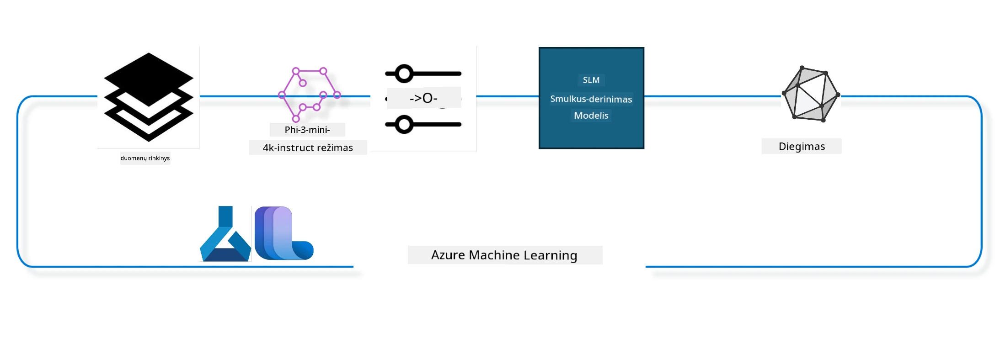

## Kaip naudoti pokalbio užbaigimo komponentus iš Azure ML sistemos registro modeliui tikslinti

Šiame pavyzdyje mes atliksime Phi-3-mini-4k-instruct modelio tikslinimą, kad užbaigtume pokalbį tarp 2 žmonių naudojant ultrachat_200k duomenų rinkinį.



Pavyzdys parodys, kaip atlikti tikslinimą naudojant Azure ML SDK ir Python, o tada įdiegti tikslintą modelį į internetinę galinę tašką realaus laiko prognozėms.

### Mokymo duomenys

Naudosime ultrachat_200k duomenų rinkinį. Tai smarkiai filtruota UltraChat duomenų rinkinio versija, kuri buvo naudojama mokyti Zephyr-7B-β – pažangų 7b pokalbių modelį.

### Modelis

Naudosime Phi-3-mini-4k-instruct modelį, kad parodytume, kaip naudotojas gali atlikti modelio tikslinimą pokalbio užbaigimo užduočiai. Jei atidarėte šį bloknotą iš konkretaus modelio kortelės, nepamirškite pakeisti modelio pavadinimą.

### Užduotys

- Pasirinkti modelį tikslinimui.
- Pasirinkti ir ištirti mokymo duomenis.
- Suformuoti tikslinimo užduotį.
- Vykdyti tikslinimo užduotį.
- Peržiūrėti mokymo ir vertinimo metrikas.
- Užregistruoti tikslintą modelį.
- Įdiegti tikslintą modelį realaus laiko prognozėms.
- Sutvarkyti išteklius.

## 1. Paruošiamieji veiksmai

- Įdiegti priklausomybes
- Prisijungti prie AzureML darbo srities. Daugiau informacijos rasite apie SDK autentifikacijos nustatymą. Pakeiskite žemiau esančius <WORKSPACE_NAME>, <RESOURCE_GROUP> ir <SUBSCRIPTION_ID>.
- Prisijungti prie azureml sistemos registro
- Nustatyti pasirenkamą eksperimento pavadinimą
- Patikrinti arba sukurti skaičiavimo resursus.

> [!NOTE]
> Reikalavimai: vienas GPU mazgas gali turėti kelias GPU korteles. Pavyzdžiui, viename Standard_NC24rs_v3 mazge yra 4 NVIDIA V100 GPU, o Standard_NC12s_v3 – 2 NVIDIA V100 GPU. Daugiau informacijos rasite dokumentacijoje. GPU kortelių skaičius per mazgą nustatomas parametre gpus_per_node žemiau. Teisingai nustatant šią reikšmę užtikrinamas visų GPU naudingumas mazge. Rekomenduojamus GPU kompiuterio SKU rasite čia ir čia.

### Python bibliotekos

Įdiekite priklausomybes vykdydami žemiau esantį langelį. Tai nėra pasirenkamas žingsnis, jei naudojate naują aplinką.

```bash
pip install azure-ai-ml
pip install azure-identity
pip install datasets==2.9.0
pip install mlflow
pip install azureml-mlflow
```

### Sąveika su Azure ML

1. Šis Python skriptas skirtas sąveikai su Azure Machine Learning (Azure ML) paslauga. Štai ką jis daro:

    - Importuoja reikiamus modulius iš paketų azure.ai.ml, azure.identity ir azure.ai.ml.entities. Taip pat importuoja time modulį.

    - Bando autentifikuotis naudodamas DefaultAzureCredential(), kuris suteikia supaprastintą autentifikacijos patirtį, leidžiančią greitai pradėti kurti programas Azure debesyje. Jei tai nepavyksta, pereina prie InteractiveBrowserCredential(), kuris pateikia interaktyvų prisijungimo langą.

    - Tada bando sukurti MLClient egzempliorių naudodamas from_config metodą, kuris nuskaito konfigūraciją iš numatyto konfigūracijos failo (config.json). Jei tai nepavyksta, sukuria MLClient egzempliorių rankiniu būdu pateikdamas subscription_id, resource_group_name ir workspace_name.

    - Sukuria dar vieną MLClient egzempliorių, šį kartą Azure ML registrui pavadinimu "azureml". Šiame registre saugomi modeliai, tikslinimo vamzdynai ir aplinkos.

    - Nustato eksperimento pavadinimą "chat_completion_Phi-3-mini-4k-instruct".

    - Generuoja unikalų laiko žymą, paversdamas dabartinį laiką (epoch nuo sekundžių, slankiojo kablelio) į sveiką skaičių, o po to į eilutę. Ši žyma gali būti naudojama unikaliems pavadinimams ir versijoms kurti.

    ```python
    # Importuoti reikalingus modulius iš Azure ML ir Azure Identity
    from azure.ai.ml import MLClient
    from azure.identity import (
        DefaultAzureCredential,
        InteractiveBrowserCredential,
    )
    from azure.ai.ml.entities import AmlCompute
    import time  # Importuoti time modulį
    
    # Bandyti autentifikuotis naudojant DefaultAzureCredential
    try:
        credential = DefaultAzureCredential()
        credential.get_token("https://management.azure.com/.default")
    except Exception as ex:  # Jei DefaultAzureCredential nepavyksta, naudoti InteractiveBrowserCredential
        credential = InteractiveBrowserCredential()
    
    # Bandyti sukurti MLClient instanciją naudojant numatytąjį konfigūracijos failą
    try:
        workspace_ml_client = MLClient.from_config(credential=credential)
    except:  # Jei tai nepavyksta, sukurti MLClient instanciją rankiniu būdu nurodant detales
        workspace_ml_client = MLClient(
            credential,
            subscription_id="<SUBSCRIPTION_ID>",
            resource_group_name="<RESOURCE_GROUP>",
            workspace_name="<WORKSPACE_NAME>",
        )
    
    # Sukurti kitą MLClient instanciją Azure ML registrui pavadinimu „azureml“
    # Šiame registre saugomi modeliai, tikslinimo (fine-tuning) duomenų srautai ir aplinkos
    registry_ml_client = MLClient(credential, registry_name="azureml")
    
    # Nustatyti eksperimento pavadinimą
    experiment_name = "chat_completion_Phi-3-mini-4k-instruct"
    
    # Sugeneruoti unikalų laiko žymeklį, kuris gali būti naudojamas vardams ir versijoms, kuriems reikia unikalumo
    timestamp = str(int(time.time()))
    ```

## 2. Pasirinkite pagrindinį modelį tikslinimui

1. Phi-3-mini-4k-instruct yra 3,8 mlrd. parametrų, lengvas, pažangus atviras modelis, sukurtas remiantis Phi-2 naudojamais duomenų rinkiniais. Modelis priklauso Phi-3 modelių šeimai, o Mini versija yra dviejų variantų – 4K ir 128K – tai konteksto ilgis (žetonuose), kurį jis palaiko. Reikia tikslinti modelį mūsų specifinei paskirčiai. Šiuos modelius galite peržiūrėti Modelių kataloge AzureML Studio, filtruodami pagal pokalbio užbaigimo užduotį. Šiame pavyzdyje naudojame Phi-3-mini-4k-instruct modelį. Jei atidarėte šį bloknotą kitam modeliui, atitinkamai pakeiskite modelio pavadinimą ir versiją.

> [!NOTE]
> modelio id savybė. Ji bus perduota kaip įvestis tikslinimo darbui. Taip pat prieinama kaip Asset ID laukas modelio detalių puslapyje AzureML Studio Modelių kataloge.

2. Šis Python skriptas bendrauja su Azure Machine Learning (Azure ML) paslauga. Štai ką jis daro:

    - Nustato model_name į "Phi-3-mini-4k-instruct".

    - Naudoja registry_ml_client objekto models savybės get metodą, kad gautų naujausią nurodyto modelio pavadinimo versiją iš Azure ML registro. get metodas kviečiamas su dviem argumentais: modelio pavadinimu ir etikete, nurodančia gauti naujausią modelio versiją.

    - Išveda pranešimą konsolėje, nurodydamas modelio pavadinimą, versiją ir id, kuris bus naudojamas tikslinimui. Stringo format metodas priskiria pavadinimą, versiją ir id pranešimui. Modelio pavadinimas, versija ir id prieinami kaip foundation_model objekto savybės.

    ```python
    # Nustatyti modelio pavadinimą
    model_name = "Phi-3-mini-4k-instruct"
    
    # Gauti naujausią modelio versiją iš Azure ML registro
    foundation_model = registry_ml_client.models.get(model_name, label="latest")
    
    # Išspausdinti modelio pavadinimą, versiją ir ID
    # Ši informacija naudinga sekimui ir derinimui
    print(
        "\n\nUsing model name: {0}, version: {1}, id: {2} for fine tuning".format(
            foundation_model.name, foundation_model.version, foundation_model.id
        )
    )
    ```

## 3. Sukurkite skaičiavimo resursus darbui

Tikslinimo darbas veikia TIK su GPU skaičiavimu. Skaičiavimo resurso dydis priklauso nuo modelio dydžio ir dažnai sunku tiksliai nustatyti tinkamą skaičiavimą darbui. Šiame langelyje vartotojui pateikiama rekomendacija, kaip pasirinkti tinkamus resursus.

> [!NOTE]
> Šie žemiau išvardinti skaičiavimai veikia su optimizuotu konfigūracija. Bet kokie konfigūracijos pakeitimai gali sukelti Cuda Out Of Memory klaidą. Tokiais atvejais pabandykite pakelti kompiuterio dydį.

> [!NOTE]
> Pasirenkant compute_cluster_size, įsitikinkite, kad atitinkamas kompiuteris yra jūsų resursų grupėje. Jei tam tikro kompiuterio nėra, galite pateikti užklausą prieigos prie šių resursų gavimui.

### Modelio tikrinimas, ar palaiko tikslinimą

1. Šis Python skriptas sąveikauja su Azure Machine Learning (Azure ML) modeliu. Štai ką jis daro:

    - Importuoja ast modulį, kuris suteikia funkcijas Python abstrakčios sintaksės medžių apdorojimui.

    - Tikrina, ar foundation_model objektas (atstovaujantis modelį Azure ML) turi žymę finetune_compute_allow_list. Žymės Azure ML yra raktas-reikšmė poros, kurias galima kurti ir naudoti modeliui filtruoti bei rūšiuoti.

    - Jei žymė finetune_compute_allow_list egzistuoja, ji naudoja ast.literal_eval funkciją, kad saugiai išanalizuotų žymės reikšmę (eilutę) į Python sąrašą. Šis sąrašas priskiriamas kintamajam computes_allow_list. Tada išvedamas pranešimas, kad reikia sukurti kompiuterį iš šio sąrašo.

    - Jei žymė finetune_compute_allow_list neegzistuoja, nustato computes_allow_list kaip None ir išveda pranešimą, kad ši žymė nėra modelio žymių sąraše.

    - Santrauka: šis skriptas tikrina specifinę žymę modelio metaduomenyse, jei ji egzistuoja, verčia jos reikšmę į sąrašą ir atitinkamai informuoja naudotoją.

    ```python
    # Importuokite ast modulį, kuris suteikia funkcijas Python abstrakčios sintaksės medžių apdorojimui
    import ast
    
    # Patikrinkite, ar modelio žymose yra 'finetune_compute_allow_list' žyma
    if "finetune_compute_allow_list" in foundation_model.tags:
        # Jei žyma yra, naudokite ast.literal_eval saugiai išanalizuoti žymos reikšmę (eilutę) į Python sąrašą
        computes_allow_list = ast.literal_eval(
            foundation_model.tags["finetune_compute_allow_list"]
        )  # konvertuoti eilutę į Python sąrašą
        # Išveskite pranešimą, nurodantį, kad reikia sukurti compute iš sąrašo
        print(f"Please create a compute from the above list - {computes_allow_list}")
    else:
        # Jei žyma nėra, nustatykite computes_allow_list reikšmę None
        computes_allow_list = None
        # Išveskite pranešimą, nurodantį, kad 'finetune_compute_allow_list' žyma nėra modelio žymose
        print("`finetune_compute_allow_list` is not part of model tags")
    ```

### Kompiuterio pavyzdžio tikrinimas

1. Šis Python skriptas sąveikauja su Azure Machine Learning (Azure ML) paslauga ir atlieka keletą patikrinimų kompiuterio pavyzdžiui. Štai ką jis daro:

    - Bando gauti kompiuterio pavyzdį su compute_cluster pavadinimu iš Azure ML darbo srities. Jei jo rezervo būsena (provisioning state) yra „failed“, iškelia ValueError klaidą.

    - Tikrina, ar computes_allow_list nėra None. Jei nėra, visi sąraše esantys kompiuterių dydžiai paverčiami mažosiomis raidėmis ir tikrinama, ar dabartinio kompiuterio dydis yra šiame sąraše. Jei ne, iškelia ValueError klaidą.

    - Jei computes_allow_list yra None, tikrina, ar kompiuterio dydis nėra tarp nepalaikomų GPU VM dydžių sąrašo. Jei yra, iškelia ValueError klaidą.

    - Gaukia visų darbo srities kompiuterių dydžių sąrašą. Pereina per sąrašą ir jei jo pavadinimas sutampa su dabartinio kompiuterio dydžiu, gauna GPU skaičių tam dydžiui ir nustato gpu_count_found į True.

    - Jei gpu_count_found yra True, išveda GPU skaičių kompiuteryje. Jei ne, iškelia ValueError klaidą.

    - Santrauka: skriptas atlieka keletą patikrinimų Azure ML darbo srities kompiuterio atžvilgiu, įskaitant jo rezervo būseną, dydžio tikrinimą pagal leistinų arba uždraustų sąrašą ir GPU skaičiaus patikrinimą.

    ```python
    # Atspausdinkite išimties pranešimą
    print(e)
    # Iškelkite ValueError, jei kompiuterio dydis nėra prieinamas darbo vietoje
    raise ValueError(
        f"WARNING! Compute size {compute_cluster_size} not available in workspace"
    )
    
    # Gaukite kompiuterio egzempliorių iš Azure ML darbo vietos
    compute = workspace_ml_client.compute.get(compute_cluster)
    # Patikrinkite, ar kompiuterio egzemplioriaus tiekimo būseną yra „failed“
    if compute.provisioning_state.lower() == "failed":
        # Iškelkite ValueError, jei tiekimo būsena yra „failed“
        raise ValueError(
            f"Provisioning failed, Compute '{compute_cluster}' is in failed state. "
            f"please try creating a different compute"
        )
    
    # Patikrinkite, ar computes_allow_list nėra None
    if computes_allow_list is not None:
        # Paverskite visus computes_allow_list kompiuterio dydžius į mažąsias raides
        computes_allow_list_lower_case = [x.lower() for x in computes_allow_list]
        # Patikrinkite, ar kompiuterio egzemplioriaus dydis yra computes_allow_list_lower_case sąraše
        if compute.size.lower() not in computes_allow_list_lower_case:
            # Iškelkite ValueError, jei kompiuterio egzemplioriaus dydis nėra computes_allow_list_lower_case sąraše
            raise ValueError(
                f"VM size {compute.size} is not in the allow-listed computes for finetuning"
            )
    else:
        # Apibrėžkite nepalaikomų GPU VM dydžių sąrašą
        unsupported_gpu_vm_list = [
            "standard_nc6",
            "standard_nc12",
            "standard_nc24",
            "standard_nc24r",
        ]
        # Patikrinkite, ar kompiuterio egzemplioriaus dydis yra unsupported_gpu_vm_list sąraše
        if compute.size.lower() in unsupported_gpu_vm_list:
            # Iškelkite ValueError, jei kompiuterio egzemplioriaus dydis yra unsupported_gpu_vm_list sąraše
            raise ValueError(
                f"VM size {compute.size} is currently not supported for finetuning"
            )
    
    # Inicializuokite žymeklį, kad patikrintumėte, ar GPU skaičius kompiuterio egzemplioriuje buvo rastas
    gpu_count_found = False
    # Gaukite visų prieinamų kompiuterio dydžių sąrašą darbo vietoje
    workspace_compute_sku_list = workspace_ml_client.compute.list_sizes()
    available_sku_sizes = []
    # Iteruokite per prieinamų kompiuterio dydžių sąrašą
    for compute_sku in workspace_compute_sku_list:
        available_sku_sizes.append(compute_sku.name)
        # Patikrinkite, ar kompiuterio dydžio pavadinimas atitinka kompiuterio egzemplioriaus dydį
        if compute_sku.name.lower() == compute.size.lower():
            # Jei taip, gaukite GPU skaičių šiam kompiuterio dydžiui ir nustatykite gpu_count_found į True
            gpus_per_node = compute_sku.gpus
            gpu_count_found = True
    # Jei gpu_count_found yra True, atspausdinkite GPU skaičių kompiuterio egzemplioriuje
    if gpu_count_found:
        print(f"Number of GPU's in compute {compute.size}: {gpus_per_node}")
    else:
        # Jei gpu_count_found yra False, iškelkite ValueError
        raise ValueError(
            f"Number of GPU's in compute {compute.size} not found. Available skus are: {available_sku_sizes}."
            f"This should not happen. Please check the selected compute cluster: {compute_cluster} and try again."
        )
    ```

## 4. Pasirinkite duomenų rinkinį modeliui tikslinti

1. Naudojame ultrachat_200k duomenų rinkinius. Duomenų rinkinys turi keturis padalijimus, tinkamus vadovaujamam tikslinimui (sft).
Generavimo reitingas (gen). Kiekvieno padalijimo pavyzdžių skaičius pateiktas žemiau:

    ```bash
    train_sft test_sft  train_gen  test_gen
    207865  23110  256032  28304
    ```

1. Kiti langeliai rodo bazinį duomenų paruošimą tikslinimui:

### Kai kurių duomenų eilučių vizualizavimas

Norime, kad šis pavyzdys veiktų greitai, todėl išsaugokite train_sft ir test_sft failus, kuriuose yra 5% jau apkarpytų eilučių. Tai reiškia, kad tikslintas modelis turės mažesnį tikslumą, todėl neturėtų būti naudojamas realiame pasaulyje.
download-dataset.py naudojamas atsisiųsti ultrachat_200k duomenų rinkinį ir transformuoti jį į tikslinimo vamzdyno komponentams tinkamą formatą. Kadangi duomenų rinkinys didelis, čia turime tik jo dalį.

1. Vykdant žemiau esantį skriptą atsisiunčiama tik 5% duomenų. Tai galima padidinti pakeitus dataset_split_pc parametrą į norimą procentą.

> [!NOTE]
> Kai kuriems kalbos modeliams naudojami skirtingi kalbos kodai, todėl stulpelių pavadinimai duomenų rinkiniuose turi atitikti tuos kodus.

1. Čia pateiktas pavyzdys, kaip turėtų atrodyti duomenys.
Pokalbio užbaigimo duomenų rinkinys saugomas parquet formatu, kiekvienas įrašas turi šią schemą:

    - Tai JSON (JavaScript Object Notation) dokumentas, populiarus duomenų mainų formatas. Tai nėra vykdomasis kodas, o duomenų saugojimo ir perdavimo būdas. Štai jo struktūros išskleidimas:

    - „prompt“: šis raktas laiko eilutės reikšmę, kuri žymi užduotį ar klausimą AI asistentui.

    - „messages“: tai masyvas objektų. Kiekvienas objektas žymi žinutę pokalbyje tarp naudotojo ir AI asistento. Kiekviena žinutė turi du raktus:

    - „content“: tekstas su žinutės turiniu.
    - „role“: eilutės reikšmė, apibrėžianti, kas siuntė žinutę – „user“ arba „assistant“.
    - „prompt_id“: unikalus eilutės identifikatorius, priskirtas užduočiai.

1. Šiame specifiniame JSON dokumente vaizduojamas pokalbis, kuriame naudotojas prašo AI asistento sukurti distopinės istorijos pagrindinį veikėją. Asistentas atsako, tada naudotojas prašo daugiau detalių. Asistentas sutinka pateikti daugiau detalių. Visas pokalbis yra susietas su specifiniu užduoties id.

    ```python
    {
        // The task or question posed to an AI assistant
        "prompt": "Create a fully-developed protagonist who is challenged to survive within a dystopian society under the rule of a tyrant. ...",
        
        // An array of objects, each representing a message in a conversation between a user and an AI assistant
        "messages":[
            {
                // The content of the user's message
                "content": "Create a fully-developed protagonist who is challenged to survive within a dystopian society under the rule of a tyrant. ...",
                // The role of the entity that sent the message
                "role": "user"
            },
            {
                // The content of the assistant's message
                "content": "Name: Ava\n\n Ava was just 16 years old when the world as she knew it came crashing down. The government had collapsed, leaving behind a chaotic and lawless society. ...",
                // The role of the entity that sent the message
                "role": "assistant"
            },
            {
                // The content of the user's message
                "content": "Wow, Ava's story is so intense and inspiring! Can you provide me with more details.  ...",
                // The role of the entity that sent the message
                "role": "user"
            }, 
            {
                // The content of the assistant's message
                "content": "Certainly! ....",
                // The role of the entity that sent the message
                "role": "assistant"
            }
        ],
        
        // A unique identifier for the prompt
        "prompt_id": "d938b65dfe31f05f80eb8572964c6673eddbd68eff3db6bd234d7f1e3b86c2af"
    }
    ```

### Duomenų atsisiuntimas

1. Šis Python skriptas naudojamas atsisiųsti duomenų rinkinį naudojant pagalbinį skriptą download-dataset.py. Štai ką jis daro:

    - Importuoja os modulį, kuris suteikia nešiojamą prieigą prie operacinės sistemos funkcijų.

    - Naudoja os.system funkciją vykdyti download-dataset.py skriptą su nurodytais komandų eilutės argumentais. Argumentai nurodo atsisiųsti duomenų rinkinį HuggingFaceH4/ultrachat_200k, atsisiuntimo vietą ultrachat_200k_dataset ir duomenų rinkinio padalijimą 5 proc. os.system grąžina vykdymo statusą, kuris priskiriamas exit_status kintamajam.

    - Tikrina, ar exit_status nėra 0. Unix tipo operacinėse sistemose 0 reiškia sėkmingą komandą, o kiti skaičiai – klaidas. Jei exit_status nėra 0, iškelia Exception su pranešimu apie klaidą atsisiunčiant duomenų rinkinį.

    - Santrauka: skriptas vykdo komandą atsisiųsti duomenis naudojant pagalbinį skriptą ir iškelia klaidą, jei komanda nepavyko.

    ```python
    # Importuoti os modulį, kuris suteikia būdą naudoti operacinės sistemos priklausomą funkcionalumą
    import os
    
    # Naudoti os.system funkciją vykdyti download-dataset.py skriptą apvalkale su konkrečiais komandų eilutės argumentais
    # Argumentai nurodo atsisiunčiamą duomenų rinkinį (HuggingFaceH4/ultrachat_200k), katalogą, į kurį jis bus atsisiųstas (ultrachat_200k_dataset), ir duomenų rinkinio padalijimo procentą (5)
    # os.system funkcija grąžina vykdytos komandos išeities būseną; ši būsena yra saugoma kintamajame exit_status
    exit_status = os.system(
        "python ./download-dataset.py --dataset HuggingFaceH4/ultrachat_200k --download_dir ultrachat_200k_dataset --dataset_split_pc 5"
    )
    
    # Patikrinti, ar exit_status nėra 0
    # Unix tipo operacinėse sistemose išeities būsena 0 paprastai reiškia, kad komanda įvykdyta sėkmingai, o bet koks kitas skaičius reiškia klaidą
    # Jei exit_status nėra 0, iškelti Exception su pranešimu, nurodančiu, kad įvyko klaida atsisiunčiant duomenų rinkinį
    if exit_status != 0:
        raise Exception("Error downloading dataset")
    ```

### Duomenų įkėlimas į DataFrame
1. Šis Python scenarijus įkelia JSON Lines failą į pandas DataFrame ir rodo pirmas 5 eilutes. Štai ką jis atlieka:

    - Importuoja pandas biblioteką, kuri yra galinga duomenų manipuliavimo ir analizės biblioteka.

    - Nustato maksimalų stulpelio plotį pandas rodymo nustatymuose į 0. Tai reiškia, kad atspausdinant DataFrame, kiekvieno stulpelio tekstas bus rodomas pilnai be sutrumpinimų.

    - Naudoja pd.read_json funkciją įkelti train_sft.jsonl failą iš ultrachat_200k_dataset katalogo į DataFrame. Argumentas lines=True nurodo, kad failas yra JSON Lines formatu, kur kiekviena eilutė yra atskiras JSON objektas.

    - Naudoja head metodą parodyti pirmas 5 DataFrame eilutes. Jei DataFrame turi mažiau nei 5 eilutes, bus parodytos visos.

    - Apibendrinant, šis scenarijus įkelia JSON Lines failą į DataFrame ir rodo pirmas 5 eilutes su pilnu stulpelio tekstu.
    
    ```python
    # Importuokite pandas biblioteką, kuri yra galinga duomenų manipuliavimo ir analizės biblioteka
    import pandas as pd
    
    # Nustatykite maksimalų stulpelio pločio rodymo pandas parinktyse į 0
    # Tai reiškia, kad kiekvieno stulpelio visas tekstas bus rodomas be sutrumpinimo, kai DataFrame bus atspausdintas
    pd.set_option("display.max_colwidth", 0)
    
    # Naudokite pd.read_json funkciją, kad įkelti train_sft.jsonl failą iš ultrachat_200k_dataset katalogo į DataFrame
    # Argumentas lines=True nurodo, kad failas yra JSON Lines formatu, kur kiekviena eilutė yra atskiras JSON objektas
    df = pd.read_json("./ultrachat_200k_dataset/train_sft.jsonl", lines=True)
    
    # Naudokite head metodą, kad parodytumėte pirmas 5 DataFrame eilutes
    # Jei DataFrame yra mažiau nei 5 eilučių, bus parodytos visos eilutės
    df.head()
    ```

## 5. Pateikite modelio tobulinimo užduotį naudodami modelį ir duomenis kaip įvestis

Sukurkite užduotį, kuri naudoja chat-completion pipeline komponentą. Sužinokite daugiau apie visus palaikomus tobulinimo parametrus.

### Apibrėžkite tobulinimo parametrus

1. Tobulinimo parametrai gali būti suskirstyti į 2 kategorijas – treniravimo parametrai ir optimizavimo parametrai

1. Treniruotės parametrai apibūdina treniravimosi aspektus, tokius kaip –

    - Optimizatorius, taikomas tvarkaraštis
    - Metricas, pagal kurį optimizuojamas tobulinimas
    - Treniruotės žingsnių skaičius, partijos dydis ir kt.
    - Optimizavimo parametrai padeda optimizuoti GPU atminties naudojimą ir efektyviau panaudoti skaičiavimo išteklius.

1. Žemiau yra keli parametrai, priklausantys šiai kategorijai. Optimizavimo parametrai skiriasi kiekvienam modeliui ir yra supakuoti su modeliu, kad būtų tvarkomos šios variacijos.

    - Įgalinti deepspeed ir LoRA
    - Įgalinti mišrios precizijos treniravimą
    - Įgalinti daugiamaštį treniravimą

> [!NOTE]
> Prižiūrimas tobulinimas gali sukelti praradimą suderinamumo arba katastrofišką užmarštį. Rekomenduojame patikrinti šią problemą ir paleisti suderinimo etapą po tobulinimo.

### Tobulinimo parametrai

1. Šis Python scenarijus nustato parametrus mašininio mokymosi modeliui tobulinti. Štai ką jis atlieka:

    - Nustato numatytuosius treniravimo parametrus, tokius kaip treniruotės epochų skaičius, mokymo ir vertinimo partijos dydžiai, mokymosi greitis, mokymosi greičio tvarkaraščio tipas.

    - Nustato numatytuosius optimizavimo parametrus, pavyzdžiui, ar taikyti Layer-wise Relevance Propagation (LoRa) ir DeepSpeed, bei DeepSpeed etapą.

    - Sujungia treniravimo ir optimizavimo parametrus į vieną žodyną pavadinimu finetune_parameters.

    - Patikrina, ar foundation_model turi specifinius modelio numatytuosius parametrus. Jei taip, išveda įspėjimo pranešimą ir atnaujina finetune_parameters žodyną su šiais specifiniais parametrais. ast.literal_eval funkcija naudojama konvertuoti modelio numatytuosius parametrus iš eilutės į Python žodyną.

    - Išveda galutinį tobulinimo parametrų rinkinį, kuris bus naudojamas vykdymui.

    - Apibendrinant, šis scenarijus nustato ir atvaizduoja parametrus mašininio mokymosi modeliui tobulinti, su galimybe pakeisti numatytuosius parametrus konkrečiais modelio parametrais.

    ```python
    # Nustatykite numatytuosius mokymo parametrus, tokius kaip mokymo epochų skaičius, duomenų rinkinių dydžiai mokymui ir vertinimui, mokymosi greitis ir mokymosi greičio planuoklio tipas
    training_parameters = dict(
        num_train_epochs=3,
        per_device_train_batch_size=1,
        per_device_eval_batch_size=1,
        learning_rate=5e-6,
        lr_scheduler_type="cosine",
    )
    
    # Nustatykite numatytuosius optimizavimo parametrus, tokius kaip ar taikyti sluoksnių svarbumo sklidimą (LoRa) ir DeepSpeed, bei DeepSpeed lygį
    optimization_parameters = dict(
        apply_lora="true",
        apply_deepspeed="true",
        deepspeed_stage=2,
    )
    
    # Apjunkite mokymo ir optimizavimo parametrus į vieną žodyną, vadinamą finetune_parameters
    finetune_parameters = {**training_parameters, **optimization_parameters}
    
    # Patikrinkite, ar foundation_model turi kokius nors modelio specifinius numatytuosius parametrus
    # Jei turi, spausdinkite įspėjamąją žinutę ir atnaujinkite finetune_parameters žodyną šiais modelio specifiniais numatytaisiais parametrais
    # ast.literal_eval funkcija naudojama konvertuoti modelio specifinius numatytuosius parametrus iš eilutės į Python žodyną
    if "model_specific_defaults" in foundation_model.tags:
        print("Warning! Model specific defaults exist. The defaults could be overridden.")
        finetune_parameters.update(
            ast.literal_eval(  # konvertuoti eilutę į Python žodyną
                foundation_model.tags["model_specific_defaults"]
            )
        )
    
    # Atspausdinkite galutinį smulkiojo derinimo parametrų rinkinį, kuris bus naudojamas vykdymui
    print(
        f"The following finetune parameters are going to be set for the run: {finetune_parameters}"
    )
    ```

### Treniruotės pastotė

1. Šis Python scenarijus apibrėžia funkciją, kuri generuoja rodinio pavadinimą mašininio mokymosi treniravimo pastotei, o tada kviečia šią funkciją sugeneruoti ir atspausdinti rodinio pavadinimą. Štai ką jis atlieka:

1. Apibrėžiama get_pipeline_display_name funkcija. Ši funkcija generuoja rodinio pavadinimą pagal įvairius su treniravimo pastote susijusius parametrus.

1. Funkcijos viduje apskaičiuojamas bendras partijos dydis daugindamas vieno įrenginio partijos dydį, gradientų kaupimo žingsnių skaičių, GPU skaičių viename mazge ir mazgų, naudojamų tobulinimui, skaičių.

1. Gaunami kiti parametrai, tokie kaip mokymosi greičio tvarkaraščio tipas, ar taikoma DeepSpeed, DeepSpeed etapas, ar taikomas Layer-wise Relevance Propagation (LoRa), limitas saugomų modelio patikrinimų skaičiui ir maksimalus sekos ilgis.

1. Formuojama eilutė, kurioje surašyti visi šie parametrai, atskirti brūkšneliais. Jei taikomas DeepSpeed arba LoRa, eilutėje įterpiamas "ds" su DeepSpeed etapu arba "lora". Priešingu atveju, įtraukiama "nods" arba "nolora".

1. Funkcija gražina šią eilutę kaip treniravimo pastotės rodymo pavadinimą.

1. Po funkcijos apibrėžimo ji kviečiama sugeneruoti rodinio pavadinimą, kuris po to atspausdinamas.

1. Apibendrinant, šis scenarijus generuoja mašininio mokymosi treniravimo pastotės rodinio pavadinimą pagal įvairius parametrus ir jį atspausdina.

    ```python
    # Apibrėžti funkciją, kuri sugeneruos treniravimo proceso rodymo pavadinimą
    def get_pipeline_display_name():
        # Apskaičiuoti bendrą partijų dydį dauginant vieno įrenginio partijos dydį, gradiento kaupimo žingsnių skaičių, GPU skaičių viename mazge ir mazgų skaičių, naudojamų perdavimui
        batch_size = (
            int(finetune_parameters.get("per_device_train_batch_size", 1))
            * int(finetune_parameters.get("gradient_accumulation_steps", 1))
            * int(gpus_per_node)
            * int(finetune_parameters.get("num_nodes_finetune", 1))
        )
        # Gauti mokymosi greičio planuoklio tipą
        scheduler = finetune_parameters.get("lr_scheduler_type", "linear")
        # Gauti informaciją, ar taikomas DeepSpeed
        deepspeed = finetune_parameters.get("apply_deepspeed", "false")
        # Gauti DeepSpeed etapo reikšmę
        ds_stage = finetune_parameters.get("deepspeed_stage", "2")
        # Jei taikomas DeepSpeed, įtraukti „ds“ kartu su DeepSpeed etapu į rodymo pavadinimą; jei ne, įtraukti „nods“
        if deepspeed == "true":
            ds_string = f"ds{ds_stage}"
        else:
            ds_string = "nods"
        # Gauti informaciją, ar taikoma sluoksnis po sluoksnio aktualumo plitimo (LoRa) metodika
        lora = finetune_parameters.get("apply_lora", "false")
        # Jei taikoma LoRa, įtraukti „lora“ į rodymo pavadinimą; jei ne, įtraukti „nolora“
        if lora == "true":
            lora_string = "lora"
        else:
            lora_string = "nolora"
        # Gauti ribą, kiek modelio kontrolinių taškų išsaugoti
        save_limit = finetune_parameters.get("save_total_limit", -1)
        # Gauti maksimalų sekos ilgį
        seq_len = finetune_parameters.get("max_seq_length", -1)
        # Sukurti rodymo pavadinimą sujungiant visas šias reikšmes, atskirtas brūkšniais
        return (
            model_name
            + "-"
            + "ultrachat"
            + "-"
            + f"bs{batch_size}"
            + "-"
            + f"{scheduler}"
            + "-"
            + ds_string
            + "-"
            + lora_string
            + f"-save_limit{save_limit}"
            + f"-seqlen{seq_len}"
        )
    
    # Iškvieti funkciją, kuri generuos rodymo pavadinimą
    pipeline_display_name = get_pipeline_display_name()
    # Atspausdinti rodymo pavadinimą
    print(f"Display name used for the run: {pipeline_display_name}")
    ```

### Pastotės konfigūravimas

Šis Python scenarijus apibrėžia ir konfigūruoja mašininio mokymosi pastotę naudojant Azure Machine Learning SDK. Štai ką jis atlieka:

1. Importuoja reikiamus modulius iš Azure AI ML SDK.

1. Gautas registruotasis pastotės komponentas pavadinimu "chat_completion_pipeline".

1. Apibrėžia pastotės užduotį naudojant `@pipeline` dekoratorių ir funkciją `create_pipeline`. Pastotės pavadinimas nustatytas kaip `pipeline_display_name`.

1. Viduje funkcijos `create_pipeline` inicijuoja gautą pastotės komponentą su įvairiais parametrais, įskaitant modelio kelią, skaičiavimo klasterius skirtingiems etapams, duomenų rinkinių pasiskirstymą mokymui ir testavimui, GPU skaičių tobulinimui ir kitus tobulinimo parametrus.

1. Susieja tobulinimo darbo išvestį su pastotės užduoties išvestimi. Tai leidžia lengvai registruoti tobulintą modelį, kas reikalinga jį diegti į internetinį ar masinio apdorojimo galinį tašką.

1. Sukuria pastotės egzempliorių kviesdamas `create_pipeline` funkciją.

1. Nustato pastotės nustatymą `force_rerun` į `True`, tai reiškia, kad nebus naudojami anksčiau kešuoti rezultatai.

1. Nustato pastotės nustatymą `continue_on_step_failure` į `False`, tai reiškia, kad pastotė sustos, jei kurios nors žingsnis nepavyks.

1. Apibendrinant, šis scenarijus apibrėžia ir konfigūruoja mašininio mokymosi pastotę pokalbių užbaigimo užduočiai, naudodamas Azure Machine Learning SDK.

    ```python
    # Importuokite reikalingus modulius iš Azure AI ML SDK
    from azure.ai.ml.dsl import pipeline
    from azure.ai.ml import Input
    
    # Gaukite registro komponentą pavadinimu „chat_completion_pipeline“
    pipeline_component_func = registry_ml_client.components.get(
        name="chat_completion_pipeline", label="latest"
    )
    
    # Apibrėžkite pipe lino užduotį naudodami @pipeline dekoratorių ir funkciją create_pipeline
    # Pipeline pavadinimas nustatytas į pipeline_display_name
    @pipeline(name=pipeline_display_name)
    def create_pipeline():
        # Inicializuokite gautą pipeline komponentą su įvairiais parametrais
        # Tai apima modelio kelią, skaičiavimo klasterius skirtingiems etapams, duomenų rinkinių pasiskirstymą treniruotėms ir testavimui, GPU skaičių fine-tuning tikslams ir kitus fine-tuning parametrus
        chat_completion_pipeline = pipeline_component_func(
            mlflow_model_path=foundation_model.id,
            compute_model_import=compute_cluster,
            compute_preprocess=compute_cluster,
            compute_finetune=compute_cluster,
            compute_model_evaluation=compute_cluster,
            # Susiekite duomenų rinkinių pasiskirstymą su parametrais
            train_file_path=Input(
                type="uri_file", path="./ultrachat_200k_dataset/train_sft.jsonl"
            ),
            test_file_path=Input(
                type="uri_file", path="./ultrachat_200k_dataset/test_sft.jsonl"
            ),
            # Treniruotės nustatymai
            number_of_gpu_to_use_finetuning=gpus_per_node,  # Nustatytas pagal prieinamo GPU skaičių skaičiavimo sistemoje
            **finetune_parameters
        )
        return {
            # Susiekite fine-tuning užduoties išvestį su pipeline užduoties išvestimi
            # Tai atliekama tam, kad galėtume lengvai užregistruoti fine-tuned modelį
            # Modelio registracija reikalinga, norint diegti modelį į internetinį ar partijinį galinį tašką
            "trained_model": chat_completion_pipeline.outputs.mlflow_model_folder
        }
    
    # Sukurkite pipeline egzempliorių kviesdami create_pipeline funkciją
    pipeline_object = create_pipeline()
    
    # Nenaudokite ankstesnių užduočių kešuotų rezultatų
    pipeline_object.settings.force_rerun = True
    
    # Nustatykite tolesnį vykdymą po žingsnio klaidos į False
    # Tai reiškia, kad pipeline bus sustabdytas, jei kažkuris žingsnis nepavyks
    pipeline_object.settings.continue_on_step_failure = False
    ```

### Pateikite užduotį

1. Šis Python scenarijus pateikia mašininio mokymosi pastotės užduotį į Azure Machine Learning darbo sritį ir laukia, kol užduotis bus baigta. Štai ką jis atlieka:

    - Kviečia workspace_ml_client jobs objekto create_or_update metodą pateikti pastotės užduotį. Įvykdymui nurodoma pastotė pipeline_object, o eksperimentas, kurio metu vykdoma, nurodytas experiment_name.

    - Po to kviečia workspace_ml_client jobs objekto stream metodą laukti užduoties pabaigos. Laukiama užduotis nurodoma kaip pipeline_job objekto name atributas.

    - Apibendrinant, šis scenarijus pateikia mašininio mokymosi pastotės užduotį į Azure Machine Learning darbo sritį, tada laukia jos pabaigos.

    ```python
    # Pateikite procesų srautų užduotį Azure Machine Learning darbo vietoje
    # Vykdomas procesų srautas nurodomas per pipeline_object
    # Eksperimentas, pagal kurį vykdoma užduotis, nurodomas per experiment_name
    pipeline_job = workspace_ml_client.jobs.create_or_update(
        pipeline_object, experiment_name=experiment_name
    )
    
    # Palaukite, kol procesų srauto užduotis bus baigta
    # Laukiama užduotis nurodoma per pipeline_job objekto name atributą
    workspace_ml_client.jobs.stream(pipeline_job.name)
    ```

## 6. Užregistruokite tobulintą modelį darbo srityje

Registruosime modelį iš tobulinimo užduoties išvesties. Tai leis sekti kilmę tarp tobulinto modelio ir tobulinimo užduoties. Tobulinimo užduotis, savo ruožtu, seka kilmę iki pagrindinio modelio, duomenų ir treniravimo kodo.

### ML modelio registravimas

1. Šis Python scenarijus registruoja mašininio mokymosi modelį, kuris buvo apmokytas Azure Machine Learning pastotėje. Štai ką jis atlieka:

    - Importuoja reikiamus modulius iš Azure AI ML SDK.

    - Tikrina, ar pipeline užduoties treniruotas_modelis išvestis yra prieinama, kviesdamas workspace_ml_client jobs objekto get metodą ir pasiekdamas jo outputs atributą.

    - Sudaro kelią į treniruotą modelį, formatuodamas eilutę su pipeline užduoties pavadinimu ir išvesties vardu ("trained_model").

    - Apibrėžia tobulinto modelio pavadinimą, pridedant "-ultrachat-200k" prie pradinio modelio vardo ir pakeičiant bet kokius brūkšnelius į brūkšnelius.

    - Pasirengia registruoti modelį, sukuriant Model objektą su įvairiais parametrais, įskaitant modelio kelią, modelio tipą (MLflow modelis), modelio vardą ir versiją bei aprašymą.

    - Registruoja modelį kviesdamas workspace_ml_client models objekto create_or_update metodą su Model objektu kaip argumentu.

    - Išveda registruotą modelį.

1. Apibendrinant, šis scenarijus registruoja mašininio mokymosi modelį, kuris buvo apmokytas Azure Machine Learning pastotėje.
    
    ```python
    # Importuokite reikalingus modulius iš Azure AI ML SDK
    from azure.ai.ml.entities import Model
    from azure.ai.ml.constants import AssetTypes
    
    # Patikrinkite, ar `trained_model` išvestis yra prieinama iš pipeline darbo
    print("pipeline job outputs: ", workspace_ml_client.jobs.get(pipeline_job.name).outputs)
    
    # Sukurkite kelią į apmokytą modelį suformatuodami eilutę su pipeline darbo pavadinimu ir išvesties pavadinimu ("trained_model")
    model_path_from_job = "azureml://jobs/{0}/outputs/{1}".format(
        pipeline_job.name, "trained_model"
    )
    
    # Apibrėžkite pavadinimą tobulintam modeliui, pridėdami "-ultrachat-200k" prie pradinio modelio pavadinimo ir pakeisdami visas brūkšnelius į minuso ženklus
    finetuned_model_name = model_name + "-ultrachat-200k"
    finetuned_model_name = finetuned_model_name.replace("/", "-")
    
    print("path to register model: ", model_path_from_job)
    
    # Paruoškite modelio registraciją sukurdami Model objektą su įvairiais parametrais
    # Tai apima modelio kelią, modelio tipą (MLflow modelis), modelio pavadinimą ir versiją bei modelio aprašymą
    prepare_to_register_model = Model(
        path=model_path_from_job,
        type=AssetTypes.MLFLOW_MODEL,
        name=finetuned_model_name,
        version=timestamp,  # Naudokite laiko žymę kaip versiją, kad išvengtumėte versijų konflikto
        description=model_name + " fine tuned model for ultrachat 200k chat-completion",
    )
    
    print("prepare to register model: \n", prepare_to_register_model)
    
    # Užregistruokite modelį iškviesdami create_or_update metodą iš models objekto workspace_ml_client su Model objektu kaip argumentu
    registered_model = workspace_ml_client.models.create_or_update(
        prepare_to_register_model
    )
    
    # Išveskite užregistruotą modelį
    print("registered model: \n", registered_model)
    ```

## 7. Diegti tobulintą modelį į internetinį galinį tašką

Internetiniai galiniai taškai suteikia pastovų REST API, kurį galima naudoti integruojant su programomis, kurioms reikia modelio.

### Galinio taško valdymas

1. Šis Python scenarijus sukuria valdomą internetinį galinį tašką Azure Machine Learning registruotam modeliui. Štai ką jis daro:

    - Importuoja reikalingus modulius iš Azure AI ML SDK.

    - Apibrėžia unikalų internetinio galinio taško pavadinimą, pridėdamas laiko žymą prie eilutės "ultrachat-completion-".

    - Pasiruošia sukurti internetinį galinį tašką, sukuriant ManagedOnlineEndpoint objektą su įvairiais parametrais, įskaitant galinio taško pavadinimą, aprašymą ir autentifikacijos režimą ("key").

    - Sukuria internetinį galinį tašką kviesdamas workspace_ml_client begin_create_or_update metodą su ManagedOnlineEndpoint objektu kaip argumentu. Laukia, kol kūrimo operacija baigsis, kviesdamas wait metodą.

1. Apibendrinant, šis scenarijus sukuria valdomą internetinį galinį tašką Azure Machine Learning registruotam modeliui.

    ```python
    # Importuoti reikalingus modulius iš Azure AI ML SDK
    from azure.ai.ml.entities import (
        ManagedOnlineEndpoint,
        ManagedOnlineDeployment,
        ProbeSettings,
        OnlineRequestSettings,
    )
    
    # Apibrėžti unikalų vardą interneto galiniam taškui pridedant laiko žymę prie eilutės "ultrachat-completion-"
    online_endpoint_name = "ultrachat-completion-" + timestamp
    
    # Pasiruošti sukurti interneto galinį tašką sukuriant ManagedOnlineEndpoint objektą su įvairiais parametrais
    # Tai apima galinio taško pavadinimą, aprašymą ir autentifikavimo režimą ("key")
    endpoint = ManagedOnlineEndpoint(
        name=online_endpoint_name,
        description="Online endpoint for "
        + registered_model.name
        + ", fine tuned model for ultrachat-200k-chat-completion",
        auth_mode="key",
    )
    
    # Sukurti interneto galinį tašką kviečiant workspace_ml_client begin_create_or_update metodą su ManagedOnlineEndpoint objektu kaip argumentu
    # Tada palaukti, kol kūrimo operacija bus baigta, kviečiant wait metodą
    workspace_ml_client.begin_create_or_update(endpoint).wait()
    ```

> [!NOTE]
> Čia galite rasti palaikomų SKU sąrašą diegimui – [Valdomų internetinių galinių taškų SKU sąrašas](https://learn.microsoft.com/azure/machine-learning/reference-managed-online-endpoints-vm-sku-list)

### ML modelio diegimas

1. Šis Python scenarijus diegia registruotą mašininio mokymosi modelį valdomame internetiniame galiniame taške Azure Machine Learning. Štai ką jis atlieka:

    - Importuoja ast modulį, kuris suteikia funkcijas Python abstraktinės sintaksės medžių apdorojimui.

    - Nustato diegimo įrenginio tipą į "Standard_NC6s_v3".

    - Patikrina, ar foundation_model turi inference_compute_allow_list žymą. Jei taip, konvertuoja žymos reikšmę iš eilutės į Python sąrašą ir priskiria inference_computes_allow_list. Jei ne, nustato inference_computes_allow_list į None.

    - Patikrina, ar nurodytas įrenginio tipas yra leistinų sąraše. Jei ne, išveda pranešimą, prašydamas pasirinkti įrenginio tipą iš leistino sąrašo.

    - Pasiruošia sukurti diegimą, sukuriant ManagedOnlineDeployment objektą su įvairiais parametrais, įskaitant diegimo pavadinimą, galinio taško pavadinimą, modelio ID, įrenginio tipą ir skaičių, liveness stebėjimo nustatymus ir užklausų nustatymus.

    - Sukuria diegimą kviesdamas workspace_ml_client begin_create_or_update metodą su ManagedOnlineDeployment objektu kaip argumentu. Laukia, kol kūrimo operacija baigsis, kviesdamas wait metodą.

    - Nustato galinio taško srautą nukreipti 100% srauto į "demo" diegimą.

    - Atnaujina galinį tašką kviesdamas workspace_ml_client begin_create_or_update metodą su galinio taško objektu kaip argumentu. Laukia, kol atnaujinimas baigsis, kviesdamas result metodą.

1. Apibendrinant, šis scenarijus diegia registruotą mašininio mokymosi modelį valdomame internetiniame galiniame taške Azure Machine Learning.

    ```python
    # Importuokite ast modulį, kuris teikia funkcijas Python abstraktaus sintaksės medžių apdorojimui
    import ast
    
    # Nustatykite instancijos tipą diegimui
    instance_type = "Standard_NC6s_v3"
    
    # Patikrinkite, ar pagrindiniame modelyje yra `inference_compute_allow_list` žyma
    if "inference_compute_allow_list" in foundation_model.tags:
        # Jei taip, konvertuokite žymos reikšmę iš eilutės į Python sąrašą ir priskirkite `inference_computes_allow_list`
        inference_computes_allow_list = ast.literal_eval(
            foundation_model.tags["inference_compute_allow_list"]
        )
        print(f"Please create a compute from the above list - {computes_allow_list}")
    else:
        # Jei ne, nustatykite `inference_computes_allow_list` į `None`
        inference_computes_allow_list = None
        print("`inference_compute_allow_list` is not part of model tags")
    
    # Patikrinkite, ar nurodytas instancijos tipas yra leistinų sąraše
    if (
        inference_computes_allow_list is not None
        and instance_type not in inference_computes_allow_list
    ):
        print(
            f"`instance_type` is not in the allow listed compute. Please select a value from {inference_computes_allow_list}"
        )
    
    # Pasiruoškite sukurti diegimą, sukurdami `ManagedOnlineDeployment` objektą su įvairiais parametrais
    demo_deployment = ManagedOnlineDeployment(
        name="demo",
        endpoint_name=online_endpoint_name,
        model=registered_model.id,
        instance_type=instance_type,
        instance_count=1,
        liveness_probe=ProbeSettings(initial_delay=600),
        request_settings=OnlineRequestSettings(request_timeout_ms=90000),
    )
    
    # Sukurkite diegimą, iškviesdami `begin_create_or_update` metodą iš `workspace_ml_client`, perduodant `ManagedOnlineDeployment` objektą kaip argumentą
    # Tada palaukite, kol kūrimo operacija bus baigta, iškviesdami `wait` metodą
    workspace_ml_client.online_deployments.begin_create_or_update(demo_deployment).wait()
    
    # Nustatykite galutinio taško srautą nukreipti 100 % srauto į "demo" diegimą
    endpoint.traffic = {"demo": 100}
    
    # Atnaujinkite galutinį tašką, iškviesdami `begin_create_or_update` metodą iš `workspace_ml_client`, perduodant `endpoint` objektą kaip argumentą
    # Tada palaukite, kol atnaujinimo operacija bus baigta, iškviesdami `result` metodą
    workspace_ml_client.begin_create_or_update(endpoint).result()
    ```

## 8. Išbandykite galinį tašką su pavyzdiniais duomenimis

Paimsime keletą pavyzdinių duomenų iš testų duomenų rinkinio ir pateiksime juos internetiniam galiniam taškui prognozavimui. Tada parodysime įvertintas etiketes kartu su tikrosiomis etiketėmis.

### Rezultatų skaitymas

1. Šis Python scenarijus skaito JSON Lines failą į pandas DataFrame, paima atsitiktinį pavyzdį ir atnaujina indeksus. Štai ką jis daro:

    - Skaito failą ./ultrachat_200k_dataset/test_gen.jsonl į pandas DataFrame. read_json funkcija naudojama su lines=True argumentu, nes failas yra JSON Lines formatu, kur kiekviena eilutė yra atskiras JSON objektas.

    - Paima atsitiktinį 1 eilutės pavyzdį iš DataFrame. sample funkcija naudojama su n=1 argumentu, nurodančiu atsitiktinai pasirinkti eilučių skaičių.

    - Atnaujina DataFrame indeksą. reset_index funkcija naudojama su drop=True argumentu, kad būtų pašalintas originalus indeksas ir pakeistas nauju numatytu sveikuoju indeksu.

    - Rodo pirmas 2 DataFrame eilutes naudodama head funkciją su argumentu 2. Kadangi po ėminiavimo DataFrame turi tik vieną eilutę, bus parodyta tik ta viena eilutė.

1. Apibendrinant, šis scenarijus skaito JSON Lines failą į pandas DataFrame, paima atsitiktinį 1 eilutės pavyzdį, atnaujina indeksą ir rodo pirmą eilutę.
    
    ```python
    # Importuoti pandas biblioteką
    import pandas as pd
    
    # Skaityti JSON Lines failą './ultrachat_200k_dataset/test_gen.jsonl' į pandas DataFrame
    # Argumentas 'lines=True' nurodo, kad failas yra JSON Lines formatu, kur kiekviena eilutė yra atskiras JSON objektas
    test_df = pd.read_json("./ultrachat_200k_dataset/test_gen.jsonl", lines=True)
    
    # Imti atsitiktinį 1 eilutės pavyzdį iš DataFrame
    # Argumentas 'n=1' nurodo atsitiktinai atrenkamų eilučių skaičių
    test_df = test_df.sample(n=1)
    
    # Atstatyti DataFrame indeksą
    # Argumentas 'drop=True' nurodo originalų indeksą pašalinti ir pakeisti nauju numatytųjų sveikųjų skaičių indeksu
    # Argumentas 'inplace=True' nurodo, kad DataFrame turėtų būti pakeistas vietoje (nesukuriant naujo objekto)
    test_df.reset_index(drop=True, inplace=True)
    
    # Rodyti pirmas 2 DataFrame eiles
    # Tačiau kadangi po mėginių ėmimo DataFrame turi tik vieną eilutę, bus rodoma tik ta viena eilutė
    test_df.head(2)
    ```

### Sukurkite JSON objektą
1. Šis Python scenarijus kuria JSON objektą su konkrečiais parametrais ir įrašo jį į failą. Štai ką jis daro:

    - Importuoja json modulį, kuris suteikia funkcijas darbui su JSON duomenimis.

    - Sukuria žodyną parameters su raktų ir reikšmių poromis, kurios atspindi mašininio mokymosi modelio parametrus. Raktai yra "temperature", "top_p", "do_sample" ir "max_new_tokens", o jų atitinkamos reikšmės yra 0.6, 0.9, True ir 200 atitinkamai.

    - Sukuria kitą žodyną test_json su dviem raktais: "input_data" ir "params". "input_data" reikšmė yra kitas žodynas su raktais "input_string" ir "parameters". "input_string" reikšmė yra sąrašas, kuriame yra pirmoji žinia iš test_df DataFrame. "parameters" reikšmė yra anksčiau sukurtas parameters žodynas. "params" reikšmė yra tuščias žodynas.

    - Atidaro failą pavadinimu sample_score.json
    
    ```python
    # Importuokite json modulį, kuris suteikia funkcijas darbui su JSON duomenimis
    import json
    
    # Sukurkite žodyną `parameters` su raktais ir reikšmėmis, kurios atspindi parametrus mašininio mokymosi modeliui
    # Raktai yra "temperature", "top_p", "do_sample" ir "max_new_tokens", o jų atitinkamos reikšmės yra 0.6, 0.9, True ir 200 atitinkamai
    parameters = {
        "temperature": 0.6,
        "top_p": 0.9,
        "do_sample": True,
        "max_new_tokens": 200,
    }
    
    # Sukurkite kitą žodyną `test_json` su dviem raktais: "input_data" ir "params"
    # "input_data" reikšmė yra kitas žodynas su raktais "input_string" ir "parameters"
    # "input_string" reikšmė yra sąrašas, kuriame yra pirmasis `test_df` duomenų rėmelio pranešimas
    # "parameters" reikšmė yra anksčiau sukurtas `parameters` žodynas
    # "params" reikšmė yra tuščias žodynas
    test_json = {
        "input_data": {
            "input_string": [test_df["messages"][0]],
            "parameters": parameters,
        },
        "params": {},
    }
    
    # Atidarykite failą pavadinimu `sample_score.json` kataloge `./ultrachat_200k_dataset` rašymo režimu
    with open("./ultrachat_200k_dataset/sample_score.json", "w") as f:
        # Įrašykite `test_json` žodyną į failą JSON formatu naudodami `json.dump` funkciją
        json.dump(test_json, f)
    ```

### Endpointo kvietimas

1. Šis Python scenarijus kviečia internetinį endpointą Azure Machine Learning, kad įvertintų JSON failą. Štai ką jis daro:

    - Kvies metodą invoke, kuris yra workspace_ml_client objekto online_endpoints savybėje. Šis metodas naudojamas siųsti užklausą į internetinį endpointą ir gauti atsakymą.

    - Nurodo endpointo pavadinimą ir diegimą naudodamas argumentus endpoint_name ir deployment_name. Šiuo atveju, endpointo pavadinimas saugomas kintamajame online_endpoint_name, o diegimo pavadinimas yra "demo".

    - Nurodo JSON failo kelią, kuris bus įvertintas, naudojant argumentą request_file. Šiuo atveju failas yra ./ultrachat_200k_dataset/sample_score.json.

    - Saugo endpointo atsakymą kintamajame response.

    - Išspausdina neapdorotą atsakymą.

1. Apibendrinant, šis scenarijus kviečia internetinį endpointą Azure Machine Learning įvertinti JSON failą ir išspausdina atsakymą.

    ```python
    # Iškvieskite Azure Machine Learning internetinį tašką, kad įvertintumėte `sample_score.json` failą
    # `workspace_ml_client` objekto `online_endpoints` savybės `invoke` metodas naudojamas siųsti užklausą į internetinį tašką ir gauti atsakymą
    # `endpoint_name` argumentas nurodo taško pavadinimą, kuris saugomas `online_endpoint_name` kintamajame
    # `deployment_name` argumentas nurodo diegimo pavadinimą, kuris yra "demo"
    # `request_file` argumentas nurodo kelią į JSON failą, kurį reikia įvertinti, kuris yra `./ultrachat_200k_dataset/sample_score.json`
    response = workspace_ml_client.online_endpoints.invoke(
        endpoint_name=online_endpoint_name,
        deployment_name="demo",
        request_file="./ultrachat_200k_dataset/sample_score.json",
    )
    
    # Atspausdinkite žalią atsakymą iš taško
    print("raw response: \n", response, "\n")
    ```

## 9. Ištrinkite internetinį endpointą

1. Nepamirškite ištrinti internetinio endpointo, kitaip jis tęsis ir liks įjungtas mokesčių skaitiklis už naudotą skaičiavimo laiką. Ši Python kodo eilutė ištrina internetinį endpointą Azure Machine Learning. Štai ką ji daro:

    - Kvies begin_delete metodą, kuris yra workspace_ml_client objekto online_endpoints savybėje. Šis metodas naudojamas pradėti internetinio endpointo ištrynimo procesą.

    - Nurodo ištrintino endpointo pavadinimą naudodamas argumentą name. Šiuo atveju endpointo pavadinimas saugomas kintamajame online_endpoint_name.

    - Kvies wait metodą, kad palauktų, kol ištrynimo veiksmas bus užbaigtas. Tai blokuojanti operacija, reiškianti, kad scenarijus nesitęs tol, kol ištrynimas nebus baigtas.

    - Apibendrinant, ši kodo eilutė pradeda internetinio endpointo ištrynimą Azure Machine Learning ir laukia, kol operacija bus baigta.

    ```python
    # Ištrinti internetinį galinį tašką Azure Machine Learning
    # `begin_delete` metodas, kuris yra `online_endpoints` savybėje `workspace_ml_client` objekte, naudojamas pradėti internetinio galinio taško ištrynimą
    # `name` argumentas nurodo ištrinti skirtą galinio taško pavadinimą, kuris saugomas kintamajame `online_endpoint_name`
    # Iškviečiamas `wait` metodas, kad lauktų, kol ištrynimo operacija bus baigta. Tai blokavimo operacija, reiškianti, kad skriptas nebus tęsiamas, kol ištrynimas nebus baigtas
    workspace_ml_client.online_endpoints.begin_delete(name=online_endpoint_name).wait()
    ```

---

<!-- CO-OP TRANSLATOR DISCLAIMER START -->
**Atsisakymas**:
Šis dokumentas buvo išverstas naudojant dirbtinio intelekto vertimo paslaugą [Co-op Translator](https://github.com/Azure/co-op-translator). Nors siekiame tikslumo, prašome atkreipti dėmesį, kad automatiniai vertimai gali turėti klaidų ar netikslumų. Originalus dokumentas gimtąja kalba turėtų būti laikomas autoritetingu šaltiniu. Svarbios informacijos atveju rekomenduojamas profesionalus žmogaus vertimas. Mes neatsakome už jokius nesusipratimus ar klaidingas interpretacijas, kylančias naudojant šį vertimą.
<!-- CO-OP TRANSLATOR DISCLAIMER END -->