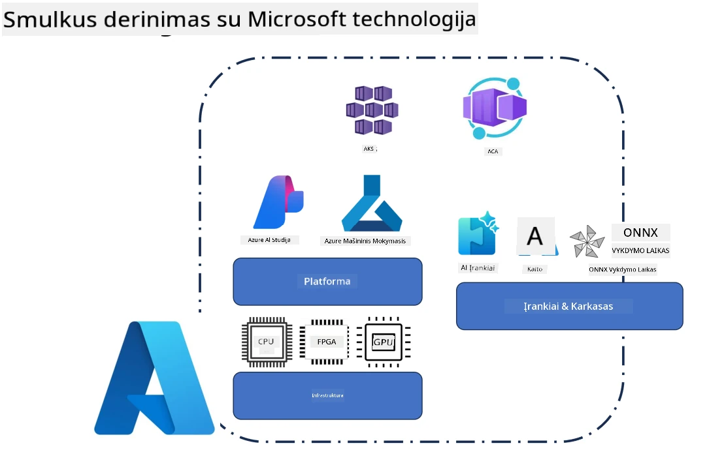
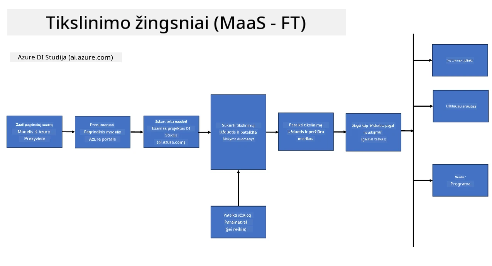
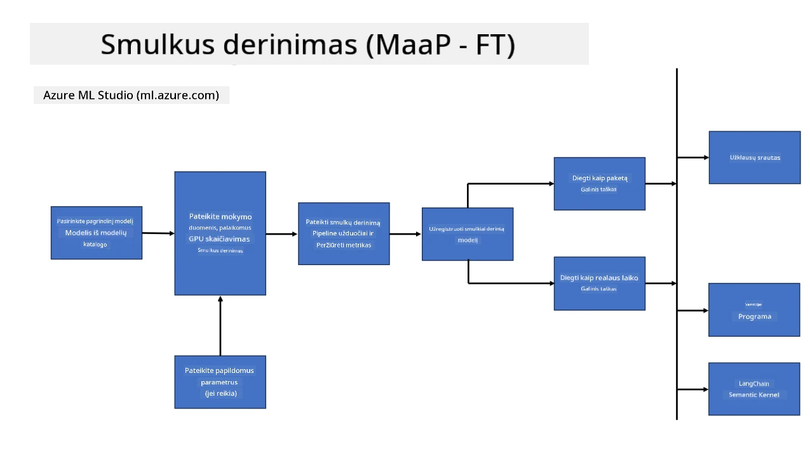
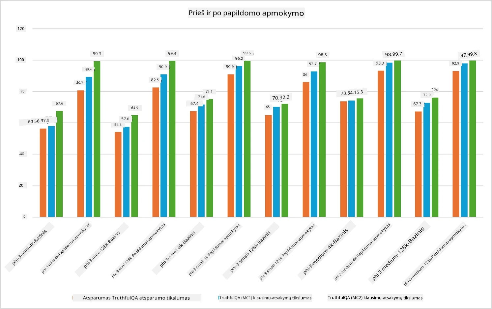

## Fine Tuninimo scenarijai

Šiame skyriuje pateikiama apžvalga apie fine tuninimo scenarijus Microsoft Foundry ir Azure aplinkose, įskaitant diegimo modelius, infrastruktūros sluoksnius ir dažniausiai naudojamas optimizavimo technikas.

**Platforma**  
Tai apima valdomas paslaugas, tokias kaip Microsoft Foundry (anksčiau Azure AI Foundry) ir Azure Machine Learning, kurios teikia modelių valdymą, orkestraciją, eksperimentų sekimą ir diegimo darbo eigos.

**Infrastruktūra**  
Fine tuninimui reikalingi mastelį keičiantys skaičiavimo ištekliai. Azure aplinkose tai paprastai apima GPU pagrindu veikiantias virtualias mašinas ir CPU išteklius lengvoms užduotims, taip pat mastelį keičiantį saugojimą duomenų rinkiniams ir patikros taškams.

**Įrankiai ir karkasai**  
Fine tuninimo darbo eigos dažnai remiasi tokiomis karkasų ir optimizavimo bibliotekomis kaip Hugging Face Transformers, DeepSpeed ir PEFT (Parametrų efektyvus fine tuningas).

Fine tuninimo procesas su Microsoft technologijomis apima platformos paslaugas, skaičiavimo infrastruktūrą ir treniravimo karkasus. Suprasdami, kaip šios dalys veikia kartu, kūrėjai gali efektyviai pritaikyti pagrindinius modelius specifinėms užduotims ir gamybos scenarijams.

## Modelis kaip paslauga

Fine tuninkite modelį naudodami talpinamą fine tuninimą, nereikalaujant kurti ir valdyti skaičiavimo resursų.

Serverless fine tuninimas dabar prieinamas Phi-3, Phi-3.5 ir Phi-4 modelių šeimoms, leidžiantis kūrėjams greitai ir lengvai pritaikyti modelius debesies ir edge scenarijams, nereikalaujant organizuoti skaičiavimo.

## Modelis kaip platforma

Vartotojai valdo savo skaičiavimo resursus, kad galėtų fine tuninti savo modelius.

[Fine Tuninimo pavyzdys](https://github.com/Azure/azureml-examples/blob/main/sdk/python/foundation-models/system/finetune/chat-completion/chat-completion.ipynb)

## Fine Tuninimo technikų palyginimas

|Scenarijus|LoRA|QLoRA|PEFT|DeepSpeed|ZeRO|DoRA|
|---|---|---|---|---|---|---|
|Iš anksto apmokytų LLM pritaikymas konkrečioms užduotims ar sritims|Taip|Taip|Taip|Taip|Taip|Taip|
|Fine tuninimas NLP užduotims, tokioms kaip teksto klasifikavimas, vardinių vienetų atpažinimas ir mašinų vertimas|Taip|Taip|Taip|Taip|Taip|Taip|
|Fine tuninimas QA užduotims|Taip|Taip|Taip|Taip|Taip|Taip|
|Fine tuninimas žmogiško pobūdžio atsakymams generuoti chatbotuose|Taip|Taip|Taip|Taip|Taip|Taip|
|Fine tuninimas muzikos, meno ar kitų kūrybinių formų generavimui|Taip|Taip|Taip|Taip|Taip|Taip|
|Skaičiavimo ir finansinių sąnaudų mažinimas|Taip|Taip|Taip|Taip|Taip|Taip|
|Atminties naudojimo mažinimas|Taip|Taip|Taip|Taip|Taip|Taip|
|Mažesnio parametrų kiekio naudojimas efektyviam fine tuninimui|Taip|Taip|Taip|Ne|Ne|Taip|
|Atminties efektyvi duomenų paralelizmo forma, leidžianti pasiekti bendrą visų GPU įrenginių atmintį|Ne|Ne|Ne|Taip|Taip|Ne|

> [!NOTE]
> LoRA, QLoRA, PEFT ir DoRA yra parametrų efektyvios fine tuninimo metodikos, o DeepSpeed ir ZeRO orientuojasi į paskirstytą treniravimą ir atminties optimizavimą.

## Fine Tuninimo našumo pavyzdžiai

---

<!-- CO-OP TRANSLATOR DISCLAIMER START -->
**Atsakomybės apribojimas**:
Šis dokumentas buvo išverstas naudojant dirbtinio intelekto vertimo paslaugą [Co-op Translator](https://github.com/Azure/co-op-translator). Nors siekiame tikslumo, prašome atkreipti dėmesį, kad automatiniai vertimai gali turėti klaidų ar netikslumų. Originalus dokumentas gimtąja kalba turėtų būti laikomas autoritetingu šaltiniu. Kritinei informacijai rekomenduojamas profesionalus žmogaus vertimas. Mes neatsakome už bet kokius nesusipratimus ar neteisingą interpretaciją, kylančią naudojant šį vertimą.
<!-- CO-OP TRANSLATOR DISCLAIMER END -->