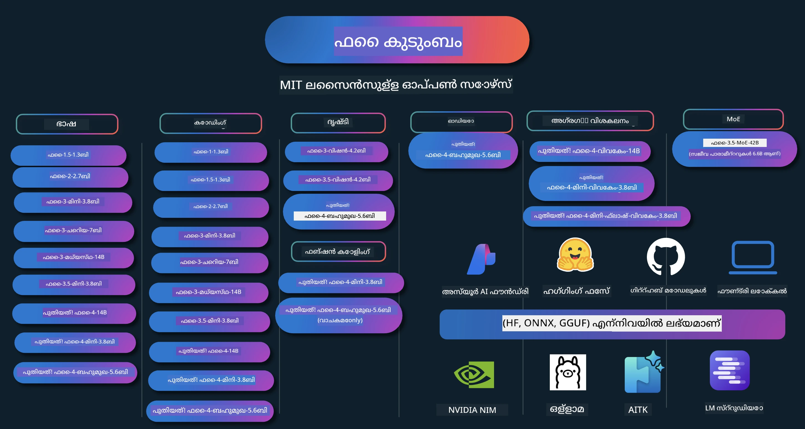

# ഫി കൂക്ക് ബുക്ക്: മൈക്രോസോഫ്റ്റിന്റെ Phi മോഡലുകൾ ഉപയോഗിച്ച് കൈകാര്യം ചെയ്യുന്ന ഉദാഹരണങ്ങൾ

[](https://codespaces.new/microsoft/phicookbook)
[](https://vscode.dev/redirect?url=vscode://ms-vscode-remote.remote-containers/cloneInVolume?url=https://github.com/microsoft/phicookbook)

[](https://GitHub.com/microsoft/phicookbook/graphs/contributors/?WT.mc_id=aiml-137032-kinfeylo)
[](https://GitHub.com/microsoft/phicookbook/issues/?WT.mc_id=aiml-137032-kinfeylo)
[](https://GitHub.com/microsoft/phicookbook/pulls/?WT.mc_id=aiml-137032-kinfeylo)
[](http://makeapullrequest.com?WT.mc_id=aiml-137032-kinfeylo)

[](https://GitHub.com/microsoft/phicookbook/watchers/?WT.mc_id=aiml-137032-kinfeylo)
[](https://GitHub.com/microsoft/phicookbook/network/?WT.mc_id=aiml-137032-kinfeylo)
[](https://GitHub.com/microsoft/phicookbook/stargazers/?WT.mc_id=aiml-137032-kinfeylo)

[](https://discord.com/invite/ByRwuEEgH4)

Phi മൈക്രോസോഫ്റ്റ് വികസിപ്പിച്ചെടുത്ത ഒരു ഓപ്പൺ സോഴ്സ് AI മോഡലുകളുടെ പരമ്പരയാണ്.

Phi ഇപ്പോൾ ഏറ്റവും ശക്തിയും ചെലവുകുറവുമായ ചെറിയ ഭാഷ മോഡലാണ് (SLM), ബഹुभാഷ, വാദം, ടെക്സ്റ്റ്/ചാറ്റ് ഉല്പാദനം, കോഡിംഗ്, ചിത്രങ്ങൾ, ഓഡിയോ എന്നിവയിലും ബഹുതല സമർത്ഥതകളും വരുന്നു.

Phi ക്ളൗഡിലോ എഡ്ജ് ഡിവൈസുകളിലോ വിന്യസിക്കാവുന്നതാണ്, കൂടാതെ പരിമിതമായ കമ്പ്യൂട്ടിംഗ് ശക്തിയുമായി സൃഷ്ടിമാന AI പ്രയോഗങ്ങൾ എളുപ്പത്തിൽ നിർമ്മിക്കാം.

ഈ സ്രോതസുകൾ ഉപയോഗിച്ച് തുടങ്ങാൻ ഈ ചുവടുകൾ പിന്തുടരുക:
1. **റിപ്പോസിറ്ററി ഫോർക്കുചെയ്യുക**: ക്ലിക്ക് ചെയ്യുക [](https://GitHub.com/microsoft/phicookbook/network/?WT.mc_id=aiml-137032-kinfeylo)
2. **റിപ്പോസിറ്ററി ക്ലോൺ ചെയ്യുക**:   `git clone https://github.com/microsoft/PhiCookBook.git`
3. [**Microsoft AI Discord കമ്മ്യൂണിറ്റിയിൽ ചേരുക, വിദഗ്ധരും fellow ഡവലപ്പർമാരും കാണുക**](https://discord.com/invite/ByRwuEEgH4?WT.mc_id=aiml-137032-kinfeylo)



### 🌐 ബഹുഭാഷാ പിന്തുണ

#### GitHub ആക്ഷൻ മുഖേന പിന്തുണ (സ്വയം പ്രവർത്തിക്കുന്നതും എല്ലായ്പ്പോഴും പുതുക്കപ്പെട്ടതും)

<!-- CO-OP TRANSLATOR LANGUAGES TABLE START -->
[അറബിക്](../ar/README.md) | [ബംഗാളി](../bn/README.md) | [ബൾഗേറിയൻ](../bg/README.md) | [ബർമീസ് (മ്യാന്മാർ)](../my/README.md) | [ചൈനീസ് (സിംപ്ലിഫൈഡ്)](../zh-CN/README.md) | [ചൈനീസ് (ട്രഡിഷണൽ, ഹോങ്കോങ്)](../zh-HK/README.md) | [ചൈനീസ് (ട്രഡിഷണൽ, മകം)](../zh-MO/README.md) | [ചൈനീസ് (ട്രഡിഷണൽ, തായ്‌വാൻ)](../zh-TW/README.md) | [ക്രൊയിഷിയൻ](../hr/README.md) | [ചെക്ക്](../cs/README.md) | [ഡാനിഷ്](../da/README.md) | [ഡച്ച്](../nl/README.md) | [എസ്റ്റോണിയൻ](../et/README.md) | [ഫിന്നിഷ്](../fi/README.md) | [ഫ്രഞ്ച്](../fr/README.md) | [ജർമ്മൻ](../de/README.md) | [ഗ്രീക്ക്](../el/README.md) | [ഹെബ്രു](../he/README.md) | [ഹിന്ദി](../hi/README.md) | [ഹംഗേറിയൻ](../hu/README.md) | [ഇന്ത്യനേഷ്യൻ](../id/README.md) | [ഇറ്റാലിയൻ](../it/README.md) | [ജാപ്പനീസ്](../ja/README.md) | [കന്നട](../kn/README.md) | [കൊറിയൻ](../ko/README.md) | [ലിത്വനിയൻ](../lt/README.md) | [മലയാളം](./README.md) | [മരാത്തി](../mr/README.md) | [നെപ്പാളി](../ne/README.md) | [നൈജീരിയൻ പിഡ്ജിൻ](../pcm/README.md) | [നോർവീജിയൻ](../no/README.md) | [പേഴ്ഷ്യൻ (ഫാർസി)](../fa/README.md) | [പോളിഷ്](../pl/README.md) | [പോർച്ചുഗീസ് (ബ്രസീൽ)](../pt-BR/README.md) | [പോർച്ചുഗീസ് (പോർച്ചുഗൾ)](../pt-PT/README.md) | [പഞ്ചാബി (ഗുർമുഖി)](../pa/README.md) | [റൊമേനിയൻ](../ro/README.md) | [റഷ്യൻ](../ru/README.md) | [സെർബിയൻ (സിരിലിക്)](../sr/README.md) | [സ്ലോവാക്](../sk/README.md) | [സ്ലോവേനിയൻ](../sl/README.md) | [സ്പാനിഷ്](../es/README.md) | [സ്വാഹിലി](../sw/README.md) | [സ്വീഡിഷ്](../sv/README.md) | [തഗാലോഗ് (ഫിലിപ്പിനോ)](../tl/README.md) | [തമിഴ്](../ta/README.md) | [തെലുങ്ക്](../te/README.md) | [തായ്](../th/README.md) | [ടർക്കിഷ്](../tr/README.md) | [ഉക്രെയ്നിയൻ](../uk/README.md) | [ഉർദു](../ur/README.md) | [വിയറ്റ്നാമീസ്](../vi/README.md)

> **ലോകലായി ക്ലോൺ ചെയ്യാൻ ഇഷ്ടപ്പെടുന്നുണ്ടോ?**

> ഈ റപ്പോസിറ്ററിയിൽ 50+ ഭാഷാ വിവർത്തനങ്ങൾ ഉൾക്കൊള്ളുന്നു, ഇത് ഡൗൺലോഡ് വലുപ്പം വലിയതാക്കുന്നു. വിവർത്തനങ്ങൾ കൂടാതെ ക്ലോൺ ചെയ്യാൻ sparse checkout ഉപയോഗിക്കുക:
> ```bash
> git clone --filter=blob:none --sparse https://github.com/microsoft/PhiCookBook.git
> cd PhiCookBook
> git sparse-checkout set --no-cone '/*' '!translations' '!translated_images'
> ```
> ഇത് കോഴ്‌സ് പൂർത്തിയാക്കാനായി നിങ്ങൾക്ക് ആവശ്യമായ എല്ലാം വളരെ വേഗത്തിൽ ഡൗൺലോഡ് ചെയ്യാൻ സഹായിക്കും.
<!-- CO-OP TRANSLATOR LANGUAGES TABLE END -->

## ഉള്ളടക്ക പട്ടിക

- വിവാഹാരംഭം
  - [Phi കുടുംബത്തിലേക്ക് സ്വാഗതം](./md/01.Introduction/01/01.PhiFamily.md)
  - [നിങ്ങളുടെ പരിസ്ഥിതി ക്രമീകരിക്കുന്നു](./md/01.Introduction/01/01.EnvironmentSetup.md)
  - [പ്രധാന സാങ്കേതികവിദ്യകൾ മനസ്സിലാക്കൽ](./md/01.Introduction/01/01.Understandingtech.md)
  - [Phi മോഡലുകൾക്കായുള്ള AI സുരക്ഷ](./md/01.Introduction/01/01.AISafety.md)
  - [Phi ഹാർഡ്‌വെയർ പിന്തുണ](./md/01.Introduction/01/01.Hardwaresupport.md)
  - [Phi മോഡലുകളും പ്ലാറ്റ്‌ഫോമുകളിൽ ലഭ്യത](./md/01.Introduction/01/01.Edgeandcloud.md)
  - [Guidance-aiയും Phiഉം ഉപയോഗിക്കുന്നത്](./md/01.Introduction/01/01.Guidance.md)
  - [GitHub മാര്‍ക്കറ്റ് പ്ലേസ് മോഡലുകൾ](https://github.com/marketplace/models)
  - [Azure AI മോഡൽ കാറ്റലോഗ്](https://ai.azure.com)

- വ്യത്യസ്ത പരിസ്ഥിതികളിൽ Phi inference
    -  [Hugging face](./md/01.Introduction/02/01.HF.md)
    -  [GitHub മോഡലുകൾ](./md/01.Introduction/02/02.GitHubModel.md)
    -  [Azure AI Foundry മോഡൽ കാറ്റലോഗ്](./md/01.Introduction/02/03.AzureAIFoundry.md)
    -  [Ollama](./md/01.Introduction/02/04.Ollama.md)
    -  [AI ടൂൾകിറ്റ് VSCode (AITK)](./md/01.Introduction/02/05.AITK.md)
    -  [NVIDIA NIM](./md/01.Introduction/02/06.NVIDIA.md)
    -  [Foundry Local](./md/01.Introduction/02/07.FoundryLocal.md)

- Phi കുടുംബത്തിലെ ഇൻഫറൻസ്
    - [iOS-ൽ Phi ഇൻഫറൻസ്](./md/01.Introduction/03/iOS_Inference.md)
    - [Android-ൽ Phi ഇൻഫറൻസ്](./md/01.Introduction/03/Android_Inference.md)
    - [ജെറ്റ്സണിൽ Phi ഇൻഫറൻസ്](./md/01.Introduction/03/Jetson_Inference.md)
    - [AI പിസിയിൽ Phi ഇൻഫറൻസ്](./md/01.Introduction/03/AIPC_Inference.md)
    - [ആപ്പിൾ MLX ഫ്രെയിംവർക്കുമായി Phi ഇൻഫറൻസ്](./md/01.Introduction/03/MLX_Inference.md)
    - [ലൊക്കൽ സെർവറിൽ Phi ഇൻഫറൻസ്](./md/01.Introduction/03/Local_Server_Inference.md)
    - [AI ടൂൾകിറ്റ് ഉപയോഗിച്ച് ദൂരസർവറിൽ Phi ഇൻഫറൻസ്](./md/01.Introduction/03/Remote_Interence.md)
    - [റസ്റ്റ് ഉപയോഗിച്ച് Phi ഇൻഫറൻസ്](./md/01.Introduction/03/Rust_Inference.md)
    - [ലൊക്കലിൽ Phi-വിഷൻ ഇൻഫറൻസ്](./md/01.Introduction/03/Vision_Inference.md)
    - [കൈറ്റോ AKS, Azure കണ്ടെയ്‌നറുകൾ (ഔദ്യോഗിക പിന്തുണ) ഉപയോഗിച്ച് Phi ഇൻഫറൻസ്](./md/01.Introduction/03/Kaito_Inference.md)
-  [Phi കുടുംബം ക്വാണ്ടിഫൈ ചെയ്യുന്നു](./md/01.Introduction/04/QuantifyingPhi.md)
    - [llama.cpp ഉപയോഗിച്ച് Phi-3.5 / 4 ക്വാണ്ടൈസ് ചെയ്യുന്നു](./md/01.Introduction/04/UsingLlamacppQuantifyingPhi.md)
    - [onnxruntime-നുള്ള ജനറേറ്റീവ് AI വിപുലീകരണങ്ങൾ ഉപയോഗിച്ച് Phi-3.5 / 4 ക്വാണ്ടൈസ് ചെയ്യുന്നു](./md/01.Introduction/04/UsingORTGenAIQuantifyingPhi.md)
    - [Intel OpenVINO ഉപയോഗിച്ച് Phi-3.5 / 4 ക്വാണ്ടൈസ് ചെയ്യുന്നു](./md/01.Introduction/04/UsingIntelOpenVINOQuantifyingPhi.md)
    - [ആപ്പിൾ MLX ഫ്രെയിംവർക്കിലൂടെ Phi-3.5 / 4 ക്വാണ്ടൈസ് ചെയ്യുന്നു](./md/01.Introduction/04/UsingAppleMLXQuantifyingPhi.md)

-  Phi വിലയിരുത്തൽ
    - [നേരിലുള്ള AI](./md/01.Introduction/05/ResponsibleAI.md)
    - [വിലയിരുത്തലിനു Azure AI Foundry](./md/01.Introduction/05/AIFoundry.md)
    - [വിലയിരുത്തലിനായി പ്രോംപ്റ്റ്‌ഫ്ലോ ഉപയോഗിക്കൽ](./md/01.Introduction/05/Promptflow.md)
 
- Azure AI سرچ ഉപയോഗിച്ച് RAG
    - [Phi-4-mini, Phi-4-multimodal (RAG) Azure AI سرچ ഉപയോഗിച്ച് എങ്ങനെ ഉപയോഗിക്കണം](https://github.com/microsoft/PhiCookBook/blob/main/code/06.E2E/E2E_Phi-4-RAG-Azure-AI-Search.ipynb)

- Phi അപ്ലിക്കേഷൻ വികസന സാമ്പിളുകൾ
  - ടെക്സ്റ്റ് & ചാറ്റ് അപ്ലിക്കേഷനുകൾ
    - Phi-4 സാമ്പിളുകൾ 🆕
      - [📓] [Phi-4-mini ONNX മോഡലുമായി ചാറ്റ്](./md/02.Application/01.TextAndChat/Phi4/ChatWithPhi4ONNX/README.md)
      - [Phi-4 ലൊക്കൽ ONNX മോഡൽ .NET-ൽ ചാറ്റ്](../../md/04.HOL/dotnet/src/LabsPhi4-Chat-01OnnxRuntime)
      - [ഫി-4 ONNX ഉപയോഗിച്ച് സെമാന്റിക് കർണൽ ഉപയോഗിച്ചുള്ള .NET കൺസോൾ ആപ്പ് ചാറ്റ്](../../md/04.HOL/dotnet/src/LabsPhi4-Chat-02SK)
    - Phi-3 / 3.5 സാമ്പിളുകൾ
      - [Phi3, ONNX റൺടൈം വെബ്, വെബ്GPU ഉപയോഗിച്ച് ബ്രൗസറിൽ ലോക്കൽ ചാറ്റ്ബോട്ട്](https://github.com/microsoft/onnxruntime-inference-examples/tree/main/js/chat)
      - [OpenVino ചാറ്റ്](./md/02.Application/01.TextAndChat/Phi3/E2E_OpenVino_Chat.md)
      - [മൾട്ടി മോഡൽ - ഇൻറ്ററാക്ടീവ് ഫൈ-3-മിനി & ഓപ്പൺഎഐ വിഷ്പർ](./md/02.Application/01.TextAndChat/Phi3/E2E_Phi-3-mini_with_whisper.md)
      - [MLFlow - റാപ്പർ നിർമ്മാണവും ഫൈ-3 MLFlow ഉപയോഗവും](./md//02.Application/01.TextAndChat/Phi3/E2E_Phi-3-MLflow.md)
      - [മോഡൽ ഓപ്റ്റിമൈസേഷൻ - ഒൺനക്സ് റൺടൈം വെബിനായി ഫൈ-3-മിനി മോഡൽ ഓപ്റ്റിമൈസ് ചെയ്യുന്നതിനുള്ള മാർഗങ്ങൾ Olive ഉപയോഗിച്ച്](https://github.com/microsoft/Olive/tree/main/examples/phi3)
      - [WinUI3 ആപ്പ് ഫൈ-3 മിനി-4k-ഇൻസ്ട്രക്റ്റ്-onnx ഉപയോഗിച്ച്](https://github.com/microsoft/Phi3-Chat-WinUI3-Sample/)
      -[WinUI3 മൾട്ടി മോഡൽ എഐ പവർഡ് നോറ്റ്സ് ആപ്പ് സാമ്പിൾ](https://github.com/microsoft/ai-powered-notes-winui3-sample)
      - [ഫൈൻ-ട്യൂൺ ചെയ്ത് കസ്റ്റം ഫൈ-3 മോഡലുകൾ പ്രോംപ്റ്റ് ഫ്ലോയുമായി ഇന്റഗ്രേറ്റ് ചെയ്യുക](./md/02.Application/01.TextAndChat/Phi3/E2E_Phi-3-FineTuning_PromptFlow_Integration.md)
      - [ഫൈൻ-ട്യൂൺ ചെയ്ത് കസ്റ്റം ഫൈ-3 മോഡലുകൾ ആസ്യൂർ എഐ ഫൗണ്ടറിയിലുള്ള പ്രോംപ്റ്റ് ഫ്ലോയുമായി ഇന്റഗ്രേറ്റ് ചെയ്യുക](./md/02.Application/01.TextAndChat/Phi3/E2E_Phi-3-FineTuning_PromptFlow_Integration_AIFoundry.md)
      - [മൈക്രോസോഫ്റ്റിന്റെ ഉത്തരവാദിത്വമുള്ള എഐ സിദ്ധാന്തങ്ങളെ കേന്ദ്രീകരിച്ച് ആസ്യൂർ എഐ ഫൗണ്ടറിയിലെ ഫൈൻ-ട്യൂൺ ചെയ്ത ഫൈ-3 / ഫൈ-3.5 മോഡൽ വിലയിരുത്തുക](./md/02.Application/01.TextAndChat/Phi3/E2E_Phi-3-Evaluation_AIFoundry.md)
      - [📓] [ഫൈ-3.5-മിനി-ഇൻസ്ട്രക്ട് ഭാഷാ പ്രവചന സാമ്പിൾ (ചൈനീസ്/ഇംഗ്ലീഷ്)](./md/02.Application/01.TextAndChat/Phi3/phi3-instruct-demo.ipynb)
      - [ഫൈ-3.5-ഇൻസ്ട്രക്ട് WebGPU RAG ചാറ്റ്ബോട്ട്](./md/02.Application/01.TextAndChat/Phi3/WebGPUWithPhi35Readme.md)
      - [Windows GPU ഉപയോഗിച്ച് പ്രോംപ്റ്റ് ഫ്ലോ സൊല്യൂഷൻ ഉണ്ടാക്കുക Phi-3.5-ഇൻസ്ട്രക്ട് ONNX ഉപയോഗിച്ച്](./md/02.Application/01.TextAndChat/Phi3/UsingPromptFlowWithONNX.md)
      - [മൈക്രോസോഫ്റ്റ് ഫൈ-3.5 tflite ഉപയോഗിച്ച് ആൻഡ്രോയിഡ് ആപ്പ് സൃഷ്ടിക്കുക](./md/02.Application/01.TextAndChat/Phi3/UsingPhi35TFLiteCreateAndroidApp.md)
      - [Q&A .NET ഉദാഹരണം Microsoft.ML.OnnxRuntime ഉപയോഗിച്ച് ലൊക്കൽ ONNX Phi-3 മോഡൽ ഉപയോഗിച്ച്](../../md/04.HOL/dotnet/src/LabsPhi301)
      - [Semantic Kernel & Phi-3 ഉള്ള കൺസോൾ ചാറ്റ് .NET ആപ്പ്](../../md/04.HOL/dotnet/src/LabsPhi302)

  - Azure AI ഉപയോഗിച്ചുള്ള ഇൻഫെറെൻസ് SDK കോഡ് അടിസ്ഥാന സാമ്പിൾസ് 
    - Phi-4 സാമ്പിൾസ് 🆕
      - [📓] [Phi-4-multimodal ഉപയോഗിച്ച് പ്രോജക്ട് കോഡ് ജനറേറ്റു ചെയ്യുക](./md/02.Application/02.Code/Phi4/GenProjectCode/README.md)
    - Phi-3 / 3.5 സാമ്പിൾസ്
      - [സ്വന്തം Visual Studio Code GitHub Copilot Chat Microsoft Phi-3 ഫാമിലി ഉപയോഗിച്ച് നിർമ്മിക്കുക](./md/02.Application/02.Code/Phi3/VSCodeExt/README.md)
      - [GitHub മോഡലുകളുമായി Phi-3.5 ഉപയോഗിച്ച് Visual Studio Code Chat Copilot ഏജന്റ് സൃഷ്ടിക്കുക](/md/02.Application/02.Code/Phi3/CreateVSCodeChatAgentWithGitHubModels.md)

  - അഡ്വാൻസ്ഡ് റീസണിംഗ് സാമ്പിൾസ്
    - Phi-4 സാമ്പിൾസ് 🆕
      - [📓] [Phi-4-മിനി-റിയാസണിംഗ് അല്ലെങ്കിൽ Phi-4-റിയാസണിംഗ് സാമ്പിൾസ്](./md/02.Application/03.AdvancedReasoning/Phi4/AdvancedResoningPhi4mini/README.md)
      - [📓] [Microsoft Olive ഉപയോഗിച്ച് Phi-4-മിനി-റിയാസണിംഗ് ഫൈൻ-ട്യൂൺ ചെയ്യുക](./md/02.Application/03.AdvancedReasoning/Phi4/AdvancedResoningPhi4mini/olive_ft_phi_4_reasoning_with_medicaldata.ipynb)
      - [📓] [Apple MLX ഉപയോഗിച്ച് Phi-4-മിനി-റിയാസണിംഗ് ഫൈൻ-ട്യൂൺ](./md/02.Application/03.AdvancedReasoning/Phi4/AdvancedResoningPhi4mini/mlx_ft_phi_4_reasoning_with_medicaldata.ipynb)
      - [📓] [GitHub മോഡലുകളുമായി Phi-4-മിനി-റിയാസണിംഗ്](./md/02.Application/02.Code/Phi4r/github_models_inference.ipynb)
      - [📓] [ആസ്യൂർ എഐ ഫൗണ്ടറി മോഡലുകളുമായി Phi-4-മിനി-റിയാസണിംഗ്](./md/02.Application/02.Code/Phi4r/azure_models_inference.ipynb)
  - ഡെമോസ്
      - [Phi-4-മിനി ഡെമോകൾ Hugging Face സ്പേസുകളിൽ ഹോസ്റ്റ് ചെയ്തിരിക്കുന്നത്](https://huggingface.co/spaces/microsoft/phi-4-mini?WT.mc_id=aiml-137032-kinfeylo)
      - [Phi-4-മൾട്ടിമോഡൽ ഡെമോകൾ Hugginge Face സ്പേസുകളിൽ ഹോസ്റ്റ്](https://huggingface.co/spaces/microsoft/phi-4-multimodal?WT.mc_id=aiml-137032-kinfeylo)
  - വിഷൻ സാമ്പിൾസ്
    - Phi-4 സാമ്പിൾസ് 🆕
      - [📓] [Phi-4-multimodal ഉപയോഗിച്ച് ചിത്രങ്ങൾ വായിച്ച് കോഡ് ജനറേറ്റ് ചെയ്യുക](./md/02.Application/04.Vision/Phi4/CreateFrontend/README.md) 
    - Phi-3 / 3.5 സാമ്പിൾസ്
      -  [📓][Phi-3-vision-ചിത്രം എഴുത്തിൽ മാറ്റൽ](./md/02.Application/04.Vision/Phi3/E2E_Phi-3-vision-image-text-to-text-online-endpoint.ipynb)
      - [Phi-3-vision-ONNX](https://onnxruntime.ai/docs/genai/tutorials/phi3-v.html)
      - [📓][Phi-3-vision CLIP എൻബെഡിംഗ്](./md/02.Application/04.Vision/Phi3/E2E_Phi-3-vision-image-text-to-text-online-endpoint.ipynb)
      - [ഡെമോ: Phi-3 റിസൈക്ലിംഗ്](https://github.com/jennifermarsman/PhiRecycling/)
      - [Phi-3-vision - വിഷ്വൽ ഭാഷാ അസിസ്റ്റന്റ് - Phi3-വിഷൻ & ഓപ്പൺവിനോ ഉപയോഗിച്ച്](https://docs.openvino.ai/nightly/notebooks/phi-3-vision-with-output.html)
      - [Phi-3 വിഷൻ Nvidia NIM](./md/02.Application/04.Vision/Phi3/E2E_Nvidia_NIM_Vision.md)
      - [Phi-3 വിഷൻ OpenVino](./md/02.Application/04.Vision/Phi3/E2E_OpenVino_Phi3Vision.md)
      - [📓][Phi-3.5 വിഷൻ മൾട്ടി-ഫ്രെയിം അല്ലെങ്കിൽ മൾട്ടി-ഇമേജ് സാമ്പിൾ](./md/02.Application/04.Vision/Phi3/phi3-vision-demo.ipynb)
      - [Microsoft.ML.OnnxRuntime .NET ഉപയോഗിച്ച് Phi-3 വിഷൻ ലോക്കൽ ONNX മോഡൽ](../../md/04.HOL/dotnet/src/LabsPhi303)
      - [മെനു അടിസ്ഥാന Phi-3 വിഷൻ ലോക്കൽ ONNX മോഡൽ Microsoft.ML.OnnxRuntime .NET ഉപയോഗിച്ച്](../../md/04.HOL/dotnet/src/LabsPhi304)

  - ഗണിത ശാസ്ത്രം സാമ്പിൾസ്
    -  Phi-4-മിനി-ഫ്ലാഷ്-റിയാസണിംഗ്-ഇൻസ്ട്രക്റ്റ് സാമ്പിൾസ് 🆕 [ഫൈ-4-മിനി-ഫ്ലാഷ്-റിയാസണിംഗ്-ഇൻസ്ട്രക്റ്റ് ഗണിത ഡെമോ](./md/02.Application/09.Math/MathDemo.ipynb)

  - ഓഡിയോ സാമ്പിൾസ്
    - Phi-4 സാമ്പിൾസ് 🆕
      - [📓] [Phi-4-multimodal ഉപയോഗിച്ച് ഓഡിയോ ട്രാൻസ്ക്രിപ്റ്റുകൾ എക്സ്ട്രാക്ട് ചെയ്യുക](./md/02.Application/05.Audio/Phi4/Transciption/README.md)
      - [📓] [Phi-4-multimodal ഓഡിയോ സാമ്പിൾ](./md/02.Application/05.Audio/Phi4/Siri/demo.ipynb)
      - [📓] [Phi-4-multimodal സ്പീച്ച് ട്രാൻസ്ലേഷൻ സാമ്പിൾ](./md/02.Application/05.Audio/Phi4/Translate/demo.ipynb)
      - [.NET കൺസോൾ ആപ്ലിക്കേഷൻ Phi-4-multimodal ഓഡിയോ ഉപയോഗിച്ച് ഓഡിയോ ഫയൽ വിശകലനം ചെയ്ത് ട്രാൻസ്ക്രിപ്റ്റ് ജനറേറ്റ് ചെയ്യുന്നു](../../md/04.HOL/dotnet/src/LabsPhi4-MultiModal-02Audio)

  - MOE സാമ്പിൾസ്
    - Phi-3 / 3.5 സാമ്പിൾസ്
      - [📓] [Phi-3.5 എംഐക്ചർ ഓഫ് എക്സ്പേർട്‌സ് മോഡലുകൾ (MoEs) സോഷ്യൽ മീഡിയ സാമ്പിൾ](./md/02.Application/06.MoE/Phi3/phi3_moe_demo.ipynb)
      - [📓] [Retrieval-Augmented Generation (RAG) പൈപ്പ്‌ലൈൻ NVIDIA NIM Phi-3 MOE, ആസ്യൂർ എഐ സർച്ച്, & LlamaIndex ഉപയോഗിച്ച് നിർമ്മിക്കുന്നു](./md/02.Application/06.MoE/Phi3/azure-ai-search-nvidia-rag.ipynb)
      - 
  - ഫംഗ്ഷൻ കോളിംഗ് സാമ്പിൾസ്
    - Phi-4 സാമ്പിൾസ് 🆕
      -  [📓] [Phi-4-മിനി ഉപയോഗിച്ച് ഫംഗ്ഷൻ കോളിംഗ് ഉപയോഗിക്കുന്നത്](./md/02.Application/07.FunctionCalling/Phi4/FunctionCallingBasic/README.md)
      -  [📓] [ഫംഗ്ഷൻ കോളിംഗ് ഉപയോഗിച്ച് മൾട്ടീ-ഏജന്റുകൾ സൃഷ്ടിക്കുന്നത് Phi-4-മിനി ഉപയോഗിച്ച്](./md/02.Application/07.FunctionCalling/Phi4/Multiagents/Phi_4_mini_multiagent.ipynb)
      -  [📓] [ഓല്ലാമയുമായി ഫംഗ്ഷൻ കോളിംഗ് ഉപയോഗിക്കുന്നത്](./md/02.Application/07.FunctionCalling/Phi4/Ollama/ollama_functioncalling.ipynb)
      -  [📓] [ONNX ഉപയോഗിച്ച് ഫംഗ്ഷൻ കോളിംഗ് ഉപയോഗിക്കുന്നത്](./md/02.Application/07.FunctionCalling/Phi4/ONNX/onnx_parallel_functioncalling.ipynb)
  - മൾട്ടിമോഡൽ മിക്സിംഗ് സാമ്പിൾസ്
    - Phi-4 സാമ്പിൾസ് 🆕
      -  [📓] [ടെക്നോളജി ജേർണലിസ്റ്ട് ആയി Phi-4-multimodal ഉപയോഗിക്കുന്നത്](./md/02.Application/08.Multimodel/Phi4/TechJournalist/phi_4_mm_audio_text_publish_news.ipynb)
      - [.NET കൺസോൾ ആപ്പ് Phi-4-multimodal ഉപയോഗിച്ച് ചിത്രങ്ങൾ വിശകലനം ചെയ്യുന്നു](../../md/04.HOL/dotnet/src/LabsPhi4-MultiModal-01Images)

- ഫൈൻ-ട്യൂണിംഗ് ഫൈ സാമ്പിൾസ്
  - [ഫൈൻ-ട്യൂണിംഗ് സീനാരിയോസ്](./md/03.FineTuning/FineTuning_Scenarios.md)
  - [ഫൈൻ-ട്യൂണിംഗ് vs RAG](./md/03.FineTuning/FineTuning_vs_RAG.md)
  - [ഫൈ-3 വ്യവസായ വിദഗ്ധനായി മാറ്റുക](./md/03.FineTuning/LetPhi3gotoIndustriy.md)
  - [ഫൈ-3 AI ടൂള്കിറ്റ് VS കോഡ് ഉപയോഗിച്ച് ഫൈൻ-ട്യൂൺ ചെയ്യുക](./md/03.FineTuning/Finetuning_VSCodeaitoolkit.md)
  - [ഫൈ-3 ആസ്യൂർ മെഷീൻ لرണിംഗ് സേവനം ഉപയോഗിച്ച് ഫൈൻ-ട്യൂൺ ചെയ്യുക](./md/03.FineTuning/Introduce_AzureML.md)
  - [ഫൈ-3 ലോറ ഉപയോഗിച്ച് ഫൈൻ-ട്യൂൺ](./md/03.FineTuning/FineTuning_Lora.md)
  - [ഫൈ-3 QLora ഉപയോഗിച്ച് ഫൈൻ-ട്യൂൺ](./md/03.FineTuning/FineTuning_Qlora.md)
  - [ഫൈ-3 ആസ്യൂർ എഐ ഫൗണ്ടറിയിൽ ഫൈൻ-ട്യൂൺ](./md/03.FineTuning/FineTuning_AIFoundry.md)
  - [ഫൈ-3 ആസ്യൂർ ML CLI/SDK ഉപയോഗിച്ച് ഫൈൻ-ട്യൂൺ](./md/03.FineTuning/FineTuning_MLSDK.md)
  - [Microsoft Olive ഉപയോഗിച്ച് ഫൈൻ-ട്യൂൺ](./md/03.FineTuning/FineTuning_MicrosoftOlive.md)
  - [Microsoft Olive ഹാൻഡ്‌സ്-ഓൺ ലാബ് ഉപയോഗിച്ച് ഫൈൻ-ട്യൂൺ](./md/03.FineTuning/olive-lab/readme.md)
  - [Weights and Bias ഉപയോഗിച്ച് Phi-3-vision ഫൈൻ-ട്യൂൺ](./md/03.FineTuning/FineTuning_Phi-3-visionWandB.md)
  - [Apple MLX ഫ്രെയിംവർക്ക് ഉപയോഗിച്ച് Phi-3 ഫൈൻ-ട്യൂൺ](./md/03.FineTuning/FineTuning_MLX.md)
  - [Phi-3-vision ഫൈൻ-ട്യൂൺ (ഓഫീഷ്യൽ സപ്പോർട്ട്)](./md/03.FineTuning/FineTuning_Vision.md)
  - [Kaito AKS, ആസ്യൂർ കണ്ടെയ്നറുകൾ (ഓഫിഷ്യൽ സപ്പോർട്ട്) ഉപയോഗിച്ച് Phi-3 ഫൈൻ-ട്യൂൺ](./md/03.FineTuning/FineTuning_Kaito.md)
  - [Phi-3 & 3.5 Vision ഫൈൻ-ട്യൂൺ](https://github.com/2U1/Phi3-Vision-Finetune)

- ഹാൻഡ്സ് ഓൺ ലാബ്
  - [കട്ടിംഗ് എഡ്ജ് മോഡലുകൾ അന്വേഷിക്കൽ: LLMs, SLMs, ലോക്കൽ ഡെവലപ്‌മെന്റ് & മുകളിൽ](https://github.com/microsoft/aitour-exploring-cutting-edge-models)
  - [NLP ശേഷി അന്ളോക്ക് ചെയ്യുക: Microsoft Olive ഉപയോഗിച്ച് ഫൈൻ-ട്യൂണിംഗ്](https://github.com/azure/Ignite_FineTuning_workshop)

- അക്കാദമിക് റിസ്ർച്ച് പേപ്പർസ് & പ്രസിദ്ധീകരണങ്ങൾ
  - [പഠനപുസ്തകങ്ങൾ മാത്രം ആവശ്യമുള്ളത് II: phi-1.5 സാങ്കേതിക റിപ്പോർട്ട്](https://arxiv.org/abs/2309.05463)
  - [Phi-3 സാങ്കേതിക റിപ്പോർട്ട്: നിങ്ങളുടെ ഫോണിൽ തന്നെ പ്രവർത്തിക്കുന്ന വളരെ ശേഷിയുള്ള ഭാഷാ മോഡൽ](https://arxiv.org/abs/2404.14219)
  - [Phi-4 സാങ്കേതിക റിപ്പോർട്ട്](https://arxiv.org/abs/2412.08905)
  - [Phi-4-മിനി സാങ്കേതിക റിപ്പോർട്ട്: മിക്സ്ചർ-ഓഫ്-ലോറാസ് വഴി സങ്കുചിതമായി ശക്തമായ മൾട്ടിമോഡൽ ഭാഷാ മോഡലുകൾ](https://arxiv.org/abs/2503.01743)
  - [വാഹനത്തിൽ ഫങ്ഷൻ-കോൾ ചെയ്യുന്നതിനായി ചെറു ഭാഷാ മോഡലുകൾ ഓപ്ടിമൈസ് ചെയ്യൽ](https://arxiv.org/abs/2501.02342)
  - [(WhyPHI) ബഹുമുഖ ചോദ്യോത്തരത്തിനായി PHI-3 നു ഫൈൻ-ട്യൂണിംഗ്: രീതിശാസ്ത്രം, ഫലങ്ങൾ, വെല്ലുവിളികൾ](https://arxiv.org/abs/2501.01588)
  - [Phi-4-റീൻസണിംഗ് സാങ്കേതിക റിപ്പോർട്ട്](https://www.microsoft.com/en-us/research/wp-content/uploads/2025/04/phi_4_reasoning.pdf)
  - [Phi-4-മിനി-റീൻസണിംഗ് സാങ്കേതിക റിപ്പോർട്ട്](https://huggingface.co/microsoft/Phi-4-mini-reasoning/blob/main/Phi-4-Mini-Reasoning.pdf)

## Phi മോഡലുകൾ ഉപയോഗിച്ചുകൊണ്ടുള്ളത്

### Azure AI Foundry-യിൽ Phi

മൈക്രോസോഫ്റ്റ് Phi എങ്ങനെ ഉപയോഗിക്കാമെന്ന്, വിവിധ ഹാർഡ്വെയർ ഉപകരണങ്ങളിൽ എ2ഇ അടങ്ങിയ പരിഹാരങ്ങൾ എങ്ങനെ നിർമ്മിക്കാമെന്ന് പഠിക്കാം. നിങ്ങളെ പേടിപ്പിക്കാൻ Phi അനുഭവിക്കാൻ, മോഡലുകൾ ഉപയോഗിച്ച് കളിയിലേക്കു തുടങ്ങി നിങ്ങളുടെ സാഹചര്യങ്ങൾക്ക് അനുയോജ്യമായി Phi ഇഷ്ടാനുസൃതമാക്കാം [Azure AI Foundry Azure AI Model Catalog](https://aka.ms/phi3-azure-ai) ഉപയോഗിച്ച്. കൂടുതൽ അറിയാൻ [Azure AI Foundry-ൽ ആരംഭിക്കൽ](/md/02.QuickStart/AzureAIFoundry_QuickStart.md) വായിക്കൂ.

**പ്ലേഗ്രൗണ്ട്**  
ഓരോ മോഡലിനും സമർപ്പിത പ്ലേഗ്രൗണ്ട് സജ്ജീകരിച്ചിട്ടുണ്ട്, മോഡൽ പരിശോധിക്കാൻ [Azure AI Playground](https://aka.ms/try-phi3).

### GitHub മോഡലുകളിൽ Phi

മൈക്രോസോഫ്റ്റ് Phi എങ്ങനെ ഉപയോഗിക്കാമെന്ന്, വിവിധ ഹാർഡ്വെയർ ഉപകരണങ്ങളിൽ എ2ഇ പരിഹാരങ്ങൾ എങ്ങനെ നിർമ്മിക്കാമെന്ന് പഠിക്കാം. Phi അനുഭവിക്കാൻ, മോഡലുമായി കളിയിലേക്കു തുടങ്ങിയ ശേഷം നിങ്ങളുടെ സാഹചര്യങ്ങൾക്ക് അനുയോജ്യമായി Phi ഇഷ്ടാനുസൃതമാക്കാം [GitHub Model Catalog](https://github.com/marketplace/models?WT.mc_id=aiml-137032-kinfeylo) ഉപയോഗിച്ച്. കൂടുതൽ അറിയാൻ [GitHub Model Catalog-ൽ ആരംഭിക്കൽ](/md/02.QuickStart/GitHubModel_QuickStart.md) വായിക്കൂ.

**പ്ലേഗ്രൗണ്ട്**  
ഓരോ മോഡലിനും പരീക്ഷിക്കാൻ സമർപ്പിത [പ്ലേഗ്രൗണ്ട്](/md/02.QuickStart/GitHubModel_QuickStart.md) ഉണ്ട്.

### Hugging Face-ൽ Phi

മോഡൽ [Hugging Face-ൽ](https://huggingface.co/microsoft) കിട്ടും.

**പ്ലേഗ്രൗണ്ട്**  
[Hugging Chat പ്ലേഗ്രൗണ്ട്](https://huggingface.co/chat/models/microsoft/Phi-3-mini-4k-instruct)

## 🎒 മറ്റു കോഴ്‌സുകൾ

ഞങ്ങളുടെ ടീം മറ്റുചില കോഴ്‌സുകൾ തയ്യാറാക്കുന്നു! പരിശോധിക്കൂ:

<!-- CO-OP TRANSLATOR OTHER COURSES START -->
### LangChain
[](https://aka.ms/langchain4j-for-beginners)
[](https://aka.ms/langchainjs-for-beginners?WT.mc_id=m365-94501-dwahlin)
[](https://github.com/microsoft/langchain-for-beginners?WT.mc_id=m365-94501-dwahlin)
---

### Azure / Edge / MCP / ഏജന്റുകൾ  
[](https://github.com/microsoft/AZD-for-beginners?WT.mc_id=academic-105485-koreyst)  
[](https://github.com/microsoft/edgeai-for-beginners?WT.mc_id=academic-105485-koreyst)  
[](https://github.com/microsoft/mcp-for-beginners?WT.mc_id=academic-105485-koreyst)  
[](https://github.com/microsoft/ai-agents-for-beginners?WT.mc_id=academic-105485-koreyst)  

---

### സൃഷ്ടിമാനമായ AI സീരീസ്  
[](https://github.com/microsoft/generative-ai-for-beginners?WT.mc_id=academic-105485-koreyst)  
[-9333EA?style=for-the-badge&labelColor=E5E7EB&color=9333EA)](https://github.com/microsoft/Generative-AI-for-beginners-dotnet?WT.mc_id=academic-105485-koreyst)  
[-C084FC?style=for-the-badge&labelColor=E5E7EB&color=C084FC)](https://github.com/microsoft/generative-ai-for-beginners-java?WT.mc_id=academic-105485-koreyst)  
[-E879F9?style=for-the-badge&labelColor=E5E7EB&color=E879F9)](https://github.com/microsoft/generative-ai-with-javascript?WT.mc_id=academic-105485-koreyst)  

---

### കോർ ലേണിങ്  
[](https://aka.ms/ml-beginners?WT.mc_id=academic-105485-koreyst)  
[](https://aka.ms/datascience-beginners?WT.mc_id=academic-105485-koreyst)  
[](https://aka.ms/ai-beginners?WT.mc_id=academic-105485-koreyst)  
[](https://github.com/microsoft/Security-101?WT.mc_id=academic-96948-sayoung)  
[](https://aka.ms/webdev-beginners?WT.mc_id=academic-105485-koreyst)  
[](https://aka.ms/iot-beginners?WT.mc_id=academic-105485-koreyst)  
[](https://github.com/microsoft/xr-development-for-beginners?WT.mc_id=academic-105485-koreyst)  

---

### കോപൈലറ്റ് സീരീസ്  
[](https://aka.ms/GitHubCopilotAI?WT.mc_id=academic-105485-koreyst)  
[](https://github.com/microsoft/mastering-github-copilot-for-dotnet-csharp-developers?WT.mc_id=academic-105485-koreyst)  
[](https://github.com/microsoft/CopilotAdventures?WT.mc_id=academic-105485-koreyst)  
<!-- CO-OP TRANSLATOR OTHER COURSES END -->

## ഉത്തരവാദിത്വപൂർണ്ണമായ AI

മൈക്രോസോഫ്റ്റ്, ഉപഭോക്താക്കൾക്ക് നമ്മുടെ AI ഉത്പന്നങ്ങൾ ഉത്തരവാദിത്വപൂർണമായി ഉപയോഗിക്കാനായി സഹായിക്കുന്നതിനും, ഞങ്ങളുടെ പഠനങ്ങൾ പങ്കുവെക്കുന്നതിനും, Transparenecy Notes, Impact Assessments പോലുള്ള ഉപകരണങ്ങളിലൂടെ വിശ്വാസപരമായ പങ്കാളിത്തങ്ങൾ നിർമ്മിക്കുന്നതിനും പ്രതിബദ്ധമാണ്. ഈ വിഭവങ്ങൾ ഏറിയഞ്ചത്തിൽ [https://aka.ms/RAI](https://aka.ms/RAI) ലഭ്യമാണ്.  
മൈക്രോസോഫ്റ്റിന്റെ ഉത്തരവാദിത്വപൂർണ്ണ AI സമീപനം, ന്യായത, വിശ്വാസ്യത, സുരക്ഷ, സ്വകാര്യത, ഉൾക്കെട്ടി, പരദർശിത്വം, ഉത്തരവാദിത്വം എന്നീ AI സിദ്ധാന്തങ്ങളിൽ അടിസ്ഥാനമാക്കിയതാണ്.

വലിയ തോതിലുള്ള സ്വാഭാവിക ഭാഷ, രൂപം, ശബ്ദ മോഡലുകൾ - ഈ സാമ്പിളിൽ ഉപയോഗിച്ച മോഡലുകൾ പോലവ - അസാധുത, വിശ്വാസരഹിതത്വം, അപകൃതികരമായ പെരുമാറ്റം എന്നിവ കാണിച്ചേക്കാവുന്നു, ഇത് ഉപഭോക്തൃഹാനി ഉണ്ടാക്കും. അപകടങ്ങളും പരിധികളും മനസ്സിലാക്കാൻ [Azure OpenAI സർവീസ് Transparency note](https://learn.microsoft.com/legal/cognitive-services/openai/transparency-note?tabs=text) കാണുക.

ഈ അപകടങ്ങൾ കുറയ്ക്കാനുള്ള ശുപാർശ ചെയ്യുന്ന സമീപനം നിങ്ങളുടെ ആർക്കിടെക്ചറിൽ ഒരു സുരക്ഷാ സംവിധാനം ഉൾപ്പെടുത്തുന്നതാണ്, അത് ഹാനികരമായ പെരുമാറ്റം കണ്ടെത്തി തടയാനുള്ളത്. [Azure AI Content Safety](https://learn.microsoft.com/azure/ai-services/content-safety/overview) സ്വതന്ത്രമായ ഒരു സംരക്ഷണ പരത	layer ആയി പ്രവർത്തിക്കുന്നു, ഉപയോഗकर्ता ഉത്പാദിപ്പിക്കുന്നതും AI ഉത്പാദിപ്പിക്കുന്നതുമായ ഹാനികരമായ ഉള്ളടക്കം ആപ്ലിക്കേഷനുകളിലും സേവനങ്ങളിലുമുണ്ടോ എന്നത് കണ്ടെത്തുന്നതിന്. Azure AI Content Safety ടെക്സ്റ്റ്, ഇമേജ് APIകൾ ഉൾക്കൊള്ളുന്നു, ഹാനികരമായ വസ്തു കണ്ടെത്താൻ സഹായിക്കുന്നു. Azure AI Foundry-യിലുള്ള Content Safety സർവീസ്, വിവിധ മോഡാലിറ്റികളിലുള്ള ഹാനികരമായ ഉള്ളടക്കം കണ്ടെത്താനായി സാമ്പിൾ കോഡ് കാണാനും പരീക്ഷിക്കാനും അനുവദിക്കുന്നു. ഈ [ക്വിക്ക്‌സ്റ്റാർട്ട് ഡോക്യുമെന്റേഷൻ](https://learn.microsoft.com/azure/ai-services/content-safety/quickstart-text?tabs=visual-studio%2Clinux&pivots=programming-language-rest) സർവീസിൽ അഭ്യർത്ഥനകൾ നിർവഹിക്കുന്നതിൽ നിങ്ങളെ ഗൈഡ് ചെയ്യുന്നു.
മറ്റൊരു പരിഗണിക്കേണ്ട കാര്യം ആപ്ലിക്കേഷന്റെ മൊത്തം പ്രകടനക്ഷമതയാണ്. മൾട്ടി-മോഡൽ, മൾട്ടി-മോഡലുകൾ ഉൾക്കൊള്ളുന്ന ആപ്ലിക്കേഷനുകളിൽ, ക്ലീൻ ഔട്ട്പുട്ടുകൾ സൃഷ്ടിക്കുന്നതോടെ ചേർന്ന്, നിങ്ങൾക്കും നിങ്ങളുടെ ഉപയോക്താക്കൾക്കും പ്രതീക്ഷിക്കുന്നപോലെ സിസ്റ്റം പ്രവർത്തിക്കുന്നതാണ് പ്രകടനം എന്നാണ് ഞങ്ങൾ കാണുന്നത്. നിങ്ങളുടെ മൊത്തം ആപ്ലിക്കേഷന്റെ പ്രകടനക്ഷമത [Performance and Quality and Risk and Safety evaluators](https://learn.microsoft.com/azure/ai-studio/concepts/evaluation-metrics-built-in) ഉപയോഗിച്ച് വിലയിരുത്തിക്കുന്നത് പ്രധാനമാണ്. കൂടാതെ, നിങ്ങൾക്ക് [custom evaluators](https://learn.microsoft.com/azure/ai-studio/how-to/develop/evaluate-sdk#custom-evaluators) ഉപയോഗിച്ച് സൃഷ്ടിക്കുകയും വിലയിരുത്തുകയും ചെയ്യാൻ കഴിയും.

നിങ്ങളുടെ എഐ ആപ്ലിക്കേഷൻ [Azure AI Evaluation SDK](https://microsoft.github.io/promptflow/index.html) ഉപയോഗിച്ച് വികസന പരിതസ്ഥിതിയിൽ തന്നെ വിലയിരുത്താം. ഒരു ടെസ്റ്റ് ഡാറ്റാസെറ്റോ ലക്ഷ്യത്തോടൊപ്പം, നിങ്ങളുടെ ജനറേറ്റീവ് എഐ ആപ്ലിക്കേഷന്റെ റൊഫിണിഷൻനുകൾ നിങ്ങളുടെ തിരഞ്ഞെടുക്കുന്ന ബിൽറ്റ്-ഇൻ മൂല്യനിർണ്ണയകരമോ കസ്റ്റം മൂല്യനിർണ്ണയകരമോ ഉപയോഗിച്ച് അളക്കപ്പെടുന്നു. നിങ്ങളുടെ സിസ്റ്റം വിലയിരുത്താൻ Azure AI Evaluation SDK ഉപയോഗിച്ച് തുടങ്ങി അനുസരിച്ച് [quickstart guide](https://learn.microsoft.com/azure/ai-studio/how-to/develop/flow-evaluate-sdk) പിന്തുടരാം. ഒരിക്കൽ നിങ്ങൾ ഒരു വിലയിരുത്തല്‍ പ്രവർത്തനം നടത്തുമ്പോൾ, [Azure AI Foundry](https://learn.microsoft.com/azure/ai-studio/how-to/evaluate-flow-results)യിൽ ഫലങ്ങൾ ദൃശ്യരൂപത്തിൽ കാണാൻ കഴിയും.

## ട്രേഡ്മാർക്കുകൾ

ഈ പ്രോജക്റ്റിൽ പ്രോജക്റ്റുകൾ, ഉൽപ്പന്നങ്ങൾ, സേവനങ്ങൾ എന്നിവയ്ക്ക് ട്രേഡ്മാർക്കുകളും ലോഗോകളും ഉണ്ടാകാം. Microsoft ട്രേഡ്മാർക്കുകൾ അല്ലെങ്കിൽ ലോഗോകളുടെ അംഗീകൃത ഉപയോഗം [Microsoft's Trademark & Brand Guidelines](https://www.microsoft.com/legal/intellectualproperty/trademarks/usage/general) അനുസരിച്ചിരിക്കണം. ഈ പ്രോജക്ടിന്റെ തിരുത്തിയ പതിപ്പുകളിലെ Microsoft ട്രേഡ്മാർക്കുകളുടെയും ലോഗോകളുടെയും ഉപയോഗം Microsoft പ്രോത്സാഹനം ഉണ്ടെന്നു സൂചിപ്പിക്കരുത്. മൂന്നാംകക്ഷി ട്രേഡ്മാർക്കുകളുടെയും ലോഗോകളുടെയും ഉപയോഗം ആ കക്ഷികളുടെ നയങ്ങൾക്കനുസൃതമാണെന്ന് ശ്രദ്ധിക്കുക.

## സഹായം നേടുക

നിങ്ങൾക്ക് ബുദ്ധിമുട്ടുണ്ടെങ്കിൽ അല്ലെങ്കിൽ എഐ ആപ്ലിക്കേഷനുകൾ നിർമ്മിക്കാൻ ബന്ധപ്പെട്ട ചോദ്യം ഉണ്ടെങ്കിൽ, ചേരുക:

[](https://aka.ms/foundry/discord)

ഉൽപ്പന്ന അഭിപ്രായം നൽകണമോ, നിർമ്മാണ സമയത്ത് പിഴവ് സംഭവിച്ചാലോ സന്ദർശിക്കൂ:

[](https://aka.ms/foundry/forum)

---

<!-- CO-OP TRANSLATOR DISCLAIMER START -->
**വ്യക്തിഗത ഉത്തരവാദിത്വ ഒഴിവാക്കൽ**:  
ഈ ദസ്താവേജം എ.ഐ. തർജ്ജമ സേവനം [കോ-ഓപ് ട്രാൻസ്ലേറ്റർ](https://github.com/Azure/co-op-translator) ഉപയോഗിച്ച് തർജ്ജമ ചെയ്തതാണ്. നാം കൃത്യതയ്ക്ക് ശ്രമിച്ചാലും, സ്വയം പ്രവർത്തിക്കുന്ന തർജ്ജമയിൽ പിശകുകളും തെറ്റുകളും ഉൾപ്പെട്ടിരിക്കാൻ സാധ്യതയുണ്ട്. അതിനാൽ, ദയവായി മൂല ദസ്താവേജം യഥാർത്ഥ ഭാഷയിൽ തന്നെ అధికారിക ഉറവിടമായി പരിഗണിക്കുക. സുപ്രധാന വിവരങ്ങൾക്ക് പ്രൊഫഷണൽ മനുഷ്യ തർജ്ജമ ശുപാർശ ചെയ്യപ്പെടുന്നു. ഈ തർജ്ജമ ഉപയോഗിച്ചതിന്റെ ഫലമായി ഉണ്ടാകുന്ന ബുദ്ധിമുട്ടുകൾക്കും തെറ്റിദ്ധാരണകൾക്കും ഞങ്ങൾ ഉത്തരവാദികളല്ല.
<!-- CO-OP TRANSLATOR DISCLAIMER END -->