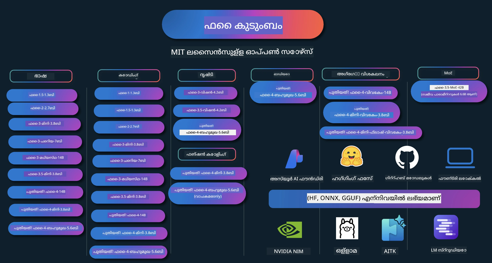

# Phi കുക്ക് ബുക്ക്: മൈക്രോസോഫ്റ്റിന്റെ Phi മోడലുകളുമായി കൈകാര്യം ചെയ്യുന്നതിനുള്ള ഉദാഹരണങ്ങൾ

[](https://codespaces.new/microsoft/phicookbook)
[](https://vscode.dev/redirect?url=vscode://ms-vscode-remote.remote-containers/cloneInVolume?url=https://github.com/microsoft/phicookbook)

[](https://GitHub.com/microsoft/phicookbook/graphs/contributors/?WT.mc_id=aiml-137032-kinfeylo)
[](https://GitHub.com/microsoft/phicookbook/issues/?WT.mc_id=aiml-137032-kinfeylo)
[](https://GitHub.com/microsoft/phicookbook/pulls/?WT.mc_id=aiml-137032-kinfeylo)
[](http://makeapullrequest.com?WT.mc_id=aiml-137032-kinfeylo)

[](https://GitHub.com/microsoft/phicookbook/watchers/?WT.mc_id=aiml-137032-kinfeylo)
[](https://GitHub.com/microsoft/phicookbook/network/?WT.mc_id=aiml-137032-kinfeylo)
[](https://GitHub.com/microsoft/phicookbook/stargazers/?WT.mc_id=aiml-137032-kinfeylo)

[](https://discord.com/invite/ByRwuEEgH4)

Microsoft വികസിപ്പിച്ചിട്ടുള്ള Phi ഒരു പരമ്പര ഓപ്പൺ സോഴ്‌സ് AI മോഡലുകളാണ്.

Phi ഇപ്പോൾ ചെറിയ ഭാഷാ മോഡലുകൾ (SLM) ആയി ഏറ്റവും ശക്തിയും ചെലവു കുറഞ്ഞതും ആണ്, നിരവധി ഭാഷകൾ, ന്യായീകരണം, ടെക്സ്റ്റ്/ചാറ്റ് സൃഷ്ടി, കോഡിംഗ്, ചിത്രങ്ങൾ, ഓഡിയോ തുടങ്ങിയ വശങ്ങളിൽ വളരെ നല്ല ബെഞ്ച്മാർക്കുകൾ ഉണ്ട്.

നിങ്ങൾ Phi ക്ലൗഡിലോ എഡ്ജ് ഉപകരണങ്ങളിലോ വിനിയോഗിക്കാം, കൂടാതെ പരിധിയുള്ള കമ്പ്യൂട്ടിംഗ് പവർ ഉപയോഗിച്ച് സൃഷ്ടിപരമായ AI ആപ്ലിക്കേഷനുകൾ എളുപ്പത്തിൽ നിർമ്മിക്കാം.

ഈ ഉറവിടങ്ങൾ ഉപയോഗിച്ച് ആരംഭിക്കുന്നതിന് താഴെയുള്ള പടികൾ പിന്തുടരുക:
1. **റിപ്പോസിറ്ററി ഫോർക്ക് ചെയ്യുക**: ക്ലിക്ക് ചെയ്യുക [](https://GitHub.com/microsoft/phicookbook/network/?WT.mc_id=aiml-137032-kinfeylo)
2. **റിപ്പോസിറ്ററി ക്ലോൺ ചെയ്യുക**:   `git clone https://github.com/microsoft/PhiCookBook.git`
3. [**Microsoft AI Discord കമ്മ്യൂണിറ്റിയിൽ ചേരുകയും വിദഗ്ധരും മറ്റു ഡെവലപ്പർമാരുമായി കൂടിയിണക്കുകയും ചെയ്യുക**](https://discord.com/invite/ByRwuEEgH4?WT.mc_id=aiml-137032-kinfeylo)



### 🌐 ബഹു-ഭാഷാ പിന്തുണ

#### GitHub ആക്ഷന്റെ വഴി പിന്തുണ (ഓട്ടോമാറ്റഡും എല്ലായ്പ്പോഴും അപ്‌ടുഡേറ്റും)

<!-- CO-OP TRANSLATOR LANGUAGES TABLE START -->
[അറബിക്](../ar/README.md) | [ബംഗാളി](../bn/README.md) | [ബൾഗേറിയൻ](../bg/README.md) | [ബർമീസ് (മ്യാന്മാർ)](../my/README.md) | [ചൈനീസ് (സിംപ്ലിഫൈഡ്)](../zh-CN/README.md) | [ചൈനീസ് (പരമ്പരാഗതം, ഹോങ്കോംഗ്)](../zh-HK/README.md) | [ചൈനീസ് (പരമ്പരാഗതം, മക്കൌ)](../zh-MO/README.md) | [ചൈനീസ് (പരമ്പരാഗതം, തായ്‌വാൻ)](../zh-TW/README.md) | [ക്രൊയേഷ്യൻ](../hr/README.md) | [ചെക്ക്](../cs/README.md) | [ഡാനിഷ്](../da/README.md) | [ഡച്ച്](../nl/README.md) | [എസ്റ്റോണിയൻ](../et/README.md) | [ഫിന്നിഷ്](../fi/README.md) | [ഫ്രഞ്ച്](../fr/README.md) | [ജർമ്മൻ](../de/README.md) | [ഗ്രീസ്](../el/README.md) | [ഹീബ്രു](../he/README.md) | [ഹിന്ദി](../hi/README.md) | [ഹംഗേറിയൻ](../hu/README.md) | [ഇൻഡോണേഷ്യൻ](../id/README.md) | [ഇറ്റാലിയൻ](../it/README.md) | [ജപ്പാനീസ്](../ja/README.md) | [കന്നഡ](../kn/README.md) | [കൊറിയൻ](../ko/README.md) | [ലിത്വേനിയൻ](../lt/README.md) | [മലയാളം](./README.md) | [മലായ്](../ms/README.md) | [മരാഠി](../mr/README.md) | [നെപ്പാളി](../ne/README.md) | [നൈജീരിയൻ പിഡ്ജിൻ](../pcm/README.md) | [നോർവീജിയൻ](../no/README.md) | [പേർഷ്യൻ (ഫാർസി)](../fa/README.md) | [പോളിഷ്](../pl/README.md) | [പോർച്ചുഗീസ് (ബ്രസീൽ)](../pt-BR/README.md) | [പോർച്ചുഗീസ് (പോർച്ചുഗൽ)](../pt-PT/README.md) | [പഞ്ചാബി (ഗുർമുഖി)](../pa/README.md) | [റോമാനിയൻ](../ro/README.md) | [റഷ്യൻ](../ru/README.md) | [സെർബിയൻ (സിറിലിക്)](../sr/README.md) | [സ്ലൊവാക്](../sk/README.md) | [സ്ലൊവേനിയൻ](../sl/README.md) | [സ്പാനിഷ്](../es/README.md) | [സ്വാഹിലി](../sw/README.md) | [സ്വീഡിഷ്](../sv/README.md) | [ടാഗലോഗ് (ഫിലിപ്പിനോ)](../tl/README.md) | [തമിഴ്](../ta/README.md) | [തെലുങ്കു](../te/README.md) | [ തായ്](../th/README.md) | [തുര്‍ക്കിഷ്](../tr/README.md) | [ഉക്രൈനിയൻ](../uk/README.md) | [ഉര്‍ദു](../ur/README.md) | [വിയറ്റ്നാമീസ്](../vi/README.md)

> **ലോക്കലായി ക്ലോൺ ചെയ്യാൻ ഇഷ്ടപ്പെടുന്നുണ്ടോ?**
>
> ഈ റിപോസിറ്ററിയിൽ 50+ ഭാഷാ പരിഭാഷകൾ ഉൾക്കൊള്ളുന്നതുകൊണ്ടു് ഡൗൺലോഡ് വലുതായിരിക്കും. പരിഭാഷകൾ കൂടാതെ ക്ലോൺ ചെയ്യാൻ, സ്പാർസ് ചെക്ക്ഔട്ട് ഉപയോഗിക്കുക:
>
> **Bash / macOS / Linux:**
> ```bash
> git clone --filter=blob:none --sparse https://github.com/microsoft/PhiCookBook.git
> cd PhiCookBook
> git sparse-checkout set --no-cone '/*' '!translations' '!translated_images'
> ```
>
> **CMD (Windows):**
> ```cmd
> git clone --filter=blob:none --sparse https://github.com/microsoft/PhiCookBook.git
> cd PhiCookBook
> git sparse-checkout set --no-cone "/*" "!translations" "!translated_images"
> ```
>
> ഇതിലൂടെ നിങ്ങൾക്ക് കോഴ്സ് പൂർത്തിയാക്കാൻ ആവശ്യമുള്ള എല്ലാ വസ്തുക്കളും much വേഗത്തിൽ ഡൗൺലോഡ് ചെയ്യാം.
<!-- CO-OP TRANSLATOR LANGUAGES TABLE END -->

## ഉള്ളടക്ക പട്ടിക

- പരിചയം
  - [Phi കുടുംബത്തിലേക്ക് സ്വാഗതം](./md/01.Introduction/01/01.PhiFamily.md)
  - [നിങ്ങളുടെ പരിസ്ഥിതി ക്രമീകരിക്കൽ](./md/01.Introduction/01/01.EnvironmentSetup.md)
  - [പ്രധാന സാങ്കേതികവിദ്യകൾ മനസിലാക്കുക](./md/01.Introduction/01/01.Understandingtech.md)
  - [Phi മോഡലുകൾക്കായുള്ള AI സുരക്ഷ](./md/01.Introduction/01/01.AISafety.md)
  - [Phi ഹാർഡ്‌വെയർ പിന്തുണ](./md/01.Introduction/01/01.Hardwaresupport.md)
  - [Phi മോഡലുകളും പ്ലാറ്റ്ഫോമുകളിലെ ലഭ്യതയും](./md/01.Introduction/01/01.Edgeandcloud.md)
  - [Guidance-ai ഉം Phi ഉം ഉപയോഗിക്കുന്നത്](./md/01.Introduction/01/01.Guidance.md)
  - [GitHub മാർക്കറ്റ് പ്ലേസ് മേക്കയിൾ](https://github.com/marketplace/models)
  - [Azure AI മോഡൽ കാറ്റലോഗ്](https://ai.azure.com)

- വ്യത്യസ്ത പരിസ്ഥിതികളിൽ Phi ഇൻഫറൻസ്
    -  [Hugging face](./md/01.Introduction/02/01.HF.md)
    -  [GitHub മോഡലുകൾ](./md/01.Introduction/02/02.GitHubModel.md)
    -  [Microsoft Foundry മോഡൽ കാറ്റലോഗ്](./md/01.Introduction/02/03.AzureAIFoundry.md)
    -  [Ollama](./md/01.Introduction/02/04.Ollama.md)
    -  [AI Toolkit VSCode (AITK)](./md/01.Introduction/02/05.AITK.md)
    -  [NVIDIA NIM](./md/01.Introduction/02/06.NVIDIA.md)
    -  [Foundry Local](./md/01.Introduction/02/07.FoundryLocal.md)

- Phi കുടുംബത്തിന്റെ ഇൻഫറൻസ്
    - [iOS-ൽ Phi ഇൻഫറൻസ്](./md/01.Introduction/03/iOS_Inference.md)
    - [Android-ൽ Phi ഇൻഫറൻസ്](./md/01.Introduction/03/Android_Inference.md)
    - [Jetson-ൽ Phi ഇൻഫറൻസ്](./md/01.Introduction/03/Jetson_Inference.md)
    - [AI PC-യിൽ Phi ഇൻഫറൻസ്](./md/01.Introduction/03/AIPC_Inference.md)
    - [Apple MLX ഫ്രെയിംവർക്കുമായി Phi ഇൻഫറൻസ്](./md/01.Introduction/03/MLX_Inference.md)
    - [ലോകൽ സെർവറിൽ Phi ഇൻഫറൻസ്](./md/01.Introduction/03/Local_Server_Inference.md)
    - [AI Toolkit ഉപയോഗിച്ച് റിമോട്ട് സെർവറിൽ Phi ഇൻഫറൻസ്](./md/01.Introduction/03/Remote_Interence.md)
    - [Rust ഉപയോഗിച്ച് Phi ഇൻഫറൻസ്](./md/01.Introduction/03/Rust_Inference.md)
    - [ലോകലൈൻ Phi--Vision ഇൻഫറൻസ്](./md/01.Introduction/03/Vision_Inference.md)
    - [Kaito AKS, Azure Containers (അധികാരിക പിന്തുണ) ഉപയോഗിച്ച് Phi ഇൻഫറൻസ്](./md/01.Introduction/03/Kaito_Inference.md)
-  [Phi കുടുംബം ക്വാണ്ടിഫൈ ചെയ്യൽ](./md/01.Introduction/04/QuantifyingPhi.md)
    - [llama.cpp ഉപയോഗിച്ച് Phi-3.5 / 4 ക്വാണ്ടൈസിംഗ്](./md/01.Introduction/04/UsingLlamacppQuantifyingPhi.md)
    - [onnxruntime-ന് Generative AI വിപുലീകരണങ്ങൾ ഉപയോഗിച്ച് Phi-3.5 / 4 ക്വാണ്ടൈസ് ചെയ്യൽ](./md/01.Introduction/04/UsingORTGenAIQuantifyingPhi.md)
    - [Intel OpenVINO ഉപയോഗിച്ച് Phi-3.5 / 4 ക്വാണ്ടൈസ് ചെയ്യൽ](./md/01.Introduction/04/UsingIntelOpenVINOQuantifyingPhi.md)
    - [Apple MLX ഫ്രെയിംവർക് ഉപയോഗിച്ച് Phi-3.5 / 4 ക്വാണ്ടൈസ് ചെയ്യൽ](./md/01.Introduction/04/UsingAppleMLXQuantifyingPhi.md)

-  Phi മൂല്യനിർണ്ണയം
    - [Responsible AI](./md/01.Introduction/05/ResponsibleAI.md)
    - [Microsoft Foundry മൂല്യനിർണ്ണയത്തിന്](./md/01.Introduction/05/AIFoundry.md)
    - [Promptflow ഉപയോഗിച്ച് മൂല്യനിർണ്ണയം](./md/01.Introduction/05/Promptflow.md)
 
- Azure AI Search-ഉടെ RAG
    - [Phi-4-mini, Phi-4-multimodal (RAG) Azure AI Search-ഉടെ എങ്ങനെ ഉപയോഗിക്കാമെന്ന്](https://github.com/microsoft/PhiCookBook/blob/main/code/06.E2E/E2E_Phi-4-RAG-Azure-AI-Search.ipynb)

- Phi ആപ്ലിക്കേഷൻ വികസന സാമ്പിളുകൾ
  - ടെക്സ്റ്റ് & ചാറ്റ് ആപ്ലിക്കേഷനുകൾ
    - Phi-4 സാമ്പിളുകൾ 🆕
      - [📓] [Phi-4-mini ONNX മോഡലുമായി ചാറ്റ് ചെയ്യുക](./md/02.Application/01.TextAndChat/Phi4/ChatWithPhi4ONNX/README.md)
      - [Phi-4 ലോക്കൽ ONNX മോഡലുമായി ചാറ്റ് .NET](../../md/04.HOL/dotnet/src/LabsPhi4-Chat-01OnnxRuntime)
      - [Sementic Kernel ഉപയോഗിച്ച് Phi-4 ONNX-ഉം .NET കോൺസോൾ ആപ്പ് ചാറ്റ്](../../md/04.HOL/dotnet/src/LabsPhi4-Chat-02SK)
    - Phi-3 / 3.5 സാമ്പിളുകൾ
      - [Phi3, ONNX Runtime Web, WebGPU ഉപയോഗിച്ച് ബ്രൗസറിൽ ലോക്കൽ ചാറ്റ്‌ബോട്ട്](https://github.com/microsoft/onnxruntime-inference-examples/tree/main/js/chat)
      - [OpenVino Chat](./md/02.Application/01.TextAndChat/Phi3/E2E_OpenVino_Chat.md)
      - [ബഹുസ്വര മോഡൽ - ഇന്ററാക്ടീവ് Phi-3-മിനി ആൻഡ് ഓപൺഎഐ വിസ്പർ](./md/02.Application/01.TextAndChat/Phi3/E2E_Phi-3-mini_with_whisper.md)
      - [MLFlow - ഒരു റാപ്പർ നിർമ്മിക്കുക, Phi-3 MLFlow ഉപയോഗിച്ച്](./md//02.Application/01.TextAndChat/Phi3/E2E_Phi-3-MLflow.md)
      - [മോഡൽ ഓപ്റ്റിമൈസേഷൻ - Phi-3-മിനി മോഡൽ ഓൺഎൻഎക്സ് റൺടൈം വെബിന് ഒളിവ് ഉപയോഗിച്ച് എങ്ങനെ ഓപ്റ്റിമൈസ് ചെയ്യാം](https://github.com/microsoft/Olive/tree/main/examples/phi3)
      - [WinUI3 ആപ്പ് Phi-3 മിനി-4k-ഇൻസ്ട്രക്റ്റ്-onnx ഉപയോഗിച്ച്](https://github.com/microsoft/Phi3-Chat-WinUI3-Sample/)
      -[WinUI3 ബഹുസ്വര മോഡൽ AI പവേഡ് നോട്ട്സ് ആപ്പ് സാംപിൾ](https://github.com/microsoft/ai-powered-notes-winui3-sample)
      - [Fine-tune ചെയ്യുകയും സ്വന്തം Phi-3 മോഡലുകൾ Prompt flow ഉപയോഗിച്ച് സംയോജിപ്പിക്കുകയും ചെയ്യുക](./md/02.Application/01.TextAndChat/Phi3/E2E_Phi-3-FineTuning_PromptFlow_Integration.md)
      - [Fine-tune ചെയ്യുകയും സ്വന്തമായി Phi-3 മോഡലുകൾ Microsoft Foundry Prompt flow ഉപയോഗിച്ച് സംയോജിപ്പിക്കുകയും ചെയ്യുക](./md/02.Application/01.TextAndChat/Phi3/E2E_Phi-3-FineTuning_PromptFlow_Integration_AIFoundry.md)
      - [Microsoft-ന്റെ ഉത്തരവാദിത്ത AI നയങ്ങൾ ശ്രദ്ധയിൽ വെച്ച് Microsoft Foundry-യിൽ Fine-tuned Phi-3 / Phi-3.5 മോഡൽ വിലയിരുത്തൽ](./md/02.Application/01.TextAndChat/Phi3/E2E_Phi-3-Evaluation_AIFoundry.md)
      - [📓] [Phi-3.5-മിനി-ഇൻസ്ട്രക്റ്റ് ഭാഷാ പ്രവചന സാമ്പിൾ (ചൈനീസ്/ഇംഗ്ലീഷ്)](./md/02.Application/01.TextAndChat/Phi3/phi3-instruct-demo.ipynb)
      - [Phi-3.5-ഇൻസ്ട്രക്റ്റ് WebGPU RAG ചാത്ത്ബോട്ട്](./md/02.Application/01.TextAndChat/Phi3/WebGPUWithPhi35Readme.md)
      - [ഫിൻഡോസ് GPU ഉപയോഗിച്ച് Phi-3.5-ഇൻസ്ട്രക്റ്റ് ONNX ഉപയോഗിച്ച് Prompt flow സൊല്യൂഷൻ സൃഷ്ടിക്കൽ](./md/02.Application/01.TextAndChat/Phi3/UsingPromptFlowWithONNX.md)
      - [Microsoft Phi-3.5 tflite ഉപയോഗിച്ച് ആൻഡ്രോയ്ഡ് ആപ്പ് സൃഷ്ടിക്കൽ](./md/02.Application/01.TextAndChat/Phi3/UsingPhi35TFLiteCreateAndroidApp.md)
      - [Q&A .NET ഉദാഹരണം Microsoft.ML.OnnxRuntime ഉപയോഗിച്ച് ലോക്കൽ ONNX Phi-3 മോഡൽ ഉപയോഗിച്ച്](../../md/04.HOL/dotnet/src/LabsPhi301)
      - [Console ചാറ്റ് .NET ആപ്പ് Semantic Kernel and Phi-3 ഉപയോഗിച്ച്](../../md/04.HOL/dotnet/src/LabsPhi302)

  - Azure AI Inference SDK കോഡ് അടിസ്ഥാനമായ സാംപിളുകൾ
    - Phi-4 സാംപിളുകൾ 🆕
      - [📓] [Phi-4-multimodal ഉപയോഗിച്ച് പ്രോജക്റ്റ് കോഡ് ജനറേറ്റ് ചെയ്യുക](./md/02.Application/02.Code/Phi4/GenProjectCode/README.md)
    - Phi-3 / 3.5 സാംപിളുകൾ
      - [Microsoft Phi-3 കുടുംബം ഉപയോഗിച്ച് Visual Studio Code GitHub Copilot Chat നിർമ്മിക്കുക](./md/02.Application/02.Code/Phi3/VSCodeExt/README.md)
      - [GitHub മോഡലുകളോട് Phi-3.5 ഉപയോഗിച്ച് Visual Studio Code Chat Copilot ഏജന്റ് സൃഷ്ടിക്കുക](/md/02.Application/02.Code/Phi3/CreateVSCodeChatAgentWithGitHubModels.md)

  - പുരോഗമിച്ച നിരീക്ഷണ സാംപിളുകൾ
    - Phi-4 സാംപിളുകൾ 🆕
      - [📓] [Phi-4-മിനി-റീസണിംഗ് അല്ലെങ്കിൽ Phi-4-റീസണിംഗ് സാംപിളുകൾ](./md/02.Application/03.AdvancedReasoning/Phi4/AdvancedResoningPhi4mini/README.md)
      - [📓] [മെഡിക്കൽ ഡാറ്റയോട് Microsoft Olive ഉപയോഗിച്ച് Phi-4-മിനി-റീസണിംഗ് ഫൈൻ-ട്യൂൺ ചെയ്യുക](./md/02.Application/03.AdvancedReasoning/Phi4/AdvancedResoningPhi4mini/olive_ft_phi_4_reasoning_with_medicaldata.ipynb)
      - [📓] [Apple MLX ഉപയോഗിച്ച് Phi-4-മിനി-റീസണിംഗ് ഫൈൻ-ട്യൂൺ ചെയ്യുക](./md/02.Application/03.AdvancedReasoning/Phi4/AdvancedResoningPhi4mini/mlx_ft_phi_4_reasoning_with_medicaldata.ipynb)
      - [📓] [GitHub മോഡലുകൾ ഉപയോഗിച്ച് Phi-4-മിനി-റീസണിംഗ്](./md/02.Application/02.Code/Phi4r/github_models_inference.ipynb)
      - [📓] [Microsoft Foundry മോഡലുകൾ ഉപയോഗിച്ച് Phi-4-മിനി-റീസണിംഗ്](./md/02.Application/02.Code/Phi4r/azure_models_inference.ipynb)
  - ഡെമോകൾ
      - [Phi-4-മിനി ഡെമോകൾ Hugging Face സ്പേസുകളിൽ ഹോസ്റ്റ് ചെയ്യുന്നു](https://huggingface.co/spaces/microsoft/phi-4-mini?WT.mc_id=aiml-137032-kinfeylo)
      - [Phi-4-മൾട്ടിമോഡൽ ഡെമോകൾ Hugginge Face സ്പേസുകളിൽ ഹോസ്റ്റ് ചെയ്യുന്നു](https://huggingface.co/spaces/microsoft/phi-4-multimodal?WT.mc_id=aiml-137032-kinfeylo)
  - ദൃശ്യമാന സാംപിളുകൾ
    - Phi-4 സാംപിളുകൾ 🆕
      - [📓] [Phi-4-മൾട്ടിമോഡൽ ഉപയോഗിച്ച് ചിത്രങ്ങൾ വായിച്ച് കോഡ് സൃഷ്ടിക്കുക](./md/02.Application/04.Vision/Phi4/CreateFrontend/README.md) 
    - Phi-3 / 3.5 സാംപിളുകൾ
      -  [📓][Phi-3-വിഷൻ-ചിത്രം ടെക്സ്റ്റിലേക്ക്, ടെക്സ്റ്റ്ൽ മുതൽ ഓൺലൈൻ എൻഡ്‌പോയിന്റ്](./md/02.Application/04.Vision/Phi3/E2E_Phi-3-vision-image-text-to-text-online-endpoint.ipynb)
      - [Phi-3-വിഷൻ-ONNX](https://onnxruntime.ai/docs/genai/tutorials/phi3-v.html)
      - [📓][Phi-3-വിഷൻ CLIP എൻബെഡ്ഡിംഗ്](./md/02.Application/04.Vision/Phi3/E2E_Phi-3-vision-image-text-to-text-online-endpoint.ipynb)
      - [ഡെമോ: Phi-3 റിസൈക്കിൾ](https://github.com/jennifermarsman/PhiRecycling/)
      - [Phi-3-വിഷൻ - ദൃശ്യഭാഷാ സഹായി - Phi3-വിഷൻ ഉം ഓപൺവിനോയും ഉപയോഗിച്ച്](https://docs.openvino.ai/nightly/notebooks/phi-3-vision-with-output.html)
      - [Phi-3 Vision Nvidia NIM](./md/02.Application/04.Vision/Phi3/E2E_Nvidia_NIM_Vision.md)
      - [Phi-3 Vision OpenVino](./md/02.Application/04.Vision/Phi3/E2E_OpenVino_Phi3Vision.md)
      - [📓][Phi-3.5 Vision മൾട്ടി-ഫ്രെയിം അല്ലെങ്കിൽ മൾട്ടി-ഇമേജ് സാംപിൾ](./md/02.Application/04.Vision/Phi3/phi3-vision-demo.ipynb)
      - [Microsoft.ML.OnnxRuntime .NET ഉപയോഗിച്ച് Phi-3 Vision ലോക്കൽ ONNX മോഡൽ](../../md/04.HOL/dotnet/src/LabsPhi303)
      - [മെനു അടിസ്ഥാനത്തിൽ Phi-3 Vision ലോക്കൽ ONNX മോഡൽ Microsoft.ML.OnnxRuntime .NET ഉപയോഗിച്ച്](../../md/04.HOL/dotnet/src/LabsPhi304)

  - ഗണിത ശാസ്ത്ര സാംപിളുകൾ
    -  Phi-4-മിനി-ഫ്ലാഷ്-റീസണിംഗ്-ഇൻസ്ട്രക്റ്റ് സാംപിളുകൾ 🆕 [Phi-4-മിനി-ഫ്ലാഷ്-റീസണിംഗ്-ഇൻസ്ട്രക്റ്റ് ഗണിത സഹായം](./md/02.Application/09.Math/MathDemo.ipynb)

  - ശബ്‌ദ സാംപിളുകൾ
    - Phi-4 സാംപിളുകൾ 🆕
      - [📓] [Phi-4-മൾട്ടിമോഡൽ ഉപയോഗിച്ച് ഓഡിയോ ലേഖനം എടുക്കൽ](./md/02.Application/05.Audio/Phi4/Transciption/README.md)
      - [📓] [Phi-4-മൾട്ടിമോഡൽ ഓഡിയോ സാംപിൾ](./md/02.Application/05.Audio/Phi4/Siri/demo.ipynb)
      - [📓] [Phi-4-മൾട്ടിമോഡൽ സംസാര വിവർത്തന സാംപിൾ](./md/02.Application/05.Audio/Phi4/Translate/demo.ipynb)
      - [.NET കൺസോൾ ആപ്പ് Phi-4-മൾട്ടിമോഡൽ ഓഡിയോ ഫയൽ വിശകലനം ചെയ്യുകയും ലേഖനം ജനറേറ്റ് ചെയ്യുകയും ചെയ്യുന്നു](../../md/04.HOL/dotnet/src/LabsPhi4-MultiModal-02Audio)

  - MOE സാംപിളുകൾ
    - Phi-3 / 3.5 സാംപിളുകൾ
      - [📓] [Phi-3.5 വിദഗ്ധരുടെ മിശ്രിത (MoEs) സോഷ്യൽ മീഡിയ സാംപിൾ](./md/02.Application/06.MoE/Phi3/phi3_moe_demo.ipynb)
      - [📓] [NVIDIA NIM Phi-3 MOE, Azure AI Search, ലൈമ ഇൻഡക്സ് ഉപയോഗിച്ച് Retrieval-Augmented Generation (RAG) പൈപ്പ്‌ലൈൻ നിർമ്മിക്കൽ](./md/02.Application/06.MoE/Phi3/azure-ai-search-nvidia-rag.ipynb)
      - 
  - ഫങ്ഷൻ കോളിംഗ് സാംപിളുകൾ
    - Phi-4 സാംപിളുകൾ 🆕
      -  [📓] [Phi-4-മിനി ഉപയോഗിച്ച് Function Calling ഉപയോഗിക്കൽ](./md/02.Application/07.FunctionCalling/Phi4/FunctionCallingBasic/README.md)
      -  [📓] [Phi-4-മിനി ഉപയോഗിച്ച് മൾട്ടി-ഏജന്റുകൾ നിർമ്മിക്കാൻ Function Calling](./md/02.Application/07.FunctionCalling/Phi4/Multiagents/Phi_4_mini_multiagent.ipynb)
      -  [📓] [Ollama ഉപയോഗിച്ച് Function Calling](./md/02.Application/07.FunctionCalling/Phi4/Ollama/ollama_functioncalling.ipynb)
      -  [📓] [ONNX ഉപയോഗിച്ച് Function Calling](./md/02.Application/07.FunctionCalling/Phi4/ONNX/onnx_parallel_functioncalling.ipynb)
  - മൾട്ടിമോഡൽ മിക്സിംഗ് സാംപിളുകൾ
    - Phi-4 സാംപിളുകൾ 🆕
      -  [📓] [ടെക്നോളജി ജേണലിസ്റ്റ് പോലെ Phi-4-മൾട്ടിമോഡൽ ഉപയോഗിക്കൽ](./md/02.Application/08.Multimodel/Phi4/TechJournalist/phi_4_mm_audio_text_publish_news.ipynb)
      - [.NET കൺസോൾ ആപ്പ് Phi-4-മൾട്ടിമോഡൽ ഉപയോഗിച്ച് ചിത്രങ്ങൾ വിശകലനം ചെയ്യാനുള്ള](../../md/04.HOL/dotnet/src/LabsPhi4-MultiModal-01Images)

- ഫൈൻ-ട്യൂണിംഗ് Phi സാംപിളുകൾ
  - [ഫൈൻ-ട്യൂണിംഗ് സാഹചര്യങ്ങൾ](./md/03.FineTuning/FineTuning_Scenarios.md)
  - [ഫൈൻ-ട്യൂണിംഗ് vs RAG](./md/03.FineTuning/FineTuning_vs_RAG.md)
  - [Phi-3 പണിയിറങ്ങുക, വ്യവസായ വിദഗ്ധന് ആക്കുക](./md/03.FineTuning/LetPhi3gotoIndustriy.md)
  - [AI ടൂൾകിറ്റ് ഫോർ VS കോഡ് ഉപയോഗിച്ച് Phi-3 ഫൈൻ-ട്യൂൺ ചെയ്യുക](./md/03.FineTuning/Finetuning_VSCodeaitoolkit.md)
  - [Azure മെഷീൻ ലേണിംഗ് സർവീസ് ഉപയോഗിച്ച് Phi-3 ഫൈൻ-ട്യൂൺ ചെയ്യുക](./md/03.FineTuning/Introduce_AzureML.md)
  - [ലോറ ഉപയോഗിച്ച് Phi-3 ഫൈൻ-ട്യൂൺ ചെയ്യുക](./md/03.FineTuning/FineTuning_Lora.md)
  - [ക്യുവിലോറ ഉപയോഗിച്ച് Phi-3 ഫൈൻ-ട്യൂൺ ചെയ്യുക](./md/03.FineTuning/FineTuning_Qlora.md)
  - [Microsoft Foundry ഉപയോഗിച്ച് Phi-3 ഫൈൻ-ട്യൂൺ](./md/03.FineTuning/FineTuning_AIFoundry.md)
  - [Azure ML CLI/SDK ഉപയോഗിച്ച് Phi-3 ഫൈൻ-ട്യൂൺ](./md/03.FineTuning/FineTuning_MLSDK.md)
  - [Microsoft Olive ഉപയോഗിച്ച് ഫൈൻ-ട്യൂണിംഗ്](./md/03.FineTuning/FineTuning_MicrosoftOlive.md)
  - [Microsoft Olive ഹാൻഡ്‌സ്-ഓൺ ഫാബ്](./md/03.FineTuning/olive-lab/readme.md)
  - [Weights and Bias ഉപയോഗിച്ച് Phi-3-vision ഫൈൻ-ട്യൂൺ](./md/03.FineTuning/FineTuning_Phi-3-visionWandB.md)
  - [Apple MLX ഫ്രെയിംവർക്ക് ഉപയോഗിച്ച് Phi-3 ഫൈൻ-ട്യൂൺ](./md/03.FineTuning/FineTuning_MLX.md)
  - [Phi-3-vision (അധികൃത പിന്തുണ) ഫൈൻ-ട്യൂൺ](./md/03.FineTuning/FineTuning_Vision.md)
  - [Kaito AKS, Azure കണ്ടെയ്‌നറുകൾ (അധികൃത പിന്തുണ) Phi-3 ഫൈൻ-ട്യൂൺ](./md/03.FineTuning/FineTuning_Kaito.md)
  - [Phi-3, 3.5 Vision ഫൈൻ-ട്യൂൺ](https://github.com/2U1/Phi3-Vision-Finetune)

- ഹാൻഡ്‌സ് ഓൺ ലാബ്
  - [ഉന്നത മോഡലുകൾ എക്സ്‌പ്ലോർ ചെയ്യൽ: LLM, SLM, ലോക്കൽ ഡെവലപ്മെന്റ്, കൂടുതൽ](https://github.com/microsoft/aitour-exploring-cutting-edge-models)
  - [NLP ശേഷി തുറക്കൽ: Microsoft Olive ഉപയോഗിച്ച് ഫൈൻ-ട്യൂണിംഗ്](https://github.com/azure/Ignite_FineTuning_workshop)
- അക്കാദമിക് റിസർച്ച്പേപ്പറുകളും പ്രസിദ്ധീകരണങ്ങളും  
  - [Textbooks Are All You Need II: phi-1.5 ടെക്നിക്കൽ റിപ്പോർട്ട്](https://arxiv.org/abs/2309.05463)  
  - [Phi-3 ടെക്നിക്കൽ റിപ്പോർട്ട്: നിങ്ങളുടെ ഫോൺലോക്കൽ ഹൈലി കപ്പബിൾ ലാംഗ്വേജ് മോഡൽ](https://arxiv.org/abs/2404.14219)  
  - [Phi-4 ടെക്നിക്കൽ റിപ്പോർട്ട്](https://arxiv.org/abs/2412.08905)  
  - [Phi-4-മിനി ടെക്നിക്കൽ റിപ്പോർട്ട്: മിക്സ്ചർ-ഓഫ്-ലോറാസ് വഴി സങ്കുചിതവും ശക്തിയേറിയുമുള്ള മൾട്ടിമോഡൽ ലാംഗ്വേജ് മോഡലുകൾ](https://arxiv.org/abs/2503.01743)  
  - [വാഹനത്തിൽ ഫംഗ്ഷൻ-കാളിങ്ങിനായി ചെറിയ ലാംഗ്വേജ് മോഡലുകൾ ഓപ്റ്റിമൈസ് ചെയ്യൽ](https://arxiv.org/abs/2501.02342)  
  - [(WhyPHI) മൾട്ടിപ്പിൾ-ചോയ്‌സ് ക്വഷൻ ആൻസറിംഗിനായി PHI-3 ഫൈൻ-ട്യൂണിങ്: രീതീശാസ്ത്രം, ഫലങ്ങൾ, വെല്ലുവിളികൾ](https://arxiv.org/abs/2501.01588)  
  - [Phi-4-റീസണിംഗ് ടെക്നിക്കൽ റിപ്പോർട്ട്](https://www.microsoft.com/en-us/research/wp-content/uploads/2025/04/phi_4_reasoning.pdf)  
  - [Phi-4-മിനി-റീസണിംഗ് ടെക്നിക്കൽ റിപ്പോർട്ട്](https://huggingface.co/microsoft/Phi-4-mini-reasoning/blob/main/Phi-4-Mini-Reasoning.pdf)  

## ഫൈ മോഡലുകൾ ഉപയോഗിക്കൽ  

### Microsoft Foundry-യിൽ ഫൈ  

Microsoft Phi എങ്ങനെ ഉപയോഗിക്കാമെന്നും നിങ്ങളുടെ വിവിധ ഹാർഡ്‌വെയർ ഉപകരണങ്ങളിൽ എ2ഇ സൊലൂഷനുകൾ എങ്ങനെ നിർമ്മിക്കാമെന്നും നിങ്ങൾക്ക് പഠിക്കാം. ഫൈ നിങ്ങളൊന്നുള്ള അനുഭവം നേടാൻ, മോഡലുകൾ ഉപയോഗിച്ച് കളിയുടേം നിങ്ങളുടെ സീനാരിയോകൾക്ക് ഫൈ കസ്റ്റമൈസ് ചെയ്യുന്നതിൽ നിന്ന് തുടങ്ങാം, അതിനായി [Microsoft Foundry Azure AI Model Catalog](https://aka.ms/phi3-azure-ai) ഉപയോഗിക്കാം. [Microsoft Foundry](/md/02.QuickStart/AzureAIFoundry_QuickStart.md) യില്‍ ആരംഭിച്ചുകൊണ്ടുള്ള കൂടുതൽ പഠനം ചെയ്യാം.  

**പ്ലേഗ്രൗണ്ട്**  
ഓരോ മോഡലിനും മോഡൽ പരീക്ഷിക്കാൻ സമർപ്പിച്ച പ്ലേഗ്രൗണ്ട് ഉണ്ട് [Azure AI Playground](https://aka.ms/try-phi3).  

### GitHub മോഡലുകളിൽ ഫൈ  

Microsoft Phi എങ്ങനെ ഉപയോഗിക്കാമെന്നും നിങ്ങളുടെ വ്യത്യസ്ത ഹാർഡ്‌വെയർ ഉപകരണങ്ങളിൽ എ2ഇ സൊലൂഷനുകൾ എങ്ങനെ നിർമ്മിക്കാമെന്നും നിങ്ങൾക്ക് പഠിക്കാം. ഫൈ നിങ്ങളൊന്നുള്ള അനുഭവം നേടാൻ, മോഡലിൽ കളിയും നിങ്ങളുടെ സീനാരിയോകൾക്ക് ഫൈ കസ്റ്റമൈസ് ചെയ്യലും തുടങ്ങുക, ഇതിന് [GitHub Model Catalog](https://github.com/marketplace/models?WT.mc_id=aiml-137032-kinfeylo) ഉപയോഗിക്കാം. [GitHub Model Catalog](/md/02.QuickStart/GitHubModel_QuickStart.md) യില്‍ ആരംഭിച്ചുകൊണ്ടുള്ള കൂടുതൽ പഠനം ചെയ്യാം.  

**പ്ലേഗ്രൗണ്ട്**  
ഓരോ മോഡലിനും പരീക്ഷിക്കാൻ സമർപ്പിച്ച [പ്ലേഗ്രൗണ്ട്](/md/02.QuickStart/GitHubModel_QuickStart.md) ഉണ്ട്.  

### Hugging Face-ൽ ഫൈ  

മോഡൽ [Hugging Face](https://huggingface.co/microsoft) യിലും ലഭ്യമാണ്.  

**പ്ലേഗ്രൗണ്ട്**  
[Hugging Chat പ്ലേഗ്രൗണ്ട്](https://huggingface.co/chat/models/microsoft/Phi-3-mini-4k-instruct)  

## 🎒 മറ്റ് കോഴ്സുകൾ  

നമ്മുടെ ടീം മറ്റും കോഴ്സുകൾ നിർമ്മിക്കുന്നു! പരിശോധിക്കൂ:  

<!-- CO-OP TRANSLATOR OTHER COURSES START -->  
### LangChain  
[](https://aka.ms/langchain4j-for-beginners)  
[](https://aka.ms/langchainjs-for-beginners?WT.mc_id=m365-94501-dwahlin)  
[](https://github.com/microsoft/langchain-for-beginners?WT.mc_id=m365-94501-dwahlin)  
---  

### Azure / എജ് / MCP / ഏജന്റുകൾ  
[](https://github.com/microsoft/AZD-for-beginners?WT.mc_id=academic-105485-koreyst)  
[](https://github.com/microsoft/edgeai-for-beginners?WT.mc_id=academic-105485-koreyst)  
[](https://github.com/microsoft/mcp-for-beginners?WT.mc_id=academic-105485-koreyst)  
[](https://github.com/microsoft/ai-agents-for-beginners?WT.mc_id=academic-105485-koreyst)  

---  
 
### ടെന്നറെറ്റീവ് AI പരമ്പര  
[](https://github.com/microsoft/generative-ai-for-beginners?WT.mc_id=academic-105485-koreyst)  
[-9333EA?style=for-the-badge&labelColor=E5E7EB&color=9333EA)](https://github.com/microsoft/Generative-AI-for-beginners-dotnet?WT.mc_id=academic-105485-koreyst)  
[-C084FC?style=for-the-badge&labelColor=E5E7EB&color=C084FC)](https://github.com/microsoft/generative-ai-for-beginners-java?WT.mc_id=academic-105485-koreyst)  
[-E879F9?style=for-the-badge&labelColor=E5E7EB&color=E879F9)](https://github.com/microsoft/generative-ai-with-javascript?WT.mc_id=academic-105485-koreyst)  

---  
 
### കോർ ലേണിംഗ്  
[](https://aka.ms/ml-beginners?WT.mc_id=academic-105485-koreyst)  
[](https://aka.ms/datascience-beginners?WT.mc_id=academic-105485-koreyst)  
[](https://aka.ms/ai-beginners?WT.mc_id=academic-105485-koreyst)  
[](https://github.com/microsoft/Security-101?WT.mc_id=academic-96948-sayoung)  
[](https://aka.ms/webdev-beginners?WT.mc_id=academic-105485-koreyst)  
[](https://aka.ms/iot-beginners?WT.mc_id=academic-105485-koreyst)  
[](https://github.com/microsoft/xr-development-for-beginners?WT.mc_id=academic-105485-koreyst)  

---  
 
### കോപ്പിലോട്ട് പരമ്പര  
[](https://aka.ms/GitHubCopilotAI?WT.mc_id=academic-105485-koreyst)  
[](https://github.com/microsoft/mastering-github-copilot-for-dotnet-csharp-developers?WT.mc_id=academic-105485-koreyst)  
[](https://github.com/microsoft/CopilotAdventures?WT.mc_id=academic-105485-koreyst)  
<!-- CO-OP TRANSLATOR OTHER COURSES END -->  

## ഉത്തരവാദിത്വമുള്ള AI  

Microsoft നമ്മുടെ ഉപഭോക്താക്കൾക്ക് AI ഉൽപ്പന്നങ്ങൾ ഉത്തരവാദിത്വത്തോടെ ഉപയോഗിക്കാനും, പഠനങ്ങൾ പങ്കുവയ്ക്കാനും, ട്രാൻസ്പറൻസി നോട്ടുകൾ, ഇംപാക്റ്റ് അസസ്മെന്റുകൾ പോലുള്ള ഉപകരണങ്ങളിലൂടെ വിശ്വാസം അടിസ്ഥാനമാക്കിയുള്ള പങ്കാളിത്തം നിർമ്മിക്കാനും പ്രതിബദ്ധമാണ്. ഈ വിഭവങ്ങളിൽ പലതും [https://aka.ms/RAI](https://aka.ms/RAI) ൽ ലഭ്യമാണ്.  
Microsoftന്റെ ഉത്തരവാദിത്വമുള്ള AI സമീപനം നിഷ്പക്ഷത, വിശ്വാസ്യത, സുരക്ഷ, സ്വകാര്യത, ഉൾക്കടുപ്പ്, പരദർശിത്വം, ഉത്തരവാദിത്വം എന്നീ AI സിദ്ധാന്തങ്ങളിൽ ആധാരമാക്കിയതാണ്.  

ഈ സാമ്പിൾ മോഡലുകളിൽ ഉപയോഗിക്കുന്ന വലിയ തോതിലുള്ള നാച്ച്വറൽ ലാംഗ്വേജ്, ചിത്രം, സംസാര മോഡലുകൾ അനിയമിതമായ, വിശ്വസനീയമല്ലാത്ത, അപമാനകരമായ പ്രകടനം കാണിക്കുന്നത് അപകടം ഉള്ള സമസ്യകൾ ഉണ്ടാക്കാമെന്നു സാധ്യമാണ്. അപകടങ്ങളും പരിധികളും അറിയാൻ ദയവായി [Azure OpenAI സർവീസ് ട്രാൻസ്പറൻസി നോട്ട്](https://learn.microsoft.com/legal/cognitive-services/openai/transparency-note?tabs=text) കാണുക.  

ഈ അപകടങ്ങൾ കുറയ്ക്കാനുള്ള ശുപാർശ ചെയ്യുന്ന സമീപനം, നിങ്ങളുടെ ഘടനയിൽ അതിക്ഷേപകരമായ പെരുമാറ്റം കണ്ട് തടയാൻ കഴിയുന്ന സുരക്ഷാ സംവിധാനം ഉൾപ്പെടുത്തുകയാണ്. [Azure AI Content Safety](https://learn.microsoft.com/azure/ai-services/content-safety/overview) സ്വതന്ത്ര സംരക്ഷണ പാളി നൽകുന്നു, ഇത് അപമാനകമായ ഉപയോക്തൃ-ഉത്പാദിതവും AI-ഉത്പാദിതവുമായ ഉള്ളടക്കം സർവീസുകളിലും ആപ്പ്-കളിലും കണ്ടെത്താൻ കഴിയും. Microsoft Foundry ഉള്ളടക്കം സുരക്ഷാ സേവനം ഭിന്നഭാഗങ്ങളിലും ദോഷകരമായ ഉള്ളടക്കം കണ്ടെത്താനുള്ള സാമ്പിൾ കോഡ് പരീക്ഷിക്കാൻ സഹായിക്കുന്നു. സേവനത്തിന് അപേക്ഷ നൽകുന്നതിന് താഴെ കാണുന്ന [ക്വിക്‌സ്റ്റാർട്ട് ഡോക്യുമെന്റേഷൻ](https://learn.microsoft.com/azure/ai-services/content-safety/quickstart-text?tabs=visual-studio%2Clinux&pivots=programming-language-rest) വഴികാട്ടുന്നു.
മറ്റൊരു പരിഗണിക്കേണ്ട കാര്യം ആപ്ലിക്കേഷൻ മൊത്തത്തിലുള്ള പ്രകടനക്ഷമതയാണ്. മൾട്ടി-മോഡൽ, മൾട്ടി-മോഡൽ ആപ്ലിക്കേഷനുകളുമായി, പ്രകടനക്ഷമത എന്നത് നിങ്ങൾക്കും നിങ്ങളുടെ ഉപയോക്താക്കൾക്കും പ്രതീക്ഷിക്കപ്പെടുന്ന രീതിയിൽ സിസ്റ്റം പ്രവർത്തിക്കുന്നതാണെന്നു ഉൾക്കൊള്ളുന്നു, ഹാനികരമായ ഔട്ട്പുട്ടുകൾ ഉണ്ടാകാതെ. നിങ്ങളുടെ മൊത്തത്തിലുള്ള ആപ്ലിക്കേഷൻ പ്രകടനക്ഷമത വിലയിരുത്തുന്നതിനായി [Performance and Quality and Risk and Safety evaluators](https://learn.microsoft.com/azure/ai-studio/concepts/evaluation-metrics-built-in) ഉപയോഗിക്കുക ആവശ്യമാണ്. കൂടാതെ നിങ്ങൾക്ക് [custom evaluators](https://learn.microsoft.com/azure/ai-studio/how-to/develop/evaluate-sdk#custom-evaluators) ഉപയോഗിച്ച് സൃഷ്ടിക്കുകയും വിലയിരുത്തുകയും ചെയ്യാനുള്ള കഴിവ് ഉണ്ട്.

നിങ്ങളുടെ ഡെവലപ്പ്മെന്റ് പരിതസ്ഥിതിയിൽ [Azure AI Evaluation SDK](https://microsoft.github.io/promptflow/index.html) ഉപയോഗിച്ച് നിങ്ങളുടെ AI ആപ്ലിക്കേഷൻ മൂല്യനിർണ്ണയം നടത്താം. പരീക്ഷണ ഡാറ്റാസെറ്റ് അല്ലെങ്കിൽ ലക്ഷ്യം നൽകിയാൽ, നിങ്ങളുടെ ജനറേറ്റീവ് AI ആപ്ലിക്കേഷൻ സൃഷ്ടികൾ, നിർമ്മിത മൂല്യനിർണ്ണായകരുവോ അല്ലെങ്കിൽ നിങ്ങളുടെ തിരഞ്ഞെടുപ്പിലുള്ള കസ്റ്റം മൂല്യനിർണ്ണായകരുവോ ഉപയോഗിച്ച് കണക്കായി അളക്കപ്പെടും. നിങ്ങളുടെ സിസ്റ്റം മൂല്യനിർണ്ണയം നടത്താൻ azure ai evaluation sdk ഉപയോഗിച്ച് തുടങ്ങാൻ, [quickstart guide](https://learn.microsoft.com/azure/ai-studio/how-to/develop/flow-evaluate-sdk) പിന്തുടരാം. ഒരു മൂല്യനിർണ്ണയം നടത്തും ക്കഴിഞ്ഞാൽ, നിങ്ങൾക്ക് [Microsoft Foundry-യിൽ ഫലങ്ങൾ ദൃശ്യമാക്കാം](https://learn.microsoft.com/azure/ai-studio/how-to/evaluate-flow-results).

## ട്രെയ്ഡ്മാർക്ക്‌സ്

ഈ പദ്ധതി പ്രോജക്ടുകൾ, ഉല്പന്നങ്ങൾ, സേവനങ്ങൾ എന്നിവയ്ക്ക് ട്രെയ്ഡ്മാർക്കുകളോ ലോഗോകളോ ഉൾപ്പെടുന്നുണ്ടാകാം. മൈക്രോசോഫ്റ്റ് ട്രെയ്ഡ്മാർക്കുകൾ അല്ലെങ്കിൽ ലോഗോകളുടെ അനുവാദപ്രാപ്തമായ ഉപയോഗം [Microsoft's Trademark & Brand Guidelines](https://www.microsoft.com/legal/intellectualproperty/trademarks/usage/general) അനുസരിക്കണം.
മൈക്രോസോഫ്‌റ്റ് ട്രെയ്ഡ്മാർക്കുകൾ അല്ലെങ്കിൽ ലോഗോകൾ തിരുത്തിയ പതിപ്പുകളിൽ ഉപയോഗിക്കുന്നത് ആശയക്കുഴപ്പമോ മൈക്രോസോഫ്റ്റ് സാന്ദ്രതയോടുള്ള ബന്ധം സൂചിപ്പിക്കോ ഉൾക്കൊള്ളരുത്. മൂന്നാം പക്ക വിദഗ്ധ ട്രെയ്ഡ്മാർക്കുകൾ അല്ലെങ്കിൽ ലോഗോകളുടെ ഉപയോഗം ആ ട്രെയ്ഡ്മാർക്ക് നയങ്ങളുടെ പരിധിയിലാണ്.

## സഹായം ലഭ്യമാക്കുക

AI ആപ്ലിക്കേഷനുകൾ നിർമ്മിക്കുന്നതിൽ പെട്ടെന്ന് പിശക് സംഭവിക്കുന്നുവോ നിങ്ങളുടെ ചോദ്യം ഉണ്ടോ എങ്കിൽ ചേർക്കുക:

[](https://aka.ms/foundry/discord)

ഉൽപ്പന്ന പ്രതികരണങ്ങൾ അല്ലെങ്കിൽ പിശകുകൾ ഉണ്ടെങ്കിൽ സന്ദർശിക്കുക:

[](https://aka.ms/foundry/forum)

---

<!-- CO-OP TRANSLATOR DISCLAIMER START -->
**വിവരണം**:  
ഈ രേഖ [Co-op Translator](https://github.com/Azure/co-op-translator) എന്ന എഐ പരിഭാഷ സേവനം ഉപയോഗിച്ച് പരിഭാഷയ്ക്ക് വിധേയമാക്കിയതായിരിക്കുന്നു. ഞങ്ങൾ കൃത്യതയ്ക്കായി ശ്രമിച്ചെങ്കിലും, ഓട്ടോമാറ്റഡ് പരിഭാഷയുകളിൽ പിഴവുകൾ അല്ലെങ്കിൽ അസത്യതകൾ ഉണ്ടാകാം എന്ന് ദയവായി അറിയുക. മൗലിക രേഖ തത്വരൂപത്തിൽ ആണ് പ്രാമാണിക ഉറവിടം എന്ന് പരിഗണിക്കേണ്ടതാണ്. അത്യാവശ്യമുള്ള വിവരങ്ങൾക്ക്, പ്രൊഫഷണൽ മനുഷ്യപരിഭാഷ 권장을 we. ഈ പരിഭാഷയുടെ ഉപയോഗത്തിൽ നിന്ന് സൃഷ്ടമായ ഏതെങ്കിലും തെറ്റിദ്ധാരണക്കുറെയോ വ്യാഖ്യാനക്കുറെയോ ഞങ്ങൾ ഉത്തരവാദികൾ അല്ല.
<!-- CO-OP TRANSLATOR DISCLAIMER END -->