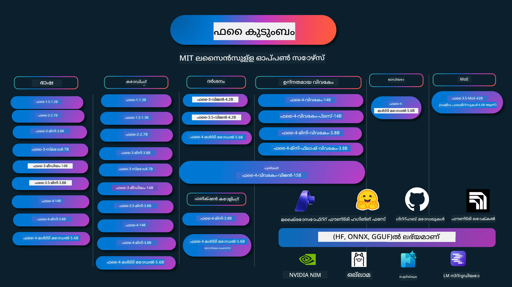

# Phi പാചക പുസ്തകം: Microsoft-ന്റെ Phi മോഡലുകളുമായി ഹാൻഡ്‌സ്-ഓൺ ഉദാഹരണങ്ങൾ

[](https://codespaces.new/microsoft/phicookbook)
[](https://vscode.dev/redirect?url=vscode://ms-vscode-remote.remote-containers/cloneInVolume?url=https://github.com/microsoft/phicookbook)

[](https://GitHub.com/microsoft/phicookbook/graphs/contributors/?WT.mc_id=aiml-137032-kinfeylo)
[](https://GitHub.com/microsoft/phicookbook/issues/?WT.mc_id=aiml-137032-kinfeylo)
[](https://GitHub.com/microsoft/phicookbook/pulls/?WT.mc_id=aiml-137032-kinfeylo)
[](http://makeapullrequest.com?WT.mc_id=aiml-137032-kinfeylo)

[](https://GitHub.com/microsoft/phicookbook/watchers/?WT.mc_id=aiml-137032-kinfeylo)
[](https://GitHub.com/microsoft/phicookbook/network/?WT.mc_id=aiml-137032-kinfeylo)
[](https://GitHub.com/microsoft/phicookbook/stargazers/?WT.mc_id=aiml-137032-kinfeylo)

[](https://discord.com/invite/ByRwuEEgH4)

Phi Microsoft വികസിപ്പിച്ചെടുത്ത ഒരു എഐ മോഡലുകളുടെ ഓപ്പൺ സോഴ്‌സ് പരമ്പരയാണ്.

Phi നിലവിൽ ഏറ്റവും ശക്തിയും ചെലവു тиімдіതയും ഉള്ള ചെറിയ ഭാഷാ മോഡലാണ് (SLM), ബഹുഭാഷാ, നയനീതി, എഴുത്ത്/ചാറ്റ് നിർമാണം, കോഡിംഗ്, ചിത്രങ്ങൾ, ഓഡിയോ തുടങ്ങിയ വളരെയധികം സന്നിവേശങ്ങളിൽ മികച്ച ബഞ്ച്മാർക്കുകളുണ്ട്.

Phi നീക്കം ക്ളൗഡിലേയ്ക്കോ എഡ്ജ് ഉപകരണങ്ങളിലേക്കോ വിന്യസിക്കാവുന്നതാണ്, കൂടാതെ നിങ്ങൾക്ക് കുറവ് കമ്പ്യൂട്ടിംഗുപവർ ഉപയോഗിച്ച് ജനനാത്മക എഐ അപ്ലിക്കേഷനുകൾ എളുപ്പത്തിൽ നിർമ്മിക്കാനാകുന്നു.

ഈ വിഭവങ്ങൾ ഉപയോഗിച്ച് തുടങ്ങാൻ താഴെ കാണിച്ചിരിക്കുന്ന ചുവടുകൾ പിന്തുടരുക:
1. **റിപ്പോസിറ്ററി ഫോർക്കുചെയ്യുക**: Click [](https://GitHub.com/microsoft/phicookbook/network/?WT.mc_id=aiml-137032-kinfeylo)
2. **റിപ്പോസിറ്ററി ക്ലോൺ ചെയ്യുക**:  `git clone https://github.com/microsoft/PhiCookBook.git`
3. [**Microsoft AI Discord കമ്മ്യൂണിറ്റിയിൽ ചേരുക, വിദഗ്ധരും ഡെവലപ്പർമാരും കാണുക**](https://discord.com/invite/ByRwuEEgH4?WT.mc_id=aiml-137032-kinfeylo)



### 🌐 ബഹുബാഷാ പിന്തുണ

#### GitHub ആക്ഷൻ വഴി പിന്തുണ (ഓട്ടോമേറ്റഡ് & എപ്പോഴും പുതിയതായി)

<!-- CO-OP TRANSLATOR LANGUAGES TABLE START -->
[Arabic](../ar/README.md) | [Bengali](../bn/README.md) | [Bulgarian](../bg/README.md) | [Burmese (Myanmar)](../my/README.md) | [Chinese (Simplified)](../zh-CN/README.md) | [Chinese (Traditional, Hong Kong)](../zh-HK/README.md) | [Chinese (Traditional, Macau)](../zh-MO/README.md) | [Chinese (Traditional, Taiwan)](../zh-TW/README.md) | [Croatian](../hr/README.md) | [Czech](../cs/README.md) | [Danish](../da/README.md) | [Dutch](../nl/README.md) | [Estonian](../et/README.md) | [Finnish](../fi/README.md) | [French](../fr/README.md) | [German](../de/README.md) | [Greek](../el/README.md) | [Hebrew](../he/README.md) | [Hindi](../hi/README.md) | [Hungarian](../hu/README.md) | [Indonesian](../id/README.md) | [Italian](../it/README.md) | [Japanese](../ja/README.md) | [Kannada](../kn/README.md) | [Khmer](../km/README.md) | [Korean](../ko/README.md) | [Lithuanian](../lt/README.md) | [Malay](../ms/README.md) | [Malayalam](./README.md) | [Marathi](../mr/README.md) | [Nepali](../ne/README.md) | [Nigerian Pidgin](../pcm/README.md) | [Norwegian](../no/README.md) | [Persian (Farsi)](../fa/README.md) | [Polish](../pl/README.md) | [Portuguese (Brazil)](../pt-BR/README.md) | [Portuguese (Portugal)](../pt-PT/README.md) | [Punjabi (Gurmukhi)](../pa/README.md) | [Romanian](../ro/README.md) | [Russian](../ru/README.md) | [Serbian (Cyrillic)](../sr/README.md) | [Slovak](../sk/README.md) | [Slovenian](../sl/README.md) | [Spanish](../es/README.md) | [Swahili](../sw/README.md) | [Swedish](../sv/README.md) | [Tagalog (Filipino)](../tl/README.md) | [Tamil](../ta/README.md) | [Telugu](../te/README.md) | [Thai](../th/README.md) | [Turkish](../tr/README.md) | [Ukrainian](../uk/README.md) | [Urdu](../ur/README.md) | [Vietnamese](../vi/README.md)

> **സ്ഥാനീയമായി ക്ലോൺ ചെയ്യാൻ ഇഷ്ടപ്പെടുന്നുവോ?**
>
> ഈ റിപോസിറ്ററിയിൽ 50 ഓളം ഭാഷകളിൽ വിവർത്തനങ്ങൾ ഉൾക്കൊള്ളുന്നുണ്ടെന്ന് കണക്കിലെടുത്ത് ഡൗൺലോഡ് സൈസ് വലുതാണ്. വിവർത്തനങ്ങൾ ഒഴിവാക്കി ക്ലോൺ ചെയ്യാൻ sparse checkout ഉപയോഗിക്കുക:
>
> **Bash / macOS / Linux:**
> ```bash
> git clone --filter=blob:none --sparse https://github.com/microsoft/PhiCookBook.git
> cd PhiCookBook
> git sparse-checkout set --no-cone '/*' '!translations' '!translated_images'
> ```
>
> **CMD (Windows):**
> ```cmd
> git clone --filter=blob:none --sparse https://github.com/microsoft/PhiCookBook.git
> cd PhiCookBook
> git sparse-checkout set --no-cone "/*" "!translations" "!translated_images"
> ```
>
> ഇത് കോഴ്സ് പൂർത്തിയാക്കാൻ ആവശ്യമുള്ള എല്ലാം കൂടുതൽ വേഗത്തിൽ ഡൗൺലോഡ് ചെയ്യാൻ സഹായിക്കും.
<!-- CO-OP TRANSLATOR LANGUAGES TABLE END -->

## ഉള്ളടക്കങ്ങളുടെ പട്ടിക
- പരിചയം - [ഫൈ ഫാമിലിയിൽ സ്വാഗതം](./md/01.Introduction/01/01.PhiFamily.md) - [നിങ്ങളുടെ പരിസരം സജ്ജമാക്കൽ](./md/01.Introduction/01/01.EnvironmentSetup.md) - [പ്രധാന സാങ്കേതികവിദ്യകൾ മനസ്സിലാക്കൽ](./md/01.Introduction/01/01.Understandingtech.md) - [ഫൈ മോഡലുകളുടെ എ.ഐ സുരക്ഷ](./md/01.Introduction/01/01.AISafety.md) - [ഫൈ ഹാർഡ്‌വെയർ പിന്തുണ](./md/01.Introduction/01/01.Hardwaresupport.md) - [ഫൈ മോഡലുകളും പ്ലാറ്റ്‌ഫോമുകളിൽ ലഭ്യത](./md/01.Introduction/01/01.Edgeandcloud.md) - [ഗൈഡൻസ്-എ.ഐയും ഫൈയും ഉപയോഗിക്കൽ](./md/01.Introduction/01/01.Guidance.md) - [ഗിറ്റ്‌ഹബ് മാർക്കറ്റ്‌പ്ലേസ് മോഡലുകൾ](https://github.com/marketplace/models) - [അസ്യൂർ എ.ഐ മോഡൽ കാറ്റലോഗ്](https://ai.azure.com) - വ്യത്യസ്ത പരിസരങ്ങളിൽ ഫൈ ഇൻഫറൻസ്സ് - [ഹഗ്‌ഗിംഗ് ഫേയ്സ്](./md/01.Introduction/02/01.HF.md) - [ഗിറ്റ്‌ഹബ് മോഡലുകൾ](./md/01.Introduction/02/02.GitHubModel.md) - [മൈക്രോസോഫ്റ്റ് ഫൗണ്ട്രി മോഡൽ കാറ്റലോഗ്](./md/01.Introduction/02/03.AzureAIFoundry.md) - [ഒല്ലാമ](./md/01.Introduction/02/04.Ollama.md) - [എ.ഐ ടൂൾകിറ്റ് VSകോഡ് (AITK)](./md/01.Introduction/02/05.AITK.md) - [എൻവിഡിയ NIM](./md/01.Introduction/02/06.NVIDIA.md) - [ഫൗണ്ട്രി ലോക്കൽ](./md/01.Introduction/02/07.FoundryLocal.md) - ഫൈ ഫാമിലിയിൽ ഇൻഫറൻസ്സ് - [ഐഓഎസിൽ ഫൈ ഇൻഫറൻസ്സ്](./md/01.Introduction/03/iOS_Inference.md) - [ആൻഡ്രോയിഡിൽ ഫൈ ഇൻഫറൻസ്സ്](./md/01.Introduction/03/Android_Inference.md) - [ജെറ്റ്‌സണിൽ ഫൈ ഇൻഫറൻസ്സ്](./md/01.Introduction/03/Jetson_Inference.md) - [എ.ഐ പിസിയിൽ ഫൈ ഇൻഫറൻസ്സ്](./md/01.Introduction/03/AIPC_Inference.md) - [ആപ്പിൾ MLX ഫ്രെയിംവർക്കുമായി ഫൈ ഇൻഫറൻസ്സ്](./md/01.Introduction/03/MLX_Inference.md) - [ലോക്കൽ സെർവറിൽ ഫൈ ഇൻഫറൻസ്സ്](./md/01.Introduction/03/Local_Server_Inference.md) - [റിമോട്ട് സെർവറിൽ എ.ഐ ടൂൾകിറ്റ് ഉപയോഗിച്ച് ഫൈ ഇൻഫറൻസ്സ്](./md/01.Introduction/03/Remote_Interence.md) - [റസ്റ്റ് ഉപയോഗിച്ച് ഫൈ ഇൻഫറൻസ്സ്](./md/01.Introduction/03/Rust_Inference.md) - [ലോക്കലിൽ ഫൈ-വിഷൻ ഇൻഫറൻസ്സ്](./md/01.Introduction/03/Vision_Inference.md) - [കൈതോ AKS, അസ്യൂർ കണ്ടെയ്‌നറുകൾ (അധികൃത പിന്തുണ) ഉപയോഗിച്ച് ഫൈ ഇൻഫറൻസ്സ്](./md/01.Introduction/03/Kaito_Inference.md) - [ഫൈ ഫാമിലി ക്വാണ്ടിഫിക്കേഷൻ](./md/01.Introduction/04/QuantifyingPhi.md) - [വലമ്പലപ്പിയുടലാൽ ഫൈ-3.5 / 4 ക്വാണ്ടൈസിംഗ് (llama.cpp)](./md/01.Introduction/04/UsingLlamacppQuantifyingPhi.md) - [onnxruntime ജനറേറ്റീവ് എ.ഐ എക്സ്റ്റെൻഷനുകൾ ഉപയോഗിച്ച് ഫൈ-3.5 / 4 ക്വാണ്ടൈസിംഗ്](./md/01.Introduction/04/UsingORTGenAIQuantifyingPhi.md) - [ഇൻറൽ ഓപ്പൺവിനോ ഉപയോഗിച്ച് ഫൈ-3.5 / 4 ക്വാണ്ടൈസിംഗ്](./md/01.Introduction/04/UsingIntelOpenVINOQuantifyingPhi.md) - [ആപ്പിൾ MLX ഫ്രെയിംവർക്ക് ഉപയോഗിച്ച് ഫൈ-3.5 / 4 ക്വാണ്ടൈസിംഗ്](./md/01.Introduction/04/UsingAppleMLXQuantifyingPhi.md) - ഫൈ മൂല്യനിർണയം - [റസ്പോൺസിബിൾ എ.ഐ](./md/01.Introduction/05/ResponsibleAI.md) - [മൈക്രോസോഫ്റ്റ് ഫൗണ്ട്രി മൂല്യനിർണയത്തിന്](./md/01.Introduction/05/AIFoundry.md) - [പ്രംപ്റ്റ്‌ഫ്ലോ ഉപയോഗിച്ച് മൂല്യനിർണയം](./md/01.Introduction/05/Promptflow.md) - അസ്യൂർ എ.ഐ സെർച്ച് ഉപയോഗിച്ച് RAG - [ആസ്യൂർ എ.ഐ സെർച്ച് ഉപയോഗിച്ച് Phi-4-multi and Phi-4-multimodal (RAG) ഉപയോഗിക്കുന്ന വിധം](https://github.com/microsoft/PhiCookBook/blob/main/code/06.E2E/E2E_Phi-4-RAG-Azure-AI-Search.ipynb) - ഫൈ ആപ്ലിക്കേഷൻ വികസന സമ്പിളുകൾ - ടെക്സ്റ്റ് & ചാറ്റ് ആപ്ലിക്കേഷനുകൾ - ഫൈ-4 സാമ്പിളുകൾ - [📓] [Phi-4-mini ONNX മോഡലുമായി ചാറ്റ്](./md/02.Application/01.TextAndChat/Phi4/ChatWithPhi4ONNX/README.md) - [ഫൈ-4 ലോക്കൽ ONNX മോഡലുമായി .NET ചാറ്റ്](../../md/04.HOL/dotnet/src/LabsPhi4-Chat-01OnnxRuntime) - [സെമെന്റിക് കേർണൽ ഉപയോഗിച്ച് ഫൈ-4 ONNX .NET കണ്ട്രോൾ ആപ്പ് ചാറ്റ്](../../md/04.HOL/dotnet/src/LabsPhi4-Chat-02SK) - ഫൈ-3 / 3.5 സാമ്പിളുകൾ - [ഫൈ3, ONNX റൺടൈം വെബ്, വെബ്GPU ഉപയോഗിച്ച് ബ്രൗസറിൽ ലോക്കൽ ചാറ്റ്ബോട്ട്](https://github.com/microsoft/onnxruntime-inference-examples/tree/main/js/chat) - [ഓപ്പൺവിനോ ചാറ്റ്](./md/02.Application/01.TextAndChat/Phi3/E2E_OpenVino_Chat.md) - [മൾട്ടി മോഡൽ - ഇന്ററാക്ടീവ് ഫൈ-3-മിനി & ഓപ്പൺഎ.ഐ വിസ്പർ](./md/02.Application/01.TextAndChat/Phi3/E2E_Phi-3-mini_with_whisper.md) - [MLFlow - ഫൈ-3 ഉപയോഗിച്ച് റാപ്പർ നിർമ്മാണവും MLFlow ഉപയോഗവും](./md//02.Application/01.TextAndChat/Phi3/E2E_Phi-3-MLflow.md) - [മോഡൽ ഒപ്റ്റിമൈസേഷൻ - ഫൈ-3-മിനി മോഡൽ ഓൺഎൻഎക്സ് റൺടൈം വെബിനായുള്ള ഒലിവ് ഉപയോഗം](https://github.com/microsoft/Olive/tree/main/examples/phi3) - [ഫൈ-3 മിനി-4k-instruct-onnx ഉപയോഗിച്ചുള്ള WinUI3 ആപ്പ്](https://github.com/microsoft/Phi3-Chat-WinUI3-Sample/) -[WinUI3 മൾട്ടി മോഡൽ എ.ഐ പവേഡ് നോട്ടുകൾ ആപ്പ് സാമ്പിൾ](https://github.com/microsoft/ai-powered-notes-winui3-sample) - [പ്രംപ്റ്റ്‌ഫ്ലോയിൽ കസ്റ്റം ഫൈ-3 മോഡലുകൾ ഫെയ്‌ൻ-ട്യൂണിംഗ് & സംയോജനം](./md/02.Application/01.TextAndChat/Phi3/E2E_Phi-3-FineTuning_PromptFlow_Integration.md) - [മൈക്രോസോഫ്റ്റ് ഫൗണ്ട്രിയിൽ പ്രംപ്റ്റ്‌ഫ്ലോ ഉപയോഗിച്ച് കസ്റ്റം ഫൈ-3 മോഡലുകൾ ഫെയ്‌ൻ-ട്യൂണിംഗ് & സംയോജനം](./md/02.Application/01.TextAndChat/Phi3/E2E_Phi-3-FineTuning_PromptFlow_Integration_AIFoundry.md) - [മൈക്രോസോഫ്റ്റിന്റെ റസ്പോൺസിബിൾ എ.ഐ ഉപാകാരങ്ങൾക്കു ശ്രദ്ധ കേന്ദ്രീകരിച്ച് മൈക്രോസോഫ്റ്റ് ഫൗണ്ട്രിയിൽ ഫെയ്ൻ-ട്യൂൺ ചെയ്ത ഫൈ-3 / ഫൈ-3.5 മോഡൽ മൂല്യനിർണയം](./md/02.Application/01.TextAndChat/Phi3/E2E_Phi-3-Evaluation_AIFoundry.md) - [📓] [ഫൈ-3.5-മിനി-ഇൻസ്ട്രക്റ്റ് ഭാഷ പുരാണ മാതൃക (ചൈനീസ് / ഇംഗ്ലീഷ്)](./md/02.Application/01.TextAndChat/Phi3/phi3-instruct-demo.ipynb) - [ഫൈ-3.5-ഇൻസ്ട്രക്റ്റ് വെബ്GPU RAG ചാറ്റ്ബോട്ട്](./md/02.Application/01.TextAndChat/Phi3/WebGPUWithPhi35Readme.md) - [ഫൈ-3.5-ഇൻസ്ട്രക്റ്റ് ONNX ഉപയോഗിച്ച് വിൻഡോസ് GPU ഉപയോഗിച്ച് പ്രംപ്റ്റ്‌ഫ്ലോ സൊലൂഷൻ സൃഷ്ടിക്കൽ](./md/02.Application/01.TextAndChat/Phi3/UsingPromptFlowWithONNX.md) - [മൈക്രോസോഫ്റ്റ് ഫൈ-3.5 tflite ഉപയോഗിച്ച് ആൻഡ്രോയ്ഡ് ആപ്പ് സൃഷ്ടിക്കൽ](./md/02.Application/01.TextAndChat/Phi3/UsingPhi35TFLiteCreateAndroidApp.md) - [മൈക്രോസോഫ്റ്റ്. എം.എൽ. ഓൺഎൻഎക്സ് റൺടൈം ഉപയോഗിച്ച് ലോക്കൽ ONNX ഫൈ-3 മോഡൽ ഉപയോഗിച്ചുള്ള Q&A .NET ഉദാഹരണം](../../md/04.HOL/dotnet/src/LabsPhi301) - [സെമെന്റിക് കേർണലും ഫൈ-3 ഉം ഉപയോഗിച്ച് .NET കണ്ട്രോൾ ചാറ്റ് ആപ്പ്](../../md/04.HOL/dotnet/src/LabsPhi302) - അസ്യൂർ എ.ഐ ഇൻഫറൻസ് SDK കോഡ് അടിസ്ഥാനമുള്ള സാമ്പിളുകൾ - ഫൈ-4 സാമ്പിളുകൾ - [📓] [ഫൈ-4-മൾട്ടി മോഡൽ ഉപയോഗിച്ച് പ്രോജക്ട് കോഡ് പിറക്കുക](./md/02.Application/02.Code/Phi4/GenProjectCode/README.md) - ഫൈ-3 / 3.5 സാമ്പിളുകൾ - [മൈക്രോസോഫ്റ്റ് ഫൈ-3 ഫാമിലി ഉപയോഗിച്ച് നിങ്ങളുടെ സ്വന്തം വിസ്വൽ സ്റ്റുഡിയോ കോഡ് ഗിറ്റ്‌ഹബ് കോപിലറ്റ് ചാറ്റ് നിർമ്മിക്കുക](./md/02.Application/02.Code/Phi3/VSCodeExt/README.md) - [ഗിറ്റ്‌ഹബ് മോഡലുകളുമായി ഫൈ-3.5 ഉപയോഗിച്ച് നിങ്ങളുടെ സ്വന്തം വിസ്വൽ സ്റ്റുഡിയോ കോഡ് ചാറ്റ് കോപിലറ്റ് ഏജന്റ് സൃഷ്ടിക്കുക](/md/02.Application/02.Code/Phi3/CreateVSCodeChatAgentWithGitHubModels.md) - ആഡ്വാൻസ്ഡ് റീസൺ സാംബിൾസ് - ഫൈ-4 സാമ്പിളുകൾ - [📓] [ഫൈ-4-മിനി-റീസണിംഗ് അല്ലെങ്കിൽ ഫൈ-4-റീസണിംഗ് സാമ്പിളുകൾ](./md/02.Application/03.AdvancedReasoning/Phi4/AdvancedResoningPhi4mini/README.md) - [📓] [മൈക്രോസോഫ്റ്റ് ഒലീവുമായി ഫൈ-4-മിനി-റീസണിംഗ് ഫെയിൻ-ട്യൂണിംഗ്](./md/02.Application/03.AdvancedReasoning/Phi4/AdvancedResoningPhi4mini/olive_ft_phi_4_reasoning_with_medicaldata.ipynb) - [📓] [ആപ്പിൾ MLX ഉപയോഗിച്ച് ഫൈ-4-മിനി-റീസണിംഗ് ഫെയിൻ-ട്യൂണിംഗ്](./md/02.Application/03.AdvancedReasoning/Phi4/AdvancedResoningPhi4mini/mlx_ft_phi_4_reasoning_with_medicaldata.ipynb) - [📓] [ഗിറ്റ്‌ഹബ് മോഡലുകളോടെ ഫൈ-4-മിനി-റീസണിംഗ്](./md/02.Application/02.Code/Phi4r/github_models_inference.ipynb) - [📓] [മൈക്രോസോഫ്റ്റ് ഫൗണ്ട്രി മോഡലുകളോടൊപ്പം ഫൈ-4-മിനി-റീസണിംഗ്](./md/02.Application/02.Code/Phi4r/azure_models_inference.ipynb) -
ഡെമോസ് - [Phi-4-മിനി ഡെമോസ് ഹഗ്‌ഗിംഗ് ഫേസ് സ്പേസുകളിൽ ഹോസ്റ്റ് ചെയ്യുന്നു](https://huggingface.co/spaces/microsoft/phi-4-mini?WT.mc_id=aiml-137032-kinfeylo) - [Phi-4-മൾട്ടിമോടൽ ഡെമോസ് ഹഗ്‌ഗിംഗ് ഫേസ് സ്പേസുകളിൽ ഹോസ്റ്റ് ചെയ്യുന്നു](https://huggingface.co/spaces/microsoft/phi-4-multimodal?WT.mc_id=aiml-137032-kinfeylo) - വിഷൻ സാമ്പിൾസ് - Phi-4 സാമ്പിൾസ് - [📓] [Phi-4-മൾട്ടിമോടൽ ഉപയോഗിച്ച് ചിത്രങ്ങൾ വായിക്കുകയും കോഡ് ജനറേറ്റ് ചെയ്യുകയും ചെയ്യുക](./md/02.Application/04.Vision/Phi4/CreateFrontend/README.md) - Phi-3 / 3.5 സാമ്പിൾസ് - [📓][Phi-3-വിഷൻ-ഇമേജ് ടെക്സ്റ്റിൽ നിന്ന് ടെക്സ്റ്റിലേക്ക്](./md/02.Application/04.Vision/Phi3/E2E_Phi-3-vision-image-text-to-text-online-endpoint.ipynb) - [Phi-3-വിഷൻ-ONNX](https://onnxruntime.ai/docs/genai/tutorials/phi3-v.html) - [📓][Phi-3-വിഷൻ CLIP എംബെഡിങ്](./md/02.Application/04.Vision/Phi3/E2E_Phi-3-vision-image-text-to-text-online-endpoint.ipynb) - [ഡെമോ: Phi-3 റിസൈക്ലിംഗ്](https://github.com/jennifermarsman/PhiRecycling/) - [Phi-3-വിഷൻ - വിഷ്വൽ ലാംഗ്വേജ് അസിസ്റ്റന്റ് - Phi3-വിഷനും OpenVINO-യും ഉപയോഗിച്ച്](https://docs.openvino.ai/nightly/notebooks/phi-3-vision-with-output.html) - [Phi-3 വിഷൻ Nvidia NIM](./md/02.Application/04.Vision/Phi3/E2E_Nvidia_NIM_Vision.md) - [Phi-3 വിഷൻ OpenVino](./md/02.Application/04.Vision/Phi3/E2E_OpenVino_Phi3Vision.md) - [📓][Phi-3.5 വിഷൻ മൾട്ടി-ഫ്രെയിം അല്ലെങ്കിൽ മൾട്ടി-ഇമേജ് സാമ്പിൾ](./md/02.Application/04.Vision/Phi3/phi3-vision-demo.ipynb) - [Phi-3 വിഷൻ ലോക്കൽ ONNX മോഡൽ Microsoft.ML.OnnxRuntime .NET ഉപയോഗിച്ച്](../../md/04.HOL/dotnet/src/LabsPhi303) - [മെനു അടിസ്ഥാനത്തിലുള്ള Phi-3 വിഷൻ ലോക്കൽ ONNX മോഡൽ Microsoft.ML.OnnxRuntime .NET ഉപയോഗിച്ച്](../../md/04.HOL/dotnet/src/LabsPhi304) - റീസണിംഗ്-വിഷൻ സാമ്പിൾസ് - Phi-4-റീസണിംഗ്-വിഷൻ-15B - [📓] [Phi-4-റീസണിംഗ്-വിഷൻ-15B ഉപയോഗിച്ച് ജയ്വാക്കിംഗ് കണ്ടെത്തൽ](./md/02.Application/10.ReasoningVision/Phi_4_reasoning_vision_15b_Jaywalking.ipynb) - [📓] [Phi-4-റീസണിംഗ്-വിഷൻ-15B ഉപയോഗിച്ച് ഗണിതം](./md/02.Application/10.ReasoningVision/Phi_4_reasoning_vision_15b_Math.ipynb) - [📓] [Phi-4-റീസണിംഗ്-വിഷൻ-15B ഉപയോഗിച്ച് UI കണ്ടെത്തൽ](./md/02.Application/10.ReasoningVision/Phi_4_reasoning_vision_15b_ui.ipynb) - ഗണിതം സാമ്പിൾസ് - Phi-4-മിനി-ഫ്ലാഷ്-റീസണിംഗ്-Instrcut സാമ്പിൾസ് [Phi-4-മിനി-ഫ്ലാഷ്-റീസണിംഗ്-Instrcut ഉപയോഗിച്ച് ഗണിതം ഡെമോ](./md/02.Application/09.Math/MathDemo.ipynb) - ശബ്‌ദ സാമ്പിൾസ് - Phi-4 സാമ്പിൾസ് - [📓] [Phi-4-മൾട്ടിമോടൽ ഉപയോഗിച്ച് ഓഡിയോ ട്രാൻസ്ക്രിപ്റ്റ് എക്സ്ട്രാക്ട് ചെയ്യൽ](./md/02.Application/05.Audio/Phi4/Transciption/README.md) - [📓] [Phi-4-മൾട്ടിമോടൽ ഓഡിയോ സാമ്പിൾ](./md/02.Application/05.Audio/Phi4/Siri/demo.ipynb) - [📓] [Phi-4-മൾട്ടിമോടൽ സ്പീച്ച് ട്രാൻസ്ലേഷൻ സാമ്പിൾ](./md/02.Application/05.Audio/Phi4/Translate/demo.ipynb) - [.NET കൺസോൾ അപ്ലിക്കേഷൻ Phi-4-മൾട്ടിമോടൽ ഓഡിയോ ഉപയോഗിച്ച് ഓഡിയോ ഫയൽ വിശകലനം ചെയ്ത് ട്രാൻസ്ക്രിപ്റ്റ് ജനറേറ്റ് ചെയ്യാനുള്ളത്](../../md/04.HOL/dotnet/src/LabsPhi4-MultiModal-02Audio) - MOE സാമ്പിൾസ് - Phi-3 / 3.5 സാമ്പിൾസ് - [📓] [Phi-3.5 മിക്സ്‌ച്ചർ ഓഫ് എക്സ്പർട്ട്സ് മോഡലുകൾ (MoEs) സോഷ്യൽ മീഡിയ സാമ്പിൾ](./md/02.Application/06.MoE/Phi3/phi3_moe_demo.ipynb) - [📓] [NVIDIA NIM Phi-3 MOE, Azure AI Search, LlamaIndex ഉപയോഗിച്ച് Retrieval-Augmented Generation (RAG) പൈപ്പ്‌ലൈൻ നിർമ്മാണം](./md/02.Application/06.MoE/Phi3/azure-ai-search-nvidia-rag.ipynb) - ഫംഗ്ഷൻ കോളിംഗ് സാമ്പിൾസ് - Phi-4 സാമ്പിൾസ് 🆕 - [📓] [Phi-4-മിനി ഉപയോഗിച്ചുള്ള ഫംഗ്ഷൻ കോളിംഗ്](./md/02.Application/07.FunctionCalling/Phi4/FunctionCallingBasic/README.md) - [📓] [Phi-4-മിനി ഉപയോഗിച്ച് മൾട്ടി-ഏജൻറുകൾ സൃഷ്ടിക്കുന്നതിന് ഫംഗ്ഷൻ കോളിംഗ് ഉപയോഗിക്കൽ](./md/02.Application/07.FunctionCalling/Phi4/Multiagents/Phi_4_mini_multiagent.ipynb) - [📓] [Ollama ഉപയോഗിച്ച് ഫംഗ്ഷൻ കോളിംഗ്](./md/02.Application/07.FunctionCalling/Phi4/Ollama/ollama_functioncalling.ipynb) - [📓] [ONNX ഉപയോഗിച്ച് ഫംഗ്ഷൻ കോളിംഗ്](./md/02.Application/07.FunctionCalling/Phi4/ONNX/onnx_parallel_functioncalling.ipynb) - മൾട്ടിമോടൽ മിക്സിങ്ങ് സാമ്പിൾസ് - Phi-4 സാമ്പിൾസ് 🆕 - [📓] [സാങ്കേതിക പത്രപ്രവർത്തകമായ Phi-4-മൾട്ടിമോടൽ ഉപയോഗിക്കൽ](./md/02.Application/08.Multimodel/Phi4/TechJournalist/phi_4_mm_audio_text_publish_news.ipynb) - [.NET കൺസോൾ അപ്ലിക്കേഷൻ Phi-4-മൾട്ടിമോടൽ ഉപയോഗിച്ച് ചിത്രങ്ങൾ വിശകലനം ചെയ്യുന്നു](../../md/04.HOL/dotnet/src/LabsPhi4-MultiModal-01Images) - ഫൈൻ-ട്യൂണിംഗ് Phi സാമ്പിൾസ് - [ഫൈൻ-ട്യൂണിംഗ് സിനാറിയോസ്](./md/03.FineTuning/FineTuning_Scenarios.md) - [ഫൈൻ-ട്യൂണിംഗ് vs RAG](./md/03.FineTuning/FineTuning_vs_RAG.md) - [Phi-3-നെ വ്യവസായ വിദഗ്ധനാക്കുക - ഫൈൻ-ട്യൂണിംഗ്](./md/03.FineTuning/LetPhi3gotoIndustriy.md) - [VS കോഡ് AI ടൂൾകിറ്റ് ഉപയോഗിച്ച് Phi-3-നെ ഫൈൻ-ട്യൂൺ ചെയ്യുക](./md/03.FineTuning/Finetuning_VSCodeaitoolkit.md) - [Azure മഷീൻ ലേണിംഗ് സർവിസ് ഉപയോഗിച്ച് Phi-3 ഫൈൻ-ട്യൂണിംഗ്](./md/03.FineTuning/Introduce_AzureML.md) - [Lora ഉപയോഗിച്ച് Phi-3 ഫൈൻ-ട്യൂണിംഗ്](./md/03.FineTuning/FineTuning_Lora.md) - [QLora ഉപയോഗിച്ച് Phi-3 ഫൈൻ-ട്യൂണിംഗ്](./md/03.FineTuning/FineTuning_Qlora.md) - [Microsoft Foundry ഉപയോഗിച്ച് Phi-3 ഫൈൻ-ട്യൂണിംഗ്](./md/03.FineTuning/FineTuning_AIFoundry.md) - [Azure ML CLI/SDK ഉപയോഗിച്ച് Phi-3 ഫൈൻ-ട്യൂണിംഗ്](./md/03.FineTuning/FineTuning_MLSDK.md) - [Microsoft Olive ഉപയോഗിച്ച് ഫൈൻ-ട്യൂണിംഗ്](./md/03.FineTuning/FineTuning_MicrosoftOlive.md) - [Microsoft Olive ഹാൻഡ്‌സ്-ഓൺ ലാബുമായി ഫൈൻ-ട്യൂണിംഗ്](./md/03.FineTuning/olive-lab/readme.md) - [Weights and Bias ഉപയോഗിച്ച് Phi-3-vision ഫൈൻ-ട്യൂണിംഗ്](./md/03.FineTuning/FineTuning_Phi-3-visionWandB.md) - [Apple MLX ഫ്രെയിംവർക്ക് ഉപയോഗിച്ച് Phi-3 ഫൈൻ-ട്യൂണിംഗ്](./md/03.FineTuning/FineTuning_MLX.md) - [Phi-3-vision ഫൈൻ-ട്യൂണിംഗ് (ഔദ്യോഗിക പിന്തുണ)](./md/03.FineTuning/FineTuning_Vision.md) - [Kaito AKS, Azure Containers (ഔദ്യോഗിക പിന്തുണ) ഉപയോഗിച്ച് Phi-3 ഫൈൻ-ട്യൂണിംഗ്](./md/03.FineTuning/FineTuning_Kaito.md) - [Phi-3 & 3.5 Vision ഫൈൻ-ട്യൂണിംഗ്](https://github.com/2U1/Phi3-Vision-Finetune) - ഹാൻഡ്‌സ് ഓൺ ലാബ് - [അത്യাধുനിക മോഡലുകൾ അന്വേഷിക്കൽ: LLMs, SLMs, ലോക്കൽ ഡെവലപ്‌മെന്റ് എന്നിവ](https://github.com/microsoft/aitour-exploring-cutting-edge-models) - [NLP വികാസം തുറന്നുനോക്കുക: Microsoft Olive ഉപയോഗിച്ച് ഫൈൻ-ട്യൂണിംഗ്](https://github.com/azure/Ignite_FineTuning_workshop) - അക്കാഡമിക് റിസർച്ച് പേപ്പറുകളും പ്രസിദ്ധീകരണങ്ങളും - [Textbooks Are All You Need II: phi-1.5 സാങ്കേതിക റിപ്പോർട്ട്](https://arxiv.org/abs/2309.05463) - [Phi-3 സാങ്കേതിക റിപ്പോർട്ട്: ഉയർന്ന കഴിവുള്ള ഒരു ഭാഷ മോഡൽ നിങ്ങളുടേ ഫോൺലോക്കലായി](https://arxiv.org/abs/2404.14219) - [Phi-4 സാങ്കേതിക റിപ്പോർട്ട്](https://arxiv.org/abs/2412.08905) - [Phi-4-മിനി സാങ്കേതിക റിപ്പോർട്ട്: കോംപാക്റ്റ് എങ്കിലും ശക്തമായ മൾട്ടിമോടൽ ഭാഷ മോഡലുകൾ Mixture-of-LoRAs വഴി](https://arxiv.org/abs/2503.01743) - [ചെറിയ ഭാഷ മോഡലുകൾ ഇൻ-വീകിൾ ഫംഗ്ഷൻ-കൊളിങ്ങിനായി ആപ്റ്റിമൈസ് ചെയ്യുന്നു](https://arxiv.org/abs/2501.02342) - [(WhyPHI) പലതിനും ചോദ്യോത്തരത്തിനായി PHI-3 ഫൈൻ-ട്യൂണിംഗ്: രീതിശാസ്ത്രം, ഫലങ്ങൾ, വെല്ലുവിളികൾ](https://arxiv.org/abs/2501.01588) - [Phi-4-റീസണിംഗ് സാങ്കേതിക റിപ്പോർട്ട്](https://www.microsoft.com/en-us/research/wp-content/uploads/2025/04/phi_4_reasoning.pdf)
- [Phi-4-mini-reasoning സാങ്കേതിക റിപ്പോർട്ട്](https://huggingface.co/microsoft/Phi-4-mini-reasoning/blob/main/Phi-4-Mini-Reasoning.pdf)
# Phi Cookbook: Microsoft's Phi മോഡലുകളുമായി കൈകാര്യം ചെയ്യാനുള്ള ഉദാഹരണങ്ങൾ

[](https://codespaces.new/microsoft/phicookbook)
[](https://vscode.dev/redirect?url=vscode://ms-vscode-remote.remote-containers/cloneInVolume?url=https://github.com/microsoft/phicookbook)

[](https://GitHub.com/microsoft/phicookbook/graphs/contributors/?WT.mc_id=aiml-137032-kinfeylo)
[](https://GitHub.com/microsoft/phicookbook/issues/?WT.mc_id=aiml-137032-kinfeylo)
[](https://GitHub.com/microsoft/phicookbook/pulls/?WT.mc_id=aiml-137032-kinfeylo)
[](http://makeapullrequest.com?WT.mc_id=aiml-137032-kinfeylo)

[](https://GitHub.com/microsoft/phicookbook/watchers/?WT.mc_id=aiml-137032-kinfeylo)
[](https://GitHub.com/microsoft/phicookbook/network/?WT.mc_id=aiml-137032-kinfeylo)
[](https://GitHub.com/microsoft/phicookbook/stargazers/?WT.mc_id=aiml-137032-kinfeylo)

[](https://discord.com/invite/ByRwuEEgH4)

Phi Microsoft വികസിപ്പിച്ചെടുത്ത ഒരു ഓപ്പൺ സോഴ്‌സ് AI മോഡലുകളുടെ പരമ്പരയാണ്.

Phi നിലവിൽ ഏറ്റവും ശക്തിയും ചെലവുകുറവുമുള്ള ചെറിയ ഭാഷാ മോഡലായ (SLM) ഏറ്റവും നല്ല ബഞ്ച്മാർക്കുകൾ ആണ് 多-ഭാഷ, കാര്യരായിക്കൽ, ടെക്സ്‌റ്റ്/ചാറ്റ് നിർമ്മാണം, കോഡിംഗ്, ചിത്രങ്ങൾ, ഓഡിയോ, മറ്റ് സാഹചര്യങ്ങളിലായി.

നിങ്ങൾ Phi നെ ക്ലൗഡിൽ അല്ലെങ്കിൽ എഡ്ജ് ഉപകരണങ്ങളിൽ വിനിയോഗിക്കാനാകും, കൂടാതെ പരിമിത കമ്പিউട്ടിംഗ് ശേഷിയുള്ള ജെനറേറ്റീവ് AI अनुप്രയോഗങ്ങൾ എളുപ്പത്തിൽ നിർമ്മിക്കാം.

ഈ വിഭവങ്ങൾ ഉപയോഗിക്കാൻ തുടക്കം കുറിക്കാൻ ഈ ചുവടുകൾ പിന്തുടരുക:
1. **റപ്പോസിറ്ററി ഫോർക്ക് ചെയ്യുക**: ക്ലിക്ക് ചെയ്യുക [](https://GitHub.com/microsoft/phicookbook/network/?WT.mc_id=aiml-137032-kinfeylo)
2. **റപ്പോസിറ്ററി ക്ലോൺ ചെയ്യുക**:  `git clone https://github.com/microsoft/PhiCookBook.git`
3. [**Microsoft AI Discord Community-ൽ ചേരുക, വിദഗ്ധർക്കും അനുചരുകൾക്കും കൂടിക്കാഴ്ച നടത്തുക**](https://discord.com/invite/ByRwuEEgH4?WT.mc_id=aiml-137032-kinfeylo)


### 🌐 ബഹുഭാഷാ സമർത്ഥനം

#### GitHub ആക്ഷൻ വഴി പിന്തുണ (സ്വയം ക്രമീകരിച്ചും എല്ലായ്പ്പോഴും പുതുക്കുന്നതായും)

<!-- CO-OP TRANSLATOR LANGUAGES TABLE START -->
[Arabic](../ar/README.md) | [Bengali](../bn/README.md) | [Bulgarian](../bg/README.md) | [Burmese (Myanmar)](../my/README.md) | [Chinese (Simplified)](../zh-CN/README.md) | [Chinese (Traditional, Hong Kong)](../zh-HK/README.md) | [Chinese (Traditional, Macau)](../zh-MO/README.md) | [Chinese (Traditional, Taiwan)](../zh-TW/README.md) | [Croatian](../hr/README.md) | [Czech](../cs/README.md) | [Danish](../da/README.md) | [Dutch](../nl/README.md) | [Estonian](../et/README.md) | [Finnish](../fi/README.md) | [French](../fr/README.md) | [German](../de/README.md) | [Greek](../el/README.md) | [Hebrew](../he/README.md) | [Hindi](../hi/README.md) | [Hungarian](../hu/README.md) | [Indonesian](../id/README.md) | [Italian](../it/README.md) | [Japanese](../ja/README.md) | [Kannada](../kn/README.md) | [Khmer](../km/README.md) | [Korean](../ko/README.md) | [Lithuanian](../lt/README.md) | [Malay](../ms/README.md) | [Malayalam](./README.md) | [Marathi](../mr/README.md) | [Nepali](../ne/README.md) | [Nigerian Pidgin](../pcm/README.md) | [Norwegian](../no/README.md) | [Persian (Farsi)](../fa/README.md) | [Polish](../pl/README.md) | [Portuguese (Brazil)](../pt-BR/README.md) | [Portuguese (Portugal)](../pt-PT/README.md) | [Punjabi (Gurmukhi)](../pa/README.md) | [Romanian](../ro/README.md) | [Russian](../ru/README.md) | [Serbian (Cyrillic)](../sr/README.md) | [Slovak](../sk/README.md) | [Slovenian](../sl/README.md) | [Spanish](../es/README.md) | [Swahili](../sw/README.md) | [Swedish](../sv/README.md) | [Tagalog (Filipino)](../tl/README.md) | [Tamil](../ta/README.md) | [Telugu](../te/README.md) | [Thai](../th/README.md) | [Turkish](../tr/README.md) | [Ukrainian](../uk/README.md) | [Urdu](../ur/README.md) | [Vietnamese](../vi/README.md)

> **പ്രാദേഹം കവറിൽ ക്ലോൺ ചെയ്യണമെന്ന് ആഗ്രഹിക്കുന്നുണ്ടോ?**
>
> ഈ റപ്പോസിറ്ററിയിൽ 50-ലധികം ഭാഷാ തർജ്ജമകൾ ഉൾക്കൊള്ളുന്നു, ഇത് ഡൗൺലോഡ് വലിപ്പം ഏറെ വർദ്ധിപ്പിക്കുന്നു. തർജ്ജമകൾ ഇല്ലാതെ ക്ലോൺ ചെയ്യാൻ സ്പാർസ് ചെക്ക്ഔട്ട് ഉപയോഗിക്കുക:
>
> **Bash / macOS / Linux:**
> ```bash
> git clone --filter=blob:none --sparse https://github.com/microsoft/PhiCookBook.git
> cd PhiCookBook
> git sparse-checkout set --no-cone '/*' '!translations' '!translated_images'
> ```
>
> **CMD (Windows):**
> ```cmd
> git clone --filter=blob:none --sparse https://github.com/microsoft/PhiCookBook.git
> cd PhiCookBook
> git sparse-checkout set --no-cone "/*" "!translations" "!translated_images"
> ```
>
> ഇതിലൂടെ നിങ്ങൾക്ക് കോഴ്‌സ് പൂർത്തിയാക്കാൻ ആവശ്യമായ എല്ലാ കാര്യങ്ങളും വേഗത്തിൽ ലഭിക്കും.
<!-- CO-OP TRANSLATOR LANGUAGES TABLE END -->

## ഉള്ളടക്ക സൂചി

## Phi മോഡലുകൾ ഉപയോഗിക്കുന്നത്

### Microsoft Foundry ലെ Phi

നിങ്ങളുടെ വിവിധ ഹാർഡ്‌വെയർ ഉപകരണങ്ങളിൽ Microsoft Phi എങ്ങനെ ഉപയോഗിക്കാമെന്ന്, എ2ഇ (End-to-End) സൊല്യൂഷനുകൾ എങ്ങനെ നിർമ്മിക്കാമെന്ന് നിങ്ങൾക്ക് പഠിക്കാം. Phi നേരിട്ട് അനുഭവിച്ചറിയാൻ, മോഡലുകളുമായി കളിക്കാനും Phi നിങ്ങളുടെ സാഹചര്യങ്ങൾക്ക് അനുയോജ്യമായി ഇഷ്‌ടാനുസൃതമാക്കാനും ആരംഭിക്കുക, [Microsoft Foundry Azure AI Model Catalog](https://aka.ms/phi3-azure-ai) ഉപയോഗിച്ച്. കൂടുതൽ പഠിക്കാൻ കാണുക Getting Started with [Microsoft Foundry](/md/02.QuickStart/AzureAIFoundry_QuickStart.md)

**പ്ലേഗ്രൗണ്ട്**  
മ ഓരോ മോഡലിനും പ്രത്യേക പ്ലേഗ്രൗണ്ട് ഉണ്ട് മോഡൽ പരീക്ഷിക്കാൻ [Azure AI Playground](https://aka.ms/try-phi3).

### GitHub മോഡലുകളിൽ Phi

Microsoft Phi എങ്ങനെ ഉപയോഗിക്കാമെന്നും, നിങ്ങളുടെ ഹാർഡ്‌വെയർ ഉപകരണങ്ങളിൽ എ2ഇ സൊല്യൂഷനുകൾ എങ്ങനെ നിർമ്മിക്കാമെന്നും നിങ്ങൾക്ക് പഠിക്കാം. Phi നേരിട്ട് അനുഭവിക്കാനായി മോഡലുമായി കളിക്കുക, Phi നിങ്ങളുടെ സാഹചര്യങ്ങൾക്ക് അനുയോജ്യമായി ഇഷ്‌ടാനുസൃതമാക്കുക, [GitHub Model Catalog](https://github.com/marketplace/models?WT.mc_id=aiml-137032-kinfeylo) ഉപയോഗിച്ച്. കൂടുതൽ അറിയാൻ കാണുക Getting Started with [GitHub Model Catalog](/md/02.QuickStart/GitHubModel_QuickStart.md)

**പ്ലേഗ്രൗണ്ട്**  
മ ഓരോ മോഡലിനും പരീക്ഷിക്കാൻ പ്രത്യേക [പ്ലേഗ്രൗണ്ട് ഉണ്ട്](/md/02.QuickStart/GitHubModel_QuickStart.md).

### Hugging Face ലെ Phi

നിങ്ങൾ മോഡൽ [Hugging Face](https://huggingface.co/microsoft) എന്നിടത്തും കണ്ടെത്താം.

**പ്ലേഗ്രൗണ്ട്**  
[Hugging Chat playground](https://huggingface.co/chat/models/microsoft/Phi-3-mini-4k-instruct)

## 🎒 മറ്റ് കോഴ്സുകൾ

നമ്മുടെ ടീം മറ്റു കോഴ്സുകളും ഒരുക്കുന്നു! നോക്കുക:

<!-- CO-OP TRANSLATOR OTHER COURSES START -->
### LangChain
[](https://aka.ms/langchain4j-for-beginners)
[](https://aka.ms/langchainjs-for-beginners?WT.mc_id=m365-94501-dwahlin)
[](https://github.com/microsoft/langchain-for-beginners?WT.mc_id=m365-94501-dwahlin)
---

### Azure / Edge / MCP / Agents
[](https://github.com/microsoft/AZD-for-beginners?WT.mc_id=academic-105485-koreyst)
[](https://github.com/microsoft/edgeai-for-beginners?WT.mc_id=academic-105485-koreyst)
[](https://github.com/microsoft/mcp-for-beginners?WT.mc_id=academic-105485-koreyst)
[](https://github.com/microsoft/ai-agents-for-beginners?WT.mc_id=academic-105485-koreyst)

---
 
### Generative AI Series
[](https://github.com/microsoft/generative-ai-for-beginners?WT.mc_id=academic-105485-koreyst)
[-9333EA?style=for-the-badge&labelColor=E5E7EB&color=9333EA)](https://github.com/microsoft/Generative-AI-for-beginners-dotnet?WT.mc_id=academic-105485-koreyst)
[-C084FC?style=for-the-badge&labelColor=E5E7EB&color=C084FC)](https://github.com/microsoft/generative-ai-for-beginners-java?WT.mc_id=academic-105485-koreyst)
[-E879F9?style=for-the-badge&labelColor=E5E7EB&color=E879F9)](https://github.com/microsoft/generative-ai-with-javascript?WT.mc_id=academic-105485-koreyst)

---
 
### കോർ ലേണിംഗ്
[](https://aka.ms/ml-beginners?WT.mc_id=academic-105485-koreyst)
[](https://aka.ms/datascience-beginners?WT.mc_id=academic-105485-koreyst)
[](https://aka.ms/ai-beginners?WT.mc_id=academic-105485-koreyst)
[](https://github.com/microsoft/Security-101?WT.mc_id=academic-96948-sayoung)
[](https://aka.ms/webdev-beginners?WT.mc_id=academic-105485-koreyst)
[](https://aka.ms/iot-beginners?WT.mc_id=academic-105485-koreyst)
[](https://github.com/microsoft/xr-development-for-beginners?WT.mc_id=academic-105485-koreyst)

---
 
### കോപൈലറ്റ് സീരീസ്
[](https://aka.ms/GitHubCopilotAI?WT.mc_id=academic-105485-koreyst)
[](https://github.com/microsoft/mastering-github-copilot-for-dotnet-csharp-developers?WT.mc_id=academic-105485-koreyst)
[](https://github.com/microsoft/CopilotAdventures?WT.mc_id=academic-105485-koreyst)
<!-- CO-OP TRANSLATOR OTHER COURSES END -->

## ഉത്തരദായിത്വമുള്ള AI

മൈക്രോസോഫ്റ്റ് നമ്മുടെ ഉപഭോക്താക്കൾക്ക് നമ്മുടെ AI ഉൽപ്പന്നങ്ങൾ ഉത്തരവാദിത്വത്തോടെ ഉപയോഗിക്കാനായി സഹായിക്കാന്‍ പ്രതിജ്ഞാബദ്ധമാണ്, നമ്മുടെ പഠനങ്ങൾ പങ്കിടുകയും Transparence Notes, Impact Assessments എന്നിവ പോലുള്ള ഉപകരണങ്ങളിലൂടെ വിശ്വാസം അടിസ്ഥാനമാക്കിയുള്ള പങ്കാളിത്തങ്ങൾ സൃഷ്ടിക്കുകയും ചെയ്യുന്നു. ഈ വിഭവങ്ങളിൽ പലതും [https://aka.ms/RAI](https://aka.ms/RAI) സൈറ്റിൽ ലഭ്യമാണ്.
ഉത്തമത്വം, വിശ്വാസ്യതയും സുരക്ഷയും, സ്വകാര്യതയും സുരക്ഷിതത്വവും, ഉൾപ്പെടുത്തലും, വ്യക്തിത്വവും ഉത്തരവാദിത്വവും എന്ന മൈക്രോസോഫ്റ്റിന്റെ AI സിദ്ധാന്തങ്ങളെ അടിസ്ഥാനമാക്കിയുള്ളതാണ് ഉത്തരദായിത്വമുള്ള AI-യുടെ സമീപനം.

ഈ സാമ്പിൾയിൽ ഉപയോഗിച്ചിരിക്കുന്നവ പോലുള്ള വലിയ തോതിലുള്ള നാചുറൽ ലാംഗ്വേജ്, ഇമേജ്, സ്പീച്ച് മാതൃകകൾ ബഹുഭൂരിപക്ഷം അവർ അനീതിമാർന്ന, വിശ്വസനീയമല്ലാത്ത, അല്ലെങ്കില്‍ അപമാനകരമായി പെരുമാറാനും അത് ഹാനികരമായ ഫലങ്ങൾ ഉണ്ടാക്കാനും സാധ്യതയുണ്ട്. അപകടങ്ങളും പരിമിതികളുമെന്താണെന്ന് അറിയാൻ [Azure OpenAI service Transparency note](https://learn.microsoft.com/legal/cognitive-services/openai/transparency-note?tabs=text) കാണുക.

ഈ അപകടങ്ങൾ കുറയ്ക്കാനുള്ള ശുപാർശ ചെയ്ത സമീപനം നിങ്ങളുടെ ആർക്കിടെക്ചറിൽ ഒരു സുരക്ഷാ സംവിധാനമുണ്ടാക്കലാണ്, ഇത് ഹാനികരമായ പെരുമാറ്റം കണ്ടെത്താനും തടയാനും കഴിയും. [Azure AI Content Safety](https://learn.microsoft.com/azure/ai-services/content-safety/overview) സ്വതന്ത്രമായ ഒരു സംരക്ഷണ പാളിയാണ്, ആപ്ലിക്കേഷനുകളിലും സേവനങ്ങളിലും ഹാനികരമായ ഉപയോക്തൃ സമ്പാദിതവും AI-ൽ നിന്നുമുള്ള ഉള്ളടക്കം കണ്ടെത്താൻ കഴിവുള്ളത്. Azure AI Content Safety ടെക്സ്റ്റ്, ഇമേജ് API-കൾ ഉൾക്കൊള്ളുന്നതാണ്, ഇത് ഹാനികരമായ ഉള്ളടക്കം കണ്ടെത്താൻ സഹായിക്കുന്നു. Microsoft Foundry-യിൽ, Content Safety സേവനം നിങ്ങൾക്ക് വ്യത്യസ്ത മോഡലിറ്റികളിൽ ഹാനികരമായ ഉള്ളടക്കം കണ്ടെത്താൻ സാമ്പിൾ കോഡ് കാണാനും പരീക്ഷിക്കാനും അനുവദിക്കുന്നു. ചുവടെയുള്ള [quickstart ഡോക്യുമെന്റേഷൻ](https://learn.microsoft.com/azure/ai-services/content-safety/quickstart-text?tabs=visual-studio%2Clinux&pivots=programming-language-rest) സേവനത്തില്‍ അഭ്യർത്ഥനകൾ നടത്തുന്നത് 안내 ചെയ്യുന്നു.

മറ്റൊരു പരിഗണിക്കുന്ന വശം ആപ്ലിക്കേഷന്റെ മൊത്തം പ്രകടനമാണ്. മൾട്ടി-മോഡൽ, മൾട്ടി-മോഡൽ ആപ്ലിക്കേഷനുകളിൽ, സിസ്റ്റം നിങ്ങളും നിങ്ങളുടെ ഉപഭോക്താക്കളും പ്രതീക്ഷിക്കുന്ന തരത്തിൽ പ്രവർത്തിക്കണമെന്നും, ഹാനികരമായ ഫലങ്ങൾ സൃഷ്ടിക്കാതിരിക്കണമെന്നും performance എന്നത് അർത്ഥപ്പെടുന്നു. നിങ്ങളുടെ മൊത്തം ആപ്ലിക്കേഷന്റെ പ്രകടനം വിലയിരുത്തുന്നത് പ്രധാനമാണ്, [Performance and Quality and Risk and Safety evaluators](https://learn.microsoft.com/azure/ai-studio/concepts/evaluation-metrics-built-in) ഉപയോഗിച്ച്. നിങ്ങൾക്ക് സ്വന്തം [custom evaluators](https://learn.microsoft.com/azure/ai-studio/how-to/develop/evaluate-sdk#custom-evaluators) സൃഷ്ടിക്കുകയും വിലയിരുത്തുകയും ചെയ്യാനുള്ള കഴിവുണ്ട്.

[Azure AI Evaluation SDK](https://microsoft.github.io/promptflow/index.html) ഉപയോഗിച്ച് നിങ്ങളുടെ AI ആപ്ലിക്കേഷൻ വികസന പരിസ്ഥിതിയിൽ വിലയിരുത്താം. ടെസ്റ്റ് ഡാറ്റാ സെറ്റ് അല്ലെങ്കിൽ ലക്ഷ്യം നൽകുമ്പോൾ, നിങ്ങളുടെ generative AI ജെനറേഷനുകൾ ഇൻബിൽട്ട് ഇവാലുവേറ്റർമാരോ നിങ്ങളുടെ ഇഷ്ടാനുസൃത ഇവാലുവേറ്റർമാരോ ഉപയോഗിച്ച് സാന്ദ്രമായി അളക്കപ്പെടും. നിങ്ങളുടെ സിസ്റ്റം വിലയിരുത്താനായി azure ai evaluation sdk ഉപയോഗിച്ച് തുടങ്ങാനായി, [quickstart guide](https://learn.microsoft.com/azure/ai-studio/how-to/develop/flow-evaluate-sdk) അനുസരിക്കാം. ഒരു ഇവാലുവേഷൻ നടത്തുന്നതിന് ശേഷം, നിങ്ങൾക്ക് [Microsoft Foundry-ൽ ഫലങ്ങൾ ദൃശ്യവൽക്കരിക്കാം](https://learn.microsoft.com/azure/ai-studio/how-to/evaluate-flow-results).

## ട്രേഡ്മാർക്കുകൾ

ഈ പ്രോജക്ടിൽ പ്രോജക്ടുകൾ, ഉൽപ്പന്നങ്ങൾ, സേവനങ്ങൾ എന്നിവയ്‌ക്കുള്ള ട്രേഡ്മാർക്കുകൾ അല്ലെങ്കിൽ ലോഗോകൾ ഉണ്ടാകാം. മൈക്രോസോഫ്റ്റ് ട്രേഡ്മാർക്കുകൾ അല്ലെങ്കിൽ ലോഗോകളുടെ മുസ്തഫ ആയി ഉപയോഗിക്കുന്നത് [Microsoft's Trademark & Brand Guidelines](https://www.microsoft.com/legal/intellectualproperty/trademarks/usage/general) പാലിക്കേണ്ടതാണ്.
ഈ പ്രോജക്ടിന്റെ തിരുത്തിയ പതിപ്പുകളിൽ മൈക്രോസോഫ്റ്റ് ട്രേഡ്മാർക്കുകളുടെ ഉപയോഗം ആശയക്കുഴപ്പമുണ്ടാക്കരുത് അല്ലെങ്കിൽ മൈക്രോസോഫ്റ്റ് സ്പോൺസർഷിപ്പ് സൂചിപ്പിക്കരുത്. മൂന്നാംകക്ഷി ട്രേഡ്മാർക്ക് അല്ലെങ്കിൽ ലോഗോകളുടെ ഉപയോഗം ആ മൂന്നാംകക്ഷിയുടെ നയങ്ങൾക്കു വിധേയമാണ്.

## സഹായം നേടുക

എഐ ആപ്പുകൾ നിർമ്മിക്കുന്നതിൽ നിങ്ങൾക്ക് അസഹായത ഉണ്ടെങ്കിൽ അല്ലെങ്കിൽ ചോദ്യം ഉണ്ടെങ്കിൽ ചേരുക:

[](https://aka.ms/foundry/discord)

ഉൽപ്പന്ന താളുകൾക്കായി ഫീഡ്‌ബാക്ക് അല്ലെങ്കിൽ പിശകുകൾ ഉണ്ടെങ്കിൽ കാണാൻ:

[](https://aka.ms/foundry/forum)

---

<!-- CO-OP TRANSLATOR DISCLAIMER START -->
**അസ്വീകാര്യത**:
ഈ ഡോക്യുമെന്റ് [Co-op Translator](https://github.com/Azure/co-op-translator) എന്ന AI വിവർത്തന സേവനം ഉപയോഗിച്ച് വിവർത്തനം ചെയ്തതാണ്. നാം കൃത്യതയ്ക്കായി ശ്രമിച്ചെങ്കിലും, ഓട്ടോമേറ്റഡ് വിവർത്തനങ്ങളിൽ പിശകുകൾ അല്ലെങ്കിൽ അസമർത്ഥതകൾ ഉണ്ടാകാമെന്ന് ദയവായി ശ്രദ്ധിക്കണമെന്നും. ആദ്യഭാഷയിൽ ഉള്ള അസൽ ഡോക്യുമെന്റ് അധികാരപരമായ ഉറവിടമായിരിക്കണം. നിർണായകമായ വിവരങ്ങൾക്ക്, പ്രൊഫഷണൽ മനുഷ്യ വിവർത്തനം നിർദ്ദേശിക്കുന്നു. ഈ വിവർത്തനത്തിന്റെ ഉപയോഗത്തിൽ ഉണ്ടാകുന്ന എല്ലാ തെറ്റിദ്ധാരണകൾക്കും അല്ലെങ്കിൽ വ്യാഖ്യാനപ്രവൃത്തികൾക്കും ഞങ്ങൾ ഉത്തരവാദികളാകുന്നില്ല.
<!-- CO-OP TRANSLATOR DISCLAIMER END -->