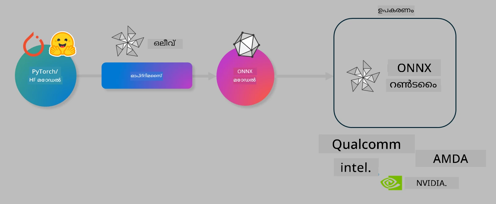

# ലാബ്. ഓൺ-ഡിവൈസിൽ ഇൻഫറൻസിന് AI മോഡലുകൾ Optimize ചെയ്യുക

## പരിചയം 

> [!IMPORTANT]
> ഈ ലാബിന് **Nvidia A10 or A100 GPU** അനുബന്ധ ഡ്രൈവര്‍കളും CUDA ടൂള്കിറ്റും (പതിപ്പ് 12+) ഇന്‍സ്റ്റാള്‍ ചെയ്തിരിക്കണം.

> [!NOTE]
> ഇത് **35-മിനിറ്റ്** ദൈര്‍ഘ്യമുള്ള ലാബാണ്, OLIVE ഉപയോഗിച്ച് ഓൺ-ഡിവൈസ് ഇൻഫറൻസിന് മോഡലുകൾ കാര്യക്ഷമമാക്കുന്നതിനുള്ള മുഖ്യ ആശയങ്ങളിലേക്ക് പ്രായോഗിക പരിചയം നല്‍കുന്ന ലാബാണ്.

## പഠന ലക്ഷ്യങ്ങൾ

ഈ ലാബ് പൂർത്തിയാക്കിയപ്പോള്‍, OLIVE ഉപയോഗിച്ച് നിങ്ങൾക്ക് സാധ്യമാവുന്നത്:

- AWQ quantization രീതിയിലൂടെ ഒരു AI മോഡൽ ക്വാണ്ടൈസ് ചെയ്യുക.
- ഒരു പ്രത്യേക ടാസ്‌കിന് അനുയോജ്യമായ രീതിയിൽ AI മോഡൽ ഫൈൻ-ട്യൂൺ ചെയ്യുക.
- ONNX Runtime-ൽ കാര്യക്ഷമമായ ഓൺ-ഡിവൈസ് ഇൻഫറൻസിന് LoRA അഡാപ്റ്ററുകൾ (ഫൈൻ-ട്യൂൺ ചെയ്ത മോഡൽ) സൃഷ്ടിക്കുക.

### Olive എന്താണ്

Olive (*O*NNX *live*) ഒരു മോഡൽ ഓപ്റ്റിമൈസേഷൻ ടൂൾകിറ്റാണ് അതിന്റെ CLI-യോടൊപ്പം, ഇത് നിങ്ങൾക്ക് ONNX runtime +++https://onnxruntime.ai+++ ലെ ഗുണനിലവാരവും പ്രകടനവും നിലനിർത്തി മോഡലുകൾ ഡെലിവർ ചെയ്യാൻ സഹായിക്കുന്നു.



Olive-യ്ക്ക് ഇൻപുട്ട് സാധാരണയായി PyTorch അല്ലെങ്കിൽ Hugging Face മോഡലായിരിക്കും, ഔട്ട്‌പുട്ട് എന്നാൽ ഒരു optimize ചെയ്ത ONNX മോഡൽ ആണ്, ഇത് ONNX runtime ഓടിക്കുന്ന ഒരു ഡിവൈസിൽ (ഡെപ്ലോയ്മെന്റ് ടാർഗറ്റ്) നിർവഹിക്കുന്നു. Olive ഡെപ്ലോയ്മെന്റ് ടാർഗറ്റിന്റെ AI ആക്സിലറേറ്റർ (NPU, GPU, CPU) നുസരിച്ച് മോഡൽ optimize ചെയ്യും, ആണ് Դա hardware vendor-കൾ പോലുള്ള Qualcomm, AMD, Nvidia അല്ലെങ്കിൽ Intel നൽകുന്നത്.

Olive ഒരു *workflow* നടപ്പാക്കുന്നു, അതായത് ഓരോ വ്യക്തിഗത മോഡൽ ഓപ്റ്റിമൈസേഷൻ തസ്തവങ്ങളായ *passes* എന്ന പേരിലുള്ള അതൊന്നിന്റെ അതി-ക്രമീകരിച്ച സെക്വൻസ് — ഉദാഹരണമായി passes-ൽ ഉൾപ്പെടുന്നു: മോഡൽ കമ്പ്രഷൻ, ഗ്രാഫ് ക്യാപ്ചർ, ക്വാണ്ടൈസേഷൻ, ഗ്രാഫ് ഓപ്റ്റിമൈസേഷൻ. ഓരോ പാസിനും ഏറ്റവും നല്ല മെട്രിക്കുകൾ, ഉദാഹരണത്തിന് ശരിയായություն (accuracy)യും ലാറ്റൻസിയും (latency) ഉൾപ്പെടെ, നേടാൻ ശരിയാക്കിയെടുക്കാവുന്ന ചില പാരാമീറ്ററുകൾ ഉണ്ടാകുന്നു, ഇവ ഓരോ evaluator-ഉം മൂല്യനിർണ്ണയം ചെയ്യുന്നു. Olive ഒരു സെർച്ച് സ്റ്റ്രാറ്റജിയെ ഉപയോഗിക്കുന്നു, ഇത് ഒരു സെർച്ച് ആൽഗോരിതം ഉപയോഗിച്ച് ഓരോ പാസും ഒന്ന്-ഒന്ന് അല്ലെങ്കിൽ പാസുകൾ ഒരു സമുച്ചയമായി ഓട്ടോ-ട്യൂൺ ചെയ്യുന്നു.

#### Olive-ന്റെ ഗുണങ്ങൾ

- **പരിശോധനയും തെറ്റായ ശ്രമത്തിന്റെയും അസ്വസ്ഥതയും സമയം കുറയ്ക്കുക**: ഗ്രാഫ് ഓപ്റ്റിമൈസേഷൻ, കമ്പ്രഷൻ, ക്വാണ്ടൈസേഷൻ എന്നിവയ്ക്കുള്ള വിവിധ സാങ്കേതികവിദ്യകൾ കൈകൊണ്ട് പരീക്ഷിക്കുമ്പോഴുള്ള പരീക്ഷണ-കഴിഞ്ഞുവീഴും സമയത്തെ അസ്വസ്ഥത കുറയ്ക്കുന്നു. നിങ്ങളുടെ ഗുണനിലവാരവും പ്രകടന പരിധികളും നിർവചിച്ച് Olive അതിനനുസരിച്ച് മികച്ച മോഡൽ സ്വയം കണ്ടെത്തട്ടെയെന്ന് അനുവദിക്കുക.
- **40+ ബിൽറ്റ്-ഇൻ മോഡൽ ഓപ്റ്റിമൈസേഷൻ ഘടകങ്ങൾ** quantization, compression, graph optimization, finetuning എന്നിവയിലുള്ള cutting edge സാങ്കേതികങ്ങൾ ഉൾക്കൊള്ളുന്നു.
- **ഉപയോഗിക്കാൻ എളുപ്പമുള്ള CLI** സാധാരണ മോഡൽ ഓപ്റ്റിമൈസേഷൻ ടാസ്‌കുകൾക്കായി. ഉദാഹരണത്തിന്, olive quantize, olive auto-opt, olive finetune.
- മോഡൽ പാക്കേജിംഗ് ആൻഡ് ഡെപ്ലോയ്‌മെന്റ് ബിൽറ്റ്-ഇൻ.
- **Multi LoRA serving**-നുള്ള മോഡലുകൾ ജനറേറ്റ് ചെയ്യുന്നത് പിന്തുണയ്ക്കുന്നു.
- YAML/JSON ഉപയോഗിച്ച് workflows നിർമ്മിച്ച് മോഡൽ ഓപ്റ്റിമൈസേഷൻയും ഡെപ്ലോയ്‌മെന്റ് ടാസ്ക്കുകളും ഓർക്കസ്ട്രേറ്റ് ചെയ്യാം.
- **Hugging Face** 및 **Azure AI** ഇന്റഗ്രേഷൻ.
- ചിലവ് **സേവ് ചെയ്യാൻ** സഹായിക്കുന്ന ബിൽറ്റ്-ഇൻ **കാഷിംഗ്** സമ്പ്രദായം.

## ലാബ് നിർദ്ദേശങ്ങൾ
> [!NOTE]
> ദയവായി നിങ്ങൾ Azure AI Hub ഉം Project ഉം പ്രൊവിഷൻ ചെയ്ത് Lab 1 അനുസരിച്ച് നിങ്ങളുടെ A100 compute സജ്ജമാക്കിയിട്ടുണ്ടെന്നു ഉറപ്പാക്കുക.

### ഘട്ടം 0: നിങ്ങളുടെ Azure AI Compute-യുമായി കണക്ട് ചെയ്യുക

നീங்கள் **VS Code**-യിലെ remote ഫീച്ചർ ഉപയോഗിച്ച് Azure AI compute-യുമായി കണക്ട് ചെയ്യുമെന്നും.

1. നിങ്ങളുടെ **VS Code** ഡെസ്ക്ടോപ്പ് അപ്ലിക്കേഷൻ തുറക്കുക:
1. **Shift+Ctrl+P** ഉപയോഗിച്ച് **command palette** തുറക്കുക
1. command palette-ലിൽ **AzureML - remote: Connect to compute instance in New Window** എന്ന് തിരയുക.
1. Compute-യിലേക്ക് കണക്ട് ആവാൻ സ്ക്രീനിലുള്ള നിർദേശങ്ങൾ പിന്തുടരുക. ഇത് നിങ്ങളുടെ Azure Subscription, Resource Group, Project, Lab 1-ൽ നിങ്ങൾ സജ്ജമാക്കിയ Compute നാമം തിരഞ്ഞെടുക്കൽ ഉൾപ്പെടാം.
1. നിങ്ങൾ Azure ML Compute നോട് കണക്ട് ചെയ്തിട്ടുണ്ടെങ്കിൽ ഇത് **Visual Code**-ന്റെ ഇടതുവശത്തെ താഴെയുള്ള ഭാഗത്ത് `><Azure ML: Compute Name` എന്ന് കാണിച്ചുനോക്കും

### ഘട്ടം 1: ഈ റിപ്പോ ക്ലോൺ ചെയ്യുക

VS Code-ൽ, **Ctrl+J** ഉപയോഗിച്ച് ഒരു പുതിയ ടെർമിനൽ തുറന്ന് ഈ റിപ്പോ ക്ലോൺ ചെയ്യാവുന്നതാണ്:

In the terminal you should see the prompt

```
azureuser@computername:~/cloudfiles/code$ 
```
സൊല്യൂഷൻ ക്ലോൺ ചെയ്യുക 

```bash
cd ~/localfiles
git clone https://github.com/microsoft/phi-3cookbook.git
```

### ഘട്ടം 2: VS Code-ൽ ഫോൾഡർ തുറക്കുക

സംബന്ധിച്ച ഫോൾഡറിൽ VS Code തുറക്കാൻ ടെർമിനലിൽ താഴെയുള്ള കമാൻഡ് 실행 ചെയ്‌താൽ പുതിയ വിൻഡോ തുറക്കും:

```bash
code phi-3cookbook/code/04.Finetuning/Olive-lab
```

അല്ലാത്ത പക്ഷം **File** > **Open Folder** തിരഞ്ഞെടുക്കിയും ഫോൾഡർ തുറക്കാൻ കഴിയും. 

### ഘട്ടം 3: ഡിപ്പൻഡൻസികൾ

നിങ്ങളുടെ Azure AI Compute Instance-ൽ VS Code-ൽ ഒരു ടെർമിനൽ വിൻഡോ തുറന്ന് (സൂചന: **Ctrl+J**) ഡിപ്പൻഡൻസികൾ ഇൻസ്റ്റാൾ ചെയ്യുന്നതിനുള്ള താഴെയുള്ള കമാൻഡുകൾ 실행 ചെയ്യുക:

```bash
conda create -n olive-ai python=3.11 -y
conda activate olive-ai
pip install -r requirements.txt
az extension remove -n azure-cli-ml
az extension add -n ml
```

> [!NOTE]
> എല്ലാ ഡിപ്പൻഡൻസികളും ഇൻസ്റ്റാൾ ചെയ്യാൻ ഏകദേശം ~5mins വേണ്ടി വരും.

ഈ ലാബിൽ നിങ്ങൾ Azure AI Model catalog-ൽ മോഡലുകൾ ഡൗൺലോഡ് ചെയ്യുകയും അപ്‌ലോഡ് ചെയ്യുകയും ചെയ്യും. അതുകൊണ്ട് മോഡൽ കാറ്റലോഗ് ആക്സസ് ചെയ്യുന്നതിനായി, Azure-ലായി ലോഗിൻ ചെയ്യേണ്ടതുണ്ട്:

```bash
az login
```

> [!NOTE]
> ലോഗിൻ സമയത്ത് നിങ്ങൾക്ക് സബ്സ്ക്രിപ്ഷൻ സെലക്ട് ചെയ്യാൻ ആവശ്യപ്പെടും. ഈ ലാബിനായി നൽകിയ സബ്സ്ക്രിപ്ഷൻ സെറ്റ് ചെയ്യുന്നതായാൽ ഉറപ്പാക്കുക.

### ഘട്ടം 4: Olive കമാൻഡുകൾ 실행 ചെയ്യുക 

നിങ്ങളുടെ Azure AI Compute Instance-ൽ VS Code-ൽ ഒരു ടെർമിനൽ വിൻഡോ തുറന്ന് (സൂചന: **Ctrl+J**) `olive-ai` conda environment ആക്ടിവേറ്റ് ചെയ്തിട്ടുണ്ടെന്ന് ഉറപ്പാക്കുക:

```bash
conda activate olive-ai
```

അടുത്തതായി, താഴെയുള്ള Olive കമാൻഡുകൾ കമാൻഡ് ലൈൻ-ൽ 실행 ചെയ്യുക.

1. **Inspect the data:** ഈ ഉദാഹരണത്തിൽ, നിങ്ങൾ Phi-3.5-Mini മോഡൽ ഫൈൻ-ട്യൂൺ ചെയ്യാൻ പോകുകയാണ്, ഇത് യാത്രയുമായി ബന്ധപ്പെട്ട ചോദ്യങ്ങൾക്ക് പ്രത്യേകിച്ചും ഉത്തരം നൽകുന്നതിൽ വിദഗ്ധമാക്കാനാണ് ലക്ഷ്യം. താഴെ കൊടുത്തിരിക്കുന്ന കോഡ് ഡാറ്റാസെറ്റിന്റെ ആദ്യ ചില റെക്കോർഡുകൾ JSON lines ഫോർമാറ്റിൽ പ്രദർശിപ്പിക്കുന്നു:
   
    ```bash
    head data/data_sample_travel.jsonl
    ```
1. **Quantize the model:** മോഡൽ പരിശീലിപ്പിക്കുന്നതിന് മുൻപ്, താഴെ കാണുന്ന കമാൻഡ് ഉപയോഗിച്ച് Active Aware Quantization (AWQ) എന്ന സാങ്കേതികവിദ്യയോടുള്ള ക്വാണ്ടൈസേഷൻ ചെയ്യുക +++https://arxiv.org/abs/2306.00978+++. AWQ ഇൻഫറൻസ് സമയത്ത് ഉണ്ടാകുന്ന ആക്റ്റിവേഷനുകൾ പരിഗണിച്ച് മോഡലിന്റെ വേട്ടുകൾ ക്വാണ്ടൈസ് ചെയ്യുന്നു. ഇത് ക്വാണ്ടൈസേഷൻ പ്രക്രിയ ആക്റ്റിവേഷനുകളിൽ ഉള്ള യഥാർത്ഥ ഡാറ്റാ വിതരണത്തെ പരിഗണിച്ചതുകൊണ്ട് പരമ്പരാഗത വേറ്റ് ക്വാണ്ടൈസേഷൻ രീതികളുമായി താരതമ്യപ്പെടുത്തുമ്പോൾ മോഡൽ കൃത്യത മെച്ചമായി നിലനിർത്താൻ സഹായിക്കുന്നു.
    
    ```bash
    olive quantize \
       --model_name_or_path microsoft/Phi-3.5-mini-instruct \
       --trust_remote_code \
       --algorithm awq \
       --output_path models/phi/awq \
       --log_level 1
    ```
    
    ഇത് AWQ ക്വാണ്ടൈസേഷൻ പൂര്‍ത്തിയാക്കാൻ ഏകദേശം **~8mins** എടുക്കും, കൂടാതെ ഇത് മോഡൽ സൈസ് **~7.5GB-ൽ നിന്നു ~2.5GB** രൂപത്തിൽ കുറയ്ക്കും.
   
   ഈ ലാബിൽ, ഉദാഹരണത്തിന് `microsoft/Phi-3.5-mini-instruct` എന്നിവയുപോലെ Hugging Face-ലായിരുന്ന മോഡലുകൾ ഇൻപുട്ട് ആയി നൽകുന്നത് കാണിക്കുന്നു. എന്നിരുന്നാലും, Olive നിങ്ങൾക്ക് Azure AI കാറ്റലോഗിൽ നിന്നുള്ള മോഡലുകൾ `model_name_or_path` ആർഗ്യുമെന്റിൽ Azure AI asset ID (ഉദാഹരണം:  `azureml://registries/azureml/models/Phi-3.5-mini-instruct/versions/4`) ആയി അപ്ഡേറ്റ് ചെയ്യുന്നതിലൂടെ ഇൻപുട്ട് ചെയ്യാനും അനുവദിക്കുന്നു. 

1. **Train the model:** അടുത്തതായി, `olive finetune` കമാൻഡ് ക്വാണ്ടൈസ് ചെയ്ത മോഡൽ ഫൈൻ-ട്യൂൺ ചെയ്യുന്നതാണ്. ക്വാണ്ടൈസേഷൻ ഫൈൻ-ട്യൂണിങിന് മുമ്പ് ചെയ്യുന്നത് പിന്നീട് ചെയ്യുന്നതിൽനിന്ന് മിൽക്കുള്ള accuracy മെച്ചപ്പെടുത്തുന്നു, കാരണമെങ്കിൽ ഫൈൻ-ട്യൂൺ പ്രക്രിയ ക്വാണ്ടൈസേഷനിൽ നിന്നുള്ള ചില നഷ്ടം പുനരുജ്ജീവിപ്പിക്കുന്നു.
    
    ```bash
    olive finetune \
        --method lora \
        --model_name_or_path models/phi/awq \
        --data_files "data/data_sample_travel.jsonl" \
        --data_name "json" \
        --text_template "<|user|>\n{prompt}<|end|>\n<|assistant|>\n{response}<|end|>" \
        --max_steps 100 \
        --output_path ./models/phi/ft \
        --log_level 1
    ```
    
    ഫൈൻ-ട്യൂണിങ്ങ് (100 സ്റ്റെപ്പുകൾ) പൂർത്തിയാക്കാൻ ഏകദേശം **~6mins** എടുക്കും.

1. **Optimize:** മോഡൽ ട്രെയിൻ ചെയ്യപ്പെട്ടതിനു ശേഷമുള്ള ഘട്ടത്തിൽ, Olive-യുടെ `auto-opt` കമാൻഡ് ഉപയോഗിച്ച് മോഡൽ optimize ചെയ്യുക; ഇത് ONNX ഗ്രാഫ് ക്യാപ്ചർ ചെയ്ത് മോഡൽ CPU പ്രകടനം മെച്ചപ്പെടുത്തുന്നതിനായി കമ്പ്രഷൻ, ഫ്യൂഷൻ എന്നിവ ഉൾപ്പെടെ സ്വയം ചില ഓപ്റ്റിമൈസേഷനുകൾ നടപ്പിലാക്കും. കുറിപ്പിക്കുക, നിങ്ങൾ `--device` மற்றும் `--provider` ആർഗ്യുമെന്റുകൾ അപ്ഡേറ്റ് ചെയ്താൽ NPU അല്ലെങ്കിൽ GPU പോലുള്ള മറ്റ്റ് ഡിവൈസുകൾക്കായി optimize ചെയ്യാനും കഴിയും — എന്നിരുന്നാലും ഈ ലാബിന്റെ ആവശ്യത്തിനായി നാം CPU ഉപയോഗിക്കും.

    ```bash
    olive auto-opt \
       --model_name_or_path models/phi/ft/model \
       --adapter_path models/phi/ft/adapter \
       --device cpu \
       --provider CPUExecutionProvider \
       --use_ort_genai \
       --output_path models/phi/onnx-ao \
       --log_level 1
    ```
    
    ഒപ്റ്റിമൈസേഷൻ പൂർത്തിയാക്കാൻ ഏകദേശം **~5mins** എടുക്കും.

### ഘട്ടം 5: മോഡൽ ഇൻഫറൻസ് ത്വരിതപരിശോധന

മോഡൽ ഇൻഫറൻസ് പരീക്ഷിക്കാൻ, നിങ്ങളുടെ ഫോളഡറിൽ **app.py** എന്ന പേരിൽ ഒരു Python ഫയൽ സൃഷ്ടിക്കുകയും താഴെയുള്ള കോഡ് കോപ്പി-പേസ്റ്റ് ചെയ്യുകയും ചെയ്യുക:

```python
import onnxruntime_genai as og
import numpy as np

print("loading model and adapters...", end="", flush=True)
model = og.Model("models/phi/onnx-ao/model")
adapters = og.Adapters(model)
adapters.load("models/phi/onnx-ao/model/adapter_weights.onnx_adapter", "travel")
print("DONE!")

tokenizer = og.Tokenizer(model)
tokenizer_stream = tokenizer.create_stream()

params = og.GeneratorParams(model)
params.set_search_options(max_length=100, past_present_share_buffer=False)
user_input = "what is the best thing to see in chicago"
params.input_ids = tokenizer.encode(f"<|user|>\n{user_input}<|end|>\n<|assistant|>\n")

generator = og.Generator(model, params)

generator.set_active_adapter(adapters, "travel")

print(f"{user_input}")

while not generator.is_done():
    generator.compute_logits()
    generator.generate_next_token()

    new_token = generator.get_next_tokens()[0]
    print(tokenizer_stream.decode(new_token), end='', flush=True)

print("\n")
```

കോഡ് 실행 ചെയ്യുന്നതിന്:

```bash
python app.py
```

### ഘട്ടം 6: മോഡൽ Azure AI ലേക്ക് അപ്‌ലോഡ് ചെയ്യുക

മോഡൽ Azure AI മോഡൽ റെപ്പോസിറ്ററിയിലേക്ക് അപ്‌ലോഡ് ചെയ്യുന്നത് നിങ്ങളുടെ ഡെവലപ്പ്മെന്റ് ടീമിലെ മറ്റ് അംഗങ്ങളുമായും മോഡൽ പങ്കിടാൻ സാധ്യമാക്കുകയും മോഡലിന്റെ വേർഷൻ കൺട്രോൾ കൈകാര്യം ചെയ്യുകയും ചെയ്യുന്നു. മോഡൽ അപ്‌ലോഡ് ചെയ്യാൻ താഴെയുള്ള കമാൻഡ് 실행 ചെയ്യുക:

> [!NOTE]
> `{}` പ്ലേസ്ഹോൾഡറുകളിൽ നിങ്ങളുടെ resource group നാമവും Azure AI Project നാമവും പതിപ്പിക്കുക. 

നിങ്ങളുടെ resource group `"resourceGroup"ഉം Azure AI Project name കണ്ടെത്താൻ, താഴെയുള്ള കമാൻഡ് റൺ ചെയ്യുക 

```
az ml workspace show
```

അഥവാ +++ai.azure.com+++ സന്ദർശിച്ച് **management center** **project** **overview** തിരഞ്ഞെടുക്കുക

`{}` പ്ലേസ്ഹോൾഡറുകൾ നിങ്ങളുടെ resource group നാമത്തിലും Azure AI Project നാമത്തിലും അപ്ഡേറ്റ് ചെയ്യുക.

```bash
az ml model create \
    --name ft-for-travel \
    --version 1 \
    --path ./models/phi/onnx-ao \
    --resource-group {RESOURCE_GROUP_NAME} \
    --workspace-name {PROJECT_NAME}
```
തുടർന്ന് നിങ്ങൾ നിങ്ങളുടെ അപ്‌ലോഡ് ചെയ്ത മോഡൽ കാണുകയും നിങ്ങളുടെ മോഡൽ https://ml.azure.com/model/list ൽ ഡിപ്ലോയ് ചെയ്യുകയും ചെയ്യാം

---

<!-- CO-OP TRANSLATOR DISCLAIMER START -->
ഡിസ്ക്ലെയിമർ:

ഈ രേഖ AI അടിസ്ഥാനത്തിലുള്ള പരിഭാഷാ സേവനമായ Co‑op Translator (https://github.com/Azure/co-op-translator) ഉപയോഗിച്ച് വിവർത്തനം ചെയ്തതാണ്. ഞങ്ങൾ കൃത്യതയ്ക്ക് പരിശ്രമിച്ചിരുന്നാലും, ഓട്ടോമേറ്റഡ് വിവർത്തനങ്ങളിൽ തെറ്റുകളോ വ്യക്തതക്കുറവുകളോ ഉള്ളതായി കാണാമെന്ന് ദയവായി ശ്രദ്ധിക്കുക. ഔദ്യോഗികവും പ്രാമാണികവുമായ സ്രോതസ്സായി ഈ രേഖയുടെ മാതൃഭാഷയിലുള്ള മൂല പതിപ്പിനെ കൊണ്ടേറ്റുക. അത്യാവശ്യമായ വിവരങ്ങൾക്ക് പ്രൊഫഷണൽ മനുഷ്യാവിഭാഷണം ശുപാർശ ചെയ്യുന്നു. ഈ വിവർത്തനം ഉപയോഗിച്ചതിൽ നിന്നുണ്ടാകുന്ന ഏതെങ്കിലും തെറ്റിദ്ധാരണകൾക്കും തർജ്ജമാപസ്‌ഥിതികളിലും ഞങ്ങൾക്ക് ഉത്തരവാദിത്വം വേണ്ടെന്നതാണ്.
<!-- CO-OP TRANSLATOR DISCLAIMER END -->