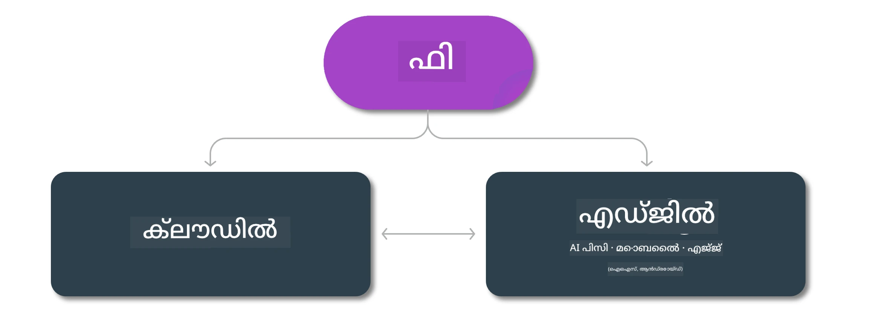

# Phi മോഡലുകൾ & പ്ലാറ്റ്‌ഫോമുകളിലെ ലഭ്യത

## എഡ്ജ് & ക്ലൗഡ് സാഹചര്യങ്ങൾ

## മോഡൽ ലഭ്യതയും വിഭവങ്ങളും

| | | | | | | | | |
|-|-|-|-|-|-|-|-|-|
|മോഡൽ|ഇൻപുട്ട്|ഉള്ളടക്ക നീളം|Azure AI (MaaS)|Azure ML (MaaP)|ONNX|Hugging Face|Ollama|Nvidia NIM|
|Phi-3-vision-128k-instruct|ടെക്സ്റ്റ്+ഇമേജ്|128k|[പ്ലേഗ്രൗണ്ട് & ഡിപ്ലോയ്‌മെന്റ്](https://ai.azure.com/explore/models/Phi-3-vision-128k-instruct/version/2/registry/azureml)|[പ്ലേഗ്രൗണ്ട്, ഡിപ്ലോയ്‌മെന്റ് & ഫൈൻട്യൂണിംഗ്](https://ml.azure.com/registries/azureml/models/Phi-3-vision-128k-instruct/version/2)|[CUDA](https://huggingface.co/microsoft/Phi-3-vision-128k-instruct-onnx-cuda/tree/main),[CPU](https://huggingface.co/microsoft/Phi-3-vision-128k-instruct-onnx-cpu/tree/main), [DirectML](https://huggingface.co/microsoft/Phi-3-vision-128k-instruct-onnx-directml/tree/main)|[ഡൗൺലോഡ്](https://huggingface.co/microsoft/Phi-3-vision-128k-instruct)|-NA-|[NIM APIs](https://build.nvidia.com/microsoft/phi-3-vision-128k-instruct)|
|Phi-3-mini-4k-instruct|ടെക്സ്റ്റ്|4k|[പ്ലേഗ്രൗണ്ട് & ഡിപ്ലോയ്‌മെന്റ്](https://aka.ms/phi3-mini-4k-azure-ml)|[പ്ലേഗ്രൗണ്ട്, ഡിപ്ലോയ്‌മെന്റ്](https://aka.ms/phi3-mini-4k-azure-ml) & ഫൈൻട്യൂണിംഗ്|[CUDA](https://huggingface.co/microsoft/Phi-3-mini-4k-instruct-onnx), [Web](https://huggingface.co/microsoft/Phi-3-mini-4k-instruct-onnx)|[പ്ലേഗ്രൗണ്ട് & ഡൗൺലോഡ്](https://huggingface.co/chat/models/microsoft/Phi-3-mini-4k-instruct)|[GGUF](https://huggingface.co/microsoft/Phi-3-mini-4k-instruct-gguf)|[NIM APIs](https://build.nvidia.com/microsoft/phi-3-mini-4k)|
|Phi-3-mini-128k-instruct|ടെക്സ്റ്റ്|128k|[പ്ലേഗ്രൗണ്ട് & ഡിപ്ലോയ്‌മെന്റ്](https://ai.azure.com/explore/models/Phi-3-mini-128k-instruct/version/9/registry/azureml)|[പ്ലേഗ്രൗണ്ട്, ഡിപ്ലോയ്‌മെന്റ്](https://ai.azure.com/explore/models/Phi-3-mini-128k-instruct/version/9/registry/azureml) & ഫൈൻട്യൂണിംഗ്|[CUDA](https://huggingface.co/microsoft/Phi-3-mini-128k-instruct-onnx)|[ഡൗൺലോഡ്](https://huggingface.co/microsoft/Phi-3-mini-128k-instruct-onnx)|-NA-|[NIM APIs](https://build.nvidia.com/microsoft/phi-3-mini)|
|Phi-3-small-8k-instruct|ടെക്സ്റ്റ്|8k|[പ്ലേഗ്രൗണ്ട് & ഡിപ്ലോയ്‌മെന്റ്](https://ml.azure.com/registries/azureml/models/Phi-3-small-8k-instruct/version/2)|[പ്ലേഗ്രൗണ്ട്, ഡിപ്ലോയ്‌മെന്റ്](https://ai.azure.com/explore/models/Phi-3-small-8k-instruct/version/2/registry/azureml) & ഫൈൻട്യൂണിംഗ്|[CUDA](https://huggingface.co/microsoft/Phi-3-small-8k-instruct-onnx-cuda)|[ഡൗൺലോഡ്](https://huggingface.co/microsoft/Phi-3-small-8k-instruct-onnx-cuda)|-NA-|[NIM APIs](https://build.nvidia.com/microsoft/phi-3-small-8k-instruct?docker=false)|
|Phi-3-small-128k-instruct|ടെക്സ്റ്റ്|128k|[പ്ലേഗ്രൗണ്ട് & ഡിപ്ലോയ്‌മെന്റ്](https://ai.azure.com/explore/models/Phi-3-small-128k-instruct/version/2/registry/azureml)|[പ്ലേഗ്രൗണ്ട്, ഡിപ്ലോയ്‌മെന്റ്](https://ml.azure.com/registries/azureml/models/Phi-3-small-128k-instruct/version/2) & ഫൈൻട്യൂണിംഗ്|[CUDA](https://huggingface.co/microsoft/Phi-3-medium-128k-instruct-onnx-cuda)|[ഡൗൺലോഡ്](https://huggingface.co/microsoft/Phi-3-small-128k-instruct)|-NA-|[NIM APIs](https://build.nvidia.com/microsoft/phi-3-small-128k-instruct?docker=false)|
|Phi-3-medium-4k-instruct|ടെക്സ്റ്റ്|4k|[പ്ലേഗ്രൗണ്ട് & ഡിപ്ലോയ്‌മെന്റ്](https://huggingface.co/microsoft/Phi-3-medium-4k-instruct)|[പ്ലേഗ്രൗണ്ട്, ഡിപ്ലോയ്‌മെന്റ്](https://ml.azure.com/registries/azureml/models/Phi-3-medium-4k-instruct/version/2) & ഫൈൻട്യൂണിംഗ്|[CUDA](https://huggingface.co/microsoft/Phi-3-medium-4k-instruct-onnx-cuda/tree/main), [CPU](https://huggingface.co/microsoft/Phi-3-medium-4k-instruct-onnx-cpu/tree/main), [DirectML](https://huggingface.co/microsoft/Phi-3-medium-4k-instruct-onnx-directml/tree/main)|[ഡൗൺലോഡ്](https://huggingface.co/microsoft/Phi-3-medium-4k-instruct)|-NA-|[NIM APIs](https://build.nvidia.com/microsoft/phi-3-medium-4k-instruct?docker=false)|
|Phi-3-medium-128k-instruct|ടെക്സ്റ്റ്|128k|[പ്ലേഗ്രൗണ്ട് & ഡിപ്ലോയ്‌മെന്റ്](https://ai.azure.com/explore/models/Phi-3-medium-128k-instruct/version/2)|[പ്ലേഗ്രൗണ്ട്, ഡിപ്ലോയ്‌മെന്റ്](https://ml.azure.com/registries/azureml/models/Phi-3-medium-128k-instruct/version/2) & ഫൈൻട്യൂണിംഗ്|[CUDA](https://huggingface.co/microsoft/Phi-3-medium-128k-instruct-onnx-cuda/tree/main), [CPU](https://huggingface.co/microsoft/Phi-3-medium-128k-instruct-onnx-cpu/tree/main), [DirectML](https://huggingface.co/microsoft/Phi-3-medium-128k-instruct-onnx-directml/tree/main)|[ഡൗൺലോഡ്](https://huggingface.co/microsoft/Phi-3-medium-128k-instruct)|-NA-|-NA-|

---

<!-- CO-OP TRANSLATOR DISCLAIMER START -->
ഡിസ്ക്ലെയിമര്‍:  
ഈ രേഖ AI-ആധാരമായ പരിഭാഷാ സേവനമായ [Co-op Translator](https://github.com/Azure/co-op-translator) ഉപയോഗിച്ച് പരിഭാഷപ്പെടുത്തിയതാണ്. ഞങ്ങൾ കൃത്യതയ്ക്ക് ശ്രമിച്ചിരുന്നെങ്കിലും, യന്ത്രപരമായ പരിഭാഷകളിൽ പിശകുകൾ അല്ലെങ്കിൽ അസാധുതകൾ ഉണ്ടാകാമെന്ന് ദയവായി памятിക്കുക. മൂലഭാഷയിലുണ്ടായിരിക്കുന്ന ഡോക്യുമെന്റ് പ്രാമാണിക ഉറവിടമായി കരുതണം. നിർണായകമായ വിവരങ്ങൾക്ക് പ്രൊഫഷണൽ മനുഷ്യ പരിഭാഷ ശുപാർശ ചെയ്യപ്പെടുന്നു. ഈ പരിഭാഷ ഉപയോഗിച്ചതിൽ നിന്നുണ്ടാകുന്ന ഏതെങ്കിലും തെറ്റിദ്ധാരണകൾക്കും വ്യാഖ്യാന തകരാറുകൾക്കും ഞങ്ങൾ ഉത്തരവാദികളല്ല.
<!-- CO-OP TRANSLATOR DISCLAIMER END -->