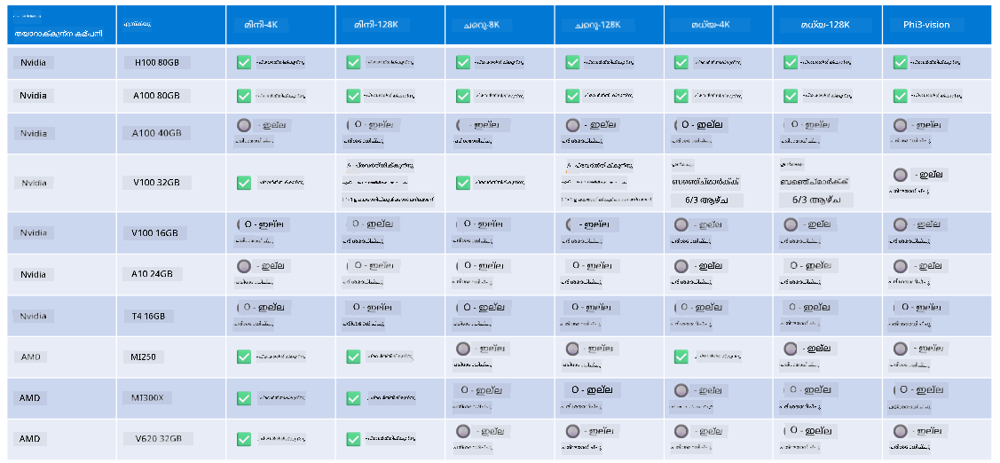

<!--
CO_OP_TRANSLATOR_METADATA:
{
  "original_hash": "8cdc17ce0f10535da30b53d23fe1a795",
  "translation_date": "2025-12-21T23:13:47+00:00",
  "source_file": "md/01.Introduction/01/01.Hardwaresupport.md",
  "language_code": "ml"
}
-->
# Phi ഹാർഡ്‌വെയർ പിന്തുണ

Microsoft Phi ONNX Runtime-നായി ഒപ്റ്റിമൈസ്ഡ് ചെയ്തதും Windows DirectML നെ പിന്തുണയ്ക്കുന്നതുമായതാണ്. ഇത് GPU-കൾ, CPU-കൾ, കൂടാതെ മൊബൈൽ ഡിവൈസുകൾ ഉൾപ്പെടെയുള്ള വിവിധ ഹാർഡ്‌വെയർ തരങ്ങളിൽ നല്ല രീതിയിൽ പ്രവർത്തിക്കുന്നു. 

## Device Hardware 
വിശദമായി, പിന്തുണയുള്ള ഹാർഡ്‌വെയറിൽ ഉൾപ്പെടുന്നത്:

- GPU SKU: RTX 4090 (DirectML)
- GPU SKU: 1 A100 80GB (CUDA)
- CPU SKU: Standard F64s v2 (64 vCPUs, 128 GiB മെമ്മറി)

## Mobile SKU

- Android - Samsung Galaxy S21
- Apple iPhone 14 അല്ലെങ്കിൽ അതിനേക്കാൾ ഉയർന്ന (A16/A17 പ്രോസസ്സർ)

## Phi Hardware Specification

- കുറഞ്ഞ ക്രമീകരണം ആവശ്യമാണ്.
- Windows: DirectX 12-സമുള്ള GPU കൂടാതെ കുറഞ്ഞത് 4GB സംയുക്ത RAM

CUDA: Compute Capability >= 7.02 ഉള്ള NVIDIA GPU



## onnxruntime പല GPU-കളിൽ പ്രവർത്തിപ്പിക്കൽ

ഇപ്പോൾ ലഭ്യമായ Phi ONNX മോഡലുകൾ ഒരേ ഒരു GPU-യ്ക്കായുള്ളവ മാത്രമാണ്. Phi മോഡലുകൾയ്ക്കു മൾട്ടി-GPU പിന്തുണ നൽകുന്നത് സാധ്യമാകാം, എങ്കിലും 2 GPU ഉപയോഗിച്ച് ORT മൂന്നറിഞ്ഞതിനെ അപേക്ഷിച്ച് കൂടുതൽ throughput ലഭിക്കുമെന്ന് ഉറപ്പ് നൽകാൻ കഴിയില്ല. ഏറ്റവും പുതിയ അപ്‌ഡേറ്റുകൾക്കായി [ONNX Runtime](https://onnxruntime.ai/) കാണുക.

[Build 2024-ലെ GenAI ONNX ടീം](https://youtu.be/WLW4SE8M9i8?si=EtG04UwDvcjunyfC) Phi മോഡലുകൾക്കായി മൾട്ടി-GPU പകരം മൾട്ടി-ഇൻസ്റ്റൻസ് എത്തിച്ചുചെയ്തതായി പ്രഖ്യാപിച്ചു. 

ഇപ്പോൾ ഇത് CUDA_VISIBLE_DEVICES എൻവയോൺ‌മെന്റ് വെരെബിൾ ഉപയോഗിച്ച് ഇത്തരമൊരു onnnxruntime അല്ലെങ്കിൽ onnxruntime-genai ഇൻസ്റ്റൻസ് ഓടിക്കാൻ അനുവദിക്കുന്നു.

```Python
CUDA_VISIBLE_DEVICES=0 python infer.py
CUDA_VISIBLE_DEVICES=1 python infer.py
```

Phi കുറിച്ച് കൂടുതൽ അന്വേഷിക്കാൻ [Azure AI Foundry](https://ai.azure.com) സന്ദർശിക്കുക

---

<!-- CO-OP TRANSLATOR DISCLAIMER START -->
ഡിസ്ക്ലെയിമർ:
ഈ രേഖ എഐ വിവർത്തന സേവനം [Co-op Translator](https://github.com/Azure/co-op-translator) ഉപയോഗിച്ച് വിവർത്തനം ചെയ്തതാണ്. ഞങ്ങൾ കൃത്യത ലക്ഷ്യമിട്ടുനടന്നിരുന്നെങ്കിലും, സ്വയം പ്രവർത്തിക്കുന്ന വിവർത്തനങ്ങളിൽ പിശകുകൾ അല്ലെങ്കിൽ അപാകതകൾ ഉണ്ടാകാവുന്നതാണെന്ന് ദയവായി ശ്രദ്ധിക്കുക. ഉറവിടഭാഷയിലുള്ള മൗലിക രേഖയാണ് അധികാരപരമായ പ്രാമാണികതയുടെ ഉറവിടമായി പരിഗണിക്കപ്പെടേണ്ടത്. നിർണായകമായ വിവരങ്ങൾക്ക്, പ്രൊഫഷണൽ മനുഷ്യ വിവർത്തനത്തെ ശുപാർശ ചെയ്യുന്നു. ഈ വിവർത്തനത്തിന്റെ ഉപയോഗത്തിൽ നിന്നുണ്ടാകുന്ന ഏതെങ്കിലും തെറ്റിദ്ധാരണകൾക്കും അല്ലെങ്കിൽ തെറ്റായ വ്യാഖ്യാനങ്ങൾക്കും ഞങ്ങൾ ഉത്തരവാദികളല്ല.
<!-- CO-OP TRANSLATOR DISCLAIMER END -->