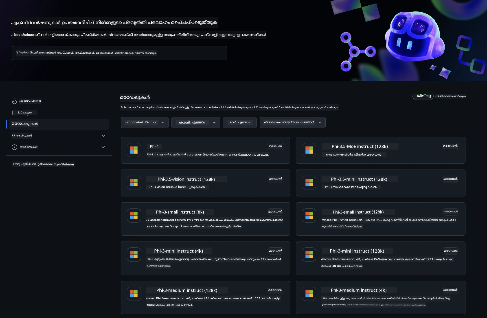
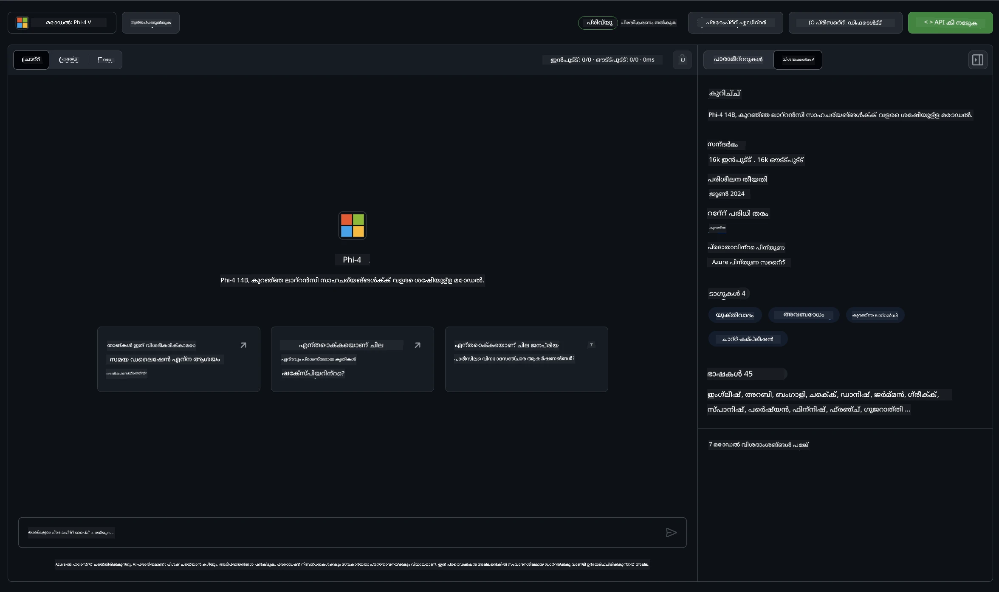
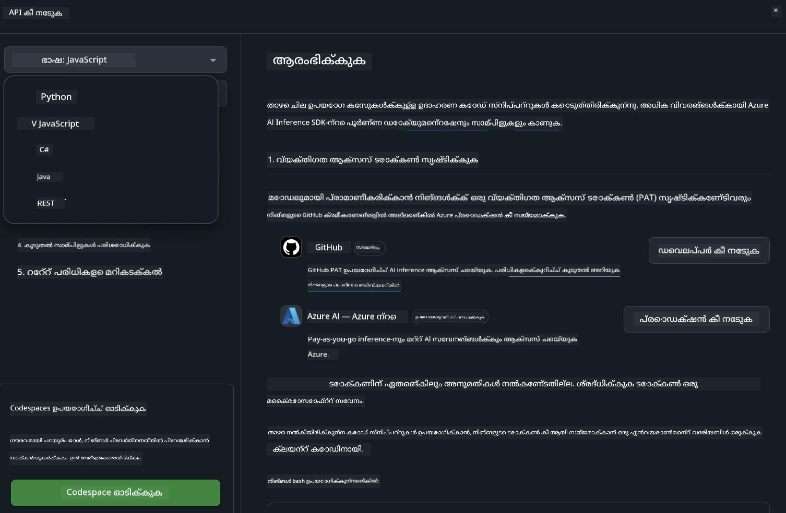
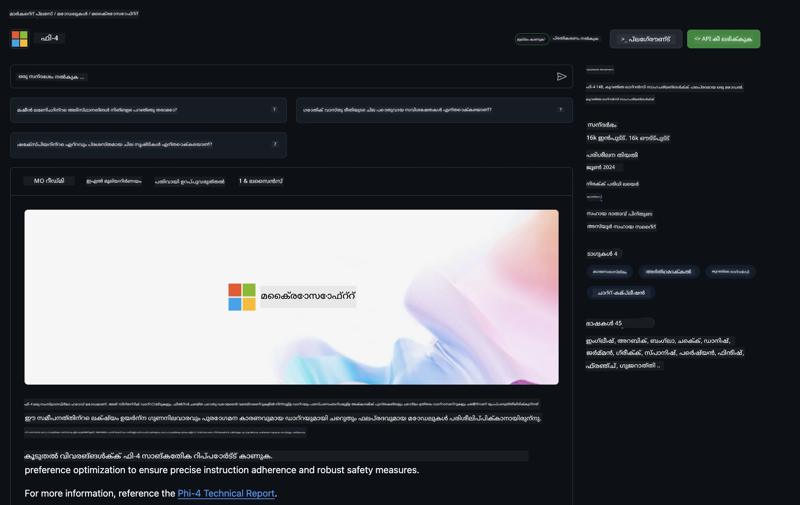

<!--
CO_OP_TRANSLATOR_METADATA:
{
  "original_hash": "fb67a08b9fc911a10ed58081fadef416",
  "translation_date": "2025-12-21T23:55:44+00:00",
  "source_file": "md/01.Introduction/02/02.GitHubModel.md",
  "language_code": "ml"
}
-->
## GitHub Modelsൽ Phi കുടുംബം

[GitHub Models](https://github.com/marketplace/models) ലേക്ക് സ്വാഗതം! ഞങ്ങൾ എല്ലാ സജ്ജീകരണങ്ങളും പൂർത്തിയായി, നിങ്ങൾക്ക് Azure AI-യിൽ ഹോസ്റ്റ് ചെയ്ത AI മോഡലുകൾ പരിശോധിക്കാൻ തയ്യാറാണ്.



ലഭ്യമായ മോഡലുകൾക്കുറച്ച കൂടുതൽ വിവരങ്ങൾക്ക്, [GitHub Model Marketplace](https://github.com/marketplace/models) കാണുക

## ലഭ്യമായ മോഡലുകൾ

ഓരോ മോഡലിനും പ്രത്യേക പ്ലേഗ്രൗണ്ട് һәм സാമ്പിൾ കോഡ് ഉണ്ട്



### GitHub മോഡൽ കാറ്റലോഗിലുള്ള Phi കുടുംബം

- [Phi-4](https://github.com/marketplace/models/azureml/Phi-4)

- [Phi-3.5-MoE instruct (128k)](https://github.com/marketplace/models/azureml/Phi-3-5-MoE-instruct)

- [Phi-3.5-vision instruct (128k)](https://github.com/marketplace/models/azureml/Phi-3-5-vision-instruct)

- [Phi-3.5-mini instruct (128k)](https://github.com/marketplace/models/azureml/Phi-3-5-mini-instruct)

- [Phi-3-Medium-128k-Instruct](https://github.com/marketplace/models/azureml/Phi-3-medium-128k-instruct)

- [Phi-3-medium-4k-instruct](https://github.com/marketplace/models/azureml/Phi-3-medium-4k-instruct)

- [Phi-3-mini-128k-instruct](https://github.com/marketplace/models/azureml/Phi-3-mini-128k-instruct)

- [Phi-3-mini-4k-instruct](https://github.com/marketplace/models/azureml/Phi-3-mini-4k-instruct)

- [Phi-3-small-128k-instruct](https://github.com/marketplace/models/azureml/Phi-3-small-128k-instruct)

- [Phi-3-small-8k-instruct](https://github.com/marketplace/models/azureml/Phi-3-small-8k-instruct)

## ആരംഭിക്കാൻ

നിങ്ങൾക്ക് പ്രവർത്തിപ്പിക്കാൻ തയ്യാറായ ഏതാനും അടിസ്ഥാന ഉദാഹരണങ്ങളുണ്ട്. അവയെ നിങ്ങൾ samples ഡയറക്ടറിയിൽ കണ്ടെത്താം. നിങ്ങൾക്ക് ഇഷ്ടപ്പെട്ട ഭാഷയിലേക്ക് നേരിട്ട് ചാടണമെങ്കിൽ, താഴെയുള്ള ഭാഷകളിൽ ഉദാഹരണങ്ങൾ ലഭ്യമാണ്:

- Python
- JavaScript
- C#
- Java
- cURL

സാമ്പിളുകളും മോഡലുകളും chạy ചെയ്യുന്നതിനുള്ള ഒരു പ്രത്യേക Codespaces പരിസ്ഥിതിയും ഉൾപ്പെടുത്തപ്പെട്ടിട്ടുണ്ട്.




## സാമ്പിൾ കോഡ്

താഴെ ചില ഉപയോഗരീതികള്ക്കുള്ള ഉദാഹരണ കോഡ് സ്നിപ്പെറ്റുകൾ നൽകിയിട്ടുണ്ട്. Azure AI Inference SDK സംബന്ധിച്ച കൂടുതൽ വിവരങ്ങൾക്ക്, പൂർണ്ണ ഡോക്യുമെന്റേഷൻ һәм സാമ്പിളുകൾ കാണുക.

## ക്രമീകരണം

1. Create a personal access token You do not need to give any permissions to the token. Note that the token will be sent to a Microsoft service.

To use the code snippets below, create an environment variable to set your token as the key for the client code.

If you're using bash:
```
export GITHUB_TOKEN="<your-github-token-goes-here>"
```
If you're in powershell:

```
$Env:GITHUB_TOKEN="<your-github-token-goes-here>"
```

If you're using Windows command prompt:

```
set GITHUB_TOKEN=<your-github-token-goes-here>
```

## Python സാമ്പിൾ

### ആശ്രിതത്വങ്ങൾ ഇൻസ്റ്റാൾ ചെയ്യുക
pip ഉപയോഗിച്ച് Azure AI Inference SDK ഇൻസ്റ്റാൾ ചെയ്യുക (ആവശ്യം: Python >=3.8):

```
pip install azure-ai-inference
```
### ഒരു അടിസ്ഥാന കോഡ് സാമ്പിൾ പ്രവർത്തിപ്പിക്കുക

ഈ സാമ്പിൾ ചാറ്റ് പൂർത്തീകരണ API-യിലേക്ക് ഒരു അടിസ്ഥാന കോളിനെ പ്രദർശിപ്പിക്കുന്നു. ഇത് GitHub AI മോഡൽ ഇൻഫറൻസ് എണ്ഡ്പോയിന്റും നിങ്ങളുടെ GitHub ടോക്കണും ഉപയോഗിക്കുന്നു. കോളിംഗ് സമകാലികമാണ്.

```python
import os
from azure.ai.inference import ChatCompletionsClient
from azure.ai.inference.models import SystemMessage, UserMessage
from azure.core.credentials import AzureKeyCredential

endpoint = "https://models.inference.ai.azure.com"
model_name = "Phi-4"
token = os.environ["GITHUB_TOKEN"]

client = ChatCompletionsClient(
    endpoint=endpoint,
    credential=AzureKeyCredential(token),
)

response = client.complete(
    messages=[
        UserMessage(content="I have $20,000 in my savings account, where I receive a 4% profit per year and payments twice a year. Can you please tell me how long it will take for me to become a millionaire? Also, can you please explain the math step by step as if you were explaining it to an uneducated person?"),
    ],
    temperature=0.4,
    top_p=1.0,
    max_tokens=2048,
    model=model_name
)

print(response.choices[0].message.content)
```

### ബഹു-റൌണ്ട് സംഭാഷണം പ്രവർത്തിപ്പിക്കുക

ഈ സാമ്പിൾ ചാറ്റ് പൂർത്തീകരണ API ഉപയോഗിച്ച് ബഹുരൗണ്ട് സംഭാഷണം എങ്ങനെ നടത്താമെന്ന് കാണിക്കുന്നു. ചാറ്റ് ആപ്ലിക്കേഷനായി മോഡൽ ഉപയോഗിക്കുമ്പോൾ, ആ സംഭാഷണത്തിന്റെ ചരിത്രം നിയന്ത്രിക്കുകയും മോഡലിലേക്ക് تازة സന്ദേശങ്ങൾ അയക്കേണ്ടതും ഉണ്ടാകും.

```
import os
from azure.ai.inference import ChatCompletionsClient
from azure.ai.inference.models import AssistantMessage, SystemMessage, UserMessage
from azure.core.credentials import AzureKeyCredential

token = os.environ["GITHUB_TOKEN"]
endpoint = "https://models.inference.ai.azure.com"
# Replace Model_Name
model_name = "Phi-4"

client = ChatCompletionsClient(
    endpoint=endpoint,
    credential=AzureKeyCredential(token),
)

messages = [
    SystemMessage(content="You are a helpful assistant."),
    UserMessage(content="What is the capital of France?"),
    AssistantMessage(content="The capital of France is Paris."),
    UserMessage(content="What about Spain?"),
]

response = client.complete(messages=messages, model=model_name)

print(response.choices[0].message.content)
```

### ഔട്ട്പുട്ട് സ്ട്രീം ചെയ്യുക

മികച്ച ഉപയോക്തൃ അനുഭവത്തിന്, ആദ്യം ടോക്കൺ വൈകാതെ കാണിക്കാൻ മോഡൽ റെസ്പോൺസ് സ്ട്രീം ചെയ്യാൻ താൽപ്പര്യമുണ്ടാകും, ഇതിലൂടെ ദീർഘമായ പ്രതികരണങ്ങൾക്ക് കാത്തിരിക്കാൻ വേണ്ടതില്ല.

```
import os
from azure.ai.inference import ChatCompletionsClient
from azure.ai.inference.models import SystemMessage, UserMessage
from azure.core.credentials import AzureKeyCredential

token = os.environ["GITHUB_TOKEN"]
endpoint = "https://models.inference.ai.azure.com"
# Replace Model_Name
model_name = "Phi-4"

client = ChatCompletionsClient(
    endpoint=endpoint,
    credential=AzureKeyCredential(token),
)

response = client.complete(
    stream=True,
    messages=[
        SystemMessage(content="You are a helpful assistant."),
        UserMessage(content="Give me 5 good reasons why I should exercise every day."),
    ],
    model=model_name,
)

for update in response:
    if update.choices:
        print(update.choices[0].delta.content or "", end="")

client.close()
```

## GitHub Models-ക്കായുള്ള സൗജന്യ ഉപയോഗവും നിരക്കിന്റെ പരിധികളും



The [rate limits for the playground and free API usage](https://docs.github.com/en/github-models/prototyping-with-ai-models#rate-limits) മോഡലുകളുമായി പ്രയോോഗം ചെയ്യാനും നിങ്ങളുടെ AI ആപ്ലിക്കേഷൻ പ്രോട്ടോടൈപ് ചെയ്യാനും സഹായിക്കാൻ ഉദ്ദേശിച്ചവയാണ്. ആ പരിധി കടന്നുപോകുന്ന ഉപയോഗത്തിനും നിങ്ങളുടെ ആപ്ലിക്കേഷൻ സ്‌കെയിലിൽ കൊണ്ടുപോകുന്നതിനും, നിങ്ങൾ ഒരു Azure അക്കൗണ്ടിൽ നിന്നുള്ള റിസോഴ്‌സുകൾ പ്രൊവിഷൻ ചെയ്യേണ്ടതുണ്ട്, GitHub വ്യക്തിഗത ആക്‌സസ് ടോക്കണിന്റെ പകരം അവിടെ നിന്നാണ് ഓതന്റിക്കേഷൻ നടത്തേണ്ടത്. നിങ്ങളുടെ കോഡിൽ മറ്റേതെങ്കിലും മാറ്റം നടത്തേണ്ടതില്ല. Azure AI-യിൽ സൗജന്യ ടയർ പരിധികൾക്കപ്പുറം എങ്ങനെ പോവാമെന്ന് കണ്ടെത്താൻ ഈ ലിങ്ക് ഉപയോഗിക്കുക.

### വെളിപ്പെടുത്തലുകൾ

മോഡലുമായി ഇടപഴകുമ്പോൾ നിങ്ങൾ AI-നെ പരീക്ഷണപരമായി ഉപയോഗിക്കുകയാണെന്ന് ഓർക്കുക — ഉള്ളടക്കത്തിൽ പിഴവുകൾ സംഭവിക്കാം.

ഈ ഫീച്ചർ വിവിധ പരിധികളോടെയാണ് ബാധിതമാകുന്നത് (ഒരു മിനിറ്റിൽ അഭ്യർത്ഥനകൾ, 하루വൈദ്യ അഭ്യർത്ഥനകൾ, ഒരു അഭ്യർത്ഥനയിൽ ടോക്കണുകൾ, സമകാലിക അഭ്യർത്ഥനകൾ എന്നിവ ഉൾപ്പെടുത്തുന്നു) һәм പ്രധാന പ്രോഡക്ഷൻ ഉപയോഗത്തിനായി രൂപകൽപ്പന ചെയ്തതല്ല.

GitHub Models Azure AI Content Safety ഉപയോഗിക്കുന്നു. GitHub Models അനുഭവത്തിൽ ഈ ഫിൽട്ടറുകൾ അപ്രാപ്യമായേക്കാമെന്നതിനാൽ അവ ഓഫ് ചെയ്യാൻ കഴിയില്ല. നിങ്ങൾ പേയ്ഡ് സേവനം ഉപയോഗിച്ച് മോഡലുകൾ ഉപയോഗിക്കാൻ തീരുമാനിച്ചാൽ, നിങ്ങളുടെ ആവശ്യകതകൾ പാലിക്കുന്ന വിധം നിങ്ങളുടെ ഉള്ളടക്ക ഫിൽട്ടറുകൾ ക്രമീകരിക്കുക.

ഈ സേവനം GitHub-ന്റെ Pre-release Terms പ്രകാരം ആണ്.

---

<!-- CO-OP TRANSLATOR DISCLAIMER START -->
ഡിസ്ക്ലെയിമർ:
ഈ രേഖ [Co-op Translator](https://github.com/Azure/co-op-translator) എന്ന AI പരിഭാഷാ സേവനം ഉപയോഗിച്ച് പരിഭാഷപ്പെടുത്തിയതാണ്. ഞങ്ങൾ കൃത്യതയ്ക്ക് പരിശ്രമിച്ചുവെങ്കിലും, യന്ത്രപരിഭാഷകളിൽ തെറ്റുകൾ അല്ലെങ്കിൽ അസംബോധനകൾ ഉണ്ടാകാമെന്ന് ദയവായി ശ്രദ്ധിക്കുക. യഥാർത്ഥ ഭാഷയിലുള്ള രേഖയെ അതിന്റെ അധികാരപരമായ ഉറവിടമായി പരിഗണിക്കുക. നിർണായകമായ വിവരങ്ങൾക്ക് പ്രൊഫഷണൽ മനുഷ്യ പരിഭാഷ ശുപാർശ ചെയ്യപ്പെടുന്നു. ഈ പരിഭാഷ ഉപയോഗിച്ചതിനെ തുടർന്ന് ഉണ്ടാകുന്ന ഏതെങ്കിലും തെറ്റിദ്ധാരണകളിലോ തെറ്റായ വ്യാഖ്യാനങ്ങളിലോ ഞങ്ങൾ ഉത്തരവാദികളല്ല.
<!-- CO-OP TRANSLATOR DISCLAIMER END -->