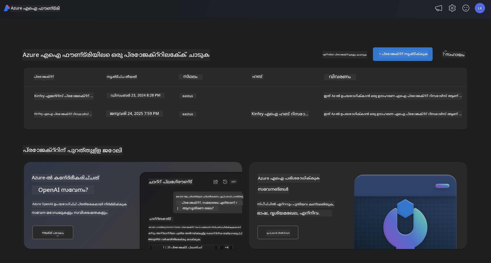

<!--
CO_OP_TRANSLATOR_METADATA:
{
  "original_hash": "3ae21dc5554e888defbe57946ee995ee",
  "translation_date": "2025-12-22T00:01:31+00:00",
  "source_file": "md/01.Introduction/02/03.AzureAIFoundry.md",
  "language_code": "ml"
}
-->
## Phi കുടുംബം Azure AI Foundry-ൽ

[Azure AI Foundry](https://ai.azure.com) ഒരു വിശ്വാസയോഗ്യമായ പ്ലാറ്റ്ഫോമാണ്, ഇത് വികസകരെ സുരക്ഷിതവും വിശ്വാസയോഗ്യവുമായും ഉത്തരവാദിത്വപരവുമായും രീതിയിൽ AI ഉപയോഗിച്ച് നവീകരണം നയിക്കുകയും ഭാവി രൂപപ്പെടുത്തുകയും ചെയ്യാൻ സജ്ജമാക്കുന്നു.


[Azure AI Foundry](https://ai.azure.com) വികസകരെ ലക്ഷ്യം വച്ചാണ് രൂപകൽപ്പന ചെയ്തിരിക്കുന്നത്:

- എന്റർപ്രൈസ്-ഗ്രേഡ് പ്ലാറ്റ്ഫോമിൽ ജനറേറ്റീവ് AI അപ്ലിക്കേഷനുകൾ നിർമ്മിക്കുക.
- ഉത്തരവാദിത്വപരമായ AI പ്രവർത്തനങ്ങളെ അടിസ്ഥാനമാക്കി അന്ത്യാധുനിക AI ഉപകരണങ്ങളും ML മോഡലുകളും ഉപയോഗിച്ച് പരിശോധിക്കുക, നിർമ്മിക്കുക, ടെസ്റ്റ് നടത്തുക, വിന്യാസം ചെയ്യുക.
- അപ്ലിക്കേഷൻ വികസനത്തിന്റെ മുഴുവൻ ജീവിതചക്രത്തിലും ഒരു ടീമുമായി സഹകരിക്കുക.

Azure AI Foundry ഉപയോഗിച്ച്, നിങ്ങൾ വിവിധ തരത്തിലുള്ള മോഡലുകൾ, സേവനങ്ങൾ, കഴിവുകൾ എന്നിവ അന്വേഷിച്ച് നിങ്ങളുടെ ലക്ഷ്യങ്ങൾക്ക് അനുയോജ്യമായ AI അപ്ലിക്കേഷനുകൾ നിർമ്മിക്കാൻ തുടങ്ങാനാകും. Azure AI Foundry പ്ലാറ്റ്ഫോം proof of concepts-നെ പൂർണമായ പ്രൊഡക്ഷൻ ആപ്ലിക്കേഷനുകളായി മാറ്റുന്നതിന് സ്കെയിലബിലിറ്റി സുലഭമാക്കുന്നു. തുടർച്ചയായ നിരീക്ഷണവും മെച്ചപ്പെടുത്തലും ദീർഘകാല വിജയത്തിന് പിന്തുണ നൽകും.



Azure AI Foundry-ൽ Azure AOAI Service ഉപയോഗിക്കുന്നതിനു പുറമേ, നിങ്ങൾ Azure AI Foundry മോഡൽ കാറ്റലോഗിൽ തൃતીય-കക്ഷി മോഡലുകളും ഉപയോഗിക്കാം. നിങ്ങള്‍ Azure AI Foundry-നെ നിങ്ങളുടെ AI സൊല്യൂഷൻ പ്ലാറ്റ്ഫോമായി ഉപയോഗിക്കാൻ ആഗ്രഹിക്കുന്നുവെങ്കിൽ ഇത് നല്ലൊരു തിരഞ്ഞെടുപ്പാണ്.

Azure AI Foundry-ലെ മോഡൽ കാറ്റലോഗ് വഴി ഞങ്ങൾ Phi കുടുംബ മോഡലുകൾ വേഗത്തിൽ വിന്യസിക്കാം 

[Microsoft Phi Models in Azure AI Foundry Models](https://ai.azure.com/explore/models/?selectedCollection=phi)


### **Azure AI Foundry-ൽ Phi-4 വിന്യസിക്കൽ**


### **Azure AI Foundry പ്ലേഗ്രൗണ്ടിൽ Phi-4 പരീക്ഷിക്കുക**


### **Azure AI Foundry Phi-4 വിളിക്കാൻ Python കോഡ് പ്രവർത്തിപ്പിക്കൽ**


```python

import os  
import base64
from openai import AzureOpenAI  
from azure.identity import DefaultAzureCredential, get_bearer_token_provider  
        
endpoint = os.getenv("ENDPOINT_URL", "Your Azure AOAI Service Endpoint")  
deployment = os.getenv("DEPLOYMENT_NAME", "Phi-4")  
      
token_provider = get_bearer_token_provider(  
    DefaultAzureCredential(),  
    "https://cognitiveservices.azure.com/.default"  
)  
  
client = AzureOpenAI(  
    azure_endpoint=endpoint,  
    azure_ad_token_provider=token_provider,  
    api_version="2024-05-01-preview",  
)  
  

chat_prompt = [
    {
        "role": "system",
        "content": "You are an AI assistant that helps people find information."
    },
    {
        "role": "user",
        "content": "can you introduce yourself"
    }
] 
    
# സ്പീച്ച് സജീവമാണെങ്കിൽ സ്പീച്ച് ഫലം ഉൾപ്പെടുത്തുക
messages = chat_prompt 

completion = client.chat.completions.create(  
    model=deployment,  
    messages=messages,
    max_tokens=800,  
    temperature=0.7,  
    top_p=0.95,  
    frequency_penalty=0,  
    presence_penalty=0,
    stop=None,  
    stream=False  
)  
  
print(completion.to_json())  

```

---

<!-- CO-OP TRANSLATOR DISCLAIMER START -->
അറിയിപ്പ്:
ഈ രേഖ AI പരിഭാഷാ സേവനമായ [Co-op Translator](https://github.com/Azure/co-op-translator) ഉപയോഗിച്ച് പരിഭാഷപ്പെടുത്തിയതാണെന്ന് ശ്രദ്ധിക്കുക. ഞങ്ങൾ കൃത്യതയ്ക്ക് ശ്രമിച്ചിട്ടുണ്ടെങ്കിലും, യാന്ത്രിക പരിഭാഷകളിൽ പിശകുകൾ അല്ലെങ്കിൽ അസാധുതകൾ ഉണ്ടാകാമെന്ന് ദയവായി ശ്രദ്ധിക്കുക. മൂല രേഖയുടെ സ്വാഭാവിക ഭാഷയിലുള്ള പതിപ്പ് അധികാരപരമായ ഉറവിടമായി കരുതപ്പെടണം. നിർണായക വിവരങ്ങൾക്ക് പ്രൊഫഷണൽ മനുഷ്യ പരിഭാഷ ശുപാർശ ചെയ്യപ്പെടുന്നു. ഈ പരിഭാഷ ഉപയോഗിക്കുന്നതിൽ നിന്നുണ്ടാകുന്ന ഏതൊരു തെറ്റിദ്ധാരണത്തിനും അല്ലെങ്കിൽ തെറ്റായ വ്യാഖ്യാനത്തിനും ഞങ്ങൾക്ക് ഉത്തരവാദിത്വമില്ല.
<!-- CO-OP TRANSLATOR DISCLAIMER END -->