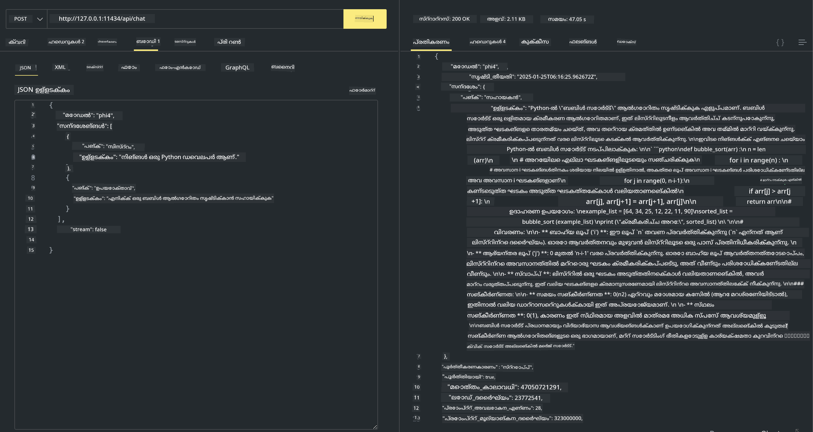

<!--
CO_OP_TRANSLATOR_METADATA:
{
  "original_hash": "2aa35f3c8b437fd5dc9995d53909d495",
  "translation_date": "2025-12-21T23:33:07+00:00",
  "source_file": "md/01.Introduction/02/04.Ollama.md",
  "language_code": "ml"
}
-->
## Ollama-യിലെ Phi കുടുംബം


[Ollama](https://ollama.com) ലളിതമായ സ്ക്രിപ്റ്റുകൾ വഴി ഓപ്പൺ സോഴ്‌സ് LLM അല്ലെങ്കിൽ SLM നേരിട്ട് ഡിപ്പ്ലോയുചെയ്യാൻ കൂടുതല്‍ ആളുകൾക്ക് അനുവദിക്കുന്നു, കൂടാതെ ലോക്കൽ Copilot അപ്ലിക്കേഷൻ സാഹചര്യങ്ങൾക്ക് സഹായകരമായ API-കളും സൃഷ്ടിക്കാനാകും.

## **1. Installation**

Ollama Windows, macOS, மற்றும் Linux-ൽ പ്രവർത്തിപ്പിക്കാൻ പിന്തുണ നൽകുന്നു. നിങ്ങൾക്ക് ഈ ലിങ്ക് വഴി Ollama ഇൻസ്റ്റാൾ ചെയ്യാം ([https://ollama.com/download](https://ollama.com/download)). വിജയകരമായി ഇൻസ്റ്റാൾ ചെയ്തശേഷം, നിങ്ങൾ ടെർമിനൽ വിൻഡോയിൽ നിന്നിട്ട് Ollama സ്ക്രിപ്റ്റ് ഉപയോഗിച്ച് നേരിട്ട് Phi-3 കോൾ ചെയ്യാൻ കഴിയും. Ollama-യിലെ എല്ലാ [ലഭ്യമായ ലൈബ്രറികളും](https://ollama.com/library) നിങ്ങൾക്ക് കാണാം. നിങ്ങൾ ഈ റിപ്പോസിറ്ററി ഒരു Codespace-ൽ തുറന്നാൽ, അതിൽ മുൻപ് തന്നെ Ollama ഇൻസ്റ്റാൾ ചെയ്തിഉള്ളതാകും.

```bash

ollama run phi4

```

> [!NOTE]
> മോഡൽ ആദ്യം നിങ്ങൾ ആദ്യമായി ഇത് ഓടിക്കുമ്പോൾ ഡൗൺലോഡ് ചെയ്യും. തീർച്ചയായും, നിങ്ങൾ നേരിട്ട് ഡൗൺലോഡ് ചെയ്ത Phi-4 മോഡൽ നിർദ്ദേശിക്കാവുന്നതാണ്. നാം WSL ഉദാഹരണമായി കമാൻഡ് ഓടിക്കുന്ന രീതിയെ കാണിക്കുന്നു. മോഡൽ വിജയകരമായി ഡൗൺലോഡ് ചെയ്തശേഷം, നിങ്ങൾ നേരിട്ട് ടെർമിനലിൽ അതുമായി സംവദിക്കാം.


## **2. Ollama-ൽ നിന്ന് phi-4 API വിളിക്കൽ**

Ollama വഴി നിർമ്മിച്ച Phi-4 API നിങ്ങൾ വിളിക്കാൻ ആഗ്രഹിക്കുന്നെങ്കിൽ, Ollama സർവർ ആരംഭിക്കാൻ താഴെ കാണുന്ന കമാൻഡ് ടെർമിനലിൽ ഉപയോഗിക്കാം.

```bash

ollama serve

```

> [!NOTE]
> MacOS അല്ലെങ്കിൽ Linux ഓടിക്കുന്നുവെങ്കിൽ, താഴെപറയുന്ന പിശക് നിങ്ങൾക്ക് കാണാവുന്നതാണെന്ന് ശ്രദ്ധിക്കുക **"Error: listen tcp 127.0.0.1:11434: bind: address already in use"**. കമാൻഡ് ഓടിക്കുമ്പോൾ ഈ പിശക് ലഭിക്കാം. സാധാരണയായി ഇത് സർവർ ഇതിനകം പ്രവർത്തിച്ചുകൊണ്ടിരിക്കുകയാണെന്ന് സൂചിപ്പിക്കുന്നдықтан, നിങ്ങൾക്ക് ആ പിശക് അവഗണിക്കാവുന്നതാണ്, അല്ലെങ്കിൽ Ollama നിർത്തി വീണ്ടും തുടങ്ങി നോക്കാം:

**macOS**

```bash

brew services restart ollama

```

**Linux**

```bash

sudo systemctl stop ollama

```

Ollama രണ്ട് API-കൾ പിന്തുണയ്ക്കുന്നു: generate and chat. ലോക്കൽ സർവീസ് പോർട്ട് 11434-ൽ പ്രവർത്തിക്കുന്നതിനാൽ ആവശ്യമായപ്രകാരം Ollama നൽകുന്ന മോഡൽ API കോൾ ചെയ്യുവാൻ നിങ്ങൾക്ക് അപേക്ഷകൾ അയക്കാം.

**Chat**

```bash

curl http://127.0.0.1:11434/api/chat -d '{
  "model": "phi3",
  "messages": [
    {
      "role": "system",
      "content": "Your are a python developer."
    },
    {
      "role": "user",
      "content": "Help me generate a bubble algorithm"
    }
  ],
  "stream": false
  
}'
```

ഇതാണ് Postman-ൽ ലഭിക്കുന്ന ഫലം



## അധിക വിഭവങ്ങൾ

Ollama-യിലെ ലഭ്യമായ മോഡലുകളുടെ പട്ടിക അവരുടെ [ലൈബ്രറിയിൽ](https://ollama.com/library) പരിശോധിക്കുക.

Ollama സർവറിൽ നിന്നു നിങ്ങളുടെ മോഡൽ പുൾ ചെയ്യാൻ ഈ കമാൻഡ് ഉപയോഗിക്കുക

```bash
ollama pull phi4
```

ഈ കമാൻഡ് ഉപയോഗിച്ച് മോഡൽ ഓടിക്കുക

```bash
ollama run phi4
```

***കുറിപ്പ്:*** കൂടുതൽ അറിയാൻ ഈ ലിങ്ക് സന്ദർശിക്കുക [https://github.com/ollama/ollama/blob/main/docs/api.md](https://github.com/ollama/ollama/blob/main/docs/api.md)

## Python-ൽ നിന്ന് Ollama വിളിക്കൽ

മുകളിൽ ഉപയോഗിച്ച ലോക്കൽ സർവർ എൻഡ്പോയിന്റുകൾക്ക് അഭ്യർത്ഥനകൾ നടത്താൻ നിങ്ങൾക്ക് `requests` അല്ലെങ്കിൽ `urllib3` ഉപയോഗിക്കാവുന്നതാണ്. എന്നിരുന്നാലും, Python-ൽ Ollama ഉപയോഗിക്കുന്നതിന് പ്രചാരമാർഗമാണ് [openai](https://pypi.org/project/openai/) SDK ഉപയോഗിക്കുക, കാരണം Ollama OpenAI-അനുകൂലമായ സർവർ എൻഡ്പോയിന്റുകളും നൽകുന്നു.

ഇത് phi3-mini-ക്കുള്ള ഒരു ഉദാഹരണമാണ്:

```python
import openai

client = openai.OpenAI(
    base_url="http://localhost:11434/v1",
    api_key="nokeyneeded",
)

response = client.chat.completions.create(
    model="phi4",
    temperature=0.7,
    n=1,
    messages=[
        {"role": "system", "content": "You are a helpful assistant."},
        {"role": "user", "content": "Write a haiku about a hungry cat"},
    ],
)

print("Response:")
print(response.choices[0].message.content)
```

## JavaScript-ൽ നിന്ന് Ollama വിളിക്കൽ

```javascript
// Phi-4 ഉപയോഗിച്ച് ഒരു ഫയൽ സംഗ്രഹിക്കുന്ന ഉദാഹരണം
script({
    model: "ollama:phi4",
    title: "Summarize with Phi-4",
    system: ["system"],
})

// സംഗ്രഹിക്കലിന്റെ ഉദാഹരണം
const file = def("FILE", env.files)
$`Summarize ${file} in a single paragraph.`
```

## C#-ൽ നിന്ന് Ollama വിളിക്കൽ

ഒരു പുതിയ C# Console അപ്ലിക്കേഷൻ സൃഷ്ടിച്ച് താഴെ കാണുന്ന NuGet പാക്കേജ് ചേർക്കുക:

```bash
dotnet add package Microsoft.SemanticKernel --version 1.34.0
```

തുടർന്ന് `Program.cs` ഫയലിൽ ഈ കോഡ് മാറ്റി ഇടുക

```csharp
using Microsoft.SemanticKernel;
using Microsoft.SemanticKernel.ChatCompletion;

// add chat completion service using the local ollama server endpoint
#pragma warning disable SKEXP0001, SKEXP0003, SKEXP0010, SKEXP0011, SKEXP0050, SKEXP0052
builder.AddOpenAIChatCompletion(
    modelId: "phi4",
    endpoint: new Uri("http://localhost:11434/"),
    apiKey: "non required");

// invoke a simple prompt to the chat service
string prompt = "Write a joke about kittens";
var response = await kernel.InvokePromptAsync(prompt);
Console.WriteLine(response.GetValue<string>());
```

പ്രോഗ്രാം താഴെ കാണുന്ന കമാൻഡ് ഉപയോഗിച്ച് ഓടിക്കുക:

```bash
dotnet run
```

---

<!-- CO-OP TRANSLATOR DISCLAIMER START -->
ഡിസ്‌ക്ലെയ്മർ:
ഈ രേഖ AI തർജ്മാ സേവനം [Co-op Translator](https://github.com/Azure/co-op-translator) ഉപയോഗിച്ച് തർജ്മ ചെയ്തു. ഞങ്ങൾ കൃത്യതക്കായി ശ്രമിക്കുന്നുവെങ്കിലും, സ്വയം പ്രവർത്തിക്കുന്ന തർജ്മകളിൽ പിശകുകൾ അല്ലെങ്കിൽ അശുദ്ധियाँ ഉണ്ടാകാമെന്ന് ദയവായി ശ്രദ്ധിക്കുക. മാതൃഭാഷയിലുള്ള മൂല രേഖ പ്രാമാണികമായ ഉറവിടമെന്ന നിലയിൽ പരിഗണിക്കപ്പെടണം. നിർണായകമായ വിവരങ്ങൾക്ക് പ്രൊഫഷണൽ മനുഷ്യ വിവർത്തനം ശുപാർശ ചെയ്യുന്നു. ഈ തർജ്മ ഉപയോഗിച്ചതില്‍ നിന്നുണ്ടാകുന്ന ഏതെങ്കിലും തെറ്റിദ്ധാരണകൾക്കും തെറ്റായ വ്യാഖ്യാനങ്ങൾക്കും ഞങ്ങൾ ഉത്തരവാദികളല്ല.
<!-- CO-OP TRANSLATOR DISCLAIMER END -->