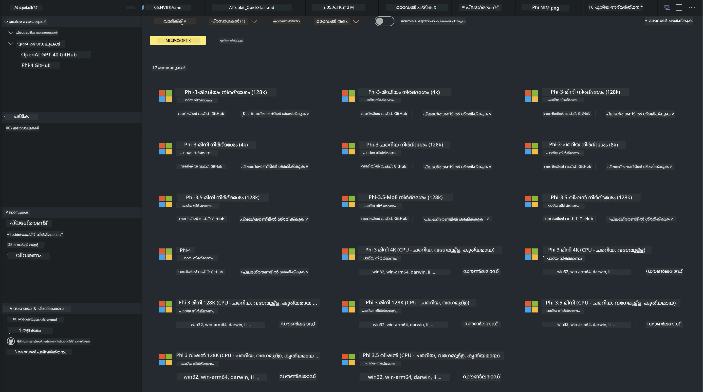
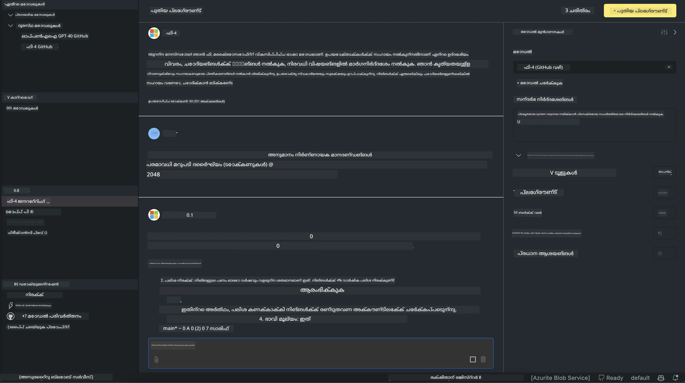

<!--
CO_OP_TRANSLATOR_METADATA:
{
  "original_hash": "4951d458c0b60c02cd1e751b40903877",
  "translation_date": "2025-12-21T23:48:11+00:00",
  "source_file": "md/01.Introduction/02/05.AITK.md",
  "language_code": "ml"
}
-->
# Phi കുടുംബം AITK-ൽ

[AI Toolkit for VS Code](https://marketplace.visualstudio.com/items?itemName=ms-windows-ai-studio.windows-ai-studio) Azure AI Foundry Catalog և Hugging Face പോലുള്ള ఇతర കാറ്റലോഗുകളിൽ നിന്ന് ഉള്ള അതിരൂക്ഷ AI വികസന ഉപകരണങ്ങളും മോഡലുകളും ഒന്നിച്ച് കൊണ്ടുവരിക വഴി ജനറേറ്റീവ് AI ആപ്പ് വികസനം ലളിതമാക്കുന്നു. GitHub Models এবং Azure AI Foundry Model Catalogs দ্বারা ശക്തിപ്പെടുത്തിയ AI മോഡൽ കാറ്റലോഗ് ബ്രൗസ് ചെയ്യാനും, ലൊക്കലായി അല്ലെങ്കിൽ റിമോട്ട് ആയി ഡൗൺലോഡ് ചെയ്യാനും, ഫൈൻ-ട്യൂൺ ചെയ്യാനും, പരീക്ഷിക്കാനും നിങ്ങളുടെ അപ്ലിക്കേഷനിൽ ഉപയോഗിക്കാനുമാണ് നിങ്ങൾക്ക് സാധിക്കുകയെന്ന്.

AI Toolkit പ്രിവ്യൂ lokaliyayi പ്രവർത്തിക്കും. ലൊക്കൽ ഇൻഫറൻസ് അല്ലെങ്കിൽ ഫൈൻ-ട്യൂൺ, നിങ്ങളുടെ തിരഞ്ഞെടുക്കുന്ന മോഡലിൽ nirbharichu, NVIDIA CUDA GPU പോലുള്ള GPU എന്നുണ്ടാകേണ്ടി വരാമെന്ന് അറിയുക. AITK ഉപയോഗിച്ച് GitHub Models നേരിട്ട് പ്രവർത്തിപ്പിക്കാനും സാധിക്കും.

## തുടങ്ങൽ

[Windows subsystem for Linux എങ്ങനെ ഇൻസ്റ്റാൾ ചെയ്യാമെന്ന് കൂടുതൽ അറിയുക](https://learn.microsoft.com/windows/wsl/install?WT.mc_id=aiml-137032-kinfeylo)

മറ്റും [ഡിഫോൾട്ട് ഡിസ്ട്രിബ്യൂഷൻ മാറ്റുന്നത്](https://learn.microsoft.com/windows/wsl/install#change-the-default-linux-distribution-installed) സംബന്ധിച്ച വിവരങ്ങൾ കാണുക.

[AI Tooklit GitHub Repo](https://github.com/microsoft/vscode-ai-toolkit/)

- Windows,Linux,macOS
  
- Windowsയും Linuxഉം दोनों-ൽ ഫൈൻട്യൂണിംഗിന്, നിങ്ങൾക്ക് Nvidia GPU ആവശ്യമുണ്ട്. കൂടാതെ, **Windows** ൽ subsystem for Linux Ubuntu distro 18.4 അല്ലെങ്കിൽ അതിന് മുകളിലുള്ള ഒരു പതിപ്പ് ആവശ്യമാണ്. [Windows subsystem for Linux ഇൻസ്റ്റാൾ ചെയ്യാനുള്ള കൂടുതൽ വിവരങ്ങൾ](https://learn.microsoft.com/windows/wsl/install) കാണുക וגם [ഡിഫോൾട്ട് Linux ഡിസ്ട്രിബ്‌ഷൻ മാറ്റുന്നതിനെക്കുറിച്ച്](https://learn.microsoft.com/windows/wsl/install#change-the-default-linux-distribution-installed) കൂടുതൽ അറിയുക.

### AI Toolkit ഇൻസ്റ്റാൾ ചെയ്യൽ

AI Toolkit ഒരു [Visual Studio Code Extension](https://code.visualstudio.com/docs/setup/additional-components#_vs-code-extensions) ആയി ഷിപ്പ് ചെയ്യപ്പെടുന്നു, അതിനാൽ ആദ്യം [VS Code](https://code.visualstudio.com/docs/setup/windows?WT.mc_id=aiml-137032-kinfeylo) ഇൻസ്റ്റാൾ ചെയ്ത്, AI Toolkit [VS Marketplace](https://marketplace.visualstudio.com/items?itemName=ms-windows-ai-studio.windows-ai-studio) നിന്ന് ഡൗൺലോഡ് ചെയ്യണം.
[AI Toolkit Visual Studio Marketplace-ൽ ലഭ്യമാണ്](https://marketplace.visualstudio.com/items?itemName=ms-windows-ai-studio.windows-ai-studio) және മറ്റു VS Code എക്സ്റ്റൻഷനുകളോ പോലെ ഇൻസ്റ്റാൾ ചെയ്യാം.

VS Code എക്സ്റ്റൻഷനുകൾ ഇൻസ്റ്റാൾ ചെയ്യുന്നതിൽ പരിചയമില്ലെങ്കിൽ, ഈ ചുവടുകൾ പിന്തുടരുക:

### സൈൻ ഇൻ ചെയ്യുക

1. VS Code-ൽ Activity Bar-ൽ **Extensions** തിരഞ്ഞെടുക്കുക
1. Extensions Search ബാറിൽ "AI Toolkit" ടൈപ്പ് ചെയ്യുക
1. "AI Toolkit for Visual Studio code" തിരഞ്ഞെടുക്കുക
1. **Install** തിരഞ്ഞെടുക്കുക

ഇപ്പോൾ, നിങ്ങൾ എക്സ്റ്റൻഷൻ ഉപയോഗിക്കാൻ തയ്യാറാണ്!

നിങ്ങളെ GitHub-ലേക്ക് സൈൻ ഇൻ ചെയ്യാൻ പ്രോംപ്‌ട് ചെയ്യും, തുടര്[tag]തിരിക്കുവാൻ "Allow" ക്ലിക്ക് ചെയ്യുക. നിങ്ങൾ GitHub സൈൻ-ഇൻ പേജിലേക്ക് റീഡയറക്ട് ചെയ്യപ്പെടും.

ദയവായി സൈൻ ഇൻ ചെയ്ത് പ്രക്രിയത്തിലെ ചുവടുകളെ പിന്തുടരുക. വിജയകരമായി പൂർത്തിയായ ശേഷം, നിങ്ങൾ വീണ്ടും VS Code-യിലേക്ക് റീഡയറക്ട് ചെയ്യപ്പെടും.

എക്സ്റ്റൻഷൻ ഇൻസ്റ്റാൾ ചെയ്തതിന്റെ ശേഷം Activity Bar-ൽ AI Toolkit ഐക്കൺ കാണാൻ തുടങ്ങും.

ലഭ്യമായ ആക്ഷനുകൾ പരിശോധിക്കാം!

### ലഭ്യമായ ആക്ഷനുകൾ

AI Toolkit-ന്റെ പ്രൈമറി സൈഡ്‌ബാർ ക്രമീകരിച്ചിരിക്കുന്നത്

- **Models**
- **Resources**
- **Playground**  
- **Fine-tuning**
- **Evaluation**

Resources സെക്ഷനിൽ ലഭ്യമാണ്. തുടങ്ങാൻ **Model Catalog** തിരഞ്ഞെടുക്കുക.

### കാറ്റലോഗിൽ നിന്നൊരു മോഡൽ ഡൗൺലോഡ് ചെയ്യുക

VS Code സൈഡ് ബാറിൽ നിന്ന് AI Toolkit ആരംഭിക്കുമ്പോൾ, താഴെയുള്ള ഓപ്ഷനുകളിൽ നിന്നും തിരഞ്ഞെടുക്കാം:



- **Model Catalog**-യിൽ നിന്ന് പിന്തുണയുള്ള ഒരു മോഡൽ കണ്ടെത്തി ലോക്കലായി ഡൗൺലോഡ് ചെയ്യുക
- **Model Playground**-ൽ മോഡൽ ഇൻഫറൻസ് പരീക്ഷിക്കുക
- **Model Fine-tuning**-ൽ ലൊക്കലായി അല്ലെങ്കിൽ റിമോട്ട് ആയി മോഡൽ ഫൈൻ-ട്യൂൺ ചെയ്യുക
- AI Toolkit-ന്റെ കമാൻഡ് പാലറ്റ് വഴി ഫൈൻ-ട്യൂൺ ചെയ്ത മോഡലുകൾ ക്ലൗഡിൽ ഡിപ്ലോയ് ചെയ്യുക
- മോഡലുകളുടെ മൂല്യനിർണയം (Evaluation)

> [!NOTE]
>
> **GPU Vs CPU**
>
> മോഡൽ കാർഡുകൾ മോഡൽ സൈസ്, പ്ലാറ്റ്‌ഫോം, ആകസเลറേറ്റർ തരം (CPU, GPU) എന്നിവ കാണിക്കുന്നു എന്ന് നിങ്ങൾ ശ്രദ്ധിക്കാം. **ഒരു GPU至少 ഉള്ള Windows ഉപകരണങ്ങളിൽ** മികച്ച പ്രകടനത്തിനായി, Windows മാത്രം ടാർഗറ്റ് ചെയ്യുന്ന മോഡൽ വേർഷനുകൾ തിരഞ്ഞെടുക്കുക.
>
> ഇതിന്റെ ഉപയോഗം DirectML ആക്സിലറേറ്ററിനുള്ളായി ഓപ്റ്റിമൈസ്ഡ് മോഡൽ ഉണ്ടാകുന്നതാണ് ഉറപ്പാക്കുന്നത്.
>
> മോഡൽ പേരുകളുടെ ഫോർമാറ്റ് ഇങ്ങനെ ആണ്
>
> - `{model_name}-{accelerator}-{quantization}-{format}`.
>
>Windows ഉപകരണത്തിൽ GPU ഉണ്ടോ എന്നത് പരിശോധിക്കാൻ, **Task Manager** തുറന്ന് **Performance** ടാബ് തിരഞ്ഞെടുക്കുക. നിങ്ങൾക്ക് GPU(കൾ) ഉണ്ടെങ്കിൽ അവ "GPU 0" അല്ലെങ്കിൽ "GPU 1" പോലുള്ള പേരുകൾക്ക് കീഴിൽ പട്ടികയായി കാണപ്പെടും.

### പ്ലേഗ്രൗണ്ടിൽ മോഡൽ പ്രവർത്തിപ്പിക്കുക

എല്ലാ പാരാമീറ്ററുകളും സജ്ജമായ ശേഷം, **Generate Project** ക്ലിക്ക് ചെയ്യുക.

മോഡൽ ഡൗൺലോഡ് ചെയ്യപ്പെട്ടതിനു ശേഷം, കാറ്റലോഗിലെ മോഡൽ കാർഡിൽ **Load in Playground** തിരഞ്ഞെടുക്കുക:

- മോഡൽ ഡൗൺലോഡ് ആരംഭിക്കുക
- എല്ലാ മുൻ‌ആവശ്യങ്ങളും ഡി‌പെൻഡൻസികളും ഇൻസ്റ്റാൾ ചെയ്യുക
- VS Code വർക്ക്‌സ്പേസ് സൃഷ്ടിക്കുക



### നിങ്ങളുടെ അപ്ലിക്കേഷനിൽ REST API ഉപയോഗിക്കുക

AI Toolkit-നൊപ്പം **port 5272-ൽ** ഒരു ലോക്കൽ REST API വെബ് സെർവർ കൂടിയാണ് വരുന്നതും അത് [OpenAI chat completions format](https://platform.openai.com/docs/api-reference/chat/create) ഉപയോഗിക്കുന്നു.

ഈ വഴി ക്ലൗഡ് AI മോഡൽ സർവീസിനെ ആശ്രയിക്കാതെ തന്നെ നിങ്ങളുടെ അപ്ലിക്കേഷൻ ലോക്കലായി പരീക്ഷിക്കാൻ സാധിക്കും. ഉദാഹരണത്തിന്, ആവശ്യത്തിന്റെ ബോഡിയാണ് എങ്ങനെ കോൺഫിഗർ ചെയ്യാമെന്ന് താഴെയുള്ള JSON ഫയൽ കാണിക്കുന്നു:

```json
{
    "model": "Phi-4",
    "messages": [
        {
            "role": "user",
            "content": "what is the golden ratio?"
        }
    ],
    "temperature": 0.7,
    "top_p": 1,
    "top_k": 10,
    "max_tokens": 100,
    "stream": true
}
```

നിങ്ങൾ [Postman](https://www.postman.com/) പോലുള്ളതോ CURL (Client URL) utility ഉപയോഗിച്ചോ REST API പരീക്ഷിക്കാം:

```bash
curl -vX POST http://127.0.0.1:5272/v1/chat/completions -H 'Content-Type: application/json' -d @body.json
```

### Python-ക്കായി OpenAI ക്ലയന്റ് ലൈബ്രറി ഉപയോഗിക്കൽ

```python
from openai import OpenAI

client = OpenAI(
    base_url="http://127.0.0.1:5272/v1/", 
    api_key="x" # APIയ്ക്ക് ആവശ്യമാണ്, എന്നാൽ ഉപയോഗിക്കപ്പെടുന്നില്ല
)

chat_completion = client.chat.completions.create(
    messages=[
        {
            "role": "user",
            "content": "what is the golden ratio?",
        }
    ],
    model="Phi-4",
)

print(chat_completion.choices[0].message.content)
```

### .NET-ക്കായി Azure OpenAI ക്ലയന്റ് ലൈബ്രറി ഉപയോഗിക്കൽ

NuGet ഉപയോഗിച്ച് നിങ്ങളുടെ പ്രോജക്ടിലേക്ക് [Azure OpenAI client library for .NET](https://www.nuget.org/packages/Azure.AI.OpenAI/) ചേർക്കുക:

```bash
dotnet add {project_name} package Azure.AI.OpenAI --version 1.0.0-beta.17
```

നിങ്ങളുടെ പ്രോജക്ടിൽ **OverridePolicy.cs** എന്ന പേര് നൽകി ഒരു C# ഫയൽ ചേർക്കുകയും താഴെയുള്ള കോഡ് പകർത്തുകയും ചെയ്യുക:

```csharp
// OverridePolicy.cs
using Azure.Core.Pipeline;
using Azure.Core;

internal partial class OverrideRequestUriPolicy(Uri overrideUri)
    : HttpPipelineSynchronousPolicy
{
    private readonly Uri _overrideUri = overrideUri;

    public override void OnSendingRequest(HttpMessage message)
    {
        message.Request.Uri.Reset(_overrideUri);
    }
}
```

അടുത്തതായി, താഴെയുള്ള കോഡ് നിങ്ങളുടെ **Program.cs** ഫയലിലേക്ക് പകർത്തുക:

```csharp
// Program.cs
using Azure.AI.OpenAI;

Uri localhostUri = new("http://localhost:5272/v1/chat/completions");

OpenAIClientOptions clientOptions = new();
clientOptions.AddPolicy(
    new OverrideRequestUriPolicy(localhostUri),
    Azure.Core.HttpPipelinePosition.BeforeTransport);
OpenAIClient client = new(openAIApiKey: "unused", clientOptions);

ChatCompletionsOptions options = new()
{
    DeploymentName = "Phi-4",
    Messages =
    {
        new ChatRequestSystemMessage("You are a helpful assistant. Be brief and succinct."),
        new ChatRequestUserMessage("What is the golden ratio?"),
    }
};

StreamingResponse<StreamingChatCompletionsUpdate> streamingChatResponse
    = await client.GetChatCompletionsStreamingAsync(options);

await foreach (StreamingChatCompletionsUpdate chatChunk in streamingChatResponse)
{
    Console.Write(chatChunk.ContentUpdate);
}
```


## AI Toolkit ഉപയോഗിച്ച് ഫൈൻ-ട്യൂണിംഗ്

- മോഡൽ കണ്ടെത്തലും പ്ലേഗ്രൗണ്ടും ആരംഭിക്കുക.
- ലൊക്കൽ കംപ്യൂട്ടിംഗ് വിഭവങ്ങൾ ഉപയോഗിച്ച് മോഡൽ ഫൈൻ-ട്യുണിംഗും ഇൻഫറൻസും.
- Azure വിഭവങ്ങൾ ഉപയോഗിച്ച് റിമോട്ട് ഫൈൻ-ട്യൂണിംഗ് și ഇൻഫറൻസ്

[Fine Tuning with AI Toolkit](../../03.FineTuning/Finetuning_VSCodeaitoolkit.md)

## AI Toolkit Q&A വിഭവങ്ങൾ

സാമാന്യമായ ബഹുമുഖ പ്രശ്നങ്ങളും പരിഹാരങ്ങളും കാണാൻ ദയവായി ഞങ്ങളുടെ [Q&A പേജ്](https://github.com/microsoft/vscode-ai-toolkit/blob/main/archive/QA.md) കാണുക

---

<!-- CO-OP TRANSLATOR DISCLAIMER START -->
ഡിസ്‌ക്ലെയിമര്‍:

ഈ രേഖ AIപരിഭാഷ സേവനം [Co-op Translator](https://github.com/Azure/co-op-translator) ഉപയോഗിച്ച് പരിഭാഷപ്പെടുത്തിയതാണ്. ഞങ്ങൾ 정확തയ്ക്ക് (തെറ്റില്ലായ്മയ്ക്ക്) ശ്രമിക്കുമ്പോഴും, ഓട്ടോമേറ്റഡ് പരിഭാഷകളിൽ പിശകുകൾ അല്ലെങ്കിൽ അപകൃതികൾ ഉണ്ടാകാൻ സാധ്യതയുണ്ടെന്നും ദയവായി ശ്രദ്ധിക്കുക. ഈ രേഖയുടെ സ്വദേശീഭാഷയിലുള്ള മൂല തർജ്ജമയാണ് പ്രാമാണികമായ ഉറവിടം ആയി കരുതേണ്ടത്. നിർണ്ണായകമായ വിവരങ്ങൾക്കായി പ്രൊഫഷണൽ മാനവപരിഭാഷ ശുപാർശ ചെയ്യപ്പെടുന്നു. ഈ പരിഭാഷ ഉപയോഗിച്ചതിനാൽ ഉണ്ടായേക്കാവുന്ന ഏതെങ്കിലും തെറ്റിദ്ധാരണകൾക്കും വ്യാഖ്യാനപരമായ പിഴവുകൾക്കും ഞങ്ങൾ ഉത്തരവാദികളല്ല.
<!-- CO-OP TRANSLATOR DISCLAIMER END -->