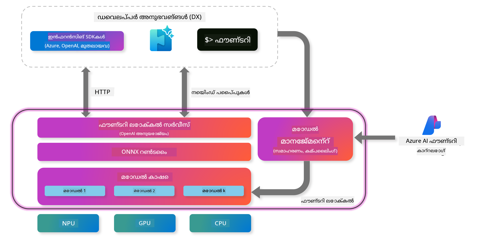
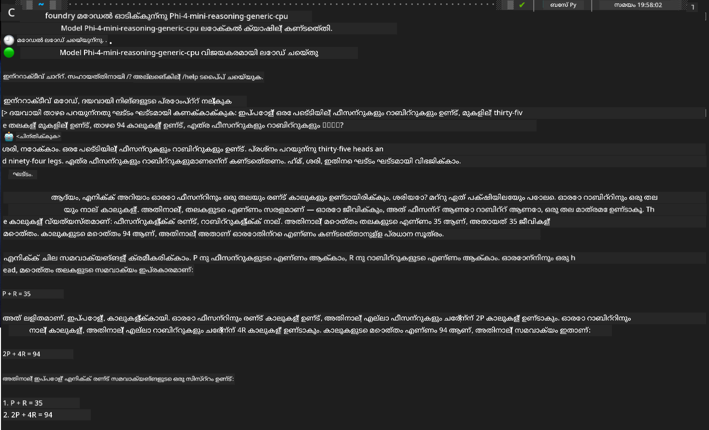

<!--
CO_OP_TRANSLATOR_METADATA:
{
  "original_hash": "52973a5680a65a810aa80b7036afd31f",
  "translation_date": "2025-12-21T23:40:14+00:00",
  "source_file": "md/01.Introduction/02/07.FoundryLocal.md",
  "language_code": "ml"
}
-->
## Foundry Local ൽ Phi-ഫാമിലി മോഡലുകളുമായി ആരംഭിക്കൽ

### Foundry Local പരിചയം

Foundry Local നിങ്ങളുടെ ലോകൽ ഹാർഡ്‌വെയറിൽ നേരിട്ട് എന്റർപ്രൈസ്-ഗ്രേഡ് AI ശേഷികളെ എത്തിക്കുന്ന ശക്തമായ ഓൺ-ഡിവൈസ് AI ഇൻഫറൻസ് പരിഹാരമാണ്. ഈ ട്യൂട്ടോറിയൽ Foundry Local ഉപയോഗിച്ച് Phi-ഫാമിലി മോഡലുകൾ സജ്ജമാക്കാനും ഉപയോഗിക്കാനുമുള്ള മാർഗനിർദേശം നൽകും, നിങ്ങളുടെ AI വർക്ക്‌ലോഡുകൾ മുഴുവനായും നിയന്ത്രിക്കാൻ while സ്വകാര്യത നിലനിർത്തുകയും ചെലവുകൾ കുറയ്ക്കുകയും ചെയ്യുന്നു.

Foundry Local നിങ്ങളുടെ ഡിവൈസിൽ മോഡലുകൾ ലോക്കൽമായി ഓടിക്കുന്നത് വഴി പ്രകടനം, സ്വകാര്യത, ഇഷ്‌ടാനുസരണം ക്രമീകരിക്കൽ, ചെലവ് മുതലായവയിൽ നേട്ടങ്ങൾ നൽകുന്നു. ഇത് ഒരു അന്തസുതീർന്ന CLI, SDK, மற்றும் REST API മുഖേന നിലവിലുള്ള വർക്ക്‌ഫ്ലോകളിലും ആപ്ലിക്കേഷനുകളിലേക്കും സീംലെസ്ലിയായി ഇന്റഗ്രേറ്റ് ചെയ്യുന്നു.




### Foundry Local തിരഞ്ഞെടുക്കേണ്ടത് എന്തുകൊണ്ട്?

Foundry Local-യുടെ പ്രയോജനങ്ങൾ മനസിലാക്കുന്നത് നിങ്ങളുടെ AI ഡിപ്പ്ലോയ്‌മെന്റ് തന്ത്രത്തെക്കുറിച്ച് ബോധ്യമാർന്ന തീരുമാനങ്ങൾ എടുക്കാൻ സഹായിക്കും:

- **ഓൺ-ഡിവൈസ് ഇൻഫറൻസ്:** നിങ്ങളുടെ ഹാർഡ്‌വെയറിൽ തന്നെ മോഡലുകൾ ലോക്കൽ ആയി ഓടിക്കുക, എല്ലാ ഡാറ്റയും നിങ്ങളുടെ ഡിവൈസിൽ തന്നെ നിലനിർത്തുമ്പോൾ ചെലവുകൾ കുറക്കുക.

- **മോഡൽ ഇഷ്‌ടാനുസരണം ക്രമീകരിക്കൽ:** മുൻകൂട്ടി നിശ്ചയിച്ച മോഡലുകളിൽ നിന്ന് തിരഞ്ഞെടുക്കുക അല്ലെങ്കിൽ പ്രത്യേക ആവശ്യങ്ങൾക്കും ഉപയോഗത്തിനും ستاسو സ്വന്തം മോഡലുകൾ ഉപയോഗിക്കുക.

- **ചെലവ് കാര്യക്ഷമത:** നിലവിലുള്ള ഹൊർഡ്‌വെയർ ഉപയോഗിച്ച് ആവർത്തിക്കുന്ന ക്ലൗഡ് സർവീസ് ചെലവുകൾ ഒഴിവാക്കുക, AI കൂടുതൽ സുലഭമാക്കുക.

- **സഹജ സംയോജനം:** ഒരു SDK, API എൻഡ്പോയിന്റുകൾ, അല്ലെങ്കിൽ CLI മുഖേന നിങ്ങളുടെ ആപ്ലിക്കേഷനുകളുമായി ബന്ധിപ്പിക്കുക, ആവശ്യമായപ്പോൾ Azure AI Foundry യിലേക്ക് എളുപ്പത്തിൽ സ്കെയിൽ ചെയ്യാം.

> **ആരംഭിക കുറിപ്പ്:** ഈ ട്യൂട്ടോറിയൽ CLI, SDK ഇന്റർഫേസുകൾ വഴി Foundry Local ഉപയോഗിക്കലിനെ കുറിച്ച് കേന്ദ്രീകരിക്കുന്നു. നിങ്ങളുടെ ഉപയോഗക്കേസിനുള്ള മികച്ച വിധം തിരഞ്ഞെടുക്കാൻ നിങ്ങള്‍ക്ക് രണ്ട് സമീപനങ്ങളും പഠിപ്പിക്കും.

## ഭാഗം 1: Foundry Local CLI സജ്ജമാക്കൽ

### ഘട്ടം 1: ഇൻസ്റ്റലേഷൻ

Foundry Local CLI നിങ്ങളുടെ സിസ്റ്റത്തിൽ ലോക്കൽ ആയി AI മോഡലുകൾ മാനേജ് ചെയ്യാനും ഓടിക്കാനും ഉള്ള പ്രവേശനദ്വാരമാണ്. ഇത് നിങ്ങളുടെ സിസ്റ്റത്തിൽ ഇൻസ്റ്റാൾ ചെയ്യുന്നതോടെ ആരംഭിക്കാം.

**സഹിക്കുന്ന പ്ലാറ്റ്ഫോമുകൾ:** Windows and macOS

വിവരമുള്ള ഇൻസ്റ്റലേഷൻ നിർദ്ദേശങ്ങൾക്ക് ദയവായി [ഔദ്യോഗിക Foundry Local ഡോക്യുമെന്റേഷൻ](https://github.com/microsoft/Foundry-Local/blob/main/README.md) കാണുക.

### ഘട്ടം 2: ലഭ്യമായ മോഡലുകൾ അന്വേഷിക്കൽ

Foundry Local CLI ഇൻസ്റ്റാൾ ചെയ്ത ശേഷം, നിങ്ങളുടെ ഉപയോഗ കേസിന് ലഭ്യമായ മോഡലുകൾ കണ്ടെത്താൻ നിങ്ങൾക്ക് സാധിക്കും. ഈ കമാൻഡ് എല്ലാ പിന്തുണയുള്ള മോഡലുകളും കാണിക്കും:


```bash
foundry model list
```

### ഘട്ടം 3: Phi ഫാമിലി മോഡലുകൾ മനസിലാക്കുക

Phi ഫാമിലി വ്യത്യസ്ത ഉപയോഗകേസുകൾക്കും ഹാർഡ്‌വെയർ കോൺഫിഗറേഷനുകൾക്കും അനുയോജ്യമായ നിരവതി മോഡലുകൾ വാഗ്‌ദാനം ചെയ്യുന്നു. Foundry Local-ിൽ ലഭ്യമായ Phi മോഡലുകൾ ഇവയാണ്:

**Available Phi Models:** 

- **phi-3.5-mini** - അടിസ്ഥാന ജോലി നിർവഹണങ്ങൾക്ക് സൗക്ഷ്മ്യമായ മോഡൽ
- **phi-3-mini-128k** - കൂടുതൽ ദൈർഘ്യമുള്ള സംഭാഷണങ്ങൾക്ക് വിപുലീകരിച്ച കോൺടെക്സ്റ്റ് പതിപ്പ്
- **phi-3-mini-4k** - പൊതുവായ ഉപയോഗത്തിനുള്ള സ്റ്റാൻഡേർഡ് കോൺടെക്സ്റ്റ് മോഡൽ
- **phi-4** - മെച്ചപ്പെട്ട ശേഷികളുള്ള പുരോഗമിത മോഡൽ
- **phi-4-mini** - Phi-4-ന്റെ ലളിതമായ സംസ്കരണം
- **phi-4-mini-reasoning** - സ്ട്രെപ്-ബൈ-സ്ട്രെപ് ലોજിക്കൽ റെസണിംഗ് പ്രവർത്തനങ്ങൾക്ക് പ്രത്യേകിച്ചായി രൂപകൽപ്പന ചെയ്‌തത്

> **Hardware Compatibility:** Each model can be configured for different hardware acceleration (CPU, GPU) depending on your system capabilities.

### ഘട്ടം 4: നിങ്ങളുടെ ആദ്യ Phi മോഡൽ ഓടിക്കുക

പ്രായോഗിക ഉദാഹരണത്തോടെ തുടങ്ങാം. സ്ടെപ് ബൈ സ്ടെപ് പ്രശ്നപരിഹാരത്തിൽ ലാഘവമുള്ള `phi-4-mini-reasoning` മോഡൽ നാം ഉപയോഗിക്കാം.


**മോഡൽ ഓടിക്കുന്നതിന് കമാൻഡ്:**

```bash
foundry model run Phi-4-mini-reasoning-generic-cpu
```

> **ആദിമാസം സംവിധാനം സെറ്റ്‌അപ്പ്:** ഒരു മോഡൽ ആദ്യമായി ഓടിക്കുമ്പോൾ, Foundry Local അത് സ്വയം നിങ്ങളുടെ ലോകൽ ഡിവൈസിലേക്ക് ഡൗൺലോഡ് ചെയ്യും. നിങ്ങളുടെ നെറ്റ്‌വർക്ക് വേഗത അനുസരിച്ച് ഡൗൺലോഡ് സമയമുണ്ടായേക്കും, അതിനാൽ പ്രഥമ സജ്ജീകരണത്തിൽ ദയവായി സഹനമുണ്ടാകുക.

### ഘട്ടം 5: യാഥാർത്ഥപ്രശ്നത്തോടെ മോഡൽ പരിശോധിക്കൽ

ഇപ്പോൾ സ്റ്റെപ്-ബൈ-സ്റ്റെപ് റെസണിംഗ് എങ്ങനെ പ്രവർത്തിക്കുന്നതെന്ന് കാണാൻ ക്ലാസിക് ലൊജിക് പ്രശ്നത്തിൽ നിന്നുള്ള ഒരു ഉദാഹരണം ഉപയോഗിച്ച് മോഡൽ പരിശോദിക്കാം:

**ഉദാഹരണ പ്രശ്നം:**

```txt
Please calculate the following step by step: Now there are pheasants and rabbits in the same cage, there are thirty-five heads on top and ninety-four legs on the bottom, how many pheasants and rabbits are there?
```

**പ്രതീക്ഷിക്കപ്പെട്ട പെരുമാറ്റം:** മോഡൽ ഈ പ്രശ്നത്തെ ലജിക്കൽ ഘട്ടങ്ങളായി വിഭജിച്ച് പരിഹരിക്കണം, ഫീസന്റുകൾക്ക് 2 കാലുകളുണ്ടെന്നും മുയലുകൾക്ക് 4 കാലുകളുണ്ടെന്നതുപയോഗിച്ച് സമീകരണ സംവിധാനത്തെ പരിഹരിക്കുക.

**ഫലങ്ങൾ:**



## ഭാഗം 2: Foundry Local SDK ഉപയോഗിച്ച് ആപ്ലിക്കേഷനുകൾ നിർമ്മിക്കൽ

### SDK എന്തിന് ഉപയോഗിക്കണം?

ടെസ്റ്റിങ്ങിനും ത്വരിത ഇടപെടൽക്കുമുള്ള CLI അനുയോജ്യമായതിനൊപ്പം, SDK Foundry Local আপনার ആപ്ലിക്കേഷനുകളിൽ പ്രോഗ്രാമാറ്റിക്കായി ഇന്റഗ്രേറ്റ് ചെയ്യാൻ സാധ്യമാക്കും. ഇത് സാധ്യമാക്കുന്നത്:

- കസ്റ്റം AI-സক্ষম ആപ്ലിക്കേഷനുകൾ നിർമ്മിക്കൽ
- ഓട്ടോമേറ്റഡ് വർക്ക്‌ഫ്ലോകൾ സൃഷ്ടിക്കൽ
- നിലവിലുള്ള സിസ്റ്റങ്ങളില into AI ശേഷികൾ ഇന്റഗ്രേറ്റ് ചെയ്യൽ
- ചാറ്റ്ബോട്ടുകളുടെയും ഇന്ററാക്ടീവ് ടൂളുകളുടെയും വികസനം

### പിന്തുണയുള്ള പ്രോഗ്രാമിംഗ് ഭാഷകൾ

Foundry Local നിങ്ങളുടെ ഡെവലപ്പ്മെന്റ് മുൻഗണനകൾക്ക് അനുയോജ്യമായി ബഹുഭാഷാ SDK പിന്തുണ നൽകുന്നു:

**📦 ലഭ്യമായ SDKകൾ:**

- **C# (.NET):** [SDK രേഖകളും ഉദാഹരണങ്ങളും](https://github.com/microsoft/Foundry-Local/tree/main/sdk/cs)
- **Python:** [SDK രേഖകളും ഉദാഹരണങ്ങളും](https://github.com/microsoft/Foundry-Local/tree/main/sdk/python)
- **JavaScript:** [SDK രേഖകളും ഉദാഹരണങ്ങളും](https://github.com/microsoft/Foundry-Local/tree/main/sdk/js)
- **Rust:** [SDK രേഖകളും ഉദാഹരണങ്ങളും](https://github.com/microsoft/Foundry-Local/tree/main/sdk/rust)

### അടുത്ത ഘട്ടങ്ങൾ

1. **നിങ്ങളുടെ വികസന പരിസ്ഥിതിയെ അടിസ്ഥാനമാക്കി ഇഷ്ടപ്പെട്ട SDK തിരഞ്ഞെടുക്കുക**
2. **വിശദമായ നടപ്പാക്കൽ മാർഗ നിർദ്ദേശങ്ങൾക്കായി SDK-സ്പെസിഫിക് ഡോക്യുമെന്റേഷൻ പിന്തുടരുക**
3. **കഠിനമായ ആപ്ലിക്കേഷനുകൾ നിർമ്മിക്കുന്നതിന് മുമ്പ് ലളിതമായ ഉദാഹരണങ്ങൾ ഉപയോഗിച്ച് തുടങ്ങുക**
4. **പ്രതീകം കോഡ് ഓരോ SDK റീപോസിറ്ററിയിലും നൽകിയിരിക്കുന്നത് പരിശോധിക്കുക**

## സംഗ്രഹം

ഇപ്പോൾ നിങ്ങൾക്ക് ഇതെന്താണ് അറിയാം:
- ✅ Foundry Local CLI ഇൻസ്റ്റാൾ ചെയ്യാനും സജ്ജമാക്കാനും
- ✅ Phi ഫാമിലി മോഡലുകൾ കണ്ടെത്താനും ഓടിക്കാനും
- ✅ യഥാർത്ഥ ലോക പ്രശ്നങ്ങളുമായി മോഡലുകൾ പരീക്ഷിക്കാനുമായി
- ✅ ആപ്ലിക്കേഷൻ ഡെവലപ്പ്മെന്റിനുള്ള SDK ഓപ്ഷനുകൾ മനസിലാക്കാൻ

Foundry Local നിങ്ങളുടെ ലോക്കൽ പരിസ്ഥിതിയില്‍ നേരിട്ട് AI ശേഷികൾ കൊണ്ടുവരുന്നതിനുള്ള ശക്തമായ അടിസ്ഥാനത്തെക്കൊണ്ട് പ്രകടനം, സ്വകാര്യത, ചെലവ് എന്നിവയില്‍ നിനക്ക് კონტრോൾ നൽകുന്നു, അതേ സമയം ആവശ്യമായപ്പോൾ ക്ലൗഡ് പരിഹാരങ്ങളിലേക്ക് സ്കെയിൽ ചെയ്യാനുള്ള ഫ്ലെക്സിബിലിറ്റിയും നിലനിർത്തുന്നു.

---

<!-- CO-OP TRANSLATOR DISCLAIMER START -->
അറിയിപ്പ്:
ഈ രേഖ AI വിവർത്തന സേവനമായ [Co-op Translator](https://github.com/Azure/co-op-translator) ഉപയോഗിച്ച് വിവർത്തനം ചെയ്തതാണ്. നാം കൃത്യതയ്ക്ക് ശ്രമിച്ചുകൊണ്ടിരിക്കുമ്പോഴും, ഓട്ടോമേറ്റഡ് വിവർത്തനങ്ങളിൽ പിശകുകളും അകൃത്യതകളും ഉണ്ടാകാനുള്ള സാധ്യതയുണ്ടെന്ന് ദയവായി ശ്രദ്ധിക്കുക. മൂല രേഖയുടെ സ്വന്തം ഭാഷയിലെ പതിപ്പ് അധികാരപരമായ ഉറവിടമായി കണക്കാക്കപ്പെടണം. നിര്‍ണായകമായ വിവരങ്ങൾക്കായി പ്രൊഫഷണൽ മനുഷ്യ വിവർത്തനം ശുപാർശിക്കുന്നു. ഈ വിവർത്തനത്തിന്റെ ഉപയോഗത്തിൽ നിന്നുണ്ടാകുന്ന ഏതെങ്കിലും തെറ്റിദ്ധാരണകൾക്കും തെറ്റായ വ്യാഖ്യാനങ്ങൾക്കുമ 우리는 ഉത്തരവാദികളല്ല.
<!-- CO-OP TRANSLATOR DISCLAIMER END -->