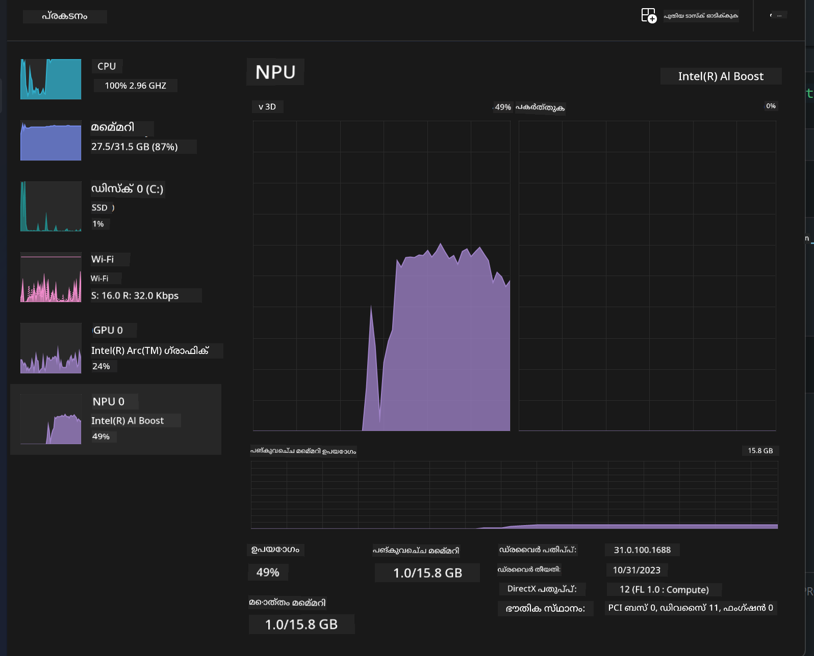
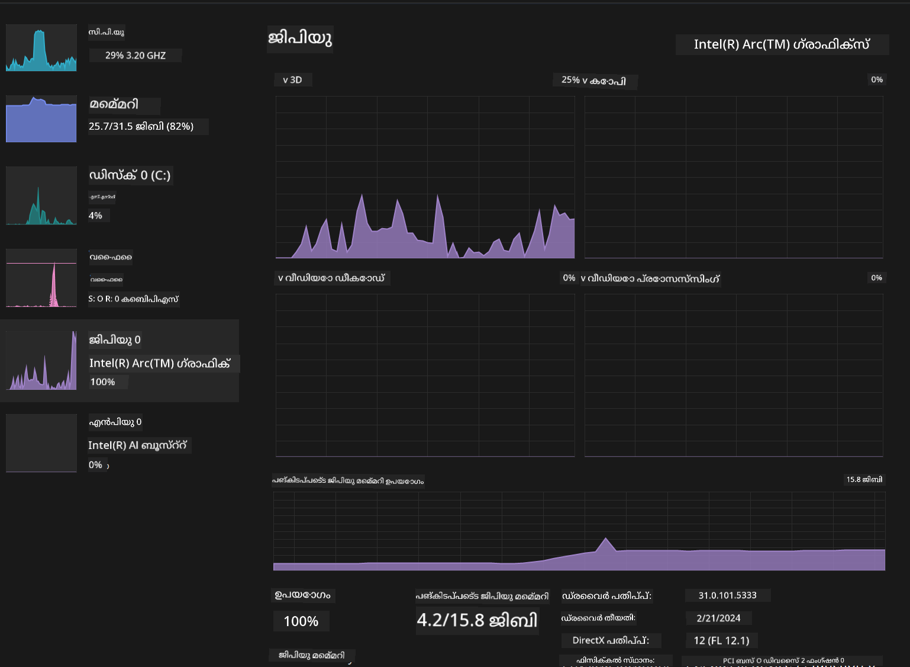

<!--
CO_OP_TRANSLATOR_METADATA:
{
  "original_hash": "e08ce816e23ad813244a09ca34ebb8ac",
  "translation_date": "2025-12-22T00:28:19+00:00",
  "source_file": "md/01.Introduction/03/AIPC_Inference.md",
  "language_code": "ml"
}
-->
# **AI PC-ൽ Phi-3 ന്റെ ഇൻഫറൻസ്**

ജനറേറ്റീവ് AI-യുടെ പുരോഗതിയും എഡ്ജ് ഡിവൈസ് ഹാർഡ്‌വെയർ ശേഷികളുടെ മെച്ചവും കൊണ്ട്, ഉപയോക്താക്കളുടെ Bring Your Own Device (BYOD) ഡിവൈസുകളിൽ കൂടുതൽ ജനറേറ്റീവ് AI മോഡലുകൾ ഇന്റഗ്രേറ്റ് ചെയ്യാൻ കഴിഞ്ഞിരിക്കുന്നു. AI PC-കളും ഈ മോഡलोंിലൊന്നാണ്. 2024 മുതൽ Intel, AMD, Qualcomm എന്നിവ PC നിർമ്മാതാക്കളുമായി സഹകരിച്ചു ഹാർഡ്‌വെയർ മാറ്റങ്ങൾ വഴി ലൊക്കൽ ചെയ്ത ജനറേറ്റീവ് AI മോഡലുകളുടെ ഡിപ്ലോയ്‌മെന്റ് സുലഭമാക്കുന്ന AI PC-കൾ എത്തിച്ചു. ഇവിടെ നാം Intel AI PC-കളെ കേന്ദ്രീകരിച്ച് Intel AI PC-ൽ Phi-3 എങ്ങനെ ഡിപ്ലോയ് ചെയ്യാമെന്ന് ആലോചിക്കാം.

### NPU എന്താണ്

NPU (Neural Processing Unit) ഒരു വലിയ SoC-യിലെ പ്രത്യേക പ്രോസസ്സറുകൾ അല്ലെങ്കിൽ പ്രോസസ്സിംഗ് യൂണിറ്റാണ്, ന്യുറൽ നെറ്റ്‍വർക്കിന്റെ ഓപ്പറേഷനുകൾക്കും AI ജോലികൾക്കും വേഗത വർധിപ്പിക്കാൻ പ്രത്യേകമായി രൂപകൽപ്പന ചെയ്തതാണ്. പൊതു ഉപയോഗത്തിലുള്ള CPUകൾക്കും GPUകൾക്കും വിരുദ്ധമായി, NPUs ഡാറ്റ-ചാലിതമായ პარലൽ കമ്പ്യൂട്ടിങ്ങിന് ഏറ്റവും അനുയോജ്യമായി സജ്ജീകരിച്ചിരിക്കുന്നതിനാൽ വലിയ മൾട്ടിമീഡിയ ഡാറ്റ (വീഡിയോകൾ, ചിത്രങ്ങൾ) പ്രോസസ് ചെയ്യുന്നതിലും ന്യുറൽ നെറ്റ്‌വർക്ക് ഡാറ്റ പ്രോസസ്സിംഗിലും അതിവിശിഷ്ടമായ കാര്യക്ഷമത കാണിക്കുന്നു. സ്പീച്ച് റെക്കഗ്നിഷൻ, വീഡിയോ കോളുകളിൽ പശ്ചാത്തല ബ്ലർ ചെയ്യൽ, ഒബ്ജക്റ്റ് ഡിറ്റക്ഷൻ പോലെയുള്ള AI-ബന്ധിത ടാസ്കുകളിൽ ഇവ പ്രത്യേകമായി പ്രാവീണ്യം പുലർത്തുന്നു.

## NPU vs GPU

ബഹുഭാഗം AI/മെഷീൻ ലേണിംഗ് വർക്ക്‌ലോഡുകൾ GPU-കളിൽ പ്രവർത്തിക്കുന്നതിനാൽ GPU-കളും NPU-കളും തമ്മിൽ മിഥ്യത്വം നിസ്സാരമല്ല.
GPU-കൾ പരലൽ കമ്പ്യൂട്ടിങ്ങിന് പ്രസിദ്ധരാണ്, എങ്കിലും എല്ലാ GPU-കളും ഗ്രാഫിക്‌സ് പ്രോസസ്സിംഗിന് പുറമേ സമാനമായി കാര്യക്ഷമമല്ല. മറുവശത്ത്, NPUs ന്യുറൽ നെറ്റ്‌വർക്ക് ഓപ്പറേഷനുകളിൽ ഉൾപ്പെടുന്ന സങ്കീർണ കണക്കുകൾക്കായി പ്രത്യേകമായി രൂപകൽപ്പന ചെയ്തതാണ്, അതുകൊണ്ട് AI ടാസ്കുകൾക്ക് അവ വളരെ ഫലപ്രദമാണ്.

സംക്ഷേപത്തിൽ, NPUs ആണ് AI കണക്ക് പ്രവർത്തനങ്ങൾക്ക് വേഗം കൂട്ടുന്ന ഗണിത വിസ്മയക്കാർ, അവ AI PC-കളുടെ ഉദയകാലത്തിൽ പ്രധാന പങ്ക് വഹിക്കുന്നു!

***ഈ ഉദാഹരണം Intel-ന്റെ പുതിയ Intel Core Ultra Processor-നെയാണ് അടിസ്ഥാനമാക്കിയുള്ളത്***

## **1. NPU ഉപയോഗിച്ച് Phi-3 മോഡൽ പ്രവർത്തിപ്പിക്കുക**

Intel® NPU ഡിവൈസ് Intel ക്ലയന്റ് CPU-കളുമായി ഇന്റിഗ്രേറ്റ് ചെയ്ത ഒരു AI ഇൻഫറൻസ് ആക്സിലറേറ്ററാണ്, Intel® Core™ Ultra തലമുറയിലെ CPU-കളിൽ (മുൻപ് Meteor Lake എന്നറിയപ്പെടുന്നത്) ആരംഭിച്ച് കാണപ്പെടുന്നു. ഇത് ആർട്ടിഫിഷ്യൽ ന്യൂറൽ നെറ്റ്‌വർക്ക് ടാസ്കുകൾ എനർജി-ഫലപ്രദമായി പ്രയോഗിക്കാൻ സഹായിക്കുന്നു.


**Intel NPU Acceleration Library**

Intel NPU Acceleration Library [https://github.com/intel/intel-npu-acceleration-library](https://github.com/intel/intel-npu-acceleration-library) നിങ്ങളുടെ അപ്ലിക്കേഷനുകളുടെ കാര്യക്ഷമത വർദ്ധിപ്പിക്കാൻ Intel Neural Processing Unit (NPU)-യുടെ ശക്തി പ്രയോജനപ്പെടുത്തുന്ന Python ലൈബ്രറിയാണ്, അനുയോജ്യമായ ഹാർഡ്‌വെയറിൽ ഉയർന്ന വേഗത്തിൽ കണക്കുകൾ നിർവഹിക്കാൻ സഹായിക്കുന്നു.

Intel® Core™ Ultra പ്രോസസ്സറുകൾ ഉപയോഗിച്ച AI PC-ലിലെ Phi-3-mini ഉദാഹരണത്തിന്റെ ഡെമോ.


pip ഉപയോഗിച്ച് Python ലൈബ്രറി ഇൻസ്റ്റാൾ ചെയ്യുക

```bash

   pip install intel-npu-acceleration-library

```

***കുറിപ്പ്*** ഈ പ്രോജക്ട് ഇപ്പോഴും വികസനത്തിലാണെങ്കിലും, റഫറൻസ് മോഡൽ ഇതിനകം വളരെ പരിപാവനമാണ്.

### **Intel NPU Acceleration Library ഉപയോഗിച്ചുള്ള Phi-3 പ്രവർത്തനരീതി**

Intel NPU ആക്സിലറേഷൻ ഉപയോഗിക്കുമ്പോൾ, ഈ ലൈബ്രറി പരമ്പരാഗത എൻകോഡിംഗ് പ്രക്രിയയെ ബാധിക്കുന്നില്ല. നിങ്ങൾക്ക് വേണ്ടത് मूल Phi-3 മോഡൽ ഈ ലൈബ്രറിയിലൂടെ ക്വാണ്ടൈസ് ചെയ്യുക മാത്രമാണ്, ഉദാ: FP16, INT8, INT4 തുടങ്ങിയവ.

```python
from transformers import AutoTokenizer, pipeline,TextStreamer
from intel_npu_acceleration_library import NPUModelForCausalLM, int4
from intel_npu_acceleration_library.compiler import CompilerConfig
import warnings

model_id = "microsoft/Phi-3-mini-4k-instruct"

compiler_conf = CompilerConfig(dtype=int4)
model = NPUModelForCausalLM.from_pretrained(
    model_id, use_cache=True, config=compiler_conf, attn_implementation="sdpa"
).eval()

tokenizer = AutoTokenizer.from_pretrained(model_id)

text_streamer = TextStreamer(tokenizer, skip_prompt=True)
```

ക്വാണ്ടൈസേഷന്‍ വിജയിച്ചശേഷം, Phi-3 മോഡൽ പ്രവർത്തിപ്പിക്കാൻ NPU കാൾ ചെയ്യാൻ തുടക്കം കുറിക്കുക.

```python
generation_args = {
   "max_new_tokens": 1024,
   "return_full_text": False,
   "temperature": 0.3,
   "do_sample": False,
   "streamer": text_streamer,
}

pipe = pipeline(
   "text-generation",
   model=model,
   tokenizer=tokenizer,
)

query = "<|system|>You are a helpful AI assistant.<|end|><|user|>Can you introduce yourself?<|end|><|assistant|>"

with warnings.catch_warnings():
    warnings.simplefilter("ignore")
    pipe(query, **generation_args)
```

കോഡ് നടപ്പാക്കുമ്പോൾ, Task Manager വഴി NPU-യുടെ പ്രവർത്തന നില കാണാൻ സാധിക്കും



***Samples*** : [AIPC_NPU_DEMO.ipynb](../../../code/03.Inference/AIPC/AIPC_NPU_DEMO.ipynb)

## **2. DirectML + ONNX Runtime ഉപയോഗിച്ച് Phi-3 മോഡൽ പ്രവർത്തിപ്പിക്കുക**

### **DirectML എന്താണ്**

[DirectML](https://github.com/microsoft/DirectML) ഒരു ഹൈ-പെർഫോമൻസ്, ഹാർഡ്‌വെയർ-ആക്സിലറേറ്റഡ് DirectX 12 ലൈബ്രറിയാണ് മെഷീൻ ലേണിങ്ങിനായി. DirectML വിവിധ പിന്തുണയുള്ള ഹാർഡ്‌വെയറുകളിലും ഡ്രൈവറുകളിലുമായി സാധാരണ മെഷീൻ ലേണിംഗ് ടാസ്കുകൾക്ക് GPU ആക്സിലറേഷൻ നൽകുന്നു, ഇതിൽ AMD, Intel, NVIDIA, Qualcomm എന്നിവർക്കുള്ള എല്ലാ DirectX 12-സജ്ജ GPU-കളും ഉൾപ്പെടുന്നു.

സ്വതന്ത്രമായി ഉപയോഗിക്കുമ്പോൾ, DirectML API ഒരു ലോ-ലേവൽ DirectX 12 ലൈബ്രറിയാണ് ಮತ್ತು ഫ്രെയിംവർക്ക്‌സ്, ഗെയിമുകൾ, മറ്റു റിയൽ-ടൈം ആപ്ലിക്കേഷനുകൾ പോലുള്ള ഹൈ-പെർഫോമൻസ്, ലോ-ലെറ്റൻസി ആപ്ലിക്കേഷനുകൾക്ക് അനുയോജ്യമാണ്. Direct3D 12-യുമായുള്ള DirectML-യുടെ സീംലെസ്സ് ഇന്റർഓപ്പറബിലിറ്റി, അതിന്റെ കുറഞ്ഞ ഓവർഹെഡ്, ഹാർഡ്‌വെയറുകൾക്ക് മധ്യേ ഫലപ്രദമായ ഒത്തുചേരൽ DirectML-നെ മെച്ചപ്പെട്ട പ്രകടനവും നൽകുമ്പോൾ ഹാർഡ്‌വെയറുകൾക്കിടയിൽ ഫലങ്ങളുടെ വിശ്വാസ്യതയും പ്രവച്യതയും ആവശ്യമായപ്പോൾ മെഷീൻ ലേണിംഗ് ആക്സിലറേഷനായി അനുയോജ്യമായതായി മാറ്റുന്നു.

***കുറിപ്പ്*** : പുതിയ DirectML ഇതിനകം NPU-യെ പിന്തുണക്കുന്നു (https://devblogs.microsoft.com/directx/introducing-neural-processor-unit-npu-support-in-directml-developer-preview/)

### DirectMLയും CUDAയും അവരുടെ കഴിവുകളും പ്രകടനവും വിഷയത്തിൽ:

**DirectML** Microsoft വികസിപ്പിച്ച മെഷീൻ ലേണിംഗ് ലൈബ്രറിയാണ്. ഇത് Windows ഡിവൈസുകളിലെ യഥാർത്ഥ മെഷീൻ ലേണിംഗ് വർക്ക്‌ലോഡുകൾക്ക് വേഗത നൽകാൻ രൂപകൽപ്പന ചെയ്തതായിരിക്കുന്നു, ഡെസ്ക്ടോപ്പുകൾ, ലാപ്ടോപ്പുകൾ, എഡ്ജ് ഡിവൈസുകൾ എന്നിവ ഉൾപ്പെടെ.
- DX12-ആധാരിതം: DirectML DirectX 12 (DX12) യുടെ മേലെയാണ് നിർമ്മിച്ചിരിക്കുന്നത്, ഇത് NVIDIA, AMD എന്നിവളടക്കം GPU-കളിൽ വ്യാപകമായ ഹാർഡ്‌വെയർ പിന്തുണ നൽകുന്നു.
- വിപുലമായ പിന്തുണ: DX12 ഉപയോഗിച്ചതിനാൽ, DirectML DX12 പിന്തുണയുള്ള ഏതു GPU-യുമായും പ്രവർത്തിക്കാവുന്നതാണ്, ഇന്റഗ്രേറ്റഡ് GPU-കളും ഉൾപ്പെടെ.
- ഇമേജ് പ്രോസസ്സിംഗ്: DirectML ഇമേജുകൾക്കും മറ്റ് ഡാറ്റക്കും ന്യുറൽ നെറ്റ്‌വർക്കുകൾ ഉപയോഗിച്ച് പ്രോസസ് ചെയ്യുന്നു, ഇത് ഇമേജ് റെക്കഗ്നിഷൻ, ഒബ്ജക്ട് ഡിറ്റക്ഷൻ എന്നിവ പോലുള്ള ജോലികൾക്ക് അനുയോജ്യമാണ്.
- സെറപ്പുള്ള സെറ്റ് അപ്പ്: DirectML സജ്ജമാക്കുന്നത് ലളിതമാണ്, GPU നിർമ്മാതാക്കളിൽ നിന്നും പ്രത്യേക SDKകൾ അല്ലെങ്കിൽ ലൈബ്രറികൾ ആവശ്യപ്പെടില്ല.
- പ്രകടനം: ചില സാഹചര്യങ്ങളിൽ, DirectML മികച്ച പ്രകടനം നൽകുകയും CUDA-യെക്കാൾ വേഗമേറിയതായിരിക്കാൻ സാധ്യതയും ഉണ്ട്, പ്രത്യേക വർക്ക്‌ലോഡുകൾക്കായി.
- പരിധികൾ: എന്നാൽ, FP16 ലാർജ് ബാച്ചുകൾ പോലുള്ള ചില സാഹചര്യങ്ങളിൽ DirectML മന്ദഗതിയിലായിരിക്കാം.

**CUDA** NVIDIA-യുടെ പാരലൽ കമ്പ്യൂട്ടിംഗ് പ്ലാറ്റ്‌ഫോം ಹಾಗೂ പ്രോഗ്രാമിങ് മാതൃകയാണ്. ഇത് ഡെവലപ്പർമാർക്ക് NVIDIA GPU-കളിന്റെ ശക്തി ജനറൽ-പർപ്പസ് കമ്പ്യൂട്ടിങ്ങിനായി ഉപയോഗിക്കാൻ അനുവദിക്കുന്നു, മെഷീൻ ലേണിംഗ്, ശാസ്ത്രീയ സിമുലേഷൻ എന്നിവ ഉൾപ്പെടെ.
- NVIDIA-നിര്ദ്ദിഷ്ടം: CUDA NVIDIA GPU-കളുമായി കെട്ടിപ്പടുത്താണ് രൂപകൽപ്പന ചെയ്തിരിക്കുന്നത്.
- അത്യന്തം ഓപ്റ്റിമൈസ്ഡ്: GPU ആക്സിലറേറ്റഡ് ടാസ്കുകൾക്ക് മികച്ച പ്രകടനം നൽകുന്നു, പ്രത്യേകിച്ച് NVIDIA GPU-കൾ ഉപയോഗിക്കുമ്പോൾ.
- വ്യാപകം ഉപയോഗം: TensorFlow, PyTorch പോലുള്ള നിരവധി മെഷീൻ ലേണിംഗ് ഫ്രെയിംവർക്സിന് CUDA പിന്തുണയുണ്ട്.
- കസ്റ്റമൈസേഷൻ: ഡെവലപ്പർമാർ CUDA ക്രമീകരണങ്ങൾ പ്രത്യേക ടാസ്കുകൾക്കായി ഫൈൻ-ട്യൂൺ ചെയ്യാൻ കഴിയും, ഇത് മികച്ച പ്രകടനത്തിലേക്കും നയിക്കുന്നു.
- പരിധികൾ: എന്നിരുന്നാലും, CUDA-യുടെ NVIDIA ഹാർഡ്‌വെയറിലെ ആശ്രിതത്വം വ്യത്യസ്ത GPU-കളിലേക്കുള്ള വ്യാപക தொடர்பിന് തടസ്സമായേക്കാം.

### DirectML and CUDA തിരഞ്ഞെടുക്കുന്നതിനുള്ള മാർഗ്ഗ നിർദ്ദേശം

DirectML അല്ലെങ്കിൽ CUDA തിരഞ്ഞെടുക്കുന്നത് നിങ്ങളുടെ പ്രത്യേക ഉപയോഗകേസിനും, ഹാർഡ്‌വെയർ ലഭ്യതയ്ക്കും, ഇഷ്ടങ്ങൾക്ക് ആശ്രയിച്ചിരിക്കുന്നു.
വ്യാപകമായ കംപാറ്റിബിലിറ്റി ಮತ್ತು സജ്ജമാക്കലിന്റെ ലളിതത്വം വേണെന്നെങ്കിൽ DirectML നല്ല തിരഞ്ഞെടുപ്പായിരിക്കും. എങ്കിലും NVIDIA GPUകൾ ഉണ്ട് എന്നും ശക്തമായ ഓപ്റ്റിമൈസ്ഡ് പ്രകടനം വേണം എങ്കിൽ CUDA ശക്തമായൊരു തിരഞ്ഞെടുപ്പാണ്. സംക്ഷേപത്തിൽ, DirectML-ക്കും CUDA-ക്കും പ്രത്യേകം പ്രയോജനങ്ങളും കുറവുകളും ഉണ്ടാകുന്നതിനാൽ നിങ്ങളുടെ ആവശ്യങ്ങളും ലഭ്യമായ ഹാർഡ്‌വെയറുമാണ് പരിഗണിക്കേണ്ടത്.

### **ONNX Runtime ഉപയോഗിച്ചുള്ള Generative AI**

AI യുടെ യുഗത്തിൽ, മോഡലുകളുടെ പോർടബിലിറ്റി വളരെ പ്രധാനമാണ്. ONNX Runtime പരിശീലിപ്പിച്ച മോഡലുകൾ വിവിധ ഡിവൈസുകളിലേക്ക് എളുപ്പത്തിൽ ഡിപ്ലോയ് ചെയ്യാൻ സഹായിക്കുന്നു. ഡെവലപ്പർമാർക്ക് ഇൻഫറൻസ് ഫ്രെയിംവർക്ക് പറ്റി അവലോകനം ചെയ്യേണ്ട ആവശ്യം ഇല്ലാതെ, ഏകീകൃത API ഉപയോഗിച്ച് മോഡൽ ഇൻഫറൻസ് പൂർത്തിയാക്കാം. ജനറേറ്റീവ് AI കാലഘട്ടത്തിൽ, ONNX Runtime കോഡ് ഓപ്റ്റിമൈസേഷനും നടത്തിക്കഴിഞ്ഞിട്ടുണ്ട് (https://onnxruntime.ai/docs/genai/). ഓപ്റ്റിമൈസ്ഡ് ONNX Runtime വഴി, ക്വാണ്ടൈസ്ഡ് ജനറേറ്റീവ് AI മോഡൽ വിവിധ ടെർമിനലുകളിൽ ഇൻഫർ ചെയ്യാൻ സാധിക്കും. Generative AI with ONNX Runtime-ൽ നിങ്ങൾ Python, C#, C / C++ എന്നിവ വഴി AI മോഡൽ API ഇൻഫർ ചെയ്യാൻ കഴിയും. selvfølgelig, iPhone-ൽ ഡിപ്ലോയ് ചെയ്യുമ്പോൾ C++ ന്റെ Generative AI with ONNX Runtime API-യുടെ പ്രയോജനം ഉണ്ടാകും.

[Sample Code](https://github.com/Azure-Samples/Phi-3MiniSamples/tree/main/onnx)

***ജനറേറ്റീവ് AI-യ്ക്ക് ONNX Runtime ലൈബ്രറി കമ്പൈൽ ചെയ്യുക***

```bash

winget install --id=Kitware.CMake  -e

git clone https://github.com/microsoft/onnxruntime.git

cd .\onnxruntime\

./build.bat --build_shared_lib --skip_tests --parallel --use_dml --config Release

cd ../

git clone https://github.com/microsoft/onnxruntime-genai.git

cd .\onnxruntime-genai\

mkdir ort

cd ort

mkdir include

mkdir lib

copy ..\onnxruntime\include\onnxruntime\core\providers\dml\dml_provider_factory.h ort\include

copy ..\onnxruntime\include\onnxruntime\core\session\onnxruntime_c_api.h ort\include

copy ..\onnxruntime\build\Windows\Release\Release\*.dll ort\lib

copy ..\onnxruntime\build\Windows\Release\Release\onnxruntime.lib ort\lib

python build.py --use_dml


```

**ലൈബ്രറി ഇൻസ്റ്റാൾ ചെയ്യുക**

```bash

pip install .\onnxruntime_genai_directml-0.3.0.dev0-cp310-cp310-win_amd64.whl

```

ഇത് റൺ ഫലമാണ്


***Samples*** : [AIPC_DirectML_DEMO.ipynb](../../../code/03.Inference/AIPC/AIPC_DirectML_DEMO.ipynb)

## **3. Intel OpenVino ഉപയോഗിച്ച് Phi-3 മോഡൽ പ്രവർത്തിപ്പിക്കുക**

### **OpenVINO എന്താണ്**

[OpenVINO](https://github.com/openvinotoolkit/openvino) ഡീപ്പ് ലേണിംഗ് മോഡലുകൾ ഓപ്റ്റിമൈസ് ചെയ്ത് ഡിപ്ലോയ് ചെയ്യുന്നതിനുള്ള ഒരു open-source ടൂൾകിറ്റാണ്. TensorFlow, PyTorch പോലുള്ള ജനപ്രിയ ഫ്രെയിംവർക്‌സുകളിൽ നിന്നുള്ള വിഷന്‍, ഓഡിയോ, ഭാഷാ മോഡലുകൾക്കുള്ള ഡീപ്പ് ലേണിംഗ് പ്രകടനം മെച്ചപ്പെടുത്താൻ ഇത് സഹായിക്കുന്നു. OpenVINO ഉപയോഗിച്ച് തുടങ്ങൂ. OpenVINO CPUയും GPUയും ചേർന്ന് Phi3 മോഡൽ പ്രവർത്തിപ്പിക്കാൻ ഉപയോഗിക്കാം.

***കുറിപ്പ്***: നിലവിൽ, OpenVINO ഇതുവരെ NPU-യെ പിന്തുണയ്ക്കുന്നില്ല.

### **OpenVINO ലൈബ്രറി ഇൻസ്റ്റാൾ ചെയ്യുക**

```bash

 pip install git+https://github.com/huggingface/optimum-intel.git

 pip install git+https://github.com/openvinotoolkit/nncf.git

 pip install openvino-nightly

```

### **OpenVINO ഉപയോഗിച്ച് Phi-3 പ്രവർത്തിപ്പിക്കൽ**

NPU പോലെ, OpenVINO സാങ്കേതികമായി ക്വാണ്ടൈസ്ഡ് മോഡലുകൾ ഓടിച്ച് ജനറേറ്റീവ് AI മോഡലുകളുടെ കാൾ പൂർത്തീകരിക്കുന്നു. അതിനാൽ ആദ്യതായി Phi-3 മോഡൽ ക്വാണ്ടൈസ് ചെയ്യേണ്ടതുണ്ട്, optimum-cli വഴി കമാൻഡ് ലൈൻൽ മോഡൽ ക്വാണ്ടൈസേഷന്‍ പൂർത്തീകരിക്കുക.

**INT4**

```bash

optimum-cli export openvino --model "microsoft/Phi-3-mini-4k-instruct" --task text-generation-with-past --weight-format int4 --group-size 128 --ratio 0.6  --sym  --trust-remote-code ./openvinomodel/phi3/int4

```

**FP16**

```bash

optimum-cli export openvino --model "microsoft/Phi-3-mini-4k-instruct" --task text-generation-with-past --weight-format fp16 --trust-remote-code ./openvinomodel/phi3/fp16

```

മാറ്റിയിട്ടുള്ള ഫോർമാറ്റ് ഇൗ പടി പോലെയായിരിക്കും


OVModelForCausalLM മുഖാന്തിരം model paths(model_dir), ബന്ധപ്പെട്ട കോൺഫിഗറേഷനുകൾ(ov_config = {"PERFORMANCE_HINT": "LATENCY", "NUM_STREAMS": "1", "CACHE_DIR": ""}), ഹാർഡ്‌വെയർ-ആക്സിലറേറ്റഡ് ഡിവൈസുകൾ(GPU.0) ലോഡ് ചെയ്യുക

```python

ov_model = OVModelForCausalLM.from_pretrained(
     model_dir,
     device='GPU.0',
     ov_config=ov_config,
     config=AutoConfig.from_pretrained(model_dir, trust_remote_code=True),
     trust_remote_code=True,
)

```

കോഡ് നടപ്പാക്കുമ്പോൾ, Task Manager വഴി GPU-യുടെ പ്രവർത്തന നില കണ്ടെത്താൻ കഴിയും



***Samples*** : [AIPC_OpenVino_Demo.ipynb](../../../code/03.Inference/AIPC/AIPC_OpenVino_Demo.ipynb)

### ***കുറിപ്പ്*** : മുകളിൽ പറഞ്ഞ മൂന്നു രീതികളിലും ഓരോന്നിനും തങ്ങളുടെ പ്രത്യേക ലാഭനഷ്ടങ്ങൾ ഉണ്ട്, എങ്കിലും AI PC ഇൻഫറൻസിനായി NPU ആക്സിലറേഷൻ ഉപയോഗിക്കാനാണ് ശിപാർശ ചെയ്യുന്നത.

---

<!-- CO-OP TRANSLATOR DISCLAIMER START -->
ഡിസ്ക്ലെയിമർ:
ഈ രേഖ AI പരിഭാഷാ സേവനമായ [Co-op Translator](https://github.com/Azure/co-op-translator) ഉപയോഗിച്ച് പരിഭാഷപ്പെടുത്തിയതാണ്. ഞങ്ങൾ കൃത്യതയ്ക്ക് ശ്രമിച്ചിട്ടുണ്ടെങ്കിലും, ഓട്ടോമേറ്റഡ് പരിഭാഷകളിൽ പിശകുകളും അസൂക്ഷ്മതകളും ഉണ്ടായിരിയ്ക്കാവുന്നത് ശ്രദ്ധിക്കുക. മാതൃഭാഷയിലുള്ള യഥാർത്ഥ രേഖയെ അധികാരപരമായ ഉറവിടമായി കരുതണം. നിർണായക വിവരങ്ങൾക്ക് പ്രൊഫഷണൽ മനുഷ്യ പരിഭാഷ നിർബന്ധമായും ശുപാർശ ചെയ്യപ്പെടുന്നു. ഈ പരിഭാഷ ഉപയോഗിച്ചതില്‍ നിന്നുണ്ടാകുന്ന തെറ്റിദ്ധാരണങ്ങളോ തെറ്റായ വ്യാഖ്യാനങ്ങളോ കുറിച്ചുള്ളതിൽ ഞങ്ങൾക്ക് ഉത്തരവാദിത്വമില്ല.
<!-- CO-OP TRANSLATOR DISCLAIMER END -->