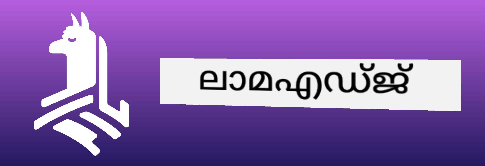

<!--
CO_OP_TRANSLATOR_METADATA:
{
  "original_hash": "be4101a30d98e95a71d42c276e8bcd37",
  "translation_date": "2025-12-22T01:07:33+00:00",
  "source_file": "md/01.Introduction/03/Jetson_Inference.md",
  "language_code": "ml"
}
-->
# **Nvidia Jetson-ൽ Phi-3 ഇൻഫറൻസ്**

Nvidia Jetson Nvidia യുടെ എംബെഡഡ് കംപ്യൂട്ടിംഗ് ബോർഡുകളുടെ ഒരു പരമ്പരയാണ്. The Jetson TK1, TX1 and TX2 models all carry a Tegra processor (or SoC) from Nvidia that integrates an ARM architecture central processing unit (CPU). Jetson是一個低功耗系統，旨在加速機器學習應用。（保持原文中的專有名詞） Jetson ഒരു ലോ-പവർ സിസ്റ്റമാണ് மற்றும் മെഷീൻ ലേണിങ് അപ്ലിക്കേഷനുകൾ എക്സലറേറ്റ് ചെയ്യുന്നതിനായി രൂപകൽപ്പന ചെയ്തതാണ്. Nvidia Jetson പ്രൊഫഷണൽ ഡെവലപ്പർമാർ വ്യവസായങ്ങളിലുടനീളം അതിമികവുറ്റ AI ഉൽപ്പന്നങ്ങൾ സൃഷ്ടിക്കാൻ ഉപയോഗിക്കുന്നു, കൂടാതെ വിദ്യാർത്ഥികളും ആസ്വാദകരും ഹാൻഡ്സ്-ഓൺ AI പഠനത്തിനും അത്ഭുതമായ പ്രൊജക്റ്റുകൾ നിർമ്മിക്കാനുമാണ് ഇത് ഉപയോഗിക്കുന്നത്. SLM Jetson പോലുള്ള എജ്ജ് സാദ്ധ്യങ്ങളിലുള്ള ഉപകരണങ്ങളിൽ വിന്യസിച്ചിരിക്കുന്നു, ഇത് വ്യവസായ ഡിജിറ്റൽ സൃഷ്ടിപരമായ AI അപ്ലിക്കേഷൻ سینാരിയോകൾക്ക് മെച്ചപ്പെട്ട നടപ്പാക്കൽ സാധ്യമാക്കും.

## NVIDIA Jetson-ൽ ഡിപ്ലോയ്മെന്റ്:
Autonomous robotics-ഉം embedded devices-ഉം വികസിപ്പിക്കുന്ന ഡെവലപ്പർമാർ Phi-3 Mini ഉപയോഗപ്പെടുത്താൻ കഴിയും. Phi-3 ന്റെ相对小的尺寸 അതിനെ എജ്ജിൽ വിന്യസിക്കാൻ അനുയോജ്യമായതാക്കുന്നു. Parameters പ്രെഷ്യസ് ആയി ട്രെയിനിംഗിനിടെ ട്യൂൺ ചെയ്തിട്ടുണ്ട്, ഇതുവഴി പ്രതികരണങ്ങളിൽ ഉയർന്ന കൃത്യത ഉറപ്പാക്കുന്നു.

### TensorRT-LLM ഓപ്റ്റിമൈസേഷൻ:
NVIDIA യുടെ [TensorRT-LLM ലൈബ്രറി](https://github.com/NVIDIA/TensorRT-LLM?WT.mc_id=aiml-138114-kinfeylo) വലിയ ഭാഷാ മോഡൽ ഇൻഫറൻസിനെ ഓപ്റ്റിമൈസ് ചെയ്യുന്നു. ഇത് Phi-3 Mini യുടെ ദൈർഘ്യമേറിയ കോൺടക്സ്‌റ്റ് വിൻഡോ പിന്തുണയ്ക്കുന്നു, जिससे throughput-യും latency-യും മെച്ചപ്പെടുന്നു. ഓപ്റ്റിമൈസേഷനുകൾ LongRoPE, FP8, inflight batching പോലുള്ള സാങ്കേതിക വിദ്യകൾ ഉൾക്കൊള്ളുന്നു.

### ലഭ്യതയും വിന്യസിക്കൽ:
ഡെവലപ്പർമാർ 128K കോൺടക്സ്‌റ്റ് വിൻഡോയോടുകൂടിയ Phi-3 Mini [NVIDIAയുടെ AI](https://www.nvidia.com/en-us/ai-data-science/generative-ai/) വഴിയോ പരിശോധിക്കാം. ഇത് NVIDIA NIM എന്ന നിലയിൽ പാക്കേജ് ചെയ്യപ്പെട്ടിട്ടുണ്ട്, സാധാരണ API ഉള്ള ഒരു മൈക്രോസർവീസ് ആണിത്, അത് എവിടെ വേണമെങ്കിലും വിന്യസിക്കാവുന്നതാണ്. കൂടാതെ, [TensorRT-LLM implementations on GitHub](https://github.com/NVIDIA/TensorRT-LLM).

 ## **1. തയ്യാറെടുപ്പ്**


a. Jetson Orin NX / Jetson NX

b. JetPack 5.1.2+
   
c. Cuda 11.8
   
d. Python 3.8+

 ## **2. Jetson-ൽ Phi-3 പ്രവർത്തിപ്പിക്കൽ**

 We can choose [Ollama](https://ollama.com) or [LlamaEdge](https://llamaedge.com)

 If you want to use gguf in the cloud and edge devices at the same time, LlamaEdge can be understood as WasmEdge (WasmEdge is a lightweight, high-performance, scalable WebAssembly runtime suitable for cloud native, edge and decentralized applications. It supports serverless applications, embedded functions, microservices, smart contracts and IoT devices. You can deploy gguf's quantitative model to edge devices and the cloud through LlamaEdge.



Here are the steps to use 

1. Install and download related libraries and files

```bash

curl -sSf https://raw.githubusercontent.com/WasmEdge/WasmEdge/master/utils/install.sh | bash -s -- --plugin wasi_nn-ggml

curl -LO https://github.com/LlamaEdge/LlamaEdge/releases/latest/download/llama-api-server.wasm

curl -LO https://github.com/LlamaEdge/chatbot-ui/releases/latest/download/chatbot-ui.tar.gz

tar xzf chatbot-ui.tar.gz

```

**കുറിപ്പ്**: llama-api-server.wasm and chatbot-ui need to be in the same directory

2. Run scripts in terminal


```bash

wasmedge --dir .:. --nn-preload default:GGML:AUTO:{Your gguf path} llama-api-server.wasm -p phi-3-chat

```

Here is the running result


***ഉദാഹരണ കോഡ്*** [Phi-3 mini WASM Notebook Sample](https://github.com/Azure-Samples/Phi-3MiniSamples/tree/main/wasm)

In summary, Phi-3 Mini represents a leap forward in language modeling, combining efficiency, context awareness, and NVIDIA's optimization prowess. Whether you're building robots or edge applications, Phi-3 Mini is a powerful tool to be aware of.

---

<!-- CO-OP TRANSLATOR DISCLAIMER START -->
അറിയിപ്പ്:
ഈ രേഖ AI അടിസ്ഥാനത്തിലുള്ള വിവർത്തന സേവനം [Co-op Translator](https://github.com/Azure/co-op-translator) ഉപയോഗിച്ച് വിവർത്തനം ചെയ്യപ്പെട്ടതാണ്. നാം ശരിയായതാക്കാനുള്ള ശ്രമം നടത്തിയിട്ടുള്ളതിനാല്‍ പോലും, ഓട്ടോമേറ്റഡ് വിവർത്തനങ്ങളിൽ പിശകുകൾ അല്ലെങ്കിൽ തെറ്റായ വിവരങ്ങൾ ഉണ്ടാകാവുന്നതാണ് എന്ന് ദയവായി ശ്രദ്ധിക്കുക. മൂല രേഖ അതിന്റെ മാതൃഭാഷയിലെ പതിപ്പാണ് അധികാരപരമായ (അഥോറിറ്റേറ്റിവ്) സ്രോതസ്സായി പരിഗണിക്കേണ്ടത്. നിർണ്ണായക വിവരങ്ങൾക്ക് പ്രൊഫഷണൽ മാനവ വിവർത്തനം ശുപാർശ ചെയ്യപ്പെടുന്നു. ഈ വിവർത്തനത്തിന്റെ ഉപയോഗത്തിൽനിന്നുള്ള ഏതെങ്കിലും തെറ്റിദ്ധാരണകൾക്കും തെറ്റായ വ്യാഖ്യാനങ്ങൾക്കും ഞങ്ങൾ ഉത്തരവാദികളല്ല.
<!-- CO-OP TRANSLATOR DISCLAIMER END -->