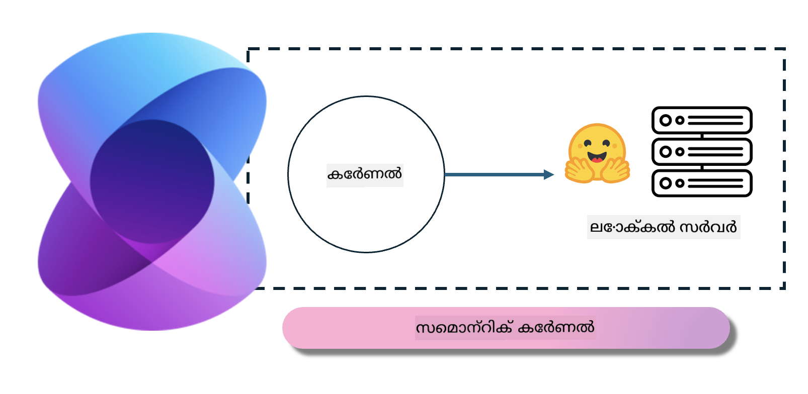
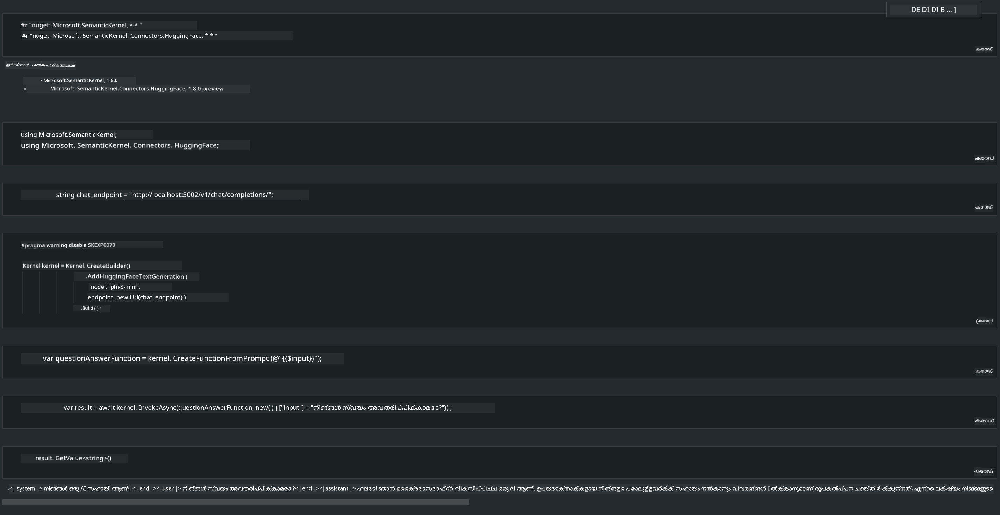

<!--
CO_OP_TRANSLATOR_METADATA:
{
  "original_hash": "bcf5dd7031db0031abdb9dd0c05ba118",
  "translation_date": "2025-12-22T01:03:11+00:00",
  "source_file": "md/01.Introduction/03/Local_Server_Inference.md",
  "language_code": "ml"
}
-->
# **ലോകൽ സെർവറിൽ Phi-3 ഇൻഫറൻസ്**

Phi-3 നാം ഒരു ലോക്കൽ സർവറിൽ ഡിപ്ലോയുചെയ്യാൻ കഴിയും. ഉപയോക്താക്കൾ [Ollama](https://ollama.com) അല്ലെങ്കിൽ [LM Studio](https://llamaedge.com) സൊല്യൂഷനുകൾ തിരഞ്ഞെടുക്കാം, അല്ലെങ്കിൽ അവർ തങ്ങളുടെ സ്വന്തം കോഡ് എഴുതാം. Copilot അപ്ലിക്കേഷനുകൾ നിർമ്മിക്കാൻ Phi-3 ന്റെ ലോക്കൽ സർവീസുകൾ [Semantic Kernel](https://github.com/microsoft/semantic-kernel?WT.mc_id=aiml-138114-kinfeylo) അല്ലെങ്കിൽ [Langchain](https://www.langchain.com/) മുഖേന കണക്‌ട് ചെയ്യാൻ കഴിയും

## **Semantic Kernel ഉപയോഗിച്ച് Phi-3-mini ആക്സസ് ചെയ്യുക**

Copilot അപ്ലിക്കേഷനിൽ നാം ആപ്ലിക്കേഷനുകൾ Semantic Kernel / LangChain വഴിയാണ് സൃഷ്ടിക്കുന്നത്. ഈ തരം ആപ്ലിക്കേഷൻ ഫ്രെയിംവർക്കുകൾ സാധാരണയായി Azure OpenAI Service / OpenAI മോഡലുകളുമായി תאക്കിലാണ്, കൂടാതെ Hugging Face-ലുള്ള ഓപ്പൺ സോഴ്‌സ് മോഡലുകളെയും ലോക്കൽ മോഡലുകളെയും ഇത് പിന്തുണയ്ക്കും. Phi-3-mini ആക്സസ് ചെയ്യാൻ Semantic Kernel ഉപയോഗിക്കണമെങ്കിൽ എന്താണ് ചെയ്യേണ്ടത്? .NET ഉദാഹരണമായി ഉപയോഗിച്ചാൽ, നാം ഇത് Semantic Kernel-യിലെ Hugging Face Connector-നുമായി സംയോജിപ്പിക്കാം. ഡിഫോൾട്ട് ആയി, ഇത് Hugging Face-ലുള്ള മോഡൽ id-നോട് പൊരുത്തപ്പെടും (ആദ്യമായി ഉപയോഗിക്കുമ്പോൾ മോഡൽ Hugging Face-ൽ നിന്ന് ഡൗൺലോഡ് ചെയ്യപ്പെടും, ഇതിൽ ഏറെ χρόνος പോകും). നിങ്ങൾ നിർമ്മിച്ച ലോക്കൽ സർവീസിനോടു കൂടി കണക്റ്റ് ചെയ്യാനുമാകും. ഇവയുമായി താരതമ്യപ്പെടുത്തുമ്പോൾ, പ്രത്യേകിച്ച് എന്റർപ്രൈസ് അപ്ലിക്കേഷനുകളിൽ കൂടുതൽ സ്വതന്ത്രതയുള്ളതിനാൽ അവസാനത്തേത് ഉപയോഗിക്കാനാണ് ഞങ്ങൾ ശിപാർശ ചെയ്യുന്നത്.

ചിത്രത്തിൽ കാണുന്നതുപോലെ Semantic Kernel വഴി ലോക്കൽ സർവീസുകൾ ആക്‌സസ് ചെയ്ത് സ്വയം നിർമ്മിച്ച Phi-3-mini മോഡൽ സർവറുമായി എളുപ്പത്തിൽ കണക്ട് ചെയ്യാം. ഇതാ പ്രവർത്തിക്കുന്ന ഫലമാണ്

***ഉദാഹരണ കോഡ്*** https://github.com/kinfey/Phi3MiniSamples/tree/main/semantickernel

---

<!-- CO-OP TRANSLATOR DISCLAIMER START -->
ഡിസ്ക്ലെയിമർ:
ഈ രേഖ AI വിവർത്തന സേവനമായ Co‑op Translator (https://github.com/Azure/co-op-translator) ഉപയോഗിച്ച് വിവർത്തനം ചെയ്യപ്പെട്ടതാണ്. ഞങ്ങൾ കൃത്യതയ്ക്ക് ശ്രമിക്കുകയാണെങ്കിലും, ഓട്ടോമേറ്റഡ് വിവർത്തനങ്ങളിൽ പിശകുകൾ അല്ലെങ്കിൽ ദുരുപയോഗത്തിന് വിധേയമായ അസാധുതകൾ ഉണ്ടാകാവുന്നതാണ്. മൂലഭാഷയിലെ രേഖ പ്രാമാണിക ഉറവിടമായാണ് പരിഗണിക്കേണ്ടത്. നിർണായകമായ വിവരങ്ങൾക്ക് പ്രൊഫഷണൽ മാനവ വിവർത്തനം നിർദേശിക്കപ്പെടുന്നു. ഈ വിവർത്തനം ഉപയോഗിച്ചതിൽ നിന്നുണ്ടാകുന്ന ഏതെങ്കിലും തെറ്റിധാരണങ്ങളുടേയും തെറ്റായ വ്യാഖ്യാനങ്ങളുടേയും ഉത്തരവാദിത്വം ഞങ്ങൾ ഏറ്റെടുക്കുന്നില്ല.
<!-- CO-OP TRANSLATOR DISCLAIMER END -->