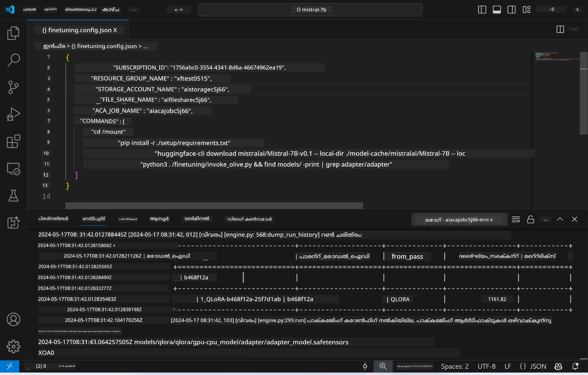
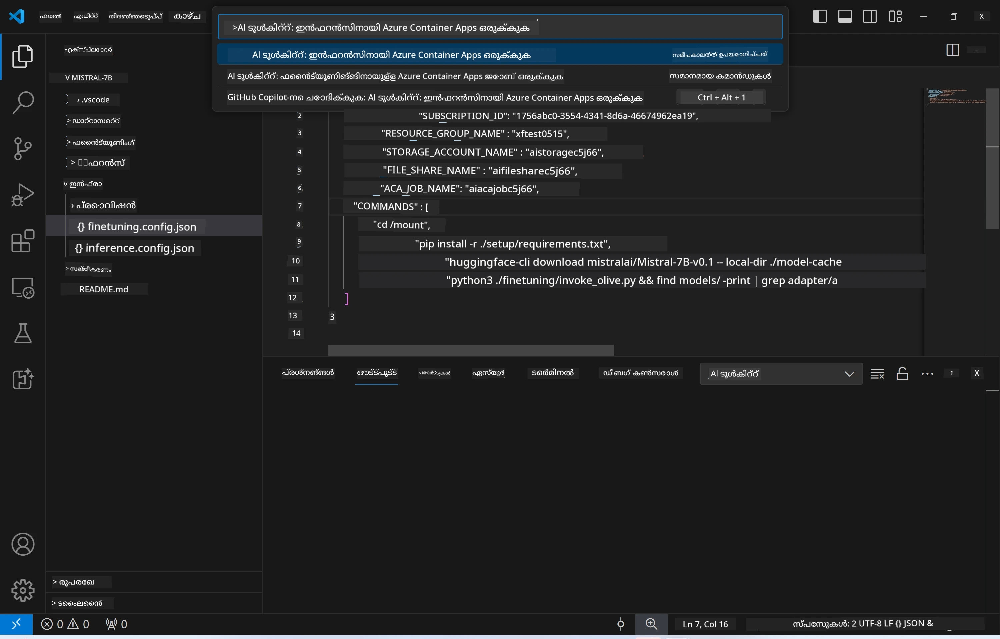
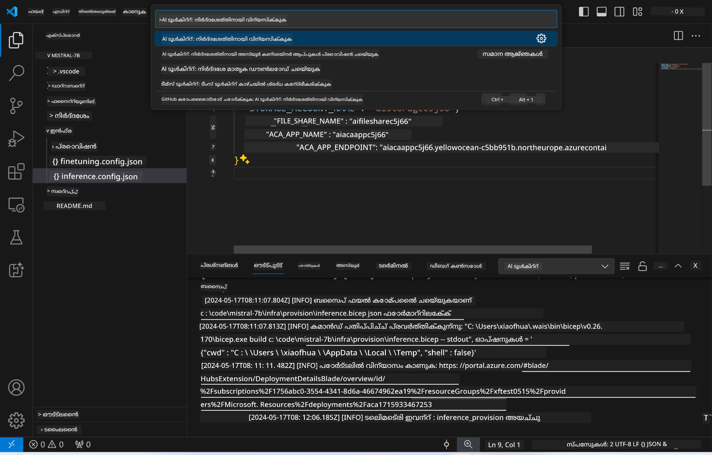

# ഫൈൻ-ട്യൂൺ ചെയ്ത മോഡലുമായി റിമോട്ട് ഇൻഫറൻസ്

റിമോട്ട് പരിസരത്തിൽ അഡാപ്റ്ററുകൾ ട്രെയിൻ ചെയ്‌തശേഷം, മോഡലുമായി ഇടപെടാൻ ഒരു ലളിതമായ Gradio അപ്ലിക്കേഷൻ ഉപയോഗിക്കുക.



### Azure റിസോഴ്‌സുകൾ പ്രൊവിഷൻ ചെയ്യുക
റിമോട്ട് ഇൻഫറൻസിനായി Azure റിസോഴ്‌സുകൾ സജ്ജീകരിക്കാൻ, കമാൻഡ് പെലറ്റിൽ നിന്ന് `AI Toolkit: Provision Azure Container Apps for inference` 실행 ചെയ്യേണ്ടതാണ്. ഈ സജ്ജീകരണത്തിനിടെ നിങ്ങളുടെ Azure Subscription અને resource group തിരഞ്ഞെടുക്കാൻ നിങ്ങളോട് ആവശ്യപ്പെടും.  

   
 by default, inference-ന്റെ subscription և resource group ഫൈൻ-ട്യൂണിംഗ് സമയത്ത് ഉപയോഗിച്ചവയുമായി സാമ്യം കാണും. ഇൻഫറൻസ് അതേ Azure Container App Environment ഉപയോഗിക്കുകയും ഫൈൻ-ട്യൂണിംഗ് ഘട്ടത്തിൽ സൃഷ്ടിച്ച Azure Files-ൽ സൂക്ഷിച്ചിരിക്കുന്ന മോഡൽ և മോഡൽ അഡാപ്റ്റര്‍ ആക്സസ് ചെയ്യുകയും ചെയ്യും.

## AI Toolkit ഉപയോഗിക്കുക

### ഇൻഫറൻസിനുള്ള ഡിപ്ലോയ്മെന്റ്  
നിങ്ങൾ ഇൻഫറൻസ് കോഡ് തിരുത്തണമെങ്കിൽ അല്ലെങ്കിൽ ഇൻഫറൻസ് മോഡൽ റീലോഡ് ചെയ്യണമെങ്കിൽ, ദയവായി `AI Toolkit: Deploy for inference` കമാൻഡ് നിർവഹിക്കണം. ഇത് നിങ്ങളുടെ പുതിയ കോഡ് ACA യുമായി സിംക്രനൈസ് ചെയ്ത് റിപ്ലിക്കയെ പുനരാരംഭിക്കും.  



ഡിപ്ലോയ്മെന്റ് വിജയകരമായി പൂർത്തിയായപ്പോൾ, മോഡൽ ഇപ്പോൾ ഈ എൻഡ്‌പോയിൻറ് ഉപയോഗിച്ച് വിലയിരുത്താൻ റെഡിയാണ്.

### ഇൻഫറൻസ് API ആക്‌സസ് ചെയ്യുക

VSCode നോട്ടിഫിക്കേഷനിൽ പ്രദർശിപ്പിക്കുന്ന "*Go to Inference Endpoint*" ബട്ടണിൽ ക്ലിക്ക് ചെയ്ത് നിങ്ങൾ ഇൻഫറൻസ് API ആക്‌സസ് ചെയ്യலாம். বিকল্পമായി, വെബ് API എൻഡ്‌പോയിൻറ് `ACA_APP_ENDPOINT` ൽ `./infra/inference.config.json` ഫയലിലും ഔട്ട്‌പുട്ട് പാനലിലും കണ്ടെത്താവുന്നതാണ്.


> **ശ്രദ്ധിക്കുക:** ഇൻഫറൻസ് എൻഡ്‌പോയിന്റ് പൂര്‍ണമായും പ്രവർത്തിക്കാൻ ചില നിമിഷങ്ങൾ എടുത്തേക്കാം.

## ടെമ്പ്ലേറ്റിൽ ഉൾക്കൊള്ളിച്ച ഇൻഫറൻസ് ഘടകങ്ങൾ
 
| Folder | Contents |
| ------ |--------- |
| `infra` | റിലവന്റ് റിമോട്ട് പ്രവർത്തനങ്ങൾക്ക് ആവശ്യമായ എല്ലാ കോൺഫിഗറೇಶനുകളും ഉൾക്കൊള്ളിക്കുന്നു. |
| `infra/provision/inference.parameters.json` | ബൈസ്‌പ് ടെംപ്ലേറ്റുകൾക്കുള്ള പാരാമീറ്ററുകൾ ഇവിടെ ഉൾക്കൊള്ളിക്കുന്നു, ഇൻഫറൻസ് വേണ്ട Azure റിസോഴ്‌സുകൾ പ്രൊവിഷൻ ചെയ്യാൻ ഇത് ഉപയോഗിക്കുന്നു. |
| `infra/provision/inference.bicep` | ഇൻഫറൻസ് ആവശ്യമായ Azure റിസോഴ്‌സുകൾ പ്രൊവിഷൻ ചെയ്യുന്നതിനുള്ള ടെംപ്ലേറ്റുകൾ ഇവിടെ ഉൾക്കൊള്ളിക്കുന്നു. |
| `infra/inference.config.json` | കോൺഫിഗറേഷൻ ഫയൽ, `AI Toolkit: Provision Azure Container Apps for inference` കമാൻഡ് દ્વારા സൃഷ്ടിക്കപ്പെടുന്നത്. ഇത് മറ്റ് റിമോട്ട് കമാൻഡ് പെലറ്റുകൾക്ക് ഇൻപുട്ടായി ഉപയോഗിക്കുന്നു. |

### Azure റിസോഴ്‌സ് പ്രൊവിഷനിനായി AI Toolkit ക്രമീകരിക്കൽ
Configure the [AI Toolkit](https://marketplace.visualstudio.com/items?itemName=ms-windows-ai-studio.windows-ai-studio)

Provision Azure Container Apps for inference` കമാൻഡ്.

കോൺഫിഗറേഷൻ പാരാമീറ്ററുകൾ `./infra/provision/inference.parameters.json` ഫയലിൽ കണ്ടെത്താവുന്നതാണ്. വിശദാംശങ്ങൾ ഇവയാണ്:
| Parameter | Description |
| --------- |------------ |
| `defaultCommands` | വെബ് API ആരംഭിപ്പിക്കുന്നതിനുള്ള കമാൻഡുകളാണ് ഇത്. |
| `maximumInstanceCount` | GPU ഇൻസ്റ്റൻസുകളുടെ പരമാവധി ശേഷി നിശ്ചയിക്കുന്ന പാരാമീറ്റർ. |
| `location` | Azure റിസോഴ്‌സുകൾ പ്രൊവിഷൻ ചെയ്യപ്പെടുന്ന സ്ഥലം. ഡിഫോൾട്ട് മൂല്യം തിരഞ്ഞെടുക്കപ്പെട്ട resource group's ലൊക്കേഷനുമായി സാമ്യം കാണും. |
| `storageAccountName`, `fileShareName` `acaEnvironmentName`, `acaEnvironmentStorageName`, `acaAppName`,  `acaLogAnalyticsName` | ഈ പാരാമീറ്ററുകൾ പ്രൊവിഷനിനുള്ള Azure റിസോഴ്‌സുകൾ നാമകരണം ചെയ്യാൻ ഉപയോഗിക്കുന്നു. ഡിഫോൾട്ടായി, അവ ഫൈൻ-ട്യൂണിംഗ് resource നാമത്തോടുകൂടിയിരിക്കും. നിങ്ങളുടെ സ്വന്തം കസ്റ്റം നാമമുള്ള റിസോഴ്‌സുകൾ സൃഷ്ടിക്കാൻ പുതിയ and ഉപയോഗിച്ചിട്ടില്ലാത്ത റിസോഴ്‌സ് പേര് നൽകാം, അല്ലെങ്കിൽ നിലവിലുള്ള Azure റിസോഴ്‌സ് ഉപയോഗിക്കാൻ ആഗ്രഹിക്കുന്നുവെങ്കിൽ അതിന്റെ പേര് നൽകാം. വിശദാംശങ്ങൾക്ക് [Using existing Azure Resources](../../../../../md/01.Introduction/03) സെക്ഷൻ കാണുക. |

### നിലവിലുള്ള Azure റിസോഴ്‌സുകൾ ഉപയോഗിക്കൽ

ഡിഫോൾട്ടായി, ഇൻഫറൻസ് പ്രൊവിഷൻ ഫൈൻ-ട്യൂണിംഗിന് ഉപയോഗിച്ചിരുന്ന അതേ Azure Container App Environment, Storage Account, Azure File Share, Azure Log Analytics എന്നിവ ഉപയോഗിക്കും. ഇൻഫറൻസ് APIക്കായി വേർതിരിച്ച Azure Container App ഒന്ന് മാത്രമാണ് രചിക്കുക.

ഫൈൻ-ട്യൂണിംഗ് ഘട്ടത്തിൽ നിങ്ങൾ Azure റിസോഴ്‌സുകൾ അനുകൂലിപ്പിച്ചുവെങ്കിൽ അല്ലെങ്കിൽ ഇൻഫറൻസിനായി നിങ്ങളുടേത് നിലനിൽക്കുന്ന Azure റിസോഴ്‌സുകൾ ഉപയോഗിക്കാൻ ആഗ്രഹിച്ചാൽ, അവയുടെ നാമങ്ങൾ `./infra/inference.parameters.json` ഫയലിൽ निर्दിഷ്ടമാക്കുക. തുടർന്ന്, കമാൻഡ് പദ്ധതി നിന്നു `AI Toolkit: Provision Azure Container Apps for inference` കമാൻഡ് 실행 ചെയ്യുക. ഇത് നൽകിയിട്ടുള്ള റിസോഴ്‌സുകൾ അപ്‌ഡേറ്റ് ചെയ്യുകയും മിസ്റ്റിങ്ങ് ആയവ ഉണ്ടെങ്കിൽ സൃഷ്ടിക്കുകയും ചെയ്യും.

ഉദാഹരണത്തിന്, നിങ്ങൾക്ക് നിലവിലുള്ള Azure കൺറെയ്നർ എൻവയോൺമെന്റ് ഉണ്ടെങ്കിൽ, നിങ്ങളുടെ `./infra/finetuning.parameters.json` ഇങ്ങനെ കാണിക്കേണ്ടതാണ്:

```json
{
    "$schema": "https://schema.management.azure.com/schemas/2019-04-01/deploymentParameters.json#",
    "contentVersion": "1.0.0.0",
    "parameters": {
      ...
      "acaEnvironmentName": {
        "value": "<your-aca-env-name>"
      },
      "acaEnvironmentStorageName": {
        "value": null
      },
      ...
    }
  }
```

### മാനുവൽ പ്രൊവിഷൻ  
നിങ്ങൾക്ക് Azure റിസോഴ്‌സുകൾ കൈയ്യൊരുക്കി സജ്ജീകരിക്കാൻ ഇഷ്ടമാണെങ്കിൽ, `./infra/provision` ഫോൾഡറിലുള്ള നൽകിയ bicep ഫയലുകൾ ഉപയോഗിക്കാവുന്നതാണ്. AI Toolkit കമാൻഡ് പെലറ്റ് ഉപയോഗിക്കാതെ നിങ്ങൾ ഇതിനകം എല്ലാ Azure റിസോഴ്‌സുകളും സജ്ജീകരിച്ചിട്ടുണ്ടെങ്കിൽ, നിങ്ങൾക്ക് തെളിവുകൾ മാത്രം `inference.config.json` ഫയലിലേക്ക് നൽകിയ റിസോഴ്‌സ് നാമങ്ങൾ എൻട്രി ചെയ്യാവുന്നതാണ്.

ഉദാഹരണത്തിന്:

```json
{
  "SUBSCRIPTION_ID": "<your-subscription-id>",
  "RESOURCE_GROUP_NAME": "<your-resource-group-name>",
  "STORAGE_ACCOUNT_NAME": "<your-storage-account-name>",
  "FILE_SHARE_NAME": "<your-file-share-name>",
  "ACA_APP_NAME": "<your-aca-name>",
  "ACA_APP_ENDPOINT": "<your-aca-endpoint>"
}
```

---

<!-- CO-OP TRANSLATOR DISCLAIMER START -->
ഡിസ്ക്ലെയിമർ:
ഈ രേഖ AI വിവർത്തന സേവനമായ Co‑op Translator (https://github.com/Azure/co-op-translator) ഉപയോഗിച്ച് വിവർത്തനം ചെയ്തതാണ്. ഞങ്ങൾ കൃത്യതയ്ക്കായി ശ്രമിച്ചിട്ടുണ്ടെങ്കിലും, ഓട്ടോമാറ്റിക് വിവർത്തനങ്ങളിൽ പിശകുകളും അശുദ്ധികളുമുണ്ടാകാമെന്ന് ദയവായി അറിഞ്ഞിരിക്കുക. മൗലിക ഭാഷയിലെ രേഖയെ അധികാരപരമായ ഉറവിടമായി പരിഗണിക്കുക. നിർണക്കായക വിവരങ്ങൾക്ക് പ്രൊഫഷണൽ മനുഷ്യ വിവർത്തനം ശുപാർശ ചെയ്യപ്പെടുന്നു. ഈ വിവർത്തനം ഉപയോഗിച്ചതിൽ നിന്നുണ്ടാകുന്ന ഏതെങ്കിലും തെറ്റിധാരണകൾക്കോ തെറ്റായ വ്യാഖ്യാനങ്ങൾക്കോ ഞങ്ങൾക്ക് ഉത്തരവാദിത്വമില്ല.
<!-- CO-OP TRANSLATOR DISCLAIMER END -->