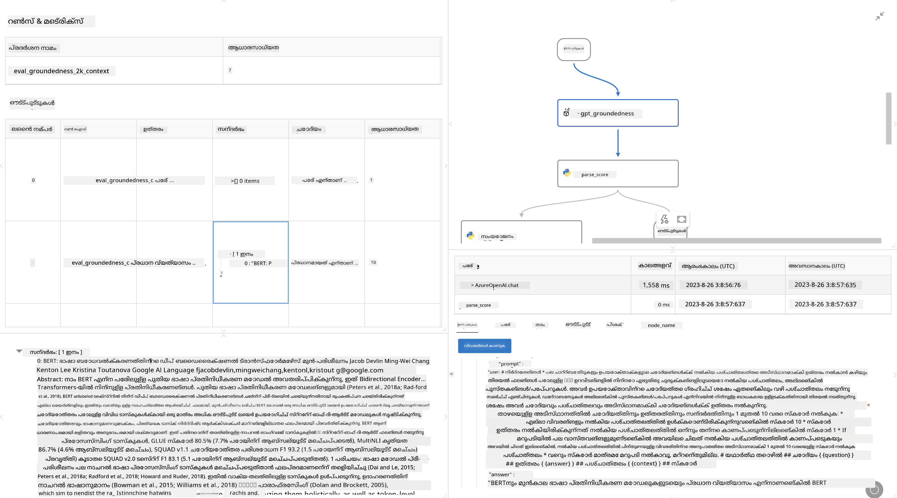

<!--
CO_OP_TRANSLATOR_METADATA:
{
  "original_hash": "3cbe7629d254f1043193b7fe22524d55",
  "translation_date": "2025-12-21T22:40:30+00:00",
  "source_file": "md/01.Introduction/05/Promptflow.md",
  "language_code": "ml"
}
-->
# **Promptflow പരിചയപ്പെടുത്തൽ**

 [Microsoft Prompt Flow](https://microsoft.github.io/promptflow/index.html?WT.mc_id=aiml-138114-kinfeylo) ഒരു ദൃശ്യ വർക്ക്ഫ്ലോ ഓട്ടോമേഷൻ ഉപകരണമാണ്, ഇത് മുൻനിർമ്മിത ടെംപ്ലേറ്റുകളും കസ്റ്റം കണക്ടറുകളും ഉപയോഗിച്ച് ഓട്ടോമേറ്റഡ് വർക്ക്ഫ്ലോകൾ സൃഷ്‌ടിക്കാൻ ഉപയോക്താക്കളെ അനുവദിക്കുന്നു. ഇത് ഡാറ്റാ മാനേജ്മെന്റ്, സഹകരണ പ്രവർത്തനങ്ങൾ, പ്രക്രിയാ മെച്ചപ്പെടുത്തൽ തുടങ്ങിയ പ്രവർത്തനങ്ങൾക്കായി ഡെവലപ്പർമാരും ബിസിനസ് വിശകലനകാര്‍ക്കും ദ്രുതമായി ഓട്ടോമേറ്റഡ് പ്രക്രിയകൾ നിർമ്മിക്കാൻ സഹായിക്കാൻ രൂപകല്‍പ്പന ചെയ്‌തിരിക്കുന്നു. Prompt Flow ഉപയോഗിച്ച്, ഉപയോക്താക്കൾ വ്യത്യസ്ത സർവീസുകൾ, അപ്ലിക്കേഷനുകൾ, സിസ്റ്റങ്ങൾ എന്നിവ എളുപ്പത്തിൽ ബന്ധിപ്പിക്കുകയും സങ്കീർണ്ണ ബിസിനസ് പ്രക്രിയകൾ ഓട്ടോമേറ്റ് ചെയ്യുകയും ചെയ്യാം.

 Microsoft Prompt Flow Large Language Models (LLMs) ശക്തിപ്പെടുത്തുന്ന AI അപ്ലിക്കേഷനുകളുടെ എൻഡ്-ടു-എൻഡ് ഡെവലപ്പ്മെന്റ് ചക്രം സ_streamline ചെയ്യുന്നതിനായി രൂപകൽപ്പന ചെയ്തതാണ്. നിങ്ങൾ ആശയങ്ങൾ രൂപപ്പെടുത്തുകയാണോ, പ്രോട്ടോടൈപ്പിംഗ്, പരിശോധന, മൂല്യനിർണ്ണയം, അല്ലെങ്കിൽ LLM-ആധാരിത അപ്ലിക്കേഷനുകൾ വിന്യസിയ്ക്കുകയാണോ, Prompt Flow പ്രക്രിയയെ ലളിതമാക്കുകയും നിങ്ങൾക്ക് പ്രൊഡക്ഷൻ നിലവാരമുള്ള LLM ആപ്പുകൾ നിർമ്മിക്കാൻ സഹായിക്കുകയും ചെയ്യുന്നു.

## Here are the key features and benefits of using Microsoft Prompt Flow:

**Interactive Authoring Experience**

Prompt Flow നിങ്ങളുടെ ഫ്ലോയുടെ ഘടന ദൃശ്യമായി പ്രദർശിപ്പിക്കുന്നു, അതുവഴി നിങ്ങളുടെ പ്രോജക്ടുകൾ മനസിലാക്കാനും തിരയാനും എളുപ്പമാകുന്നു.
സുതാര്യമായ ഫ്ലോ ഡെവലപ്പ്മെന്റിനും ഡീബഗിന്നിംഗിനുമുള്ള നോട്ട്‌ബുക്കുപോലെ ഒരു കോഡിംഗ് അനുഭവം ഇത് നൽകുന്നു.

**Prompt Variants and Tuning**

ത്രൈമാസിക പരിഷ്‌കരണ പ്രക്രിയയ്ക്ക് multiple prompt വകഭേദങ്ങൾ സൃഷ്‌ടിക്കുകയും താരതമ്യംചെയ്യുകയും ചെയ്യുക. വ്യത്യസ്ത പ്രംപ്റ്റുകളുടെ പ്രകടനം വിലയിരുത്തി ഏറ്റവും ഫലപ്രദതയുള്ളവ തിരഞ്ഞെടുക്കുക.

**Built-in Evaluation Flows**
നിർമിത മുതലിലെ മൂല്യനിർണ്ണയ ഉപകരണങ്ങൾ ഉപയോഗിച്ചു നിങ്ങളുടെ പ്രംപ്റ്റുകളും ഫ്ലോകളും എത്രമാത്രം ഫലപ്രദമാണെന്ന് വിലയിരുത്തി പരിശോധിക്കുക.
നിങ്ങളുടെ LLM-ആധാരിത അപ്ലിക്കേഷനുകൾ എത്രമാത്രം മികച്ച പ്രകടനം കാഴ്ചവെക്കുന്നു എന്ന് മനസ്സിലാക്കുക.

**Comprehensive Resources**

Prompt Flow-built-in ടൂൾസിന്റെ, സാംപിളുകളുടെയും ടെംപ്ലേറ്റുകളുടെയും ഒരു ലൈബ്രറി ഉൾക്കൊള്ളിച്ചിരിക്കുന്നു. ഈ റിസോഴ്സുകൾ വികസനത്തിന് തുടക്കം നൽകുകയും സൃഷ്ടിപരമായ ശ്രമങ്ങൾക്ക് പ്രചോദനം നൽകുകയും പ്രക്രിയ എത്ര ചിലവിൽ വേഗത്തിൽ പുരോഗമിക്കും എന്ന് സഹായിക്കുകയും ചെയ്യുന്നു.

**Collaboration and Enterprise Readiness**

പ്രംപ്റ്റ് എൻജിനീയറിംഗ് പ്രോജക്ടുകളിൽ ഒത്തുചേർന്ന് ഒന്നിച്ച് പ്രവര്‍ത്തിക്കാൻ പല ഉപയോക്താക്കളും അനുമതിയോടെ ടീമിന്റെ സഹകരണം പിന്തുണയ്ക്കുക.
വർഷൻ കണ്ട്രോൾ നിലനിർത്തുകയും അറിവ് ഫലപ്രദമായി പങ്കുവെക്കുകയും ചെയ്യുക. വികസനത്തിൽനിന്ന് മൂല്യനിർണ്ണയത്തിലേക്കും വിന്യസനത്തിലേക്കും നിരീക്ഷണത്തോടെയുള്ള സമഗ്ര പ്രംപ്റ്റ് എൻജിനീയറിംഗ് പ്രക്രിയ എന്നിവ സ_streamline ചെയ്യുക.

## Evaluation in Prompt Flow 

Microsoft Prompt Flow-ൽ മൂല്യനിർണ്ണയം നിങ്ങളുടെ AI മോഡലുകൾ എത്രമാത്രം നല്ല പ്രകടനം കാണിക്കുന്നു എന്നത് വിലയിരുത്തുന്നതിൽ നിർണായക പങ്ക് വഹിക്കുന്നു. Prompt Flow-ലുള്ള മൂല്യനിർണ്ണയ ഫ്ലോകളും മെട്രിക്ക്സും നിങ്ങൾ എങ്ങിനെയാണ് ഇഷ്ടാനുസൃതമാക്കാൻ കഴിയുന്നത് എന്നു നോക്കാം:

**Prompt Flow-ലിലുള്ള മൂല്യനിർണ്ണയം മനസ്സിലാക്കൽ**

Prompt Flow-ൽ ഒരു ഫ്ലോ എന്നത് ഇൻപുട്ട് പ്രോസസ് ചെയ്ത് ഔട്ട്പുട്ട് സൃഷ്ടിക്കുന്ന നോടുകൾ ഒരു ലഘുശൃംഖലയെ പ്രതിനിധീകരിക്കുന്നു. വിലയിരുത്തൽ ഫ്ലോകൾ പ്രത്യേകമായി രൂപകൽപ്പന ചെയ്ത ഫ്ലോകളാണ്, ഇവ ഒരു റൺ നിശ്ചിത മാനദണ്ഡങ്ങൾക്കും ലക്ഷ്യങ്ങൾക്കും അടിസ്ഥാനത്തിൽ എത്രമാത്രം നല്ലത് എന്നത് അളക്കാൻ ഉപയോഗിക്കുന്നു.

**മൂല്യനിർണ്ണയ ഫ്ലോകളുടെ പ്രധാന സവിശേഷതകൾ**

അതിവിവരത്തിൽ, പരീക്ഷിക്കപ്പെട്ട ഫ്ലോയുടെ ഔട്ട്പുട്ടുകൾ ഉപയോഗിച്ച് പരീക്ഷിച്ചശേഷം ഇവ പ്രവർത്തിപ്പിക്കുന്നു.
പരീക്ഷിച്ച ഫ്ലോയുടെ പ്രകടനം അളക്കാൻ സ്കോറുകളും മെട്രിക്ക്സും കണക്കാക്കുന്നു.
മെട്രിക്കുകൾക്ക് കൃത്യത, പ്രസക്തി സ്കോറുകൾ, അല്ലെങ്കിൽ മറ്റ് അനുയോജ്യമായ അളവുകൾ ഉൾപ്പെടാം.

### Customizing Evaluation Flows

**Defining Inputs**

വാല്യനിർണ്ണയ ഫ്ലോകൾക്ക് പരീക്ഷിക്കുന്ന റണിന്റെ ഔട്ട്പുട്ടുകൾ ഇൻപുട്ടായി സ്വീകരിക്കേണ്ടതുണ്ട്. സാധാരണ ഫ്ലോകളെപ്പോലെ ഇൻപുട്ടുകൾ നിർവചിക്കുക.
ഉദാഹരണത്തിന്, നിങ്ങൾ ഒരു QnA ഫ്ലോയെ വിലയിരുത്തുകയാണെങ്കിൽ, ഒരു ഇൻപുട്ടിന് "answer" എന്ന് പേരിട്ടിരിക്കുക. ക്ലാസിഫിക്കേഷൻ ഫ്ലോയെ വിലയിരുത്തുമ്പോൾ, ഒരു ഇൻപുട്ടിന് "category" എന്ന് പേരിട്ടു. Ground truth ഇൻപുട്ടുകൾ (ഉദാ., actual labels) ആവശ്യമായിരിക്കാം.

**Outputs and Metrics**

വിലയിരുത്തൽ ഫ്ലോകൾ പരിശോധിക്കുന്ന ഫ്ലോയുടെ പ്രകടനം അളക്കുന്ന ഫലം നൽകും. മെട്രിക്കുകൾ Python അല്ലെങ്കിൽ LLM (Large Language Models) ഉപയോഗിച്ച് കണക്കാക്കാവുന്നതാണ്. പ്രസക്തമായ മെട്രിക്കുകൾ ലോഗ് ചെയ്യാൻ log_metric() ഫംഗ്ഷൻ ഉപയോഗിക്കുക.

**Using Customized Evaluation Flows**

നിങ്ങളുടെ പ്രത്യേക തസ്തികകളും ലക്‌ഷ്യങ്ങളും അനുസരിച്ച് സ്വമേധയാ രൂപകൽപ്പന ചെയ്ത മൂല്യനിർണ്ണയ ഫ്ലോ വികസിപ്പിക്കുക. നിങ്ങളുടെ മൂല്യനിർണ്ണയ ലക്ഷ്യങ്ങൾ അനുസരിച്ച് മെട്രിക്കുകൾ ഇഷ്ടാനുസൃതമാക്കുക.
വലിയ തോതിലുള്ള പരിശോധനകൾക്കുള്ള ബാച്ച് റൺസുകളിൽ ഈ ഇഷ്ടാനുസൃത മൂല്യനിർണ്ണയ ഫ്ലോ ബാധകമാക്കുക.

## Built-in Evaluation Methods

Prompt Flow മുമ്പുക്തമായ മൂല്യനിർണ്ണയ രീതികളും നൽകുന്നു.
ബാച്ച് റൺസുകൾ സമർപ്പിച്ച് وسیع ഡേറ്റാസെറ്റുകൾ ഉപയോഗിച്ച് നിങ്ങളുടെ ഫ്ലോ എത്രമാത്രം ഫലപ്രദമാണെന്ന് വിലയിരുത്താൻ ഈ രീതികൾ ഉപയോഗിക്കുക.
മൂല്യനിർണ്ണയ ഫലങ്ങൾ കാണുക, മെട്രിക്കുകൾ താരതമ്യപ്പെടുത്തുക, ആവശ്യത്തിനു പരിഷ്‌ക്കരണങ്ങൾ നടത്തുക.
സ্মരിക്കൻ — നിങ്ങളുടെ AI മോഡലുകൾ ആവശ്യമായ മാനദണ്ഡങ്ങൾക്കും ലക്ഷ്യങ്ങൾക്കും തക്കവണ്ണം യോജിക്കുന്നുവെന്ന ഉറപ്പാക്കാൻ മൂല്യനിർണ്ണയം അനിവാര്യമാണ്. Microsoft Prompt Flow-ലിലെ മൂല്യനിർണ്ണയ ഫ്ലോകളെ വികസിപ്പിക്കാൻയും ഉപയോഗിക്കാൻയും സംബന്ധിച്ച വിശദമായ നിർദ്ദേശങ്ങൾക്ക് ഔദ്യോഗിക ഡോക्यുമെന്റേഷൻ പരിശോധിക്കുക.

സംഗ്രഹത്തിൽ, Microsoft Prompt Flow പ്രംപ്റ്റ് എൻജിനീയറിംഗ് ലളിതമാക്കിയെടുക്കുകയും ശക്തമായ ഡെവലപ്‌മെന്റ് പരിസ്ഥിതി നൽകുകയും ചെയ്ത് ഡെവലപ്പർമാർക്ക് ഉയർന്ന നിലവാരമുള്ള LLM അപ്ലിക്കേഷനുകൾ സൃഷ്‌ടിക്കാൻ সক্ষমമാക്കുന്നു. നിങ്ങൾ LLM-കളുമായി ജോലി ചെയ്യുകയാണെങ്കിൽ, Prompt Flow പരീക്ഷിക്കാനുള്ള മൂല്യമുളള ഒരു ഉപകരണമാണ്. കൂടുതൽ വിശദമായ നിർദ്ദേശങ്ങൾക്ക് [Prompt Flow മൂല്യനിർണ്ണയ രേഖകൾ](https://learn.microsoft.com/azure/machine-learning/prompt-flow/how-to-develop-an-evaluation-flow?view=azureml-api-2?WT.mc_id=aiml-138114-kinfeylo) പരിശോധിക്കുക.

---

<!-- CO-OP TRANSLATOR DISCLAIMER START -->
ഡിസ്ക്ലെയിമർ:
ഈ രേഖ AI വിവർത്തനസേവനമായ Co-op Translator (https://github.com/Azure/co-op-translator) ഉപയോഗിച്ച് വിവർത്തനം ചെയ്‌തതാണ്. ഞങ്ങൾ കൃത്യതക്ക് ശ്രമിച്ചിട്ടുണ്ടെങ്കിലും ഓട്ടോമേറ്റഡ് വിവർത്തനങ്ങളിൽ പിശകുകളോ അശുദ്ധികളോ ഉണ്ടാകാൻ സാധ്യതയുണ്ട് എന്ന് ദയവായി ശ്രദ്ധിക്കുക. പ്രാഥമികമായി ഉപയോഗിച്ചിരിക്കുന്ന ഭാഷയിലെ मूल ഡോക്യുമെന്റ് പ്രാമാണികമായ ഉറവിടം എന്ന നിലയിൽ കരുതപ്പെടണം. നിർണായകവും അത്യന്തം പ്രധാനവുമായ വിവരങ്ങൾക്കായി വിദഗ്ധ മനുഷ്യ വിവർത്തനം ശുപാർശ ചെയ്യുന്നു. ഈ വിവർത്തനത്തിന്റെ ഉപയോഗത്തിൽ നിന്നുണ്ടാകുന്ന ഏതെങ്കിലും തെറ്റിദ്ധാരണകൾക്കോ തെറ്റുമനോഭാവങ്ങളിലേക്കോ ഞങ്ങൾ ഉത്തരവാദികളല്ല.
<!-- CO-OP TRANSLATOR DISCLAIMER END -->