<!--
CO_OP_TRANSLATOR_METADATA:
{
  "original_hash": "80a853c08e4ee25ef9b4bfcedd8990da",
  "translation_date": "2025-12-21T21:23:33+00:00",
  "source_file": "md/02.Application/01.TextAndChat/Phi3/E2E_Phi-3-Evaluation_AIFoundry.md",
  "language_code": "ml"
}
-->
# Azure AI Foundry-ലിലെ ഫൈൻ-ട്യൂൺ ചെയ്ത Phi-3 / Phi-3.5 മോഡൽ Microsoft-ന്റെ Responsible AI നയങ്ങളെ കേന്ദ്രീകരിച്ച് വിലയിരുത്തൽ

This end-to-end (E2E) sample is based on the guide "[Evaluate Fine-tuned Phi-3 / 3.5 Models in Azure AI Foundry Focusing on Microsoft's Responsible AI](https://techcommunity.microsoft.com/blog/educatordeveloperblog/evaluate-fine-tuned-phi-3--3-5-models-in-azure-ai-studio-focusing-on-microsofts-/4227850?WT.mc_id=aiml-137032-kinfeylo)" from the Microsoft Tech Community.

## അവലോകനം

### Azure AI Foundry-ൽ ഫൈൻ-ട്യൂൺ ചെയ്ത Phi-3 / Phi-3.5 മോഡലിന്റെ സുരക്ഷയും പ്രകടനവും നിങ്ങൾ എങ്ങനെ വിലയിരുത്താം?

ഫൈൻ-ട്യൂണിംഗ് ചിലപ്പോൾ അഭിലഷണീയമല്ലാത്ത അല്ലെങ്കിൽ ആഗ്രഹിക്കാത്ത പ്രതികരണങ്ങൾക്ക് വഴിയൊരുക്കാം. മോഡൽ സുരക്ഷിതവും ഫലപ്രദവുമായ നിലയിൽ തുടരുന്നുണ്ടെന്ന് ഉറപ്പാക്കാൻ, മോഡലിന്റെ ഹാനികരമായ ഉള്ളടക്കം സൃഷ്ടിക്കാൻ ഉള്ള സാധ്യതയും ശരിയായ, പ്രസക്തമായ, സഹമായ ഉത്തരം ഉണ്ടാക്കാനുള്ള ശേഷിയും വിലയിരുത്തുന്നത് പ്രധാനമാണ്. ഈ ട്യൂട്ടോറിയലിൽ, Azure AI Foundry-ലിലെ Prompt flow-നുമായി സംയോജിപ്പിച്ച ഫൈൻ-ട്യൂൺ ചെയ്ത Phi-3 / Phi-3.5 മോഡൽ എങ്ങനെ സുരക്ഷയും പ്രകടനവും വിലയിരുത്താമെന്നത് പഠിക്കും.

ഇതാണ് Azure AI Foundry-യുടെ മൂല്യനിർണയ പ്രക്രിയ.

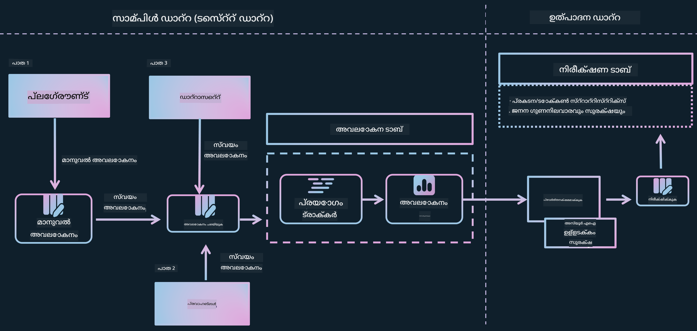

*ചിത്ര ഉറവിടം: [ജെനറേറ്റീവ് AI അപ്ലിക്കേഷനുകളുടെ മൂല്യനിർണയം](https://learn.microsoft.com/azure/ai-studio/concepts/evaluation-approach-gen-ai?wt.mc_id%3Dstudentamb_279723)*

> [!NOTE]
>
> കൂടുതൽ വിശദമായ വിവരങ്ങൾക്കും Phi-3 / Phi-3.5 സംബന്ധിച്ച അധിക സ്രോതസങ്ങൾ എക്‌സ്‌പ്ലോർ ചെയ്യുന്നതിനും, ദയവായി [Phi-3CookBook](https://github.com/microsoft/Phi-3CookBook?wt.mc_id=studentamb_279723) സന്ദർശിക്കുക.

### മുന്‍‌ആവശ്യങ്ങള്‍

- [Python](https://www.python.org/downloads)
- [Azure subscription](https://azure.microsoft.com/free?wt.mc_id=studentamb_279723)
- [Visual Studio Code](https://code.visualstudio.com)
- ഫൈൻ-ട്യൂൺ ചെയ്ത Phi-3 / Phi-3.5 മോഡൽ

### ഉള്ളടക്ക പട്ടിക

1. [**സെനാരിയോ 1: Azure AI Foundry-യുടെ Prompt flow മൂല്യനിർണയത്തിന് ഒരു പരിചയം**](../../../../../../md/02.Application/01.TextAndChat/Phi3)

    - [സുരക്ഷാ മൂല്യനിർണയത്തിന് ഒരു പരിചയം](../../../../../../md/02.Application/01.TextAndChat/Phi3)
    - [പ്രകടനം മൂല്യനിർണയത്തിന് ഒരു പരിചയം](../../../../../../md/02.Application/01.TextAndChat/Phi3)

1. [**സെനാരിയോ 2: Azure AI Foundry-ൽ Phi-3 / Phi-3.5 മോഡൽ വിലയിരുത്തൽ**](../../../../../../md/02.Application/01.TextAndChat/Phi3)

    - [ആരംഭിക്കുന്നതിനുമുമ്പ്](../../../../../../md/02.Application/01.TextAndChat/Phi3)
    - [Phi-3 / Phi-3.5 മോഡൽ വിലയിരുത്താൻ Azure OpenAI ഡിപ്ലോയിംഗ് ചെയ്യുക](../../../../../../md/02.Application/01.TextAndChat/Phi3)
    - [Azure AI Foundry-യുടെ Prompt flow മൂല്യനിർണയം ഉപയോഗിച്ച് ഫൈൻ-ട്യൂൺ ചെയ്ത Phi-3 / Phi-3.5 മോഡൽ വിലയിരുത്തുക](../../../../../../md/02.Application/01.TextAndChat/Phi3)

1. [അഭിനന്ദനങ്ങൾ!](../../../../../../md/02.Application/01.TextAndChat/Phi3)

## **സെനാരിയോ 1: Azure AI Foundry-യുടെ Prompt flow മൂല്യനിർണയത്തിന് ഒരു പരിചയം**

### സുരക്ഷാ മൂല്യനിർണയത്തിന് ഒരു പരിചയം

നിങ്ങളുടെ AI മോഡൽ നീതിമാനവും സുരക്ഷിതവുമാകണമെന്ന് ഉറപ്പാക്കാൻ, Microsoft-ന്റെ Responsible AI നയങ്ങൾക്കെതിരെ അത് വിലയിരുത്തുന്നത് നിർണായകം ആണ്. Azure AI Foundry-യിൽ, സുരക്ഷാ മൂല്യനിർണയങ്ങൾ നിങ്ങളുടെ മോഡൽ jailbreak ആക്രമണങ്ങൾക്ക് എത്രത്തോളം അടവേൽക്കപ്പെടുക ആണോ എന്നും ഹാനികരമായ ഉള്ളടക്കം സൃഷ്ടിക്കാൻ അത് എത്രത്തോളം സാധ്യതയുള്ളതാണെന്നും വിലയിരുത്താൻ അനുവദിക്കുന്നു, ഇത് ഈ നയങ്ങളുമായി നേരിട്ട് അനുയോജ്യമാണ്.

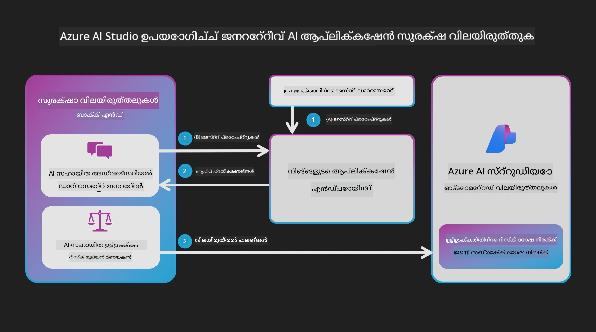

*ചിത്ര ഉറവിടം: [ജെനറേറ്റീവ് AI അപ്ലിക്കേഷനുകളുടെ മൂല്യനിർണയം](https://learn.microsoft.com/azure/ai-studio/concepts/evaluation-approach-gen-ai?wt.mc_id%3Dstudentamb_279723)*

#### Microsoft-ന്റെ Responsible AI നയങ്ങൾ

സാങ്കേതിക ചടുലങ്ങളിലേക്ക് കടക്കുന്നതിന് മുമ്പ്, Microsoft-ന്റെ Responsible AI നയങ്ങൾ എന്ന എതിക് ഫ്രെയിംവർക്കിനെ മനസ്സിലാക്കുന്നത് അനിവാര്യമാണ്. ഈ നയങ്ങൾ AI സിസ്റ്റങ്ങളുടേയും അവരുടെ ഉത്തരവാദിത്വപൂർവമായ വികസനത്തിനും വിന്യാസത്തിനും മൊത്തത്തിലുള്ള പ്രവർത്തനത്തിനും മാർഗ്ഗദർശകമാണ്. ന്യായമായതും വിശകലനപരവുമായതും ഉൾക്കൊള്ളുന്ന തരത്തിൽ AI സാങ്കേതികവിദ്യകൾ നിർമ്മിക്കപ്പെടുന്നുണ്ടെന്ന് ഉറപ്പാക്കാൻ ഈ നയങ്ങൾ സഹായിക്കുന്നു. ഇവ AI മോഡലുകളുടെ സുരക്ഷാ മൂല്യനിർണയത്തിന് അടിസ്ഥാനമാണ്.

Microsoft-ന്റെ Responsible AI നയങ്ങളിൽ ഉൾപ്പെടുന്നു:

- **ന്യായതയും ഉൾക്കൊള്ളലും**: AI സിസ്റ്റങ്ങൾ എല്ലാവരോടും നീതിമാനമായി പെരുമാറേണ്ടതും സമാന സാഹചര്യത്തിൽ ഉള്ള ഗ്രൂപ്പുകളെ വ്യത്യസ്തമായി ബാധിക്കാതിരിക്കുന്നതുമാണ്. ഉദാഹരണത്തിന്, AI സിസ്റ്റങ്ങൾ മെഡിക്കൽ ചികിത്സയ്ക്ക്, വായ്പ അപേക്ഷകൾക്ക്, തൊഴിൽ സംബന്ധമായ നിർദേശങ്ങൾക്ക് മാർഗ്ഗനിർദ്ദേശം നൽകുമ്പോൾ, സമാന ലക്ഷണങ്ങൾ, സാമ്പത്തിക സാഹചര്യങ്ങൾ, അല്ലെങ്കിൽ പ്രൊഫഷണൽ യോഗ്യതകളുള്ള എല്ലാവർക്കും തുല്യമായ ശുപാർശകൾ നൽകണം.

- **വിശ്വാസ്യതയും സുരക്ഷയും**: വിശ്വാസം നിർമ്മിക്കാൻ, AI സിസ്റ്റുകൾ വിശ്വസനീയമായി, സുരക്ഷിതമായി, സ്ഥിരമായി പ്രവർത്തിക്കേണ്ടത് നിർബന്ധമാണ്. ഈ സിസ്റ്റുകൾ രൂപകൽപ്പന ചെയ്ത മോഡൽപ്രകാരം പ്രവർത്തിക്കാനും അനിഷ്ടിത സാഹചര്യങ്ങളോട് സുരക്ഷിതമായി പ്രതികരിക്കാനും ഹാനികരമായ മാനിപുലേഷനോട് പ്രതിരോധിക്കാൻ കഴിയേണ്ടതാണ്. അവ എങ്ങനെ പെരുമാറുന്നു എന്നതും അവർ കൈകാര്യം ചെയ്യാൻ കഴിയുന്ന വ്യത്യസ്ത അവസ്ഥകളും വികസനത്തിന്റെയും ടെസ്റ്റിംഗിന്റെയും സമയത്ത് രൂപകല്പനകര് കണക്കിലൊക്കിയതിന്റേതായ വ്യത്യസ്ത സാഹചര്യങ്ങളെയും പ്രതിഫലിപ്പിക്കും.

- **സ്വട്രതയും തെളിവിത്വം**: മനുഷ്യർ ജീവിതത്തെ ശക്തമായി ബാധിക്കുന്ന തീരുമാനങ്ങൾ ലഭിക്കുമ്പോൾ ആ നിർണ്ണായകത എങ്ങനെ ഉണ്ടായി എന്നത് പേർക്ക് മനസ്സിലാകണം. ഉദാഹരണത്തിന്, ഒരു ബാങ്ക് ഒരു വ്യക്തി ക്രെഡിറ്റ് യോഗ്യനാണോ എന്ന് തീരുമാനിക്കാൻ AI സിസ്റ്റം ഉപയോഗിക്കാം. ഒരു കമ്പനി ഏറ്റവും യോഗ്യമുള്ള ഉദ്യോഗാർത്ഥികളെ തെരഞ്ഞെടുക്കാൻ AI സിസ്റ്റം ഉപയോഗിക്കാം.

- **സ്വകാര്യതയും സുരക്ഷയും**: AI വ്യാപകമാവുന്നതോടെ, സ്വകാര്യത സംരക്ഷിക്കുകയും വ്യക്തിഗതവും വ്യാപാര വിവരങ്ങളും സുരക്ഷിതമാക്കുകയും ചെയ്യുന്നത് കൂടുതൽ പ്രധാനവും സങ്കീർണ്ണവുമായ വിഷയം ആണ്. AI-യിൽ, ഡാറ്റയിലേക്കുള്ള ആക്സസ് AI സിസ്റ്റങ്ങൾക്ക് ആളുകളെ സംബന്ധിച്ച ശരിയായ, വിവരപൂർവ്വമായ പ്രവചനങ്ങളും നിർണ്ണായകങ്ങളുമുണ്ടാക്കാൻ അനിവാര്യമല്ലാത്തതിനാൽ സ്വകാര്യതയും ഡാറ്റ സുരക്ഷയും പ്രത്യേകം ശ്രദ്ധകളിൽപ്പെടേണ്ടതാണ്.

- **കൈക്കൊള്ളലും ഉത്തരവാദിത്വം**: AI സിസ്റ്റങ്ങൾ രൂപകല്പന ചെയ്യുന്നവരും വിന്യസിക്കുന്നവരും അവരുടെ സിസ്റ്റുകൾ എങ്ങനെ പ്രവർത്തിക്കുന്നു എന്ന് സംബന്ധിച്ച് ഉത്തരവാദിത്തം ഏറ്റെടുക്കണം. സംഘടനകൾ വ്യവസായ മാനദണ്ഡങ്ങൾ ആശ്രയിച്ച് ഉത്തരവാദിത്ത നോർമുകൾ രൂപപ്പെടുത്തണം. ഈ നോർമുകൾ ആളുകളുടെ ജീവിതത്തെ ബാധിക്കുന്ന ഏതെങ്കിലും തീരുമാനത്തിൽ AI സിസ്റ്റങ്ങൾ അന്തിമ അധികാരമായിരിക്കരുതെന്ന് ഉറപ്പാക്കും. അതുപോലെ വളരെ സ്വയംഭരണതയുള്ള AI സിസ്റ്റുകളെ മനുഷ്യർ പ്രസക്തമായ നിയന്ത്രണം നിലനിർത്തണമെന്നു ഉറപ്പാക്കും.


*ചിത്ര ഉറവിടം: [Responsible AI എന്താണ്?](https://learn.microsoft.com/azure/machine-learning/concept-responsible-ai?view=azureml-api-2&viewFallbackFrom=azureml-api-2%253fwt.mc_id%3Dstudentamb_279723)*

> [!NOTE]
> Microsoft-ന്റെ Responsible AI നയങ്ങളെക്കുറിച്ച് കൂടുതൽ അറിയാൻ, [What is Responsible AI?](https://learn.microsoft.com/azure/machine-learning/concept-responsible-ai?view=azureml-api-2?wt.mc_id=studentamb_279723) സന്ദർശിക്കുക.

#### സുരക്ഷാ മെട്രിക്‌സ്

ഈ ട്യൂട്ടോറിയലിൽ, Azure AI Foundry-യുടെ സുരക്ഷാ മെട്രിക്‌സുകൾ ഉപയോഗിച്ച് ഫൈൻ-ട്യൂൺ ചെയ്ത Phi-3 മോഡലിന്റെ സുരക്ഷ നിങ്ങൾ വിലയിരുത്തും. ഈ മെട്രിക്‌സ് മോഡൽ ഹാനികരമായ ഉള്ളടക്കം സൃഷ്ടിക്കാനുള്ള സാധ്യതയും jailbreak ആക്രമണങ്ങൾക്ക് ഉള്ള ബാധ്യതയും വിലയിരുത്തുന്നതിന് സഹായിക്കുന്നു. സുരക്ഷാ മെട്രിക്‌സിൽ ഉൾപ്പെടുന്നു:

- **സ്വയംഹാനി-ബന്ധമുള്ള ഉള്ളടക്കം**: മോഡലിന് സ്വയംഹാനി സംബന്ധമായ ഉള്ളടക്കം ഉൽപാദിപ്പിക്കാനുള്ള പ്രവണതയുണ്ടോ എന്ന് വിലയിരുത്തും.
- **വേട്ടയാടൽ-മൂല്യമില്ലാത്ത അല്ലെങ്കിൽ അസംബന്ധ ഉള്ളടക്കം**: മോഡലിന് വിദ്വേഷപരമായ അല്ലെങ്കിൽ അസമത്വപരമായ ഉള്ളടക്കം ഉല്പാദിപ്പിക്കാനുള്ള പ്രവണതയുണ്ടോെന്ന് വിലയിരുത്തും.
- **ഹിംസാത്മക ഉള്ളടക്കം**: മോഡലിന് ഹിംസാത്മക ഉള്ളടക്കം ഉൽപാദിപ്പിക്കാനുള്ള പ്രവണതയുണ്ടോ എന്ന് വിലയിരുത്തും.
- **ലൈംഗിക ഉള്ളടക്കം**: മോഡലിന് അസംഘടിതമായ ലൈംഗിക ഉള്ളടക്കം ഉൽപാദിപ്പിക്കാനുള്ള പ്രവണതയുണ്ടോ എന്ന് വിലയിരുത്തും.

ഈ അവശിഷ്ടങ്ങൾ വിലയിരുത്തുന്നതിലൂടെ AI മോഡൽ ഹാനികരമായ അല്ലെങ്കിൽ അപമാനകരമായ ഉള്ളടക്കം സൃഷ്ടിക്കാത്തതും സമൂഹ മൂല്യങ്ങളിലെയും റെഗുലേറ്ററി മാനദണ്ഡങ്ങളിലെയും അനുയോജ്യമായതുമായെന്ന് ഉറപ്പാക്കപ്പെടുന്നു.


### പ്രകടനം മൂല്യനിർണയത്തിന് ഒരു പരിചയം

നിങ്ങളുടെ AI മോഡൽ പ്രതീക്ഷിച്ചതുണ്ടാകുന്ന രീതിയിൽ പ്രവർത്തിക്കുന്നുണ്ടോ എന്നത് ഉറപ്പാക്കാൻ, അതിന്റെ പ്രകടനം പ്രകടന മെട്രിക്‌സുകൾക്കെതിരെ വിലയിരുത്തുന്നത് പ്രധാനമാണ്. Azure AI Foundry-ൽ, പ്രകടന മൂല്യനിർണയങ്ങൾ നിങ്ങളുടെ മോഡലിന്റെ ശരിയായ, പ്രസക്തമായ, സഹമായ പ്രതികരണങ്ങൾ സൃഷ്ടിക്കാനുള്ള കാര്യക്ഷമത വിലയിരുത്താൻ അനുവദിക്കുന്നു.


*ചിത്ര ഉറവിടം: [ജെനറേറ്റീവ് AI അപ്ലിക്കേഷനുകളുടെ മൂല്യനിർണയം](https://learn.microsoft.com/azure/ai-studio/concepts/evaluation-approach-gen-ai?wt.mc_id%3Dstudentamb_279723)*

#### പ്രകടന മെട്രിക്‌സുകൾ

ഈ ട്യൂട്ടോറിയൽ, Azure AI Foundry-യുടെ പ്രകടന മെട്രിക്‌സുകൾ ഉപയോഗിച്ച് ഫൈൻ-ട്യൂൺ ചെയ്ത Phi-3 / Phi-3.5 മോഡലിന്റെ പ്രകടനം നിങ്ങൾ വിലയിരുത്തും. ഈ മെട്രിക്‌സുകൾ മോഡൽ ശരിയായ, പ്രസക്തമായ, സഹമായ പ്രതികരണങ്ങൾ ഉൽപാദിപ്പിക്കാനുള്ള കാര്യക്ഷമത വിലയിരുത്താൻ സഹായിക്കുന്നു. പ്രകടന മെട്രിക്‌സുകളിൽ ഉൾപ്പെടുന്നു:

- **Groundedness**: ഉൽപാദിപ്പിച്ച ഉത്തറുകൾ ഇൻപുട്ട് സ്രോതസിലുള്ള വിവരങ്ങളുമായി എത്രത്തോളം കലർന്നിരിക്കുന്നുവെന്ന് വിലയിരുത്തുക.
- **Relevance**: നൽകിയ ചോദ്യങ്ങളോട് ഉത്തരം എത്രത്തോളം ബന്ധപ്പെട്ടിട്ടുണ്ടെന്ന് വിലയിരുത്തുക.
- **Coherence**: ഉൽപാദിപ്പിച്ച ടെക്സ്റ്റ് എത്രത്തോളം സ്വാഭാവികമായും സുസ്ഥിരമായും വായിക്കാൻ എളുപ്പമാകുന്നുവെന്ന് വിലയിരുത്തുക.
- **Fluency**: ഉൽപാദിപ്പിച്ച ടെക്സ്റ്റിന്റെ ഭാഷാപരമായ പ്രാവീണ്യം വിലയിരുത്തുക.
- **GPT Similarity**: ഉൽപാദിപ്പിച്ച പ്രതികരണത്തെ ഗ്രൗണ്ട് ട്രൂത്തുമായി സമാനതക്കൂടി താരതമ്യം ചെയ്യുക.
- **F1 Score**: ഉൽപാദിപ്പിച്ച പ്രതികരണത്തിലും സ്രോതസ്സ് ഡാറ്റയിലും പങ്കിട്ട വാക്കുകളുടെ അനുപാതം നിർണ്ണയിക്കുന്നു.

ഈ മെട്രിക്‌സുകൾ മോഡലിന്റെ ശരിയായ, പ്രസക്തമായ, സഹമായ പ്രതികരണങ്ങൾ ഉത്പാദിപ്പിക്കാനുള്ള കാര്യക്ഷമത വിലയിരുത്താൻ സഹായിക്കുന്നു.


## **സെനാരിയോ 2: Azure AI Foundry-ൽ Phi-3 / Phi-3.5 മോഡൽ വിലയിരുത്തൽ**

### ആരംഭിക്കുന്നതിന് മുമ്പ്

ഈ ട്യൂട്ടോറിയൽ മുമ്പത്തെ ബ്ലോഗ് പോസ്റ്റുകളുടെ തുടർച്ചയാണെങ്കിൽ, "[Fine-Tune and Integrate Custom Phi-3 Models with Prompt Flow: Step-by-Step Guide](https://techcommunity.microsoft.com/t5/educator-developer-blog/fine-tune-and-integrate-custom-phi-3-models-with-prompt-flow/ba-p/4178612?wt.mc_id=studentamb_279723)" மற்றும் "[Fine-Tune and Integrate Custom Phi-3 Models with Prompt Flow in Azure AI Foundry](https://techcommunity.microsoft.com/t5/educator-developer-blog/fine-tune-and-integrate-custom-phi-3-models-with-prompt-flow-in/ba-p/4191726?wt.mc_id=studentamb_279723)" എന്നിവയിലെ ഉള്ളടക്കങ്ങളിലേക്ക് നിങ്ങൾ પહેલമായി പോയിട്ടുള്ളതായി കരുതുന്നു. ഈ പോസ്റ്റുകളിൽ, Azure AI Foundry-ൽ Phi-3 / Phi-3.5 മോഡൽ ഫൈൻ-ട്യൂൺ ചെയ്യുകയും Prompt flow-നുമായി സംയോജിപ്പിക്കുകയും ചെയ്യാനുള്ള പ്രക്രിയ ചോദിച്ചുവെന്നതാണ്.

ഈ ട്യൂട്ടോറിയലിൽ, Azure OpenAI മോഡൽ ഒരു മൂല്യനിർണയകയെന്ന നിലയിൽ Azure AI Foundry-യിൽ ഡിപ്ലോയ് ചെയ്യുകയും അതുപയോഗിച്ച് നിങ്ങളുടെ ഫൈൻ-ട്യൂൺ ചെയ്ത Phi-3 / Phi-3.5 മോഡൽ വിലയിരുത്തുകയും ചെയ്യും.

ഈ ട്യൂട്ടോറിയൽ ആരംഭിക്കുന്നതിന് മുമ്പ്, മുൻപ് നൽകിയിട്ടുള്ള ട്യൂട്ടോറിയലുകളിൽ വിവരണപ്പെടുത്തിയതുപോലെ താഴെയുള്ള മുന്‍ആവശ്യങ്ങൾ ഉള്ളതായി ഉറപ്പാക്കുക:

1. ഫൈൻ-ട്യൂൺ ചെയ്ത Phi-3 / Phi-3.5 മോഡൽ വിലയിരുത്തുന്നതിനുള്ള തയ്യാറാക്കിയ dataset.
1. ഫൈൻ-ട്യൂൺ ചെയ്തും Azure Machine Learning-ലേക്ക് ഡിപ്ലോയയും ചെയ്ത Phi-3 / Phi-3.5 മോഡൽ.
1. Azure AI Foundry-ലിലെ ഫൈൻ-ട്യൂൺ ചെയ്ത Phi-3 / Phi-3.5 മോഡലുമായി സംയോജിപ്പിച്ച Prompt flow.

> [!NOTE]
> നിങ്ങൾ മുൻപത്തെ ബ്ലോഗ് പോസ്റ്റുകളിൽ ഡൗൺലോഡ് ചെയ്ത **ULTRACHAT_200k** dataset-ലെ data ഫോൾഡറിൽ ഉള്ള *test_data.jsonl* ഫയൽ ഫൈൻ-ട്യൂൺ ചെയ്ത Phi-3 / Phi-3.5 മോഡൽ വിലയിരുത്താനുള്ള dataset ആയി നിങ്ങൾ ഉപയോഗിക്കും.

#### കോഡ്-ഫസ്റ്റ് സമീപനം: Azure AI Foundry-ൽ Prompt flow-നുമായി കസ്റ്റം Phi-3 / Phi-3.5 മോഡൽ സംയോജിപ്പിക്കുക

> [!NOTE]
> നിങ്ങൾ "[Fine-Tune and Integrate Custom Phi-3 Models with Prompt Flow in Azure AI Foundry](https://techcommunity.microsoft.com/t5/educator-developer-blog/fine-tune-and-integrate-custom-phi-3-models-with-prompt-flow-in/ba-p/4191726?wt.mc_id=studentamb_279723)" എന്ന ലോ-കോഡ് സമീപനം പിന്തുടഞ്ഞിട്ടുണ്ടെങ്കിൽ, ഈ വ്യായാമം സ്കിപ്പ്ചെയ്യുകയും അടുത്ത ഭാഗത്തിലേക്ക് പോവുകയും ചെയ്യാം.
> എങ്കിൽ വേണമെങ്കിൽ, "[Fine-Tune and Integrate Custom Phi-3 Models with Prompt Flow: Step-by-Step Guide](https://techcommunity.microsoft.com/t5/educator-developer-blog/fine-tune-and-integrate-custom-phi-3-models-with-prompt-flow/ba-p/4178612?wt.mc_id=studentamb_279723)" എന്ന കോഡ്-ഫസ്റ്റ് സമീപനം പിന്തുടന്ന് Phi-3 / Phi-3.5 മോഡൽ ഫൈൻ-ട്യൂൺ ചെയ്ത് ഡിപ്ലോയുചെയ്തിരിക്കുന്നത് ആണെങ്കിൽ, നിങ്ങളുടെ മോഡൽ Prompt flow-നുമായി കണക്‌ട് ചെയ്യാനുള്ള പ്രക്രിയ ഒലിപ്പിച്ചിരിക്കുന്നു. ഈ വ്യായാമത്തിൽ നിങ്ങൾ പക്ഷേ ആ പ്രക്രിയ പഠിക്കും.

മെത്തുന്നതിനായി, ഫൈൻ-ട്യൂൺ ചെയ്ത Phi-3 / Phi-3.5 മോഡൽ Azure AI Foundry-ലെ Prompt flow-ൽ സംയോജിപ്പിക്കേണ്ടതാണ്.

#### Azure AI Foundry Hub സൃഷ്ടിക്കുക

Project സൃഷ്ടിക്കുന്നതിന് മുമ്പ് നിങ്ങൾ ഒരു Hub സൃഷ്ടിക്കേണ്ടതാണ്. Hub ഒരു Resource Group പോലെയാണ് പ്രവർത്തിക്കുന്നത്, Azure AI Foundry-ൽ ഒന്നിലധികം Projects ഒργάνൈസ് ചെയ്ത് മാനേജ് ചെയ്യാൻ നിങ്ങളെ അനുവദിക്കും.

1. [Azure AI Foundry](https://ai.azure.com/?wt.mc_id=studentamb_279723) ൽ സൈൻ ഇൻ ചെയ്യുക.

1. ഇടത് ഭാഗത്തെ ടാബിൽ നിന്നും **All hubs** തിരഞ്ഞെടുക്കുക.

1. നാവിഗേഷൻ മെനുവിൽ നിന്നും **+ New hub** തിരഞ്ഞെടുക്കുക.

    
1. Perform the following tasks:

    - **Hub name** നൽകുക. ഇത് പ്രത്യേകമായ മൂല്യം ആയിരിക്കണം.
    - നിങ്ങളുടെ Azure **Subscription** തിരഞ്ഞെടുക്കുക.
    - ഉപയോഗിക്കാൻ **Resource group** തിരഞ്ഞെടുക്കുക (ആവശ്യമുണ്ടെങ്കിൽ പുതിയതുണ്ടാക്കുക).
    - ഉപയോഗിക്കേണ്ട **Location** തിരഞ്ഞെടുക്കുക.
    - ഉപയോഗിക്കേണ്ട **Connect Azure AI Services** തിരഞ്ഞെടുക്കുക (ആവശ്യമെങ്കിൽ ഒരു പുതിയത് ഉണ്ടാക്കുക).
    - **Connect Azure AI Search** ന് **Skip connecting** തിരഞ്ഞെടുക്കുക.

    

1. **Next** തിരഞ്ഞെടുക്കുക.

#### Azure AI Foundry പ്രോജക്ട് സൃഷ്ടിക്കുക

1. നിങ്ങൾ സൃഷ്ടിച്ച ഹബിൽ, ഇടത് ടാബിൽ നിന്നുള്ള **All projects** തിരഞ്ഞെടുക്കുക.

1. നാവിഗേഷൻ മെനുവിൽ നിന്നുള്ള **+ New project** തിരഞ്ഞെടുക്കുക.

    

1. **Project name** നൽകുക. ഇത് പ്രത്യേകമായ മൂല്യം ആയിരിക്കണം.

    

1. **Create a project** തിരഞ്ഞെടുക്കുക.

#### ഫൈൻ-ട്യൂൺ ചെയ്ത Phi-3 / Phi-3.5 മോഡലിനായുള്ള ഒരു കസ്റ്റം കണക്ഷൻ ചേർക്കുക

Prompt flow-നുമായി നിങ്ങളുടെ കസ്റ്റം Phi-3 / Phi-3.5 മോഡൽ ഇന്റഗ്രേറ്റ് ചെയ്യാൻ, മോഡലിന്റെ എൻഡ്പോയിന്റും കീയും ഒരു കസ്റ്റം കണക്ഷനിൽ സേവ് ചെയ്യേണ്ടതുണ്ട്. ഈ സെറ്റപ്പിലൂടെ Prompt flow-ൽ നിങ്ങളുടെ കസ്റ്റം Phi-3 / Phi-3.5 മോഡലിലേക്കുള്ള ആക്സസ് ഉറപ്പാക്കുന്നു.

#### ഫൈൻ-ട്യൂൺ ചെയ്ത Phi-3 / Phi-3.5 മോഡലിന്റെ API കീയും എൻഡ്പോയിന്റ് URIയും ക്രമീകരിക്കുക

1. [Azure ML Studio](https://ml.azure.com/home?wt.mc_id=studentamb_279723) സന്ദർശിക്കുക.

1. നിങ്ങൾ സൃഷ്ടിച്ച Azure Machine learning വർക്‌സ്‌പേസ് വരെ നാവിഗേറ്റ് ചെയ്യുക.

1. ഇടത് ടാബിൽ നിന്നുള്ള **Endpoints** തിരഞ്ഞെടുക്കുക.

    

1. നിങ്ങൾ സൃഷ്ടിച്ച എൻഡ്പോയിന്റ് തിരഞ്ഞെടുക്കുക.

    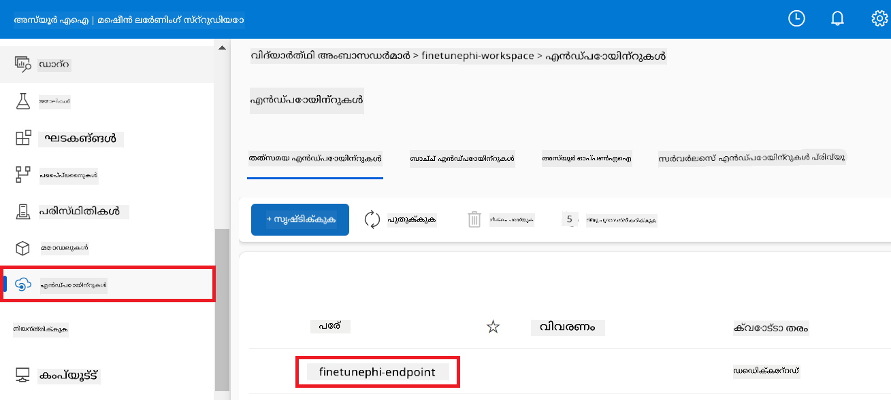

1. നാവിഗേഷൻ മെനുവിൽ നിന്നുള്ള **Consume** തിരഞ്ഞെടുക്കുക.

1. നിങ്ങളുടെ **REST endpoint** ഉം **Primary key** ഉം കോപ്പി ചെയ്യുക.

    

#### കസ്റ്റം കണക്ഷൻ ചേർക്കുക

1. [Azure AI Foundry](https://ai.azure.com/?wt.mc_id=studentamb_279723) സന്ദർശിക്കുക.

1. നിങ്ങൾ സൃഷ്ടിച്ച Azure AI Foundry പ്രോജക്ടിലേക്കു നാവിഗേറ്റ് ചെയ്യുക.

1. നിങ്ങൾ സൃഷ്ടിച്ച പ്രോജക്ടിൽ, ഇടത് ടാബിൽ നിന്നുള്ള **Settings** തിരഞ്ഞെടുക്കുക.

1. **+ New connection** തിരഞ്ഞെടുക്കുക.

    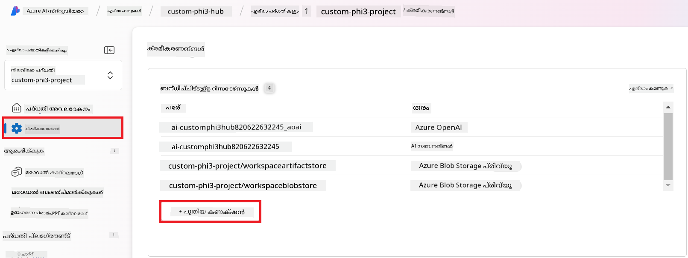

1. നാവിഗേഷൻ മെനുവിൽ നിന്നുള്ള **Custom keys** തിരഞ്ഞെടുക്കുക.

    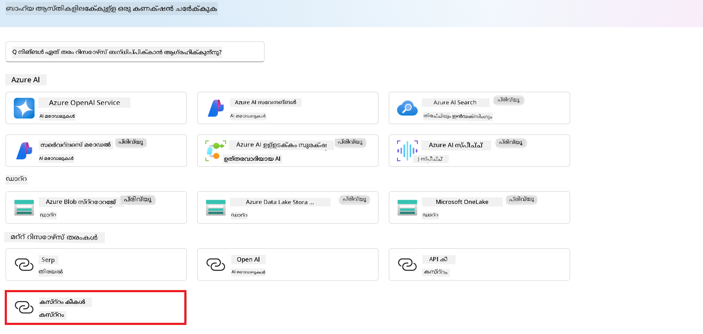

1. താഴെ പറയപ്പെടുന്ന കാര്യങ്ങൾ ചെയ്യുക:

    - **+ Add key value pairs** തിരഞ്ഞെടുക്കുക.
    - കീ നാമമായി **endpoint** നൽകുക, Azure ML Studio ൽ നിന്ന് കോപ്പി ചെയ്ത എൻഡ്പോയിന്റ് value ഫീൽഡിൽ പേസ്റ്റ് ചെയ്യുക.
    - വീണ്ടും **+ Add key value pairs** തിരഞ്ഞെടുക്കുക.
    - കീ നാമമായി **key** നൽകുക, Azure ML Studio ൽ നിന്നായി കോപ്പി ചെയ്ത കീ value ഫീൽഡിൽ പേസ്റ്റ് ചെയ്യുക.
    - കീകൾ ചേർത്തശേഷം കീ പുറത്തു കാണാതിരിക്കാനായി **is secret** തിരഞ്ഞെടുക്കുക.

    

1. **Add connection** തിരഞ്ഞെടുക്കുക.

#### Prompt flow സൃഷ്ടിക്കുക

നിങ്ങൾ Azure AI Foundry-യിൽ ഒരു കസ്റ്റം കണക്ഷൻ ചേർത്തിട്ടുണ്ട്. 이제 താഴെ കാണുന്ന പടികളിലൂടെ ഒരു Prompt flow സൃഷ്ടിക്കാം. തുടർന്ന്, ഈ Prompt flow നെ കസ്റ്റം കണക്ഷനുമായി ബന്ധിപ്പിച്ച് ഫൈൻ-ട്യൂൺ ചെയ്ത മോഡൽ Prompt flow-ൽ ഉപയോഗിക്കാനും കഴിയും.

1. നിങ്ങൾ സൃഷ്ടിച്ച Azure AI Foundry പ്രോജക്ടിലേക്കു നാവിഗേറ്റ് ചെയ്യുക.

1. ഇടത് ടാബിൽ നിന്നുള്ള **Prompt flow** തിരഞ്ഞെടുക്കുക.

1. നാവിഗേഷൻ മെനുവിൽ നിന്നുള്ള **+ Create** തിരഞ്ഞെടുക്കുക.

    

1. നാവിഗേഷൻ മെനുവിൽ നിന്നുള്ള **Chat flow** തിരഞ്ഞെടുക്കുക.

    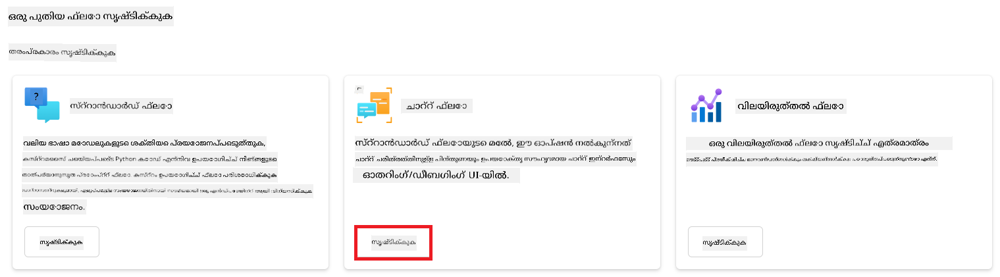

1. ഉപയോഗിക്കാൻ **Folder name** നൽകുക.

    

1. **Create** തിരഞ്ഞെടുക്കുക.

#### നിങ്ങളുടെ കസ്റ്റം Phi-3 / Phi-3.5 മോഡലുമായി ചാറ്റ് ചെയ്യാൻ Prompt flow സജ്ജമാക്കുക

ഫൈൻ-ട്യൂൺ ചെയ്ത Phi-3 / Phi-3.5 മോഡൽ Prompt flow-ലേക്ക് ഇന്റഗ്രേറ്റ് ചെയ്യേണ്ടതുണ്ട്. എന്നിരുന്നാലും, നിലവിലുള്ള Prompt flow ഈ ഉദ്ദേശ്യത്തിന് അനുയോജ്യമല്ല. അതിനാൽ, കസ്റ്റം മോഡൽ ഇന്റഗ്രേറ്റ് ചെയ്യാൻ Prompt flow പുനർഡിസൈൻ ചെയ്യേണ്ടത് ആവശ്യം ആണ്.

1. Prompt flow-ൽ, നിലവിലുള്ള ഫ്ലോ പുനർനിർമ്മിക്കാൻ താഴെ പറയുന്ന പ്രവർത്തനങ്ങൾ ചെയ്യുക:

    - **Raw file mode** തിരഞ്ഞെടുക്കുക.
    - *flow.dag.yml* ഫയലിലെ നിലവിലുള്ള എല്ലാ കോഡും 삭제ിക്കുക.
    - താഴെയുള്ള കോഡ് *flow.dag.yml*-ലേക്ക് ചേർക്കുക.

        ```yml
        inputs:
          input_data:
            type: string
            default: "Who founded Microsoft?"

        outputs:
          answer:
            type: string
            reference: ${integrate_with_promptflow.output}

        nodes:
        - name: integrate_with_promptflow
          type: python
          source:
            type: code
            path: integrate_with_promptflow.py
          inputs:
            input_data: ${inputs.input_data}
        ```

    - **Save** തിരഞ്ഞെടുക്കുക.

    

1. Prompt flow-യിൽ കസ്റ്റം Phi-3 / Phi-3.5 മോഡൽ ഉപയോഗിക്കാൻ *integrate_with_promptflow.py* ഫയലിൽ താഴെയുള്ള കോഡ് ചേർക്കുക.

    ```python
    import logging
    import requests
    from promptflow import tool
    from promptflow.connections import CustomConnection

    # ലോഗിംഗ് സജ്ജീകരണം
    logging.basicConfig(
        format="%(asctime)s - %(levelname)s - %(name)s - %(message)s",
        datefmt="%Y-%m-%d %H:%M:%S",
        level=logging.DEBUG
    )
    logger = logging.getLogger(__name__)

    def query_phi3_model(input_data: str, connection: CustomConnection) -> str:
        """
        Send a request to the Phi-3 / Phi-3.5 model endpoint with the given input data using Custom Connection.
        """

        # "connection" കസ്റ്റം കണക്ഷന്റെ പേര് ആണ്, "endpoint"യും "key"യും കസ്റ്റം കണക്ഷനിലുള്ള കീകൾ ആണ്
        endpoint_url = connection.endpoint
        api_key = connection.key

        headers = {
            "Content-Type": "application/json",
            "Authorization": f"Bearer {api_key}"
        }
    data = {
        "input_data": [input_data],
        "params": {
            "temperature": 0.7,
            "max_new_tokens": 128,
            "do_sample": True,
            "return_full_text": True
            }
        }
        try:
            response = requests.post(endpoint_url, json=data, headers=headers)
            response.raise_for_status()
            
            # പൂർണ്ണ JSON പ്രതികരണം ലോഗ് ചെയ്യുക
            logger.debug(f"Full JSON response: {response.json()}")

            result = response.json()["output"]
            logger.info("Successfully received response from Azure ML Endpoint.")
            return result
        except requests.exceptions.RequestException as e:
            logger.error(f"Error querying Azure ML Endpoint: {e}")
            raise

    @tool
    def my_python_tool(input_data: str, connection: CustomConnection) -> str:
        """
        Tool function to process input data and query the Phi-3 / Phi-3.5 model.
        """
        return query_phi3_model(input_data, connection)

    ```

    

> [!NOTE]
>
> Azure AI Foundry-ൽ Prompt flow ഉപയോഗിക്കുന്നതിനെക്കുറിച്ചുള്ള കൂടുതൽ വിശദമായ വിവരങ്ങൾക്ക്, നിങ്ങൾക്ക് [Azure AI Foundry-ലിലുള്ള Prompt flow](https://learn.microsoft.com/azure/ai-studio/how-to/prompt-flow) എന്ന ലേഖനം കാണാവുന്നതാണ്.
>
> 1. **Chat input**, **Chat output** തിരഞ്ഞെടുക്കുക, നിങ്ങളുടെ മോഡലുമായി ചാറ്റ് ചെയ്യാൻ സജ്ജമാക്കാൻ.

    

1. ഇപ്പോൾ നിങ്ങൾ നിങ്ങളുടെ കസ്റ്റം Phi-3 / Phi-3.5 മോഡലുമായി ചാറ്റ് ചെയ്യാൻ തയ്യാറാണ്. അടുത്ത അഭ്യാസത്തിൽ, Prompt flow ആരംഭിക്കുകയും ഫൈൻ-ട്യൂൺ ചെയ്ത Phi-3 / Phi-3.5 മോഡലുമായി ചാറ്റ് ചെയ്യാനായി അത് ഉപയോഗിക്കാൻ നിങ്ങൾ പഠിക്കും.

> [!NOTE]
>
> പുനർനിർമ്മിച്ച ഫ്ലോ താഴെ കാണുന്ന ചിത്രത്തിനുപോലെ കാണപ്പെടണം:
>
> 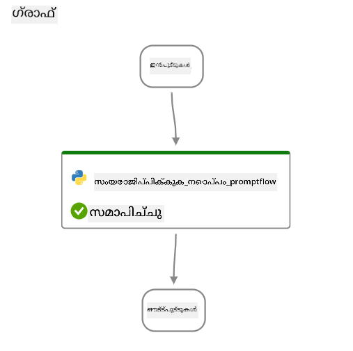
>

#### Prompt flow ആരംഭിക്കുക

1. Prompt flow ആരംഭിക്കാൻ **Start compute sessions** തിരഞ്ഞെടുക്കുക.

    

1. പാരാമീറ്ററുകൾ പുതുക്കാൻ **Validate and parse input** തിരഞ്ഞെടുക്കുക.

    

1. നിങ്ങൾ സൃഷ്ടിച്ച കസ്റ്റം കണക്ഷനുമായി ബന്ധിപ്പിക്കാൻ **connection** എന്ന പ്ലംബിൽ ഉള്ള **Value** തിരഞ്ഞെടുക്കുക. ഉദാഹരണത്തിന്, *connection*.

    

#### നിങ്ങളുടെ കസ്റ്റം Phi-3 / Phi-3.5 മോഡലുമായി ചാറ്റ് ചെയ്യുക

1. **Chat** തിരഞ്ഞെടുക്കുക.

    

1. ഫലങ്ങളുടെ ഒരു ഉദാഹരണം ഇവിടെുണ്ട്: ഇപ്പോൾ നിങ്ങൾ നിങ്ങളുടെ കസ്റ്റം Phi-3 / Phi-3.5 മോഡലുമായി ചാറ്റ് ചെയ്യാൻ കഴിയും. ഫൈൻ-ട്യൂണിംഗിനായി ഉപയോഗിച്ച ഡാറ്റ അനുസരിച്ച് ചോദ്യങ്ങൾ ചോദിക്കുക എന്നതാണ് ശുപാർശ.

    

### Phi-3 / Phi-3.5 മോഡൽ വിലയിരുത്താൻ Azure OpenAI വിന്യസിക്കുക

Azure AI Foundry-യിൽ Phi-3 / Phi-3.5 മോഡൽ വിലയിരുത്താൻ, ഒരു Azure OpenAI മോഡൽ വിന്യസിക്കേണ്ടതുണ്ട്. Phi-3 / Phi-3.5 മോഡലിന്റെ പ്രകടനം വിലയിരുത്താൻ ഈ മോഡലിനെ ഉപയോഗിക്കും.

#### Azure OpenAI വിന്യസിക്കുക

1. [Azure AI Foundry](https://ai.azure.com/?wt.mc_id=studentamb_279723) ല് സൈൻ ഇൻ ചെയ്യുക.

1. നിങ്ങൾ സൃഷ്ടിച്ച Azure AI Foundry പ്രോജക്ടിലേക്കു നാവിഗേറ്റ് ചെയ്യുക.

    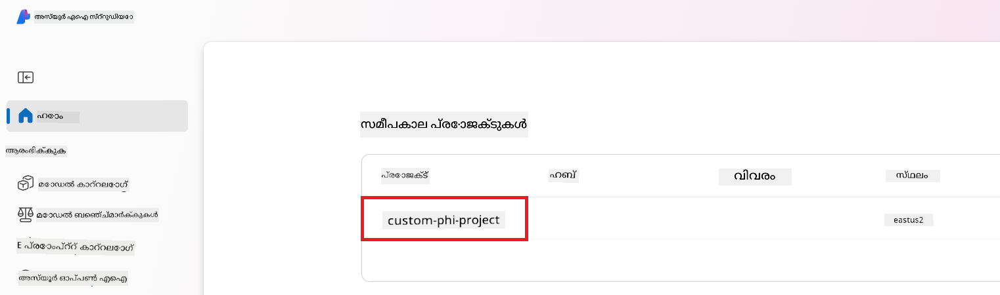

1. നിങ്ങൾ സൃഷ്ടിച്ച പ്രോജക്ടിൽ, ഇടത് ടാബിൽ നിന്നുള്ള **Deployments** തിരഞ്ഞെടുക്കുക.

1. നാവിഗേഷൻ മെനുവിൽ നിന്നുള്ള **+ Deploy model** തിരഞ്ഞെടുക്കുക.

1. **Deploy base model** തിരഞ്ഞെടുക്കുക.

    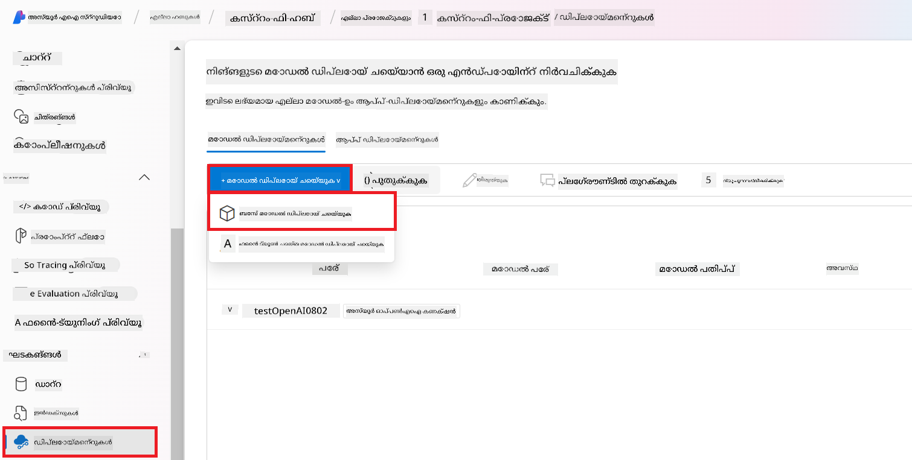

1. ഉപയോഗിക്കാൻ ഇഷ്ടമുള്ള Azure OpenAI മോഡൽ തിരഞ്ഞെടുക്കുക. ഉദാഹരണത്തിന്, **gpt-4o**.

    

1. **Confirm** തിരഞ്ഞെടുക്കുക.

### Azure AI Foundry-യുടെ Prompt flow മൂല്യനിർണയം ഉപയോഗിച്ചു ഫൈൻ-ട്യൂൺ ചെയ്ത Phi-3 / Phi-3.5 മോഡൽ വിലയിരുത്തുക

### പുതിയ ഒരു മൂല്യനിർണയം ആരംഭിക്കുക

1. [Azure AI Foundry](https://ai.azure.com/?wt.mc_id=studentamb_279723) സന്ദർശിക്കുക.

1. നിങ്ങൾ സൃഷ്ടിച്ച Azure AI Foundry പ്രോജക്ടിലേക്കു നാവിഗേറ്റ് ചെയ്യുക.

    

1. നിങ്ങൾ സൃഷ്ടിച്ച പ്രോജക്ടിൽ, ഇടത് ടാബിൽ നിന്നുള്ള **Evaluation** തിരഞ്ഞെടുക്കുക.

1. നാവിഗേഷൻ മെനുവിൽ നിന്നുള്ള **+ New evaluation** തിരഞ്ഞെടുക്കുക.

    

1. **Prompt flow** മൂല്യനിർണയം തിരഞ്ഞെടുക്കുക.

    

1. താഴെ പറയുന്ന കാര്യങ്ങൾ ചെയ്യുക:

    - മൂല്യനിർണയത്തിന്റെ പേര് നൽകുക. ഇത് പ്രത്യേകമായ മൂല്യം ആയിരിക്കണം.
    - ടാസ്‌ക് ടൈറ്റായി **Question and answer without context** തിരഞ്ഞെടുക്കുക. ഈ ട്യൂട്ടോറിയലിൽ ഉപയോഗിച്ച **UlTRACHAT_200k** ഡാറ്റാസെറ്റ് കോൺടെക്സ്റ്റ് അടക്കത്തെയല്ലാത്തതിനാലാണ് ഇത് തിരഞ്ഞെടുക്കുന്നത്.
    - നിങ്ങൾ മൂല്യനിർണയിക്കാൻ പോകുന്ന prompt flow തിരഞ്ഞെടുക്കുക.

    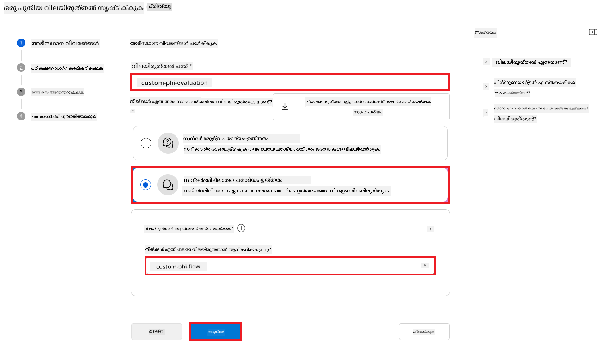

1. **Next** തിരഞ്ഞെടുക്കുക.

1. താഴെ പറയുന്ന കാര്യങ്ങൾ ചെയ്യുക:

    - ഡാറ്റാസെറ്റ് അപ്ലോഡുചെയ്യാൻ **Add your dataset** തിരഞ്ഞെടുക്കുക. ഉദാഹരണത്തിന്, **ULTRACHAT_200k** ഡാറ്റാസെറ്റ് ഡൗൺലോഡ് ചെയ്യുമ്പോൾ ഉൾപ്പെടുന്ന *test_data.json1* പോലുള്ള ടെസ്റ്റ് ഡാറ്റ ഫയൽ അപ്ലോഡ് ചെയ്യാവുന്നതാണ്.
    - നിങ്ങളുടെ ഡാറ്റാസെറ്റിനേറെ അനുയോജ്യമായ **Dataset column** തിരഞ്ഞെടുക്കുക. ഉദാഹരണത്തിന്, **ULTRACHAT_200k** ഉപയോഗിക്കുന്നവരാണ് എങ്കിൽ **${data.prompt}** dataset column ആയി തിരഞ്ഞെടുക്കുക.

    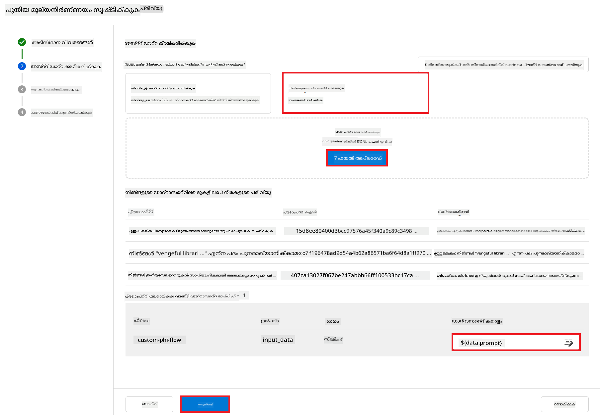

1. **Next** തിരഞ്ഞെടുക്കുക.

1. പ്രകടനവും ഗുണനിലവാരവും മെട്രിക്സുകൾ ക്രമീകരിക്കാൻ താഴെ പറയുന്ന കാര്യങ്ങൾ ചെയ്യുക:

    - ഉപയോഗിക്കാൻ നിങ്ങൾ ആഗ്രഹിക്കുന്ന പ്രകടനവും ഗുണനിലവാര മെട്രിക്സുകളും തിരഞ്ഞെടുക്കുക.
    - മൂല്യനിർണയത്തിനായി നിങ്ങൾ സൃഷ്ടിച്ച Azure OpenAI മോഡൽ തിരഞ്ഞെടുക്കുക. ഉദാഹരണത്തിന്, **gpt-4o** തിരഞ്ഞെടുക്കുക.

    

1. റിസ്‌കും സുരക്ഷാ മെട്രിക്സുകളും ക്രമീകരിക്കാൻ താഴെ പറയുന്ന കാര്യങ്ങൾ ചെയ്യുക:

    - നിങ്ങൾ ഉപയോഗിക്കാൻ ആഗ്രഹിക്കുന്ന റിസ്‌കും സുരക്ഷാ മെട്രിക്സുകളും തിരഞ്ഞെടുക്കുക.
    - തകരാറ് നിരക്ക് കണക്കാക്കാൻ ഉപയോഗിക്കാൻ ട്രെഷോൾഡ് തിരഞ്ഞെടുക്കുക. ഉദാഹരണത്തിന്, **Medium** തിരഞ്ഞെടുക്കുക.
    - **question**-യ്ക്ക്, **Data source** എന്നായി **{$data.prompt}** തിരഞ്ഞെടുക്കുക.
    - **answer**-യ്ക്ക്, **Data source** എന്നായി **{$run.outputs.answer}** തിരഞ്ഞെടുക്കുക.
    - **ground_truth**-ക്ക്, **Data source** എന്നായി **{$data.message}** തിരഞ്ഞെടുക്കുക.

    

1. **Next** തിരഞ്ഞെടുക്കുക.

1. മൂല്യനിർണയം ആരംഭിക്കാൻ **Submit** തിരഞ്ഞെടുക്കുക.

1. മൂല്യനിർണയം പൂർത്തിയാകാൻ ചില സമയം എടുക്കും. നിങ്ങൾക്ക് പ്രഗതിയുടെ നിരീക്ഷണം **Evaluation** ടാബിൽ ചെയ്യാവുന്നതാണ്.

### മൂല്യനിർണയ ഫലങ്ങൾ അവലോകനം ചെയ്യുക

> [!NOTE]
> താഴെ കാണിക്കുന്ന ഫലങ്ങൾ മൂല്യനിർണയ പ്രക്രിയയെ ചിത്രീകരിക്കാൻ ഉദ്ദേശിച്ചതാണ്. ഈ ട്യൂട്ടോറിയലിൽ, ഞങ്ങൾ സാമാന്യമായി ചെറിയ ഒരു ഡാറ്റാസെറ്റിൽ ഫൈൻ-ട്യൂൺ ചെയ്ത മോഡൽ ഉപയോഗിച്ചതുകൊണ്ട് പരിഗണനയ്ക്ക് താഴെയായ ഫലങ്ങൾ ഉണ്ടാകാം. ഉപയോഗിച്ച ഡാറ്റാസെറ്റിന്റെ വലുപ്പം, ഗുണമേന്മ, വൈവിധ്യം, കൂടാതെ മോഡലിന്റെ പ്രത്യേക കോൺഫിഗറേഷൻ എന്നിവയെ ആശ്രയിച്ചാണ് യാഥാർത്ഥ്യ ഫലങ്ങൾ വ്യത്യസ്തമായി വരാവുന്നത്.

മൂല്യനിർണയം പൂർത്തിയായതിനു ശേഷം, നിങ്ങൾ പ്രകടനവും സുരക്ഷാ മെട്രിക്സുകളും രണ്ടും അവലോകനം ചെയ്യാം.

1. പ്രകടനവും ഗുണനിലവാര മെട്രിക്സുകൾ:

    - മൂഡലിന്റെ സുസംബന്ധമായ, നിർവാഹകവും അനുയോജ്യവുമായ പ്രതികരണങ്ങൾ സൃഷ്ടിക്കുന്നതിലെ ഫലപ്രാപ്തി വിലയിരുത്തുക.

    

1. റിസ്‌ക് ಮತ್ತು സുരക്ഷാ മെട്രിക്സുകൾ:
    - മോഡലിന്റെ ഔട്ട്പുട്ടുകൾ സുരക്ഷിതമാണെന്നും Responsible AI തത്ത്വങ്ങളുമായി പൊരുത്തപ്പെടുന്നവയാണെന്നും ഉറപ്പാക്കുക, ഏതെങ്കിലും ഹാനികരമായ അല്ലെങ്കിൽ അപമാനകരമായ ഉള്ളടക്കം ഒഴിവാക്കുക.

    

1. നിങ്ങൾ താഴേക്ക് സ്ക്രോൾ ചെയ്ത് **വിശദ മെട്രിക് ഫലം** കാണാവുന്നതാണ്.

    

1. നിങ്ങളുടെ കസ്റ്റം Phi-3 / Phi-3.5 മോഡൽ പ്രവർത്തനക്ഷമതയും സുരക്ഷാ മെട്രിക്കുകളും അടിസ്ഥാനമാക്കി മൂല്യനിർണയം നടത്തുമ്പോൾ, മോഡൽ ഫലപ്രദമാണെന്നതും ഉത്തരവാദിത്വമുള്ള AI പ്രവർത്തനരീതികൾ പാലിക്കുന്നതുമാണ് എന്ന് നിങ്ങൾ ഉറപ്പാക്കാൻ സാധിക്കുന്നു, അതിനാൽ ഇത് യാഥാർത്ഥ്യ പ്രയോഗത്തിന് തയ്യാറായതാണെന്ന് നിശ്ചയിക്കാം.

## അഭിനന്ദനങ്ങൾ!

### നിങ്ങൾ ഈ ട്യൂട്ടോറിയൽ പൂർത്തിയാക്കിയിട്ടുണ്ട്

നിങ്ങൾ Azure AI Foundry-ലിൽ Prompt flow-നുമായി സംയോജിതമായി ഫൈൻ-ട്യൂൺ ചെയ്ത Phi-3 മോഡൽ വിജയകരമായി മൂല്യനിർണയിച്ചു. ഇത് നിങ്ങളുടെ AI മോഡലുകൾ നന്നായി പ്രവർത്തിക്കേണ്ടതായതുപോലെ വിശ്വസനീയവും റീപോൺസിബിൾ AI തത്വങ്ങൾ പാലിക്കുന്നതുമാണ് എന്ന് ഉറപ്പാക്കാൻ സഹായിക്കുന്ന ഒരു പ്രധാന ഘട്ടമാണ്, വിശ്വസനീയവും വിശ്വസ്തവുമായ AI ആപ്ലിക്കേഷനുകൾ നിർമ്മിക്കാൻ ഇത് സഹായിക്കുന്നു.


## Azure റിസോഴ്‌സുകൾ നീക്കം ചെയ്യുക

നിങ്ങളുടെ അക്കൗണ്ടില്‍ അധിക ചെലവുകൾ വരാതിരിക്കാന്‍ നിങ്ങളുടെ Azure റിസോഴ്സുകൾ നീക്കം ചെയ്യുക. Azure പോർട്ടലിലേക്ക് പോകുകയും താഴെപ്പറയുന്ന റിസോഴ്‌സുകൾ മായ്ക്കുക:

- Azure Machine learning റിസോഴ്‌സ്.
- Azure Machine learning മോഡൽ എന്റ്പോയിന്റ്.
- Azure AI Foundry Project റിസോഴ്‌സ്.
- Azure AI Foundry Prompt flow റിസോഴ്‌സ്.

### അടുത്ത നടപടികൾ

#### ഡോക്യുമെന്റേഷൻ

- [Responsible AI ഡാഷ്‌ബോർഡ് ഉപയോഗിച്ച് AI സിസ്റ്റങ്ങൾ വിലയിരുത്തുക](https://learn.microsoft.com/azure/machine-learning/concept-responsible-ai-dashboard?view=azureml-api-2&source=recommendations?wt.mc_id=studentamb_279723)
- [ജനറേറ്റീവ് AI-ക്കുള്ള മൂല്യനിർണയവും നിരീക്ഷണ മെട്രിക്കുകളും](https://learn.microsoft.com/azure/ai-studio/concepts/evaluation-metrics-built-in?tabs=definition?wt.mc_id=studentamb_279723)
- [Azure AI Foundry ഡോക്യുമെന്റേഷൻ](https://learn.microsoft.com/azure/ai-studio/?wt.mc_id=studentamb_279723)
- [Prompt flow ഡോക്യുമെന്റേഷൻ](https://microsoft.github.io/promptflow/?wt.mc_id=studentamb_279723)

#### ട്രെയിനിംഗ് ഉള്ളടക്കം

- [Microsoft-ന്റെ Responsible AI സമീപനത്തിന് ഒരു പരിചയം](https://learn.microsoft.com/training/modules/introduction-to-microsofts-responsible-ai-approach/?source=recommendations?wt.mc_id=studentamb_279723)
- [Azure AI Foundry-ൽ ഒരു പരിചയം](https://learn.microsoft.com/training/modules/introduction-to-azure-ai-studio/?wt.mc_id=studentamb_279723)

### റഫറൻസുകൾ

- [Responsible AI എന്താണ്?](https://learn.microsoft.com/azure/machine-learning/concept-responsible-ai?view=azureml-api-2?wt.mc_id=studentamb_279723)
- [സുരക്ഷിതവും വിശ്വസനീയവുമായ ജനറേറ്റീവ് AI ആപ്ലിക്കേഷനുകൾ നിർമ്മിക്കാൻ നിങ്ങളെ സഹായിക്കാൻ Azure AI-യിൽ പുതിയ ഉപകരണങ്ങൾ പ്രഖ്യാപിച്ചു](https://azure.microsoft.com/blog/announcing-new-tools-in-azure-ai-to-help-you-build-more-secure-and-trustworthy-generative-ai-applications/?wt.mc_id=studentamb_279723)
- [ജനറേറ്റീവ് AI ആപ്ലിക്കേഷനുകളുടെ മൂല്യനിർണയം](https://learn.microsoft.com/azure/ai-studio/concepts/evaluation-approach-gen-ai?wt.mc_id%3Dstudentamb_279723)

---

<!-- CO-OP TRANSLATOR DISCLAIMER START -->
ഡിസ്ക്ലെയ്മർ:
ഈ രേഖ AI വിവർത്തന സേവനം Co‑op Translator (https://github.com/Azure/co-op-translator) ഉപയോഗിച്ച് വിവർത്തനം ചെയ്തതാണ്. ഞങ്ങൾ കൃത്യതയ്ക്കായി ശ്രമിച്ചുവെങ്കിലും, ഓട്ടോമേറ്റഡ് വിവർത്തനങ്ങളിൽ പിഴവുകളും അകൃത്യതകളും ഉണ്ടാകാവുന്നതാണ് എന്ന് ദയവായി അറിയിക്കുക. മൂലഭാഷയിലെ ഒറിജിനൽ രേഖ അധികാരപരമായ ഉറവിടമായി കണക്കാക്കപ്പെടണം. നിർണായകമായ വിവരങ്ങൾക്ക് പ്രൊഫഷണൽ മനുഷ്യ വിവർത്തനം ശുപാർശ ചെയ്യപ്പെടുന്നു. ഈ വിവർത്തനം ഉപയോഗിച്ചതിലൂടെ ഉണ്ടായേക്കാവുന്ന ഏതെങ്കിലും തെറ്റിദ്ധാരണകൾക്കോ മനസ്സിൽറ്റപ്പുകൾക്കോ ഞങ്ങൾ ഉത്തരവാദിത്തം ഏറ്റെടുക്കുന്നതല്ല.
<!-- CO-OP TRANSLATOR DISCLAIMER END -->