<!--
CO_OP_TRANSLATOR_METADATA:
{
  "original_hash": "455be2b7b9c3390d367d528f8fab2aa0",
  "translation_date": "2025-12-21T20:34:30+00:00",
  "source_file": "md/02.Application/01.TextAndChat/Phi3/E2E_Phi-3-FineTuning_PromptFlow_Integration.md",
  "language_code": "ml"
}
-->
# Prompt flow ഉപയോഗിച്ച് കസ്റ്റം Phi-3 മോഡലുകൾ ഫൈൻ-ട്യൂൺ ചെയ്ത് സംയോജിപ്പിക്കുക

ഈ End-to-End (E2E) സാമ്പിൾ Microsoft Tech Community-യിലെ "[Fine-Tune and Integrate Custom Phi-3 Models with Prompt Flow: Step-by-Step Guide](https://techcommunity.microsoft.com/t5/educator-developer-blog/fine-tune-and-integrate-custom-phi-3-models-with-prompt-flow/ba-p/4178612?WT.mc_id=aiml-137032-kinfeylo)" എന്ന ഗൈഡിനെ അടിസ്ഥാനമാക്കി തയ്യാറാക്കിയതാണ്. ഇത് ഫൈൻ-ട്യൂണിംഗ്, ഡിപ്പ്ലോയ് മെന്റ്, Prompt flow-ഉടനെയുള്ള കസ്റ്റം Phi-3 മോഡലുകളുടെ ഇന്റഗ്രേഷന്റെ പ്രക്രിയകളും പരിചയപ്പെടുത്തുന്നു.

## അവലോകനം

ഈ E2E സാമ്പിളിൽ, Phi-3 മോഡൽ എങ്ങനെ ഫൈൻ-ട്യൂൺ ചെയ്യാമെന്നതും അതിനെ Prompt flow-സഹിതം എങ്ങനെ ഇന്റഗ്രേറ്റ് ചെയ്യാമെന്നതും നിങ്ങൾ പഠിക്കും. Azure Machine Learning-നും Prompt flow-നും ഉപയോഗിച്ചുകൊണ്ട് കസ്റ്റം AI മോഡലുകൾ ഡിപ്പ്ലോയ്മെന്റ് നടത്താനും ഉപയോഗിക്കാനും workflow ഒരു രൂപത്തിൽ നിങ്ങൾ സജ്ജമാക്കും. ഈ E2E സാമ്പിൾ മൂന്ന് സീനാരികളായി വിഭജിച്ചിരിക്കുന്നു:

**സീനാരിയോ 1: Azure വിഭവങ്ങൾ സജ്ജമാക്കുക ಮತ್ತು ഫൈൻ-ട്യൂണിംഗിന് തയ്യാറാക്കുക**

**സീനാരിയോ 2: Phi-3 മോഡൽ ഫൈൻ-ട്യൂൺ ചെയ്ത് Azure Machine Learning Studio-യിൽ ഡിപ്പ്ലോയ് ചെയ്യുക**

**സീനാരിയോ 3: Prompt flow-ഉടനെയുള്ള ഇന്റഗ്രേഷന്‍ നടത്തുകയും നിങ്ങളുടെ കസ്റ്റം മോഡലുമായി ചാറ്റ് ചെയ്യുക**

ഇത് ഈ E2E സാമ്പിളിന്റെ അവലോകനമാണ്.


### ഉള്ളടക്ക പട്ടിക

1. **[സീനാരിയോ 1: Azure വിഭവങ്ങൾ സജ്ജമാക്കുക এবং ഫൈൻ-ട്യൂണിംഗിന് തയ്യാറാക്കുക](../../../../../../md/02.Application/01.TextAndChat/Phi3)**
    - [Azure Machine Learning വേwrkസ്പേസ് സൃഷ്ടിക്കുക](../../../../../../md/02.Application/01.TextAndChat/Phi3)
    - [Azure Subscription-ലിൽ GPU കോട്ട് അഭ്യർത്ഥിക്കുക](../../../../../../md/02.Application/01.TextAndChat/Phi3)
    - [റോൾ അസൈൻമെന്റ് ചേർക്കുക](../../../../../../md/02.Application/01.TextAndChat/Phi3)
    - [പ്രോജക്ട് സജ്ജമാക്കുക](../../../../../../md/02.Application/01.TextAndChat/Phi3)
    - [ഫൈൻ-ട്യൂണിംഗിന് ഡാറ്റാസെറ്റ് തയ്യാറാക്കുക](../../../../../../md/02.Application/01.TextAndChat/Phi3)

1. **[സീനാരിയോ 2: Phi-3 മോഡൽ ഫൈൻ-ട്യൂൺ ചെയ്ത് Azure Machine Learning Studio-യിൽ ഡിപ്പ്ലോയ് ചെയ്യുക](../../../../../../md/02.Application/01.TextAndChat/Phi3)**
    - [Azure CLI സജ്ജമാക്കുക](../../../../../../md/02.Application/01.TextAndChat/Phi3)
    - [Phi-3 മോഡൽ ഫൈൻ-ട്യൂൺ ചെയ്യുക](../../../../../../md/02.Application/01.TextAndChat/Phi3)
    - [ഫൈൻ-ട്യൂൺ ചെയ്ത മോഡൽ ഡിപ്പ്ലോയ് ചെയ്യുക](../../../../../../md/02.Application/01.TextAndChat/Phi3)

1. **[സീനാരിയോ 3: Prompt flow-ഉടനെയുള്ള ഇന്റഗ്രേഷൻ നടത്തുക மற்றும் നിങ്ങളുടെ കസ്റ്റം മോഡലുമായി ചാറ്റ് ചെയ്യുക](../../../../../../md/02.Application/01.TextAndChat/Phi3)**
    - [കസ്റ്റം Phi-3 മോഡൽ Prompt flow-ഉടെ ഇന്റഗ്രേറ്റ് ചെയ്യുക](../../../../../../md/02.Application/01.TextAndChat/Phi3)
    - [നിങ്ങളുടെ കസ്റ്റം മോഡലുമായി ചാറ്റ് ചെയ്യുക](../../../../../../md/02.Application/01.TextAndChat/Phi3)

## സീനാരിയോ 1: Azure വിഭവങ്ങൾ സജ്ജമാക്കുക এবং ഫൈൻ-ട്യൂണിംഗിന് തയ്യാറാക്കുക

### Azure Machine Learning വേർക്ക്സ്പേസ് സൃഷ്ടിക്കുക

1. പോർട്ടൽ പേജിന്റെ മുകളിൽ 있는 **search bar**-ൽ *azure machine learning* എന്ന് টাইപ്പ് ചെയ്ത് കാണുന്ന ഓപ്ഷനുകളിൽ നിന്ന് **Azure Machine Learning** തിരഞ്ഞെടുക്കുക.

    

1. നാവിഗേഷൻ മෙන്യുവിൽ നിന്ന് **+ Create** തിരഞ്ഞെടുക്കുക.

1. നാവിഗേഷൻ മෙන്യുവിൽ നിന്ന് **New workspace** തിരഞ്ഞെടുക്കുക.

    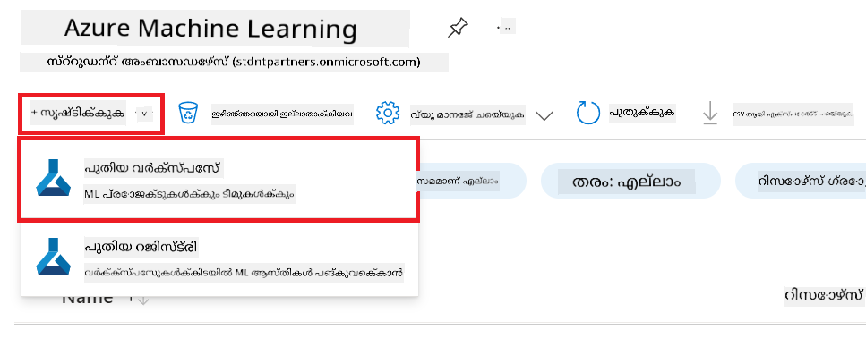

1. താഴെ കാണുന്ന പ്രവർത്തനങ്ങൾ നടത്തുക:

    - നിങ്ങളുടെ Azure **Subscription** തിരഞ്ഞെടുക്കുക.
    - ഉപയോഗിക്കാൻ **Resource group** തിരഞ്ഞെടുക്കുക (ആവശ്യമായെങ്കിൽ ഒരു പുതിയതുണ്ടാക്കുക).
    - **Workspace Name** ടൈപ്പ് ചെയ്യുക. അത് ഒരു യുണീക് മൂല്യം ആയിരിക്കണം.
    - നിങ്ങൾ ഉപയോഗിക്കാനാഗ്രഹിക്കുന്ന **Region** തിരഞ്ഞെടുക്കുക.
    - ഉപയോഗിക്കാൻ **Storage account** തിരഞ്ഞെടുക്കുക (ആവശ്യമായെങ്കിൽ ഒരു പുതിയതുണ്ടാക്കുക).
    - ഉപയോഗിക്കാൻ **Key vault** തിരഞ്ഞെടുക്കുക (ആവശ്യമായെങ്കിൽ ഒരു പുതിയതുണ്ടാക്കുക).
    - ഉപയോഗിക്കാൻ **Application insights** തിരഞ്ഞെടുക്കുക (ആവശ്യമുള്ള പക്ഷം പുതിയതുണ്ടാക്കുക).
    - ഉപയോഗിക്കാൻ **Container registry** തിരഞ്ഞെടുക്കുക (ആവശ്യമുള്ള പക്ഷം പുതിയതുണ്ടാക്കുക).

    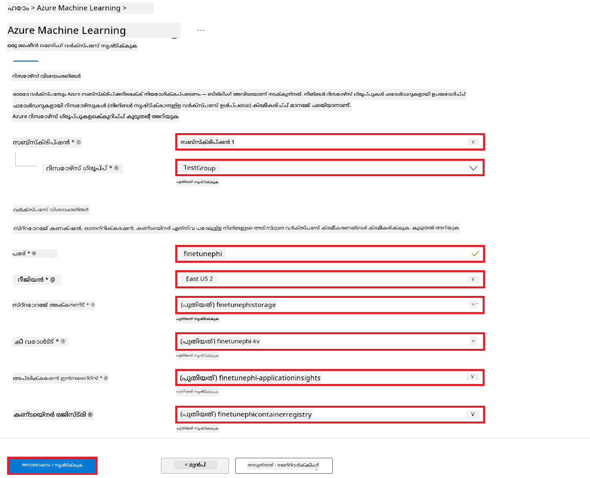

1. **Review + Create** തിരഞ്ഞെടുക്കുക.

1. **Create** തിരഞ്ഞെടുക്കുക.

### Azure Subscription-ൽ GPU കോട്ട് അഭ്യർത്ഥിക്കുക

ഈ E2E സാമ്പിളിൽ ഫൈൻ-ട്യൂണിംഗിന് *Standard_NC24ads_A100_v4 GPU* ഉപയോഗിക്കും, അതിന് ഒരു കോട്ട് അഭ്യർത്ഥന ആവശ്യമുണ്ട്, യഥാർത്ഥ ഡിപ്പ്ലോയ്മെന്റിന് *Standard_E4s_v3* CPU ഉപയോഗിക്കാം, അതിന് കോട്ട് അഭ്യർത്ഥന ആവശ്യമില്ല.

> [!NOTE]
>
> Only Pay-As-You-Go subscriptions (the standard subscription type) are eligible for GPU allocation; benefit subscriptions are not currently supported.
>
> For those using benefit subscriptions (such as Visual Studio Enterprise Subscription) or those looking to quickly test the fine-tuning and deployment process, this tutorial also provides guidance for fine-tuning with a minimal dataset using a CPU. However, it is important to note that fine-tuning results are significantly better when using a GPU with larger datasets.

1. [Azure ML Studio](https://ml.azure.com/home?wt.mc_id=studentamb_279723) സന്ദർശിക്കുക.

1. *Standard NCADSA100v4 Family* കോട്ട് അഭ്യർത്ഥിക്കാൻ താഴെയുള്ള പ്രവർത്തനങ്ങൾ ചെയ്യുക:

    - ഇടത് വശത്തെ ടാബിൽ നിന്ന് **Quota** തിരഞ്ഞെടുക്കുക.
    - ഉപയോഗിക്കാൻ ഉദ്ദേശിക്കുന്ന **Virtual machine family** തിരഞ്ഞെടുക്കുക. ഉദാഹരണത്തിന്, *Standard NCADSA100v4 Family Cluster Dedicated vCPUs* തിരഞ്ഞെടുക്കുക, ഇതിൽ *Standard_NC24ads_A100_v4* GPU ഉൾപ്പെടുന്നു.
    - നാവിഗേഷൻ മനെുയിൽ നിന്ന് **Request quota** തിരഞ്ഞെടുക്കുക.

        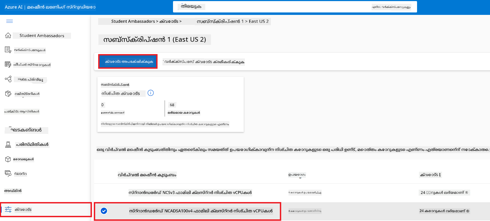

    - Request quota പേജിന്റെ ഉള്ളിൽ നിങ്ങൾ ഉപയോഗിക്കാൻ ആഗ്രഹിക്കുന്ന **New cores limit** നൽകുക. ഉദാഹരണത്തിന്, 24.
    - Request quota പേജിന്റെ ഉള്ളിൽ **Submit** തിരഞ്ഞെടുക്കുക GPU കോട്ട് അഭ്യർത്ഥിക്കാൻ.

> [!NOTE]
> നിങ്ങൾക്ക് ആവശ്യമായ GPU അല്ലെങ്കിൽ CPU തിരഞ്ഞെടുക്കുന്നതിനായി [Sizes for Virtual Machines in Azure](https://learn.microsoft.com/azure/virtual-machines/sizes/overview?tabs=breakdownseries%2Cgeneralsizelist%2Ccomputesizelist%2Cmemorysizelist%2Cstoragesizelist%2Cgpusizelist%2Cfpgasizelist%2Chpcsizelist) ഡോക്യുമെന്റ് കാണാവുന്നതാണ്.

### റോൾ അസൈൻമെന്റ് ചേർക്കുക

മോഡലുകൾ ഫൈൻ-ട്യൂൺ ചെയ്യാനും ഡിപ്പ്ലോയാക്കാനുമുള്ള അനുമതികൾ അനുവദിക്കാൻ നിങ്ങൾ ആദ്യം ഒരു User Assigned Managed Identity (UAI) സൃഷ്ടിച്ച് അതിനു അനുയോജ്യമായ അനുവാദങ്ങൾ ഓൺ ചെയ്‌തിരിക്കണം. ഡിപ്ലോയ്‌മെന്റിനിടെ authentication-ക്കായി ഈ UAI ഉപയോഗിക്കപ്പെടും.

#### User Assigned Managed Identity (UAI) സൃഷ്ടിക്കുക

1. പോർട്ടൽ പേജിന്റെ മുകളിൽ 있는 **search bar**-ൽ *managed identities* എന്ന് ടൈപ്പ് ചെയ്ത് കാണുന്ന ഓപ്ഷനുകളിൽ നിന്ന് **Managed Identities** തിരഞ്ഞെടുക്കുക.

    

1. **+ Create** തിരഞ്ഞെടുക്കുക.

    

1. താഴെ കാണുന്ന പ്രവർത്തനങ്ങൾ ചെയ്യുക:

    - നിങ്ങളുടെ Azure **Subscription** തിരഞ്ഞെടുക്കുക.
    - ഉപയോഗിക്കാൻ **Resource group** തിരഞ്ഞെടുക്കുക (ആവശ്യമായെങ്കിൽ ഒരു പുതിയതുണ്ടാക്കുക).
    - നിങ്ങൾ ഉപയോഗിക്കാനാഗ്രഹിക്കുന്ന **Region** തിരഞ്ഞെടുക്കുക.
    - **Name** നൽകുക. ഇത് ഒരു യുണീക് മൂല്യം ആയിരിക്കണം.

1. **Review + create** തിരഞ്ഞെടുക്കുക.

1. **+ Create** തിരഞ്ഞെടുക്കുക.

#### Managed Identity-ന് Contributor റോൾ അസൈൻമെന്റ് ചേർക്കുക

1. നിങ്ങൾ സൃഷ്ടിച്ച Managed Identity resource-ലേക്ക് നാവിഗേറ്റ് ചെയ്യുക.

1. ഇടത് വശത്തെ ടാബിൽ നിന്ന് **Azure role assignments** തിരഞ്ഞെടുക്കുക.

1. നാവിഗേഷൻ മെയ്നുവിൽ നിന്ന് **+Add role assignment** തിരഞ്ഞെടുക്കുക.

1. Add role assignment പേജിന്റെ ഉള്ളിൽ താഴെ കാട്ടിയിരിക്കുന്ന പ്രവർത്തനങ്ങൾ നിർവഹിക്കുക:
    - **Scope** ретінде **Resource group** തിരഞ്ഞെടുക്കുക.
    - നിങ്ങളുടെ Azure **Subscription** തിരഞ്ഞെടുക്കുക.
    - ഉപയോഗിക്കാൻ **Resource group** തിരഞ്ഞെടുക്കുക.
    - **Role** ആയി **Contributor** തിരഞ്ഞെടുക്കുക.

    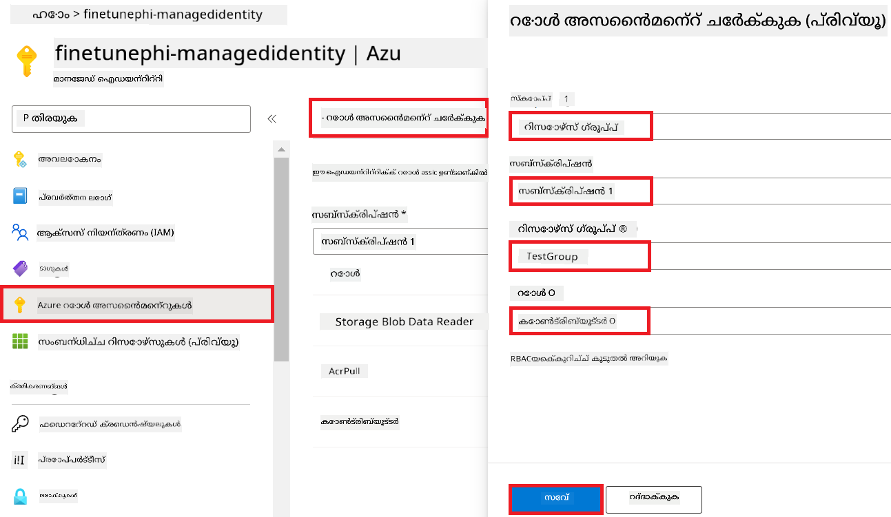

1. **Save** തിരഞ്ഞെടുക്കുക.

#### Managed Identity-ന് Storage Blob Data Reader റോൾ അസൈൻമെന്റ് ചേർക്കുക

1. പോർട്ടൽ പേജിന്റെ മുകളിൽ 있는 **search bar**-ൽ *storage accounts* എന്ന് ടൈപ്പ് ചെയ്ത് കാണുന്ന ഓപ്ഷനുകളിൽ നിന്ന് **Storage accounts** തിരഞ്ഞെടുക്കുക.

    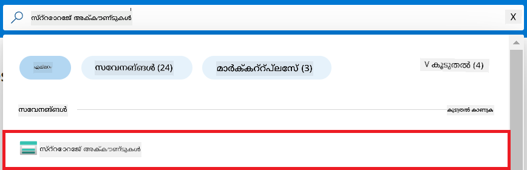

1. നിങ്ങൾ സൃഷ്ടിച്ച Azure Machine Learning വേർക്ക്സ്പേസുമായി ബന്ധപ്പെട്ട സ്റ്റോറേജ് അക്കൗണ്ട് തിരഞ്ഞെടുക്കുക. ഉദാഹരണത്തിന്, *finetunephistorage*.

1. Add role assignment പേജിലേക്ക് നാവിഗേറ്റ് ചെയ്യാൻ താഴെ കാണുന്ന പ്രവർത്തനങ്ങൾ നിർവഹിക്കുക:

    - നിങ്ങൾ സൃഷ്ടിച്ച Azure Storage അക്കൗണ്ടിലേക്ക് പോകുക.
    - ഇടത് വശത്തെ ടാബിൽ നിന്ന് **Access Control (IAM)** തിരഞ്ഞെടുക്കുക.
    - നാവിഗേഷൻ മെയ്നുവിൽ നിന്ന് **+ Add** തിരഞ്ഞെടുക്കുക.
    - നാവിഗേഷൻ മെയ്നുവിൽ നിന്ന് **Add role assignment** തിരഞ്ഞെടുക്കുക.

    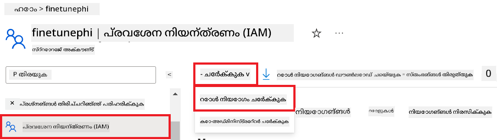

1. Add role assignment പേജിന്റെ ഉള്ളിൽ താഴെ കാണുന്ന പ്രവർത്തനങ്ങൾ നിർവഹിക്കുക:

    - Role പേജിനകം **search bar**-ൽ *Storage Blob Data Reader* ടൈപ്പ് ചെയ്ത് കാണുന്ന ഓപ്ഷനുകളിൽ നിന്നു് **Storage Blob Data Reader** തിരഞ്ഞെടുക്കുക.
    - Role പേജിൽ **Next** തിരഞ്ഞെടുക്കുക.
    - Members പേജിൽ **Assign access to** ആയി **Managed identity** തിരഞ്ഞെടുക്കുക.
    - Members പേജിൽ **+ Select members** തിരഞ്ഞെടുക്കുക.
    - Select managed identities പേജില്‍ നിങ്ങളുടെ Azure **Subscription** തിരഞ്ഞെടുക്കുക.
    - Select managed identities പേജിൽ **Managed identity** ടൈപ്പായി തിരഞ്ഞെടുക്കുക.
    - Select managed identities പേജിൽ നിങ്ങൾ സൃഷ്ടിച്ച Manage Identity തിരഞ്ഞെടുക്കുക. ഉദാഹരണത്തിന്, *finetunephi-managedidentity*.
    - Select managed identities പേജിൽ **Select** തിരഞ്ഞടുക്കുക.

    

1. **Review + assign** തിരഞ്ഞെടുക്കുക.

#### Managed Identity-ന് AcrPull റോൾ അസൈൻമെന്റ് ചേർക്കുക

1. പോർട്ടൽ പേജിന്റെ മുകളിൽ 있는 **search bar**-ൽ *container registries* എന്ന് ടൈപ്പ് ചെയ്ത് കാണുന്ന ഓപ്ഷനുകളിൽ നിന്ന് **Container registries** തിരഞ്ഞെടുക്കുക.

    

1. Azure Machine Learning വേർക്ക്സ്പേസുമായി ബന്ധപ്പെട്ട container registry തിരഞ്ഞെടുക്കുക. ഉദാഹരണത്തിന്, *finetunephicontainerregistries*

1. Add role assignment പേജിലേക്ക് നാവിഗേറ്റ് ചെയ്യാൻ താഴെ കാണുന്ന പ്രവർത്തനങ്ങൾ നിർവഹിക്കുക:

    - ഇടത് വശത്തെ ടാബിൽ നിന്ന് **Access Control (IAM)** തിരഞ്ഞെടുക്കുക.
    - നാവിഗേഷൻ മെയ്നുവിൽ നിന്ന് **+ Add** തിരഞ്ഞെടുക്കുക.
    - നാവിഗേഷൻ മെയ്നുവിൽ നിന്ന് **Add role assignment** തിരഞ്ഞെടുക്കുക.

1. Add role assignment പേജിന്റെ ഉള്ളിൽ താഴെ കാണുന്ന പ്രവർത്തനങ്ങൾ നിർവഹിക്കുക:

    - Role പേജിൽ **search bar**-ൽ *AcrPull* ടൈപ്പ് ചെയ്ത് കാണുന്ന ഓപ്ഷനുകളിൽ നിന്നു് **AcrPull** തിരഞ്ഞെടുക്കുക.
    - Role പേജിൽ **Next** തിരഞ്ഞെടുക്കുക.
    - Members പേജിൽ **Assign access to** ആയി **Managed identity** തിരഞ്ഞെടുക്കുക.
    - Members പേജിൽ **+ Select members** തിരഞ്ഞെടുക്കുക.
    - Select managed identities പേജിൽ നിങ്ങളുടെ Azure **Subscription** തിരഞ്ഞെടുക്കുക.
    - Select managed identities പേജിൽ **Managed identity** ആയി തിരഞ്ഞെടുക്കുക.
    - Select managed identities പേജിൽ നിങ്ങൾ സൃഷ്ടിച്ച Manage Identity തിരഞ്ഞെടുക്കുക. ഉദാഹരണത്തിന്, *finetunephi-managedidentity*.
    - Select managed identities പേജിൽ **Select** തിരഞ്ഞെടുക്കുക.
    - **Review + assign** തിരഞ്ഞെടുക്കുക.

### പ്രോജക്ട് സജ്ജമാക്കുക

ഇപ്പോൾ, നിങ്ങൾ ഒരു വർ‍ക്കിംഗ് ഫോൾഡർ സൃഷ്ടിച്ച് അതിൽ ഒരു virtual environment സ്ഥാപിച്ച് ഉപയോക്താക്കളുമായി ഇടപെടുകയും Azure Cosmos DB-ൽ സംഭരിച്ച ചാറ്റ് ചരിത്രം ഉപയോഗിച്ച് പ്രതികരണങ്ങൾ മെച്ചപ്പെടുത്തുകയും ചെയ്യുന്ന ഒരു പ്രോഗ്രാം വികസിപ്പിക്കാൻ തുടക്കം കുറിക്കും.

#### പ്രവർത്തിക്കാൻ വേണ്ടി ഒരു ഫോൾഡർ സൃഷ്ടിക്കുക

1. ഒരു ടെർമിനൽ വിൻഡോ തുറന്ന് ഡിഫോൾട്ട് പാത്തിൽ *finetune-phi* എന്ന നാമമുള്ള ഫോൾഡർ സൃഷ്ടിക്കാൻ താഴെ കാണുന്ന കമാൻഡ് ടൈപ്പ് ചെയ്യുക.

    ```console
    mkdir finetune-phi
    ```

1. നിങ്ങൾ സൃഷ്ടിച്ച *finetune-phi* ഫോൾഡറിലേക്ക് നാവിഗേറ്റ് ചെയ്യാൻ നിങ്ങളുടെ ടെർമിനലിൽ താഴെ കാണുന്ന കമാൻഡ് ടൈപ്പ് ചെയ്യുക.

    ```console
    cd finetune-phi
    ```

#### ഒരു വെർച്ച്വൽ എൻവയരൺമെന്റ് സൃഷ്ടിക്കുക

1. *.venv* എന്ന നാമമുള്ള ഒരു വെർച്ച്വൽ എൻവയരൺമെന്റ് സൃഷ്ടിക്കാൻ നിങ്ങളുടെ ടെർമിനലിൽ താഴെ കാണുന്ന കമാൻഡ് ടൈപ്പ് ചെയ്യുക.

    ```console
    python -m venv .venv
    ```

1. വെർച്ച്വൽ എൻവയരൺമെന്റ് സജീവമാക്കാൻ നിങ്ങളുടെ ടെർമിനലിൽ താഴെ കാണുന്ന കമാൻഡ് ടൈപ്പ് ചെയ്യുക.

    ```console
    .venv\Scripts\activate.bat
    ```

> [!NOTE]
>
> If it worked, you should see *(.venv)* before the command prompt.

#### ആവശ്യമായ പാക്കേജുകൾ ഇൻസ്റ്റാൾ ചെയ്യുക

1. ആവശ്യമായ പാക്കേജുകൾ ഇൻസ്റ്റാൾ ചെയ്യാൻ നിങ്ങളുടെ ടെർമിനലിൽ താഴെ കാണുന്ന കമാൻഡുകൾ ടൈപ്പ് ചെയ്യുക.

    ```console
    pip install datasets==2.19.1
    pip install transformers==4.41.1
    pip install azure-ai-ml==1.16.0
    pip install torch==2.3.1
    pip install trl==0.9.4
    pip install promptflow==1.12.0
    ```

#### പ്രോജക്ട് ഫയലുകൾ സൃഷ്ടിക്കുക
ഈ അഭ്യാസത്തിൽ, ഞങ്ങൾന്റെ പ്രോജക്ട് ഉപയോഗിക്കാൻ ആവശ്യമായ അടിസ്ഥാന ഫയലുകൾ നിങ്ങൾ സൃഷ്ടിക്കും. ഈ ഫയലുകളിൽ ഡാറ്റാസെറ്റ് ഡൗൺലോഡ് ചെയ്യാനുള്ള സ്ക്രിപ്റ്റുകൾ, Azure Machine Learning പരിസ്ഥിതി സജ്ജമാക്കാനുള്ള ഫയലുകൾ, Phi-3 മോഡൽ ഫൈൻ-ട്യൂൺ ചെയ്യാനുള്ള ഫയലുകൾ, ഫൈൻ-ട്യൂൺ ചെയ്ത മോഡൽ ഡിപ്പ്ലോയുചെയ്യാനുള്ള ഫയലുകൾ എന്നിവ ഉൾപ്പെടുന്നു. ഫൈൻ-ട്യൂണിംഗിന് ആവശ്യമായ പരിസ്ഥിതി സജ്ജമാക്കാൻ ഒരു *conda.yml* ഫയൽ നിങ്ങൾ സൃഷ്ടിക്കും.

ഈ അഭ്യാസത്തിൽ, നിങ്ങൾ ചെയ്യേണ്ടത്:

- *download_dataset.py* ഫയൽ സൃഷ്ടിച്ച് ഡാറ്റാസെറ്റ് ഡൗൺലോഡ് ചെയ്യുക.
- *setup_ml.py* ഫയൽ സൃഷ്ടിച്ച് Azure Machine Learning പരിസ്ഥിതി സജ്ജമാക്കുക.
- *finetuning_dir* ഫോൾഡറിനുള്ളിൽ *fine_tune.py* ഫയൽ സൃഷ്ടിച്ച് ഈ ഡാറ്റാസെറ്റ് ഉപയോഗിച്ച് Phi-3 മോഡൽ ഫൈൻ-ട്യൂൺ ചെയ്യുക.
- ഫൈൻ-ട്യൂണിംഗ് പരിസ്ഥിതി സജ്ജമാക്കാൻ *conda.yml* ഫയൽ സൃഷ്ടിക്കുക.
- ഫൈൻ-ട്യൂൺ ചെയ്ത മോഡൽ ഡിപ്പ്ലോയുചെയ്യാൻ *deploy_model.py* ഫയൽ സൃഷ്ടിക്കുക.
- ഫൈൻ-ട്യൂൺ ചെയ്ത മോഡൽ Prompt flow-ലോട് ഇന്റഗ്രേറ്റ് ചെയ്യുകയും മോഡൽ Prompt flow ഉപയോഗിച്ച് പ്രവർത്തിപ്പിക്കുകയും ചെയ്യാൻ *integrate_with_promptflow.py* ഫയൽ സൃഷ്ടിക്കുക.
- Prompt flow-നുള്ള പ്രവൃത്തി പ്രവാഹ ഘടന സജ്ജമാക്കാൻ flow.dag.yml ഫയൽ സൃഷ്ടിക്കുക.
- Azure വിവരങ്ങൾ ഉൾപ്പെടുത്താൻ *config.py* ഫയൽ സൃഷ്ടിക്കുക.

> [!NOTE]
>
> പൂർത്തിയായ ഫോൾഡർ ഘടന:
>
> ```text
> └── YourUserName
> .    └── finetune-phi
> .        ├── finetuning_dir
> .        │      └── fine_tune.py
> .        ├── conda.yml
> .        ├── config.py
> .        ├── deploy_model.py
> .        ├── download_dataset.py
> .        ├── flow.dag.yml
> .        ├── integrate_with_promptflow.py
> .        └── setup_ml.py
> ```

1. **Visual Studio Code** തുറക്കുക.

1. മെനു ബാറിൽ നിന്നു **File** തിരഞ്ഞെടുക്കുക.

1. **Open Folder** തിരഞ്ഞെടുക്കുക.

1. നിങ്ങൾ സൃഷ്ടിച്ച *finetune-phi* ഫോൾഡർ തിരഞ്ഞെടുക്കുക, ഇത് സ്ഥിതിചെയ്യുന്നു *C:\Users\yourUserName\finetune-phi*.

    

1. Visual Studio Code-ന്റെ ഇടതു പേനിലിൽ, റൈറ്റ്-ക്ലിക്ക് ചെയ്ത് **New File** തെരഞ്ഞെടുക്കുകയും *download_dataset.py* എന്ന പേരിൽ ഒരു പുതിയ ഫയൽ സൃഷ്ടിക്കുകയും ചെയ്യുക.

1. Visual Studio Code-ന്റെ ഇടതു പേനിലിൽ, റൈറ്റ്-ക്ലിക്ക് ചെയ്ത് **New File** തെരഞ്ഞെടുത്ത് *setup_ml.py* എന്ന പേരിൽ ഒരു പുതിയ ഫയൽ സൃഷ്ടിക്കുക.

1. Visual Studio Code-ന്റെ ഇടതു പേനിലിൽ, റൈറ്റ്-ക്ലിക്ക് ചെയ്ത് **New File** തെരഞ്ഞെടുത്ത് *deploy_model.py* എന്ന പേരിൽ ഒരു പുതിയ ഫയൽ സൃഷ്ടിക്കുക.

    

1. Visual Studio Code-ന്റെ ഇടതു പേനിലിൽ, റൈറ്റ്-ക്ലിക്ക് ചെയ്ത് **New Folder** തെരഞ്ഞെടുത്ത് *finetuning_dir* എന്ന പേരിൽ പുതിയ ഒരു ഫോൾഡർ സൃഷ്ടിക്കുക.

1. *finetuning_dir* ഫോൾഡറിന്റെ ഉള്ളിൽ, *fine_tune.py* എന്ന പേരിൽ ഒരു പുതിയ ഫയൽ സൃഷ്ടിക്കുക.

#### Create and Configure *conda.yml* file

1. Visual Studio Code-ന്റെ ഇടതു പേനിലിൽ, റൈറ്റ്-ക്ലിക്ക് ചെയ്ത് **New File** തെരഞ്ഞെടുത്ത് *conda.yml* എന്ന പേരിൽ ഒരു പുതിയ ഫയൽ സൃഷ്ടിക്കുക.

1. *conda.yml* ഫയലിലേക്ക് Phi-3 മോഡലിന്റെ ഫൈൻ-ട്യൂണിംഗിന് ആവശ്യമായ പരിസ്ഥിതി സജ്ജമാക്കാൻ താഴെയുള്ള കോഡ് ചേർക്കുക.

    ```yml
    name: phi-3-training-env
    channels:
      - defaults
      - conda-forge
    dependencies:
      - python=3.10
      - pip
      - numpy<2.0
      - pip:
          - torch==2.4.0
          - torchvision==0.19.0
          - trl==0.8.6
          - transformers==4.41
          - datasets==2.21.0
          - azureml-core==1.57.0
          - azure-storage-blob==12.19.0
          - azure-ai-ml==1.16
          - azure-identity==1.17.1
          - accelerate==0.33.0
          - mlflow==2.15.1
          - azureml-mlflow==1.57.0
    ```

#### Create and Configure *config.py* file

1. Visual Studio Code-ന്റെ ഇടതു പേനിലിൽ, റൈറ്റ്-ക്ലിക്ക് ചെയ്ത് **New File** തെരഞ്ഞെടുത്ത് *config.py* എന്ന പേരിൽ ഒരു പുതിയ ഫയൽ സൃഷ്ടിക്കുക.

1. നിങ്ങളുടെ Azure വിവരങ്ങൾ ഉൾപ്പെടുത്താൻ *config.py* ഫയലിലേക്ക് താഴെയുള്ള കോഡ് ചേർക്കുക.

    ```python
    # അസ്യൂർ ക്രമീകരണങ്ങൾ
    AZURE_SUBSCRIPTION_ID = "your_subscription_id"
    AZURE_RESOURCE_GROUP_NAME = "your_resource_group_name" # "TestGroup"

    # അസ്യൂർ മെഷീൻ ലേണിംഗ് ക്രമീകരണങ്ങൾ
    AZURE_ML_WORKSPACE_NAME = "your_workspace_name" # "finetunephi-workspace"

    # അസ്യൂർ മാനേജഡ് ഐഡന്റിറ്റി ക്രമീകരണങ്ങൾ
    AZURE_MANAGED_IDENTITY_CLIENT_ID = "your_azure_managed_identity_client_id"
    AZURE_MANAGED_IDENTITY_NAME = "your_azure_managed_identity_name" # "finetune-phi-mangedidentity"
    AZURE_MANAGED_IDENTITY_RESOURCE_ID = f"/subscriptions/{AZURE_SUBSCRIPTION_ID}/resourceGroups/{AZURE_RESOURCE_GROUP_NAME}/providers/Microsoft.ManagedIdentity/userAssignedIdentities/{AZURE_MANAGED_IDENTITY_NAME}"

    # ഡാറ്റാസെറ്റ് ഫയൽ പാതകൾ
    TRAIN_DATA_PATH = "data/train_data.jsonl"
    TEST_DATA_PATH = "data/test_data.jsonl"

    # ഫൈൻ-ട്യൂൺ ചെയ്ത മോഡൽ ക്രമീകരണങ്ങൾ
    AZURE_MODEL_NAME = "your_fine_tuned_model_name" # "finetune-phi-model"
    AZURE_ENDPOINT_NAME = "your_fine_tuned_model_endpoint_name" # "finetune-phi-endpoint"
    AZURE_DEPLOYMENT_NAME = "your_fine_tuned_model_deployment_name" # "finetune-phi-deployment"

    AZURE_ML_API_KEY = "your_fine_tuned_model_api_key"
    AZURE_ML_ENDPOINT = "your_fine_tuned_model_endpoint_uri" # "https://{your-endpoint-name}.{your-region}.inference.ml.azure.com/score"
    ```

#### Azure പരിസ്ഥിതി വ്യത്യസ്തങ്ങൾ ചേർക്കുക

1. Azure Subscription ID ചേർക്കാൻ താഴെയുള്ള നടപടിക്രമങ്ങൾ ചെയ്യുക:

    - പോർട്ടൽ പേജിന്റെ മുകളിലുള്ള **search bar**-ലിൽ *subscriptions* ടൈപ്പ് ചെയ്ത് പ്രദർശിതമായ ഓപ്ഷനുകളിൽ നിന്നു **Subscriptions** തിരഞ്ഞെടുക്കുക.
    - നിങ്ങൾ ഇപ്പോൾ ഉപയോഗിക്കുന്ന Azure Subscription തിരഞ്ഞെടുക്കുക.
    - നിങ്ങളുടെ Subscription ID ಅನ್ನು *config.py* ഫയലിലേക്ക് കോപ്പി ചെയ്ത് പേസ്റ്റ് ചെയ്യുക.

    

1. Azure Workspace Name ചേർക്കാൻ താഴെയുള്ള നടപടിക്രമങ്ങൾ ചെയ്യുക:

    - നിങ്ങൾ സൃഷ്ടിച്ച Azure Machine Learning റിസോഴ്സ് തുറക്കുക.
    - നിങ്ങളുടെ അക്കൗണ്ട് പേര് *config.py* ഫയലിലേക്ക് കോപ്പി ചെയ്ത് പേസ്റ്റുചെയ്യുക.

    

1. Azure Resource Group Name ചേർക്കാൻ താഴെയുള്ള നടപടിക്രമങ്ങൾ ചെയ്യുക:

    - നിങ്ങൾ സൃഷ്ടിച്ച Azure Machine Learning റിസോഴ്സ് തുറക്കുക.
    - നിങ്ങളുടെ Azure Resource Group Name *config.py* ഫയലിലേക്ക് കോപ്പി ചെയ്ത് പേസ്റ്റുചെയ്യുക.

    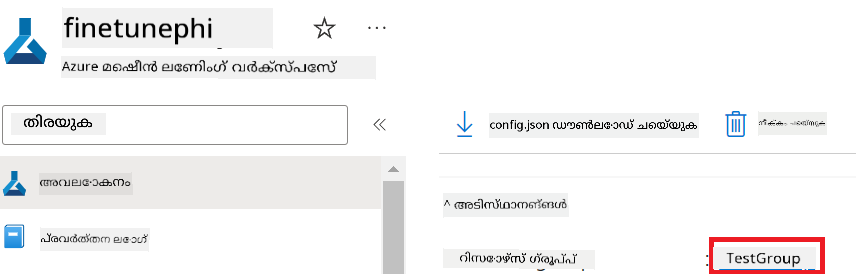

2. Azure Managed Identity name ചേർക്കാൻ താഴെയുള്ള നടപടിക്രമങ്ങൾ ചെയ്യുക:

    - നിങ്ങൾ സൃഷ്ടിച്ച Managed Identities റിസോഴ്സ് തിരയുക.
    - നിങ്ങളുടെ Azure Managed Identity name *config.py* ഫയലിലേക്ക് കോപ്പി ചെയ്ത് പേസ്റ്റുചെയ്യുക.

    

### ഫൈൻ-ട്യൂണിംഗിനായി ഡാറ്റാസെറ്റ് തയ്യാറാക്കുക

ഈ അഭ്യാസത്തിൽ, നിങ്ങൾ *download_dataset.py* ഫയൽ പ്രവർത്തിപ്പിച്ച് *ULTRACHAT_200k* ഡാറ്റാസെറ്റുകൾ നിങ്ങളുടെ പ്രാദേശിക പരിസ്ഥിതിയിൽ ഡൗൺലോഡ് ചെയ്യും. തുടർന്ന് ഈ ഡാറ്റാസെറ്റുകൾ Azure Machine Learning-ൽ Phi-3 മോഡൽ ഫൈൻ-ട്യൂൺ ചെയ്യാൻ ഉപയോഗിക്കും.

#### *download_dataset.py* ഉപയോഗിച്ച് നിങ്ങളുടെ ഡാറ്റാസെറ്റ് ഡൗൺലോഡ് ചെയ്യുക

1. Visual Studio Code-ൽ *download_dataset.py* ഫയൽ തുറക്കുക.

1. *download_dataset.py* ഫയലിലേക്കു താഴെയുള്ള കോഡ് ചേർക്കുക.

    ```python
    import json
    import os
    from datasets import load_dataset
    from config import (
        TRAIN_DATA_PATH,
        TEST_DATA_PATH)

    def load_and_split_dataset(dataset_name, config_name, split_ratio):
        """
        Load and split a dataset.
        """
        # നിർദ്ദേശിച്ച പേര്, കോൺഫിഗറേഷൻ, സ്പ്ലിറ്റ് അനുപാതം ഉപയോഗിച്ച് ഡാറ്റാസെറ്റ് ലോഡ് ചെയ്യുക
        dataset = load_dataset(dataset_name, config_name, split=split_ratio)
        print(f"Original dataset size: {len(dataset)}")
        
        # ഡാറ്റാസെറ്റ് ട്രെയിൻ અને ടെസ്റ്റ് സെറ്റുകളായി വിഭജിക്കുക (80% ട്രെയിൻ, 20% ടെസ്റ്റ്)
        split_dataset = dataset.train_test_split(test_size=0.2)
        print(f"Train dataset size: {len(split_dataset['train'])}")
        print(f"Test dataset size: {len(split_dataset['test'])}")
        
        return split_dataset

    def save_dataset_to_jsonl(dataset, filepath):
        """
        Save a dataset to a JSONL file.
        """
        # ഡയറക്ടറി നിലവിലില്ലെങ്കിൽ അത് സൃഷ്ടിക്കുക
        os.makedirs(os.path.dirname(filepath), exist_ok=True)
        
        # ഫയൽ എഴുത്ത് മോഡിൽ തുറക്കുക
        with open(filepath, 'w', encoding='utf-8') as f:
            # ഡാറ്റാസെറ്റിലെ ഓരോ റെക്കോർഡിലും സഞ്ചരിക്കുക
            for record in dataset:
                # റെക്കോർഡിനെ JSON ഒബ്ജക്ടായി രൂപാന്തരിച്ച് ഫയലിൽ എഴുതുക
                json.dump(record, f)
                # രേഖകൾ വേർതിരിക്കാൻ ഒരു പുതിയ വരി ചിഹ്നം എഴുതുക
                f.write('\n')
        
        print(f"Dataset saved to {filepath}")

    def main():
        """
        Main function to load, split, and save the dataset.
        """
        # ഒരു പ്രത്യേക കോൺഫിഗറേഷൻയും സ്പ്ലിറ്റ് അനുപാതവും ഉപയോഗിച്ച് ULTRACHAT_200k ഡാറ്റാസെറ്റ് ലോഡ് ചെയ്ത് വിഭജിക്കുക
        dataset = load_and_split_dataset("HuggingFaceH4/ultrachat_200k", 'default', 'train_sft[:1%]')
        
        # സ്പ്ലിറ്റിൽ നിന്ന് ട്രെയിൻ மற்றும் ടെസ്റ്റ് ഡാറ്റാസെറ്റുകൾ എടുത്തെടുക്കുക
        train_dataset = dataset['train']
        test_dataset = dataset['test']

        # ട്രെയിൻ ഡാറ്റാസെറ്റ് JSONL ഫയലായി സംരക്ഷിക്കുക
        save_dataset_to_jsonl(train_dataset, TRAIN_DATA_PATH)
        
        # ടെസ്റ്റ് ഡാറ്റാസെറ്റ് വേറെ ഒരു JSONL ഫയലായി സംരക്ഷിക്കുക
        save_dataset_to_jsonl(test_dataset, TEST_DATA_PATH)

    if __name__ == "__main__":
        main()

    ```

> [!TIP]
>
> **CPU ഉപയോഗിച്ച് കുറഞ്ഞ ഡാറ്റാസെറ്റോടെ ഫൈൻ-ട്യൂണിംഗിന് മാർഗ്ദർശനം**
>
> നിങ്ങൾക്ക് CPU ഉപയോഗിച്ച് ഫൈൻ-ട്യൂൺ ചെയ്യാൻ ആഗ്രഹമാണെങ്കിൽ, ഈ സമീപനം Visual Studio Enterprise Subscription പോലുള്ള ബenefit subscriptions ഉള്ളവർക്ക് അല്ലെങ്കിൽ ഫൈനറ്റ്യൂൺ, ഡിപ്പ്ലോയ്മെന്റ് പ്രക്രിയ പെട്ടെന്ന് പരീക്ഷിക്കാൻ അനുയോജ്യമാണ്.
>
> `dataset = load_and_split_dataset("HuggingFaceH4/ultrachat_200k", 'default', 'train_sft[:1%]')` എന്നത് `dataset = load_and_split_dataset("HuggingFaceH4/ultrachat_200k", 'default', 'train_sft[:10]')` എന്നതോടെ മാറ്റുക
>

1. സ്ക്രിപ്റ്റ് പ്രവർത്തിപ്പിച്ച് ഡാറ്റാസെറ്റ് നിങ്ങളുടെ ലോക്കൽ പരിസ്ഥിതിയിൽ ഡൗൺലോഡ് ചെയ്യാൻ ടർമിനലിൽ താഴെയുള്ള കമാൻഡ് ടൈപ് ചെയ്യുക.

    ```console
    python download_data.py
    ```

1. ഡാറ്റാസെറ്റുകൾ വിജയകരമായി നിങ്ങളുടെ ലോക്കൽ *finetune-phi/data* ഡയറക്ടറിയിലേക്ക് സേവ് ചെയ്തിട്ടുണ്ടോ എന്ന് പരിശോധന നടത്തുക.

> [!NOTE]
>
> **ഡാറ്റാസെറ്റിന്റെ വലുപ്പവും ഫൈൻ-ട്യൂണിംഗിനുള്ള സമയം**
>
> ഈ E2E സാംപിളിൽ, നിങ്ങൾ ഡാറ്റാസെറ്റിന്റെ അങ്ങിനെ 1% മാത്രം (`train_sft[:1%]`) ഉപയോഗിക്കുന്നു. ഇത് ഡാറ്റയുടെ അളവ് ഗണ്യോതരം കുറയ്ക്കുന്നു, അപ്രകാരമുള്ള അപ്ലോഡ് ചെയ്യലും ഫൈൻ-ട്യൂണിംഗ് പ്രക്രിയയും വേഗത്തിൽ പൂർത്തിയാകുന്നു. നിങ്ങൾക്ക് ട്രെയ്ബിംഗ് സമയവും മോഡൽ പ്രകടനവുമായി ശരിയായ തുല്യമാനം കണ്ടെത്താൻ ശതമാനം ക്രമീകരിക്കാവുന്നതാണ്. ഡാറ്റാസെറ്റിന്റെ ചെറിയ ഉപസെറ്റ് ഉപയോഗിക്കുന്നത് ഫൈൻ-ട്യൂണിംഗിന് ആവശ്യമായ സമയം കുറയ്ക്കുന്നു, ഈ E2E സാംപിളിന് പ്രക്രിയ കൈകാര്യം ചെയ്യാൻ എളുപ്പമാക്കുന്നു.

## ദൃശ്യം 2: Phi-3 മോഡൽ ഫൈൻ-ട്യൂൺ ചെയ്ത് Azure Machine Learning Studioയിൽ ഡിപ്പ്ലോയ് ചെയ്യുക

### Azure CLI സജ്ജമാക്കുക

താങ്കൾക്ക് നിങ്ങളുടെ പരിസ്ഥിതി അംഗീകാരം നൽകാൻ Azure CLI സജ്ജമാക്കേണ്ടതാണ്. Azure CLI നിങ്ങളുടെ Azure റিসോഴ്സുകൾ കമാൻഡ് ലൈൻ വഴിയേ നിയന്ത്രിക്കാൻ സഹായിക്കുന്നു കൂടാതെ Azure Machine Learning ഈ റിസോഴ്സുകൾ ആക്സസ് ചെയ്യാൻ ആവശ്യമായ ക്രെഡൻഷ്യലുകൾ നൽകുന്നു. തുടങ്ങാൻ [Azure CLI](https://learn.microsoft.com/cli/azure/install-azure-cli) ഇൻസ്റ്റാൾ ചെയ്യുക.

1. ഒരു ടർമിനൽ വിൻഡോ തുറന്ന് നിങ്ങളുടെ Azure അക്കൗണ്ടിലേക്ക് ലോഗിൻ ചെയ്യാൻ താഴെയുള്ള കമാൻഡ് ടൈപ് ചെയ്യുക.

    ```console
    az login
    ```

1. നിങ്ങളുടെ ഉപയോഗിക്കാനുദ്ദേശമുള്ള Azure അക്കൗണ്ട് തിരഞ്ഞെടുക്കുക.

1. നിങ്ങളുടെ ഉപയോഗിക്കാനുദ്ദേശമുള്ള Azure subscription തിരഞ്ഞെടുക്കുക.

    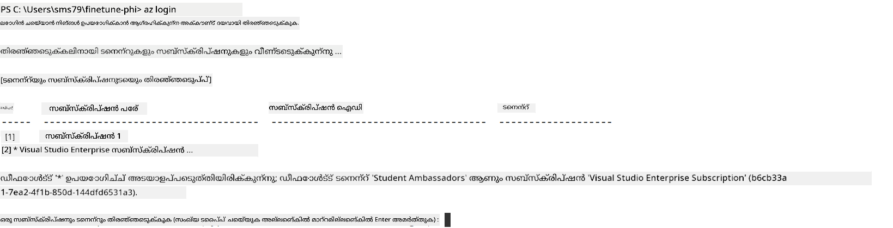

> [!TIP]
>
> Azure-ലിൽ സൈൻ ഇൻ ചെയ്യുന്നതിൽ പ്രശ്നമുണ്ടെങ്കിൽ, ഒരു ഡിവൈസ് കോഡ് ഉപയോഗിച്ച് ശ്രമിക്കുക. നിങ്ങളുടെ Azure അക്കൗണ്ടിലേക്ക് സൈൻ ഇൻ ചെയ്യാൻ ടർമിനൽ വിൻഡോ തുറന്ന് താഴെയുള്ള കമാൻഡ് ടൈപ് ചെയ്യുക:
>
> ```console
> az login --use-device-code
> ```
>

### Phi-3 മോഡൽ ഫൈൻ-ട്യൂൺ ചെയ്യുക

ഈ അഭ്യാസത്തിൽ, നിങ്ങൾ നൽകിയ ഡാറ്റാസെറ്റ് ഉപയോഗിച്ച് Phi-3 മോഡൽ ഫൈൻ-ട്യൂൺ ചെയ്യും. ആദ്യം, *fine_tune.py* ഫയലിൽ ഫൈൻ-ട്യൂണിംഗ് പ്രക്രിയ നിർവചിക്കും. പിന്നീട് Azure Machine Learning പരിസ്ഥിതി കോൺഫിഗർ ചെയ്യുകയും ഫൈൻ-ട്യൂണിംഗ് പ്രക്രിയ ആരംഭിക്കുന്നതിനായി *setup_ml.py* ഫയൽ പ്രവർത്തിപ്പിക്കുകയും ചെയ്യും. ഈ സ്ക്രിപ്റ്റ് ഫൈൻ-ട്യൂണിംഗ് Azure Machine Learning പരിസ്ഥിതിയിൽ നടക്കുമെന്ന് ഉറപ്പാക്കുന്നു.

*setup_ml.py* പ്രവർത്തിപ്പിക്കുന്നത് കൊണ്ട് നിങ്ങളുടെ ഫൈൻ-ട്യൂണിംഗ് പ്രക്രിയ Azure Machine Learning പരിസ്ഥിതിയിൽ നടത്തപ്പെടും.

#### *fine_tune.py* ഫയലിൽ കോഡ് ചേർക്കുക

1. *finetuning_dir* ഫോൾഡറിലേക്ക് പോകുക এবং Visual Studio Code-ൽ *fine_tune.py* ഫയൽ തുറക്കുക.

1. *fine_tune.py* ഫയലിലേക്ക് താഴെയുള്ള കോഡ് ചേർക്കുക.

    ```python
    import argparse
    import sys
    import logging
    import os
    from datasets import load_dataset
    import torch
    import mlflow
    from transformers import AutoModelForCausalLM, AutoTokenizer, TrainingArguments
    from trl import SFTTrainer

    # MLflow-ൽ INVALID_PARAMETER_VALUE പിശക് ഒഴിവാക്കാൻ MLflow സംയോജനം അപ്രാപ്തമാക്കുക
    os.environ["DISABLE_MLFLOW_INTEGRATION"] = "True"

    # ലോഗിംഗ് ക്രമീകരണം
    logging.basicConfig(
        format="%(asctime)s - %(levelname)s - %(name)s - %(message)s",
        datefmt="%Y-%m-%d %H:%M:%S",
        handlers=[logging.StreamHandler(sys.stdout)],
        level=logging.WARNING
    )
    logger = logging.getLogger(__name__)

    def initialize_model_and_tokenizer(model_name, model_kwargs):
        """
        Initialize the model and tokenizer with the given pretrained model name and arguments.
        """
        model = AutoModelForCausalLM.from_pretrained(model_name, **model_kwargs)
        tokenizer = AutoTokenizer.from_pretrained(model_name)
        tokenizer.model_max_length = 2048
        tokenizer.pad_token = tokenizer.unk_token
        tokenizer.pad_token_id = tokenizer.convert_tokens_to_ids(tokenizer.pad_token)
        tokenizer.padding_side = 'right'
        return model, tokenizer

    def apply_chat_template(example, tokenizer):
        """
        Apply a chat template to tokenize messages in the example.
        """
        messages = example["messages"]
        if messages[0]["role"] != "system":
            messages.insert(0, {"role": "system", "content": ""})
        example["text"] = tokenizer.apply_chat_template(
            messages, tokenize=False, add_generation_prompt=False
        )
        return example

    def load_and_preprocess_data(train_filepath, test_filepath, tokenizer):
        """
        Load and preprocess the dataset.
        """
        train_dataset = load_dataset('json', data_files=train_filepath, split='train')
        test_dataset = load_dataset('json', data_files=test_filepath, split='train')
        column_names = list(train_dataset.features)

        train_dataset = train_dataset.map(
            apply_chat_template,
            fn_kwargs={"tokenizer": tokenizer},
            num_proc=10,
            remove_columns=column_names,
            desc="Applying chat template to train dataset",
        )

        test_dataset = test_dataset.map(
            apply_chat_template,
            fn_kwargs={"tokenizer": tokenizer},
            num_proc=10,
            remove_columns=column_names,
            desc="Applying chat template to test dataset",
        )

        return train_dataset, test_dataset

    def train_and_evaluate_model(train_dataset, test_dataset, model, tokenizer, output_dir):
        """
        Train and evaluate the model.
        """
        training_args = TrainingArguments(
            bf16=True,
            do_eval=True,
            output_dir=output_dir,
            eval_strategy="epoch",
            learning_rate=5.0e-06,
            logging_steps=20,
            lr_scheduler_type="cosine",
            num_train_epochs=3,
            overwrite_output_dir=True,
            per_device_eval_batch_size=4,
            per_device_train_batch_size=4,
            remove_unused_columns=True,
            save_steps=500,
            seed=0,
            gradient_checkpointing=True,
            gradient_accumulation_steps=1,
            warmup_ratio=0.2,
        )

        trainer = SFTTrainer(
            model=model,
            args=training_args,
            train_dataset=train_dataset,
            eval_dataset=test_dataset,
            max_seq_length=2048,
            dataset_text_field="text",
            tokenizer=tokenizer,
            packing=True
        )

        train_result = trainer.train()
        trainer.log_metrics("train", train_result.metrics)

        mlflow.transformers.log_model(
            transformers_model={"model": trainer.model, "tokenizer": tokenizer},
            artifact_path=output_dir,
        )

        tokenizer.padding_side = 'left'
        eval_metrics = trainer.evaluate()
        eval_metrics["eval_samples"] = len(test_dataset)
        trainer.log_metrics("eval", eval_metrics)

    def main(train_file, eval_file, model_output_dir):
        """
        Main function to fine-tune the model.
        """
        model_kwargs = {
            "use_cache": False,
            "trust_remote_code": True,
            "torch_dtype": torch.bfloat16,
            "device_map": None,
            "attn_implementation": "eager"
        }

        # പ്രീട്രെയിൻ ചെയ്ത മോഡൽ നാമം = "microsoft/Phi-3-mini-4k-instruct"
        pretrained_model_name = "microsoft/Phi-3.5-mini-instruct"

        with mlflow.start_run():
            model, tokenizer = initialize_model_and_tokenizer(pretrained_model_name, model_kwargs)
            train_dataset, test_dataset = load_and_preprocess_data(train_file, eval_file, tokenizer)
            train_and_evaluate_model(train_dataset, test_dataset, model, tokenizer, model_output_dir)

    if __name__ == "__main__":
        parser = argparse.ArgumentParser()
        parser.add_argument("--train-file", type=str, required=True, help="Path to the training data")
        parser.add_argument("--eval-file", type=str, required=True, help="Path to the evaluation data")
        parser.add_argument("--model_output_dir", type=str, required=True, help="Directory to save the fine-tuned model")
        args = parser.parse_args()
        main(args.train_file, args.eval_file, args.model_output_dir)

    ```

1. *fine_tune.py* ഫയൽ സേവ് ചെയ്ത് അടയ്ക്കുക.

> [!TIP]
> **Phi-3.5 മോഡൽ ഫൈൻ-ട്യൂൺ ചെയ്യാം**
>
> *fine_tune.py* ഫയലിൽ, `pretrained_model_name`-നെ `"microsoft/Phi-3-mini-4k-instruct"` എന്നതിൽ നിന്നും നിങ്ങൾ എളുപ്പത്തിൽ ഇഷ്ടമുള്ളവയിൽ മാറ്റാം. ഉദാഹരണത്തിന്, അതിനെ `"microsoft/Phi-3.5-mini-instruct"` ആയി മാറ്റുന്നതിലൂടെ Phi-3.5-mini-instruct മോഡൽ ഫൈൻ-ട്യൂൺ ചെയ്യും. നിങ്ങൾക്ക് ഉപയോഗിക്കാനിഷ്ടമുള്ള മോഡൽ നാമം കണ്ടെത്താൻ [Hugging Face](https://huggingface.co/) സന്ദർശിച്ച് അനുയോജ്യമായ മോഡൽ തിരഞ്ഞെടുത്ത് അതിന്റെ നാമം `pretrained_model_name` ഫീൽഡിലേക്ക് കോപ്പി പേസ്റ്റ് ചെയ്യുക.
>
> :::image type="content" source="../../imgs/03/FineTuning-PromptFlow/finetunephi3.5.png" alt-text="Phi-3.5-നെ ഫൈൻ-ട്യൂൺ ചെയ്യുക.":::
>

#### *setup_ml.py* ഫയലിൽ കോഡ് ചേർക്കുക

1. Visual Studio Code-ൽ *setup_ml.py* ഫയൽ തുറക്കുക.

1. *setup_ml.py* ഫയലിലേക്ക് താഴെയുള്ള കോഡ് ചേർക്കുക.

    ```python
    import logging
    from azure.ai.ml import MLClient, command, Input
    from azure.ai.ml.entities import Environment, AmlCompute
    from azure.identity import AzureCliCredential
    from config import (
        AZURE_SUBSCRIPTION_ID,
        AZURE_RESOURCE_GROUP_NAME,
        AZURE_ML_WORKSPACE_NAME,
        TRAIN_DATA_PATH,
        TEST_DATA_PATH
    )

    # സ്ഥിരങ്ങൾ

    # പരിശീലനത്തിന് CPU ഇൻസ്റ്റൻസ് ഉപയോഗിക്കാൻ താഴെ ഉള്ള വരികളിലെ കമന്റുകൾ നീക്കം ചെയ്യുക
    # COMPUTE_INSTANCE_TYPE = "Standard_E16s_v3" # സി.പി.യു
    # COMPUTE_NAME = "cpu-e16s-v3"
    # DOCKER_IMAGE_NAME = "mcr.microsoft.com/azureml/openmpi4.1.0-ubuntu20.04:latest"

    # പരിശീലനത്തിന് GPU ഇൻസ്റ്റൻസ് ഉപയോഗിക്കാൻ താഴെ ഉള്ള വരികളിലെ കമന്റുകൾ നീക്കം ചെയ്യുക
    COMPUTE_INSTANCE_TYPE = "Standard_NC24ads_A100_v4"
    COMPUTE_NAME = "gpu-nc24s-a100-v4"
    DOCKER_IMAGE_NAME = "mcr.microsoft.com/azureml/curated/acft-hf-nlp-gpu:59"

    CONDA_FILE = "conda.yml"
    LOCATION = "eastus2" # നിങ്ങളുടെ കമ്പ്യൂട്ട് ക്ലസ്റ്ററിന്റെ സ്ഥാനം ഇവിടെ നൽകുക
    FINETUNING_DIR = "./finetuning_dir" # ഫൈൻ-ട്യൂൺ ചെയ്യാനുള്ള സ്ക്രിപ്റ്റിന്റെ പാത
    TRAINING_ENV_NAME = "phi-3-training-environment" # പരിശീലന പരിസ്ഥിതിയുടെ പേര്
    MODEL_OUTPUT_DIR = "./model_output" # Azure ML-ൽ മോഡൽ ഔട്ട്പുട്ട് ഡയറക്ടറിയുടെ പാത

    # പ്രക്രിയ പിന്തുടരുന്നതിനുള്ള ലോഗിംഗ് ക്രമീകരണം
    logger = logging.getLogger(__name__)
    logging.basicConfig(
        format="%(asctime)s - %(levelname)s - %(name)s - %(message)s",
        datefmt="%Y-%m-%d %H:%M:%S",
        level=logging.WARNING
    )

    def get_ml_client():
        """
        Initialize the ML Client using Azure CLI credentials.
        """
        credential = AzureCliCredential()
        return MLClient(credential, AZURE_SUBSCRIPTION_ID, AZURE_RESOURCE_GROUP_NAME, AZURE_ML_WORKSPACE_NAME)

    def create_or_get_environment(ml_client):
        """
        Create or update the training environment in Azure ML.
        """
        env = Environment(
            image=DOCKER_IMAGE_NAME,  # പരിസ്ഥിതിക്കുള്ള Docker ഇമേജ്
            conda_file=CONDA_FILE,  # Conda പരിസ്ഥിതി ഫയൽ
            name=TRAINING_ENV_NAME,  # പരിസ്ഥിതിയുടെ പേര്
        )
        return ml_client.environments.create_or_update(env)

    def create_or_get_compute_cluster(ml_client, compute_name, COMPUTE_INSTANCE_TYPE, location):
        """
        Create or update the compute cluster in Azure ML.
        """
        try:
            compute_cluster = ml_client.compute.get(compute_name)
            logger.info(f"Compute cluster '{compute_name}' already exists. Reusing it for the current run.")
        except Exception:
            logger.info(f"Compute cluster '{compute_name}' does not exist. Creating a new one with size {COMPUTE_INSTANCE_TYPE}.")
            compute_cluster = AmlCompute(
                name=compute_name,
                size=COMPUTE_INSTANCE_TYPE,
                location=location,
                tier="Dedicated",  # കമ്പ്യൂട്ട് ക്ലസ്റ്ററിന്റെ ടയർ
                min_instances=0,  # കുറഞ്ഞ ഇൻസ്റ്റൻസ് എണ്ണം
                max_instances=1  # പരമാവധി ഇൻസ്റ്റൻസ് എണ്ണം
            )
            ml_client.compute.begin_create_or_update(compute_cluster).wait()  # ക്ലസ്റ്റർ സൃഷ്ടിക്കപ്പെടുന്നത് വരെ കാത്തിരിക്കുക
        return compute_cluster

    def create_fine_tuning_job(env, compute_name):
        """
        Set up the fine-tuning job in Azure ML.
        """
        return command(
            code=FINETUNING_DIR,  # fine_tune.py ഫയലിന്റെ പാത
            command=(
                "python fine_tune.py "
                "--train-file ${{inputs.train_file}} "
                "--eval-file ${{inputs.eval_file}} "
                "--model_output_dir ${{inputs.model_output}}"
            ),
            environment=env,  # പരിശീലന പരിസ്ഥിതി
            compute=compute_name,  # ഉപയോഗിക്കാൻ ഉള്ള കമ്പ്യൂട്ട് ക്ലസ്റ്റർ
            inputs={
                "train_file": Input(type="uri_file", path=TRAIN_DATA_PATH),  # പരിശീലന ഡാറ്റ ഫയലിന്റെ പാത
                "eval_file": Input(type="uri_file", path=TEST_DATA_PATH),  # മൂല്യനിർണയ ഡാറ്റ ഫയലിന്റെ പാത
                "model_output": MODEL_OUTPUT_DIR
            }
        )

    def main():
        """
        Main function to set up and run the fine-tuning job in Azure ML.
        """
        # ML ക്ലയന്റ് ആരംഭിക്കുക
        ml_client = get_ml_client()

        # പരിസ്ഥിതി സൃഷ്ടിക്കുക
        env = create_or_get_environment(ml_client)
        
        # കമ്പ്യൂട്ട് ക്ലസ്റ്റർ സൃഷ്ടിക്കുക അല്ലെങ്കിൽ നിലവിലുള്ളത് നേടുക
        create_or_get_compute_cluster(ml_client, COMPUTE_NAME, COMPUTE_INSTANCE_TYPE, LOCATION)

        # Fine-Tuning ജോബ് സൃഷ്ടിച്ച് സമർപ്പിക്കുക
        job = create_fine_tuning_job(env, COMPUTE_NAME)
        returned_job = ml_client.jobs.create_or_update(job)  # ജോബ് സമർപ്പിക്കുക
        ml_client.jobs.stream(returned_job.name)  # ജോബ് ലോഗുകൾ സ്ട്രീം ചെയ്യുക
        
        # ജോബ് നാമം പകർത്തുക
        job_name = returned_job.name
        print(f"Job name: {job_name}")

    if __name__ == "__main__":
        main()

    ```

1. `COMPUTE_INSTANCE_TYPE`, `COMPUTE_NAME`, மற்றும் `LOCATION` നിങ്ങളുടെ പ്രത്യേക വിവരങ്ങളോടൊപ്പം മാറ്റുക.

    ```python
   # ട്രെയിനിങ്ങിന് GPU ഇൻസ്റ്റൻസ് ഉപയോഗിക്കാൻ താഴെ പറയുന്ന വരികളിലെ കമന്റ് നീക്കം ചെയ്യുക
    COMPUTE_INSTANCE_TYPE = "Standard_NC24ads_A100_v4"
    COMPUTE_NAME = "gpu-nc24s-a100-v4"
    ...
    LOCATION = "eastus2" # ഇത് നിങ്ങളുടെ കംപ്യൂട്ട് ക്ലസ്റ്ററിന്റെ സ്ഥാനം കൊണ്ട് മാറ്റുക
    ```

> [!TIP]
>
> **CPU ഉപയോഗിച്ച് കുറഞ്ഞ ഡാറ്റാസെറ്റോടെ ഫൈൻ-ട്യൂണിംഗിനുള്ള മാർഗ്ദർശനം**
>
> നിങ്ങൾ CPU ഉപയോഗിച്ച് ഫൈൻ-ട്യൂൺ ചെയ്യാൻ ആഗ്രഹിക്കുന്നുണ്ടെങ്കിൽ, ഇത് Visual Studio Enterprise Subscription പോലുള്ള ബenefit subscriptions ഉള്ളവർക്ക് അല്ലെങ്കിൽ ഫൈൻ-ട്യൂൺ, ഡിപ്പ്ലോയ്മെന്റ് പ്രക്രിയ വേഗത്തിൽ പരീക്ഷിക്കാൻ അനുയോജ്യമാണ്.
>
> 1. *setup_ml* ഫയൽ തുറക്കുക.
> 1. `COMPUTE_INSTANCE_TYPE`, `COMPUTE_NAME`, மற்றும் `DOCKER_IMAGE_NAME` താഴെ പറയുന്നതുപോലെ മാറ്റുക. നിങ്ങൾക്ക് *Standard_E16s_v3* ആക്സസ് ഇല്ലെങ്കിൽ, സമതുല്യമായ CPU ഇൻസ്റ്റൻസ് ഉപയോഗിക്കുക അല്ലെങ്കിൽ പുതിയ ക്വോട്ട ആവശ്യപ്പെടുക.
> 1. `LOCATION` നിങ്ങളുടെ പ്രത്യേക വിവരങ്ങളാൽ മാറ്റുക.
>
>    ```python
>    # Uncomment the following lines to use a CPU instance for training
>    COMPUTE_INSTANCE_TYPE = "Standard_E16s_v3" # cpu
>    COMPUTE_NAME = "cpu-e16s-v3"
>    DOCKER_IMAGE_NAME = "mcr.microsoft.com/azureml/openmpi4.1.0-ubuntu20.04:latest"
>    LOCATION = "eastus2" # Replace with the location of your compute cluster
>    ```
>

1. *setup_ml.py* സ്ക്രിപ്റ്റ് പ്രവർത്തിപ്പിച്ച് Azure Machine Learning-ലിൽ ഫൈൻ-ട്യൂണിംഗ് പ്രക്രിയ തുടങ്ങാൻ താഴെയുള്ള കമാൻഡ് ടൈപ് ചെയ്യുക.

    ```python
    python setup_ml.py
    ```

1. ഈ അഭ്യാസത്തിൽ, നിങ്ങൾ വിജയകരമായി Phi-3 മോഡൽ Azure Machine Learning ഉപയോഗിച്ച് ഫൈൻ-ട്യൂൺ ചെയ്തു. *setup_ml.py* സ്ക്രിപ്റ്റ് പ്രവർത്തിപ്പിക്കുന്നത് കൊണ്ട് Azure Machine Learning പരിസ്ഥിതി സജ്ജീകരിക്കുകയും *fine_tune.py* ഫയലിൽ നിർവചിച്ച ഫൈൻ-ട്യൂണിംഗ് പ്രക്രിയ ആരംഭിപ്പിക്കുകയും ചെയ്തു. ദയവായി ശ്രദ്ധിക്കുക, ഫൈൻ-ട്യൂണിംഗ് പ്രക്രിയ 상당ം സമയം എടുത്തേക്കാം. `python setup_ml.py` കമാൻഡ് പ്രവർത്തിപ്പിച്ചതിന് ശേഷം പ്രക്രിയ പൂർത്തിയായതെന്ന് വരെയും കാത്തിരിക്കണം. ഫൈൻ-ട്യൂണിംഗ് ജോബിന്റെ നില ടെർമിനൽ നൽകിയ ലിങ്കിലൂടെ Azure Machine Learning പോർട്ടലിൽ വെച്ച് നിരീക്ഷിക്കാം.

    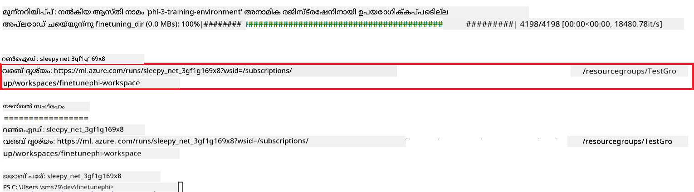

### ഫൈൻ-ട്യൂൺ ചെയ്ത മോഡൽ ഡിപ്പ്ലോയ് ചെയ്യുക

ഫൈൻ-ട്യൂൺ ചെയ്ത Phi-3 മോഡലിനെ Prompt Flow-യുമായി ഇന്റഗ്രേറ്റ് ചെയ്യാൻ, മോഡൽ റിയൽ-ടൈം ഇൻഫറൻസിനായി ആക്‌സസ് ചെയ്യാവുന്നതായിരിക്കാൻ ഡിപ്പ്ലോയ് ചെയ്യേണ്ടതാണ്. ഈ പ്രക്രിയ മോഡൽ രജിസ്റ്റർ ചെയ്യൽ, ഓൺലൈൻ എൻഡ്പോയിന്റ് സൃഷ്ടിക്കൽ, മോഡൽ ഡിപ്പ്ലോയ്മെന്റ് എന്നിവ ഉൾക്കൊള്ളുന്നു.

#### ഡിപ്പ്ലോയ്മെന്റിനായി മോഡൽ നാമം, എൻഡ്പോയിന്റ് നാമം, ഡിപ്പ്ലോയ്മെന്റ് നാമം സജ്ജമാക്കുക

1. *config.py* ഫയൽ തുറക്കുക.

1. `AZURE_MODEL_NAME = "your_fine_tuned_model_name"` എന്നത് നിങ്ങളുടെ മോഡലിനുള്ള അനുയോജ്യമായ നാമത്തോടെ മാറ്റുക.

1. `AZURE_ENDPOINT_NAME = "your_fine_tuned_model_endpoint_name"` എന്നത് നിങ്ങളുടെ എൻഡ്പോയിന്റിനുള്ള അനുയോജ്യമായ നാമത്തോടെ മാറ്റുക.

1. `AZURE_DEPLOYMENT_NAME = "your_fine_tuned_model_deployment_name"` എന്നത് നിങ്ങളുടെ ഡിപ്പ്ലോയ്മെന്റിനുള്ള അനുയോജ്യമായ നാമത്തോടെ മാറ്റുക.

#### *deploy_model.py* ഫയലിൽ കോഡ് ചേർക്കുക

*deploy_model.py* ഫയൽ പ്രവർത്തിപ്പിക്കുന്നത് മുഴുവൻ ഡിപ്പ്ലോയ്മെന്റ് പ്രക്രിയ സ്വയംക്രമീകരിക്കും. ഇത് മോഡൽ രജിസ്റ്റർ ചെയ്യുകയും, എൻഡ്പോയിന്റ് സൃഷ്ടിക്കുകയും, config.py ഫയലിൽ വ്യക്തമാക്കിയ സെറ്റിംഗുകൾ അനുസരിച്ച് മോഡൽ ഡിപ്പ്ലോയ് ചെയ്യുകയും ചെയ്യും (മോഡൽ നാമം, എൻഡ്പോയിന്റ് നാമം, ഡിപ്പ്ലോയ്മെന്റ് നാമം ഉൾപ്പെടെ).

1. Visual Studio Code-ൽ *deploy_model.py* ഫയൽ തുറക്കുക.

1. *deploy_model.py* ഫയലിലേക്കു താഴെയുള്ള കോഡ് ചേർക്കുക.

    ```python
    import logging
    from azure.identity import AzureCliCredential
    from azure.ai.ml import MLClient
    from azure.ai.ml.entities import Model, ProbeSettings, ManagedOnlineEndpoint, ManagedOnlineDeployment, IdentityConfiguration, ManagedIdentityConfiguration, OnlineRequestSettings
    from azure.ai.ml.constants import AssetTypes

    # കോൺഫിഗറേഷൻ ഇംപോർട്ടുകൾ
    from config import (
        AZURE_SUBSCRIPTION_ID,
        AZURE_RESOURCE_GROUP_NAME,
        AZURE_ML_WORKSPACE_NAME,
        AZURE_MANAGED_IDENTITY_RESOURCE_ID,
        AZURE_MANAGED_IDENTITY_CLIENT_ID,
        AZURE_MODEL_NAME,
        AZURE_ENDPOINT_NAME,
        AZURE_DEPLOYMENT_NAME
    )

    # സ്ഥിരങ്ങൾ
    JOB_NAME = "your-job-name"
    COMPUTE_INSTANCE_TYPE = "Standard_E4s_v3"

    deployment_env_vars = {
        "SUBSCRIPTION_ID": AZURE_SUBSCRIPTION_ID,
        "RESOURCE_GROUP_NAME": AZURE_RESOURCE_GROUP_NAME,
        "UAI_CLIENT_ID": AZURE_MANAGED_IDENTITY_CLIENT_ID,
    }

    # ലോഗിംഗ് ക്രമീകരണം
    logging.basicConfig(
        format="%(asctime)s - %(levelname)s - %(name)s - %(message)s",
        datefmt="%Y-%m-%d %H:%M:%S",
        level=logging.DEBUG
    )
    logger = logging.getLogger(__name__)

    def get_ml_client():
        """Initialize and return the ML Client."""
        credential = AzureCliCredential()
        return MLClient(credential, AZURE_SUBSCRIPTION_ID, AZURE_RESOURCE_GROUP_NAME, AZURE_ML_WORKSPACE_NAME)

    def register_model(ml_client, model_name, job_name):
        """Register a new model."""
        model_path = f"azureml://jobs/{job_name}/outputs/artifacts/paths/model_output"
        logger.info(f"Registering model {model_name} from job {job_name} at path {model_path}.")
        run_model = Model(
            path=model_path,
            name=model_name,
            description="Model created from run.",
            type=AssetTypes.MLFLOW_MODEL,
        )
        model = ml_client.models.create_or_update(run_model)
        logger.info(f"Registered model ID: {model.id}")
        return model

    def delete_existing_endpoint(ml_client, endpoint_name):
        """Delete existing endpoint if it exists."""
        try:
            endpoint_result = ml_client.online_endpoints.get(name=endpoint_name)
            logger.info(f"Deleting existing endpoint {endpoint_name}.")
            ml_client.online_endpoints.begin_delete(name=endpoint_name).result()
            logger.info(f"Deleted existing endpoint {endpoint_name}.")
        except Exception as e:
            logger.info(f"No existing endpoint {endpoint_name} found to delete: {e}")

    def create_or_update_endpoint(ml_client, endpoint_name, description=""):
        """Create or update an endpoint."""
        delete_existing_endpoint(ml_client, endpoint_name)
        logger.info(f"Creating new endpoint {endpoint_name}.")
        endpoint = ManagedOnlineEndpoint(
            name=endpoint_name,
            description=description,
            identity=IdentityConfiguration(
                type="user_assigned",
                user_assigned_identities=[ManagedIdentityConfiguration(resource_id=AZURE_MANAGED_IDENTITY_RESOURCE_ID)]
            )
        )
        endpoint_result = ml_client.online_endpoints.begin_create_or_update(endpoint).result()
        logger.info(f"Created new endpoint {endpoint_name}.")
        return endpoint_result

    def create_or_update_deployment(ml_client, endpoint_name, deployment_name, model):
        """Create or update a deployment."""

        logger.info(f"Creating deployment {deployment_name} for endpoint {endpoint_name}.")
        deployment = ManagedOnlineDeployment(
            name=deployment_name,
            endpoint_name=endpoint_name,
            model=model.id,
            instance_type=COMPUTE_INSTANCE_TYPE,
            instance_count=1,
            environment_variables=deployment_env_vars,
            request_settings=OnlineRequestSettings(
                max_concurrent_requests_per_instance=3,
                request_timeout_ms=180000,
                max_queue_wait_ms=120000
            ),
            liveness_probe=ProbeSettings(
                failure_threshold=30,
                success_threshold=1,
                period=100,
                initial_delay=500,
            ),
            readiness_probe=ProbeSettings(
                failure_threshold=30,
                success_threshold=1,
                period=100,
                initial_delay=500,
            ),
        )
        deployment_result = ml_client.online_deployments.begin_create_or_update(deployment).result()
        logger.info(f"Created deployment {deployment.name} for endpoint {endpoint_name}.")
        return deployment_result

    def set_traffic_to_deployment(ml_client, endpoint_name, deployment_name):
        """Set traffic to the specified deployment."""
        try:
            # നിലവിലെ എൻഡ്പോയിന്റിന്റെ വിശദാംശങ്ങൾ നേടുക
            endpoint = ml_client.online_endpoints.get(name=endpoint_name)
            
            # ഡീബഗ് ചെയ്യുന്നതിനായി നിലവിലെ ട്രാഫിക് വിന്യാസം ലോഗ് ചെയ്യുക
            logger.info(f"Current traffic allocation: {endpoint.traffic}")
            
            # ഡിപ്ലോയ്മെന്റിന് ട്രാഫിക് വിന്യാസം ക്രമീകരിക്കുക
            endpoint.traffic = {deployment_name: 100}
            
            # എൻഡ്പോയിന്റിനെ പുതിയ ട്രാഫിക് വിന്യാസത്തോടെ അപ്ഡേറ്റ് ചെയ്യുക
            endpoint_poller = ml_client.online_endpoints.begin_create_or_update(endpoint)
            updated_endpoint = endpoint_poller.result()
            
            # ഡീബഗ് ചെയ്യുന്നതിനായി അപ്ഡേറ്റ് ചെയ്ത ട്രാഫിക് വിന്യാസം ലോഗ് ചെയ്യുക
            logger.info(f"Updated traffic allocation: {updated_endpoint.traffic}")
            logger.info(f"Set traffic to deployment {deployment_name} at endpoint {endpoint_name}.")
            return updated_endpoint
        except Exception as e:
            # പ്രക്രിയയിൽ സംഭവിക്കുന്ന ഏതെങ്കിലും പിശകുകളും ലോഗ് ചെയ്യുക
            logger.error(f"Failed to set traffic to deployment: {e}")
            raise


    def main():
        ml_client = get_ml_client()

        registered_model = register_model(ml_client, AZURE_MODEL_NAME, JOB_NAME)
        logger.info(f"Registered model ID: {registered_model.id}")

        endpoint = create_or_update_endpoint(ml_client, AZURE_ENDPOINT_NAME, "Endpoint for finetuned Phi-3 model")
        logger.info(f"Endpoint {AZURE_ENDPOINT_NAME} is ready.")

        try:
            deployment = create_or_update_deployment(ml_client, AZURE_ENDPOINT_NAME, AZURE_DEPLOYMENT_NAME, registered_model)
            logger.info(f"Deployment {AZURE_DEPLOYMENT_NAME} is created for endpoint {AZURE_ENDPOINT_NAME}.")

            set_traffic_to_deployment(ml_client, AZURE_ENDPOINT_NAME, AZURE_DEPLOYMENT_NAME)
            logger.info(f"Traffic is set to deployment {AZURE_DEPLOYMENT_NAME} at endpoint {AZURE_ENDPOINT_NAME}.")
        except Exception as e:
            logger.error(f"Failed to create or update deployment: {e}")

    if __name__ == "__main__":
        main()

    ```

1. `JOB_NAME` കണ്ടെത്താൻ താഴെയുള്ള നടപടിക്രമങ്ങൾ ചെയ്യുക:

    - നിങ്ങൾ സൃഷ്ടിച്ച Azure Machine Learning റിസോഴ്സിലേക്ക് പോവുക.
    - **Studio web URL** തിരഞ്ഞെടുക്കുക Azure Machine Learning വേർക്ക്സ്പേസ് തുറക്കാൻ.
    - ഇടത് സൈഡ് ടാബിൽ നിന്നു **Jobs** തിരഞ്ഞെടുക്കുക.
    - ഫൈൻ-ട്യൂണിങ്ങിനായുള്ള പരീക്ഷണം (experiment) തിരഞ്ഞെടുക്കുക. ഉദാഹരണത്തിന്, *finetunephi*.
    - നിങ്ങൾ സൃഷ്ടിച്ച ജോബ് തിരഞ്ഞെടുക്കുക.
    - നിങ്ങളുടെ ജോബ് നാമം *deploy_model.py* ഫയലിലുള്ള `JOB_NAME = "your-job-name"` എന്നതിലേക്ക് കോപ്പി ചെയ്ത് പേസ്റ്റ് ചെയ്യുക.

1. `COMPUTE_INSTANCE_TYPE` നിങ്ങളുടെ പ്രത്യേക വിശദാംശങ്ങളോടെ മാറ്റുക.

1. *deploy_model.py* സ്‌ക്രിപ്റ്റ് പ്രവർത്തിപ്പിക്കുകയും Azure Machine Learning-ൽ ഡിപ്ലോയ്മെന്റ് പ്രക്രിയ ആരംഭിക്കുകയും ചെയ്യാൻ താഴെ കാണുന്ന കമാൻഡ് ടൈപ്പ് ചെയ്യുക.

    ```python
    python deploy_model.py
    ```

> [!WARNING]
> To avoid additional charges to your account, make sure to delete the created endpoint in the Azure Machine Learning workspace.
>

#### Azure Machine Learning വർക്ക്‌സ്പെയ്‌സിൽ ഡിപ്ലോയ്മെന്റ് നില പരിശോധിക്കുക

1. [Azure ML സ്റ്റുഡിയോ](https://ml.azure.com/home?wt.mc_id=studentamb_279723) സന്ദർശിക്കുക.

1. നിങ്ങൾ സൃഷ്ടിച്ച Azure Machine Learning വർക്ക്‌സ്‌പെയ്‌സിലേക്ക് നയിക്കുക.

1. Azure Machine Learning വർക്ക്‌സ്പെയ്‌സ് തുറക്കാൻ **Studio web URL** തിരഞ്ഞെടുക്കുക.

1. ഇടതുവശത്തെ ടാബിൽ നിന്നും **Endpoints** തിരഞ്ഞെടുക്കുക.

    

2. നിങ്ങൾ സൃഷ്ടിച്ച എൻഡ്‌പോയിന്റ് തിരഞ്ഞെടുക്കുക.

    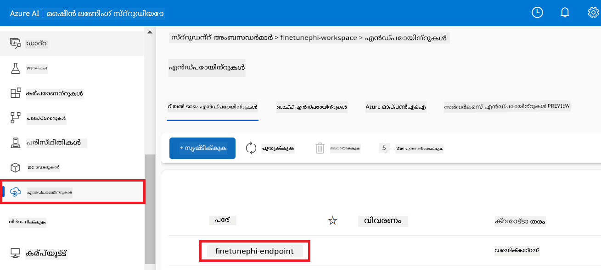

3. ഈ പേജിൽ, ഡിപ്ലോയ്മെന്റ് പ്രക്രിയയിൽ സൃഷ്ടിച്ച എൻഡ്‌പോയിന്റുകൾ നിങ്ങൾ മാനേജ് ചെയ്യാൻ കഴിയും.

## സീനാരിയോ 3: Prompt flow-ഉുമായി ഇന്റഗ്രേറ്റ് ചെയ്ത് നിങ്ങളുടെ കസ്റ്റം മോഡലുമായി ചാറ്റ് ചെയ്യുക

### Prompt flow-ൽ കസ്റ്റം Phi-3 മോഡൽ ഇന്റഗ്രേറ്റ് ചെയ്യുക

നിങ്ങളുടെ ഫൈൻ-ട്യൂൺ ചെയ്ത മോഡൽ വിജയകരമായി ഡിപ്ലോയ് ചെയ്തശേഷം, അതിനെ Prompt flow-ൽ ഇന്റഗ്രേറ്റ് ചെയ്ത് റിയൽ-ടൈം ആപ്ലിക്കേഷനുകളിൽ ഉപയോഗിക്കാം, നിങ്ങളുടെ കസ്റ്റം Phi-3 മോഡലോടെ വിവിധ ഇന്ററാക്ടീവ് ടാസ്കുകൾ നടപ്പാക്കാൻ കഴിയും.

#### ഫൈൻ-ട്യൂൺ ചെയ്ത Phi-3 മോഡലിന്റെ API കീയും എൻഡ്‌പോയിന്റ് URI-യും സജ്ജമാക്കുക

1. നിങ്ങൾ സൃഷ്ടിച്ച Azure Machine Learning വർക്‌സ്‌പെയ്‌സിലേക്ക് നാവിഗേറ്റ് ചെയ്യുക.
1. ഇടതുവശത്തെ ടാബിൽ നിന്ന് **Endpoints** തിരഞ്ഞെടുക്കുക.
1. നിങ്ങൾ സൃഷ്ടിച്ച എൻഡ്‌പോയിന്റ് തിരഞ്ഞെടുക്കുക.
1. നാവിഗേഷൻ മെനൂരിൽ നിന്ന് **Consume** തിരഞ്ഞെടുക്കുക.
1. നിങ്ങളുടെ **REST endpoint** *config.py* ഫയലിലേക്ക് കോപ്പി ചെയ്ത് പേസ്റ്റ് ചെയ്യുക, `AZURE_ML_ENDPOINT = "your_fine_tuned_model_endpoint_uri"` എന്നതിനെ നിങ്ങളുടെ **REST endpoint**-നായി മാറ്റി.
1. നിങ്ങളുടെ **Primary key** *config.py* ഫയലിൽ കോപ്പി ചെയ്ത് പേസ്റ്റ് ചെയ്യുക, `AZURE_ML_API_KEY = "your_fine_tuned_model_api_key"` എന്നതിനെ നിങ്ങളുടെ **Primary key**-നായി മാറ്റി.

    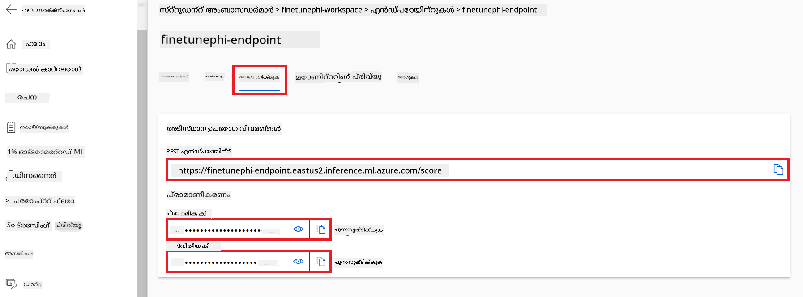

#### *flow.dag.yml* ഫയലിലേക്ക് കോഡ് ചേർക്കുക

1. Visual Studio Code-ൽ *flow.dag.yml* ഫയൽ തുറക്കുക.

1. താഴെ കാണുന്ന കോഡ് *flow.dag.yml*-ലേക്ക് ചേർക്കുക.

    ```yml
    inputs:
      input_data:
        type: string
        default: "Who founded Microsoft?"

    outputs:
      answer:
        type: string
        reference: ${integrate_with_promptflow.output}

    nodes:
    - name: integrate_with_promptflow
      type: python
      source:
        type: code
        path: integrate_with_promptflow.py
      inputs:
        input_data: ${inputs.input_data}
    ```

#### *integrate_with_promptflow.py* ഫയലിലേക്ക് കോഡ് ചേർക്കുക

1. Visual Studio Code-ൽ *integrate_with_promptflow.py* ഫയൽ തുറക്കുക.

1. താഴെ കാണുന്ന കോഡ് *integrate_with_promptflow.py*-ലേക്ക് ചേർക്കുക.

    ```python
    import logging
    import requests
    from promptflow.core import tool
    import asyncio
    import platform
    from config import (
        AZURE_ML_ENDPOINT,
        AZURE_ML_API_KEY
    )

    # ലോഗിംഗ് ക്രമീകരണം
    logging.basicConfig(
        format="%(asctime)s - %(levelname)s - %(name)s - %(message)s",
        datefmt="%Y-%m-%d %H:%M:%S",
        level=logging.DEBUG
    )
    logger = logging.getLogger(__name__)

    def query_azml_endpoint(input_data: list, endpoint_url: str, api_key: str) -> str:
        """
        Send a request to the Azure ML endpoint with the given input data.
        """
        headers = {
            "Content-Type": "application/json",
            "Authorization": f"Bearer {api_key}"
        }
        data = {
            "input_data": [input_data],
            "params": {
                "temperature": 0.7,
                "max_new_tokens": 128,
                "do_sample": True,
                "return_full_text": True
            }
        }
        try:
            response = requests.post(endpoint_url, json=data, headers=headers)
            response.raise_for_status()
            result = response.json()[0]
            logger.info("Successfully received response from Azure ML Endpoint.")
            return result
        except requests.exceptions.RequestException as e:
            logger.error(f"Error querying Azure ML Endpoint: {e}")
            raise

    def setup_asyncio_policy():
        """
        Setup asyncio event loop policy for Windows.
        """
        if platform.system() == 'Windows':
            asyncio.set_event_loop_policy(asyncio.WindowsSelectorEventLoopPolicy())
            logger.info("Set Windows asyncio event loop policy.")

    @tool
    def my_python_tool(input_data: str) -> str:
        """
        Tool function to process input data and query the Azure ML endpoint.
        """
        setup_asyncio_policy()
        return query_azml_endpoint(input_data, AZURE_ML_ENDPOINT, AZURE_ML_API_KEY)

    ```

### നിങ്ങളുടെ കസ്റ്റം മോഡലുമായി ചാറ്റ് ചെയ്യുക

1. *deploy_model.py* സ്‌ക്രിപ്റ്റ് പ്രവർത്തിപ്പിക്കുകയും Azure Machine Learning-ൽ ഡിപ്ലോയ്മെന്റ് പ്രക്രിയ ആരംഭിക്കുകയും ചെയ്യാൻ താഴെ കാണുന്ന കമാൻഡ് ടൈപ്പ് ചെയ്യുക.

    ```python
    pf flow serve --source ./ --port 8080 --host localhost
    ```

1. ഫലങ്ങളുടെ ഒരു ഉദാഹരണം ഇവിടെ: ഇപ്പോൾ നിങ്ങൾ നിങ്ങളുടെ കസ്റ്റം Phi-3 മോഡലുമായി ചാറ്റ് ചെയ്യാൻ കഴിയും. ഫൈൻ-ട്യൂണിംഗിനായി ഉപയോഗിച്ച ഡേറ്റാ അടിസ്ഥാനമാക്കി ചോദ്യങ്ങൾ ചോദിക്കുന്നത് ശുപാർശ ചെയ്യപ്പെടുന്നു.

    

---

<!-- CO-OP TRANSLATOR DISCLAIMER START -->
ഡിസ്‌ക്ലെയിമർ:
ഈ പ്രമാണം AI-ആധാരമായ വിവര്‍ത്തനസേവനമായ Co-op Translator (https://github.com/Azure/co-op-translator) ഉപയോഗിച്ച് വിവർത്തനം ചെയ്തതാണ്. ഞങ്ങൾ കൃത്യതയ്ക്ക് ശ്രമിച്ചാലും, ഓട്ടോമേറ്റഡ് വിവർത്തനങ്ങളിൽ തെറ്റുകൾ അല്ലെങ്കിൽ അനുഭവന്വേഷണപരമായ അശുദ്ധതകൾ ഉണ്ടാകാൻ സാധ്യതയുണ്ടെന്ന് ദയവായി ശ്രദ്ധിക്കുക. യഥാർത്ഥ പ്രമാണത്തിന്റെ അതിന്റെ സ്വദേശഭാഷയിലുള്ള പതിപ്പിനെ അധികാരപരമായ ഉറവിടമായി കണക്കാക്കുക. നിർണായകമായ വിവരങ്ങൾക്ക് പ്രൊഫഷണൽ മനുഷ്യ വിവർത്തനം ശുപാർശ ചെയ്യപ്പെടുന്നു. ഈ വിവർത്തനം ഉപയോഗിക്കുന്നതിനാൽ ഉണ്ടാവുന്ന οποιεδήποτε തെറ്റിദ്ധാരണകൾക്കും അപവാഖ്യാനങ്ങൾക്കും ഞങ്ങൾ ഉത്തരവാദികളല്ല.
<!-- CO-OP TRANSLATOR DISCLAIMER END -->