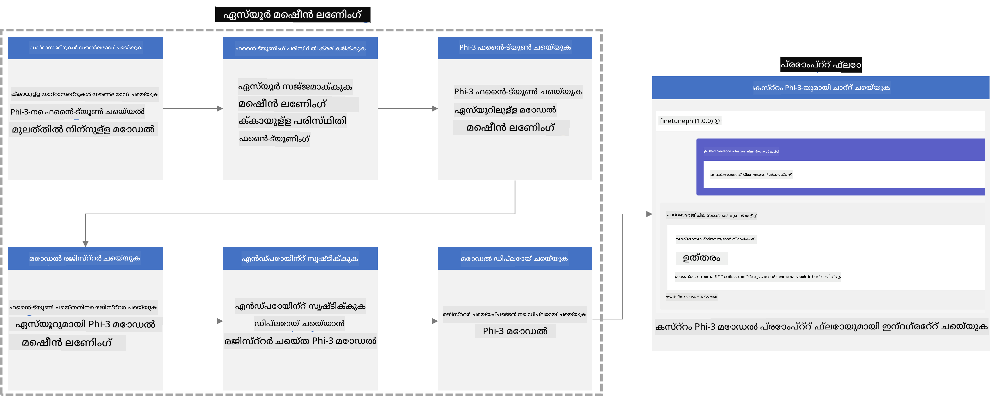
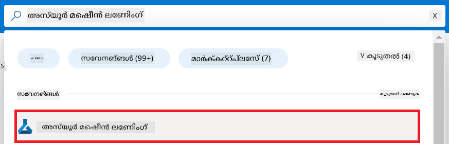
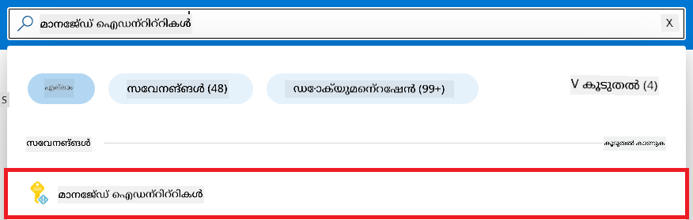
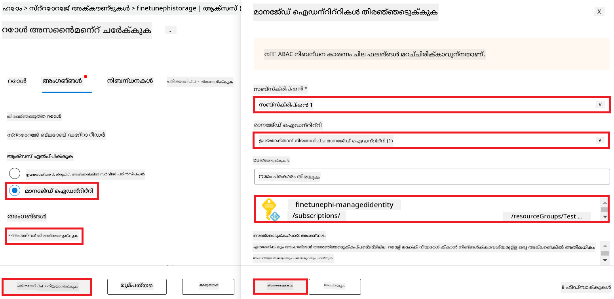
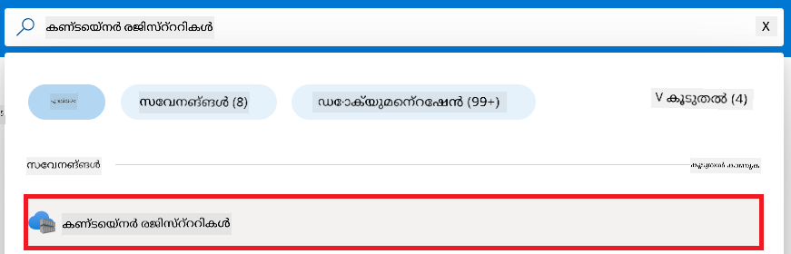
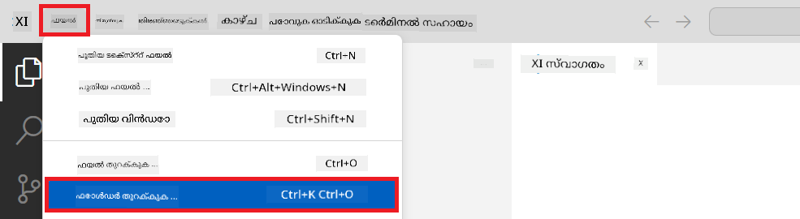
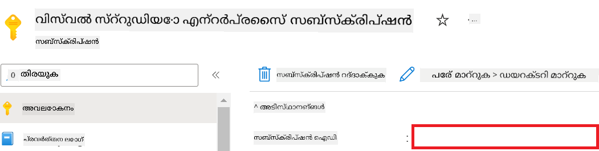
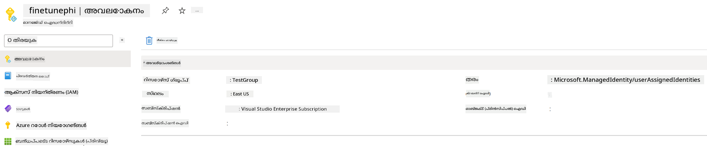
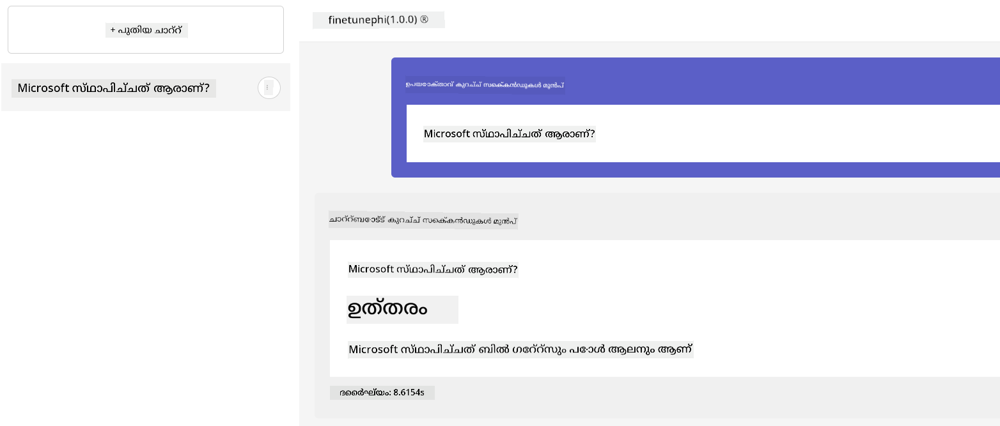

<!--
CO_OP_TRANSLATOR_METADATA:
{
  "original_hash": "7ca2c30fdb802664070e9cfbf92e24fe",
  "translation_date": "2026-01-05T15:03:53+00:00",
  "source_file": "md/02.Application/01.TextAndChat/Phi3/E2E_Phi-3-FineTuning_PromptFlow_Integration.md",
  "language_code": "ml"
}
-->
# Fine-tune and Integrate custom Phi-3 models with Prompt flow

ഈ End-to-end (E2E) സാമ്പിൾ Microsoft Tech Community-ലെ "[Fine-Tune and Integrate Custom Phi-3 Models with Prompt Flow: Step-by-Step Guide](https://techcommunity.microsoft.com/t5/educator-developer-blog/fine-tune-and-integrate-custom-phi-3-models-with-prompt-flow/ba-p/4178612?WT.mc_id=aiml-137032-kinfeylo)" എന്ന മാർഗ്ഗനിർദേശത്തെ അടിസ്ഥാനമാക്കി. ഇത് ഫൈൻ-ട്യൂണിംഗ്, ഡിപ്പ്ലോയ്മെന്റ്, Prompt flow ഉപയോഗിച്ച് ഇന്റഗ്രേറ്റ് ചെയ്യുന്നതിന്റെ പ്രക്രിയകൾ പരിചയപ്പെടുത്തുന്നു.

## അവലോകനം

ഈ E2E സാമ്പിളിലൂടെ, Phi-3 മോഡൽ ഫൈൻ-ട്യൂൺ ചെയ്യുകയും Prompt flow-യുമായി ഇന്റഗ്രേറ്റ് ചെയ്യുകയും ചെയ്യുന്നത് നിങ്ങൾ പഠിക്കും. Azure Machine Learning, Prompt flow എന്നിവ ഉപയോഗിച്ച്, കസ്റ്റം AI മോഡലുകൾ ഡിപ്പ്ലോയ്മെന്റ് ചെയ്യാനും ഉപയോഗിക്കാനും ഒരു വർക്ക്‌ഫ്ലෝ സ്ഥാപിക്കും. ഈ E2E സാമ്പിൾ മൂന്ന് സീനാരിയോകളായി വിഭജിച്ചിരിക്കുന്നു:

**സീനാരി 1: Azure റിസോഴ്‌സുകൾ സജ്ജീകരിക്കൽ மற்றும் ഫൈൻ-ട്യൂണിംഗിനായി ഒരുക്കം**

**സീനാരി 2: Phi-3 മോഡൽ ഫൈൻ-ട്യൂൺ ചെയ്ത് Azure Machine Learning സ്റ്റുഡിയോയില്‌ ഡിപ്പ്ലോയ് ചെയ്യല്‍**

**സീനാരി 3: Prompt flow-യുമായി ഇന്റഗ്രേറ്റ് ചെയ്ത് നിങ്ങളുടെ കസ്റ്റം മോഡലിനൊപ്പം ചാറ്റ് ചെയ്യുക**

ഇതാണ് ഈ E2E സാമ്പിളിന്റെയും അവലോകനം.



### ഉള്ളടക്ക പട്ടിക

1. **[സീനാരി 1: Azure റിസോഴ്‌സുകൾ സജ്ജീകരിക്കൽ மற்றும் ഫൈൻ-ട്യൂണിംഗിനായി ഒരുക്കം](../../../../../../md/02.Application/01.TextAndChat/Phi3)**
    - [Azure Machine Learning വാർക്‌സ്‌പേസ് സൃഷ്ടിക്കുക](../../../../../../md/02.Application/01.TextAndChat/Phi3)
    - [Azure സബ്സ്ക്രിപ്ഷനിൽ GPU ക്യൂട്ടകൾ അഭ്യർത്ഥിക്കുക](../../../../../../md/02.Application/01.TextAndChat/Phi3)
    - [റോൾ അസൈൻമെന്റ് ചേർക്കുക](../../../../../../md/02.Application/01.TextAndChat/Phi3)
    - [പ്രോജക്ട് സജ്ജമാക്കുക](../../../../../../md/02.Application/01.TextAndChat/Phi3)
    - [ഫൈൻ-ട്യൂണിംഗിനായി ഡാറ്റാസെറ്റ് തയ്യാറാക്കുക](../../../../../../md/02.Application/01.TextAndChat/Phi3)

1. **[സീനാരി 2: Phi-3 മോഡൽ ഫൈൻ-ട്യൂൺ ചെയ്ത് Azure Machine Learning സ്റ്റുഡിയോയിൽ ഡിപ്പ്ലോയ് ചെയ്യുക](../../../../../../md/02.Application/01.TextAndChat/Phi3)**
    - [Azure CLI സജ്ജീകരിക്കുക](../../../../../../md/02.Application/01.TextAndChat/Phi3)
    - [Phi-3 മോഡൽ ഫൈൻ-ട്യൂൺ ചെയ്യുക](../../../../../../md/02.Application/01.TextAndChat/Phi3)
    - [ഫൈൻ-ട്യൂൺ ചെയ്ത മോഡൽ ഡിപ്പ്ലോയ് ചെയ്യുക](../../../../../../md/02.Application/01.TextAndChat/Phi3)

1. **[സീനാരി 3: Prompt flow-യുമായി ഇന്റഗ്രേറ്റ് ചെയ്ത് നിങ്ങളുടെ കസ്റ്റം മോഡലിനൊപ്പം ചാറ്റ് ചെയ്യൂ](../../../../../../md/02.Application/01.TextAndChat/Phi3)**
    - [കസ്റ്റം Phi-3 മോഡൽ Prompt flow-യുമായി ഇന്റഗ്രേറ്റ് ചെയ്യുക](../../../../../../md/02.Application/01.TextAndChat/Phi3)
    - [നിങ്ങളുടെ കസ്റ്റം മോഡലിനൊപ്പം ചാറ്റ് ചെയ്യുക](../../../../../../md/02.Application/01.TextAndChat/Phi3)

## സീനാരി 1: Azure റിസോഴ്‌സുകൾ സജ്ജീകരിക്കൽ এবং ഫൈൻ-ട്യൂണിംഗിനായി ഒരുക്കം

### Azure Machine Learning വാർക്‌സ്‌പേസ് സൃഷ്ടിക്കുക

1. പോർട്ടൽ പേജിന്റെ മുകളിൽ **സർച്ച് ബാർ**-ൽ *azure machine learning* ടൈപ്പ് ചെയ്ത്, കിട്ടുന്ന ഓപ്ഷനുകളിൽ നിന്ന് **Azure Machine Learning** തിരഞ്ഞെടുക്കുക.

    

1. നവിഗേഷൻ മെയിനുവിൽ നിന്ന് **+ Create** തിരഞ്ഞെടുത്ത് തിരഞ്ഞെടുക്കുക.

1. നവിഗേഷൻ മെയിനുവിൽ നിന്ന് **New workspace** തിരഞ്ഞെടുക്കുക.

    

1. താഴെ പറയുന്ന കാര്യങ്ങൾ ചെയ്യുക:

    - നിങ്ങളുടെ Azure **Subscription** തിരഞ്ഞെടുക്കുക.
    - ഉപയോഗിക്കാനിരിക്കുന്ന **Resource group** തിരഞ്ഞെടുക്കുക (ആവശ്യമെങ്കിൽ പുതുതായി സൃഷ്ടിക്കുക).
    - **Workspace Name** നൽകുക. ഇത് ഒര منفردമാകണം.
    - ഉപയോഗിക്കാൻ ആഗ്രഹിക്കുന്ന **Region** തിരഞ്ഞെടുക്കുക.
    - ഉപയോഗിക്കാൻ ആഗ്രഹിക്കുന്ന **Storage account** തിരഞ്ഞെടുക്കുക (ആവശ്യമെങ്കിൽ പുതുതായി സൃഷ്ടിക്കുക).
    - ഉപയോഗിക്കാൻ ആഗ്രഹിക്കുന്ന **Key vault** തിരഞ്ഞെടുക്കുക (ആവശ്യമെങ്കിൽ പുതുതായി സൃഷ്ടിക്കുക).
    - ഉപയോഗിക്കാൻ ആഗ്രഹിക്കുന്ന **Application insights** തിരഞ്ഞെടുക്കുക (ആവശ്യമെങ്കിൽ പുതുതായി സൃഷ്ടിക്കുക).
    - ഉപയോഗിക്കാൻ ആഗ്രഹിക്കുന്ന **Container registry** തിരഞ്ഞെടുക്കുക (ആവശ്യമെങ്കിൽ പുതുതായി സൃഷ്ടിക്കുക).

    

1. **Review + Create** തിരഞ്ഞെടുക്കുക.

1. **Create** തിരഞ്ഞെടുക്കുക.

### Azure സബ്സ്ക്രിപ്ഷനിൽ GPU ക്യൂട്ടകൾ അഭ്യർത്ഥിക്കുക

ഈ E2E സാമ്പിളിൽ, ഫൈൻ-ട്യൂണിംഗിനായി *Standard_NC24ads_A100_v4 GPU* ഉപയോഗിക്കും, ഇതിനായി ക്യൂട്ട അഭ്യർത്ഥിക്കേണ്ടതാണ്, ഡിപ്പ്ലോയ്മെന്റിനായി *Standard_E4s_v3* CPU ഉപയോഗിക്കുന്നു, അതിന് ക്യൂട്ട അഭ്യർത്ഥന ആവശ്യമില്ല.

> [!NOTE]
>
> GPU വിതരണം ലഭിക്കാനുള്ള യോഗ്യതയ്ക്ക് Pay-As-You-Go സബ്സ്ക്രിപ്ഷനുകൾ മാത്രമേ യോഗ്യങ്ങളുള്ളൂ; ബിനിഫിറ്റ് സബ്സ്ക്രിപ്ഷനുകൾ നിലവിൽ പിന്തുണയ്ക്കുന്നില്ല.
>
> ബിനിഫിറ്റ് സബ്സ്ക്രിപ്ഷനുകൾ (ഉദാഹരണത്തിന് Visual Studio Enterprise Subscription) ഉപയോഗിക്കുന്നവർക്കും ഫൈൻ-ട്യൂണിംഗ്, ഡിപ്പ്ലോയ്മെന്റ് പ്രക്രിയ വേഗത്തിൽ പരീക്ഷിക്കാൻ താത്പര്യമുള്ളവർക്കും, CPU ഉപയോഗിച്ച് ചെറിയ ഡാറ്റാസെറ്റിൽ ഫൈൻ-ട്യൂണിംഗ് ചെയ്യുന്നതിനുള്ള മാർഗ്ഗനിർദേശം ഈ ട്യൂട്ടോറിയലിൽ നൽകിയിട്ടുണ്ട്. എന്നാൽ, GPU ഉപയോഗിച്ച് വലിയ ഡാറ്റാസെറ്റുകളോടെ ഫൈൻ-ട്യൂണിംഗിന്റെ ഫലങ്ങൾ വളരെ മെച്ചാരവുമാണെന്ന് ശ്രദ്ധിക്കുക.

1. [Azure ML Studio](https://ml.azure.com/home?wt.mc_id=studentamb_279723) സന്ദർശിക്കുക.

1. *Standard NCADSA100v4 Family* ക്യൂട്ട് അഭ്യർത്ഥിക്കാൻ താഴെ പറയുന്ന ക്രമങ്ങൾ പാലിക്കുക:

    - ഇടത്തിരശ്ചെടയിൽ നിന്നുള്ള ടാബിൽ നിന്നു **Quota** തിരഞ്ഞെടുക്കുക.
    - **Virtual machine family** തിരഞ്ഞെടുക്കുക. ഉദാഹരണത്തിന്, *Standard NCADSA100v4 Family Cluster Dedicated vCPUs* തിരഞ്ഞെടുക്കുക, ഇതിൽ *Standard_NC24ads_A100_v4* GPU ഉൾപ്പെടുന്നു.
    - നവിഗേഷൻ മെയിനുവിൽ നിന്നു **Request quota** തിരഞ്ഞെടുക്കുക.

        

    - റിക്വസ്റ്റ് ക്യൂട്ട് പേജിനുള്ളിൽ, ഉപയോഗിക്കാൻ ആഗ്രഹിക്കുന്ന **New cores limit** നൽകുക. ഉദാഹരണത്തിന്, 24.
    - റിക്വസ്റ്റ് ക്യൂട്ട് പേജിൽ **Submit** തിരഞ്ഞെടുക്കുക GPU ക്യൂട്ട് അഭ്യർത്ഥിക്കുന്നതിന്.

> [!NOTE]
> നിങ്ങളുടെ ആവശ്യങ്ങൾക്ക് അനുയോജ്യമായ GPU അല്ലെങ്കിൽ CPU തിരഞ്ഞെടുക്കാം, [Sizes for Virtual Machines in Azure](https://learn.microsoft.com/azure/virtual-machines/sizes/overview?tabs=breakdownseries%2Cgeneralsizelist%2Ccomputesizelist%2Cmemorysizelist%2Cstoragesizelist%2Cgpusizelist%2Cfpgasizelist%2Chpcsizelist) ഡോക്യുമെന്റു നോക്കുക.

### റോളുകൾ അസൈൻ ചെയ്യുക

ഫൈൻ-ട്യൂൺ ചെയ്യാനും, ഡിപ്പ്ലോയ്മെന്റ് ചെയ്യാനും, ആദ്യം നിങ്ങൾ ഒരു User Assigned Managed Identity (UAI) സൃഷ്ടിച്ച് അതിന് അനുയോജ്യമായ അനുമതികൾ നൽകണം. ഡിപ്പ്ലോയ്മെന്റെAuthentication-നായി ഈ UAI ഉപയോഗിക്കും.

#### User Assigned Managed Identity(UAI) സൃഷ്ടിക്കുക

1. പോർട്ടൽ പേജിന്റെ മുകളിൽ **സർച്ച് ബാർ**-ൽ *managed identities* ടൈപ്പ് ചെയ്ത്, ലഭിക്കുന്ന ഓപ്ഷനുകളിൽ നിന്ന് **Managed Identities** തിരഞ്ഞെടുക്കുക.

    

1. **+ Create** തിരഞ്ഞെടുക്കുക.

    

1. താഴെ പറയുന്ന കാര്യങ്ങൾ ചെയ്യുക:

    - നിങ്ങളുടെ Azure **Subscription** തിരഞ്ഞെടുക്കുക.
    - ഉപയോഗിക്കാനിരിക്കുന്ന **Resource group** തിരഞ്ഞെടുക്കുക (ആവശ്യമെങ്കിൽ പുതുതായി സൃഷ്ടിക്കുക).
    - ഉപയോഗിക്കാൻ ആഗ്രഹിക്കുന്ന **Region** തിരഞ്ഞെടുക്കുക.
    - **Name** നൽകുക. ഇത് സർവത്രവുമായിരിക്കണം.

1. **Review + create** തിരഞ്ഞെടുക്കുക.

1. **+ Create** തിരഞ്ഞെടുക്കുക.

#### Managed Identity-യ്ക്ക് Contributor റോൾ അസൈൻ ചെയ്യുക

1. നിങ്ങൾ സൃഷ്ടിച്ച Managed Identity റിസോഴ്‌സ്-ലേക്ക് പോവുക.

1. ഇടത്തിരശ്ചെടയിൽ നിന്നുള്ള ടാബിൽ നിന്നു **Azure role assignments** തിരഞ്ഞെടുക്കുക.

1. നവിഗേഷൻ മെയിനുവിൽ നിന്നു **+Add role assignment** തിരഞ്ഞെടുക്കുക.

1. Add role assignment പേജിൽ താഴെ പറയുന്ന കാര്യങ്ങൾ നിർവഹിക്കുക:
    - **Scope**-നായി **Resource group** തിരഞ്ഞെടുത്തുറപ്പാക്കുക.
    - നിങ്ങളുടെ Azure **Subscription** തിരഞ്ഞെടുക്കുക.
    - ഉപയോഗിക്കാൻ **Resource group** തിരഞ്ഞെടുക്കുക.
    - **Role**-നായി **Contributor** തിരഞ്ഞെടുക്കുക.

    

1. **Save** തിരഞ്ഞെടുക്കുക.

#### Managed Identity-യ്ക്ക് Storage Blob Data Reader റോൾ അസൈൻ ചെയ്യുക

1. പോർട്ടൽ പേജിന്റെ മുകളിൽ **സർച്ച് ബാർ**-ൽ *storage accounts* ടൈപ്പ് ചെയ്ത്, ലഭിച്ച ഓപ്ഷനുകളിൽ നിന്ന് **Storage accounts** തിരഞ്ഞെടുക്കുക.

    

1. സൃഷ്ടിച്ച Azure Machine Learning വാർക്‌സ്‌പേസ്-നോട് ബന്ധപ്പെട്ടു ഉള്ള സ്റ്റോറേജ് അക്കൗണ്ട് തിരഞ്ഞെടുക്കുക. ഉദാഹരണത്തിന്, *finetunephistorage*.

1. Add role assignment പേജിലേക്ക് പോകാൻ താഴെ പറയുന്നവ ചെയ്യുക:

    - സൃഷ്ടിച്ച Azure Storage അക്കൗണ്ടിലേക്ക് നവിഗേറ്റ് ചെയ്യുക.
    - ഇടത്തിരശ്ചെടയിൽ നിന്നുള്ള ടാബിൽ **Access Control (IAM)** തിരഞ്ഞെടുക്കുക.
    - നവിഗേഷൻ മെയിനുവിൽ നിന്നു **+ Add** തിരഞ്ഞെടുക്കുക.
    - നവിഗേഷൻ മെയിനുവിൽ നിന്നു **Add role assignment** തിരഞ്ഞെടുക്കുക.

    

1. Add role assignment പേജിൽ താഴെ പറയുന്ന നടപടികൾ നടപ്പിലാക്കുക:

    - Role പേജിൽ, **search bar**-ൽ *Storage Blob Data Reader* ടൈപ്പ് ചെയ്ത് ലഭിക്കുന്നവയിൽനിന്ന് **Storage Blob Data Reader** തിരഞ്ഞെടുക്കുക.
    - Role പേജിൽ, **Next** തിരഞ്ഞെടുക്കുക.
    - Members പേജിൽ, **Assign access to** **Managed identity** തിരഞ്ഞെടുക്കുക.
    - Members പേജിൽ, **+ Select members** തിരഞ്ഞെടുക്കുക.
    - Select managed identities പേജിൽ, നിങ്ങളുടെ Azure **Subscription** തിരഞ്ഞെടുക്കുക.
    - Select managed identities പേജിൽ, **Managed identity**-നായി **Manage Identity** തിരഞ്ഞെടുക്കുക.
    - Select managed identities പേജിൽ, നിങ്ങൾ സൃഷ്ടിച്ച Manage Identity തിരഞ്ഞെടുക്കുക. ഉദാഹരണത്തിന്, *finetunephi-managedidentity*.
    - Select managed identities പേജിൽ, **Select** തിരഞ്ഞെടുക്കുക.

    

1. **Review + assign** തിരഞ്ഞെടുക്കുക.

#### Managed Identity-യ്ക്ക് AcrPull റോൾ അസൈൻ ചെയ്യുക

1. പോർട്ടൽ പേജിന്റെ മുകളിൽ **സർച്ച് ബാർ**-ൽ *container registries* ടൈപ്പ് ചെയ്ത്, ലഭിച്ച ഓപ്ഷനുകളിൽ നിന്ന് **Container registries** തിരഞ്ഞെടുക്കുക.

    

1. Azure Machine Learning വാർക്‌സ്‌പേസ്-ന് ബന്ധപ്പെട്ടു ഉള്ള container registry തിരഞ്ഞെടുക്കുക. ഉദാഹരണത്തിന്, *finetunephicontainerregistries*

1. Add role assignment പേജിലേക്ക് പോകാൻ താഴെ പറയുന്നവ ചെയ്യുക:

    - ഇടത്തിരശ്ചെടയിൽ നിന്നുള്ള ടാബിൽ **Access Control (IAM)** തിരഞ്ഞെടുക്കുക.
    - നവിഗേഷൻ മെയിനുവിൽ നിന്നു **+ Add** തിരഞ്ഞെടുക്കുക.
    - നവിഗേഷൻ മെയിനുവിൽ നിന്നു **Add role assignment** തിരഞ്ഞെടുക്കുക.

1. Add role assignment പേജിൽ താഴെ പറയുന്ന നടപടികൾ നടപ്പിലാക്കുക:

    - Role പേജിൽ, **search bar**-ൽ *AcrPull* ടൈപ്പ് ചെയ്ത് ലഭിക്കുന്നവയിൽ നിന്നു **AcrPull** തിരഞ്ഞെടുക്കുക.
    - Role പേജിൽ, **Next** തിരഞ്ഞെടുക്കുക.
    - Members പേജിൽ, **Assign access to** **Managed identity** തിരഞ്ഞെടുക്കുക.
    - Members പേജിൽ, **+ Select members** തിരഞ്ഞെടുക്കുക.
    - Select managed identities പേജിൽ, നിങ്ങളുടെ Azure **Subscription** തിരഞ്ഞെടുക്കുക.
    - Select managed identities പേജിൽ, **Managed identity**-നായി **Manage Identity** തിരഞ്ഞെടുക്കുക.
    - Select managed identities പേജിൽ, നിങ്ങള്‍ സൃഷ്ടിച്ച Manage Identity തിരഞ്ഞെടുക്കുക. ഉദാഹരണത്തിന്, *finetunephi-managedidentity*.
    - Select managed identities പേജിൽ, **Select** തിരഞ്ഞെടുക്കുക.
    - **Review + assign** തിരഞ്ഞെടുക്കുക.

### പ്രോജക്ട് സജ്ജീകരിക്കുക

ഇപ്പോൾ, നിങ്ങൾ ഒരു ഫോള്ഡർ സൃഷ്ടിച്ച് ആ ഫോള്ഡറിൽ ഒരു വിർച്വൽ ఎన്വയിറൺമെന്റ് സജ്ജീകരിച്ച്, യൂസറുകളുമായി സംവദിക്കാൻ കഴിയുന്ന, Azure Cosmos DBയിൽ നിന്ന് സംഭരിച്ചിരിക്കുന്ന ചാറ്റ് ചരിത്രം ഉപയോഗിച്ച് അവരുടെ ഉത്തരങ്ങൾ രൂപപ്പെടുത്തി പ്രവര്‍ത്തിക്കുന്ന പ്രോഗ്രാം വികസിപ്പിക്കുന്നതിന് തയ്യാറെടുക്കാം.

#### ജോലി ചെയ്യാനുള്ള ഫോള്ഡർ സൃഷ്ടിക്കുക

1. ടെർമിനൽ വിൻഡോ തുറന്ന് താഴെയുള്ള കമാൻഡ് ടൈപ്പ് ചെയ്ത് **finetune-phi** എന്ന പേരിൽ ഒരു ഫോള്ഡർ ഡിഫോൾട്ട് പാതയിൽ സൃഷ്ടിക്കുക.

    ```console
    mkdir finetune-phi
    ```

1. ടെർമിനലിൽ താഴെ കാണിക്കുന്ന കമാൻഡ് ടൈപ്പ് ചെയ്ത് സൃഷ്ടിച്ച **finetune-phi** ഫോൾഡറിൽ നവിഗേറ്റ് ചെയ്യുക.

    ```console
    cd finetune-phi
    ```

#### വിർച്വൽ എൻവയിറൺമെന്റ് സൃഷ്ടിക്കുക

1. ടെർമിനലിൽ താഴെ കാണുന്ന കമാൻഡ് ടൈപ്പ് ചെയ്ത് *.venv* എന്ന പേരിൽ ഒരു വിർച്വൽ എൻവയിറൺമെന്റ് സൃഷ്ടിക്കുക.

    ```console
    python -m venv .venv
    ```

1. ടെർമിനലിൽ താഴെ കാണുന്ന കമാൻഡ് ടൈപ്പ് ചെയ്ത് വിർച്വൽ എൻവയിറൺമെന്റ് സജീവമാക്കുക.

    ```console
    .venv\Scripts\activate.bat
    ```

> [!NOTE]
>
> ഇത് ശരിയായി പ്രവർത്തിച്ചെങ്കിൽ, കമാൻഡ് പ്രോമ്പ്റ്റിന് മുമ്പ് *(.venv)* എന്നാണ് കാണുന്നത്.

#### ആവശ്യമായ പാക്കേജുകൾ ഇൻസ്റ്റാൾ ചെയ്യുക

1. ടെർമിനലിൽ താഴെയുള്ള കമാൻഡുകൾ ടൈപ്പ് ചെയ്ത് ആവശ്യമായ പാക്കേജുകൾ ഇൻസ്റ്റാൾ ചെയ്യുക.

    ```console
    pip install datasets==2.19.1
    pip install transformers==4.41.1
    pip install azure-ai-ml==1.16.0
    pip install torch==2.3.1
    pip install trl==0.9.4
    pip install promptflow==1.12.0
    ```

#### പ്രോജക്ട് ഫയലുകൾ സൃഷ്ടിക്കുക
ഈ വ്യായാമത്തിൽ, നിങ്ങളുടെ പ്രോജക്റ്റിന് ആവശ്യമായ ഫയലുകൾ നിങ്ങളെ സൃഷ്ടിക്കും. ഈ ഫയലുകളിൽ ഡാറ്റാസെറ്റ് ഡൗൺലോഡ് ചെയ്യാനുള്ള സ്‌ക്രിപ്റ്റുകൾ, അസ്യൂർ മെഷീൻ ലേണിംഗ് പരിസ്ഥിതി ക്രമീകരിക്കൽ, Phi-3 മോഡൽ ഫൈന്ട്യൂണിംഗ്, ഫൈന്ട്യൂണുചെയ്ത മോഡൽ ഡിപ്ലോയ് ചെയ്യൽ എന്നിവ ഉൾപ്പെടുന്നു. ഫൈന്ട്യൂണിംഗ് പരിസ്ഥിതി ക്രമീകരിക്കുവാൻ *conda.yml* ഫയലും നിങ്ങൾ സൃഷ്ടിക്കും.

ഈ വ്യായാമത്തിൽ, നിങ്ങൾ ചെയ്യേണ്ടത്:

- ഡാറ്റാസെറ്റ് ഡൗൺലോഡ് ചെയ്യുന്നതിനായി *download_dataset.py* ഫയൽ സൃഷ്ടിക്കുക.
- അസ്യൂർ മെഷീൻ ലേണിംഗ് പരിസ്ഥിതി ക്രമീകരിക്കുവാൻ *setup_ml.py* ഫയൽ സൃഷ്ടിക്കുക.
- *finetuning_dir* ഫോൾഡറിനുള്ളിൽ *fine_tune.py* ഫയൽ സൃഷ്ടിച്ച് ഡാറ്റാസെറ്റ് ഉപയോഗിച്ച് Phi-3 മോഡൽ ഫൈന്ട്യൂൺ ചെയ്യുക.
- ഫൈന്ട്യൂണിംഗ് പരിസ്ഥിതി ക്രമീകരിക്കുവാൻ *conda.yml* ഫയൽ സൃഷ്ടിക്കുക.
- ഫൈന്ട്യൂണുചെയ്ത മോഡൽ ഡിപ്ലോയ് ചെയ്യുന്നതിനായി *deploy_model.py* ഫയൽ സൃഷ്ടിക്കുക.
- ഫൈന്ട്യൂണുചെയ്ത മോഡൽ Prompt flow ഉപയോഗിച്ച് ഇന്റഗ്രേറ്റ് ചെയ്യുകയും മോഡൽ എക്സിക്യൂട്ട് ചെയ്യുകയും ചെയ്യുന്നതിനായി *integrate_with_promptflow.py* ഫയൽ സൃഷ്ടിക്കുക.
- Prompt flow-നുള്ള വർക്ക്‌ഫ്ലോ ഘടന ക്രമീകരിക്കുവാൻ flow.dag.yml ഫയൽ സൃഷ്ടിക്കുക.
- അസ്യൂർ വിവരങ്ങൾ നൽകുന്നതിനായി *config.py* ഫയൽ സൃഷ്ടിക്കുക.

> [!NOTE]
>
> പൂര്‍ണ്ണ ഫോള്‍ഡര്‍ ഘടന:
>
> ```text
> └── YourUserName
> .    └── finetune-phi
> .        ├── finetuning_dir
> .        │      └── fine_tune.py
> .        ├── conda.yml
> .        ├── config.py
> .        ├── deploy_model.py
> .        ├── download_dataset.py
> .        ├── flow.dag.yml
> .        ├── integrate_with_promptflow.py
> .        └── setup_ml.py
> ```

1. **Visual Studio Code** തുറക്കുക.

1. മെനു ബാറിൽ നിന്ന് **File** തിരഞ്ഞെടുക്കുക.

1. **Open Folder** തിരഞ്ഞെടുക്കുക.

1. നിങ്ങൾ സൃഷ്ടിച്ച *finetune-phi* ഫോൾഡർ തിരഞ്ഞെടുക്കുക, ഇത് *C:\Users\yourUserName\finetune-phi*-ൽ സ്ഥിതി ചെയ്യുന്നു.

    

1. Visual Studio Code-യുടെ ഇടത് പാനലിൽ റൈറ്റ്-ക്ലിക്ക് ചെയ്ത് **New File** തിരഞ്ഞെടുക്കുക, *download_dataset.py* എന്ന പേരിൽ പുതിയ ഫയൽ സൃഷ്ടിക്കുക.

1. Visual Studio Code-യുടെ ഇടത് പാനലിൽ റൈറ്റ്-ക്ലിക്ക് ചെയ്ത് **New File** തിരഞ്ഞെടുക്കുക, *setup_ml.py* എന്ന പേരിൽ പുതിയ ഫയൽ സൃഷ്ടിക്കുക.

1. Visual Studio Code-യുടെ ഇടത് പാനലിൽ റൈറ്റ്-ക്ലിക്ക് ചെയ്ത് **New File** തിരഞ്ഞെടുക്കുക, *deploy_model.py* എന്ന പേരിൽ പുതിയ ഫയൽ സൃഷ്ടിക്കുക.

    

1. Visual Studio Code-യുടെ ഇടത് പാനലിൽ റൈറ്റ്-ക്ലിക്ക് ചെയ്ത് **New Folder** തിരഞ്ഞെടുക്കുക, *finetuning_dir* എന്ന പേരിൽ പുതിയ ഫോൾഡർ സൃഷ്ടിക്കുക.

1. *finetuning_dir* ഫോൾഡറിനുള്ളിൽ *fine_tune.py* എന്ന പുതിയ ഫയൽ സൃഷ്ടിക്കുക.

#### *conda.yml* ഫയൽ സൃഷ്ടിക്കുകയും ക്രമീകരിക്കുകയും ചെയ്യുക

1. Visual Studio Code-യുടെ ഇടത് പാനലിൽ റൈറ്റ്-ക്ലിക്ക് ചെയ്ത് **New File** തിരഞ്ഞെടുക്കുക, *conda.yml* എന്ന പേരിൽ പുതിയ ഫയൽ സൃഷ്ടിക്കുക.

1. Phi-3 മോഡലിന്റെ ഫൈന്ട്യൂണിംഗ് പരിസ്ഥിതി ക്രമീകരിക്കാനായി *conda.yml* ഫയലിൽ താഴെ കൊടുത്തിരിക്കുന്ന കോഡ് ചേർക്കുക.

    ```yml
    name: phi-3-training-env
    channels:
      - defaults
      - conda-forge
    dependencies:
      - python=3.10
      - pip
      - numpy<2.0
      - pip:
          - torch==2.4.0
          - torchvision==0.19.0
          - trl==0.8.6
          - transformers==4.41
          - datasets==2.21.0
          - azureml-core==1.57.0
          - azure-storage-blob==12.19.0
          - azure-ai-ml==1.16
          - azure-identity==1.17.1
          - accelerate==0.33.0
          - mlflow==2.15.1
          - azureml-mlflow==1.57.0
    ```

#### *config.py* ഫയൽ സൃഷ്ടിക്കുകയും ക്രമീകരിക്കുകയും ചെയ്യുക

1. Visual Studio Code-യുടെ ഇടത് പാനലിൽ റൈറ്റ്-ക്ലിക്ക് ചെയ്ത് **New File** തിരഞ്ഞെടുക്കുക, *config.py* എന്ന പേരിൽ പുതിയ ഫയൽ സൃഷ്ടിക്കുക.

1. നിങ്ങളുടെ അസ്യൂർ വിവരങ്ങൾ ഉൾപ്പെടുത്താനായി *config.py* ഫയലിൽ താഴെ കൊടുത്തിരിക്കുന്ന കോഡ് ചേർക്കുക.

    ```python
    # അസ്യൂർ സജ്ജീകരണങ്ങൾ
    AZURE_SUBSCRIPTION_ID = "your_subscription_id"
    AZURE_RESOURCE_GROUP_NAME = "your_resource_group_name" # "ടെസ്റ്റ് ഗ്രൂപ്പ്"

    # അസ്യൂർ മെഷീൻ ലേർണിംഗ് സജ്ജീകരണങ്ങൾ
    AZURE_ML_WORKSPACE_NAME = "your_workspace_name" # "ഫൈനറ്റ്യൂൺഫി-വർക്ക്സ്പെയ്സ്"

    # അസ്യൂർ മാനേജ്ഡ് ഐഡന്റിറ്റി സജ്ജീകരണങ്ങൾ
    AZURE_MANAGED_IDENTITY_CLIENT_ID = "your_azure_managed_identity_client_id"
    AZURE_MANAGED_IDENTITY_NAME = "your_azure_managed_identity_name" # "ഫൈനറ്റ്യൂൺഫി-മാനേജ്ഡ് ഐഡന്റിറ്റി"
    AZURE_MANAGED_IDENTITY_RESOURCE_ID = f"/subscriptions/{AZURE_SUBSCRIPTION_ID}/resourceGroups/{AZURE_RESOURCE_GROUP_NAME}/providers/Microsoft.ManagedIdentity/userAssignedIdentities/{AZURE_MANAGED_IDENTITY_NAME}"

    # ഡാറ്റാസെറ്റ് ഫയൽ പാതകൾ
    TRAIN_DATA_PATH = "data/train_data.jsonl"
    TEST_DATA_PATH = "data/test_data.jsonl"

    # ഫൈൻ-ട്യൂൺ ചെയ്ത മോഡൽ സജ്ജീകരണങ്ങൾ
    AZURE_MODEL_NAME = "your_fine_tuned_model_name" # "ഫൈനറ്റ്യൂൺ-ഫി-മോഡൽ"
    AZURE_ENDPOINT_NAME = "your_fine_tuned_model_endpoint_name" # "ഫൈനറ്റ്യൂൺ-ഫി-എൻഡ്‌പോയിന്റ്"
    AZURE_DEPLOYMENT_NAME = "your_fine_tuned_model_deployment_name" # "ഫൈനറ്റ്യൂൺ-ഫി-ഡിപ്ലോയ്മെന്റ്"

    AZURE_ML_API_KEY = "your_fine_tuned_model_api_key"
    AZURE_ML_ENDPOINT = "your_fine_tuned_model_endpoint_uri" # "https://{നിങ്ങളുടെ-എൻഡ്‌പോയിന്റ്-പേര്}.{നിങ്ങളുടെ-പ്രവിശ്യം}.inference.ml.azure.com/score"
    ```

#### അസ്യൂർ പരിസ്ഥിതി വേരിയബിളുകൾ ചേർക്കുക

1. അസ്യൂർ സബ്സ്ക്രിപ്ഷൻ ഐഡി ചേർക്കാൻ താഴെയുള്ള പ്രവർത്തനങ്ങൾ നടത്തുക:

    - പോർട്ടൽ പേജിന്റെ മുകളിൽ ഉള്ള **search bar**-ൽ *subscriptions* ടൈപ്പ് ചെയ്ത് കണ്ടെത്തിയ ഓപ്ഷനുകളിൽനിന്ന് **Subscriptions** തിരഞ്ഞെടുക്കുക.
    - ഇപ്പോഴത്തെ ഉപയോഗത്തിലുള്ള അസ്യൂർ സബ്സ്ക്രിപ്ഷൻ തിരഞ്ഞെടുക്കുക.
    - നിങ്ങളുടെ സബ്സ്ക്രിപ്ഷൻ ഐഡി *config.py* ഫയലിലേക്ക് കോപ്പി ചെയ്ത് പേസ്റ്റ് ചെയ്യുക.

    

1. അസ്യൂർ വർക്ക്സ്പേസ് നാമം ചേർക്കാൻ താഴെയുള്ള പ്രവർത്തനങ്ങൾ നടത്തുക:

    - നിങ്ങൾ സൃഷ്ടിച്ച അസ്യൂർ മെഷീൻ ലേണിംഗ് റിസോഴ്‌സിലേക്ക് പോകുക.
    - നിങ്ങളുടെ അക്കൗണ്ട് നാമം *config.py* ഫയലിലേക്ക് കോപ്പി ചെയ്ത് പേസ്റ്റ് ചെയ്യുക.

    

1. അസ്യൂർ റിസോഴ്സ് ഗ്രൂപ് നാമം ചേർക്കാൻ താഴെയുള്ള പ്രവർത്തനങ്ങൾ നടത്തുക:

    - നിങ്ങൾ സൃഷ്ടിച്ച അസ്യൂർ മെഷീൻ ലേണിംഗ് റിസോഴ്‌സിലേക്ക് പോകുക.
    - നിങ്ങളുടെ അസ്യൂർ റിസോഴ്‌സ് ഗ്രൂപ്പ് നാമം *config.py* ഫയലിലേക്ക് കോപ്പി ചെയ്ത് പേസ്റ്റ് ചെയ്യുക.

    

2. അസ്യൂർ മാനേജ്ഡ് ഐഡന്റിറ്റി നാമം ചേർക്കാൻ താഴെയുള്ള പ്രവർത്തനങ്ങൾ നടത്തുക:

    - നിങ്ങൾ സൃഷ്ടിച്ച മാനേജ്‍ഡ് ഐഡന്റിറ്റീസ് റിസോഴ്‌സിലേക്ക് പോകുക.
    - നിങ്ങളുടെ അസ്യൂർ മാനേജ്‍ഡ് ഐഡന്റിറ്റി നാമം *config.py* ഫയലിലേക്ക് കോപ്പി ചെയ്ത് പേസ്റ്റ് ചെയ്യുക.

    

### ഫൈന്ട്യൂണിംഗിനു ഡാറ്റാസെറ്റ് ഒരുക്കുക

ഈ വ്യായാമത്തിൽ, *download_dataset.py* ഫയലിൽ നിർദ്ദേശിച്ച ഡ്രൈവ് ഉപയോഗിച്ച് *ULTRACHAT_200k* datasets നിങ്ങളുടെ ലോക്കൽ പരിസ്ഥിതിയിൽ ഡൗൺലോഡ് ചെയ്യും. തുടർന്ന് Azure Machine Learning-ൽ Phi-3 മോഡൽ ഫൈന്ട്യൂൺ ചെയ്യാൻ ഈ ഡാറ്റാസെറ്റുകൾ ഉപയോഗിക്കും.

#### *download_dataset.py* ഉപയോഗിച്ച് ഡാറ്റാസെറ്റ് ഡൗൺലോഡ് ചെയ്യുക

1. Visual Studio Code-ൽ *download_dataset.py* ഫയൽ തുറക്കുക.

1. *download_dataset.py* ൽ താഴെ കൊടുത്തിരിക്കുന്ന കോഡ് ചേർക്കുക.

    ```python
    import json
    import os
    from datasets import load_dataset
    from config import (
        TRAIN_DATA_PATH,
        TEST_DATA_PATH)

    def load_and_split_dataset(dataset_name, config_name, split_ratio):
        """
        Load and split a dataset.
        """
        # വ്യക്തമാക്കിയ പേരും, കോൺഫിഗറേഷനും, സ്പ്ലിറ്റ് അനുപാതവും ഉപയോഗിച്ച് ഡാറ്റാസെറ്റ് ലോഡ് ചെയ്യുക
        dataset = load_dataset(dataset_name, config_name, split=split_ratio)
        print(f"Original dataset size: {len(dataset)}")
        
        # ഡാറ്റാസെറ്റ് ട്രെയ്ൻ (80%) ആയും ടെസ്റ്റ് (20%) ആയും വിഭജിക്കുക
        split_dataset = dataset.train_test_split(test_size=0.2)
        print(f"Train dataset size: {len(split_dataset['train'])}")
        print(f"Test dataset size: {len(split_dataset['test'])}")
        
        return split_dataset

    def save_dataset_to_jsonl(dataset, filepath):
        """
        Save a dataset to a JSONL file.
        """
        # ഡയറക്ടറി ഇല്ലെങ്കിൽ സൃഷ്ടിക്കുക
        os.makedirs(os.path.dirname(filepath), exist_ok=True)
        
        # ഫയൽ എഴുതുന്നതിനുള്ള മോഡിൽ തുറക്കുക
        with open(filepath, 'w', encoding='utf-8') as f:
            # ഡാറ്റാസെറ്റിലെ ഓരോ റെക്കോർഡിലും ലൂപ്പ് നടത്തുക
            for record in dataset:
                # റെക്കോർഡ് ജെഎസ്ഒഎൻ ഓബ്ജക്ടായി ഡമ്പ് ചെയ്ത് ഫയലിലേക്ക് എഴുതുക
                json.dump(record, f)
                # റെക്കോർഡുകൾ വേർതിരിക്കാൻ ഒരു ന്യൂലൈൻ അക്ഷരം എഴുതുക
                f.write('\n')
        
        print(f"Dataset saved to {filepath}")

    def main():
        """
        Main function to load, split, and save the dataset.
        """
        # പ്രത്യേക കോൺഫിഗറേഷനും സ്പ്ലിറ്റ് അനുപാതവും ഉപയോഗിച്ച് ULTRACHAT_200k ഡാറ്റാസെറ്റ് ലോഡ് ചെയ്ത് വിഭജിക്കുക
        dataset = load_and_split_dataset("HuggingFaceH4/ultrachat_200k", 'default', 'train_sft[:1%]')
        
        # സ്പ്ലിറ്റ് ചെയ്ത് ട്രെയ്ൻ, ടെസ്റ്റ് ഡാറ്റാസെറ്റുകൾ എടുക്കുക
        train_dataset = dataset['train']
        test_dataset = dataset['test']

        # ട്രെയ്ൻ ഡാറ്റാസെറ്റ് JSONL ഫയലിലേക്ക് സേവ് ചെയ്യുക
        save_dataset_to_jsonl(train_dataset, TRAIN_DATA_PATH)
        
        # ടെസ്റ്റ് ഡാറ്റാസെറ്റ് വേറിട്ട JSONL ഫയലിലേക്ക് സേവ് ചെയ്യുക
        save_dataset_to_jsonl(test_dataset, TEST_DATA_PATH)

    if __name__ == "__main__":
        main()

    ```

> [!TIP]
>
> **മിനിമം ഡാറ്റാസെറ്റുമായി CPU ഉപയോഗിച്ച് ഫൈന്ട്യൂണിംഗ് നടത്തുന്നതിനുള്ള മാർഗ്ഗനിർദേശങ്ങൾ**
>
> നിങ്ങൾ CPU ഉപയോഗിച്ച് ഫൈന്ട്യൂൺ ചെയ്യാൻ ആഗ്രഹിക്കുന്നുവെങ്കിൽ, ഈ സമീപനം ബിനിഫിറ്റ് സബ്സ്ക്രിപ്ഷനുകൾ (ഉദാ: Visual Studio Enterprise Subscription) ഉള്ളവർക്ക് അല്ലെങ്കിൽ ഫൈന്ട്യൂണിംഗ്, ഡിപ്ലോയ്‌മെന്റ് പ്രക്രിയ വേഗത്തിൽ പരിശോധിക്കാൻ അനുയോജ്യമാണ്.
>
> `dataset = load_and_split_dataset("HuggingFaceH4/ultrachat_200k", 'default', 'train_sft[:1%]')` എന്നതിനെ പകരം `dataset = load_and_split_dataset("HuggingFaceH4/ultrachat_200k", 'default', 'train_sft[:10]')` ഉപയോഗിക്കുക.
>

1. ടെർമിനലിൽ താഴെ കൊടുത്തിരിക്കുന്ന കമാൻഡ് ടൈപ്പ് ചെയ്ത് സ്‌ക്രിപ്റ്റ് റൺ ചെയ്ത് ഡാറ്റാസെറ്റ് ലോക്കൽ പരിസ്ഥിതിയിൽ ഡൗൺലോഡ് ചെയ്യുക.

    ```console
    python download_data.py
    ```

1. ഡാറ്റാസെറ്റുകൾ വിജയകരമായി നിങ്ങളുടെ ലോക്കൽ *finetune-phi/data* ഡയറക്റ്ററിയിൽ സേവ് ചെയ്തുണ്ടോ എന്ന് പരിശോധിക്കുക.

> [!NOTE]
>
> **ഡാറ്റാസെറ്റ് വലുപ്പവും ഫൈന്ട്യൂണിംഗ് സമയവും**
>
> ഈ E2E സാമ്പിളിൽ നിങ്ങൾ ഡാറ്റാസെറ്റിന്റെ 1% മാത്രം (`train_sft[:1%]`) ഉപയോഗിക്കുന്നു. ഇത് ഡാറ്റയുടെ അളവ് വളരെ കുറയ്ക്കുന്നു, അപ്‌ലോഡ് ചെയ്യുന്നതും ഫൈന്ട്യൂൺ ചെയ്യുന്നതും വേഗത്തിലാക്കുന്നു. പരിശീലന സമയത്തിനും മോഡൽ പ്രകടനത്തിനും തികച്ചുള്ള ചരമം കണ്ടെത്താൻ നിങ്ങൾ ശതമാനമനുസരിച്ച് ക്രമീകരിക്കാം. ചെറിയ ഡാറ്റാസെറ്റ് ഉപസെറ്റ് ഉപയോഗിക്കുന്നത് ഫൈന്ട്യൂണിംഗിന് വേണ്ട സമയത്തെ കുറക്കുന്നു, ഇത് E2E സാമ്പിളിന് കൂടുതൽ വേണ്ടപ്പെട്ടതാണ്.

## കാര്യഭാവം 2: Phi-3 മോഡൽ ഫൈന്ട്യൂൺ ചെയ്ത് അസ്യൂർ മെഷീൻ ലേണിംഗ് സ്റ്റുഡിയോയിൽ ഡിപ്ലോയ് ചെയ്യുക

### അസ്യൂർ CLI ക്രമീകരിക്കൽ

നിങ്ങളുടെ പരിസ്ഥിതി സ്ഥിരീകരിക്കാൻ അസ്യൂർ CLI ക്രമീകരിക്കേണ്ടതാണ്. അസ്യൂർ CLIൊപ്പം നിങ്ങൾക്ക് അസ്യൂർ റിസോഴ്‌സുകൾ നേരിട്ട് കമാൻഡ് ലൈനിൽ നിന്ന് നിയന്ത്രിക്കാനും അസ്യൂർ മെഷീൻ ലേണിംഗ് ആക്‌സസ് ലഭ്യമാക്കാനുള്ള ക്രെഡൻഷ്യലുകൾ ലഭികിക്കാനും കഴിയും. തുടക്കം കുറിക്കാൻ [Azure CLI](https://learn.microsoft.com/cli/azure/install-azure-cli) ഇൻസ്റ്റാൾ ചെയ്യുക.

1. ഒരു ടെർമിനൽ വിൻഡോ തുറന്ന് നിങ്ങളുടെ അസ്യൂർ അക്കൗണ്ടിൽ ലോഗിൻ ചെയ്യുന്നതിനായി താഴെ കൊടുത്തിരിക്കുന്ന കമാൻഡ് ടൈപ്പ് ചെയ്യുക.

    ```console
    az login
    ```

1. നിങ്ങളുടെ അസ്യൂർ അക്കൗണ്ട് തിരഞ്ഞെടുക്കുക.

1. ഉപയോഗിക്കാൻ നിങ്ങളുടെ അസ്യൂർ സബ്സ്ക്രിപ്ഷൻ തിരഞ്ഞെടുക്കുക.

    

> [!TIP]
>
> അസ്യൂറിൽ സൈൻ ഇൻ ചെയ്യാൻ പ്രശ്നം നേരിടുകയാണെങ്കിൽ, ഡിവൈസ് കോഡ് ഉപയോഗിച്ച് ശ്രമിക്കുക. ഒരു ടെർമിനൽ വിൻഡോ തുറന്ന് നിങ്ങളുടെ അസ്യൂർ അക്കൗണ്ടിൽ സൈൻ ഇൻ ചെയ്യാനായി താഴെ കൊടുത്തിരിക്കുന്ന കമാൻഡ് ടൈപ്പ് ചെയ്യുക:
>
> ```console
> az login --use-device-code
> ```
>

### Phi-3 മോഡൽ ഫൈന്ട്യൂൺ ചെയ്യുക

ഈ വ്യായാമത്തിൽ, നിങ്ങൾ നൽകിയ ഡാറ്റാസെറ്റ് ഉപയോഗിച്ച് Phi-3 മോഡൽ ഫൈന്ട്യൂൺ ചെയ്യും. ആദ്യം, ഫൈന്ട്യൂണിംഗ് പ്രക്രിയ *fine_tune.py* ഫയലിൽ നിർവചിക്കും. പിന്നീട, അസ്യൂർ മെഷീൻ ലേണിംഗ് പരിസ്ഥിതി ക്രമീകരിച്ച് *setup_ml.py* ഫയൽ റൺ ചെയ്ത് ഫൈന്ട്യൂണിംഗ് ആരംഭിക്കും. ഈ സ്‌ക്രിപ്റ്റ് ഫൈന്ട്യൂണിംഗ് അസ്യൂർ മെഷീൻ ലേണിംഗ് പരിസ്ഥിതിയിൽ നടക്കുന്നതായി ഉറപ്പാക്കുന്നു.

*setup_ml.py* റൺ ചെയ്യുമ്പോൾ, ഫൈന്ട്യൂണിംഗ് പ്രക്രിയ അസ്യൂർ മെഷീൻ ലേണിംഗ് പരിസ്ഥിതിയിൽ നടത്തപ്പെടും.

#### *fine_tune.py* ഫയലിൽ കോഡ് ചേർക്കുക

1. *finetuning_dir* ഫോൾഡറിലേക്ക് പോയി Visual Studio Code-ൽ *fine_tune.py* ഫയൽ തുറക്കുക.

1. *fine_tune.py* ഫയലിൽ താഴെ കൊടുത്തിരിക്കുന്ന കോഡ് ചേർക്കുക.

    ```python
    import argparse
    import sys
    import logging
    import os
    from datasets import load_dataset
    import torch
    import mlflow
    from transformers import AutoModelForCausalLM, AutoTokenizer, TrainingArguments
    from trl import SFTTrainer

    # MLflow-ൽ INVALID_PARAMETER_VALUE പിശക് ഒഴിവാക്കാൻ, MLflow സംയോജനം പിൻവലിക്കുക
    os.environ["DISABLE_MLFLOW_INTEGRATION"] = "True"

    # ലോഗിംഗ് സെറ്റപ്പ്
    logging.basicConfig(
        format="%(asctime)s - %(levelname)s - %(name)s - %(message)s",
        datefmt="%Y-%m-%d %H:%M:%S",
        handlers=[logging.StreamHandler(sys.stdout)],
        level=logging.WARNING
    )
    logger = logging.getLogger(__name__)

    def initialize_model_and_tokenizer(model_name, model_kwargs):
        """
        Initialize the model and tokenizer with the given pretrained model name and arguments.
        """
        model = AutoModelForCausalLM.from_pretrained(model_name, **model_kwargs)
        tokenizer = AutoTokenizer.from_pretrained(model_name)
        tokenizer.model_max_length = 2048
        tokenizer.pad_token = tokenizer.unk_token
        tokenizer.pad_token_id = tokenizer.convert_tokens_to_ids(tokenizer.pad_token)
        tokenizer.padding_side = 'right'
        return model, tokenizer

    def apply_chat_template(example, tokenizer):
        """
        Apply a chat template to tokenize messages in the example.
        """
        messages = example["messages"]
        if messages[0]["role"] != "system":
            messages.insert(0, {"role": "system", "content": ""})
        example["text"] = tokenizer.apply_chat_template(
            messages, tokenize=False, add_generation_prompt=False
        )
        return example

    def load_and_preprocess_data(train_filepath, test_filepath, tokenizer):
        """
        Load and preprocess the dataset.
        """
        train_dataset = load_dataset('json', data_files=train_filepath, split='train')
        test_dataset = load_dataset('json', data_files=test_filepath, split='train')
        column_names = list(train_dataset.features)

        train_dataset = train_dataset.map(
            apply_chat_template,
            fn_kwargs={"tokenizer": tokenizer},
            num_proc=10,
            remove_columns=column_names,
            desc="Applying chat template to train dataset",
        )

        test_dataset = test_dataset.map(
            apply_chat_template,
            fn_kwargs={"tokenizer": tokenizer},
            num_proc=10,
            remove_columns=column_names,
            desc="Applying chat template to test dataset",
        )

        return train_dataset, test_dataset

    def train_and_evaluate_model(train_dataset, test_dataset, model, tokenizer, output_dir):
        """
        Train and evaluate the model.
        """
        training_args = TrainingArguments(
            bf16=True,
            do_eval=True,
            output_dir=output_dir,
            eval_strategy="epoch",
            learning_rate=5.0e-06,
            logging_steps=20,
            lr_scheduler_type="cosine",
            num_train_epochs=3,
            overwrite_output_dir=True,
            per_device_eval_batch_size=4,
            per_device_train_batch_size=4,
            remove_unused_columns=True,
            save_steps=500,
            seed=0,
            gradient_checkpointing=True,
            gradient_accumulation_steps=1,
            warmup_ratio=0.2,
        )

        trainer = SFTTrainer(
            model=model,
            args=training_args,
            train_dataset=train_dataset,
            eval_dataset=test_dataset,
            max_seq_length=2048,
            dataset_text_field="text",
            tokenizer=tokenizer,
            packing=True
        )

        train_result = trainer.train()
        trainer.log_metrics("train", train_result.metrics)

        mlflow.transformers.log_model(
            transformers_model={"model": trainer.model, "tokenizer": tokenizer},
            artifact_path=output_dir,
        )

        tokenizer.padding_side = 'left'
        eval_metrics = trainer.evaluate()
        eval_metrics["eval_samples"] = len(test_dataset)
        trainer.log_metrics("eval", eval_metrics)

    def main(train_file, eval_file, model_output_dir):
        """
        Main function to fine-tune the model.
        """
        model_kwargs = {
            "use_cache": False,
            "trust_remote_code": True,
            "torch_dtype": torch.bfloat16,
            "device_map": None,
            "attn_implementation": "eager"
        }

        # pretrained_model_name = "microsoft/Phi-3-mini-4k-instruct"
        pretrained_model_name = "microsoft/Phi-3.5-mini-instruct"

        with mlflow.start_run():
            model, tokenizer = initialize_model_and_tokenizer(pretrained_model_name, model_kwargs)
            train_dataset, test_dataset = load_and_preprocess_data(train_file, eval_file, tokenizer)
            train_and_evaluate_model(train_dataset, test_dataset, model, tokenizer, model_output_dir)

    if __name__ == "__main__":
        parser = argparse.ArgumentParser()
        parser.add_argument("--train-file", type=str, required=True, help="Path to the training data")
        parser.add_argument("--eval-file", type=str, required=True, help="Path to the evaluation data")
        parser.add_argument("--model_output_dir", type=str, required=True, help="Directory to save the fine-tuned model")
        args = parser.parse_args()
        main(args.train_file, args.eval_file, args.model_output_dir)

    ```

1. *fine_tune.py* ഫയൽ സേവ് ചെയ്ത് അടയ്ക്കുക.

> [!TIP]
> **Phi-3.5 മോഡൽ ഫൈൻട്യൂൺ ചെയ്യാം**
>
> *fine_tune.py* ഫയലിൽ `pretrained_model_name`-നെ `"microsoft/Phi-3-mini-4k-instruct"` എന്നത് മാറ്റി നിങ്ങൾക്ക് ഫൈന്ട്യൂൺ ചെയ്യാനാഗ്രഹിക്കുന്ന മോഡലിന്റെ പേര് നൽകാവുന്നതാണ്. ഉദാഹരണത്തിന്, `"microsoft/Phi-3.5-mini-instruct"` ആയി മാറ്റിയാൽ Phi-3.5-mini-instruct മോഡൽ ഫൈന്ട്യൂണിംഗിനു ഉപയോഗിക്കുമെന്നാണ്. നിങ്ങൾക്ക് വേണ്ട മോഡൽ നാമം കണ്ടെത്താൻ [Hugging Face](https://huggingface.co/) സന്ദർശിച്ച് നിങ്ങളുടെ ഇഷ്ടമുള്ള മോഡൽ തെരഞ്ഞെടുത്ത് അതിന്റെ നാമം നിങ്ങളുടെ സ്‌ക്രിപ്റ്റിലെ `pretrained_model_name` ഫീൽഡിലേക്ക് പെയ്‌സ് ചെയ്യാം.
>
> <image type="content" src="../../../../imgs/02/FineTuning-PromptFlow/finetunephi3.5.png" alt-text="Fine tune Phi-3.5.">
>

#### *setup_ml.py* ഫയലിൽ കോഡ് ചേർക്കുക

1. Visual Studio Code-ൽ *setup_ml.py* ഫയൽ തുറക്കുക.

1. *setup_ml.py* ഫയലിൽ താഴെ കൊടുത്തിരിക്കുന്ന കോഡ് ചേർക്കുക.

    ```python
    import logging
    from azure.ai.ml import MLClient, command, Input
    from azure.ai.ml.entities import Environment, AmlCompute
    from azure.identity import AzureCliCredential
    from config import (
        AZURE_SUBSCRIPTION_ID,
        AZURE_RESOURCE_GROUP_NAME,
        AZURE_ML_WORKSPACE_NAME,
        TRAIN_DATA_PATH,
        TEST_DATA_PATH
    )

    # സ്ഥിരങ്ങൾ

    # പരിശീലനത്തിനായി CPU ഉദാഹരണം ഉപയോഗിക്കാൻ താഴെ പറയുന്ന വരികൾ അൺകമ്മന്റ് ചെയ്യുക
    # COMPUTE_INSTANCE_TYPE = "Standard_E16s_v3" # cpu
    # COMPUTE_NAME = "cpu-e16s-v3"
    # DOCKER_IMAGE_NAME = "mcr.microsoft.com/azureml/openmpi4.1.0-ubuntu20.04:latest"

    # പരിശീലനത്തിനായി GPU ഉദാഹരണം ഉപയോഗിക്കാൻ താഴെ പറയുന്ന വരികൾ അൺകമ്മന്റ് ചെയ്യുക
    COMPUTE_INSTANCE_TYPE = "Standard_NC24ads_A100_v4"
    COMPUTE_NAME = "gpu-nc24s-a100-v4"
    DOCKER_IMAGE_NAME = "mcr.microsoft.com/azureml/curated/acft-hf-nlp-gpu:59"

    CONDA_FILE = "conda.yml"
    LOCATION = "eastus2" # നിങ്ങളുടെ കംപ്യൂട്ട് ക്ലസ്റ്ററിന്റെ സ്ഥലം മാറ്റുക
    FINETUNING_DIR = "./finetuning_dir" # ഫൈൻ-ട്യൂണിംഗ് സ്ക്രിപ്റ്റിലേക്കുള്ള പാഥ്
    TRAINING_ENV_NAME = "phi-3-training-environment" # പരിശീലന പരിതസ്ഥിതിയുടെ പേര്
    MODEL_OUTPUT_DIR = "./model_output" # ആസ്യൂർ എംഎല്ലിലെ മോഡൽ ഔട്ട്‌പുട്ട് ഡയറക്ടറിക്കുള്ള പാത

    # പ്രക്രിയ മുന്നോട്ടുപോവുന്നത് ട്രാക്ക് ചെയ്യുന്നതിനുള്ള ലോഗിംഗ് സജ്ജീകരണം
    logger = logging.getLogger(__name__)
    logging.basicConfig(
        format="%(asctime)s - %(levelname)s - %(name)s - %(message)s",
        datefmt="%Y-%m-%d %H:%M:%S",
        level=logging.WARNING
    )

    def get_ml_client():
        """
        Initialize the ML Client using Azure CLI credentials.
        """
        credential = AzureCliCredential()
        return MLClient(credential, AZURE_SUBSCRIPTION_ID, AZURE_RESOURCE_GROUP_NAME, AZURE_ML_WORKSPACE_NAME)

    def create_or_get_environment(ml_client):
        """
        Create or update the training environment in Azure ML.
        """
        env = Environment(
            image=DOCKER_IMAGE_NAME,  # പരിതസ്ഥിതിയ്ക്കുള്ള ഡോക്കർ ഇമേജ്
            conda_file=CONDA_FILE,  # കോൺഡ പരിതസ്ഥിതി ഫയൽ
            name=TRAINING_ENV_NAME,  # പരിതസ്ഥിതിയുടെ പേര്
        )
        return ml_client.environments.create_or_update(env)

    def create_or_get_compute_cluster(ml_client, compute_name, COMPUTE_INSTANCE_TYPE, location):
        """
        Create or update the compute cluster in Azure ML.
        """
        try:
            compute_cluster = ml_client.compute.get(compute_name)
            logger.info(f"Compute cluster '{compute_name}' already exists. Reusing it for the current run.")
        except Exception:
            logger.info(f"Compute cluster '{compute_name}' does not exist. Creating a new one with size {COMPUTE_INSTANCE_TYPE}.")
            compute_cluster = AmlCompute(
                name=compute_name,
                size=COMPUTE_INSTANCE_TYPE,
                location=location,
                tier="Dedicated",  # കംപ്യൂട്ട് ക്ലസ്റ്ററിന്റെ ടയർ
                min_instances=0,  # കുറഞ്ഞതും മാത്രം ഉദാഹരണങ്ങളുടെ എണ്ണം
                max_instances=1  # പരമാവധി ഉദാഹരണങ്ങളുടെ എണ്ണം
            )
            ml_client.compute.begin_create_or_update(compute_cluster).wait()  # ക്ലസ്റ്റർ സൃഷ്ടിക്കപ്പെടുന്നത് കൂടി കാത്തിരിക്കുക
        return compute_cluster

    def create_fine_tuning_job(env, compute_name):
        """
        Set up the fine-tuning job in Azure ML.
        """
        return command(
            code=FINETUNING_DIR,  # fine_tune.py ഫയലിലേക്കുള്ള പാത
            command=(
                "python fine_tune.py "
                "--train-file ${{inputs.train_file}} "
                "--eval-file ${{inputs.eval_file}} "
                "--model_output_dir ${{inputs.model_output}}"
            ),
            environment=env,  # പരിശീലന പരിതസ്ഥിതി
            compute=compute_name,  # ഉപയോഗിക്കാൻ കംപ്യൂട്ട് ക്ലസ്റ്റർ
            inputs={
                "train_file": Input(type="uri_file", path=TRAIN_DATA_PATH),  # പരിശീലന ഡേറ്റ ഫയലിലേക്കുള്ള പാത
                "eval_file": Input(type="uri_file", path=TEST_DATA_PATH),  # മൂല്യനിർണയ ഡേറ്റ ഫയലിലേക്കുള്ള പാത
                "model_output": MODEL_OUTPUT_DIR
            }
        )

    def main():
        """
        Main function to set up and run the fine-tuning job in Azure ML.
        """
        # എംഎൽ ക്ലയന്റ് ആരംഭിക്കുക
        ml_client = get_ml_client()

        # പരിതസ്ഥിതി സൃഷ്ടിക്കുക
        env = create_or_get_environment(ml_client)
        
        # പുതിയ കംപ്യൂട്ട് ക്ലസ്റ്റർ സൃഷ്ടിക്കുക അല്ലെങ്കിൽ നിലവിലുള്ളത് നേടുക
        create_or_get_compute_cluster(ml_client, COMPUTE_NAME, COMPUTE_INSTANCE_TYPE, LOCATION)

        # ഫൈൻ-ട്യൂണിംഗ് ജോലി സൃഷ്ടിച്ച് സമർപ്പിക്കുക
        job = create_fine_tuning_job(env, COMPUTE_NAME)
        returned_job = ml_client.jobs.create_or_update(job)  # ജോബ്സ് സമർപ്പിക്കുക
        ml_client.jobs.stream(returned_job.name)  # ജോബിന്റെ ലോഗുകൾ സ്ട്രീം ചെയ്യുക
        
        # ജോബ് നാമം പിടികൂടുക
        job_name = returned_job.name
        print(f"Job name: {job_name}")

    if __name__ == "__main__":
        main()

    ```

1. `COMPUTE_INSTANCE_TYPE`, `COMPUTE_NAME`, `LOCATION` എന്നിവ നിങ്ങളുടെ വിശദാംശങ്ങൾ ഉപയോഗിച്ച് മാറ്റുക.

    ```python
   # പരിശീലനത്തിന് GPU ഇൻസ്റ്റൻസ് ഉപയോഗിക്കാൻ താഴെ കൊടുത്തിട്ടുള്ള വരികളെ അൺകമ്മെന്റ് ചെയ്യുക
    COMPUTE_INSTANCE_TYPE = "Standard_NC24ads_A100_v4"
    COMPUTE_NAME = "gpu-nc24s-a100-v4"
    ...
    LOCATION = "eastus2" # നിങ്ങളുടെ കംപ്യൂട്ട് ക്ലസ്റ്ററിന്റെ സ്ഥാനം ഇതിന്റെ സ്ഥലമാക്കുക
    ```

> [!TIP]
>
> **മിനിമം ഡാറ്റാസെറ്റുമായി CPU ഉപയോഗിച്ച് ഫൈന്ട്യൂണിംഗ് നടത്തുന്നതിനുള്ള മാർഗ്ഗനിർദേശങ്ങൾ**
>
> നിങ്ങൾ CPU ഉപയോഗിച്ച് ഫൈന്ട്യൂൺ ചെയ്യാൻ ആഗ്രഹിക്കുന്നുവെങ്കിൽ, ഈ സമീപനം ബിനിഫിറ്റ് സബ്സ്ക്രിപ്ഷനുകൾ (ഉദാ: Visual Studio Enterprise Subscription) ഉള്ളവർക്ക് അല്ലെങ്കിൽ ഫൈന്ട്യൂണിംഗ്, ഡിപ്ലോയ്‌മെന്റ് പ്രക്രിയ വേഗത്തിൽ പരിശോധിക്കാൻ അനുയോജ്യമാണ്.
>
> 1. *setup_ml* ഫയൽ തുറക്കുക.
> 2. `COMPUTE_INSTANCE_TYPE`, `COMPUTE_NAME`, `DOCKER_IMAGE_NAME` ഇവയെ താഴെ കൊടുത്തിരിക്കുന്ന പോലെ മാറ്റുക. നിങ്ങൾക്ക് *Standard_E16s_v3*-ലേക്കുള്ള ആക്സസ് ഇല്ലെങ്കിൽ, സമതുല്യമുള്ള CPU ഇൻസ്റ്റൻസ് ഉപയോഗിക്കാം അല്ലെങ്കിൽ പുതിയ കോട്ട ചോദിക്കാം.
> 3. `LOCATION` നിങ്ങളുടെ വിശദാംശങ്ങൾ ഉപയോഗിച്ച് മാറ്റുക.
>
>    ```python
>    # Uncomment the following lines to use a CPU instance for training
>    COMPUTE_INSTANCE_TYPE = "Standard_E16s_v3" # cpu
>    COMPUTE_NAME = "cpu-e16s-v3"
>    DOCKER_IMAGE_NAME = "mcr.microsoft.com/azureml/openmpi4.1.0-ubuntu20.04:latest"
>    LOCATION = "eastus2" # Replace with the location of your compute cluster
>    ```
>

1. *setup_ml.py* സ്‌ക്രിപ്റ്റ് റൺ ചെയ്യാനായി താഴെ കൊടുത്തിരിക്കുന്ന കമാൻഡ് ടൈപ്പ് ചെയ്യുക. ഇത് അസ്യൂർ മെഷീൻ ലേണിംഗിൽ ഫൈന്ട്യൂണിംഗ് പ്രക്രിയ ആരംഭിക്കും.

    ```python
    python setup_ml.py
    ```

1. ഈ വ്യായാമത്തിൽ, നിങ്ങൾ അസ്യൂർ മെഷീൻ ലേണിംഗ് ഉപയോഗിച്ച് വിജയകരമായി Phi-3 മോഡൽ ഫൈന്ട്യൂൺ ചെയ്തു. *setup_ml.py* സ്‌ക്രിപ്റ്റ് റൺ ചെയ്തതിലൂടെ അസ്യൂർ മെഷീൻ ലേണിംഗ് പരിസ്ഥിതി ക്രമീകരിക്കുകയും *fine_tune.py* ൽ നിർദ്ദേശിച്ച ഫൈന്ട്യൂണിംഗ് പ്രക്രിയ ആരംഭിച്ചിരിക്കുന്നു. ഫൈന്ട്യൂണിംഗ് സമയമെടുക്കുന്നതായിരിക്കും. `python setup_ml.py` കമാൻഡ് റൺ ചെയ്തതിനു ശേഷം പ്രക്രിയ പൂർത്തിയായതുവരെ കാത്തിരിക്കണം.ടെർമിനലിൽ നൽകിയ ലിങ്ക് വഴി അസ്യൂർ മെഷീൻ ലേണിംഗ് പോർട്ടലിലെ ഫൈന്ട്യൂണിംഗ് ജോബിന്റെ നില നിരീക്ഷിക്കാവുന്നതാണ്.

    

### ഫൈന്ട്യൂണുചെയ്ത മോഡൽ ഡിപ്ലോയ് ചെയ്യുക

ഫൈന്ട്യൂണുചെയ്ത Phi-3 മോഡൽ Prompt Flow-യുമായി ഇന്റഗ്രേറ്റ് ചെയ്യാൻ, മോഡൽ റിയൽ-ടൈം ഇൻഫെറൻസിനായി പ്രാപ്യമായി ഡിപ്ലോയ് ചെയ്യേണ്ടതാണ്. ഇത് മോഡൽ രജിസ്റ്റർചെയ്യൽ, ഓൺലൈൻ എൻഡ്‌പോയിന്റ് സൃഷ്ടിക്കൽ, മോഡൽ ഡിപ്ലോയ്‌മെൻറ് എന്നിവ ഉൾക്കൊള്ളുന്നു.

#### ഡിപ്ലോയ്‌മെന്റിന് മോഡൽ നാമം, എൻഡ്‌പോയിന്റ് നാമം, ഡിപ്ലോയ്‌മെന്റ് നാമം സജ്ജീകരിക്കുക

1. *config.py* ഫയൽ തുറക്കുക.

1. `AZURE_MODEL_NAME = "your_fine_tuned_model_name"` എന്നതിനെ നിങ്ങൾക്കാഗ്രഹിക്കുന്ന മോഡൽ നാമം നൽകിയതിൽ മാറ്റുക.

1. `AZURE_ENDPOINT_NAME = "your_fine_tuned_model_endpoint_name"` എന്നതിനെ നിങ്ങൾക്കാഗ്രഹിക്കുന്ന എൻഡ്‌പോയിന്റ് നാമം നൽകിയതിൽ മാറ്റുക.

1. `AZURE_DEPLOYMENT_NAME = "your_fine_tuned_model_deployment_name"` എന്നതിനെ നിങ്ങൾക്കാഗ്രഹിക്കുന്ന ഡിപ്ലോയ്‌മെന്റ് നാമം നൽകിയതിൽ മാറ്റുക.

#### *deploy_model.py* ഫയലിൽ കോഡ് ചേർക്കുക

*deploy_model.py* ഫയൽ റൺ ചെയ്യുന്നത് മുഴുവൻ ഡിപ്ലോയ്‌മെന്റ് പ്രക്രിയയെ ഓട്ടോമേറ്റ് ചെയ്യുന്നു. ഇത് മോഡൽ രജിസ്റ്റർ ചെയ്യുകയും, എൻഡ്‌പോയിന്റ് സൃഷ്ടിക്കുകയും, config.py ഫയലിലുള്ള ക്രമീകരണങ്ങളെ അടിസ്ഥാനമാക്കി ഡിപ്ലോയ്‌മെന്റ് നടപ്പിലാക്കുകയും ചെയ്യുന്നു; ഇവയിൽ മോഡൽ നാമം, എൻഡ്‌പോയിന്റ് നാമം, ഡിപ്ലോയ്‌മെന്റ് നാമം ഉൾപ്പെടുന്നു.

1. Visual Studio Code-ൽ *deploy_model.py* ഫയൽ തുറക്കുക.

1. *deploy_model.py* ൽ താഴെ കൊടുത്തിരിക്കുന്ന കോഡ് ചേർക്കുക.

    ```python
    import logging
    from azure.identity import AzureCliCredential
    from azure.ai.ml import MLClient
    from azure.ai.ml.entities import Model, ProbeSettings, ManagedOnlineEndpoint, ManagedOnlineDeployment, IdentityConfiguration, ManagedIdentityConfiguration, OnlineRequestSettings
    from azure.ai.ml.constants import AssetTypes

    # ക്രമീകരണ ഇറക്കുമതികൾ
    from config import (
        AZURE_SUBSCRIPTION_ID,
        AZURE_RESOURCE_GROUP_NAME,
        AZURE_ML_WORKSPACE_NAME,
        AZURE_MANAGED_IDENTITY_RESOURCE_ID,
        AZURE_MANAGED_IDENTITY_CLIENT_ID,
        AZURE_MODEL_NAME,
        AZURE_ENDPOINT_NAME,
        AZURE_DEPLOYMENT_NAME
    )

    # സ്ഥിരമൂല്യങ്ങൾ
    JOB_NAME = "your-job-name"
    COMPUTE_INSTANCE_TYPE = "Standard_E4s_v3"

    deployment_env_vars = {
        "SUBSCRIPTION_ID": AZURE_SUBSCRIPTION_ID,
        "RESOURCE_GROUP_NAME": AZURE_RESOURCE_GROUP_NAME,
        "UAI_CLIENT_ID": AZURE_MANAGED_IDENTITY_CLIENT_ID,
    }

    # ലോഗിംഗ് ക്രമീകരണം
    logging.basicConfig(
        format="%(asctime)s - %(levelname)s - %(name)s - %(message)s",
        datefmt="%Y-%m-%d %H:%M:%S",
        level=logging.DEBUG
    )
    logger = logging.getLogger(__name__)

    def get_ml_client():
        """Initialize and return the ML Client."""
        credential = AzureCliCredential()
        return MLClient(credential, AZURE_SUBSCRIPTION_ID, AZURE_RESOURCE_GROUP_NAME, AZURE_ML_WORKSPACE_NAME)

    def register_model(ml_client, model_name, job_name):
        """Register a new model."""
        model_path = f"azureml://jobs/{job_name}/outputs/artifacts/paths/model_output"
        logger.info(f"Registering model {model_name} from job {job_name} at path {model_path}.")
        run_model = Model(
            path=model_path,
            name=model_name,
            description="Model created from run.",
            type=AssetTypes.MLFLOW_MODEL,
        )
        model = ml_client.models.create_or_update(run_model)
        logger.info(f"Registered model ID: {model.id}")
        return model

    def delete_existing_endpoint(ml_client, endpoint_name):
        """Delete existing endpoint if it exists."""
        try:
            endpoint_result = ml_client.online_endpoints.get(name=endpoint_name)
            logger.info(f"Deleting existing endpoint {endpoint_name}.")
            ml_client.online_endpoints.begin_delete(name=endpoint_name).result()
            logger.info(f"Deleted existing endpoint {endpoint_name}.")
        except Exception as e:
            logger.info(f"No existing endpoint {endpoint_name} found to delete: {e}")

    def create_or_update_endpoint(ml_client, endpoint_name, description=""):
        """Create or update an endpoint."""
        delete_existing_endpoint(ml_client, endpoint_name)
        logger.info(f"Creating new endpoint {endpoint_name}.")
        endpoint = ManagedOnlineEndpoint(
            name=endpoint_name,
            description=description,
            identity=IdentityConfiguration(
                type="user_assigned",
                user_assigned_identities=[ManagedIdentityConfiguration(resource_id=AZURE_MANAGED_IDENTITY_RESOURCE_ID)]
            )
        )
        endpoint_result = ml_client.online_endpoints.begin_create_or_update(endpoint).result()
        logger.info(f"Created new endpoint {endpoint_name}.")
        return endpoint_result

    def create_or_update_deployment(ml_client, endpoint_name, deployment_name, model):
        """Create or update a deployment."""

        logger.info(f"Creating deployment {deployment_name} for endpoint {endpoint_name}.")
        deployment = ManagedOnlineDeployment(
            name=deployment_name,
            endpoint_name=endpoint_name,
            model=model.id,
            instance_type=COMPUTE_INSTANCE_TYPE,
            instance_count=1,
            environment_variables=deployment_env_vars,
            request_settings=OnlineRequestSettings(
                max_concurrent_requests_per_instance=3,
                request_timeout_ms=180000,
                max_queue_wait_ms=120000
            ),
            liveness_probe=ProbeSettings(
                failure_threshold=30,
                success_threshold=1,
                period=100,
                initial_delay=500,
            ),
            readiness_probe=ProbeSettings(
                failure_threshold=30,
                success_threshold=1,
                period=100,
                initial_delay=500,
            ),
        )
        deployment_result = ml_client.online_deployments.begin_create_or_update(deployment).result()
        logger.info(f"Created deployment {deployment.name} for endpoint {endpoint_name}.")
        return deployment_result

    def set_traffic_to_deployment(ml_client, endpoint_name, deployment_name):
        """Set traffic to the specified deployment."""
        try:
            # നിലവിലെ എൻഡ്‌പോയിന്റ് വിവരങ്ങൾ നേടുക
            endpoint = ml_client.online_endpoints.get(name=endpoint_name)
            
            # ഡീബഗിംഗിനായി നിലവിലെ ട്രാഫിക് അനുവദന ഘടകം ലോഗ് ചെയ്യുക
            logger.info(f"Current traffic allocation: {endpoint.traffic}")
            
            # വിന്യാസത്തിനുള്ള ട്രാഫിക് അനുവദന ഘടകം സെറ്റ് ചെയ്യുക
            endpoint.traffic = {deployment_name: 100}
            
            # പുതിയ ട്രാഫിക് അനുവദന ഘടകമുമായി എൻഡ്‌പോയിന്റ് അപ്ഡേറ്റ് ചെയ്യുക
            endpoint_poller = ml_client.online_endpoints.begin_create_or_update(endpoint)
            updated_endpoint = endpoint_poller.result()
            
            # ഡീബഗിംഗിനായി അപ്ഡേറ്റുചെയ്‌ത ട്രാഫിക് അനുവദന ഘടകം ലോഗ് ചെയ്യുക
            logger.info(f"Updated traffic allocation: {updated_endpoint.traffic}")
            logger.info(f"Set traffic to deployment {deployment_name} at endpoint {endpoint_name}.")
            return updated_endpoint
        except Exception as e:
            # പ്രോസസ്സിൽ ഉണ്ടാകുന്ന പിശകുകൾ ലോഗ് ചെയ്യുക
            logger.error(f"Failed to set traffic to deployment: {e}")
            raise


    def main():
        ml_client = get_ml_client()

        registered_model = register_model(ml_client, AZURE_MODEL_NAME, JOB_NAME)
        logger.info(f"Registered model ID: {registered_model.id}")

        endpoint = create_or_update_endpoint(ml_client, AZURE_ENDPOINT_NAME, "Endpoint for finetuned Phi-3 model")
        logger.info(f"Endpoint {AZURE_ENDPOINT_NAME} is ready.")

        try:
            deployment = create_or_update_deployment(ml_client, AZURE_ENDPOINT_NAME, AZURE_DEPLOYMENT_NAME, registered_model)
            logger.info(f"Deployment {AZURE_DEPLOYMENT_NAME} is created for endpoint {AZURE_ENDPOINT_NAME}.")

            set_traffic_to_deployment(ml_client, AZURE_ENDPOINT_NAME, AZURE_DEPLOYMENT_NAME)
            logger.info(f"Traffic is set to deployment {AZURE_DEPLOYMENT_NAME} at endpoint {AZURE_ENDPOINT_NAME}.")
        except Exception as e:
            logger.error(f"Failed to create or update deployment: {e}")

    if __name__ == "__main__":
        main()

    ```

1. `JOB_NAME` കണ്ടെത്തുന്നതിനായി താഴെ കൊടുത്തിരിക്കുന്ന പ്രവർത്തനങ്ങൾ ചെയ്യുക:

    - നിങ്ങൾ സൃഷ്ടിച്ച അസ്യൂർ മെഷീൻ ലേണിംഗ് റിസോഴ്‌സിലേക്ക് പോകുക.
    - **Studio web URL** തിരഞ്ഞെടുക്കുക, അസ്യൂർ മെഷീൻ ലേണിംഗ് വർക്ക്സ്പേസ് തുറക്കാൻ.
    - ഇടത് ടാബിൽ നിന്നുള്ള **Jobs** തിരഞ്ഞെടുക്കുക.
    - ഫൈന്ട്യൂണിംഗിനുള്ള എക്സ്പീരിമെന്റ് തിരഞ്ഞെടുക്കുക, ഉദാഹരണത്തിന് *finetunephi*.
    - നിങ്ങൾ സൃഷ്ടിച്ച ജോബ് തിരഞ്ഞെടുക്കുക.
- നിങ്ങളുടെ ജോബ് പേര് *deploy_model.py* ഫയലിലെ `JOB_NAME = "your-job-name"` ൽ കോപ്പി ചെയ്ത് പേസ്റ്റ് ചെയ്യുക.

1. നിങ്ങളുടെ പ്രത്യേക വിവരങ്ങളുമായി `COMPUTE_INSTANCE_TYPE` മാറ്റുക.

1. *deploy_model.py* സ്ക്രിപ്റ്റ് റൺ ചെയ്ത് Azure Machine Learning ൽ ഡിപ്ലോയ്മെന്റ് പ്രക്രിയ ആരംഭിക്കാൻ താഴെയുള്ള കമാൻഡ് ടൈപ്പ് ചെയ്യുക.

    ```python
    python deploy_model.py
    ```

> [!WARNING]
> നിങ്ങളുടെ അക്കൗണ്ടിലേക്ക് അധിക ചാർജുകൾ ഒഴിവാക്കാൻ, Azure Machine Learning വർക്ക്‌സ്പേസിൽ സൃഷ്‌ടിച്ച എൻഡ്‌പോയിന്റ് ഇല്ലാതാക്കുക.
>

#### Azure Machine Learning വർക്ക്‌സ്പേസിൽ ഡിപ്ലോയ്മെന്റ് സ്ഥിതിവിവരം പരിശോധിക്കുക

1. [Azure ML Studio](https://ml.azure.com/home?wt.mc_id=studentamb_279723) സന്ദർശിക്കുക.

1. നിങ്ങൾ സൃഷ്‌ടിച്ച Azure Machine Learning വർക്ക്‌സ്പേസിലേക്ക് നവിഗേറ്റ് ചെയ്യുക.

1. Azure Machine Learning വർക്ക്‌സ്പേസ് തുറക്കാൻ **Studio web URL** തിരഞ്ഞെടുക്കുക.

1. ഇടത് വശത്തുള്ള ടാബിൽ നിന്നു **Endpoints** തെരഞ്ഞെടുക്കുക.

    

2. നിങ്ങൾ സൃഷ്‌ടിച്ച എൻഡ്‌പോയിന്റ് തിരഞ്ഞെടുക്കുക.

    

3. ഈ പേജിൽ ഡിപ്ലോയ്മെന്റ് പ്രക്രിയക്കിടെ സൃഷ്‌ടിച്ച എൻഡ്‌പോയിന്റ് മാനേജു ചെയ്യാം.

## സ്ഥിതിഗതികൾ 3: Prompt flow ന്‍റെ കൂടെ ചേർത്ത് നിങ്ങളുടെ കസ്റ്റम् മോഡലുമായി ചാറ്റ് ചെയ്യുക

### Prompt flow നൊപ്പം കസ്റ്റം Phi-3 മോഡലിനെ ഇന്റഗ്രേറ്റ് ചെയ്യുക

നിങ്ങളുടെ ഫൈൻ-ട്യൂൺ ചെയ്ത മോഡൽ വിജയകരമായി ഡിപ്ലോയ്മെന്റ് ചെയ്തത് കഴിഞ്ഞാൽ, Prompt flow ഉം ചേർത്ത് നിങ്ങളുടേതായ Phi-3 മോഡൽ റിയൽ-ടൈം ആപ്ലിക്കേഷനുകളിൽ ഉപയോഗിക്കാം. ഇതിലൂടെതാഴെ പറയുന്നതു പോലുള്ള നിരവധി ഇന്ററാക്ഷൻ പരിപ്രേഷങ്ങൾ നടത്താനാകും.

#### ഫൈൻ-ട്യൂൺ ചെയ്ത Phi-3 മോഡലിന്റെ API കീയും എൻഡ്‌പോയിന്റ് URIയും സജ്ജമാക്കുക

1. നിങ്ങൾ സൃഷ്‌ടിച്ച Azure Machine Learning വർക്ക്‌സ്പേസിലേക്ക് നവിഗേറ്റ് ചെയ്യുക.
1. ഇടത് വശത്തുള്ള ടാബിൽ **Endpoints** തിരഞ്ഞെടുക്കുക.
1. നിങ്ങൾ സൃഷ്‌ടിച്ച എൻഡ്‌പോയിന്റ് തിരഞ്ഞെടുക്കുക.
1. നാവിഗേഷൻ മെനുവിൽ നിന്ന് **Consume** തിരഞ്ഞെടുക്കുക.
1. *config.py* ഫയലിൽ `AZURE_ML_ENDPOINT = "your_fine_tuned_model_endpoint_uri"` എന്നിടം നിങ്ങളുടെ **REST endpoint** കൊണ്ട് മാറ്റി കോപ്പി ചെയ്ത് പേസ്റ്റ് ചെയ്യുക.
1. *config.py* ഫയലിൽ `AZURE_ML_API_KEY = "your_fine_tuned_model_api_key"` എന്നിടം നിങ്ങളുടെ **Primary key** കൊണ്ട് മാറ്റി കോപ്പി ചെയ്ത് പേസ്റ്റ് ചെയ്യുക.

    

#### *flow.dag.yml* ഫയലിൽ കോഡ് ചേർക്കുക

1. Visual Studio Code ൽ *flow.dag.yml* ഫയൽ തുറക്കുക.

1. താഴെയുള്ള കോഡ് *flow.dag.yml* ഫയലിൽ ചേർക്കുക.

    ```yml
    inputs:
      input_data:
        type: string
        default: "Who founded Microsoft?"

    outputs:
      answer:
        type: string
        reference: ${integrate_with_promptflow.output}

    nodes:
    - name: integrate_with_promptflow
      type: python
      source:
        type: code
        path: integrate_with_promptflow.py
      inputs:
        input_data: ${inputs.input_data}
    ```

#### *integrate_with_promptflow.py* ഫയലിൽ കോഡ് ചേർക്കുക

1. Visual Studio Code ൽ *integrate_with_promptflow.py* ഫയൽ തുറക്കുക.

1. താഴെയുള്ള കോഡ് *integrate_with_promptflow.py* ഫയലിൽ ചേർക്കുക.

    ```python
    import logging
    import requests
    from promptflow.core import tool
    import asyncio
    import platform
    from config import (
        AZURE_ML_ENDPOINT,
        AZURE_ML_API_KEY
    )

    # ലോഗിംഗ് ക്രമീകരണം
    logging.basicConfig(
        format="%(asctime)s - %(levelname)s - %(name)s - %(message)s",
        datefmt="%Y-%m-%d %H:%M:%S",
        level=logging.DEBUG
    )
    logger = logging.getLogger(__name__)

    def query_azml_endpoint(input_data: list, endpoint_url: str, api_key: str) -> str:
        """
        Send a request to the Azure ML endpoint with the given input data.
        """
        headers = {
            "Content-Type": "application/json",
            "Authorization": f"Bearer {api_key}"
        }
        data = {
            "input_data": [input_data],
            "params": {
                "temperature": 0.7,
                "max_new_tokens": 128,
                "do_sample": True,
                "return_full_text": True
            }
        }
        try:
            response = requests.post(endpoint_url, json=data, headers=headers)
            response.raise_for_status()
            result = response.json()[0]
            logger.info("Successfully received response from Azure ML Endpoint.")
            return result
        except requests.exceptions.RequestException as e:
            logger.error(f"Error querying Azure ML Endpoint: {e}")
            raise

    def setup_asyncio_policy():
        """
        Setup asyncio event loop policy for Windows.
        """
        if platform.system() == 'Windows':
            asyncio.set_event_loop_policy(asyncio.WindowsSelectorEventLoopPolicy())
            logger.info("Set Windows asyncio event loop policy.")

    @tool
    def my_python_tool(input_data: str) -> str:
        """
        Tool function to process input data and query the Azure ML endpoint.
        """
        setup_asyncio_policy()
        return query_azml_endpoint(input_data, AZURE_ML_ENDPOINT, AZURE_ML_API_KEY)

    ```

### നിങ്ങളുടെ കസ്റ്റം മോഡലുമായി ചാറ്റ് ചെയ്യുക

1. *deploy_model.py* സ്ക്രിപ്റ്റ് റൺ ചെയ്ത് Azure Machine Learning ൽ ഡിപ്ലോയ്മെന്റ് പ്രക്രിയ തുടങ്ങാൻ താഴെയുള്ള കമാൻഡ് ടൈപ്പ് ചെയ്യുക.

    ```python
    pf flow serve --source ./ --port 8080 --host localhost
    ```

1. ഫലം ഇതുപോലെ ആണ്: ഇനി നിങ്ങൾ നിങ്ങളുടെ കസ്റ്റം Phi-3 മോഡലുമായി ചാറ്റ് ചെയ്യാവുന്നതാണ്. ഫൈൻ-ട്യൂൺ ചെയ്ത ഡാറ്റയുടെ ആശയത്തെ അടിസ്ഥാനമാക്കി ചോദ്യങ്ങൾ ചോദിക്കുന്നത് ശുപാർശ ചെയ്യുന്നു.

    

---

<!-- CO-OP TRANSLATOR DISCLAIMER START -->
**അസാധാരണ കുറിപ്പ്**:
ഈ രേഖ [Co-op Translator](https://github.com/Azure/co-op-translator) എന്ന AI തർജ്ജമാ സേവനം ഉപയോഗിച്ച് തർജ്ജമ ചെയ്തതാണ്. നമുക്ക് നിർവൃതമായ കൃത്യത ഉറപ്പാക്കാൻ ശ്രമിച്ചെങ്കിലും, യന്ത്ര പരിഭാഷകളിൽ തെറ്റുകൾ അല്ലെങ്കിൽ അക്രമരൂപത്വങ്ങൾ ഉണ്ടാകാമെന്ന് ദയവായി ശ്രദ്ധിക്കുക. മാതൃഭാഷിലുള്ള മൗലിക രേഖയെ അധികാര ഉറവിടമായി കരുതണമെന്നും നിർബന്ധമായ വിവരങ്ങൾക്കായി പ്രൊഫഷണൽ മനുഷ്യ തർജ്ജമ ശിപാർശ ചെയ്യപ്പെടുന്നു. ഈ തർജ്ജമയുടെ ഉപയോഗത്തിൽ ഉണ്ടായേക്കാവുന്ന അർഥനാശം അല്ലെങ്കിൽ തെറ്റായ വ്യാഖ്യാനങ്ങൾക്കായി ഞങ്ങൾ ഉത്തരവാദികളല്ല.
<!-- CO-OP TRANSLATOR DISCLAIMER END -->