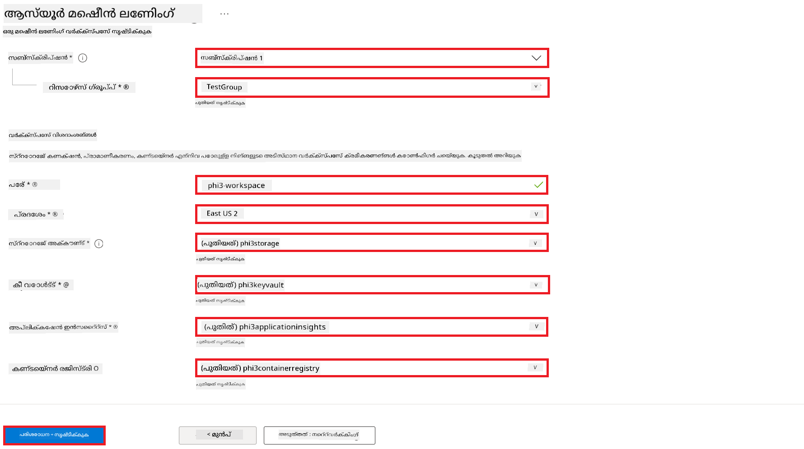
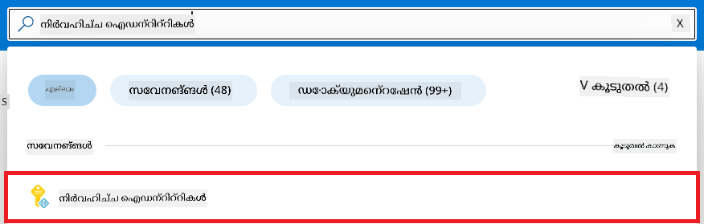
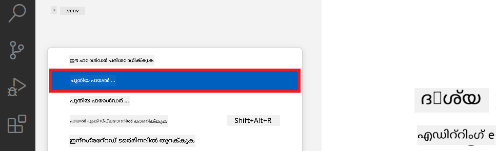
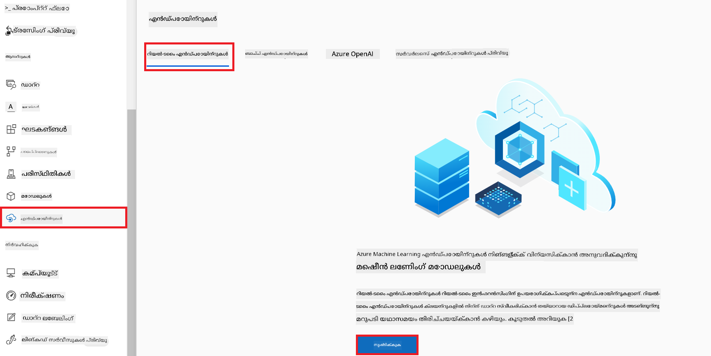
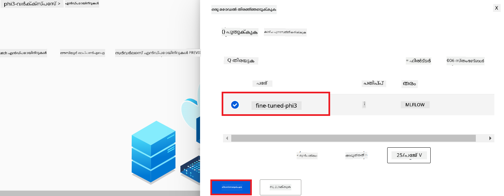
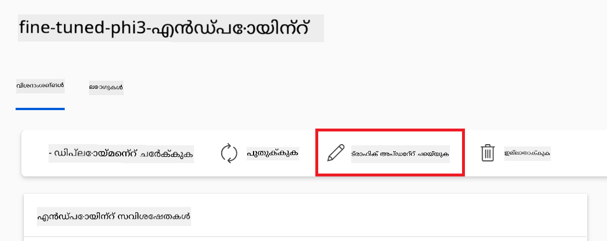
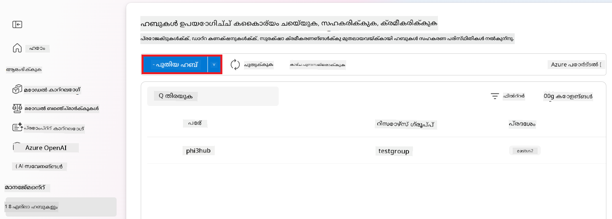
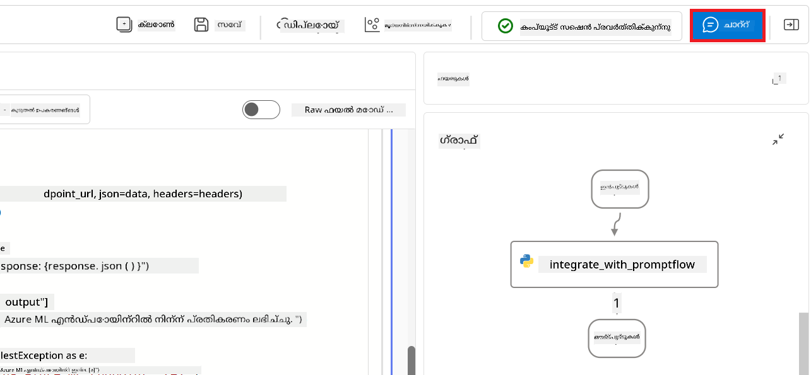

<!--
CO_OP_TRANSLATOR_METADATA:
{
  "original_hash": "ecbd9179a21edbaafaf114d47f09f3e3",
  "translation_date": "2025-12-21T20:47:47+00:00",
  "source_file": "md/02.Application/01.TextAndChat/Phi3/E2E_Phi-3-FineTuning_PromptFlow_Integration_AIFoundry.md",
  "language_code": "ml"
}
-->
# Fine-tune and Integrate custom Phi-3 models with Prompt flow in Azure AI Foundry

This end-to-end (E2E) sample is based on the guide "[Phi-3 മോഡലുകൾ Fine-Tune ചെയ്ത് Azure AI Foundry-ലിൽ Prompt Flow-യുമായി ഇന്റഗ്രേറ്റുചെയ്യൽ](https://techcommunity.microsoft.com/t5/educator-developer-blog/fine-tune-and-integrate-custom-phi-3-models-with-prompt-flow-in/ba-p/4191726?WT.mc_id=aiml-137032-kinfeylo)" from the Microsoft Tech Community. It introduces the processes of fine-tuning, deploying, and integrating custom Phi-3 models with Prompt flow in Azure AI Foundry.
Unlike the E2E sample, "[Fine-Tune and Integrate Custom Phi-3 Models with Prompt Flow](./E2E_Phi-3-FineTuning_PromptFlow_Integration.md)", which involved running code locally, this tutorial focuses entirely on fine-tuning and integrating your model within the Azure AI / ML Studio.

## Overview

In this E2E sample, you will learn how to fine-tune the Phi-3 model and integrate it with Prompt flow in Azure AI Foundry. By leveraging Azure AI / ML Studio, you will establish a workflow for deploying and utilizing custom AI models. This E2E sample is divided into three scenarios:

**Scenario 1: Set up Azure resources and Prepare for fine-tuning**

**Scenario 2: Fine-tune the Phi-3 model and Deploy in Azure Machine Learning Studio**

**Scenario 3: Integrate with Prompt flow and Chat with your custom model in Azure AI Foundry**

Here is an overview of this E2E sample.


### Table of Contents

1. **[Scenario 1: Set up Azure resources and Prepare for fine-tuning](../../../../../../md/02.Application/01.TextAndChat/Phi3)**
    - [Create an Azure Machine Learning Workspace](../../../../../../md/02.Application/01.TextAndChat/Phi3)
    - [Request GPU quotas in Azure Subscription](../../../../../../md/02.Application/01.TextAndChat/Phi3)
    - [Add role assignment](../../../../../../md/02.Application/01.TextAndChat/Phi3)
    - [Set up project](../../../../../../md/02.Application/01.TextAndChat/Phi3)
    - [Prepare dataset for fine-tuning](../../../../../../md/02.Application/01.TextAndChat/Phi3)

1. **[Scenario 2: Fine-tune Phi-3 model and Deploy in Azure Machine Learning Studio](../../../../../../md/02.Application/01.TextAndChat/Phi3)**
    - [Fine-tune the Phi-3 model](../../../../../../md/02.Application/01.TextAndChat/Phi3)
    - [Deploy the fine-tuned Phi-3 model](../../../../../../md/02.Application/01.TextAndChat/Phi3)

1. **[Scenario 3: Integrate with Prompt flow and Chat with your custom model in Azure AI Foundry](../../../../../../md/02.Application/01.TextAndChat/Phi3)**
    - [Integrate the custom Phi-3 model with Prompt flow](../../../../../../md/02.Application/01.TextAndChat/Phi3)
    - [Chat with your custom Phi-3 model](../../../../../../md/02.Application/01.TextAndChat/Phi3)

## Scenario 1: Set up Azure resources and Prepare for fine-tuning

### Create an Azure Machine Learning Workspace

1. Type *azure machine learning* in the **search bar** at the top of the portal page and select **Azure Machine Learning** from the options that appear.

    

2. Select **+ Create** from the navigation menu.

3. Select **New workspace** from the navigation menu.

    

4. Perform the following tasks:

    - Select your Azure **Subscription**.
    - Select the **Resource group** to use (create a new one if needed).
    - Enter **Workspace Name**. It must be a unique value.
    - Select the **Region** you'd like to use.
    - Select the **Storage account** to use (create a new one if needed).
    - Select the **Key vault** to use (create a new one if needed).
    - Select the **Application insights** to use (create a new one if needed).
    - Select the **Container registry** to use (create a new one if needed).

    

5. Select **Review + Create**.

6. Select **Create**.

### Request GPU quotas in Azure Subscription

In this tutorial, you will learn how to fine-tune and deploy a Phi-3 model, using GPUs. For fine-tuning, you will use the *Standard_NC24ads_A100_v4* GPU, which requires a quota request. For deployment, you will use the *Standard_NC6s_v3* GPU, which also requires a quota request.

> [!NOTE]
>
> Only Pay-As-You-Go subscriptions (the standard subscription type) are eligible for GPU allocation; benefit subscriptions are not currently supported.
>

1. Visit [Azure ML Studio](https://ml.azure.com/home?wt.mc_id=studentamb_279723).

1. Perform the following tasks to request *Standard NCADSA100v4 Family* quota:

    - Select **Quota** from the left side tab.
    - Select the **Virtual machine family** to use. For example, select **Standard NCADSA100v4 Family Cluster Dedicated vCPUs**, which includes the *Standard_NC24ads_A100_v4* GPU.
    - Select the **Request quota** from the navigation menu.

        

    - Inside the Request quota page, enter the **New cores limit** you'd like to use. For example, 24.
    - Inside the Request quota page, select **Submit** to request the GPU quota.

1. Perform the following tasks to request *Standard NCSv3 Family* quota:

    - Select **Quota** from the left side tab.
    - Select the **Virtual machine family** to use. For example, select **Standard NCSv3 Family Cluster Dedicated vCPUs**, which includes the *Standard_NC6s_v3* GPU.
    - Select the **Request quota** from the navigation menu.
    - Inside the Request quota page, enter the **New cores limit** you'd like to use. For example, 24.
    - Inside the Request quota page, select **Submit** to request the GPU quota.

### Add role assignment

To fine-tune and deploy your models, you must first create a User Assigned Managed Identity (UAI) and assign it the appropriate permissions. This UAI will be used for authentication during deployment

#### Create User Assigned Managed Identity(UAI)

1. Type *managed identities* in the **search bar** at the top of the portal page and select **Managed Identities** from the options that appear.

    

1. Select **+ Create**.

    

1. Perform the following tasks:

    - Select your Azure **Subscription**.
    - Select the **Resource group** to use (create a new one if needed).
    - Select the **Region** you'd like to use.
    - Enter the **Name**. It must be a unique value.

    

1. Select **Review + create**.

1. Select **+ Create**.

#### Add Contributor role assignment to Managed Identity

1. Navigate to the Managed Identity resource that you created.

1. Select **Azure role assignments** from the left side tab.

1. Select **+Add role assignment** from the navigation menu.

1. Inside Add role assignment page, Perform the following tasks:
    - Select the **Scope** to **Resource group**.
    - Select your Azure **Subscription**.
    - Select the **Resource group** to use.
    - Select the **Role** to **Contributor**.

    

2. Select **Save**.

#### Add Storage Blob Data Reader role assignment to Managed Identity

1. Type *storage accounts* in the **search bar** at the top of the portal page and select **Storage accounts** from the options that appear.

    

1. Select the storage account that associated with the Azure Machine Learning workspace that you created. For example, *finetunephistorage*.

1. Perform the following tasks to navigate to Add role assignment page:

    - Navigate to the Azure Storage account that you created.
    - Select **Access Control (IAM)** from the left side tab.
    - Select **+ Add** from the navigation menu.
    - Select **Add role assignment** from the navigation menu.

    

1. Inside Add role assignment page, Perform the following tasks:

    - Inside the Role page, type *Storage Blob Data Reader* in the **search bar** and select **Storage Blob Data Reader** from the options that appear.
    - Inside the Role page, select **Next**.
    - Inside the Members page, select **Assign access to** **Managed identity**.
    - Inside the Members page, select **+ Select members**.
    - Inside Select managed identities page, select your Azure **Subscription**.
    - Inside Select managed identities page, select the **Managed identity** to **Manage Identity**.
    - Inside Select managed identities page, select the Manage Identity that you created. For example, *finetunephi-managedidentity*.
    - Inside Select managed identities page, select **Select**.

    

1. Select **Review + assign**.

#### Add AcrPull role assignment to Managed Identity

1. Type *container registries* in the **search bar** at the top of the portal page and select **Container registries** from the options that appear.

    

1. Select the container registry that associated with the Azure Machine Learning workspace. For example, *finetunephicontainerregistry*

1. Perform the following tasks to navigate to Add role assignment page:

    - Select **Access Control (IAM)** from the left side tab.
    - Select **+ Add** from the navigation menu.
    - Select **Add role assignment** from the navigation menu.

1. Inside Add role assignment page, Perform the following tasks:

    - Inside the Role page, Type *AcrPull* in the **search bar** and select **AcrPull** from the options that appear.
    - Inside the Role page, select **Next**.
    - Inside the Members page, select **Assign access to** **Managed identity**.
    - Inside the Members page, select **+ Select members**.
    - Inside Select managed identities page, select your Azure **Subscription**.
    - Inside Select managed identities page, select the **Managed identity** to **Manage Identity**.
    - Inside Select managed identities page, select the Manage Identity that you created. For example, *finetunephi-managedidentity*.
    - Inside Select managed identities page, select **Select**.
    - Select **Review + assign**.

### Set up project

To download the datasets needed for fine-tuning, you will set up a local environment.

In this exercise, you will

- Create a folder to work inside it.
- Create a virtual environment.
- Install the required packages.
- Create a *download_dataset.py* file to download the dataset.

#### Create a folder to work inside it

1. Open a terminal window and type the following command to create a folder named *finetune-phi* in the default path.

    ```console
    mkdir finetune-phi
    ```

2. നിങ്ങളുടെ ടെർമിനലിൽ താഴെ കാണിച്ചിരുന്ന കമാൻഡ് ടൈപ്പ് ചെയ്ത് നിങ്ങൾ സൃഷ്ടിച്ച *finetune-phi* ഫോൾഡറിൽ നാവിഗേറ്റ് ചെയ്യുക.

    ```console
    cd finetune-phi
    ```

#### ഒരു വെർച്വൽ എൻവയോൺമെന്റ് സൃഷ്ടിക്കുക

1. നിങ്ങളുടെ ടെർമിനലിൽ താഴെ കൊടുത്ത കമാൻഡ് ടൈപ്പ് ചെയ്ത് *.venv* എന്ന പേരിലുള്ള ഒരു വെർച്വൽ എൻവയോൺമെന്റ് സൃഷ്ടിക്കുക.

    ```console
    python -m venv .venv
    ```

2. വെർച്വൽ എൻവയോൺമെന്റ് സജീവമാക്കാനായി നിങ്ങളുടെ ടെർമിനലിൽ താഴെ കാണുന്ന കമാൻഡ് ടൈപ്പ് ചെയ്യുക.

    ```console
    .venv\Scripts\activate.bat
    ```

> [!NOTE]
> പ്രവർത്തിച്ചുവെങ്കിൽ, കമാൻഡ് പ്രോംപ്റ്റിനു മുൻപ് *(.venv)* എന്ന് കാണണം.

#### ആവശ്യമായ പാക്കേജുകൾ ഇൻസ്റ്റാൾ ചെയ്യുക

1. ആവശ്യമായ പാക്കേജുകൾ ഇൻസ്റ്റാൾ ചെയ്യാൻ您的 ടെർമിനലിൽ താഴെ കാണുന്ന കമാൻഡുകൾ ടൈപ്പ് ചെയ്യുക.

    ```console
    pip install datasets==2.19.1
    ```

#### `donload_dataset.py` സൃഷ്ടിക്കുക

> [!NOTE]
> പൂർണ്ണ ഫോൾഡർ ഘടന:
>
> ```text
> └── YourUserName
> .    └── finetune-phi
> .        └── download_dataset.py
> ```

1. **Visual Studio Code** തുറക്കുക.

1. മെനു ബാറിൽ നിന്ന് **File** തിരഞ്ഞെടുക്കുക.

1. **Open Folder** തിരഞ്ഞെടുക്കുക.

1. നിങ്ങൾ സൃഷ്ടിച്ച *finetune-phi* ഫോൾഡർ തിരഞ്ഞെടുക്കുക, ഇത് *C:\Users\yourUserName\finetune-phi*ൽ സ്ഥിതിചെയ്യുന്നു.

    

1. Visual Studio Codeയുടെ ഇടത് പേനയിൽ റൈറ്റ്-ക്ലിക്ക് ചെയ്ത് **New File** തിരഞ്ഞെടുക്കുക, *download_dataset.py* എന്ന പുതിയ ഫയൽ സൃഷ്ടിക്കാൻ.

    

### ഫൈൻ-ട്യൂണിംഗിനായുള്ള ഡാറ്റാസെറ്റ് തയ്യാറാക്കുക

ഈ അഭ്യാസത്തിൽ, നിങ്ങൾ *download_dataset.py* ഫയൽ പ്രവർത്തിപ്പിച്ച് *ultrachat_200k* ഡാറ്റാസെറ്റുകൾ നിങ്ങളുടെ ലോക്കൽ എൻവയോൺമെന്റിലേക്ക് ഡൗൺലോഡ് ചെയ്യും. പിന്നീട് ഈ ഡാറ്റാസെറ്റുകൾ ഉപയോഗിച്ച് Azure Machine Learning-ൽ Phi-3 മോഡൽ ഫൈൻ-ട്യൂൺ ചെയ്യുന്നതിന് ഉപയോഗിക്കും.

ഈ അഭ്യാസത്തിൽ, നിങ്ങൾ ചെയ്യുന്നത്:

- ഡാറ്റാസെറ്റുകൾ ഡൗൺലോഡ് ചെയ്യാൻ *download_dataset.py* ഫയലിൽ കോഡ് ചേർക്കുക.
- ഡാറ്റാസെറ്റുകൾ നിങ്ങളുടെ ലോക്കൽ എൻവയോൺമെന്റിലേക്ക് ഡൗൺലോഡ് ചെയ്യാൻ *download_dataset.py* ഫയൽ റൺ ചെയ്യുക.

#### *download_dataset.py* ഉപയോഗിച്ച് നിങ്ങളുടെ ഡാറ്റാസെറ്റ് ഡൗൺലോഡ് ചെയ്യുക

1. Visual Studio Code-ൽ *download_dataset.py* ഫയൽ തുറക്കുക.

1. *download_dataset.py* ഫയലിലേക്ക് താഴെ കാണുന്ന കോഡ് ചേർക്കുക.

    ```python
    import json
    import os
    from datasets import load_dataset

    def load_and_split_dataset(dataset_name, config_name, split_ratio):
        """
        Load and split a dataset.
        """
        # നിർദ്ദിഷ്ട നാമം, ക്രമീകരണം, വിഭജനാനുപാതം എന്നിവയോടെ ഡാറ്റാസെറ്റ് ലോഡ് ചെയ്യുക
        dataset = load_dataset(dataset_name, config_name, split=split_ratio)
        print(f"Original dataset size: {len(dataset)}")
        
        # ഡാറ്റാസെറ്റ് ട്രെയിൻ மற்றும் ടെസ്റ്റ് സെറ്റുകളായി വിഭജിക്കുക (80% ട്രെയിൻ, 20% ടെസ്റ്റ്)
        split_dataset = dataset.train_test_split(test_size=0.2)
        print(f"Train dataset size: {len(split_dataset['train'])}")
        print(f"Test dataset size: {len(split_dataset['test'])}")
        
        return split_dataset

    def save_dataset_to_jsonl(dataset, filepath):
        """
        Save a dataset to a JSONL file.
        """
        # ഡയറക്ടറി ഇല്ലെങ്കിൽ സൃഷ്ടിക്കുക
        os.makedirs(os.path.dirname(filepath), exist_ok=True)
        
        # ഫയൽ എഴുത്ത് മോഡിൽ തുറക്കുക
        with open(filepath, 'w', encoding='utf-8') as f:
            # ഡാറ്റാസെറ്റിലെ ഓരോ റെക്കോർഡിലുടയെയും ആവർത്തിച്ച് പോകുക
            for record in dataset:
                # റെക്കോർഡിനെ JSON ഒബ്ജക്റ്റായി ഡംപ് ചെയ്ത് ഫയലിൽ എഴുതുക
                json.dump(record, f)
                # റെക്കോർഡുകൾ വേർതിരിക്കാൻ ഒരു ന്യൂലൈൻ ചിഹ്നം എഴുതി ചേർക്കുക
                f.write('\n')
        
        print(f"Dataset saved to {filepath}")

    def main():
        """
        Main function to load, split, and save the dataset.
        """
        # നിർദ്ദിഷ്ട ക്രമീകരണവും വിഭജനാനുപാതവുമായി ULTRACHAT_200k ഡാറ്റാസെറ്റ് ലോഡ് ചെയ്ത് വിഭജിക്കുക
        dataset = load_and_split_dataset("HuggingFaceH4/ultrachat_200k", 'default', 'train_sft[:1%]')
        
        # വിഭജിച്ച ഭാഗങ്ങളിൽ നിന്ന് ട്രെയിൻയും ടെസ്റ്റും ഡാറ്റാസെറ്റുകളും പുറത്തെടുക്കുക
        train_dataset = dataset['train']
        test_dataset = dataset['test']

        # ട്രെയിൻ ഡാറ്റാസെറ്റ് JSONL ഫയലായി സൂക്ഷിക്കുക
        save_dataset_to_jsonl(train_dataset, "data/train_data.jsonl")
        
        # ടെസ്റ്റ് ഡാറ്റാസെറ്റ് വേറൊരു JSONL ഫയലായി സൂക്ഷിക്കുക
        save_dataset_to_jsonl(test_dataset, "data/test_data.jsonl")

    if __name__ == "__main__":
        main()

    ```

1. സ്ക്രിപ്റ്റ് റൺ ചെയ്ത് ഡാറ്റാസെറ്റ് നിങ്ങളുടെ ലോക്കൽ എൻവയോൺമെന്റിലേക്ക് ഡൗൺലോഡ് ചെയ്യാൻ താഴെയുള്ള കമാൻഡ് നിങ്ങളുടെ ടെർമിനലിൽ ടൈപ്പ് ചെയ്യുക.

    ```console
    python download_dataset.py
    ```

1. ഡാറ്റാസെറ്റുകൾ നിങ്ങളുടെ ലോക്കൽ *finetune-phi/data* ഡയറക്ടറിയിൽ വിജയകരമായി സേവ് ചെയ്തിട്ടുണ്ടോ എന്ന് സ്ഥിരീകരിക്കുക.

> [!NOTE]
>
> #### ഡാറ്റാസെറ്റിന്റെ വലുപ്പവും ഫൈൻ-ട്യൂണിംഗ് സമയവും സംബന്ധിച്ച കുറിപ്പ്
>
> ഈ ട്യൂട്ടോറിയലിൽ, നിങ്ങൾ ഡാറ്റാസെറ്റിന്റെ 1% മാത്രമേ ഉപയോഗിക്കുകയുള്ളു (`split='train[:1%]'`). ഇത് ഡാറ്റയുടെ അളവ് ഗണ്യമായി കുറയ്ക്കുന്നു, അപ്ലോഡും ഫൈൻ-ട്യൂണിംഗും ഇരുവരുടെയും സമയമൊക്കെ വേഗമാക്കുന്നു. ശിക്ഷണസമയംയും മോഡൽ പ്രകടനത്തിനുമിടയിൽ ശരിയായ സുമേളം കണ്ടെത്താൻ ശതമാനം ക്രമീകരിക്കാവും. ഡാറ്റാസെറ്റിന്റെ ചെറിയ ഒരു ഉപസെറ്റ് ഉപയോഗിക്കുന്നത് ഫൈൻ-ട്യൂണിംഗിന് ആവശ്യമായ സമയം കുറക്കുകയും ട്യൂട്ടോറിയലിനു അനുയോജ്യമായ രീതിയിൽ പ്രക്രിയയെ എളുപ്പമാക്കുകയും ചെയ്യുന്നു.

## സാഹചര്യാവസ്ഥ 2: Phi-3 മോഡൽ ഫൈൻ-ട്യൂൺ ചെയ്ത് Azure Machine Learning Studio-ൽ ഡിപ്ലോയ് ചെയ്യുക

### Phi-3 മോഡൽ ഫൈൻ-ട്യൂൺ ചെയ്യുക

ഈ അഭ്യാസത്തിൽ, നിങ്ങൾ Azure Machine Learning Studio-ൽ Phi-3 മോഡൽ ഫൈൻ-ട്യൂൺ ചെയ്യും.

ഈ അഭ്യാസത്തിൽ, നിങ്ങൾ ചെയ്യുന്നത്:

- ഫൈൻ-ട്യൂണിംഗിനായി കമ്പ്യൂട്ടർ ക്ലസ്റ്റർ സൃഷ്ടിക്കുക.
- Azure Machine Learning Studio-ൽ Phi-3 മോഡൽ ഫൈൻ-ട്യൂൺ ചെയ്യുക.

#### ഫൈൻ-ട്യൂണിംഗിന് കമ്പ്യൂട്ടർ ക്ലസ്റ്റർ സൃഷ്ടിക്കുക

1. [Azure ML Studio](https://ml.azure.com/home?wt.mc_id=studentamb_279723) സന്ദർശിക്കുക.

1. ഇടത് ടാബിൽ നിന്ന് **Compute** തിരഞ്ഞെടുക്കുക.

1. നാവിഗേഷൻ മെനുവിൽ നിന്ന് **Compute clusters** തിരഞ്ഞെടുക്കുക.

1. **+ New** തിരഞ്ഞെടുക്കുക.

    

1. താഴെ പറയുന്ന കാര്യങ്ങൾ ചെയ്യുക:

    - നിങ്ങൾ ഉപയോഗിക്കാനാഗ്രഹിക്കുന്ന **Region** തിരഞ്ഞെടുക്കുക.
    - **Virtual machine tier**-നെ **Dedicated** ആയി തിരഞ്ഞെടുക്കുക.
    - **Virtual machine type**-നെ **GPU** ആയി തിരഞ്ഞെടുക്കുക.
    - **Virtual machine size** ഫിൽട്ടറിൽ **Select from all options** തിരഞ്ഞെടുക്കുക.
    - **Virtual machine size**-നെ **Standard_NC24ads_A100_v4** ആയി തിരഞ്ഞെടുക്കുക.

    

1. **Next** തിരഞ്ഞെടുക്കുക.

1. താഴെ പറയുന്ന കാര്യങ്ങൾ ചെയ്യുക:

    - **Compute name** നൽകുക. ഇത് ഒരു അനന്യമായ മൂല്യം ആയിരിക്കണം.
    - **Minimum number of nodes**-നെ **0** ആയി തിരഞ്ഞെടുക്കുക.
    - **Maximum number of nodes**-നെ **1** ആയി തിരഞ്ഞെടുക്കുക.
    - **Idle seconds before scale down**-നെ **120** ആയി തിരഞ്ഞെടുക്കുക.

    

1. **Create** തിരഞ്ഞെടുക്കുക.

#### Phi-3 മോഡൽ ഫൈൻ-ട്യൂൺ ചെയ്യുക

1. [Azure ML Studio](https://ml.azure.com/home?wt.mc_id=studentamb_279723) സന്ദർശിക്കുക.

1. നിങ്ങൾ സൃഷ്ടിച്ച Azure Machine Learning workspace തിരഞ്ഞെടുക്കുക.

    

1. താഴെ പറയുന്ന കാര്യങ്ങൾ ചെയ്യുക:

    - ഇടത് ടാബിൽ നിന്ന് **Model catalog** തിരഞ്ഞെടുക്കുക.
    - **search bar**-ൽ *phi-3-mini-4k* ടൈപ്പ് ചെയ്യുകയും ഉണ്ടാകുന്ന ഓപ്‌ഷനുകളിൽ നിന്നു **Phi-3-mini-4k-instruct** തിരഞ്ഞെടുക്കുകയും ചെയ്യുക.

    

1. നാവിഗേഷൻ മെനുവിൽ നിന്ന് **Fine-tune** തിരഞ്ഞെടുക്കുക.

    

1. താഴെ പറയുന്ന കാര്യങ്ങൾ ചെയ്യുക:

    - **Select task type**-നെ **Chat completion** ആയി തിരഞ്ഞെടുക്കുക.
    - **+ Select data** തിരഞ്ഞെടുക്കുക, **Traning data** അപ്ലോഡ് ചെയ്യാൻ.
    - Validation data അപ്ലോഡ് ടൈപ്പ് **Provide different validation data** ആയി തിരഞ്ഞെടുക്കുക.
    - **+ Select data** തിരഞ്ഞെടുക്കുക, **Validation data** അപ്ലോഡ് ചെയ്യാൻ.

    

    > [!TIP]
    >
    > നിങ്ങൾക്ക് നിങ്ങളുടെ പ്രത്യേക ആവശ്യങ്ങൾക്ക് അനുസരിച്ച് ഫൈൻ-ട്യൂണിംഗ് പ്രക്രിയ മെച്ചപ്പെടുത്താൻ **learning_rate** һәм **lr_scheduler_type** പോലുള്ള ക്രമീകരണങ്ങൾ ഇഷ്‌ടാനുസൃതമാക്കാൻ **Advanced settings** തിരഞ്ഞെടുക്കാവുന്നതാണ്.

1. **Finish** തിരഞ്ഞെടുക്കുക.

1. ഈ അഭ്യാസത്തിൽ, നിങ്ങൾ Azure Machine Learning ഉപയോഗിച്ച് വിജയകരമായി Phi-3 മോഡൽ ഫൈൻ-ട്യൂൺ ചെയ്തു. ദയവായി ശ്രദ്ധിക്കുക, ഫൈൻ-ട്യൂണിംഗ് പ്രക്രിയ ഏറെ സമയമെടുക്കാം. ഫൈൻ-ട്യൂണിംഗ് ജോബ് പ്രവർത്തിപ്പിച്ചതിനുശേഷം അത് പൂർത്തിയായതിൽ കാത്തിരിക്കണം. Azure Machine Learning Workspace-യുടെ ഇടത് ഭാഗത്തിലുള്ള Jobs ടാബിലേക്ക് പോയി ഫൈൻ-ട്യൂൺ ജോബിന്റെ സ്ഥിതി നിരീക്ഷിക്കാവുന്നതാണ്. അടുത്ത ഭാഗത്തിൽ, നിങ്ങൾ ഫൈൻ-ട്യൂൺ ചെയ്ത മോഡൽ ഡിപ്ലോയ് ചെയ്ത് അത് Prompt flow-യുമായി ഇന്റഗ്രേറ്റ് ചെയ്യുന്നതാണ്.

    

### ഫൈൻ-ട്യൂൺ ചെയ്ത Phi-3 മോഡൽ ഡിപ്ലോയ് ചെയ്യുക

ഫൈൻ-ട്യൂൺ ചെയ്ത Phi-3 മോഡൽ Prompt flow-യുമായി ഇന്റഗ്രേറ്റ് ചെയ്യാൻ, റിയൽ ടൈം ഇൻഫറൻസിനായി ആ മോഡൽ ആക്‌സസ് ചെയ്യാവുന്നതാക്കാൻ നിങ്ങൾ അത് ഡിപ്ലോയ് ചെയ്യേണ്ടതാണ്. ഈ പ്രക്രിയ മോഡൽ രജിസ്റ്റർ ചെയ്യലും, ഒരു ഓൺലൈൻ എന്റ്പോയിന്റ് സൃഷ്ടിക്കലും, മോഡൽ ഡിപ്ലോയ് ചെയ്യലും ഉൾക്കൊള്ളുന്നു.

ഈ അഭ്യാസത്തിൽ, നിങ്ങൾ ചെയ്യുന്നത്:

- Azure Machine Learning workspace-ൽ ഫൈൻ-ട്യൂൺ ചെയ്ത മോഡൽ രജിസ്റ്റർ ചെയ്യുക.
- ഒരു ഓൺലൈൻ എന്റ്പോയിന്റ് സൃഷ്ടിക്കുക.
- രജിസ്റ്റർ ചെയ്ത ഫൈൻ-ട്യൂൺ ചെയ്ത Phi-3 മോഡൽ ഡിപ്ലോയ് ചെയ്യുക.

#### ഫൈൻ-ട്യൂൺ ചെയ്ത മോഡൽ രജിസ്റ്റർ ചെയ്യുക

1. [Azure ML Studio](https://ml.azure.com/home?wt.mc_id=studentamb_279723) സന്ദർശിക്കുക.

1. നിങ്ങൾ സൃഷ്ടിച്ച Azure Machine Learning workspace തിരഞ്ഞെടുക്കുക.

    

1. ഇടത് ടാബിൽ നിന്ന് **Models** തിരഞ്ഞെടുക്കുക.
1. **+ Register** തിരഞ്ഞെടുക്കുക.
1. **From a job output** തിരഞ്ഞെടുക്കുക.

    

1. നിങ്ങൾ സൃഷ്ടിച്ച ജോബ് തിരഞ്ഞെടുക്കുക.

    

1. **Next** തിരഞ്ഞെടുക്കുക.

1. **Model type**-നെ **MLflow** ആയി തിരഞ്ഞെടുക്കുക.

1. **Job output** തിരഞ്ഞെടുത്തിരിക്കുന്നതായി ഉറപ്പാക്കുക; സാധാരണയായി ഇത് സ്വയം തിരഞ്ഞെടുത്തിരിക്കണം.

    

2. **Next** തിരഞ്ഞെടുക്കുക.

3. **Register** തിരഞ്ഞെടുക്കുക.

    

4. ഇടത് ടാബിൽ നിന്ന് **Models** മെനുവിലേക്ക് പോകുമ്പോൾ നിങ്ങൾ രജിസ്റ്റർ ചെയ്ത മോഡൽ കാണാവുന്നതാണ്.

    

#### ഫൈൻ-ട്യൂൺ ചെയ്ത മോഡൽ ഡിപ്ലോയ് ചെയ്യുക

1. നിങ്ങൾ സൃഷ്ടിച്ച Azure Machine Learning workspace-ിലേക്ക് നാവിഗേറ്റ് ചെയ്യുക.

1. ഇടത് ടാബിൽ നിന്ന് **Endpoints** തിരഞ്ഞെടുക്കുക.

1. നാവിഗേഷൻ മെനുവിൽ നിന്ന് **Real-time endpoints** തിരഞ്ഞെടുക്കുക.

    

1. **Create** തിരഞ്ഞെടുക്കുക.

1. നിങ്ങൾ രജിസ്റ്റർ ചെയ്ത മോഡൽ തിരഞ്ഞെടുക്കുക.

    

1. **Select** തിരഞ്ഞെടുക്കുക.

1. താഴെ പറയുന്ന കാര്യങ്ങൾ ചെയ്യുക:

    - **Virtual machine**-നെ *Standard_NC6s_v3* ആയി തിരഞ്ഞെടുക്കുക.
    - നിങ്ങൾ ഉപയോഗിക്കാൻ താല്പര്യമുള്ള **Instance count** തിരഞ്ഞെടുക്കുക. ഉദാഹരണത്തിന്, *1*.
    - എന്റ്പോയിന്റ് സൃഷ്ടിക്കാനായി **Endpoint**-നെ **New** ആയി തിരഞ്ഞെടുക്കുക.
    - **Endpoint name** നൽകുക. ഇത് ഒരു അനന്യമായ മൂല്യമാകണം.
    - **Deployment name** നൽകുക. ഇത് ഒരു അനന്യമായ മൂല്യമാകണം.

    

1. **Deploy** തിരഞ്ഞെടുക്കുക.

> [!WARNING]
> നിങ്ങളുടെ അക്കൗണ്ടിലേക്ക് അധിക ചാർജുകൾ വരത്തേടാൻ, Azure Machine Learning workspace-ൽ സൃഷ്ടിച്ച എന്റ്പോയിന്റ് حذف ചെയ്യുന്നതായി ഉറപ്പാക്കുക.
>

#### Azure Machine Learning Workspace-ൽ ഡിപ്ലോയ്‌മെന്റ് നില പരിശോധിക്കുക

1. നിങ്ങൾ സൃഷ്ടിച്ച Azure Machine Learning workspace-ിലേക്ക് നാവിഗേറ്റ് ചെയ്യുക.

1. ഇടത് ടാബിൽ നിന്ന് **Endpoints** തിരഞ്ഞെടുക്കുക.

1. നിങ്ങൾ സൃഷ്ടിച്ച എന്റ്പോയിന്റ് തിരഞ്ഞെടുക്കുക.

    

1. ഡിപ്ലോയ്‌മെന്റ് പ്രക്രിയയുടെയാണ് ഈ പേജിൽ എന്റ്പോയിന്റുകൾ മാനേജ് ചെയ്യാൻ കഴിയും.

> [!NOTE]
> ഡിപ്ലോയ്‌മെന്റ് പൂർത്തിയായതിനുശേഷം, **Live traffic** **100%** ആയി സജ്ജമാക്കിയിട്ടുണ്ടെന്ന് ഉറപ്പാക്കുക. ഇത് സജ്ജമല്ലെങ്കിൽ, ട്രാഫിക് ക്രമീകരണങ്ങൾ മാറ്റാൻ **Update traffic** തിരഞ്ഞെടുക്കുക. ട്രാഫിക് 0% ആയി സജ്ജമാക്കിയാൽ മോഡൽ ടെസ്റ്റ് ചെയ്യാൻ സാധിക്കില്ല എന്ന് ശ്രദ്ധിക്കുക.
>
> 
>

## സീനാരി 3: Prompt flow-യുമായി ഇന്റഗ്രേറ്റ് ചെയ്ത് Azure AI Foundry-ലിൽ നിങ്ങളുടെ കസ്റ്റം മോഡലുമായി ചാറ്റ് ചെയ്യുക

### Prompt flow-യുമായുള്ള കസ്റ്റം Phi-3 മോഡൽ ഇന്റഗ്രേഷൻ

ഫൈൻ-ട്യൂൺ ചെയ്ത മോഡൽ വിജയകരമായി ഡിപ്ലോയ് ചെയ്തതിനു ശേഷം, Prompt flow-യുമായി ഇന്റഗ്രേറ്റ് ചെയ്ത് നിങ്ങളുടെ മോഡൽ റിയൽ‑ടൈം ആപ്ലിക്കേഷനുകളിൽ ഉപയോഗിക്കാൻ കഴിയും, ഇത് നിങ്ങളുടെ കസ്റ്റം Phi-3 മോഡലോടെ വ്യത്യസ്തമായ ഇന്ററാക്ടീവ് ടാസ്ക്കുകൾ സജ്ജമാക്കുന്നു.

ഈ അഭ്യാസത്തിൽ, നിങ്ങൾ ചെയ്യുന്നത്:

- Azure AI Foundry Hub സൃഷ്ടിക്കുക.
- Azure AI Foundry Project സൃഷ്ടിക്കുക.
- Prompt flow സൃഷ്ടിക്കുക.
- ഫൈൻ-ട്യൂൺ ചെയ്ത Phi-3 മോഡലിന് ഒരു കസ്റ്റം കണക്ഷൻ ചേർക്കുക.
- Prompt flow ക്രമീകരിച്ച് നിങ്ങളുടെ കസ്റ്റം Phi-3 മോഡലുമായി ചാറ്റ് ചെയ്യുക

> [!NOTE]
> Azure ML Studio ഉപയോഗിച്ച് നിങ്ങൾ Promptflow-യുമായി ഇന്റഗ്രേറ്റ് ചെയ്യാനും കഴിയും. അതേ ഇന്റഗ്രേഷൻ പ്രക്രിയ Azure ML Studio-ലും പ്രയോഗിക്കാവുന്നതാണ്.

#### Azure AI Foundry Hub സൃഷ്ടിക്കുക

Project സൃഷ്ടിക്കുന്നതിന് മുമ്പ് നിങ്ങൾക്ക് ഒരു Hub സൃഷ്ടിക്കേണ്ടതുണ്ട്. Hub ഒരു Resource Group പോലെ പ്രവർത്തിച്ച് Azure AI Foundry-ൽ ഉള്ള പല Projects-കളെയും നിങ്ങൾക്ക് ക്രമീകരിച്ചു മാനേജ് ചെയ്യാൻ അനുവദിക്കുന്നു.

1. [Azure AI Foundry](https://ai.azure.com/?WT.mc_id=aiml-137032-kinfeylo) സന്ദർശിക്കുക.

1. ഇടത് ടാബിൽ നിന്ന് **All hubs** തിരഞ്ഞെടുക്കുക.

1. നാവിഗേഷൻ മെനുവിൽ നിന്ന് **+ New hub** തിരഞ്ഞെടുക്കുക.
    

1. താഴെ പറയുന്ന ദൗത്യം നിർവഹിക്കുക:

    - **Hub name** നൽകുക. ഇത് ഒരു ഏകദേശം വ്യത്യസ്തമായ മൂല്യം ആയിരിക്കണം.
    - നിങ്ങളുടെ Azure **Subscription** തിരഞ്ഞെടുക്കുക.
    - ഉപയോഗിക്കാൻ വേണ്ട **Resource group** തിരഞ്ഞെടുക്കുക (ആവശ്യമായാൽ പുതിയൊരുത് സൃഷ്ടിക്കുക).
    - ഉപയോഗിക്കാൻ ഇഷ്ടപ്പെട്ട **Location** തിരഞ്ഞെടുക്കുക.
    - ഉപയോഗിക്കാൻ വേണ്ട **Connect Azure AI Services** തിരഞ്ഞെടുക്കുക (ആവശ്യമായെങ്കിൽ പുതിയത് സൃഷ്ടിക്കുക).
    - **Connect Azure AI Search**-ൽ **Skip connecting** തിരഞ്ഞെടുക്കുക.

    

1. **Next** തിരഞ്ഞെടുക്കുക.

#### Azure AI Foundry പ്രോജക്ട് സൃഷ്ടിക്കുക

1. സൃഷ്ടിച്ച ഹബിൽ, ഇടത് പക്കത്തിന്റെ ടാബിൽ നിന്ന് **All projects** തിരഞ്ഞെടുക്കുക.

1. നാവിഗേഷൻ മെനുവിൽ നിന്ന് **+ New project** തിരഞ്ഞെടുക്കുക.

    

1. **Project name** നൽകുക. ഇത് ഒരു വ്യത്യസ്തമായ മൂല്യം ആയിരിക്കണം.

    

1. **Create a project** തിരഞ്ഞെടുക്കുക.

#### ഫൈൻ-ട്യൂൺ ചെയ്ത Phi-3 മോഡലിന്റെ ഒരു കസ്റ്റം കണക്ഷൻ ചേർക്കുക

നിങ്ങളുടെ കസ്റ്റം Phi-3 മോഡൽ Prompt flow-യുമായി സംയോജിപ്പിക്കാൻ, മോഡൽ ന്റെ എൻഡ്പോയിന്റും കീയും ഒരു കസ്റ്റം കണക്ഷനായി സേവ് ചെയ്യേണ്ടതാണ്. ഈ ക്രമീകരണം Prompt flow-ൽ നിങ്ങളുടെ കസ്റ്റം Phi-3 മോഡലിലേക്ക് ആക്സസ് ഉറപ്പാക്കും.

#### ഫൈൻ-ട്യൂൺ ചെയ്ത Phi-3 മോഡലിന്റെ api കീയും എൻഡ്പോയിന്റ് uriയും സജ്ജമാക്കുക

1. [Azure ML Studio](https://ml.azure.com/home?WT.mc_id=aiml-137032-kinfeylo) സന്ദർശിക്കുക.

1. നിങ്ങൾ സൃഷ്ടിച്ച Azure Machine learning workspace-ിലേക്ക് നാവിഗേറ്റ് ചെയ്യുക.

1. ഇടത് പക്കത്തിന്റെ ടാബിൽ നിന്നുള്ള **Endpoints** തിരഞ്ഞെടുക്കുക.

    

1. നിങ്ങൾ സൃഷ്ടിച്ച എൻഡ്പോയിന്റ് തിരഞ്ഞെടുക്കുക.

    

1. നാവിഗേഷൻ മെനുവിൽ നിന്ന് **Consume** തിരഞ്ഞെടുക്കുക.

1. നിങ്ങളുടെ **REST endpoint**വും **Primary key**വും കോപ്പി ചെയ്യുക.

    

#### കസ്റ്റം കണക്ഷൻ ചേർക്കുക

1. [Azure AI Foundry](https://ai.azure.com/?WT.mc_id=aiml-137032-kinfeylo) സന്ദർശിക്കുക.

1. നിങ്ങൾ സൃഷ്ടിച്ച Azure AI Foundry പ്രോജക്ടിലേക്ക് നാവിഗേറ്റ് ചെയ്യുക.

1. നിങ്ങൾ സൃഷ്ടിച്ച പ്രോജക്ടിൽ, ഇടത് പക്കത്തിന്റെ ടാബിൽ നിന്ന് **Settings** തിരഞ്ഞെടുക്കുക.

1. **+ New connection** തിരഞ്ഞെടുക്കുക.

    

1. നാവിഗേഷൻ മെനുവിൽ നിന്ന് **Custom keys** തിരഞ്ഞെടുക്കുക.

    

1. താഴെ പറയുന്ന നടപടികൾ നിർവഹിക്കുക:

    - **+ Add key value pairs** തിരഞ്ഞെടുക്കുക.
    - കീ നാമമായി **endpoint** നൽകികୋപി ചെയ്ത Azure ML Studio എൻഡ്പോയിന്റ് value ഫീൽഡില്‍ പേസ്റ്റ് ചെയ്യുക.
    - വീണ്ടും **+ Add key value pairs** തിരഞ്ഞെടുക്കുക.
    - കീ നാമമായി **key** നൽകുകയും Azure ML Studio-യിൽ നിന്നും കോപ്പി ചെയ്ത കീ value ഫീൽഡിൽ പേസ്റ്റ് ചെയ്യുക.
    - കീകൾ ചേർന്നതിന് ശേഷം, കീ പുറംവിപണിയിൽ കാണാതിരിക്കാനായി **is secret** തിരഞ്ഞെടുക്കുക.

    

1. **Add connection** തിരഞ്ഞെടുക്കുക.

#### Prompt flow സൃഷ്ടിക്കുക

നിങ്ങൾ Azure AI Foundry-ൽ ഒരു കസ്റ്റം കണക്ഷൻ ചേർത്തു. ഇപ്പോൾ താഴെ പറയുന്ന ഘട്ടങ്ങൾ പിന്തുടർന്ന് ഒരു Prompt flow സൃഷ്ടിക്കാം. തുടർന്ന്, Fine-tuned മോഡൽ Prompt flow-യിൽ ഉപയോഗിക്കാൻ ഈ Prompt flow-നെ കസ്റ്റം കണക്ഷനിലേക്ക് കണക്ട് ചെയ്യണം.

1. നിങ്ങൾ സൃഷ്ടിച്ച Azure AI Foundry പ്രോജക്ടിലേക്ക് നാവിഗേറ്റ് ചെയ്യുക.

1. ഇടത് പക്കത്തിന്റെ ടാബിൽ നിന്നുള്ള **Prompt flow** തിരഞ്ഞെടുക്കുക.

1. ნാവിഗേഷൻ മെനുവിൽ നിന്ന് **+ Create** തിരഞ്ഞെടുക്കുക.

    

1. നാവിഗേഷൻ മെനുവിൽ നിന്ന് **Chat flow** തിരഞ്ഞെടുക്കുക.

    

1. ഉപയോഗിക്കാൻ **Folder name** നൽകുക.

    

2. **Create** തിരഞ്ചുക.

#### നിങ്ങളുടെ കസ്റ്റം Phi-3 മോഡലുമായി ചാറ്റ് നടത്താൻ Prompt flow ക്രമീകരിക്കുക

നിങ്ങൾക്ക് ഫൈൻ-ട്യൂൺ ചെയ്ത Phi-3 മോഡൽ Prompt flow-യിലേക്ക് സംയോജിപ്പിക്കേണ്ടതാണ്. എന്നാൽ അനുബന്ധമായി ലഭിച്ച ദൈവം Prompt flow ഇതിന് ഒരുക്കപ്പെട്ടതല്ല. അതിനാൽ, കസ്റ്റം മോഡൽ സംയോജിപ്പിക്കാൻ Prompt flow പുനഃഡിസൈൻ ചെയ്യേണ്ടത് അവश्यकമാണ്.

1. Prompt flow-ൽ നിലവിലുള്ള ഫ്ലോ പുനർനിർമിക്കാൻ താഴെ പറയുന്ന കാര്യങ്ങൾ നിർവഹിക്കുക:

    - **Raw file mode** തിരഞ്ഞെടുക്കുക.
    - *flow.dag.yml* ഫയലിലെ നിലവിലുള്ള എല്ലാ കോഡുകളും ഇല്ലാതാക്കുക.
    - *flow.dag.yml* ഫയലിലേക്ക് താഴെ പറയുന്ന കോഡ് ചേർക്കുക.

        ```yml
        inputs:
          input_data:
            type: string
            default: "Who founded Microsoft?"

        outputs:
          answer:
            type: string
            reference: ${integrate_with_promptflow.output}

        nodes:
        - name: integrate_with_promptflow
          type: python
          source:
            type: code
            path: integrate_with_promptflow.py
          inputs:
            input_data: ${inputs.input_data}
        ```

    - **Save** തിരഞ്ഞെടുക്കുക.

    

1. Prompt flow-ൽ കസ്റ്റം Phi-3 മോഡൽ ഉപയോഗിക്കാൻ *integrate_with_promptflow.py* ഫയലിലേക്ക് താഴെ കാണുന്ന കോഡ് ചേർക്കുക.

    ```python
    import logging
    import requests
    from promptflow import tool
    from promptflow.connections import CustomConnection

    # ലോഗിംഗ് ക്രമീകരണം
    logging.basicConfig(
        format="%(asctime)s - %(levelname)s - %(name)s - %(message)s",
        datefmt="%Y-%m-%d %H:%M:%S",
        level=logging.DEBUG
    )
    logger = logging.getLogger(__name__)

    def query_phi3_model(input_data: str, connection: CustomConnection) -> str:
        """
        Send a request to the Phi-3 model endpoint with the given input data using Custom Connection.
        """

        # "connection" ആണ് Custom Connection-இന്റെ പേര്; "endpoint" және "key" Custom Connection-ൽ ഉള്ള കീകൾ ആണ്
        endpoint_url = connection.endpoint
        api_key = connection.key

        headers = {
            "Content-Type": "application/json",
            "Authorization": f"Bearer {api_key}"
        }
        data = {
            "input_data": {
                "input_string": [
                    {"role": "user", "content": input_data}
                ],
                "parameters": {
                    "temperature": 0.7,
                    "max_new_tokens": 128
                }
            }
        }
        try:
            response = requests.post(endpoint_url, json=data, headers=headers)
            response.raise_for_status()
            
            # പൂർണ്ണ JSON പ്രതികരണം ലോഗ് ചെയ്യുക
            logger.debug(f"Full JSON response: {response.json()}")

            result = response.json()["output"]
            logger.info("Successfully received response from Azure ML Endpoint.")
            return result
        except requests.exceptions.RequestException as e:
            logger.error(f"Error querying Azure ML Endpoint: {e}")
            raise

    @tool
    def my_python_tool(input_data: str, connection: CustomConnection) -> str:
        """
        Tool function to process input data and query the Phi-3 model.
        """
        return query_phi3_model(input_data, connection)

    ```

    

> [!NOTE]
> Azure AI Foundry-ൽ Prompt flow ഉപയോഗിച്ചുള്ള കൂടുതൽ വിശദമായ വിവരങ്ങൾക്ക്, നിങ്ങൾക്ക് [Prompt flow in Azure AI Foundry](https://learn.microsoft.com/azure/ai-studio/how-to/prompt-flow) കാണാവുന്നതാണ്.

1. **Chat input**, **Chat output** തിരഞ്ഞെടുക്കാതെ ഇല്ലാതാക്കുക (enable ചെയ്യുക) تاکہ നിങ്ങളുടെ മോഡലുമായി ചാറ്റ് നടത്താൻ സാധിക്കൂ.

    

1. ഇപ്പോൾ നിങ്ങൾക്ക് നിങ്ങളുടെ കസ്റ്റം Phi-3 മോഡലുമായി ചാറ്റ് ചെയ്യാൻ സജ്ജമാണ്. അടുത്ത അഭ്യാസത്തിൽ, Prompt flow ആരംഭിച്ച് ഫൈൻ-ട്യൂൺ ചെയ്ത Phi-3 മോഡലുമായി ചാറ്റ് ചെയ്യാൻ നിങ്ങൾ എങ്ങനെ തുടങ്ങാമെന്ന് പഠിപ്പിക്കും.

> [!NOTE]
>
> പുനർനിർമിച്ച ഫ്ലോ താഴെയുള്ള ചിത്രത്തിലെ പോലെയായിരിക്കണം:
>
> 
>

### നിങ്ങളുടെ കസ്റ്റം Phi-3 മോഡലുമായി ചാറ്റ് ചെയ്യുക

ഇപ്പോഴത്തെപ്പോൾ ഫൈൻ-ട്യൂണിങ്ങും നിങ്ങളുടെ കസ്റ്റം Phi-3 മോഡലിന്റെ Prompt flow-യിലേക്കുള്ള സംയോജനം പൂർത്തിയായി, അതിനാൽ ഇൻററാക്ട് ചെയ്യാൻ നിങ്ങൾ തയ്യാറാണ്. ഈ അഭ്യാസം Prompt flow ഉപയോഗിച്ച് നിങ്ങളുടെ മോഡലുമായി ചാറ്റ് ആരംഭിക്കുന്ന പ്രക്രിയയാണ് കൈകൊള്ളുന്നത്. ഈ ചുവടുകൾ പിന്തുടർന്ന്, ഫൈൻ-ട്യൂൺ ചെയ്ത Phi-3 മോഡലിന്റെ വിവിധ ടാസ്കുകളും സംഭാഷണ ശേഷികളും നിങ്ങൾ മുഴുവൻ ഉപയോഗിക്കാവുന്നതാണ്.

- Prompt flow ഉപയോഗിച്ച് നിങ്ങളുടെ കസ്റ്റം Phi-3 മോഡലുമായി ചാറ്റ് ചെയ്യുക.

#### Prompt flow ആരംഭിക്കുക

1. Prompt flow ആരംഭിക്കാൻ **Start compute sessions** തിരഞ്ഞെടുക്കുക.

    

1. പാരാമീറ്ററുകൾ പുതുക്കാൻ **Validate and parse input** തിരഞ്ഞെടുക്കുക.

    

1. നിങ്ങൾ സൃഷ്ടിച്ച കസ്റ്റം കണക്ഷനിലേക്ക് ഉള്ള **connection** ന്റെ **Value** തിരഞ്ഞെടുക്കുക. ഉദാഹരണത്തിന്, *connection*.

    

#### നിങ്ങളുടെ കസ്റ്റം മോഡലുമായി ചാറ്റ് ചെയ്യുക

1. **Chat** തിരഞ്ഞെടുക്കുക.

    

1. ഫലങ്ങളുടെ ഉദാഹരണം താഴെ കാണാം: ഇനി നിങ്ങൾക്ക് നിങ്ങളുടെ കസ്റ്റം Phi-3 മോഡലുമായി ചാറ്റ് ചെയ്യാം. ഫൈൻ-ട്യൂണിംഗിന് ഉപയോഗിച്ച ഡാറ്റയുടെ അടിസ്ഥാനത്തിൽ ചോദ്യങ്ങൾ ചോദിക്കാൻ ശുഭപ്പെടുത്തിയതാണ് ശിപാർശ ചെയ്യുന്നത്.

    

---

<!-- CO-OP TRANSLATOR DISCLAIMER START -->
ഡിസ്ക്ലെയിമർ:
ഈ documento AI അടിസ്ഥാനത്തിലുള്ള വിവർത്തന സേവനമായ Co‑op Translator (https://github.com/Azure/co-op-translator) ഉപയോഗിച്ച് വിവർത്തനം ചെയ്തതാണെന്ന് ശ്രദ്ധിക്കുക. ഞങ്ങൾ കൃത്യതയ്ക്ക് ശ്രമിക്കുന്നു എങ്കിലും സ്വയമേഖലായ വിവർത്തനങ്ങളിൽ പിശകുകളോ അസംബന്ധതകളോ ഉണ്ടാകാമെന്ന് ദയവായി ഗൗരവത്തോടെ കാണുക. മുഖ്യഭാഷയിലുള്ള മൂലരേഖയാണ് അധികൃത ഉറവിടമായി പരിഗണിക്കേണ്ടത്. നിർണ്ണായക വിവരങ്ങൾക്ക് പ്രൊഫഷണൽ മനുഷ്യവിവർത്തനം നിർദ്ദേശിക്കുന്നു. ഈ വിവർത്തനം ഉപയോഗിച്ചതിൽ നിന്നുണ്ടാകുന്ന any തെറ്റിദ്ധാരണങ്ങൾക്കോ തെറ്റായ വ്യാഖ്യാനങ്ങൾക്കോ ഞങ്ങൾ ഉത്തരവാദിയല്ല.
<!-- CO-OP TRANSLATOR DISCLAIMER END -->