# Azure AI Foundry-ൽ Prompt flow ഉപയോഗിച്ച് കസ്റ്റം Phi-3 മോഡലുകൾ ഫൈൻ-ട്യൂൺ ചെയ്യാനും സംയോജിപ്പിക്കാനും

Microsoft Tech Community-യിലെ "[Fine-Tune and Integrate Custom Phi-3 Models with Prompt Flow in Azure AI Foundry](https://techcommunity.microsoft.com/t5/educator-developer-blog/fine-tune-and-integrate-custom-phi-3-models-with-prompt-flow-in/ba-p/4191726?WT.mc_id=aiml-137032-kinfeylo)" എന്ന ഗൈഡിന്റെ അടിസ്ഥാനത്തിലാണ് ഈ End-to-End (E2E) സാമ്പിൾ. ഇത് Azure AI Foundry-യിൽ Prompt flow ഉപയോഗിച്ച് കസ്റ്റം Phi-3 മോഡലുകളുടെ ഫൈൻ-ട്യൂൺ, ഡിപ്ലോയ്മെന്റ്, സംയോജനം എന്നിവയുടെ പ്രക്രിയകൾ പരിചയപ്പെടുത്തുന്നു. "[Fine-Tune and Integrate Custom Phi-3 Models with Prompt Flow](./E2E_Phi-3-FineTuning_PromptFlow_Integration.md)" എന്ന E2E സാമ്പിളിനൊപ്പം കോഡ് ലോക്കലായി റൺ ചെയ്യുന്നതിൽ നിന്നും വ്യത്യസ്തമായി, ഈ ട്യൂട്ടോറിയൽ Azure AI / ML സ്റ്റുഡിയോളം നിങ്ങളുടെ മോഡലിന്റെ ഫൈൻ-ട്യൂണിംഗിലും സംയോജനത്തിലും മാത്രം കേന്ദ്രീകരിക്കുന്നു.

## അവലോകനം

ഈ E2E സാമ്പിളിൽ, Phi-3 മോഡൽ ഫൈൻ-ട്യൂൺ ചെയ്യാനും Azure AI Foundry-യിലെ Prompt flow-യുമായി സംയോജിപ്പിക്കാനും നിങ്ങൾക്ക് പഠിക്കാം. Azure AI / ML സ്റ്റുഡിയോ ഉപയോഗിച്ച് നിങ്ങളുടെ കസ്റ്റം AI മോഡലുകൾ ഡിപ്ലോയ് ചെയ്യാനും ഉപയോഗിക്കാനും പ്രവർത്തനന്തരം സ്ഥാപിക്കുന്നതാണ് ഇതിലൂടെ. ഈ E2E സാമ്പിൾ മൂന്ന് അവസ്ഥകളായി വിഭജിച്ചിരിക്കുന്നു:

**അവസ്ഥ 1: Azure സ്രോതസ്സുകൾ സജ്ജമാക്കുകയും ഫൈൻ-ട്യൂണിംഗിന് ഒരുക്കം നൽകുകയും ചെയ്യുക**

**അവസ്ഥ 2: Phi-3 മോഡൽ ഫൈൻ-ട്യൂൺ ചെയ്യുകയും Azure Machine Learning Studioയിൽ ഡിപ്ലോയ് ചെയ്യുകയും ചെയ്യുക**

**അവസ്ഥ 3: Prompt flow-യുമായി സംയോജിപ്പിക്കുകയും Azure AI Foundry-യിൽ നിങ്ങളുടെ കസ്റ്റം മോഡലുമായി ചാറ്റ് നടത്തുകയും ചെയ്യുക**

ഇതാണ് ഈ E2E സാമ്പിളിന്റെ അവലോകനം.


### വിഷയങ്ങൾ

1. **[അവസ്ഥ 1: Azure സ്രോതസ്സുകൾ സജ്ജമാക്കുകയും ഫൈൻ-ട്യൂണിംഗിന് ഒരുക്കം നൽകുകയും ചെയ്യുക](../../../../../../md/02.Application/01.TextAndChat/Phi3)**
    - [Azure Machine Learning Workspace സൃഷ്ടിക്കുക](../../../../../../md/02.Application/01.TextAndChat/Phi3)
    - [Azure Subscription-ൽ GPU ക്വോട്ടാകൾക്ക് അപേക്ഷിക്കുക](../../../../../../md/02.Application/01.TextAndChat/Phi3)
    - [Role រច្វിശേഷിപ്പിക്കൽ ചേർക്കുക](../../../../../../md/02.Application/01.TextAndChat/Phi3)
    - [പദ്ധതി സജ്ജമാക്കുക](../../../../../../md/02.Application/01.TextAndChat/Phi3)
    - [ഫൈൻ-ട്യൂണിംഗിന് Dataset തയ്യാറാക്കുക](../../../../../../md/02.Application/01.TextAndChat/Phi3)

1. **[അവസ്ഥ 2: Phi-3 മോഡൽ ഫൈൻ-ട്യൂൺ ചെയ്യുകയും Azure Machine Learning Studioയിൽ ഡിപ്ലോയ് ചെയ്യുകയും ചെയ്യുക](../../../../../../md/02.Application/01.TextAndChat/Phi3)**
    - [Phi-3 മോഡൽ ഫൈൻ-ട്യൂൺ ചെയ്യുക](../../../../../../md/02.Application/01.TextAndChat/Phi3)
    - [ഫൈൻ-ട്യൂൺ ചെയ്ത Phi-3 മോഡൽ ഡിപ്ലോയ് ചെയ്യുക](../../../../../../md/02.Application/01.TextAndChat/Phi3)

1. **[അവസ്ഥ 3: Prompt flow-യുമായി സംയോജിപ്പിക്കുകയും Azure AI Foundry-യിൽ കസ്റ്റം മോഡലുമായി ചാറ്റ് നടത്തുകയും ചെയ്യുക](../../../../../../md/02.Application/01.TextAndChat/Phi3)**
    - [കസ്റ്റം Phi-3 മോഡൽ Prompt flow-യുമായി സംയോജിപ്പിക്കുക](../../../../../../md/02.Application/01.TextAndChat/Phi3)
    - [നിങ്ങളുടെ കസ്റ്റം Phi-3 മോഡലുമായി ചാറ്റ് ചെയ്യുക](../../../../../../md/02.Application/01.TextAndChat/Phi3)

## അവസ്ഥ 1: Azure സ്രോതസ്സുകൾ സജ്ജമാക്കുകയും ഫൈൻ-ട്യൂണിംഗിന് ഒരുക്കം നൽകുകയും ചെയ്യുക

### Azure Machine Learning Workspace സൃഷ്ടിക്കുക

1. പോർട്ടലിന്റെ മുകളിൽ ഉള്ള **search bar**-ൽ *azure machine learning* ടൈപ്പ് ചെയ്ത് ഉപയോഗിക്കാവുന്ന ഓപ്ഷനുകളിൽ നിന്ന് **Azure Machine Learning** തിരഞ്ഞെടുക്കുക.

    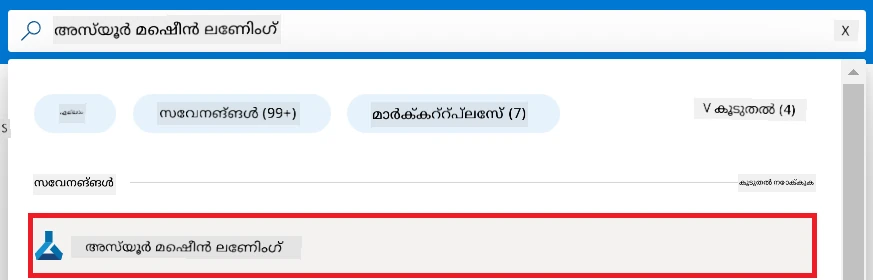

2. navegarive മെനുവിൽ നിന്നു **+ Create** തിരഞ്ഞെടുക്കുക.

3. **New workspace** തിരഞ്ഞെടുക്കുക.

    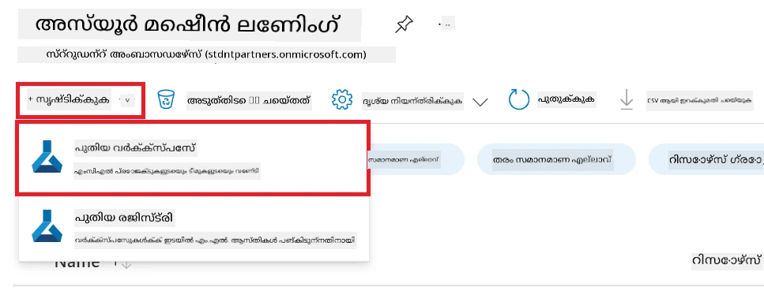

4. താഴെ പറയുന്ന പ്രവൃത്തികൾ ചെയ്യുക:

    - നിങ്ങളുടെ Azure **Subscription** തിരഞ്ഞെടുക്കുക.
    - ഉപയോഗിക്കാനുള്ള **Resource group** തിരഞ്ഞെടുക്കുക (തയ്യാറാക്കേണ്ട ആവശ്യമെങ്കിൽ പുതിയത് സൃഷ്ടിക്കുക).
    - **Workspace Name** നൽകുക. ഇത് ഒരു പ്രത്യേക മൂല്യം ആയിരിക്കണം.
    - ഉപയോഗിക്കാനുള്ള **Region** തിരഞ്ഞെടുക്കുക.
    - ഉപയോഗിക്കാനുള്ള **Storage account** തിരഞ്ഞെടുക്കുക (പുതിയതായി സൃഷ്ടിക്കുക ആവശ്യമായ പക്ഷം).
    - ഉപയോഗിക്കാനുള്ള **Key vault** തിരഞ്ഞെടുക്കുക (പുതിയത് സൃഷ്ടിക്കാൻ കഴിയും).
    - ഉപയോഗിക്കാനുള്ള **Application insights** തിരഞ്ഞെടുക്കുക (പുതിയത് സൃഷ്ടിക്കാം).
    - გამოყენാനുള്ള **Container registry** തിരഞ്ഞെടുക്കുക (പുതിയത് സൃഷ്ടിക്കാം).

    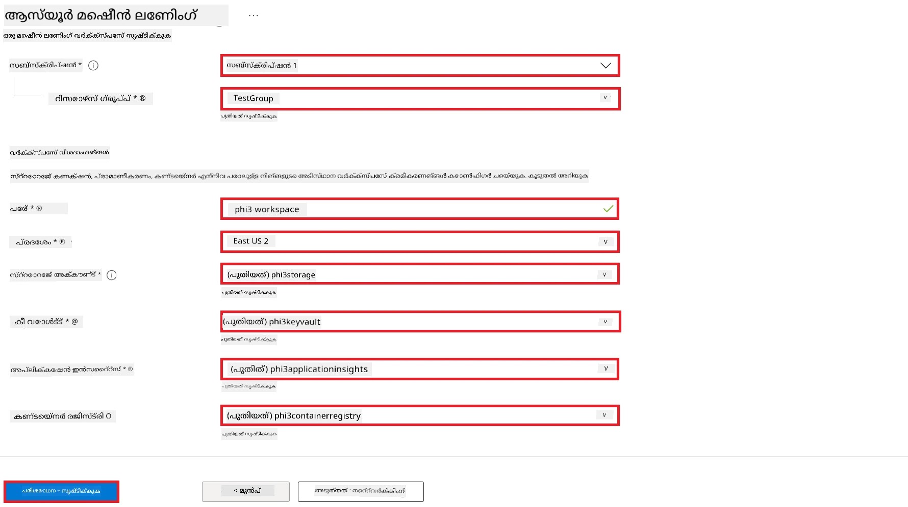

5. **Review + Create** തിരഞ്ഞെടുക്കുക.

6. **Create** തിരഞ്ഞെടുക്കുക.

### Azure Subscription-ൽ GPU ക്വോട്ടാകൾക്ക് അപേക്ഷിക്കുക

ഈ ട്യൂട്ടോറിയലിൽ Phi-3 മോഡൽ ഫൈൻ-ട്യൂൺ ചെയ്യാനും ഡിപ്ലോയ് ചെയ്യാനും GPUs ഉപയോഗിക്കുന്നത് പഠിക്കും. ഫൈൻ-ട്യൂണിങ്ങിന് *Standard_NC24ads_A100_v4* GPU ആണ് ഉപയോഗിക്കുന്നത്, ഇത് ക്വോട്ടാ അപേക്ഷ ആവശ്യമാണ്. ഡിപ്ലോയ്‌മെന്റിന് *Standard_NC6s_v3* GPU ഉപയോഗിക്കും, ഇതിന് കൂടി ക്വോട്ടാ അപേക്ഷ ആവശ്യമാണ്.

> [!NOTE]
>
> പണമടയ്ക്കുന്ന Pay-As-You-Go സബ്‌സ്ക്രിപ്ഷനുകൾ (സാധാരണ സബ്‌സ്ക്രിപ്ഷൻ ടൈപ്പ്) മാത്രമേ GPU അലോകേഷനിന് യോഗ്യമാകൂ; ബനിഫിറ്റ് സബ്‌സ്ക്രിപ്ഷനുകൾ ഇപ്പൊഴത്തെന്നും പിന്തുണയ്ക്കുന്നില്ല.
>

1. [Azure ML Studio](https://ml.azure.com/home?wt.mc_id=studentamb_279723) സന്ദർശിക്കുക.

1. *Standard NCADSA100v4 Family* ക്വോട്ടാക്കായി അപേക്ഷിക്കാനുള്ള പ്രവൃത്തികൾ:

    - ഇടത് പാനലിൽ നിന്നു **Quota** തിരഞ്ഞെടുക്കുക.
    - ഉപയോഗിക്കാനുള്ള **Virtual machine family** തിരഞ്ഞെടുക്കുക. ഉദാഹരണത്തിന്, *Standard NCADSA100v4 Family Cluster Dedicated vCPUs* തിരഞ്ഞെടുക്കുക, ഇത് *Standard_NC24ads_A100_v4* GPU ഉൾപ്പെടുന്നു.
    - **Request quota** നാവിഗേഷൻ മენുവിൽ നിർവഹിക്കുക.

        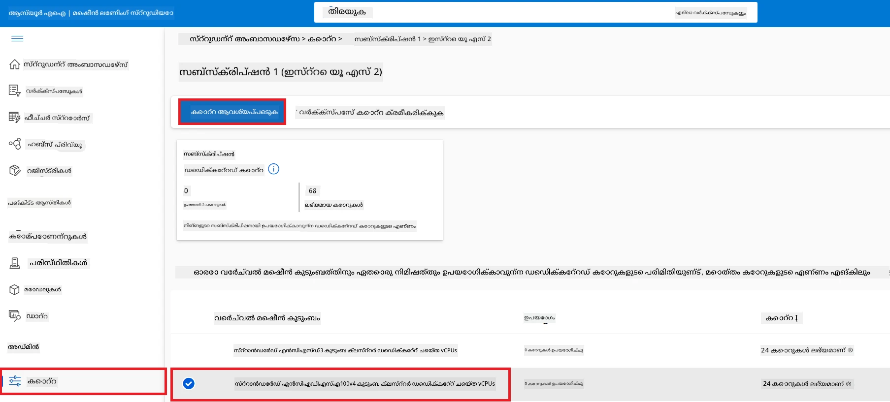

    - Request quota പേജിൽ **New cores limit** നൽകുക. ഉദാഹരണത്തിന്, 24.
    - Request quota പേജിൽ GPU ക്വോട്ടാ അപേക്ഷിപ്പിക്കാൻ **Submit** തിരഞ്ഞെടുക്കുക.

1. *Standard NCSv3 Family* ക്വോട്ടാക്കായി അപേക്ഷിക്കാൻ:

    - ഇടത് പാനലിൽ നിന്നും **Quota** തിരഞ്ഞെടുത്ത്.
    - ഉപയോഗിക്കാനുള്ള **Virtual machine family** തിരഞ്ഞെടുക്കുക. ഉദാഹരണത്തിന്, *Standard NCSv3 Family Cluster Dedicated vCPUs*, ഇതിൽ *Standard_NC6s_v3* GPU ഉൾപ്പെടുന്നു.
    - **Request quota** തിരഞ്ഞെടുക്കുക.
    - New cores limit നൽകുക. ഉദാഹരണത്തിന്, 24.
    - **Submit** തിരഞ്ഞെടുക്കുക.

### Role റോളുള്ളത് ചേർക്കുക

നിങ്ങളുടെ മോഡലുകൾ ഫൈൻ-ട്യൂൺ ചെയ്തു ഡിപ്ലോയ് ചെയ്യാൻ, ആദ്യം ഒരു User Assigned Managed Identity (UAI) സൃഷ്ടിച്ച് അതിന് ആവശ്യമായ അവകാശങ്ങൾ അനുവദിക്കണം. ഈ UAI ഡിപ്ലോയ്‌മെന്റ് സമയത്തെ ഒറ്റപ്പെട്ട സ്ഥിരീകരണത്തിന് ഉപയോഗിക്കും.

#### User Assigned Managed Identity (UAI) സൃഷ്ടിക്കുക

1. പോർട്ടലിന്റെ മുകളിൽ ഉള്ള **search bar**-ൽ *managed identities* ടൈപ്പ് ചെയ്തു ലഭിക്കുന്ന ഓപ്ഷനുകളിൽ നിന്നു **Managed Identities** തിരഞ്ഞെടുക്കുക.

    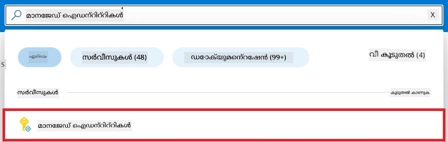

1. **+ Create** തിരഞ്ഞെടുക്കുക.

    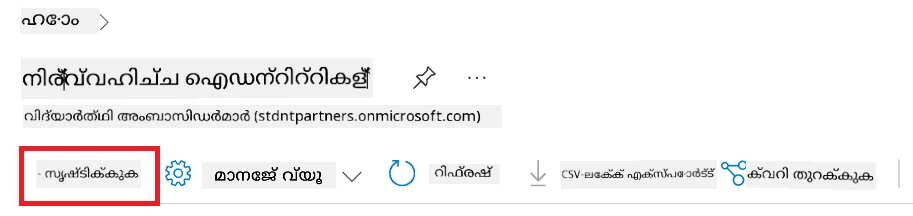

1. താഴെ പറയുന്ന പ്രവൃത്തികൾ ചെയ്യുക:

    - നിങ്ങളുടെ Azure **Subscription** തിരഞ്ഞെടുക്കുക.
    - ഉപയോഗിക്കാനുള്ള **Resource group** തിരഞ്ഞെടുക്കുക (ആവശ്യമായെങ്കിൽ പുതിയതായി സൃഷ്ടിക്കുക).
    - ഉപയോഗിക്കാനുള്ള **Region** തിരഞ്ഞെടുക്കുക.
    - **Name** നൽകുക. ഇത് പ്രത്യേകമായിരിക്കണം.

    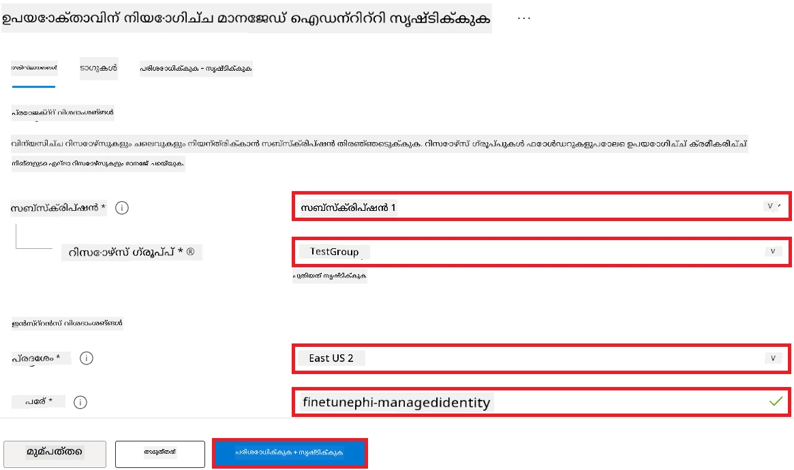

1. **Review + create** തിരഞ്ഞെടുക്കുക.

1. **+ Create** തിരഞ്ഞെടുക്കുക.

#### Managed Identity-യ്ക്ക് Contributor role അവകാശം നൽകുക

1. നിങ്ങൾ സൃഷ്ടിച്ച Managed Identity റിസോഴ്സിലേക്ക് പോകുക.

1. ഇടത് പാനലിൽ നിന്നു **Azure role assignments** തിരഞ്ഞെടുക്കുക.

1. നാവിഗേഷൻ മენുവിൽ നിന്നു **+Add role assignment** തിരഞ്ഞെടുക്കുക.

1. Add role assignment പേജിൽ താഴെ പറയുന്ന കർമങ്ങൾ നിർവഹിക്കുക:
    - **Scope** ആയി **Resource group** തിരഞ്ഞെടുക്കുക.
    - നിങ്ങളുടെ Azure **Subscription** തിരഞ്ഞെടുക്കുക.
    - ഉപയോഗിക്കാനുള്ള **Resource group** തിരഞ്ഞെടുക്കുക.
    - Role ആയി **Contributor** തിരഞ്ഞെടുക്കുക.

    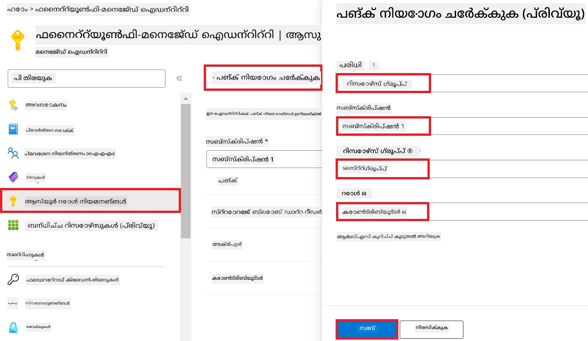

2. **Save** തിരഞ്ഞെടുക്കുക.

#### Managed Identity-യ്ക്ക് Storage Blob Data Reader role അനുവദിക്കുക

1. പോർട്ടലിന്റെ മുകളിൽ ഉള്ള **search bar**-ൽ *storage accounts* ടൈപ്പ് ചെയ്ത് ലഭിക്കുന്ന ഓപ്ഷനുകളിൽ നിന്നു **Storage accounts** തിരഞ്ഞെടുക്കുക.

    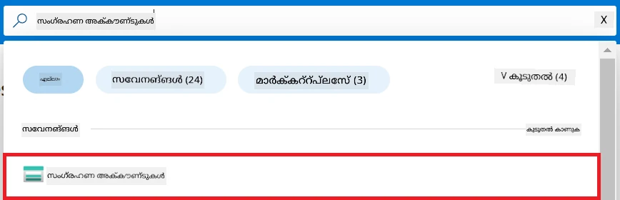

1. നിങ്ങൾ സൃഷ്ടിച്ച Azure Machine Learning workspace-നൊപ്പം ബന്ധമുള്ള storage account തിരഞ്ഞെടുക്കുക. ഉദാഹരണത്തിന്, *finetunephistorage*.

1. Add role assignment പേജിലേക്ക് പോകാൻ താഴെ പറയുന്ന പ്രവൃത്തികൾ നിർവഹിക്കുക:

    - സൃഷ്ടിച്ച Azure Storage account-ൽ പോകുക.
    - ഇടത് ടാബിൽ നിന്ന് **Access Control (IAM)** തിരഞ്ഞെടുക്കുക.
    - നാവിഗേഷൻ മენുവിൽ നിന്നും **+ Add**-യിലേക്കു പോവുക.
    - **Add role assignment** തിരഞ്ഞെടുക്കുക.

    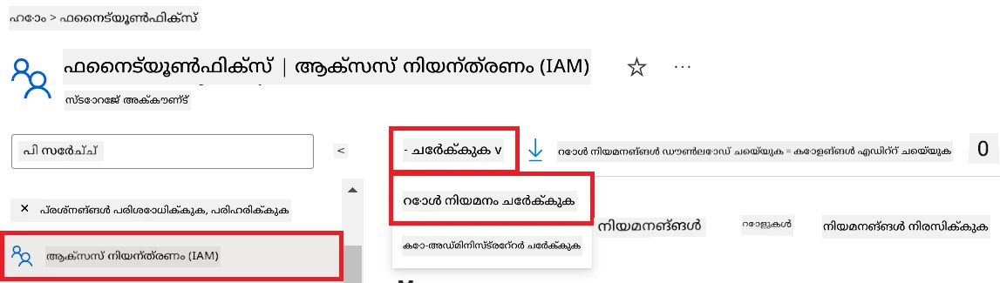

1. Add role assignment പേജിൽ നിർവഹിക്കുക:

    - Role പേജിൽ **search bar**-ൽ *Storage Blob Data Reader* ടൈപ്പ് ചെയ്ത് ലഭിക്കുന്നതിൽ നിന്നു **Storage Blob Data Reader** തിരഞ്ഞെടുക്കുക.
    - Role പേജിൽ **Next** തിരഞ്ഞെടുക്കുക.
    - Members പേജിൽ **Assign access to** എന്നിടത്ത് **Managed identity** തിരഞ്ഞെടുക്കുക.
    - Members പേജിൽ **+ Select members** തിരഞ്ഞെടുക്കുക.
    - Select managed identities പേജിൽ നിങ്ങളുടെ Azure **Subscription** തിരഞ്ഞെടുക്കുക.
    - Select managed identities പേജിൽ **Managed identity** ആയി **Manage Identity** തിരഞ്ഞെടുക്കുക.
    - Select managed identities പേജിൽ നിങ്ങൾ സൃഷ്ടിച്ച Manage Identity തിരഞ്ഞെടുക്കുക. ഉദാഹരണത്തിന്, *finetunephi-managedidentity*.
    - Select managed identities പേജിൽ **Select** തിരഞ്ഞെടുക്കുക.

    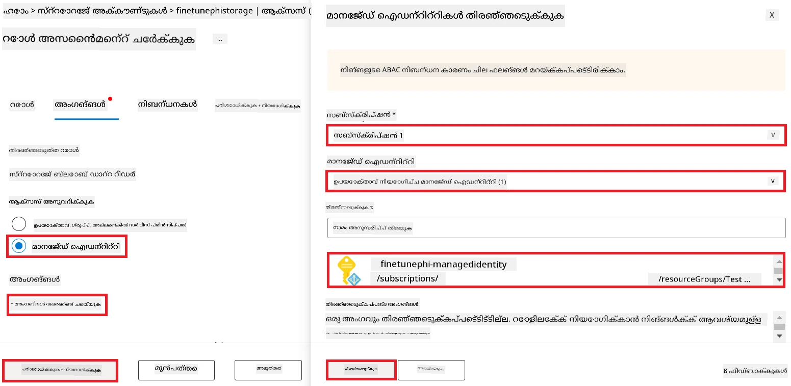

1. **Review + assign** തിരഞ്ഞെടുക്കുക.

#### Managed Identity-യ്ക്ക് AcrPull role അനുവദിക്കുക

1. പോർട്ടലിന്റെ മുകളിൽ ഉള്ള **search bar**-ൽ *container registries* ടൈപ്പ് ചെയ്ത് ലഭിക്കുന്ന ഓപ്ഷനുകളിൽ നിന്നു **Container registries** തിരഞ്ഞെടുക്കുക.

    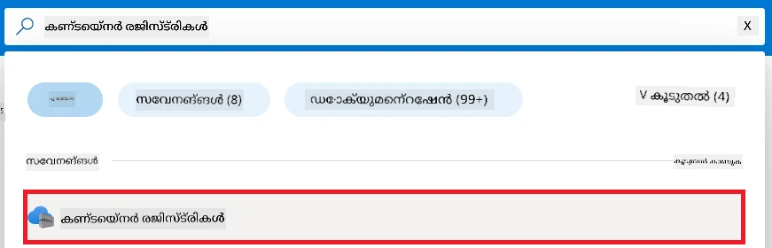

1. Azure Machine Learning workspace-യുമായി ബന്ധപ്പെട്ട container registry തിരഞ്ഞെടുക്കുക. ഉദാഹരണത്തിന്, *finetunephicontainerregistry*

1. Add role assignment പേജിലേക്ക് പോയി പ്രവർത്തനങ്ങൾ ചെയ്യുക:

    - ഇടത് പാനലിൽ നിന്നും **Access Control (IAM)** തിരഞ്ഞെടുക്കുക.
    - **+ Add**-യിലെത്തുക.
    - **Add role assignment** തിരഞ്ഞെടുക്കുക.

1. Add role assignment പേജിൽ നിർവഹിക്കുക:

    - Role പേജിൽ **search bar**-ൽ *AcrPull* ടൈപ്പ് ചെയ്ത് ലഭിക്കുന്ന ലിസ്റ്റിൽ നിന്നു **AcrPull** തിരഞ്ഞെടുക്കുക.
    - Role പേജിൽ **Next**.
    - Members പേജിൽ **Assign access to** ആക്കി **Managed identity** തിരഞ്ഞെടുക്കുക.
    - Members പേജിൽ **+ Select members**.
    - Select managed identities പേജിൽ നിങ്ങളുടെ Azure **Subscription** തിരഞ്ഞെടുക്കുക.
    - Select managed identities പേജിൽ **Managed identity** ആയി **Manage Identity** തിരഞ്ഞെടുക്കുക.
    - Select managed identities പേജിൽ സൃഷ്ടിച്ച Manage Identity തിരഞ്ഞെടുക്കുക. ഉദാഹരണത്തിന്, *finetunephi-managedidentity*.
    - Select managed identities പേജിൽ **Select**.
    - **Review + assign**.

### പദ്ധതി സജ്ജമാക്കുക

ഫൈൻ-ട്യുണിങ്ങിനാവശ്യമായ dataset ഡൗൺലോഡ് ചെയ്യാൻ, ലോക്കൽ പരിസ്ഥിതി സജ്ജമാക്കും.

ഈ അഭ്യാസത്തിൽ, നിങ്ങൾ

- ജോലി ചെയ്യാൻ ഒരു ഫോൾഡർ സൃഷ്ടിക്കും.
- ഒരു വിർച്വൽ പരിസ്ഥിതി സൃഷ്ടിക്കും.
- ആവശ്യമുള്ള പാക്കേജുകൾ ഇൻസ്റ്റാൾ ചെയ്യും.
- ഡാറ്റാസെറ്റ് ഡൗൺലോഡ് ചെയ്യാനുള്ള *download_dataset.py* ഫയൽ സൃഷ്ടിക്കും.

#### ജോലി ചെയ്യാനുള്ള ഫോൾഡർ സൃഷ്ടിക്കൽ

1. ഒരു ടെർമിനൽ വിൻഡോ തുറന്ന് ഡീഫോൾട്ട് പാഥിൽ *finetune-phi* എന്ന ഫോൾഡർ സൃഷ്ടിക്കാൻ താഴെ കൊടുത്ത കമാൻഡ് ടൈപ്പ് ചെയ്യുക.

    ```console
    mkdir finetune-phi
    ```

2. *finetune-phi* ഫോൾഡർ നിങ്ങൾ സൃഷ്ടിച്ചത് ആക്‌സസ് ചെയ്യാൻ നിങ്ങളുടെ ടെർമിനലിൽ താഴെ കാണുന്ന കമാൻഡ് ടൈപ്പ് ചെയ്യുക.

    ```console
    cd finetune-phi
    ```

#### ഒരു വർച്ച്വൽ എൻവയരണ്മെന്റ് സൃഷ്ടിക്കുക

1. *.venv* എന്ന പേരിൽ ഒരു വർച്ച്വൽ എൻവയരണ്മെന്റ് സൃഷ്ടിക്കാൻ നിങ്ങളുടെ ടെർമിനലിൽ താഴെ കാണുന്ന കമാൻഡ് ടൈപ്പ് ചെയ്യുക.

    ```console
    python -m venv .venv
    ```

2. വർച്ച്വൽ എൻവയരണ്മെന്റ് ആക്ടിഫേറ്റ് ചെയ്യാൻ നിങ്ങളുടെ ടെർമിനലിൽ താഴെ കാണുന്ന കമാൻഡ് ടൈപ്പ് ചെയ്യുക.

    ```console
    .venv\Scripts\activate.bat
    ```

> [!NOTE]
> ഇത് സരിയായി പ്രവർത്തിച്ചാൽ, കമാൻഡ് പ്രോമ്പ്റ്റിന് മുമ്പിൽ *(.venv)* കാണും.

#### ആവശ്യമായ പാക്കേജുകൾ ഇൻസ്റ്റാൾ ചെയ്യുക

1. ആവശ്യമായ പാക്കേജുകൾ ഇൻസ്റ്റാൾ ചെയ്യാൻ നിങ്ങളുടെ ടെർമിനലിൽ താഴെ കാണുന്ന കമാൻഡുകൾ ടൈപ്പ് ചെയ്യുക.

    ```console
    pip install datasets==2.19.1
    ```

#### `download_dataset.py` സൃഷ്ടിക്കുക

> [!NOTE]
> സമ്പൂർണ്ണ ഫോൾഡർ ഘടന:
>
> ```text
> └── YourUserName
> .    └── finetune-phi
> .        └── download_dataset.py
> ```

1. **Visual Studio Code** തുറക്കുക.

1. മെനു ബാറിൽ നിന്ന് **File** തിരഞ്ഞെടുക്കുക.

1. **Open Folder** തിരഞ്ഞെടുക്കുക.

1. നിങ്ങൾ സൃഷ്ടിച്ച *finetune-phi* ഫോൾഡർ തിരഞ്ഞെടുക്കുക, അത് സ്ഥിതി ചെയ്യുന്നത് *C:\Users\yourUserName\finetune-phi* എന്ന സ്ഥലത്ത് ആണ്.

    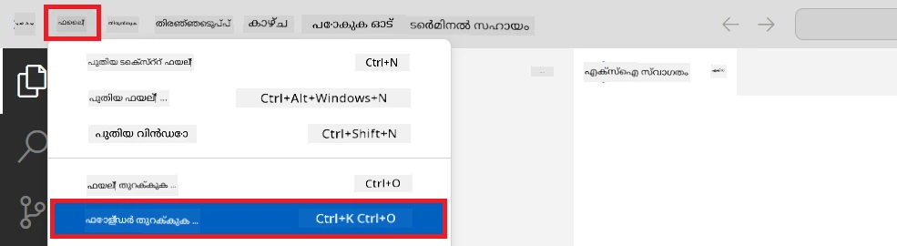

1. Visual Studio Code-ന്റെ ഇടതു പാനലിൽ റൈറ്റ് ക്ലിക്ക് ചെയ്ത് **New File** തിരഞ്ഞെടുക്കുക, അതിലൂടെ *download_dataset.py* എന്ന പുതിയ ഫയൽ സൃഷ്ടിക്കുക.

    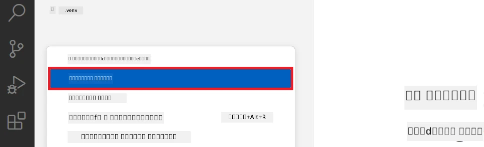

### ഫൈൻ-ട്യൂണിംഗിന് ഡാറ്റാസെറ്റ് തയ്യാറാക്കുക

ഈ അഭ്യാസത്തിൽ, നിങ്ങൾ *download_dataset.py* ഫയൽ പ്രവർത്തിപ്പിച്ച് *ultrachat_200k* ഡാറ്റാസെറ്റ് നിങ്ങളുടെ ലോക്കൽ എൻവയരണ്മെന്റിലേക്ക് ഡൗൺലോഡ് ചെയ്യും. പിന്നീട് ഈ ഡാറ്റാസെറ്റുകൾ ഉപയോഗിച്ച് Azure Machine Learning-ൽ Phi-3 മോഡൽ ഫൈൻ-ട്യൂൺ ചെയ്യും.

ഈ അഭ്യാസത്തിൽ, നിങ്ങൾ ചെയ്യും:

- *download_dataset.py* ഫയലിൽ കോഡ് ചേർത്ത് ഡാറ്റാസെറ്റുകൾ ഡൗൺലോഡ് ചെയ്യുക.
- *download_dataset.py* ഫയൽ പ്രവർത്തിപ്പിച്ച് ഡാറ്റാസെറ്റുകൾ നിങ്ങളുടെ ലോക്കൽ എൻവയരണ്മെന്റിലേക്ക് ഡൗൺലോഡ് ചെയ്യുക.

#### *download_dataset.py* ഉപയോഗിച്ച് നിങ്ങളുടെ ഡാറ്റാസെറ്റ് ഡൗൺലോഡ് ചെയ്യുക

1. Visual Studio Code-ൽ *download_dataset.py* ഫയൽ തുറക്കുക.

1. *download_dataset.py* ഫയലിൽ താഴെ കാണുന്ന കോഡ് ചേർക്കുക.

    ```python
    import json
    import os
    from datasets import load_dataset

    def load_and_split_dataset(dataset_name, config_name, split_ratio):
        """
        Load and split a dataset.
        """
        # നിശ്ചിത നാമം, കോൺഫിഗറേഷൻ, സ്പ്ലിറ്റ് അനുപാതത്തോടെ ഡേറ്റാസെറ്റ് ലോഡ് ചെയ്യുക
        dataset = load_dataset(dataset_name, config_name, split=split_ratio)
        print(f"Original dataset size: {len(dataset)}")
        
        # ഡേറ്റാസെറ്റ് ട്രെയിൻ, ടെസ്റ്റ് സെറ്റുകളിൽ വിഭജിക്കുക (80% ട്രെയിൻ, 20% ടെസ്റ്റ്)
        split_dataset = dataset.train_test_split(test_size=0.2)
        print(f"Train dataset size: {len(split_dataset['train'])}")
        print(f"Test dataset size: {len(split_dataset['test'])}")
        
        return split_dataset

    def save_dataset_to_jsonl(dataset, filepath):
        """
        Save a dataset to a JSONL file.
        """
        # ഡയറക്ടറി നിലനിൽക്കാതെപോൽ അത് സൃഷ്ടിക്കുക
        os.makedirs(os.path.dirname(filepath), exist_ok=True)
        
        # ഫയൽ എഴുത്ത് മോഡിൽ തുറക്കുക
        with open(filepath, 'w', encoding='utf-8') as f:
            # ഡേറ്റാസെറ്റിലെ ഓരോ റെക്കോർത്തയും മൊഴിയുക
            for record in dataset:
                # റെക്കോർഡ് JSON ഒബ്ജക്ടായി ഡംപ് ചെയ്ത് ഫയലിലേക്ക് എഴുതുക
                json.dump(record, f)
                # റെക്കോർഡുകൾ വേർതിരിക്കാൻ ന്യൂലൈൻ പ്രതീകം എഴുതുക
                f.write('\n')
        
        print(f"Dataset saved to {filepath}")

    def main():
        """
        Main function to load, split, and save the dataset.
        """
        # പ്രത്യേക കോൺഫിഗറേഷൻ, സ്പ്ലിറ്റ് അനുപാതത്തോടുകൂടിയ ULTRACHAT_200k ഡേറ്റാസെറ്റ് ലോഡ് ചെയ്ത് വിഭജിക്കുക
        dataset = load_and_split_dataset("HuggingFaceH4/ultrachat_200k", 'default', 'train_sft[:1%]')
        
        # വിഭജിക്കുന്നതിൽ നിന്ന് ട്രെയിൻ, ടെസ്റ്റ് ഡേറ്റാസെറ്റുകൾ എടുക്കുക
        train_dataset = dataset['train']
        test_dataset = dataset['test']

        # ട്രെയിൻ ഡേറ്റാസെറ്റ് JSONL ഫയലായി സേവ് ചെയ്യുക
        save_dataset_to_jsonl(train_dataset, "data/train_data.jsonl")
        
        # ടെസ്റ്റ് ഡേറ്റാസെറ്റ് വേർതിരിച്ച് JSONL ഫയലായി സേവ് ചെയ്യുക
        save_dataset_to_jsonl(test_dataset, "data/test_data.jsonl")

    if __name__ == "__main__":
        main()

    ```

1. സ്ക്രിപ്റ്റ് പ്രവർത്തിപ്പിച്ച് ഡാറ്റാസെറ്റ് നിങ്ങളുടെ ലോക്കൽ എൻവയരണ്മെന്റിലേക്ക് ഡൗൺലോഡ് ചെയ്യാൻ നിങ്ങളുടെ ടെർമിനലിൽ താഴെ കാണുന്ന കമാൻഡ് ടൈപ്പ് ചെയ്യുക.

    ```console
    python download_dataset.py
    ```

1. ഡാറ്റാസെറ്റുകൾ വിജയകരമായി നിങ്ങളുടെ ലോക്കൽ *finetune-phi/data* ഡയറക്ടറിയിൽ സേവ് ചെയ്തിട്ടുണ്ടെന്ന് സ്ഥിരീകരിക്കുക.

> [!NOTE]
>
> #### ഡാറ്റാസെറ്റ് വലിപ്പവും ഫൈൻ-ട്യൂണിങ്ങിന്റെ സമയവും സംബന്ധിച്ച കുറിപ്പ്
>
> ഈ ട്യൂട്ടോറിയലിൽ, നിങ്ങൾ ഡാറ്റാസെറ്റിന്റെ 1% മാത്രം ഉപയോഗിക്കുന്നു (`split='train[:1%]'`). ഇത് ഡാറ്റയുടെ അളവ് വളരെ കുറയ്ക്കുന്നു, അപ്‌ലോഡും ഫൈൻ-ട്യൂണിംഗ് പ്രക്രിയയും വേഗത്തിലാക്കുന്നു. പരിശീലന സമയവും മോഡൽ പ്രകടനവും തമ്മിൽ ശരിയായ Santulanam കണ്ടെത്താൻ നിങ്ങൾ ശതമാനം ക്രമീകരിക്കാം. ഡാറ്റാസെറ്റിന്റെ ചെറിയ ഉപസമൂഹം ഉപയോഗിക്കുന്നത് ഫൈൻ-ട്യൂണിംഗിന് വേണ്ട സമയം കുറക്കുന്നു, ഇതോടെ ട്യൂട്ടോറിയലിനായി പ്രക്രിയ കൂടുതൽ കൈകാര്യം ചെയ്യാവുന്നതുമാണ്.

## സീനാരിയോ 2: Phi-3 മോഡൽ ഫൈൻ-ട്യൂൺ ചെയ്ത് Azure Machine Learning Studio-യിൽ ഡിപ്ലോയ്മെന്റ് ചെയ്യുക

### Phi-3 മോഡൽ ഫൈൻ-ട്യൂൺ ചെയ്യുക

ഈ അഭ്യാസത്തിൽ, നിങ്ങൾ Azure Machine Learning Studio-യിൽ Phi-3 മോഡൽ ഫൈൻ-ട്യൂൺ ചെയ്യും.

ഈ അഭ്യാസത്തിൽ, നിങ്ങൾ ചെയ്യും:

- ഫൈൻ-ട്യൂണിംഗിനായി കമ്പ്യൂട്ടർ ക്ലസ്റ്റർ സൃഷ്ടിക്കുക.
- Azure Machine Learning Studio-യിൽ Phi-3 മോഡൽ ഫൈൻ-ട്യൂൺ ചെയ്യുക.

#### ഫൈൻ-ട്യൂണിംഗിനായി കമ്പ്യൂട്ടർ ക്ലസ്റ്റർ സൃഷ്ടിക്കുക

1. [Azure ML Studio](https://ml.azure.com/home?wt.mc_id=studentamb_279723) സന്ദർശിക്കു.

1. ഇടത് ടാബിൽ നിന്ന് **Compute** തിരഞ്ഞെടുക്കുക.

1. നാവിഗേഷൻ മെനുവിൽ നിന്ന് **Compute clusters** തിരഞ്ഞെടുക്കുക.

1. **+ New** തിരഞ്ഞെടുക്കുക.

    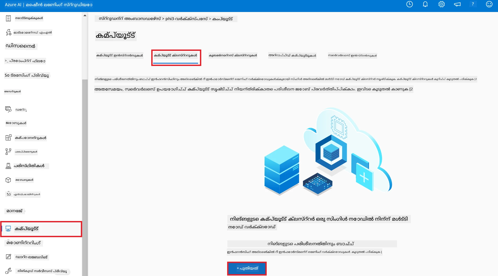

1. താഴെപ്പറയുന്ന ജോലികൾ ചെയ്യുക:

    - നിങ്ങൾ ഉപയോഗിക്കാൻ ആഗ്രഹിക്കുന്ന **Region** തിരഞ്ഞെടുക്കുക.
    - **Virtual machine tier** **Dedicated** ആയി തിരഞ്ഞെടുക്കുക.
    - **Virtual machine type** **GPU** ആയി തിരഞ്ഞെടുക്കുക.
    - **Virtual machine size** ഫിൽട്ടർ **Select from all options** ആയി തിരഞ്ഞെടുക്കുക.
    - **Virtual machine size** **Standard_NC24ads_A100_v4** ആയി തിരഞ്ഞെടുക്കുക.

    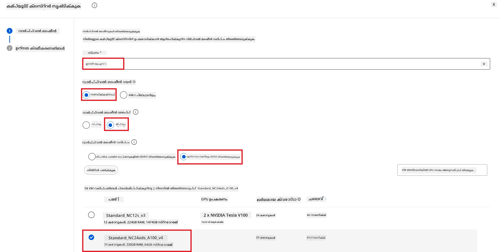

1. **Next** തിരഞ്ഞെടുക്കുക.

1. താഴെപ്പറയുന്ന ജോലികൾ ചെയ്യുക:

    - **Compute name** നൽകുക. ഇത് യൂണികായിരിക്കണം.
    - **Minimum number of nodes** 0 ആچىവെക്ക്.
    - **Maximum number of nodes** 1 ആാക്കി തിരഞ്ഞെടുക്കുക.
    - **Idle seconds before scale down** 120 ആക്കി തിരഞ്ഞെടുക്കുക.

    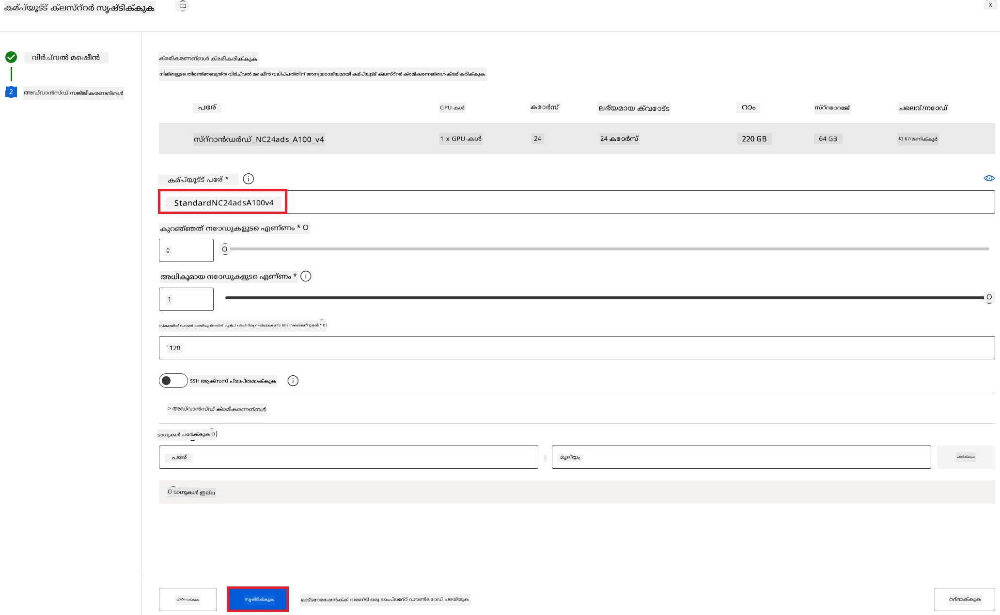

1. **Create** തിരഞ്ഞെടുക്കുക.

#### Phi-3 മോഡൽ ഫൈൻ-ട്യൂൺ ചെയ്യുക

1. [Azure ML Studio](https://ml.azure.com/home?wt.mc_id=studentamb_279723) സന്ദർശിക്കു.

1. നിങ്ങൾ സൃഷ്ടിച്ച Azure Machine Learning വർക്ക്സ്പേസിനെ തിരഞ്ഞെടുക്കുക.

    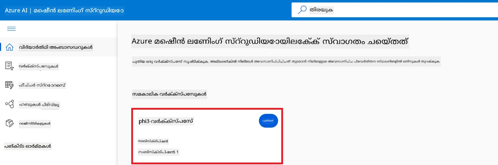

1. താഴെപ്പറയുന്ന ജോലികൾ ചെയ്യുക:

    - ഇടത് ടാബിൽ നിന്ന് **Model catalog** തിരഞ്ഞെടുക്കുക.
    - **search bar**-ലിൽ *phi-3-mini-4k* ടൈപ്പ് ചെയ്ത് കാണുന്ന ഓപ്ഷനുകളിൽ നിന്ന് **Phi-3-mini-4k-instruct** തിരഞ്ഞെടുക്കുക.

    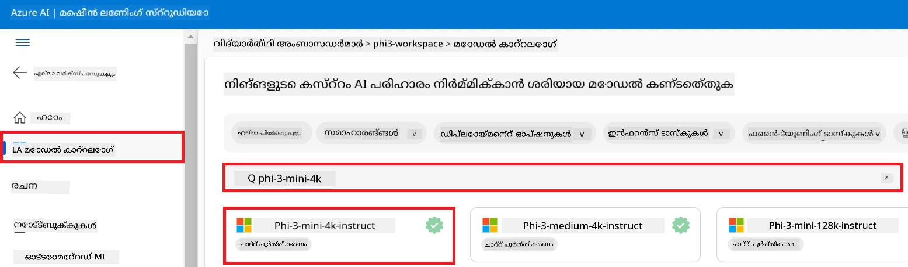

1. നാവിഗേഷൻ മെനുവിൽ നിന്ന് **Fine-tune** തിരഞ്ഞെടുക്കുക.

    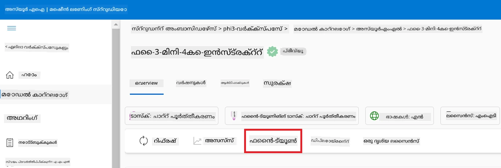

1. താഴെപ്പറയുന്ന ജോലികൾ ചെയ്യുക:

    - **Select task type** **Chat completion** ആയി തിരഞ്ഞെടുക്കുക.
    - **+ Select data** ക്ലിക്ക് ചെയ്ത് **Training data** അപ്‌ലോഡ് ചെയ്യുക.
    - Validation data അപ്‌ലോഡ് തരത്തിൽ **Provide different validation data** തിരഞ്ഞെടുക്കുക.
    - **+ Select data** ക്ലിക്ക് ചെയ്ത് **Validation data** അപ്‌ലോഡ് ചെയ്യുക.

    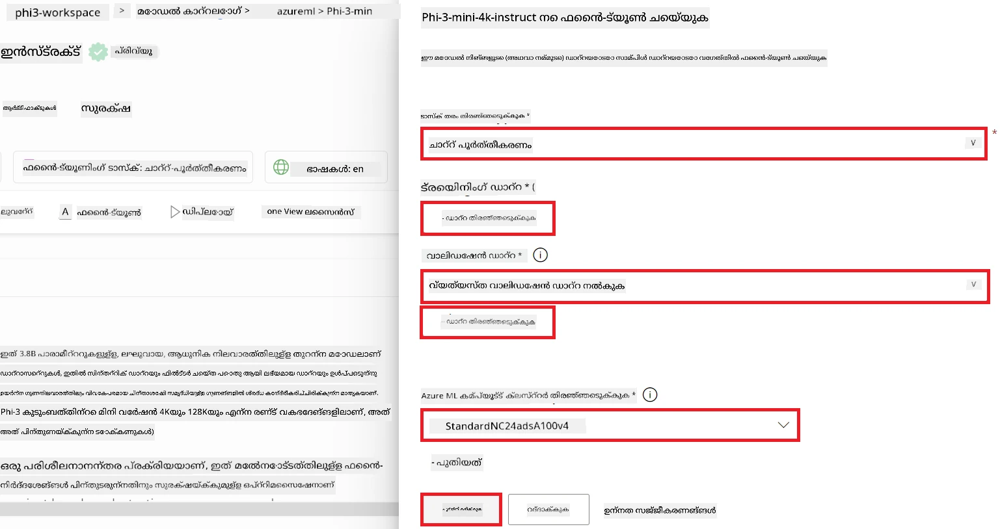

> [!TIP]
>
> നിങ്ങളുടെ ആവശ്യാനുസരണം ഫൈൻ-ട്യൂണിംഗ് പ്രക്രിയ മികച്ചതാക്കാൻ **learning_rate** , **lr_scheduler_type** എന്നിവ പോലുള്ള ക്രമീകരണങ്ങൾ ഇഷ്‌ടാനുസരണം ചെയ്യാൻ **Advanced settings** തിരഞ്ഞെടുക്കാവുന്നതാണ്.

1. **Finish** തിരഞ്ഞെടുക്കുക.

1. ഈ അഭ്യാസത്തിൽ, നിങ്ങൾ വിജയകരമായി Azure Machine Learning ഉപയോഗിച്ച് Phi-3 മോഡൽ ഫൈൻ-ട്യൂൺ ചെയ്തു. ദയവായി ശ്രദ്ധിക്കുക ഫൈൻ-ട്യൂണിംഗ് പ്രക്രിയക്ക് കുറച്ച് സമയം ലഭ്യമാണ്. ഫൈൻ-ട്യൂണിംഗ് ജോബ് പ്രവർത്തിപ്പിച്ച ശേഷം അത് പൂർത്തിയാകാനുള്ള കാത്തിരിപ്പ് വേണം. Azure Machine Learning വർക്ക്സ്പേസ്-ന്റെ ഇടതു പുറമെ ജോബ്സ് ടാബിൽ ചലനം പരിശോധിക്കാം. അടുത്ത ഭാഗത്തിൽ, നിങ്ങൾ ഫൈൻ-ട്യൂൺ ചെയ്തത് ഡിപ്ലോയ് ചെയ്ത് Prompt flow-യുമായി ഏകീകരിക്കും.

    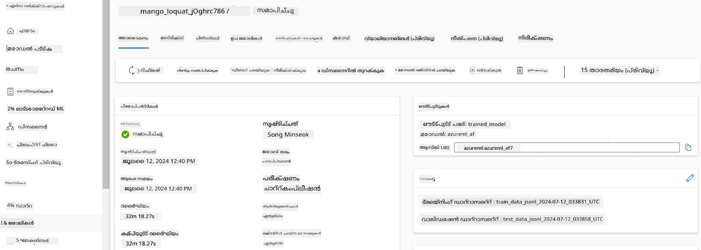

### ഫൈൻ-ട്യൂൺ ചെയ്ത Phi-3 മോഡൽ ഡിപ്ലോയ് ചെയ്യുക

ഫൈൻ-ട്യൂൺ ചെയ്ത Phi-3 മോഡൽ Prompt flow-യുമായി ഏകീകരിക്കാൻ, മോഡൽ ചേർത്ത് എത്തിയതിനായി ഓൺലൈൻ എൻഡ്പോയിന്റും സൃഷ്ടിച്ച് ഡിപ്ലോയ് ചെയ്യണം.

ഈ അഭ്യാസത്തിൽ, നിങ്ങൾ:

- ഫൈൻ-ട്യൂൺ ചെയ്ത മോഡൽ Azure Machine Learning വർക്ക്സ്പേസിൽ രജിസ്റ്റർ ചെയ്യുക.
- ഒരു ഓൺലൈൻ എൻഡ്പോയിന്റ് സൃഷ്ടിക്കുക.
- രജിസ്റ്റർ ചെയ്ത ഫൈൻ-ട്യൂൺ ചെയ്ത Phi-3 മോഡൽ ഡിപ്ലോയ് ചെയ്യുക.

#### ഫൈൻ-ട്യൂൺ ചെയ്ത മോഡൽ രജിസ്റ്റർ ചെയ്യുക

1. [Azure ML Studio](https://ml.azure.com/home?wt.mc_id=studentamb_279723) സന്ദർശിക്കു.

1. നിങ്ങൾ സൃഷ്ടിച്ച Azure Machine Learning വർക്ക്സ്പേസിനെ തിരഞ്ഞെടുക്കുക.

    

1. ഇടത് ടാബിൽ നിന്നും **Models** തിരഞ്ഞെടുക്കുക.
1. **+ Register** തിരഞ്ഞെടുക്കുക.
1. **From a job output** തിരഞ്ഞെടുക്കുക.

    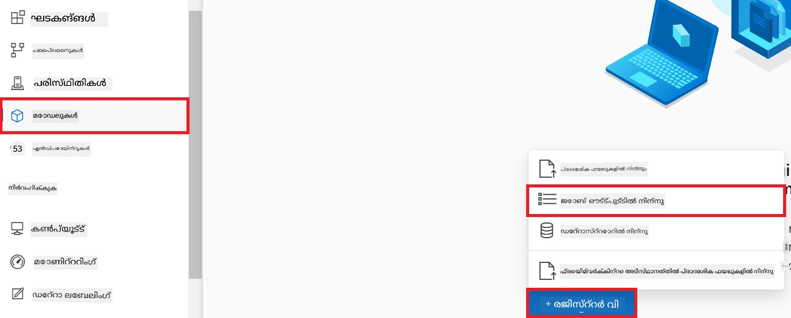

1. നിങ്ങൾ സൃഷ്ടിച്ച ജോബ് തിരഞ്ഞെടുക്കുക.

    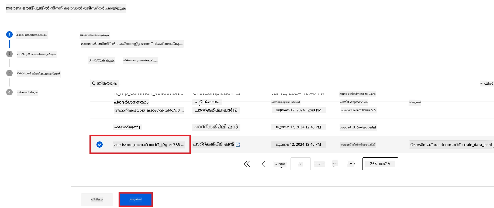

1. **Next** തിരഞ്ഞെടുക്കുക.

1. **Model type** **MLflow** ആയി തിരഞ്ഞെടുക്കുക.

1. **Job output** ഓട്ടോമാറ്റിക്കായി തിരഞ്ഞെടുക്കപ്പെട്ടിരിക്കണം എന്ന് ഉറപ്പാക്കുക.

    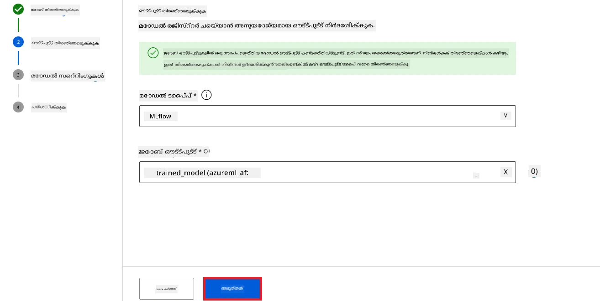

2. **Next** തിരഞ്ഞെടുക്കുക.

3. **Register** തിരഞ്ഞെടുക്കുക.

    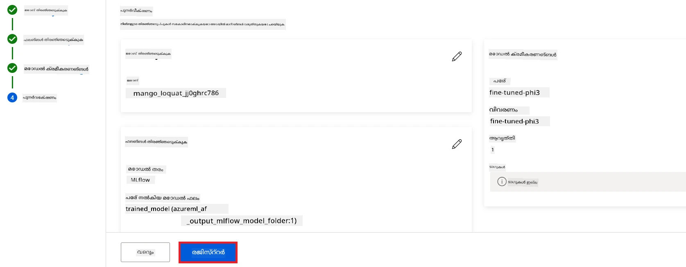

4. നിങ്ങൾ രജിസ്റ്റർ ചെയ്ത മോഡൽ ഇടത് ടാബിൽ നിന്നുള്ള **Models** മെനുവിലേക്ക് പോയി കാണാം.

    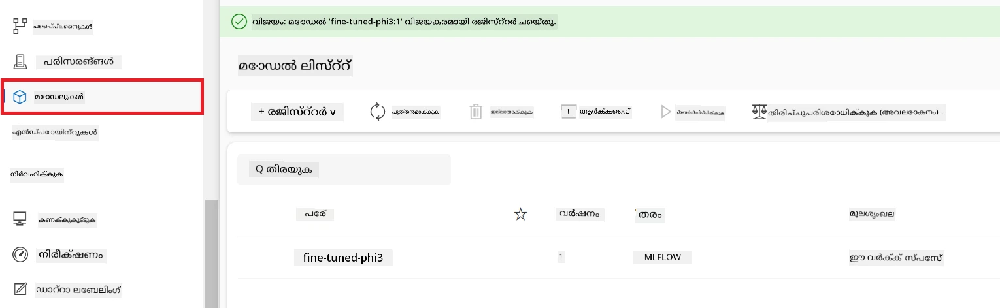

#### ഫൈൻ-ട്യൂൺ ചെയ്ത മോഡൽ ഡിപ്ലോയ് ചെയ്യുക

1. നിങ്ങൾ സൃഷ്ടിച്ച Azure Machine Learning വർക്ക്സ്പേസിലേക്ക് പോകുക.

1. ഇടത് ടാബിൽ നിന്നുള്ള **Endpoints** തിരഞ്ഞെടുക്കുക.

1. നാവിഗേഷൻ മെനുവിൽ നിന്ന് **Real-time endpoints** തിരഞ്ഞെടുക്കുക.

    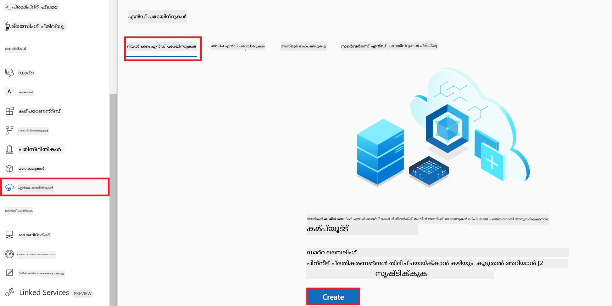

1. **Create** തിരഞ്ഞെടുക്കുക.

1. നിങ്ങൾ സൃഷ്ടിച്ച രജിസ്റ്റർ ചെയ്ത മോഡൽ തിരഞ്ഞെടുക്കുക.

    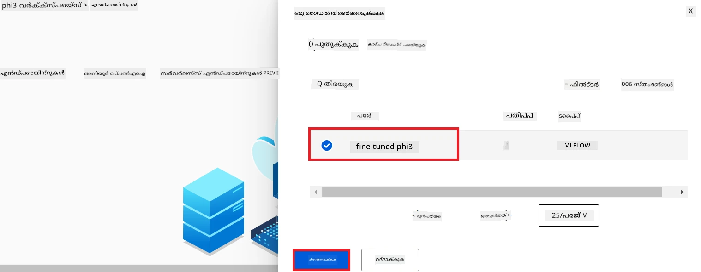

1. **Select** തിരഞ്ഞെടുക്കുക.

1. താഴെ പാടങ്ങൾ പൂർത്തിയാക്കുക:

    - **Virtual machine** *Standard_NC6s_v3* ആയി തിരഞ്ഞെടുക്കുക.
    - നിങ്ങൾക്ക് ആവശ്യമുള്ള **Instance count** തിരഞ്ഞെടുക്കുക. ഉദാഹരണത്തിന് *1*.
    - **Endpoint** **New** ആയി തിരഞ്ഞെടുക്കുക, ഒരു എൻഡ്പോയിന്റ് സൃഷ്ടിക്കുക.
    - **Endpoint name** നൽകുക. ഇത് യൂണികായിരിക്കണം.
    - **Deployment name** നൽകിയുതരുക. ഇത് യൂണികായിരിക്കണം.

    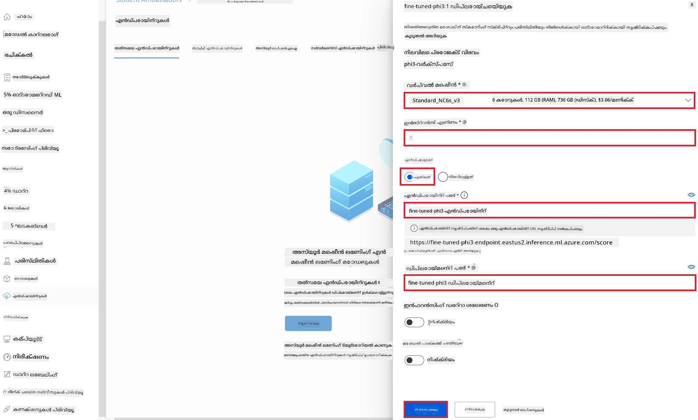

1. **Deploy** തിരഞ്ഞെടുക്കുക.

> [!WARNING]
> നിങ്ങളുടെ അക്കൗണ്ടിന് അധിക ചാർജ് ഒഴിവാക്കാൻ, Azure Machine Learning വർക്ക്സ്പേസിൽ സൃഷ്ടിച്ച എൻഡ്പോയിന്റ് ഡിലീറ്റ് ചെയ്യുന്നത് ഉറപ്പാക്കുക.
>

#### Azure Machine Learning വർക്ക്സ്പേസിൽ ഡിപ്ലോയ്മെന്റ് സ്റ്റാറ്റസ് പരിശോധിക്കുക

1. നിങ്ങൾ സൃഷ്ടിച്ച Azure Machine Learning വർക്ക്സ്പേസിലേക്ക് പോവുക.

1. ഇടത് ടാബിൽ നിന്നുള്ള **Endpoints** തിരഞ്ഞെടുക്കുക.

1. നിങ്ങൾ സൃഷ്ടിച്ച എൻഡ്പോയിന്റ് തിരഞ്ഞെടുക്കുക.

    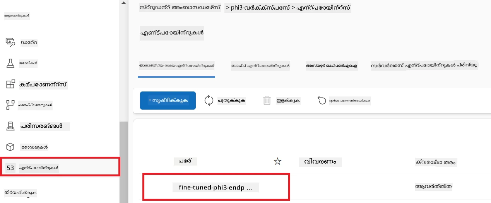

1. ഈ പേജിൽ, നിങ്ങൾ ഡിപ്ലോയ്മെന്റ് പ്രക്രിയയ്ക്കിടെ എൻഡ്പോയിന്റുകൾ നിയന്ത്രിക്കാം.

> [!NOTE]
> ഡിപ്ലോയ്മെന്റ് പൂർത്തിയായ ശേഷം, **Live traffic** **100%** ആയി സജ്ജമാക്കുകയാണെന്ന് ഉറപ്പാക്കുക. അല്ലെങ്കിൽ, ട്രാഫിക് ക്രമീകരിക്കാൻ **Update traffic** തിരഞ്ഞെടുക്കുക. ട്രാഫിക് 0% ആയിരുന്നാൽ മോഡൽ ടെസ്റ്റ് ചെയ്യാനാകില്ല.
>
> 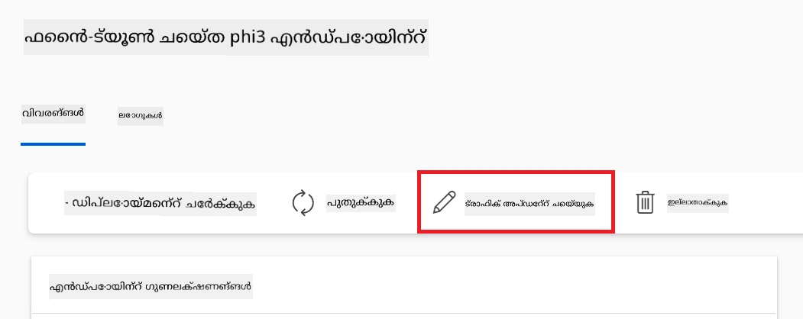
>

## സീനാരിയോ 3: Prompt flow-യുമായി ഏകീകരിച്ച് Azure AI Foundry-യിൽ നിങ്ങളുടെ കസ്റ്റം മോഡലുമായി ചാറ്റ് ചെയ്യുക

### Prompt flow-യുമായി കസ്റ്റം Phi-3 മോഡൽ ഏകീകരിക്കുക

നിങ്ങളുടെ ഫൈൻ-ട്യൂൺ ചെയ്ത മോഡൽ വിജയകരമായി ഡിപ്ലോയിച്ചിട്ടുണ്ട്, ഇനി അതിനെ Prompt Flow-യുമായി ഏകീകരിച്ച് റിയൽ-ടൈം അപ്ലിക്കേഷനുകളിൽ ഉപയോഗിക്കാം. ഇത് നിങ്ങളുടെ കസ്റ്റം Phi-3 മോഡലിനൊപ്പം വിവിധ ഇന്ററാക്റ്റീവ് പ്രവർത്തനങ്ങൾ സാധ്യമാക്കുന്നു.

ഈ അഭ്യാസത്തിൽ, നിങ്ങൾ:

- Azure AI Foundry Hub സൃഷ്ടിക്കുക.
- Azure AI Foundry Project സൃഷ്ടിക്കുക.
- Prompt flow സൃഷ്ടിക്കുക.
- ഫൈൻ-ട്യൂൺ ചെയ്ത Phi-3 മോഡലിനായി കസ്റ്റം കണക്ഷൻ ചേർക്കുക.
- നിങ്ങളുടെ കസ്റ്റം Phi-3 മോഡലുമായി ചാറ്റ് നടത്താൻ Prompt flow സജ്ജമാക്കുക.

> [!NOTE]
> Azure ML Studio ഉപയോഗിച്ചും Promptflow-യുമായി ഏകീകരിക്കാം. അതേ ഏകീകരണ പ്രക്രിയ Azure ML Studio-യിലും പ്രയോഗിക്കാവുന്നതാണ്.

#### Azure AI Foundry ഹബ് സൃഷ്ടിക്കുക

പ്രോജക്ട് സൃഷ്ടിക്കുന്നതിന് മുമ്പ് ഒരു ഹബ് സൃഷ്ടിക്കേണ്ടതുണ്ട്. ഹബ് ഒരു റിസോഴ്‌സ് ഗ്രൂപ്പായി പ്രവർത്തിക്കുകയും Azure AI Foundry-യിലുള്ള പലയധികം പ്രോജക്ടുകൾ നന്നായി ഒത്തുകൂടാനും നിയന്ത്രിക്കാനും സഹായിക്കുന്നു.

1. [Azure AI Foundry](https://ai.azure.com/?WT.mc_id=aiml-137032-kinfeylo) സന്ദർശിക്കു.

1. ഇടത് ടാബിൽ നിന്ന് **All hubs** തിരഞ്ഞെടുക്കുക.

1. നാവിഗേഷൻ മെനുവിൽ നിന്ന് **+ New hub** തിരഞ്ഞെടുക്കുക.
    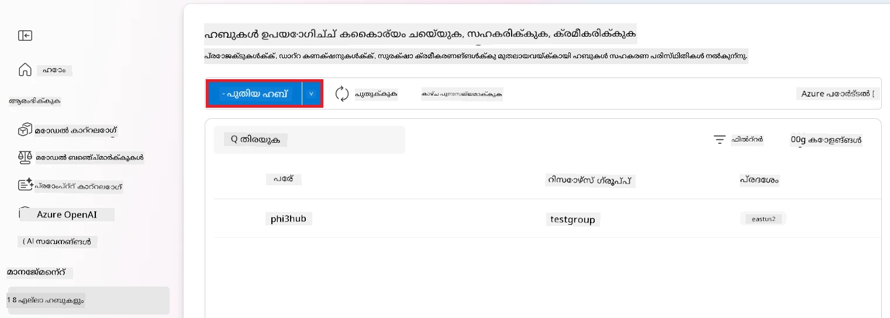

1. താഴെപ്പറയുന്ന പ്രവൃത്തികളും നിർവഹിക്കുക:

    - **ഹബ് നാം** നൽകുക. അതിന് പ്രത്യേകം വ്യത്യസ്തമായ മൂല്യം വേണം.
    - നിങ്ങളുടെ Azure **സബ്സ്ക്രിപ്ഷൻ** തിരഞ്ഞെടുക്കുക.
    - ഉപയോഗിക്കാൻ ആഗ്രഹിക്കുന്ന **റിസോഴ്‌സ് ഗ്രൂപ്പ്** തിരഞ്ഞെടുക്കുക (ആവശ്യത്തിന് പുതിയതായി സൃഷ്ടിക്കുക).
    - ഉപയോഗിക്കാൻ ആഗ്രഹിക്കുന്ന **സ്ഥലം** തിരഞ്ഞെടുക്കുക.
    - ഉപയോഗിക്കാൻ ആഗ്രഹിക്കുന്ന **കണക്‍ट്അസ്യൂർ എഐ സർവീസുകൾ** തിരഞ്ഞെടുക്കുക (ആവശ്യമായെങ്കിൽ പുതിയതായി സൃഷ്ടിക്കുക).
    - **കണക്‌ട് അസ്യൂർ എഐ സെർച്ചിൽ** നിന്ന് **Skip connecting** തിരഞ്ഞെടുക്കുക.

    

1. **Next** തിരഞ്ഞെടുക്കുക.

#### Azure AI Foundry പ്രോജക്റ്റ് സൃഷ്ടിക്കുക

1. നിങ്ങൾ സൃഷ്ടിച്ച ഹബിൽ, ഇടത് പാനലിൽ നിന്നുള്ള **All projects** തിരഞ്ഞെടുക്കുക.

1. നാനിഗേഷൻ മെനുവിൽ നിന്നുള്ള **+ New project** തിരഞ്ഞെടുക്കുക.

    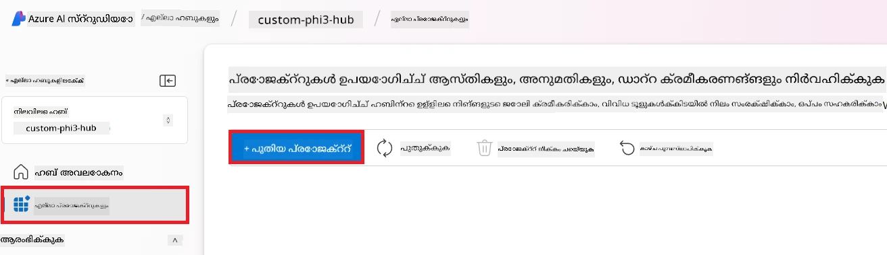

1. **പ്രോജക്റ്റ് നാമം** നൽകുക. അതിന് പ്രത്യേകം വ്യത്യസ്തമായ മൂല്യം വേണം.

    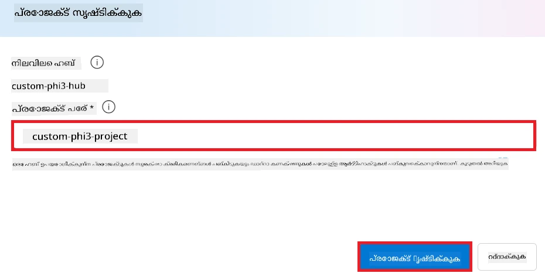

1. **Create a project** തിരഞ്ഞെടുക്കുക.

#### ഫൈൻ-ട്യൂൺ ചെയ്ത Phi-3 മോഡലിനുള്ള കസ്റ്റം കണക്ഷൻ ചേർക്കുക

നിങ്ങളുടെ കസ്റ്റം Phi-3 മോഡൽ Prompt flow-യിൽ ഇന്റഗ്രേറ്റ് ചെയ്യാൻ മോഡലിന്റെ എങ്ങനെ പോയിന്റും കീയും കസ്റ്റം കണക്ഷനായി സേവ് ചെയ്യേണ്ടതുണ്ട്. ഇത് Prompt flow-യിൽ നിങ്ങളുടെ കസ്റ്റം Phi-3 മോഡലിലേക്ക് ആക്സസ് ഉറപ്പാക്കും.

#### ഫൈൻ-ട്യൂൺ ചെയ്ത Phi-3 മോഡലിന്റെ API കീയും എങ്ങനെ പോയിന്റും സജ്ജമാക്കുക

1. [Azure ML Studio](https://ml.azure.com/home?WT.mc_id=aiml-137032-kinfeylo) സന്ദർശിക്കുക.

1. നിങ്ങൾ സൃഷ്ടിച്ച Azure മെഷീൻ ലേൺണിംഗ് വർക്ക്‌സ്‌പേസിലേക്ക് നാനിഗേറ്റ് ചെയ്യുക.

1. ഇടത് പാനലിൽ നിന്നുള്ള **Endpoints** തിരഞ്ഞെടുക്കുക.

    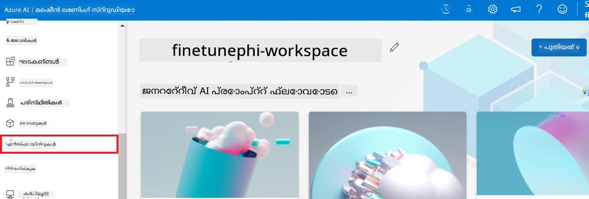

1. നിങ്ങൾ സൃഷ്ടിച്ച എന്റ്പോയിന്റ് തിരഞ്ഞെടുക്കുക.

    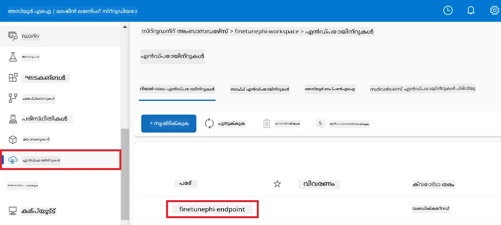

1. നാനിഗേഷൻ മെനുവിൽ നിന്നുള്ള **Consume** തിരഞ്ഞെടുക്കുക.

1. നിങ്ങളുടെ **REST endpoint**യും **Primary key**യും കോപ്പി ചെയ്യുക.

    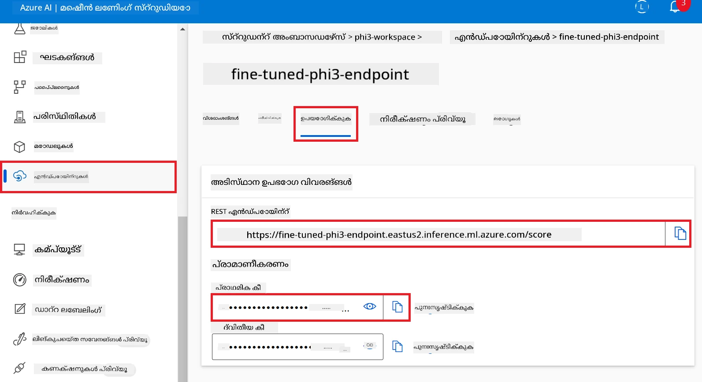

#### കസ്റ്റം കണക്ഷൻ ചേർക്കുക

1. [Azure AI Foundry](https://ai.azure.com/?WT.mc_id=aiml-137032-kinfeylo) സന്ദർശിക്കുക.

1. നിങ്ങൾ സൃഷ്ടിച്ച Azure AI Foundry പ്രോജക്റ്റിലേക്ക് നാനിഗേറ്റ് ചെയ്യുക.

1. നിങ്ങൾ സൃഷ്ടിച്ച പ്രോജക്റ്റിൽ, ഇടത് പാനലിൽ നിന്നുള്ള **Settings** തിരഞ്ഞെടുക്കുക.

1. **+ New connection** തിരഞ്ഞെടുക്കുക.

    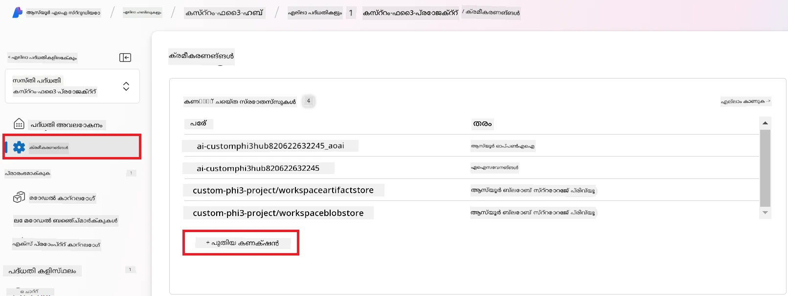

1. നാനിഗേഷൻ മെനുവിൽ നിന്നുള്ള **Custom keys** തിരഞ്ഞെടുക്കുക.

    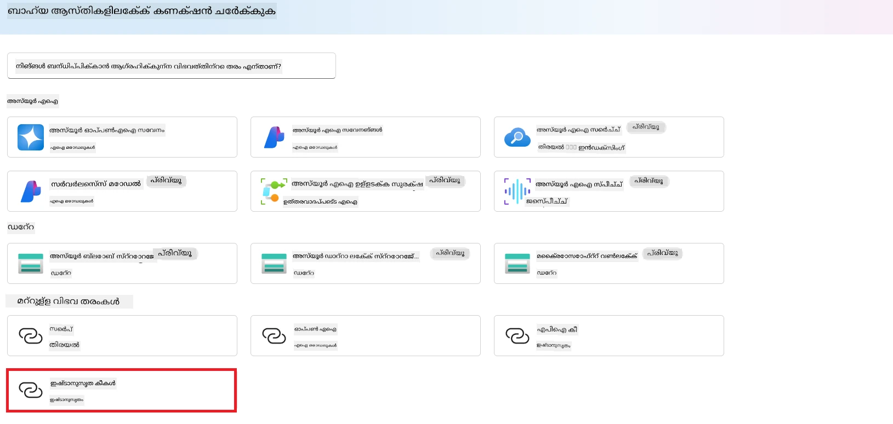

1. താഴെപ്പറയുന്ന പ്രവർത്തനങ്ങൾ ചെയ്യുക:

    - **+ Add key value pairs** തിരഞ്ഞെടുക്കുക.
    - കീ നാമത്തിന് **endpoint** നൽകുകയും Azure ML സ്റ്റുഡിയോയിൽ നിന്നു കോപ്പി ചെയ്ത എൻഡ്പോയിന്റ് മുള്ളവണ്ണം മൂല്യ ഭാഗത്ത് പേസ്റ്റ് ചെയ്യുക.
    - വീണ്ടും **+ Add key value pairs** തിരഞ്ഞെടുക്കുക.
    - കീ നാമത്തിന് **key** നൽകി Azure ML സ്റ്റുഡിയോയിൽ നിന്നു കോപ്പി ചെയ്ത കീ മൂല്യ ഭാഗത്ത് പേസ്റ്റ് ചെയ്യുക.
    - കീകൾ ചേർത്ത ശേഷം കി വരികൾ **is secret** ആയി അടയാളപ്പെടുത്തുക, കീ പുറത്ത് കാണാതിരിക്കാൻ.

    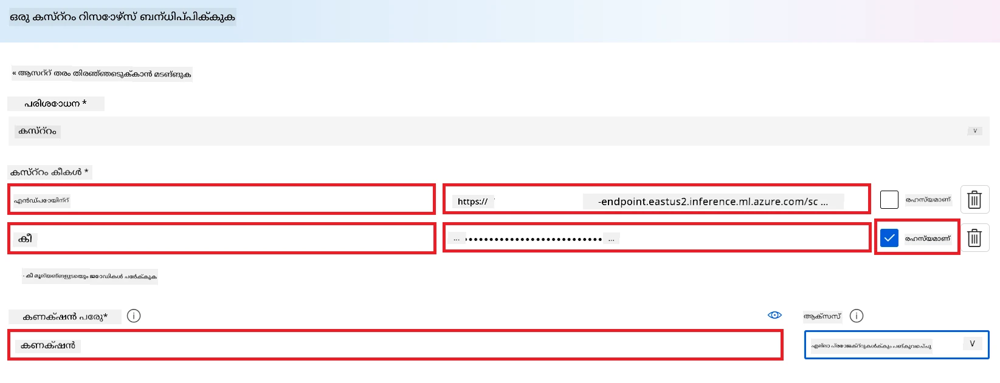

1. **Add connection** തിരഞ്ഞെടുക്കുക.

#### Prompt flow സൃഷ്ടിക്കുക

നിങ്ങൾ Azure AI Foundry-യിൽ കസ്റ്റം കണക്ഷൻ ചേർത്തിട്ടുണ്ട്. ഇപ്പോൾ താഴെ പറയുന്ന ഘട്ടങ്ങൾ പിന്തുടർന്ന് Prompt flow സൃഷ്ടിക്കാം. തുടർന്ന്, ഈ Prompt flow കസ്റ്റം കണക്ഷനുമായി കണക്ട് ചെയ്ത് ഫൈൻ-ട്യൂൺ ചെയ്ത മോഡൽ Prompt flow-ൽ ഉപയോഗിക്കാൻ കഴിയും.

1. നിങ്ങൾ സൃഷ്ടിച്ച Azure AI Foundry പ്രോജക്റ്റിലേക്ക് നാനിഗേറ്റ് ചെയ്യുക.

1. ഇടത് പാനലിൽ നിന്നുള്ള **Prompt flow** തിരഞ്ഞെടുക്കുക.

1. നാനിഗേഷൻ മെനുവിൽ നിന്നുള്ള **+ Create** തിരഞ്ഞെടുക്കുക.

    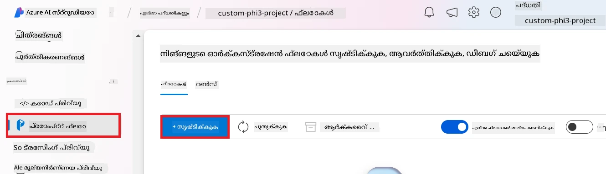

1. നാനിഗേഷൻ മെനുവിൽ നിന്നുള്ള **Chat flow** തിരഞ്ഞെടുക്കുക.

    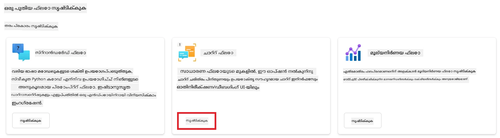

1. ഉപയോഗിക്കാൻ **Folder name** നൽകുക.

    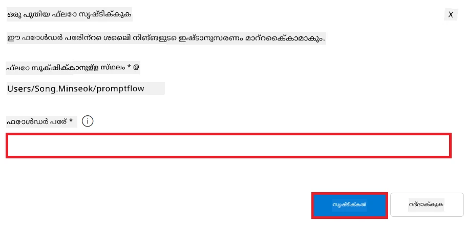

2. **Create** തിരഞ്ഞെടുക്കുക.

#### നിങ്ങളുടെ കസ്റ്റം Phi-3 മോഡലുമായി ചാറ്റ് ചെയ്യുന്നതിന് Prompt flow സജ്ജമാക്കുക

നിങ്ങൾ ഫൈൻ-ട്യൂൺ ചെയ്ത Phi-3 മോഡൽ Prompt flow-യിലേക്കു ഇന്റഗ്രേറ്റ് ചെയ്യേണ്ടതാണ്. എന്നാൽ ലഭ്യമായ Prompt flow ഈ ആവശ്യത്തിന് രൂപകല്പന ചെയ്തിട്ടില്ല. അതിനാൽ, കസ്റ്റം മോഡൽ സമന്വയിപ്പിക്കാൻ Prompt flow വീണ്ടും രൂപകൽപ്പന ചെയ്യേണ്ടതാണ്.

1. Prompt flow-ൽ നിലവിലുള്ള ഫ്ലോ പുനർനിർമ്മിക്കാൻ താഴെ പറയുന്ന പ്രവൃത്തികൾ ചെയ്യുക:

    - **Raw file mode** തിരഞ്ഞെടുക്കുക.
    - *flow.dag.yml* ഫയലിലുള്ള എല്ലാ നിലവിലെ കോഡ് മായ്ക്കുക.
    - *flow.dag.yml* ഫയലിൽ താഴെ കൊടുത്തിരിക്കുന്ന കോഡ് ചേർക്കുക.

        ```yml
        inputs:
          input_data:
            type: string
            default: "Who founded Microsoft?"

        outputs:
          answer:
            type: string
            reference: ${integrate_with_promptflow.output}

        nodes:
        - name: integrate_with_promptflow
          type: python
          source:
            type: code
            path: integrate_with_promptflow.py
          inputs:
            input_data: ${inputs.input_data}
        ```

    - **Save** തിരഞ്ഞെടുക്കുക.

    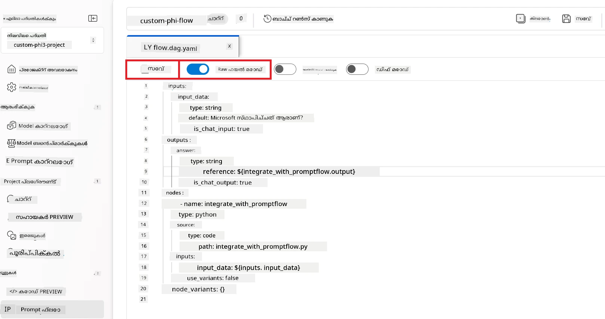

1. Prompt flow-യിൽ കസ്റ്റം Phi-3 മോഡൽ ഉപയോഗിക്കാൻ *integrate_with_promptflow.py* ഫയലിൽ താഴെ കൊടുത്തിരിക്കുന്ന കോഡ് ചേർക്കുക.

    ```python
    import logging
    import requests
    from promptflow import tool
    from promptflow.connections import CustomConnection

    # ലോഗ്ഗിംഗ് സജ്ജീകരണം
    logging.basicConfig(
        format="%(asctime)s - %(levelname)s - %(name)s - %(message)s",
        datefmt="%Y-%m-%d %H:%M:%S",
        level=logging.DEBUG
    )
    logger = logging.getLogger(__name__)

    def query_phi3_model(input_data: str, connection: CustomConnection) -> str:
        """
        Send a request to the Phi-3 model endpoint with the given input data using Custom Connection.
        """

        # "connection" അവിടെ Custom Connection-ന്റെ പേര് ആണ്, "endpoint", "key" Custom Connection-ൽ ഉള്ള കീകളാണ്
        endpoint_url = connection.endpoint
        api_key = connection.key

        headers = {
            "Content-Type": "application/json",
            "Authorization": f"Bearer {api_key}"
        }
        data = {
            "input_data": {
                "input_string": [
                    {"role": "user", "content": input_data}
                ],
                "parameters": {
                    "temperature": 0.7,
                    "max_new_tokens": 128
                }
            }
        }
        try:
            response = requests.post(endpoint_url, json=data, headers=headers)
            response.raise_for_status()
            
            # പൂർണ്ണ JSON പ്രതികരണം ലോഗ് ചെയ്യുക
            logger.debug(f"Full JSON response: {response.json()}")

            result = response.json()["output"]
            logger.info("Successfully received response from Azure ML Endpoint.")
            return result
        except requests.exceptions.RequestException as e:
            logger.error(f"Error querying Azure ML Endpoint: {e}")
            raise

    @tool
    def my_python_tool(input_data: str, connection: CustomConnection) -> str:
        """
        Tool function to process input data and query the Phi-3 model.
        """
        return query_phi3_model(input_data, connection)

    ```

    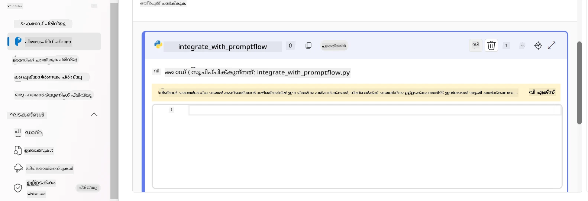

> [!NOTE]
> Azure AI Foundry-യിൽ Prompt flow ഉപയോഗിക്കുന്നതിനെക്കുറിച്ച് കൂടുതൽ വിവരങ്ങൾക്ക്, [Prompt flow in Azure AI Foundry](https://learn.microsoft.com/azure/ai-studio/how-to/prompt-flow) സന്ദർശിക്കുക.

1. **Chat input**, **Chat output** തിരഞ്ഞെടുക്കുക, നിങ്ങളുടെ മോഡലുമായി ചാറ്റ് ചെയ്യാൻ.

    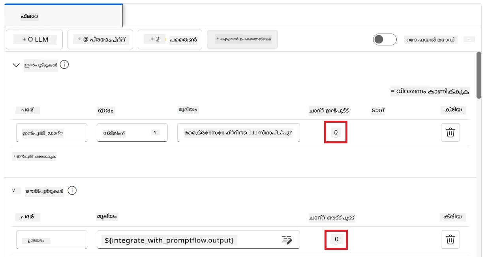

1. ഇപ്പോൾ നിങ്ങൾക്ക് നിങ്ങളുടെ കസ്റ്റം Phi-3 മോഡലുമായി ചാറ്റ് ചെയ്യാൻ തയ്യാറാണ്. അടുത്ത അഭ്യാസത്തിൽ, Prompt flow ആരംഭിക്കുകയും നിങ്ങളുടെ ഫൈൻ-ട്യൂൺ ചെയ്ത Phi-3 മോഡലുമായി അത് ഉപയോഗിച്ച് ചാറ്റ് ചെയ്യാനും പഠിക്കും.

> [!NOTE]
>
> പുനർനിർമ്മിച്ച ഫ്ലോ താഴെ കാണിച്ച ചിത്രം പോലെയാണ്:
>
> 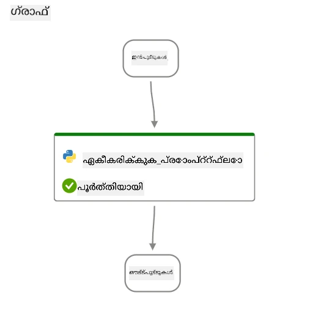
>

### നിങ്ങളുടെ കസ്റ്റം Phi-3 മോഡലുമായി ചാറ്റ് ചെയ്യുക

ഇപ്പോൾ നിങ്ങൾ ഫൈൻ-ട്യൂൺ ചെയ്ത് Prompt flow-ൽ കസ്റ്റം Phi-3 മോഡൽ ഇന്റഗ്രേറ്റ് ചെയ്തിട്ടുണ്ട്, മോഡലുമായി സംവദിക്കാൻ തയ്യാറാണ്. ഈ അഭ്യാസം Prompt flow ഉപയോഗിച്ച് നിങ്ങളുടെ മോഡലുമായി ചാറ്റ് ചെയ്യാനുള്ള ക്രമീകരണവും ആരംഭവുമാണ് നയിക്കുന്നത്. ഈ ഘട്ടങ്ങൾ പിന്തുടർന്ന് നിങ്ങൾ ഫൈൻ-ട്യൂൺ ചെയ്ത Phi-3 മോഡലിന്റെ നിരവധി കഴിവുകളും സംഭാഷണങ്ങളും പൂർണ്ണമായി ഉപയോഗിക്കാനാകും.

- Prompt flow ഉപയോഗിച്ച് നിങ്ങളുടെ കസ്റ്റം Phi-3 മോഡലുമായി ചാറ്റ് ചെയ്യുക.

#### Prompt flow ആരംഭിക്കുക

1. Prompt flow ആരംഭിക്കാൻ **Start compute sessions** തിരഞ്ഞെടുക്കുക.

    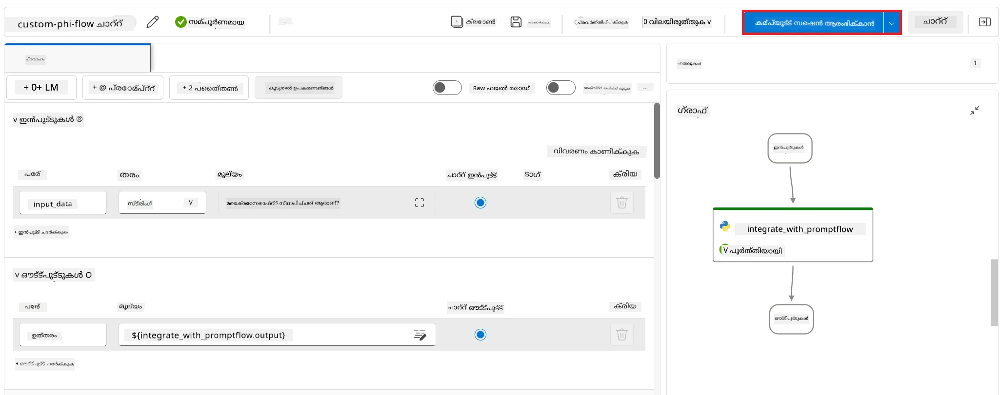

1. പാരാമീറ്ററുകൾ പുതുക്കാൻ **Validate and parse input** തിരഞ്ഞെടുക്കുക.

    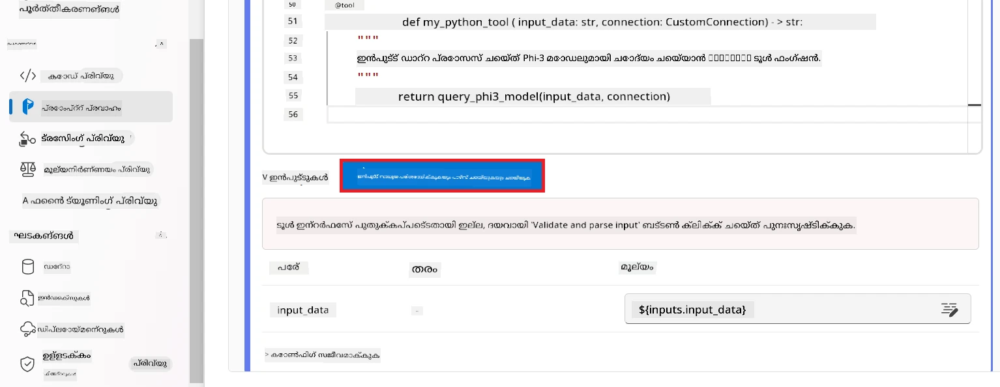

1. നിങ്ങൾ സൃഷ്ടിച്ച കസ്റ്റം കണക്ഷന്റെ **connection** മൂല്യം തിരഞ്ഞെടുക്കുക. ഉദാഹരണത്തിന്, *connection*.

    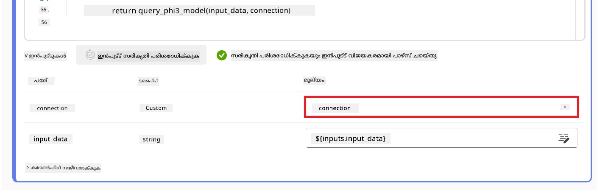

#### നിങ്ങളുടെ കസ്റ്റം മോഡലുമായി ചാറ്റ് ചെയ്യുക

1. **Chat** തിരഞ്ഞെടുക്കുക.

    

1. ഫലങ്ങളുടെ ഒരു ഉദാഹരണം: ഇപ്പോള്‍ നിങ്ങൾക്ക് നിങ്ങളുടെ കസ്റ്റം Phi-3 മോഡലിന് ചാറ്റ് ചെയ്യാം. ഫൈൻ-ട്യൂണിനായി ഉപയോഗിച്ച ഡാറ്റയുടെ അടിസ്ഥാനത്തിൽ ചോദ്യം ചോദിക്കാനാണ് നിർദ്ദേശിക്കുന്നത്.

    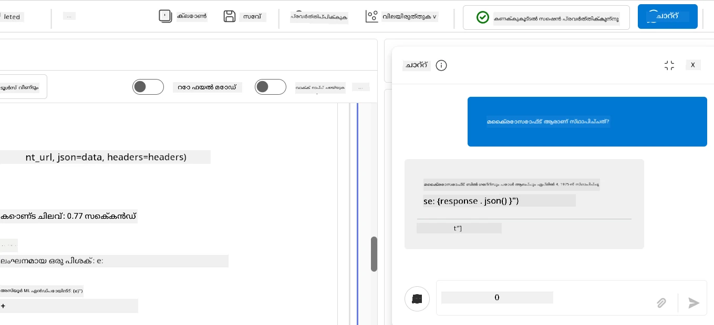

---

<!-- CO-OP TRANSLATOR DISCLAIMER START -->
**വിച്ഛേദനം**:  
ഈ രേഖ [കോ-ഓപ് ട്രാൻസ്ലേറ്റർ](https://github.com/Azure/co-op-translator) എന്ന എ.ഐ. ട്രാൻസ്ലേഷൻ സേവനം ഉപയോഗിച്ച് പരിഭാഷപ്പെടുത്തിയതാണ്. ഞങ്ങൾ കൃത്യതക്ക് ശ്രമിക്കുമ്പോഴും, ഓട്ടോമാറ്റഡ് തർജ്ജമയിൽ പിശകുകൾ അല്ലെങ്കിൽ അപരിഷ്കൃതതകൾ ഉണ്ടാകാമെന്ന് ദയവായി ശ്രദ്ധിക്കുക. യഥാർത്ഥ രേഖ അതിന്റെ സ്വന്തം ഭാഷയിലുള്ളത് പ്രാമാണിക സ്രോതസ്സായി കണക്കാക്കണം. നിർണായക വിവരങ്ങൾക്കായി പ്രൊഫഷണൽ മനുഷ്യ പരിഭാഷയെ അഭ്യർത്ഥിക്കുന്നു. ഈ പരിഭാഷ ഉപയോഗിച്ചതിനാൽ ഉണ്ടാകാവുന്ന തെറ്റിദ്ധാരണകൾക്കോ തെറ്റ് വ്യാഖ്യാനങ്ങൾക്കോ ഞങ്ങൾ ഉത്തരവാദികളാകില്ല.
<!-- CO-OP TRANSLATOR DISCLAIMER END -->