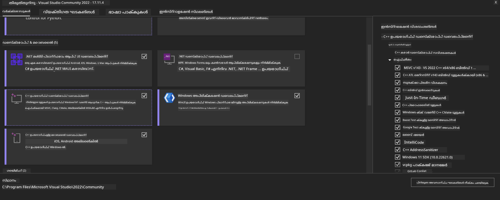

<!--
CO_OP_TRANSLATOR_METADATA:
{
  "original_hash": "b066fc29c1b2129df84e027cb75119ce",
  "translation_date": "2025-12-21T21:08:44+00:00",
  "source_file": "md/02.Application/01.TextAndChat/Phi3/ORTWindowGPUGuideline.md",
  "language_code": "ml"
}
-->
# **OnnxRuntime GenAI Windows GPU-ക്കുള്ള മാർഗ്ഗനിർദ്ദേശം**

ഈ മാർഗ്ഗനിർദ്ദേശം Windows-ൽ GPUകൾ ഉപയോഗിച്ച് ONNX Runtime (ORT) ക്രമീകരിക്കുകയും ഉപയോഗിക്കുകയും ചെയ്യുന്നതിനുള്ള ചുവടുപടികൾ നൽകുന്നു. ഇത് നിങ്ങളുടെ മോഡലുകൾക്ക് GPU ശീഘ്രത വേഗത വർദ്ധിപ്പിക്കാൻ, പ്രകടനവും ദക്ഷതയും മെച്ചപ്പെടുത്താൻ സഹായിക്കുന്നതിനായി രൂപകൽപ്പന ചെയ്‍തതാണ്.

ഡോക്യുമെന്റ് നൽകിയിരിക്കുന്ന മാർഗ്ദർശനം:

- പരിസ്ഥിതി ക്രമീകരണം: CUDA, cuDNN, ONNX Runtime എന്നിവ പോലുള്ള ആവശ്യമായ ഡിപ്പൻഡൻസികൾ نصب ചെയ്യുന്നതിന്‍റെ നിർദേശങ്ങൾ.
- കോൺഫിഗറേഷൻ: GPU വിഭവങ്ങൾ ഫലപ്രദമായി ഉപയോഗിക്കാൻ പരിസ്ഥിതിയും ONNX Runtime-ഉം എങ്ങനെ കോൺഫിഗർ ചെയ്യാമെന്ന്.
- ഒപ്റ്റിമൈസേഷൻ ടിപ്പുകൾ: മികച്ച പ്രകടനത്തിന് GPU ക്രമീകരണങ്ങൾ എങ്ങനെ ഫൈൻ-ട്യൂൺ ചെയ്യാമെന്നു സംബന്ധിച്ച ഉപദ്ദേശങ്ങൾ.

### **1. Python 3.10.x /3.11.8**

   ***കുറിപ്പ്*** നിങ്ങളുടെ Python പരിസ്ഥിതിക്കായി [miniforge](https://github.com/conda-forge/miniforge/releases/latest/download/Miniforge3-Windows-x86_64.exe) ഉപയോഗിക്കാൻ ശുപാർശ ചെയ്യുന്നു

   ```bash

   conda create -n pydev python==3.11.8

   conda activate pydev

   ```

   ***സ്മരണം*** നിങ്ങൾ Python-സംബന്ധിയായ ONNX ലൈബ്രറി ഏതെങ്കിലും ഇൻസ്റ്റാൾ ചെയ്തിട്ടുണ്ടെങ്കിൽ, ദയവായി അത് അൺഇൻസ്റ്റാൾ ചെയ്യുക

### **2. Install CMake with winget**


   ```bash

   winget install -e --id Kitware.CMake

   ```

### **3. Install Visual Studio 2022 - Desktop Development with C++**

   ***കുറിപ്പ്*** നിങ്ങൾ കമ്പൈൽ ചെയ്യാൻ ആഗ്രഹിക്കുന്നില്ലെങ്കിൽ ഈ ഘട്ടം ഒഴിവാക്കാം




### **4. Install NVIDIA Driver**

1. **NVIDIA GPU Driver**  [https://www.nvidia.com/en-us/drivers/](https://www.nvidia.com/en-us/drivers/)

2. **NVIDIA CUDA 12.4** [https://developer.nvidia.com/cuda-12-4-0-download-archive](https://developer.nvidia.com/cuda-12-4-0-download-archive)

3. **NVIDIA CUDNN 9.4**  [https://developer.nvidia.com/cudnn-downloads](https://developer.nvidia.com/cudnn-downloads)

***സ്മരണം*** ഇൻസ്റ്റലേഷൻ പ്രവാഹത്തിൽ ഡീഫോൾട്ട് സജ്ജീകരണങ്ങൾ ഉപയോഗിക്കുക

### **5. Set NVIDIA Env**

NVIDIA CUDNN 9.4 ലെ lib, bin, include ഫയലുകൾ NVIDIA CUDA 12.4 ലെ lib, bin, include-ലേക്ക് പകർത്തുക

- പകർത്തുക *'C:\Program Files\NVIDIA\CUDNN\v9.4\bin\12.6'* ഫയലുകൾ *'C:\Program Files\NVIDIA GPU Computing Toolkit\CUDA\v12.4\bin*

- പകർത്തുക *'C:\Program Files\NVIDIA\CUDNN\v9.4\include\12.6'* ഫയലുകൾ *'C:\Program Files\NVIDIA GPU Computing Toolkit\CUDA\v12.4\include*

- പകർത്തുക *'C:\Program Files\NVIDIA\CUDNN\v9.4\lib\12.6'* ഫയലുകൾ *'C:\Program Files\NVIDIA GPU Computing Toolkit\CUDA\v12.4\lib\x64'*


### **6. Download Phi-3.5-mini-instruct-onnx**


   ```bash

   winget install -e --id Git.Git

   winget install -e --id GitHub.GitLFS

   git lfs install

   git clone https://huggingface.co/microsoft/Phi-3.5-mini-instruct-onnx

   ```

### **7. InferencePhi35Instruct.ipynb ഓടിക്കുക**

   [Notebook](../../../../code/09.UpdateSamples/Aug/ortgpu-phi35-instruct.ipynb) തുറന്ന് ഓടിക്കുക


### **8. Compile ORT GenAI GPU**


   ***കുറിപ്പ്*** 
   
   1. ദയവായി ആദ്യം onnx, onnxruntime, onnxruntime-genai എന്നിവയെല്ലാം അൺഇൻസ്റ്റാൾ ചെയ്യുക

   
   ```bash

   pip list 
   
   ```

   പിന്നീട് എല്ലാ onnxruntime ലൈബ്രറികളും അൺഇൻസ്റ്റാൾ ചെയ്യുക, അഥവാ 


   ```bash

   pip uninstall onnxruntime

   pip uninstall onnxruntime-genai

   pip uninstall onnxruntume-genai-cuda
   
   ```

   2. Visual Studio എക്സ്റ്റെൻഷൻ സപ്പോർട്ട് പരിശോധിക്കുക 

   C:\Program Files\NVIDIA GPU Computing Toolkit\CUDA\v12.4\extras പരിശോധിച്ച് C:\Program Files\NVIDIA GPU Computing Toolkit\CUDA\v12.4\extras\visual_studio_integration ഉണ്ടോയെന്ന് ഉറപ്പാക്കുക. 
   
   കാണാനില്ലെങ്കിൽ മറ്റു Cuda toolkit ഡ്രൈവർ ഫോൾഡറുകളും പരിശോധിച്ച് visual_studio_integration ഫോളഡർ അതിന്റെ ഉള്ളടക്കങ്ങളോടുകൂടി C:\Program Files\NVIDIA GPU Computing Toolkit\CUDA\v12.4\extras\visual_studio_integration എന്നിലേക്ക് പകർത്തുക


   - നിങ്ങൾ കമ്പൈൽ ചെയ്യാൻ ആഗ്രഹിക്കാത്തെങ്കിൽ ഈ ഘട്ടം ഒഴിവാക്കാം


   ```bash

   git clone https://github.com/microsoft/onnxruntime-genai

   ```

   - ഡൗൺലോഡ് ചെയ്യുക [https://github.com/microsoft/onnxruntime/releases/download/v1.19.2/onnxruntime-win-x64-gpu-1.19.2.zip](https://github.com/microsoft/onnxruntime/releases/download/v1.19.2/onnxruntime-win-x64-gpu-1.19.2.zip)

   - onnxruntime-win-x64-gpu-1.19.2.zip അൺസിപ്പ് ചെയ്ത് അതിന് **ort** എന്ന പേര് മാറ്റി, ort ഫോൾഡർ onnxruntime-genai ലേക്ക് പകർത്തുക

   - Windows Terminal ഉപയോഗിച്ച്, VS 2022-നുള്ള Developer Command Prompt തുറന്ന് onnxruntime-genai ഫോൾഡറിലേക്ക് പോകുക


   - നിങ്ങളുടെ Python പരിസ്ഥിതിയോടുകൂടി അതിനെ കമ്പൈൽ ചെയ്യുക

   
   ```bash

   cd onnxruntime-genai

   python build.py --use_cuda  --cuda_home "C:\Program Files\NVIDIA GPU Computing Toolkit\CUDA\v12.4" --config Release
 

   cd build/Windows/Release/Wheel

   pip install .whl

   ```

---

<!-- CO-OP TRANSLATOR DISCLAIMER START -->
ഡിസ്‌ക്ലെയിമർ:
ഈ രേഖ AI വിവർത്തന സേവനം Co-op Translator (https://github.com/Azure/co-op-translator) ഉപയോഗിച്ച് വിവർത്തനം ചെയ്തതാണ്. ഞങ്ങൾ കൃത്യതയ്ക്ക് ശ്രമിച്ചിട്ടുണ്ടെങ്കിലും, ഓട്ടോമേറ്റഡ് വിവർത്തനങ്ങളിൽ തെറ്റുകൾ അല്ലെങ്കിൽ അസാധുതകൾ ഉണ്ടായിരിക്കാമെന്ന് ദയവായി ശ്രദ്ധിക്കുക. അതിന്റെ മാതൃഭാഷയിലുള്ള അസൽ രേഖ പ്രാമാണിക ഉറവിടമായാണ് പരിഗണിക്കേണ്ടത്. നിർണ്ണായകമായ വിവരങ്ങൾക്ക് പ്രൊഫഷണൽ മനുഷ്യ വിവർത്തനം ശിപാർശ ചെയ്യപ്പെടുന്നു. ഈ വിവർത്തനം ഉപയോഗിച്ചതിൽ നിന്നുണ്ടാവുന്ന ഏതെങ്കിലും തെറ്റിദ്ധാരണകൾക്കും തെറ്റായ വ്യാഖ്യാനങ്ങൾക്കും ഞങ്ങൾ ബാധ്യസ്ഥരല്ല.
<!-- CO-OP TRANSLATOR DISCLAIMER END -->