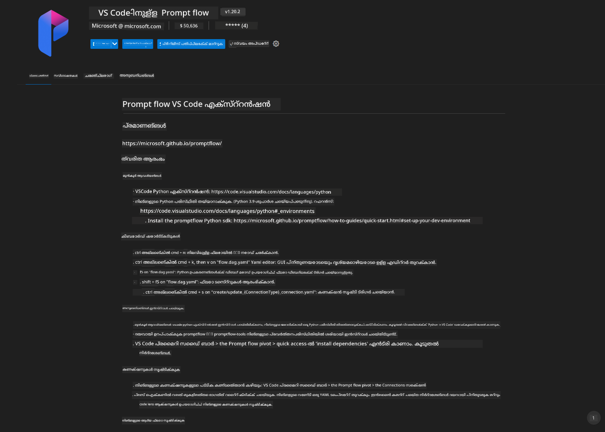
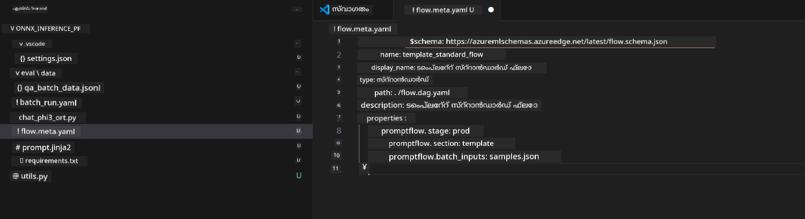
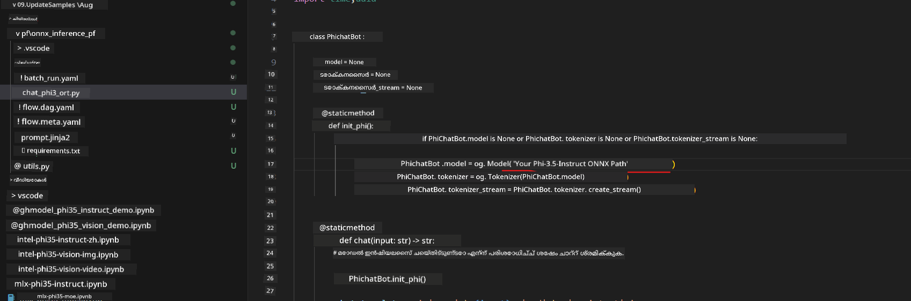
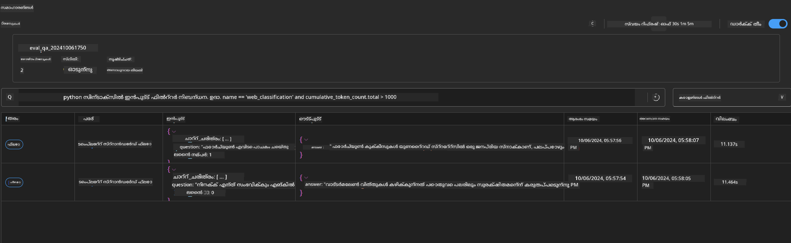

<!--
CO_OP_TRANSLATOR_METADATA:
{
  "original_hash": "92e7dac1e5af0dd7c94170fdaf6860fe",
  "translation_date": "2025-12-21T21:43:12+00:00",
  "source_file": "md/02.Application/01.TextAndChat/Phi3/UsingPromptFlowWithONNX.md",
  "language_code": "ml"
}
-->
# Windows GPU ഉപയോഗിച്ച് Phi-3.5-Instruct ONNX അടിസ്ഥാനമാക്കി Prompt flow പരിഹാരം സൃഷ്ടിക്കുന്നത്

താഴെ കൊടുത്തിരിക്കുന്ന ഡോക്യൂമെന്റ് Phi-3 മോഡലുകളുടെ അടിസ്ഥാനത്തിൽ AI അപ്ലിക്കേഷനുകൾ വികസിപ്പിക്കാൻ PromptFlow നെയും ONNX (Open Neural Network Exchange) നെയും എങ്ങനെ ഉപയോഗിക്കാമെന്നുള്ള ഉദാഹരണമാണ്.

PromptFlow ഒരു വികസന ഉപകരണങ്ങളുടെ സ്യൂട്ട് ആയതാണ്, LLM അടിസ്ഥാനമാക്കിയുള്ള (Large Language Model) AI അപ്ലിക്കേഷനുകളുടെ ഒരു സമ്പൂർണ്ണ ഡെവലപ്മെന്റ് സൈക്കിൾ — ആശയമുളളത് മുതൽ പ്രോട്ടോടൈപ്പ്, ടെസ്റ്റിംഗ്, മൂല്യനിർണയം എന്നിവ വരെയുള്ള പ്രവർത്തനങ്ങൾ — സുഗമമാക്കാൻ രൂപകല്‍പ്പന ചെയ്തതാണ്.

PromptFlow നെയും ONNX നെയും സംയോജിപ്പിച്ചാൽ വികസനകർക്ക് സാധിക്കും:

- Optimize Model Performance: ഫലപ്രദമായ മോഡൽ ഇൻഫറൻസ് ಮತ್ತು ഡിപ്ലോയ്മെന്റിന് ONNX ഉപയോഗിക്കുക.
- Simplify Development: പ്രവാഹം മാനേജ് ചെയ്യാനും ആവർത്തിക്കുന്ന പ്രവർത്തനങ്ങൾ ഓട്ടോമേറ്റുചെയ്യാനുമുള്ള PromptFlow ഉപയോഗിക്കുക.
- Enhance Collaboration: ഐക്യവത്കൃത ഡെവലപ്മെന്റ് പരിസ്ഥിതിയിലൂടെ ടീമംഗങ്ങൾക്ക് മെച്ചപ്പെട്ട സഹകരണം അനുവദിക്കുക.

**Prompt flow** ഒരു വികസന ഉപകരണങ്ങളുടെ സ്യൂട്ട് ആണ്, LLM അടിസ്ഥാനമാക്കിയുള്ള AI ആപ്ലിക്കേഷനുകൾ വികസിപ്പിക്കുന്ന സമ്പൂർണ്ണ സൈക്കിൾ — ആശയഉൽപത്തിയും പ്രോട്ടോടൈപ്പിംഗും, ടെസ്റ്റിങ്ങും, മൂല്യനിർണയവും മുതൽ പ്രൊഡക്ഷൻ ഡിപ്ലോയ്‌മെന്റും മോണിറ്ററിംഗും വരെ — എളുപ്പമാക്കാൻ രൂപകൽപ്പന ചെയ്തിരിക്കുന്നു. ഇത് പ്രൊംപ്റ്റ് എഞ്ചിനീയറിംഗ് എളുപ്പമാക്കുകയും പ്രൊഡക്ഷൻ ഗുണമേന്മയുള്ള LLM ആപ്ലിക്കേഷനുകൾ നിർമിക്കാൻ നിങ്ങളെ സഹായിക്കുകയും ചെയ്യുന്നു.

Prompt flow OpenAI, Azure OpenAI Service, ಮತ್ತು കസ്റ്റമൈസബിൾ മോഡലുകൾ (Huggingface, local LLM/SLM) എന്നിവയുമായി ബന്ധിപ്പിക്കാവുന്നതാണ്. Phi-3.5 യുടെ quantized ONNX മോഡൽ ലോക്കൽ ആപ്ലിക്കേഷനുകൾക്ക് ഡിപ്ലോയ് ചെയ്യാൻ ഞങ്ങൾ പ്രതീക്ഷിക്കുന്നു. Prompt flow നമുക്ക് ബിസിനസ്സ് നിരൂപണം മെച്ചപ്പെടുത്തി Phi-3.5 അധിഷ്ഠിത ലോക്കൽ സൊലൂഷനുകൾ പൂർത്തിയാക്കാൻ സഹായിക്കാം. ഈ ഉദാഹരണത്തിൽ, Windows GPU അടിസ്ഥാനമാക്കിയുള്ള Prompt flow പരിഹാരം പൂരിപ്പിക്കാൻ ONNX Runtime GenAI Library ന്റെ സംയോജനം ഉപയോഗിക്കുന്നു.

## **Installation**

### **ONNX Runtime GenAI for Windows GPU**

ONNX Runtime GenAI for Windows GPU സജ്ജമാക്കാൻ ഈ ഗൈഡ് വായിക്കുക  [ഇവിടെ ക്ലിക്ക് ചെയ്യുക](./ORTWindowGPUGuideline.md)

### **Set up Prompt flow in VSCode**

1. Install Prompt flow VS Code Extension



2. After install Prompt flow VS Code Extension， click the extension，and choose **Installation dependencies** follow this guideline to install Prompt flow SDK in your env


3. Download [Sample Code](../../../../../../code/09.UpdateSamples/Aug/pf/onnx_inference_pf) and use VS Code to open this sample



4. Open **flow.dag.yaml** to choose your Python env


   Open **chat_phi3_ort.py** to change your Phi-3.5-instruct ONNX Model location



5. Run your prompt flow to testing

Open **flow.dag.yaml** click visual editor


after click this,and run it to test


1. You can run batch in terminal to check more result


```bash

pf run create --file batch_run.yaml --stream --name 'Your eval qa name'    

```

ഫലങ്ങൾ നിങ്ങളുടെ ഡീഫോൾട്ട് ബ്രൗസറിൽ പരിശോധിക്കാവുന്നതാണ്




---

<!-- CO-OP TRANSLATOR DISCLAIMER START -->
അറിയിപ്പ്:
ഈ രേഖ AI പരിഭാഷാ സേവനമായ [Co-op Translator](https://github.com/Azure/co-op-translator) ഉപയോഗിച്ചാണ് പരിഭാഷിച്ചത്. ഞങ്ങൾ കൃത്യതയ്ക്ക് ശ്രമിച്ചെങ്കിലും, ഓട്ടോമേറ്റഡ് പരിഭാഷകളിൽ പിശകുകൾ അല്ലെങ്കിൽ അസൂയാസ്പദമായ വ്യത്യാസങ്ങൾ ഉണ്ടാകാം എന്ന点 ദയവായി ശ്രദ്ധിക്കുക. സ്വഭാഷയിലെ ഒറിജിനൽ പ്രമാണം അധികാരപരവും വിശ്വാസയോഗ്യവുമായ ഉറവിടമായി കാണപ്പെടണം. നിർണായകമായ വിവരങ്ങൾക്കായി പ്രൊഫഷണൽ മനുഷ്യപരിഭാഷ നിർദ്ദേശിക്കുന്നു. ഈ പരിഭാഷയുടെ ഉപയോഗത്തിൽ നിന്നുണ്ടാകുന്ന ഏതൊരു തെറ്റിദ്ധാരണത്തിനും വായ്പ്പിനും ഞങ്ങൾ ഉത്തരവാദികളല്ല.
<!-- CO-OP TRANSLATOR DISCLAIMER END -->