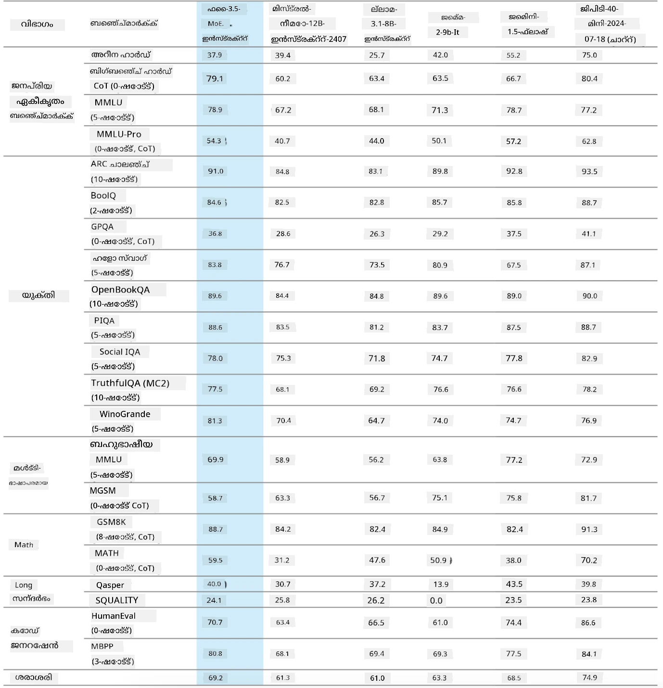
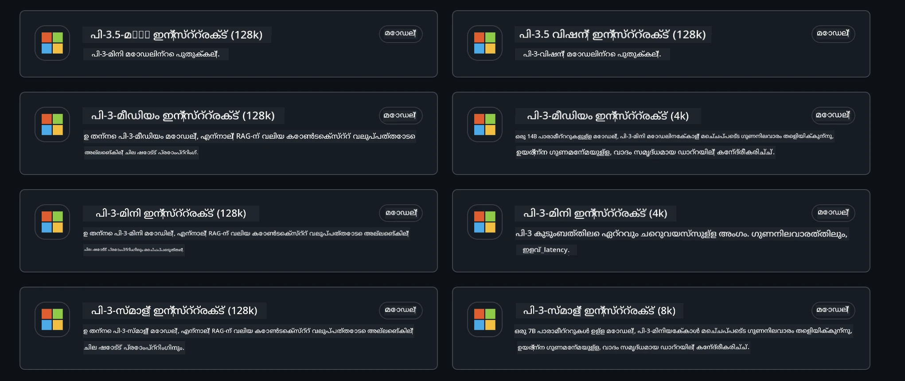
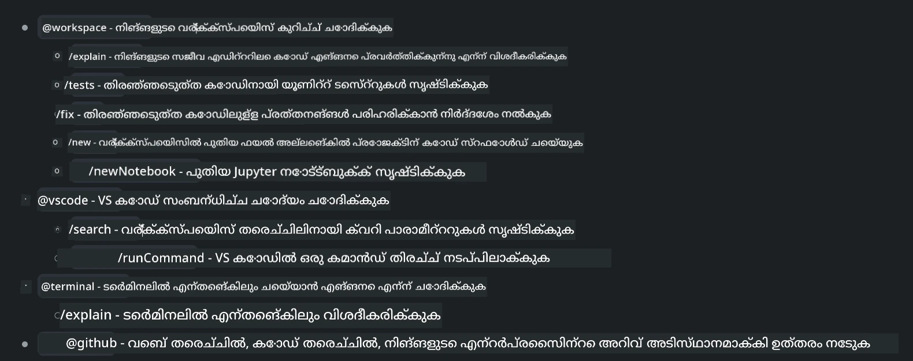
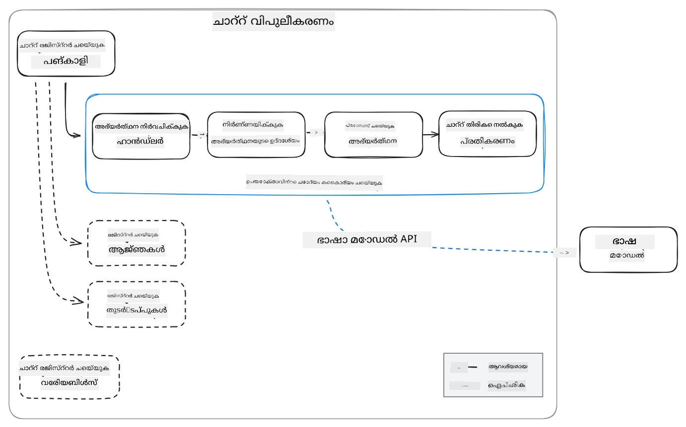
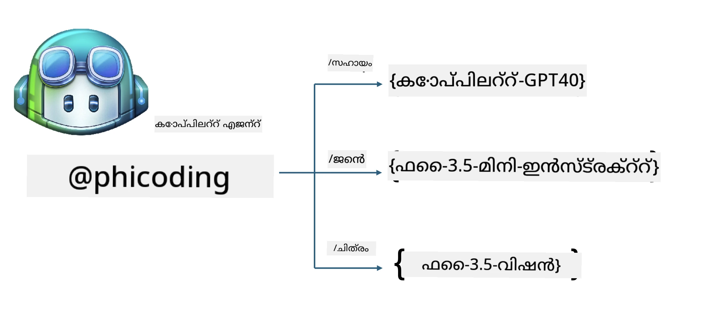
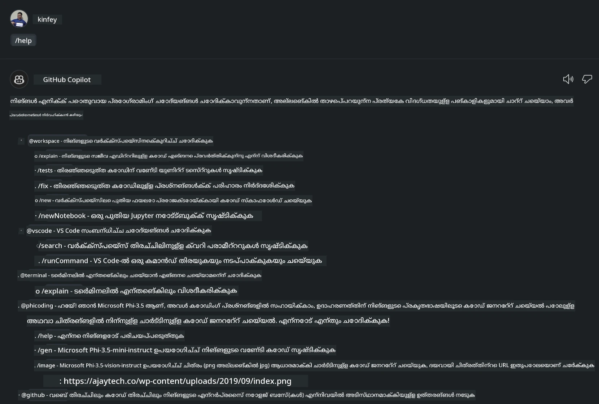
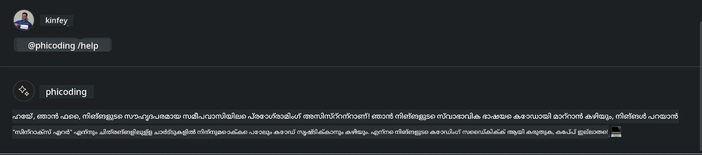
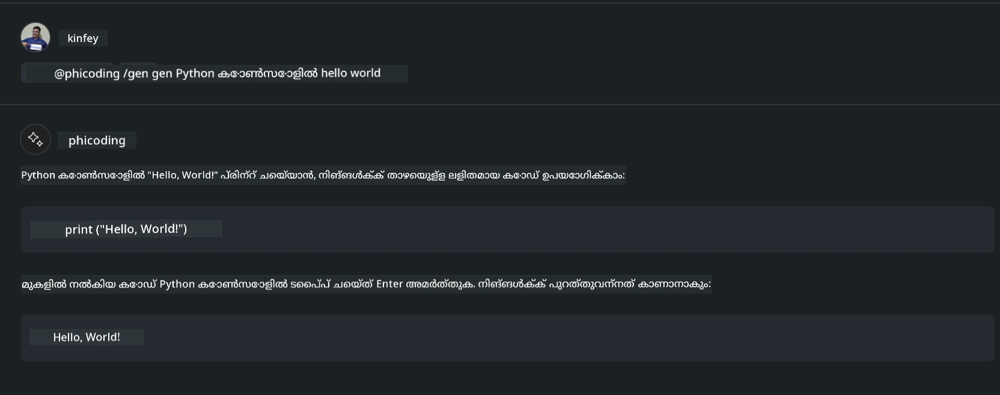
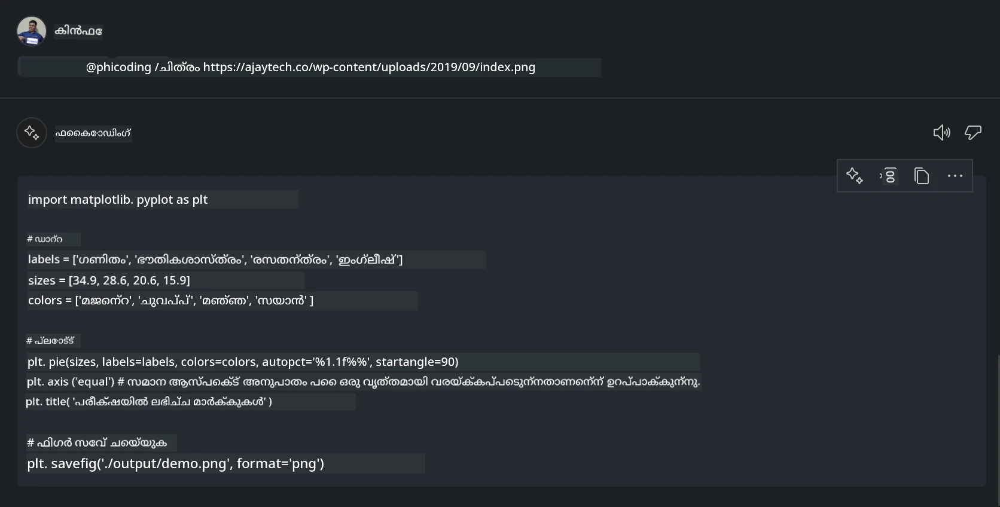

<!--
CO_OP_TRANSLATOR_METADATA:
{
  "original_hash": "35bf81388ac6917277b8d9a0c39bdc70",
  "translation_date": "2025-12-21T19:21:05+00:00",
  "source_file": "md/02.Application/02.Code/Phi3/CreateVSCodeChatAgentWithGitHubModels.md",
  "language_code": "ml"
}
-->
# **GitHub Models-ൽ നിന്ന് Phi-3.5 ഉപയോഗിച്ച് നിങ്ങളുടെ സ്വന്തം Visual Studio Code Chat Copilot ഏജന്റ് സൃഷ്ടിക്കുക**

നിങ്ങൾ Visual Studio Code Copilot ഉപയോഗിക്കുന്നുണ്ടോ? പ്രത്യേകിച്ച് Chat-ൽ, പ്രോജക്ടുകൾ Visual Studio Code-ൽ സൃഷ്ടിക്കാനും എഴുതാനുമായി പരിപാലിക്കാനും കഴിവ് കൂട്ടാൻ വ്യത്യസ്ത ഏജന്റുകൾ ഉപയോഗിക്കാൻ കഴിയും. Visual Studio Code സ്ഥാപനങ്ങൾക്ക്‌ക്കും വ്യക്തികൾക്കും അവരുടെ ബിസിനസിനെ അടിസ്ഥാനമാക്കി വിവിധ ഏജന്റുകൾ സൃഷ്ടിക്കാൻ അനുവദിക്കുന്ന ഒരു API നൽകുന്നു, ഇത് വ്യത്യസ്ത പൈരറ്റ്‍ട്രറി ഫീൽഡ്‌കളിൽ അവരുടെ കഴിവുകൾ വിപുലീകരിക്കാൻ സഹായിക്കുന്നു. ഈ ലേഖനത്തിൽ, GitHub Models-ലെ **Phi-3.5-mini-instruct (128k)** மற்றும் **Phi-3.5-vision-instruct (128k)** ഉപയോഗിച്ച് നിങ്ങളുടെ സ്വന്തം Visual Studio Code ഏജന്റ് സൃഷ്ടിക്കലിലാണ് നാം ശ്രദ്ധ കേന്ദ്രീകരിക്കുന്നത്.

## **GitHub Models-ൽ Phi-3.5 സംബന്ധിച്ച്**

നമുക്ക് معلومമാണ് Phi-3/3.5-mini-instruct Phi-3/3.5 ഫാമിലിയിലെ കോഡ് മനസ്സിലാക്കലിലും ജനറേഷൻ കഴിവുകളിലും ശക്തമായി നിലകൊള്ളുന്നതെന്നും, ഇത് Gemma-2-9b and Mistral-Nemo-12B-instruct-2407 ന് മേല്‍ ചില നേട്ടങ്ങൾ ഉണ്ട് എന്നും.



The latest GitHub Models already provide access to the Phi-3.5-mini-instruct (128k) and Phi-3.5-vision-instruct (128k) models. Developers can access them through the OpenAI SDK, Azure AI Inference SDK, and REST API.



***കുറിപ്പ്:*** ഇവിടെയാണ് Azure AI Inference SDK ഉപയോഗിക്കുന്നത് ശുപാർശ ചെയ്യപ്പെടുന്നത്, കാരണം പ്രൊഡക്ഷൻ ortam-ൽ Azure Model Catalog-ഉടനുള്ള സ്വിച്ച്‌ ചെയ്യലുകൾ മികച്ചതാകും

താഴെ GitHub Models-നോട് ഡോക്കിംഗ് ചെയ്ത് കോഡ് ജനറേഷൻ സീനാറിയോയിൽ **Phi-3.5-mini-instruct (128k)** ۽ **Phi-3.5-vision-instruct (128k)** ന്റെ ഫലങ്ങളാണ് കാണിക്കുന്നത്, കൂടാതെ താഴെ വരുന്ന ഉദാഹരണങ്ങൾക്ക് ഒരുക്കം ചെയ്യുന്നു

**Demo: GitHub Models Phi-3.5-mini-instruct (128k) generate code from Prompt** ([click this link](../../../../code/09.UpdateSamples/Aug/ghmodel_phi35_instruct_demo.ipynb))

**Demo: GitHub Models Phi-3.5-vision-instruct (128k) generate code from Image** ([click this link](../../../../code/09.UpdateSamples/Aug/ghmodel_phi35_vision_demo.ipynb))


## **GitHub Copilot Chat Agent గురించి**

GitHub Copilot Chat Agent കോഡ് അടിസ്ഥാനമാക്കി വിവിധ പ്രോജക്ട് സീനാരികളിൽ വ്യത്യസ്ത ജോലികൾ പൂർത്തിയാക്കാൻ കഴിയും. സിസ്റ്റത്തിലുണ്ട് നാല് ഏജന്റുകൾ: workspace, github, terminal, vscode



ഏജന്റിന്റെ പേരിന് ‘@’ ചേർക്കുന്നതിലൂടെ, നിങ്ങൾ ആ പ്രസക്ത ജോലികൾ ദ്രുതഗതിയിൽ പൂർത്തിയാക്കാം. എന്റർപ്രൈസുകൾക്കായി, നിങ്ങൾ നിങ്ങളുടെ ബിസിനസ്-സംബന്ധമായ ഉള്ളടക്കങ്ങൾ (ഉദാഹരണത്തിന് ആവശ്യകതകൾ, കോഡിംഗ്, ടെസ്റ്റ് പ്രത്യേകണങ്ങൾ, റിലീസ് മുതലായവ) ചേർത്ത് GitHub Copilot അടിസ്ഥാനമാക്കിയുള്ള കൂടുതൽ ശക്തമായ എന്റർപ്രൈസ് പ്രൈവറ്റ് ഫംഗ്ഷനുകൾ കൈവശമാക്കാം.

Visua Studio Code Chat Agent ഇപ്പോൾ ഔപചാരികമായി അതിന്റെ API പുറത്തിറക്കി, ഇത് എന്റർപ്രൈസുകൾക്കും എന്റർപ്രൈസ് വികസകരോടും വിവിധ സോഫ്‌റ്റ്‌വെയർ ബിസിനസ് ഇക്കോസിസ്റ്റങ്ങളിലേയ്ക്ക് അധിഷ്ഠിതമായി ഏജന്റുകൾ വികസിപ്പിക്കാൻ അനുവദിക്കുന്നു. Visual Studio Code Extension Development എന്ന വികസന രീതിയെ അടിസ്ഥാനമാക്കി, നിങ്ങൾക്ക് Visua Studio Code Chat Agent API ഇന്റർഫേസ് എളുപ്പത്തിൽ ആക്സസ് ചെയ്യാനാകും. നാം താഴെ കാണുന്ന പ്രക്രിയയെ അടിസ്ഥാനമാക്കി വികസിപ്പിക്കാം



വികസന സീനാരിയോയിൽ മൂന്നാം പാർട്ടി മോഡൽ APIs (ഉദാഹരണത്തിന് GitHub Models, Azure Model Catalog, open source മോഡലുകൾ അടിസ്ഥാനമാക്കി സ്വയം നിർമ്മിച്ച സേവനങ്ങൾ) ആക്സസ് ചെയ്യാനുള്ള പിന്തുണ ഉണ്ടായിരുന്നു, കൂടാതെ GitHub Copilot നൽകുന്ന gpt-35-turbo, gpt-4, gpt-4o മോഡലുകളും ഉപയോഗിക്കാം.

## **Phi-3.5 അടിസ്ഥാനമാക്കിയുള്ള @phicoding ഏജന്റ് ചേർക്കുക**

നാം Phi-3.5-ന്റെ പ്രോഗ്രാമിംഗ് ശേഷികൾ സംയോജിപ്പിച്ച് കോഡ് എഴുതൽ, ഇമേജ് ജനറേഷൻ കോഡ് എന്നിവ പൂർത്തിയാക്കാൻ ശ്രമിക്കുന്നു. Phi-3.5 ചുറ്റും നിർദ്ദിഷ്ടമായി റികവസ്റ്റ് രൂപപ്പെടുത്തിയ ഒരു ഏജന്റ് - @PHI സൃഷ്ടിക്കുക, താഴെ ചില ഫംഗ്ഷനുകൾ ലഭ്യമാണ്

1. GitHub Copilot നൽകരുന്ന GPT-4o അടിസ്ഥാനമാക്കി **@phicoding /help** കമാൻഡിലൂടെ സ്വയം പരിചയപ്പെടുത്തൽ (self-introduction) ജനറേറ്റ് ചെയ്യുക

2. **Phi-3.5-mini-instruct (128k)** ഉപയോഗിച്ച് വിവിധ പ്രോഗ്രാമിംഗ് ഭാഷകളുടെ കോഡ് ജനറേറ്റ് ചെയ്യാൻ **@phicoding /gen** കമാൻഡ് ഉപയോഗിക്കുക

3. **Phi-3.5-vision-instruct (128k)** അധിഷ്ഠിതമായി ചിത്രം ഉപയോഗിച്ച് കോഡ് ജനറേറ്റ് ചെയ്യാനും ഇമേജ് പൂർത്തീകരണവും **@phicoding /image** കമാൻഡ് വഴി ചെയ്യുക



## **ബന്ധപ്പെട്ട നടപടികൾ**

1. npm ഉപയോഗിച്ച് Visual Studio Code Extension development support ഇൻസ്റ്റാൾ ചെയ്യുക

```bash

npm install --global yo generator-code 

```
2. Create a Visual Studio Code Extension plugin (using Typescript development mode, named phiext)


```bash

yo code 

```

3. സൃഷ്ടിച്ച പ്രോജക്റ്റ് തുറന്ന് package.json മാറ്റങ്ങൾ വരുത്തുക. ഇതാ ബന്ധപ്പെട്ട നിർദേശങ്ങളും കോൺഫിഗറേഷനുകളും, കൂടെ GitHub Models-ന്റെ കോൺഫിഗറേഷനും. ശ്രദ്ധിക്കുക, ഇവിടെ നിങ്ങളുടെ GitHub Models ടോക്കൺ ചേർക്കേണ്ടതുണ്ട്.


```json

{
  "name": "phiext",
  "displayName": "phiext",
  "description": "",
  "version": "0.0.1",
  "engines": {
    "vscode": "^1.93.0"
  },
  "categories": [
    "AI",
    "Chat"
  ],
  "activationEvents": [],
  "enabledApiProposals": [
      "chatVariableResolver"
  ],
  "main": "./dist/extension.js",
  "contributes": {
    "chatParticipants": [
        {
            "id": "chat.phicoding",
            "name": "phicoding",
            "description": "Hey! I am Microsoft Phi-3.5, She can help me with coding problems, such as generation code with your natural language, or even generation code about chart from images. Just ask me anything!",
            "isSticky": true,
            "commands": [
                {
                    "name": "help",
                    "description": "Introduce myself to you"
                },
                {
                    "name": "gen",
                    "description": "Generate code for you with Microsoft Phi-3.5-mini-instruct"
                },
                {
                    "name": "image",
                    "description": "Generate code for chart from image(png or jpg) with Microsoft Phi-3.5-vision-instruct, please add image url like this : https://ajaytech.co/wp-content/uploads/2019/09/index.png"
                }
            ]
        }
    ],
    "commands": [
        {
            "command": "phicoding.namesInEditor",
            "title": "Use Microsoft Phi 3.5 in Editor"
        }
    ],
    "configuration": {
      "type": "object",
      "title": "githubmodels",
      "properties": {
        "githubmodels.endpoint": {
          "type": "string",
          "default": "https://models.inference.ai.azure.com",
          "description": "Your GitHub Models Endpoint",
          "order": 0
        },
        "githubmodels.api_key": {
          "type": "string",
          "default": "Your GitHub Models Token",
          "description": "Your GitHub Models Token",
          "order": 1
        },
        "githubmodels.phi35instruct": {
          "type": "string",
          "default": "Phi-3.5-mini-instruct",
          "description": "Your Phi-35-Instruct Model",
          "order": 2
        },
        "githubmodels.phi35vision": {
          "type": "string",
          "default": "Phi-3.5-vision-instruct",
          "description": "Your Phi-35-Vision Model",
          "order": 3
        }
      }
    }
  },
  "scripts": {
    "vscode:prepublish": "npm run package",
    "compile": "webpack",
    "watch": "webpack --watch",
    "package": "webpack --mode production --devtool hidden-source-map",
    "compile-tests": "tsc -p . --outDir out",
    "watch-tests": "tsc -p . -w --outDir out",
    "pretest": "npm run compile-tests && npm run compile && npm run lint",
    "lint": "eslint src",
    "test": "vscode-test"
  },
  "devDependencies": {
    "@types/vscode": "^1.93.0",
    "@types/mocha": "^10.0.7",
    "@types/node": "20.x",
    "@typescript-eslint/eslint-plugin": "^8.3.0",
    "@typescript-eslint/parser": "^8.3.0",
    "eslint": "^9.9.1",
    "typescript": "^5.5.4",
    "ts-loader": "^9.5.1",
    "webpack": "^5.94.0",
    "webpack-cli": "^5.1.4",
    "@vscode/test-cli": "^0.0.10",
    "@vscode/test-electron": "^2.4.1"
  },
  "dependencies": {
    "@types/node-fetch": "^2.6.11",
    "node-fetch": "^3.3.2",
    "@azure-rest/ai-inference": "latest",
    "@azure/core-auth": "latest",
    "@azure/core-sse": "latest"
  }
}


```

4. Modify src/extension.ts


```typescript

// 'vscode' മോഡ്യൂളിൽ VS Code എക്സ്റ്റൻഷൻ API ഉൾക്കൊള്ളുന്നു
// താഴെയുള്ള നിങ്ങളുടെ കോഡിൽ ആ മോഡ്യൂൾ ഇറക്കുമതി ചെയ്ത് vscode എന്ന ഉപനാമത്തോടെ ഉപയോഗിക്കുക
import * as vscode from 'vscode';
import ModelClient from "@azure-rest/ai-inference";
import { AzureKeyCredential } from "@azure/core-auth";


interface IPhiChatResult extends vscode.ChatResult {
    metadata: {
        command: string;
    };
}


const MODEL_SELECTOR: vscode.LanguageModelChatSelector = { vendor: 'copilot', family: 'gpt-4o' };

function isValidImageUrl(url: string): boolean {
    const regex = /^(https?:\/\/.*\.(?:png|jpg))$/i;
    return regex.test(url);
}
  

// നിങ്ങളുടെ എക്സ്റ്റൻഷൻ സജീവമാകുമ്പോൾ ഈ മെതഡ് വിളിക്കപ്പെടും
// ആ കമാൻഡ് ആദ്യമായി നിർവഹിക്കപ്പെടുമ്പോഴാണ് നിങ്ങളുടെ എക്സ്റ്റൻഷൻ സജീവമാകുന്നത്
export function activate(context: vscode.ExtensionContext) {

    const codinghandler: vscode.ChatRequestHandler = async (request: vscode.ChatRequest, context: vscode.ChatContext, stream: vscode.ChatResponseStream, token: vscode.CancellationToken): Promise<IPhiChatResult> => {


        const config : any = vscode.workspace.getConfiguration('githubmodels');
        const endPoint: string = config.get('endpoint');
        const apiKey: string = config.get('api_key');
        const phi35instruct: string = config.get('phi35instruct');
        const phi35vision: string = config.get('phi35vision');
        
        if (request.command === 'help') {

            const content = "Welcome to Coding assistant with Microsoft Phi-3.5"; 
            stream.progress(content);


            try {
                const [model] = await vscode.lm.selectChatModels(MODEL_SELECTOR);
                if (model) {
                    const messages = [
                        vscode.LanguageModelChatMessage.User("Please help me express this content in a humorous way: I am a programming assistant who can help you convert natural language into code and generate code based on the charts in the images. output format like this : Hey I am Phi ......")
                    ];
                    const chatResponse = await model.sendRequest(messages, {}, token);
                    for await (const fragment of chatResponse.text) {
                        stream.markdown(fragment);
                    }
                }
            } catch(err) {
                console.log(err);
            }


            return { metadata: { command: 'help' } };

        }

        
        if (request.command === 'gen') {

            const content = "Welcome to use phi-3.5 to generate code";

            stream.progress(content);

            const client = new ModelClient(endPoint, new AzureKeyCredential(apiKey));

            const response = await client.path("/chat/completions").post({
              body: {
                messages: [
                  { role:"system", content: "You are a coding assistant.Help answer all code generation questions." },
                  { role:"user", content: request.prompt }
                ],
                model: phi35instruct,
                temperature: 0.4,
                max_tokens: 1000,
                top_p: 1.
              }
            });

            stream.markdown(response.body.choices[0].message.content);

            return { metadata: { command: 'gen' } };

        }


        
        if (request.command === 'image') {


            const content = "Welcome to use phi-3.5 to generate code from image(png or jpg),image url like this:https://ajaytech.co/wp-content/uploads/2019/09/index.png";

            stream.progress(content);

            if (!isValidImageUrl(request.prompt)) {
                stream.markdown('Please provide a valid image URL');
                return { metadata: { command: 'image' } };
            }
            else
            {

                const client = new ModelClient(endPoint, new AzureKeyCredential(apiKey));
    
                const response = await client.path("/chat/completions").post({
                    body: {
                      messages: [
                        { role: "system", content: "You are a helpful assistant that describes images in details." },
                        { role: "user", content: [
                            { type: "text", text: "Please generate code according to the chart in the picture according to the following requirements\n1. Keep all information in the chart, including data and text\n2. Do not generate additional information that is not included in the chart\n3. Please extract data from the picture, do not generate it from csv\n4. Please save the regenerated chart as a chart and save it to ./output/demo.png"},
                            { type: "image_url", image_url: {url: request.prompt}
                            }
                          ]
                        }
                      ],
                      model: phi35vision,
                      temperature: 0.4,
                      max_tokens: 2048,
                      top_p: 1.
                    }
                  });
    
                
                stream.markdown(response.body.choices[0].message.content);
    
                return { metadata: { command: 'image' } };
            }


        }


        return { metadata: { command: '' } };
    };


    const phi_ext = vscode.chat.createChatParticipant("chat.phicoding", codinghandler);

    phi_ext.iconPath = new vscode.ThemeIcon('sparkle');


    phi_ext.followupProvider = {
        provideFollowups(result: IPhiChatResult, context: vscode.ChatContext, token: vscode.CancellationToken) {
            return [{
                prompt: 'Let us coding with Phi-3.5 😋😋😋😋',
                label: vscode.l10n.t('Enjoy coding with Phi-3.5'),
                command: 'help'
            } satisfies vscode.ChatFollowup];
        }
    };

    context.subscriptions.push(phi_ext);
}

// നിങ്ങളുടെ എക്സ്റ്റൻഷൻ നിഷ്ക്രിയമാകുമ്പോൾ ഈ മെതഡ് വിളിക്കപ്പെടും
export function deactivate() {}


```

6. ഓടിക്കൽ

***/help***



***@phicoding /help***



***@phicoding /gen***




***@phicoding /image***




You can download sample code :[ക്ലിക്ക് ചെയ്യുക](../../../../../../code/09.UpdateSamples/Aug/vscode)

## **സ്രോതസുകൾ**

1. GitHub Models-ൽ സൈൻ അപ്പ് ചെയ്യുക [https://gh.io/models](https://gh.io/models)

2. Visual Studio Code Extension Development പഠിക്കുക [https://code.visualstudio.com/api/get-started/your-first-extension](https://code.visualstudio.com/api/get-started/your-first-extension)

3. Visual Studio Code Coilot Chat API ഇതിനെക്കുറിച്ച് പഠിക്കുക [https://code.visualstudio.com/api/extension-guides/chat](https://code.visualstudio.com/api/extension-guides/chat)

---

<!-- CO-OP TRANSLATOR DISCLAIMER START -->
ഡിസ്ക്ലെയിമർ:
ഈ പ്രമാണം AI-അധിഷ്ഠിതത്തിലുള്ള തർജ്ജമാ സേവനം [Co-op Translator](https://github.com/Azure/co-op-translator) ഉപയോഗിച്ച് വിവർത്തനം ചെയ്തതാണ്. നാം ശരിയായി തർജ്ജമ ചെയ്യാൻ ശ്രമിച്ചുവെങ്കിലും, യന്ത്രപരമായ വിവർത്തനങ്ങളിൽ പിശകുകളും അസൗകര്യങ്ങളും ഉണ്ടാകാമെന്നത് ദയവായി ശ്രദ്ധിക്കുക. പ്രമാണത്തിന്റെ മാതൃഭാഷയിൽ ഉള്ള മൗലിക പതിപ്പാണ് അവൻതൃതമുള്ള ഉറവിടമായി പരിഗണിക്കേണ്ടത്. നിർണായകമായ വിവരങ്ങൾക്കായി പ്രൊഫഷണൽ മനുഷ്യപരിഭാഷ നിർദ്ദേശിക്കുന്നു. ഈ വിവർത്തനത്തിന്റെ ഉപയോഗത്തിൽ നിന്നുണ്ടാകുന്ന ഏതെങ്കിലും തെറ്റിദ്ധാരണങ്ങൾക്കും തെറ്റായ വ്യാഖ്യാനങ്ങൾക്കും ഞങ്ങൾ ഉത്തരവാദികളല്ല.
<!-- CO-OP TRANSLATOR DISCLAIMER END -->