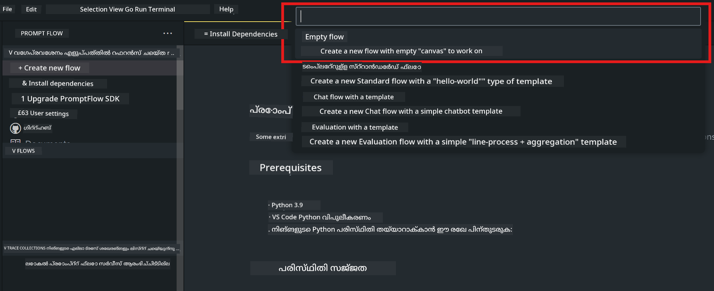
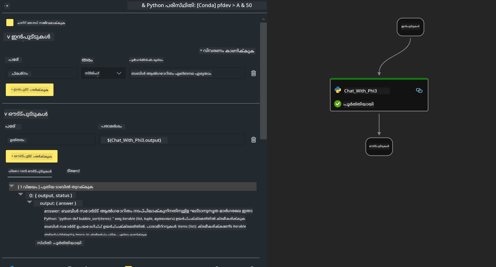

<!--
CO_OP_TRANSLATOR_METADATA:
{
  "original_hash": "bc29f7fe7fc16bed6932733eac8c81b8",
  "translation_date": "2025-12-21T19:44:33+00:00",
  "source_file": "md/02.Application/02.Code/Phi3/VSCodeExt/HOL/AIPC/02.PromptflowWithNPU.md",
  "language_code": "ml"
}
-->
# **Lab 2 -  AIPC-ൽ Phi-3-mini ഉപയോഗിച്ച് Prompt flow പ്രവർത്തിപ്പിക്കുക**

## **Prompt flow എന്താണ്**

Prompt flow LLM-ആധാരിത AI ആപ്ലിക്കേഷനുകളുടെ ആശയമുണ്ടാക്കൽ, പ്രോട്ടോട്ടൈപ്പിംഗ്, ടെസ്റ്റിംഗ്, മൂല്യനിർണയം മുതൽ പ്രൊഡക്ഷൻ ഡിപ്ലോയ്മെന്റ് және മോനിറ്ററിംഗ് വരെയുള്ള എൻഡ്-ടു-എൻഡ് ഡവലപ്പ്മെന്റ് ചക്രം ലളിതമാക്കാൻ രൂപകൽപ്പന ചെയ്ത ഡെവലപ്പ്മെന്റ് ടൂളുകളുടെ ഒരു സ്വീറ്റ് ആണ്. ഇത് പ്രോംപ്്റ്റ് എഞ്ചിനീയറിംഗ് വളരെ എളുപ്പമാക്കുകയും പ്രൊഡക്ഷൻ നിലവാരമുള്ള LLM ആപ്പുകൾ നിർമ്മിക്കാൻ നിങ്ങളെ സഹായിക്കുകയും ചെയ്യുന്നു.

Prompt flow ഉപയോഗിച്ച്, നിങ്ങൾക്ക് സാധിക്കും:

- LLM-കൾ, പ്രൊംപ്റ്റുകൾ, Python കോഡ്, മറ്റ് ടൂളുകൾ എന്നിവയെ ബന്ധിപ്പിച്ച് പ്രവർത്തനയോഗ്യമായ വർക്ക്‌ഫ്ലോയിൽ ഫ്ലോകൾ സൃഷ്ടിക്കുക.

- നിങ്ങളുടെ ഫ്ലോകൾ ഡീബഗ് ചെയ്ത് ആവർത്തിച്ച് മെച്ചപ്പെടുത്തുക, പ്രത്യേകിച്ച് LLM-കളുമായുള്ള ഇടപെടലുകൾ എളുപ്പത്തിൽ നിർവഹിക്കാൻ.

- നിങ്ങളുടെ ഫ്ലോകൾ വിലയിരുത്തുക, വലിയ ഡാറ്റാസെറ്റുകൾ ഉപയോഗിച്ച് ഗുണനിലവാരവും പ്രകടന മെട്രിക്കുകളും গণനം ചെയ്യുക.

- നിങ്ങളുടെ ഫ്ലോയുടെ ഗുണനിലവാരം ഉറപ്പാക്കാൻ ടെസ്റ്റിംഗ്, മൂല്യനിർണയം CI/CD സിസ്റ്റത്തിലേക്ക് സംയോജിപ്പിക്കുക.

- നിങ്ങൾ തിരഞ്ഞെടുക്കുന്ന സർവിംഗ് പ്ലാറ്റ്‌ഫോറത്തിലേക്ക് ഫ്ലോകൾ ഡിപ്ലോയ് ചെയ്യുക അല്ലെങ്കിൽ നിങ്ങളുടെ ആപ്പിന്റെ കോഡ് ബേസിൽ എളുപ്പത്തിൽ സംയോജിപ്പിക്കുക.

- (ഐച്ഛികം എന്നാൽ ശക്തമായി ശുപാർശ ചെയ്യപ്പെടുന്നു) Azure AI-യിൽ Prompt flow-യുടെ ക്ലൗഡ് പതിപ്പ് ഉപയോഗിച്ച് നിങ്ങളുടെ ടീമുമായി സഹകരിക്കുക.

## **AIPC എന്താണ്**

ഒരു AI PC-ൽ CPU, GPU, NPU എന്നിവയുണ്ട്, ഓരോന്നിനും പ്രത്യേക AI ത്വരീകരണ ശേഷിയുണ്ട്. NPU, അല്ലെങ്കിൽ neural processing unit, ഒരു പ്രത്യേക ആക്സിലറേറ്ററാണ്, ഇത് ക്ലൗഡിലേക്ക് ഡാറ്റ ഉപേക്ഷിച്ച് പ്രോസസ് ചെയ്യുന്നതിന് പകരം നിങ്ങളുടെ PC-ൽ തന്നെ AI (കൃത്രിമ ബുദ്ധി) և ML (മെഷീൻ ലേണിംഗ്) ജോലികൾ കൈകാര്യം ചെയ്യുന്നു. GPUയും CPUയും ഈ വര്‍ക്ക്ലോഡുകൾ പ്രോസസ് ചെയ്യാൻ കഴിയും, പക്ഷേ NPU കുറഞ്ഞ വൈദ്യുതിചെലവിൽ AI കണക്കുകൾ ചെയ്യുന്നതിൽ പ്രത്യേകമായി നല്ലതാണ്. AI PC നമ്മുടെ കമ്പ്യൂട്ടറുകളുടെ പ്രവർത്തനരീതിയിൽ ഒരു അടിസ്ഥാനപരമായ മാറ്റത്തെ പ്രതിനിധീകരിക്കുന്നു. ഇത് മുമ്പ് ഉണ്ടായിരുന്നു എന്നില്ലാത്ത ഒരു പ്രശ്നത്തിന് പരിഹാരം പ്രതിപാദിക്കുന്ന ഒരു കുത്തകമല്ല. മറിച്ച്, ഇത് ദിനേനത്തെ PC ഉപയോഗങ്ങൽക്കുള്ള വലിയ മെച്ചപ്പെടുത്തലായി വാഗ്ദാനം ചെയ്യുന്നു.

അത് എങ്ങനെ പ്രവർത്തിക്കും? ജനറേറ്റീവ് AI-ക്കും ടൺകളിൽ പൊതുവായ ഡാറ്റയിൽ പരിശീലിപ്പിച്ച വലിയ LLM-കൾക്കും താരതമ്യപ്പെടുത്തുമ്പോൾ, നിങ്ങളുടെ PC-ൽ ഉണ്ടാകുന്ന AI മിക്ക നിലകളിൽ കൂടുതലായി ലഭ്യമാണ്. ആശയം അംഗീകരിക്കാൻ എളുപ്പമാണ്, കൂടാതെ ഇത് നിങ്ങളുടെ ഡാറ്റയിൽ പരിശീലിപ്പിക്കപ്പെട്ടതാകയാൽ ക്ലൗഡിലെ പ്രവേശനം ആവശ്യമില്ലാതെ അതിന്റെ നേട്ടങ്ങൾ കൂടുതൽ விரലമായി പ്രദർശിപ്പിക്കും.

സമീപകാലത്ത്, AI PC പരിസ്ഥിതി വ്യക്തിഗത അസിസ്റ്റന്റുകളും ചെറുതായുള്ള AI മോഡലുകളും നേരിട്ട് നിങ്ങളുടെ PC-ൽ ഓടിക്കുന്നത് ഉൾക്കൊള്ളുന്നു, നിങ്ങളുടെ ഡാറ്റ ഉപയോഗിച്ച് വ്യക്തിഗതവും സ്വകാര്യവുമായ, കൂടുതൽ സുരക്ഷിതമായ AI മെച്ചപ്പെടുത്തലുകൾ നൽകുന്നത് — യോഗം മിനിറ്റുകൾ എടുക്കൽ, ഫാന്റസി ഫുട്ബോൾ ലീഗ് ക്രമീകരിക്കൽ, ഫോട്ടോ/വീഡിയോ എഡിറ്റിങ്ങിനുള്ള മെച്ചപ്പെടുത്തലുകൾ ഓട്ടോമേറ്റ് ചെയ്യൽ, അല്ലെങ്കിൽ എല്ലാവരുടെയും എത്തുകയും പോകുകയും ചെയ്യുന്ന സമയങ്ങളെ അടിസ്ഥാനമാക്കിയുള്ള കുടുംബ സംഗമത്തിനുള്ള ഏറ്റവും അനുയോജ്യമായ യാത്രാസൂചി തയ്യാറാക്കൽ പോലുള്ള ബഹുദിവസിക പ്രവർത്തനങ്ങൾക്ക്.

## **AIPC-ൽ generation കോഡ് ഫ്ലോകൾ നിർമ്മിക്കുക**

***കുറിപ്പ്*** ：If you have not completed the environment installation , please visit [Lab 0 -Installations](./01.Installations.md)

1. Open the Prompt flow Extension in Visual Studio Code and create a empty flow project



2. Add Inputs and Outputs parameters and Add Python Code as new flow




You can refer to this structure (flow.dag.yaml) to construct your flow

```yaml

inputs:
  question:
    type: string
    default: how to write Bubble Algorithm
outputs:
  answer:
    type: string
    reference: ${Chat_With_Phi3.output}
nodes:
- name: Chat_With_Phi3
  type: python
  source:
    type: code
    path: Chat_With_Phi3.py
  inputs:
    question: ${inputs.question}


```

3. ***Chat_With_Phi3.py*** ൽ കോഡ് ചേർക്കുക


```python


from promptflow.core import tool

# torch ഇംപോർട്ട് ചെയ്യുക
from transformers import AutoTokenizer, pipeline,TextStreamer
import intel_npu_acceleration_library as npu_lib

import warnings

import asyncio
import platform

class Phi3CodeAgent:
    
    model = None
    tokenizer = None
    text_streamer = None
    
    model_id = "microsoft/Phi-3-mini-4k-instruct"

    @staticmethod
    def init_phi3():
        
        if Phi3CodeAgent.model is None or Phi3CodeAgent.tokenizer is None or Phi3CodeAgent.text_streamer is None:
            Phi3CodeAgent.model = npu_lib.NPUModelForCausalLM.from_pretrained(
                                    Phi3CodeAgent.model_id,
                                    torch_dtype="auto",
                                    dtype=npu_lib.int4,
                                    trust_remote_code=True
                                )
            Phi3CodeAgent.tokenizer = AutoTokenizer.from_pretrained(Phi3CodeAgent.model_id)
            Phi3CodeAgent.text_streamer = TextStreamer(Phi3CodeAgent.tokenizer, skip_prompt=True)

    

    @staticmethod
    def chat_with_phi3(prompt):
        
        Phi3CodeAgent.init_phi3()

        messages = "<|system|>You are a AI Python coding assistant. Please help me to generate code in Python.The answer only genertated Python code, but any comments and instructions do not need to be generated<|end|><|user|>" + prompt +"<|end|><|assistant|>"


        generation_args = {
            "max_new_tokens": 1024,
            "return_full_text": False,
            "temperature": 0.3,
            "do_sample": False,
            "streamer": Phi3CodeAgent.text_streamer,
        }

        pipe = pipeline(
            "text-generation",
            model=Phi3CodeAgent.model,
            tokenizer=Phi3CodeAgent.tokenizer,
            # **ജനറേഷൻ_ആർഗുകൾ
        )

        result = ''

        with warnings.catch_warnings():
            warnings.simplefilter("ignore")
            response = pipe(messages, **generation_args)
            result =response[0]['generated_text']
            return result


@tool
def my_python_tool(question: str) -> str:
    if platform.system() == 'Windows':
        asyncio.set_event_loop_policy(asyncio.WindowsSelectorEventLoopPolicy())
    return Phi3CodeAgent.chat_with_phi3(question)


```

4. You can test the flow from Debug or Run to check generation code okay or not 


5. Run flow as development API in terminal

```

pf flow serve --source ./ --port 8080 --host localhost   

```

You can test it in Postman / Thunder Client


### **കുറിപ്പ്**

1. ആദ്യ റൺ വളരെ സമയം എടുക്കും. phi-3 മോഡൽ Hugging face CLI-ൽ നിന്ന് ഡൗൺലോഡ് ചെയ്യുന്നതാണ് ശുപാർശ ചെയ്യപ്പെടുന്നത്.

2. Intel NPU-യുടെ നിയന്ത്രിത കംപ്യൂട്ടിംഗ് ശക്തി കണക്കിലെടുക്കുമ്പോൾ, Phi-3-mini-4k-instruct ഉപയോഗിക്കുന്നത് ശുപാർശ ചെയ്യപ്പെടുന്നു.

3. INT4 ക്വാണ്ടൈസേഷൻ ചെയ്യാൻ Intel NPU Acceleration ഉപയോഗിക്കുന്നു, എന്നാൽ സർവീസ് വീണ്ടും റൺ ചെയ്യുമ്പോൾ cache and nc_workshop ഫോൾഡറുകൾ நீക്കം ചെയ്യേണ്ടതുണ്ട്.


## **റിസോഴ്സുകൾ**

1. Promptflow പഠിക്കുക [https://microsoft.github.io/promptflow/](https://microsoft.github.io/promptflow/)

2. Intel NPU Acceleration പഠിക്കുക [https://github.com/intel/intel-npu-acceleration-library](https://github.com/intel/intel-npu-acceleration-library)

3. Sample Code, download [Local NPU Agent Sample Code](../../../../../../../../../code/07.Lab/01/AIPC)

---

<!-- CO-OP TRANSLATOR DISCLAIMER START -->
ഡിസ്‌ക്ലെയിമർ:
ഈ രേഖ AI വിവർത്തന സേവനം [Co-op Translator](https://github.com/Azure/co-op-translator) ഉപയോഗിച്ച് വിവർത്തനം ചെയ്തതാണ്. നാം കൃത്യതയ്ക്ക് ശ്രമിക്കുന്നുവെങ്കിലും, ഓട്ടോമേറ്റഡ് വിവർത്തനങ്ങളിൽ തെറ്റുകൾ അല്ലെങ്കിൽ അസാധുതകൾ ഉണ്ടാകാമെന്ന് ദയവായി ശ്രദ്ധിക്കുക. മൂല രേഖ അതിന്റെ മാതൃഭാഷയിൽ ഉള്ളതായതിനാൽ അത് ഔദ്യോഗിക സ്രോതസ്സായി കണക്കാക്കണം. നിർണായകമായ വിവരങ്ങൾക്ക് പ്രൊഫഷണൽ മനുഷ്യ വിവർത്തനം ശിപാർശ ചെയ്യപ്പെടുന്നു. ഈ വിവർത്തനം ഉപയോഗിച്ചതിലൂടെ ഉണ്ടായേക്കുന്ന തെറ്റിദ്ധാരണകൾക്കും തെറ്റായ വ്യാഖ്യാനങ്ങൾക്കുമുള്ള ഉത്തരവാദിത്വം ഞങ്ങള്ക്ക് ബാധകമല്ല.
<!-- CO-OP TRANSLATOR DISCLAIMER END -->