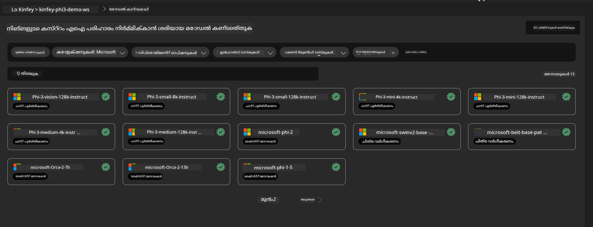

<!--
CO_OP_TRANSLATOR_METADATA:
{
  "original_hash": "20cb4e6ac1686248e8be913ccf6c2bc2",
  "translation_date": "2025-12-21T19:55:33+00:00",
  "source_file": "md/02.Application/02.Code/Phi3/VSCodeExt/HOL/AIPC/03.DeployPhi3VisionOnAzure.md",
  "language_code": "ml"
}
-->
# **ലാബ് 3 - Deploy Phi-3-vision on Azure Machine Learning Service**

നാം NPU ഉപയോഗിച്ച് ലോക്കൽ കോഡിന്റെ പ്രൊഡക്ഷൻ ഡിപ്ലോയ്മെന്റ് പൂർത്തീകരിക്കുന്നു, തുടർന്ന് അതിലൂടെ PHI-3-VISION സ്ഥാപിച്ച് ചിത്രങ്ങളിലൂടെ കോഡ് സൃഷ്ടിക്കൽ സാധ്യമാക്കാനുള്ള കഴിവ് അവതരിപ്പിക്കാൻ ആഗ്രഹിക്കുന്നു.

ഈ പരിചയപ്പെടൽ വഴി, നാം Azure Machine Learning Service-ൽ ഒരു Model As Service രൂപത്തിലുള്ള Phi-3 Vision സേവനം വേഗത്തിൽ എങ്ങനെ നിർമ്മിക്കാമെന്ന് കാണാം.

***കുറിപ്പ്***： Phi-3 Vision-ന് ഉള്ളടക്കം വേഗത്തിലായി സൃഷ്ടിക്കാൻ പലയിടത്തും കുറഞ്ഞതല്ലാത്ത കംപ്യൂട്ടിംഗ് ശക്തി ആവശ്യമാണ്. ഇത് നേടാൻ ക്ലൗഡ് കംപ്യൂട്ടിംഗ് സഹായം ആവശ്യമാണ്.


### **1. Azure Machine Learning Service സൃഷ്ടിക്കുക**

ഞങ്ങൾക്ക് Azure പോർട്ടലിൽ ഒരു Azure Machine Learning Service സൃഷ്ടിക്കേണ്ടതുണ്ട്. ഇത് എങ്ങനെ ചെയ്യാമെന്ന് അറിയാൻ, ദയവായി ഈ ലിങ്ക് സന്ദർശിക്കുക [https://learn.microsoft.com/azure/machine-learning/quickstart-create-resources?view=azureml-api-2](https://learn.microsoft.com/azure/machine-learning/quickstart-create-resources?view=azureml-api-2)


### **2. Azure Machine Learning Service-ൽ Phi-3 Vision തിരഞ്ഞെടുക്കുക**




### **3. Azure-ൽ Phi-3-Vision ഡിപ്ലോയ് ചെയ്യുക**


### **4. Postman-ൽ എന്റ്പോയിന്റ് പരീക്ഷിക്കുക**


***കുറിപ്പ്***

1. പ്രേഷിപ്പിക്കേണ്ട പാരാമീറ്ററുകളിൽ Authorization, azureml-model-deployment, மற்றும் Content-Type എന്നിവ ഉൾപ്പെടണം. അവ എടുക്കാൻ ഡിപ്ലോയ്‌മെന്റ് വിവരങ്ങൾ പരിശോധിക്കണം.

2. പാരാമീറ്ററുകൾ അയയ്ക്കുന്നതിനായി, Phi-3-Vision ഒരു ഇമേജ് ലിങ്ക് പ്രേഷിപ്പിക്കണം. പാരാമീറ്ററുകൾ എങ്ങനെ അയയ്ക്കാമെന്നതിന് GPT-4-Vision രീതി കാണുക, ഉദാഹരണത്തിന്

```json

{
  "input_data":{
    "input_string":[
      {
        "role":"user",
        "content":[ 
          {
            "type": "text",
            "text": "You are a Python coding assistant.Please create Python code for image "
          },
          {
              "type": "image_url",
              "image_url": {
                "url": "https://ajaytech.co/wp-content/uploads/2019/09/index.png"
              }
          }
        ]
      }
    ],
    "parameters":{
          "temperature": 0.6,
          "top_p": 0.9,
          "do_sample": false,
          "max_new_tokens": 2048
    }
  }
}

```

3. Post രീതിയിൽ **/score** കോൾ ചെയ്യുക

**ശഭാഷ്ഠുകൾ** ！You have completed the fast PHI-3-VISION deployment and tried how to use pictures to generate code. Next, we can build applications in combination with NPUs and clouds

---

<!-- CO-OP TRANSLATOR DISCLAIMER START -->
അസ്വീകാരം:
ഈ രേഖ AI പരിഭാഷാ സേവനമായ Co‑op Translator (https://github.com/Azure/co-op-translator) ഉപയോഗിച്ച് പരിഭാഷപ്പെടുത്തിയതാണ്. ഞങ്ങൾ കൃത്യതയ്ക്കായി ശ്രമിച്ചോളങ്കിലും, യാന്ത്രിക പരിഭാഷകളിൽ പിശകുകൾ അല്ലെങ്കിൽ അശുദ്ധതകൾ ഉണ്ടാകാമെന്ന് ദയവായി ശ്രദ്ധിക്കുക. മൂലഭാഷയിലെ അസൽ രേഖയെ ഔദ്യോഗികമായും വിശ്വാസയോഗ്യമായും കാണുക. നിർണായകമായ വിവരങ്ങൾക്ക് പ്രൊഫഷണൽ 인간 വിവർത്തനം നിർദ്ദേശിക്കുന്നു. ഈ പരിഭാഷ ഉപയോഗിച്ചതിന്റെ ഫലമായി ഉണ്ടാകുന്ന ഏതെങ്കിലും തെറ്റിദ്ധാരണങ്ങൾക്കും തെറ്റായ വ്യാഖ്യാനങ്ങൾക്കുമ 우리는 ഉത്തരവാദികളല്ല.
<!-- CO-OP TRANSLATOR DISCLAIMER END -->