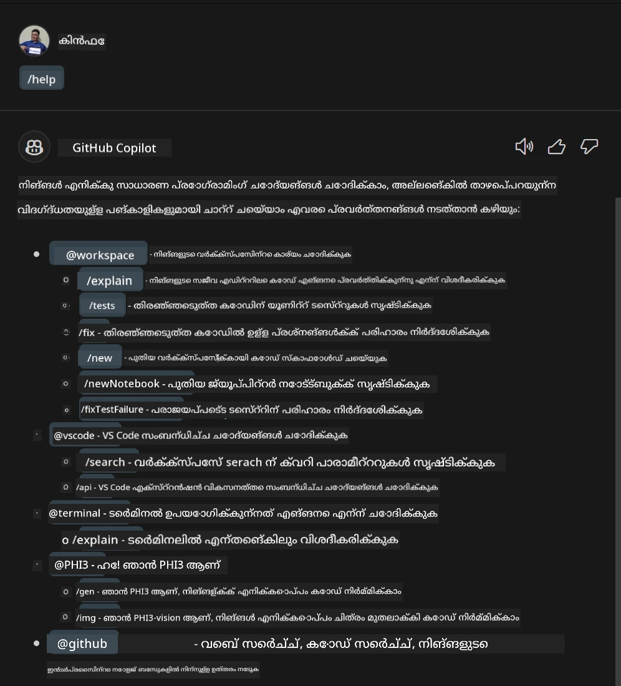
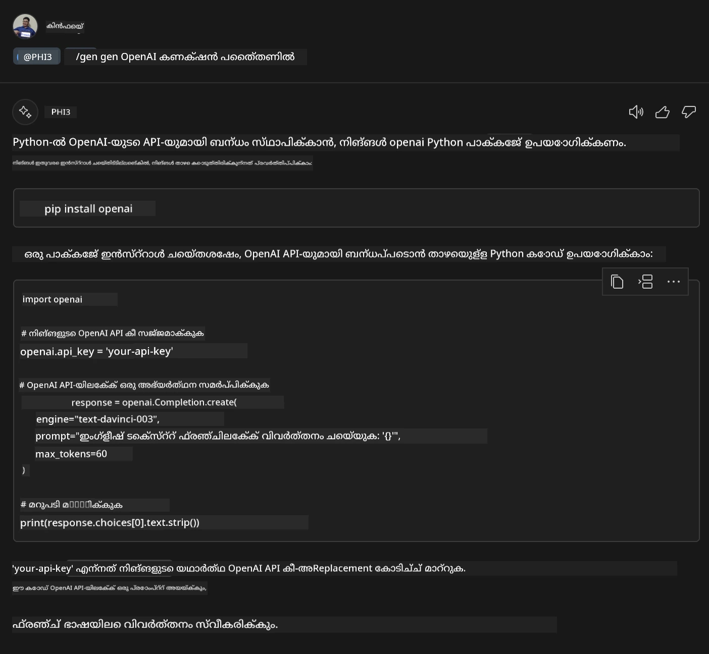

<!--
CO_OP_TRANSLATOR_METADATA:
{
  "original_hash": "b267038b665ba40cfaac6c6d975ccc40",
  "translation_date": "2025-12-21T19:49:38+00:00",
  "source_file": "md/02.Application/02.Code/Phi3/VSCodeExt/HOL/AIPC/04.CreatePhi3AgentInVSCode.md",
  "language_code": "ml"
}
-->
# **Lab 3 - GitHub Copilot Chat-ൽ ഒരു @PHI3 ഏജന്റ് സൃഷ്ടിക്കുക**

Visual Studio Code Copilot Chat-ൽ, നിങ്ങൾക്ക് @workspace മുഖേന മുഴുവൻ പ്രോജക്ടും നിയന്ത്രിക്കാം. എന്റർപ്രൈസ് പരിസ്സരങ്ങളിൽ, Copilot Chat-ന്റെ ഏജന്റ് കൂടുതൽ സ്വതന്ത്രമായി ഇഷ്‌ടാനുസൃതമാക്കാനും കഴിയും. 


മുൻ ലാബിൽ, നാം NPUയും ക്ലൗഡും സംയോജിപ്പിച്ച് Phi3 ഏജന്റിന് വേണ്ടി Visual Studio Code എക്സ്റ്റെൻഷൻ പൂർത്തിയാക്കി.



### **1. ഒരു VSCode ഡെവലപ്പ്മെന്റ് എക്സ്റ്റെൻഷൻ സൃഷ്ടിക്കുക**

ദയവായി ഈ ലിങ്ക് [https://code.visualstudio.com/api/get-started/your-first-extension](https://code.visualstudio.com/api/get-started/your-first-extension) എന്നത് കാണുക ഒരു എക്സ്റ്റെൻഷൻ പ്രോജക്ട് സൃഷ്ടിക്കാൻ

***ഓദ്യോഗ്യ കുറിപ്പ്:*** ദയവായി ഈ പ്രോജക്ടിന് ടെക്നിക്കൽ حلമായി Typescript, WebPack ഉപയോഗിക്കുക

### **2. Add vscode.d.ts**

Visual Studio Code Chat API עדיין code API-യിൽ മർജ് ചെയ്തിട്ടില്ല, പക്ഷേ ഇത് ഇപ്പോൾ എക്സ്റ്റെൻഷനുകളിലൂടെ ചേർക്കപ്പെടുന്നു.


Download vscode.d.ts [https://github.com/microsoft/vscode/blob/main/src/vscode-dts/vscode.d.ts](https://github.com/microsoft/vscode/blob/main/src/vscode-dts/vscode.d.ts)


***ഓദ്യോഗ്യ കുറിപ്പ്:*** ദയവായി ഇത് Visual Studio Code Insiders 1.90+-ൽ നടത്തുക


### **3. Update package.json**

```json

{
  "name": "phi3ext",
  "displayName": "phi3ext",
  "description": "",
  "version": "0.0.1",
  "engines": {
    "vscode": "^1.90.0"
  },
  "categories": [
      "AI",
      "Chat"
  ],
  "activationEvents": [],
  "enabledApiProposals": [
      "chatVariableResolver"
  ],
  "main": "./dist/extension.js",
  "contributes": {
      "chatParticipants": [
          {
              "id": "chat.PHI3",
              "name": "PHI3",
              "description": "Hey! I am PHI3",
              "isSticky": true,
              "commands": [
                  {
                      "name": "gen",
                      "description": "I am PHI3, you can gen code with me"
                  },
                  {
                      "name": "img",
                      "description": "I am PHI3-vision, you can gen code from img with me"
                  }
              ]
          }
      ],
      "commands": [
          {
              "command": "PHI3.namesInEditor",
              "title": "Use PHI3 in Editor"
          }
      ]
  },  
  "scripts": {
    "vscode:prepublish": "npm run package",
    "compile": "webpack",
    "watch": "webpack --watch",
    "package": "webpack --mode production --devtool hidden-source-map",
    "compile-tests": "tsc -p . --outDir out",
    "watch-tests": "tsc -p . -w --outDir out",
    "pretest": "npm run compile-tests && npm run compile && npm run lint",
    "lint": "eslint src --ext ts",
    "test": "vscode-test"
  },
  "devDependencies": {
    "@types/vscode": "^1.90.0",
    "@types/mocha": "^10.0.6",
    "@types/node": "18.x",
    "@typescript-eslint/eslint-plugin": "^7.11.0",
    "@typescript-eslint/parser": "^7.11.0",
    "eslint": "^8.57.0",
    "typescript": "^5.4.5",
    "ts-loader": "^9.5.1",
    "webpack": "^5.91.0",
    "webpack-cli": "^5.1.4",
    "@vscode/test-cli": "^0.0.9",
    "@vscode/test-electron": "^2.4.0"
  },
  "dependencies": {
    "@types/node-fetch": "^2.6.11",
    "node-fetch": "^3.3.2"
  }
}

```

ടെർമിനലിൽ **npm install** റൺ ചെയ്ത് നിങ്ങളുടെ എക്സ്റ്റെൻഷൻ ഡീബഗ് ചെയ്ത് പരീക്ഷിക്കാം.

***സാമ്പിൾ കോഡ് ഡൗൺലോഡ് ചെയ്യുക*** [ഇവിടെ ക്ലിക്ക് ചെയ്യുക](../../../../../../../../../code/07.Lab/01/AIPC)


### **4. Change src/extension.ts**


```ts

// 'vscode' മോഡ്യൂളിൽ VS Code വിപുലീകരണ API ഉൾക്കൊള്ളുന്നു
// താഴെ നിങ്ങളുടെ കോഡിൽ മോഡ്യൂള്‍ ഇമ്പോർട്ട് ചെയ്ത് അതിനെ vscode എന്ന അലിയാസായി റഫറൻസ് ചെയ്യുക
import * as vscode from 'vscode';


interface IPHI3ChatResult extends vscode.ChatResult {
    metadata: {
        command: string;
    }
}


// ഈ ഫംഗ്ഷൻ നിങ്ങളുടെ എക്സ്റ്റൻഷൻ സജീവമാകുമ്പോൾ വിളിക്കപ്പെടുന്നു
// കമാൻഡ് ആദ്യമായി നടപ്പാക്കപ്പെടുമ്പോഴാണ് നിങ്ങളുടെ എക്സ്റ്റൻഷൻ സജീവമാകുന്നത്
export function activate(extcontext: vscode.ExtensionContext) {


	// SHEIN ചാറ്റ് ഹാൻഡ്ലർ നിർവചിക്കുക.
	const phi3handler: vscode.ChatRequestHandler = async (request: vscode.ChatRequest, context: vscode.ChatContext, stream: vscode.ChatResponseStream, token: vscode.CancellationToken): Promise<IPHI3ChatResult> => {

		if (request.command == 'gen') {

			const content = "Welcome to Phi-3 to gen code";

			

			const result = await gen(request.prompt);

			const code = result;
			
			
			stream.progress("```txt"+"\n"+code+ +"\n"+"```")


            return { metadata: { command: 'gen' } };

		}
		if (request.command == 'img') {

			const content = "Welcome to Phi-3 vision to gen code in image";

			const prompt = request.prompt;

			if(prompt.indexOf("(IMG_URL:")>-1){

				const img_url = prompt.split("(IMG_URL:")[1].split(")")[0];
				const question = prompt.split("(IMG_URL:")[0];
				const tmp = question;

				const result = await genImage(question,img_url);
	
				const code = result;
				
				
				stream.progress(code)
	
	
				return { metadata: { command: 'img' } };
			}
			else
			{
				var result = "```txt"+"\n\n"+"Please ask question like this Your question (IMG_URL:https://example.com/image.jpg)"+"\n\n"++"```";
				stream.progress(result);

			}


            return { metadata: { command: 'img' } };

		}


		return { metadata: { command: '' } };

	}


	const xp = vscode.chat.createChatParticipant("chat.PHI3", phi3handler);

	xp.iconPath = new vscode.ThemeIcon('sparkle');


    xp.followupProvider = {
        provideFollowups(result: IPHI3ChatResult, context: vscode.ChatContext, token: vscode.CancellationToken) {
            return [{
                prompt: 'let us code with Phi-3 Family',
                label: vscode.l10n.t('Dev with Phi-3 Family'),
                command: 'help'
            } satisfies vscode.ChatFollowup];
        }
    };

	extcontext.subscriptions.push(xp);
}


interface GenCode {
	question: string;
}

interface ImgGenCodeResponse {
	output: string;
}


interface GenCodeResponse {
	answer: string;
}

async function gen(prompt: string) {

	const postData: GenCode = {
		question: prompt
	};
	const response = await fetch('http://localhost:8080/score', {
		method: 'POST',
		body: JSON.stringify(postData),
		headers: { 'Content-Type': 'application/json' }
	});
	const post = await response.json();
	const resultResponse = post as GenCodeResponse;
	return resultResponse.answer;
}

async function genImage(prompt: string, img_url: string) {

	const response = await fetch('Your Phi-3-Vision Endpoint', {
		method: 'POST',
		body: JSON.stringify({
			"input_data":{
			  "input_string":[
				{
				  "role":"user",
				  "content":[ 
					{
					  "type": "text",
					  "text": prompt
					},
					{
						"type": "image_url",
						"image_url": {
						  "url": img_url
						}
					}
				  ]
				}
			  ],
			  "parameters":{
					"temperature": 0.6,
					"top_p": 0.9,
					"do_sample": false,
					"max_new_tokens": 2048
			  }
			}
		}),
		headers: { 'Content-Type': 'application/json', 'Authorization' : 'Bearer Your Phi-3-Vision Endpoint Key', 'azureml-model-deployment': 'Your Phi-3-Vision Deployment name' }
	});
	const post = await response.json();
	const resultResponse = post as ImgGenCodeResponse;
	return resultResponse.output;
}

// നിങ്ങളുടെ എക്സ്റ്റൻഷൻ നിഷ്ക്രിയമാക്കുമ്പോൾ ഈ ഫംഗ്ഷൻ വിളിക്കപ്പെടുന്നു
export function deactivate() {}


```

അഭിനന്ദനങ്ങൾ ! നിങ്ങൾ എല്ലാ ലാബുകളും പൂർത്തിയാക്കിയിരിക്കുന്നു. ഇത് നിങ്ങളെ Phi-3 Family നെ കുറിച്ച് അറിയാനും GitHub Copilot Chat എങ്ങനെ ഉപയോഗിക്കാമെന്നത് മനസ്സിലാക്കാനും സഹായിക്കുമെന്നു ഞാൻ പ്രതീക്ഷിക്കുന്നു.


നിങ്ങൾക്ക് ശ്രമിക്കാം ***@PHI3 /gen*** 



നിങ്ങൾക്ക് ശ്രമിക്കാം ***@PHI3 /img*** 


---

<!-- CO-OP TRANSLATOR DISCLAIMER START -->
ഡിസ്ക്ലെയിമർ:
ഈ രേഖ AI തർജ്ജമാ സേവനം [Co-op Translator](https://github.com/Azure/co-op-translator) ഉപയോഗിച്ച് തർജ്ജമ ചെയ്തതാണ്. ഞങ്ങൾ കൃത്യതയ്ക്കായി പരിശ്രമിച്ചവ হলেও, ഓട്ടോമേറ്റഡ് തർജ്ജമകളിൽ പിഴവുകൾ അല്ലെങ്കിൽ തെറ്റുകൾ ഉണ്ടായിരിക്കാമെന്ന് ദയവായി ശ്രദ്ധിക്കുക. യഥാർത്ഥ രേഖ അതിന്റെ മാതൃഭാഷയിൽ തന്നെയാണ് ഔദ്യോഗിക ഉറവിടമായി പരിഗണിക്കേണ്ടത്. നിർണായകമായ വിവരങ്ങൾക്ക് പ്രൊഫഷണൽ മനുഷ്യൻ നടത്തുന്ന തർജ്ജമ ശിപാർശിക്കുന്നു. ഈ തർജ്ജമ ഉപയോഗിച്ചതിന്റെ ഫലമായി ഉണ്ടാകുന്ന ഏതെങ്കിലും തെറ്റിദ്ധാരണകൾക്കും തെറ്റായി വ്യാഖ്യാനിക്കപ്പെട്ടതിലെയും ഞങ്ങൾ ഉത്തരവാദികളല്ല.
<!-- CO-OP TRANSLATOR DISCLAIMER END -->