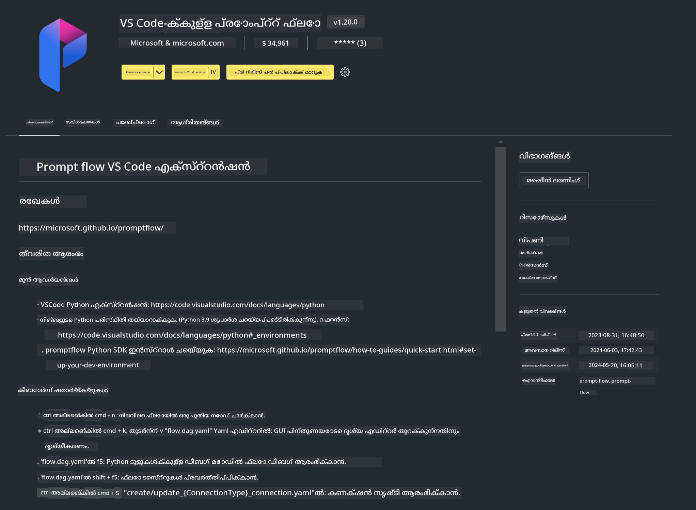

<!--
CO_OP_TRANSLATOR_METADATA:
{
  "original_hash": "4b16264917d9b93169745d92b8ce8c65",
  "translation_date": "2025-12-21T20:08:36+00:00",
  "source_file": "md/02.Application/02.Code/Phi3/VSCodeExt/HOL/Apple/01.Installations.md",
  "language_code": "ml"
}
-->
# **Lab 0 - ഇൻസ്റ്റലേഷൻ**

When we enter the Lab, we need to configure the relevant environment :

### **1. Python 3.11+**

It is recommended to use miniforge to configure your Python environment 

To configure miniforge, please refer to [https://github.com/conda-forge/miniforge](https://github.com/conda-forge/miniforge)

After configuring miniforge, run the following command in Power Shell

```bash

conda create -n pyenv python==3.11.8 -y

conda activate pyenv

```


### **2. Install Prompt flow SDK**

In Lab 1, we use Prompt flow, so you need to configure the Prompt flow SDK.

```bash

pip install promptflow --upgrade

```

You can check promptflow sdk in this command


```bash

pf --version

```

### **3. Install Visual Studio Code Prompt flow Extension**



### **4. Apple's MLX Framework**

MLX is an array framework for machine learning research on Apple silicon, brought to you by Apple machine learning research. You can use **Apple MLX framework** to accelerate LLM / SLM with Apple Silicon. If you want to know more, you can read [https://github.com/microsoft/PhiCookBook/blob/main/md/01.Introduction/03/MLX_Inference.md](https://github.com/microsoft/PhiCookBook/blob/main/md/01.Introduction/03/MLX_Inference.md).

Install MLX framework Library in bash


```bash

pip install mlx-lm

```


### **5. Other Python Library**


create requirements.txt and add this content

```txt

notebook
numpy 
scipy 
scikit-learn 
matplotlib 
pandas 
pillow 
graphviz

```


### **6. Install NVM**

install nvm in Powershell 

```bash

brew install nvm

```

install nodejs 18.20


```bash

nvm install 18.20.0

nvm use 18.20.0

```

### **7. Install Visual Studio Code Development Support**


```bash

npm install --global yo generator-code

```

Congratulations! You have successfully configured the SDK. Next, proceed to the hands-on steps.

---

<!-- CO-OP TRANSLATOR DISCLAIMER START -->
നിരാകരണം:

ഈ രേഖ AI മൊഴിമാറ്റ സേവനമായ [Co-op Translator](https://github.com/Azure/co-op-translator) ഉപയോഗിച്ച് ഭാഷാന്തരിച്ചിട്ടുണ്ട്. ഞങ്ങൾ കൃത്യതയ്‌ക്കായി ശ്രമിക്കുന്നു എങ്കിലും യാന്ത്രികമാർഗ്ഗം നടത്തിയ ഭാഷാന്തരങ്ങൾ പിശകുകളോ അസാധുതകളോ അടങ്ങിയിരിക്കാമെന്ന് ദയവായി ശ്രദ്ധിക്കുക. മൂലഭാഷയിലെ പ്രമാണം പ്രമാണപരവും പ്രാമാണികവുമായ സ്രോതസ്സായി പരിഗണിക്കേണ്ടതാണ്. നിർണായകമായ വിവരങ്ങൾക്ക് പ്രൊഫഷണൽ മനുഷ്യഭാഷാന്തരം ശുപാർശ ചെയ്യപ്പെടുന്നു. ഈ ഭാഷാന്തരണം ഉപയോഗിച്ചതിനാൽ ഉണ്ടാവുന്ന ഏതെങ്കിലും തെറ്റിദ്ധാരണകൾക്കും തെറ്റായ വ്യാഖ്യാനിക്കലുകൾക്കും ഞങ്ങൾക്ക് ഉത്തരവാദിത്വം ഉണ്ടാകില്ല.
<!-- CO-OP TRANSLATOR DISCLAIMER END -->