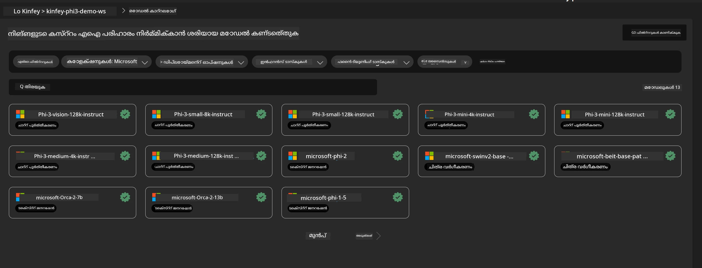
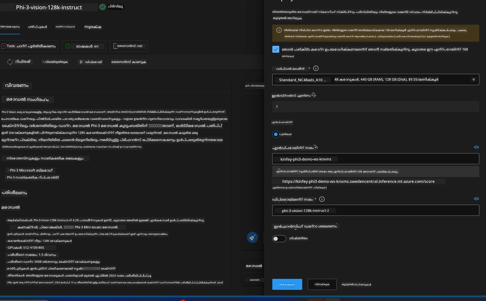
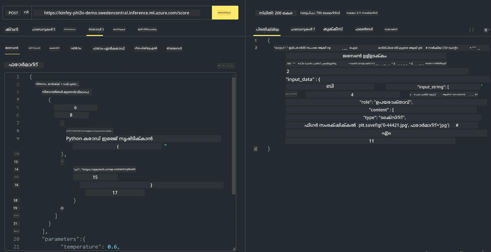

# **ലാബ് 3 - Azure Machine Learning Service-ൽ Phi-3-vision വിന്യസിക്കുക**

ഞങ്ങൾ പ്രാദേശിക കോഡിന്റെ പ്രൊഡക്ഷൻ ഡിപ്ലോയ്മെന്റ് പൂർത്തിയാക്കാൻ NPU ഉപയോഗിക്കുകയാണ്, തുടർന്ന് അതിലൂടെ PHI-3-VISION സംയോജിപ്പിച്ച് ചിത്രങ്ങളിൽ നിന്നുള്ള കോഡ് സൃഷ്ടിക്കാൻ കഴിയുന്ന കഴിവ് അവതരിപ്പിക്കാനാണ് ഞങ്ങളുടെ ഉദ്ദേശ്യം.

ഈ പരിചയപ്പെടുത്തലിൽ, Azure Machine Learning Service-ൽ Model As Service ആയി Phi-3 Vision സേവനം ത്വരിതമായി നിർമ്മിക്കാൻ കഴിയും.

***Note***： Phi-3 Vision മേൽവേഗത്തിൽ ഉള്ളടക്കം സൃഷ്ടിക്കാൻ കംപ്യൂട്ടിംഗ് ശേഷി ആവശ്യമുണ്ട്. ഇത് കൈവരിക്കാൻ ഞങ്ങൾക്ക് ക്ലൗഡ് കംപ്യൂട്ടിംഗ് ശേഷി സഹായകരമാണ്.


### **1. Create Azure Machine Learning Service**

നമുക്ക് Azure Portal-ൽ ഒരു Azure Machine Learning Service സൃഷ്ടിക്കേണ്ടതാണ്. എങ്ങനെ ചെയ്യാമെന്ന് അറിയാൻ, ദയവായി ഈ ലിങ്ക് സന്ദർശിക്കുക [https://learn.microsoft.com/azure/machine-learning/quickstart-create-resources?view=azureml-api-2](https://learn.microsoft.com/azure/machine-learning/quickstart-create-resources?view=azureml-api-2)


### **2. Choose Phi-3 Vision in Azure Machine Learning Service**




### **3. Deploy Phi-3-Vision in Azure**





### **4. Test Endpoint in Postman**





***Note***

1. ട്രാൻസ്മിറ്റ് ചെയ്യേണ്ട പാരാമീറ്ററുകളിൽ Authorization, azureml-model-deployment, Content-Type എന്നിവ ഉൾപ്പെടണം. അവ നേടാൻ നിങ്ങൾ ഡിപ്ലോയ്മെന്റ് വിവരങ്ങൾ പരിശോധിക്കേണ്ടതാണ്.

2. പാരാമീറ്ററുകൾ അയയ്ക്കുന്നതിന്, Phi-3-Vision ഒരു ചിത്രത്തിന്റെ ലിങ്ക് അയയ്ക്കണം. പാരാമീറ്ററുകൾ അയയ്ക്കാനുള്ള രീതിക്ക് GPT-4-Vision മാർഗ്ഗം കാണുക, ഉദാഹരണമായി

```json

{
  "input_data":{
    "input_string":[
      {
        "role":"user",
        "content":[ 
          {
            "type": "text",
            "text": "You are a Python coding assistant.Please create Python code for image "
          },
          {
              "type": "image_url",
              "image_url": {
                "url": "https://ajaytech.co/wp-content/uploads/2019/09/index.png"
              }
          }
        ]
      }
    ],
    "parameters":{
          "temperature": 0.6,
          "top_p": 0.9,
          "do_sample": false,
          "max_new_tokens": 2048
    }
  }
}

```

3. Post രീതിയിലൂടെ **/score** കോൾ ചെയ്യുക

**Congratulations**! നിങ്ങൾ വേഗമായ PHI-3-VISION വിന്യസിക്കൽ പൂർത്തിയാക്കി, ചിത്രങ്ങൾ ഉപയോഗിച്ച് കോഡ് എങ്ങനെ സൃഷ്ടിക്കാമെന്ന് പരീക്ഷിച്ചു. അടുത്തതായി, NPUs-ഉം ക്ലൗഡുകളുമായി ചേർത്ത് അപ്ലിക്കേഷനുകൾ നിർമ്മിക്കാം

---

<!-- CO-OP TRANSLATOR DISCLAIMER START -->
ഡിസ്ക്ലെയിമർ:
ഈ ഡോക്യുമെന്റ് AI വിവർത്തന സേവനം [Co-op Translator](https://github.com/Azure/co-op-translator) ഉപയോഗിച്ച് വിവർത്തനം ചെയ്തതാണ്. ഞങ്ങൾ കൃത്യതയ്ക്ക് ശ്രമിച്ചെങ്കിലും ഓട്ടോമേറ്റഡ് വിവർത്തനങ്ങളിൽ പിശകുകൾ അല്ലെങ്കിൽ അസാധുതകൾ ഉണ്ടായിരിക്കാമെന്ന് ദയവായി മനസിലാക്കുക. അസൽ ഭാഷയിലെ മൂല പ്രമാണം ആണ് അധികാരമുള്ള ഉറവിടം എങ്കിൽ കണക്കാക്കേണ്ടത്. ഗൗരവമുള്ള വിവരങ്ങൾക്ക് പ്രൊഫഷണൽ മനുഷ്യ വിവർത്തനം നിർദ്ദേശിക്കുന്നു. ഈ വിവർത്തനം ഉപയോഗിച്ചതിൽ നിന്നുണ്ടാകുന്ന ഏതെങ്കിലും തെറ്റിദ്ധാരണങ്ങൾക്കും തെറ്റായ വ്യാഖ്യാനങ്ങൾക്കും ഞങ്ങൾ ഉത്തരവാദികളല്ല.
<!-- CO-OP TRANSLATOR DISCLAIMER END -->