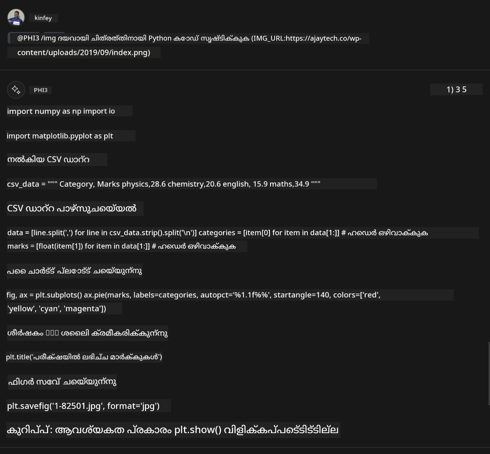

<!--
CO_OP_TRANSLATOR_METADATA:
{
  "original_hash": "df19a4d9fe96fe7335665bede9298a62",
  "translation_date": "2025-12-21T20:15:14+00:00",
  "source_file": "md/02.Application/02.Code/Phi3/VSCodeExt/HOL/Apple/04.CreatePhi3AgentInVSCode.md",
  "language_code": "ml"
}
-->
# **ലാബ് 3 - GitHub Copilot Chat-യിൽ @PHI3 ഏജന്റ് സൃഷ്ടിക്കുക**

In Visual Studio Code Copilot Chat-ൽ, നിങ്ങൾ @workspace വഴി മുഴുവൻ പ്രോജക്ടും നിയന്ത്രിക്കാം. എന്റർപ്രൈസ് സാഹചര്യങ്ങളിൽ, നാം Copilot Chat-ന്റെ ഏജന്റ് കൂടുതൽ ഫ്ലെക്സിബിൾ ആയി കസ്റ്റമൈസ് ചെയ്യാവുന്നത് ഉണ്ട്. 


കഴിഞ്ഞ ലാബിൽ, നാം MX framework-ഉം cloud-ഉം സംയോജിപ്പിച്ച് Phi3 ഏജന്റിനുള്ള ഒരു Visual Studio Code എക്സ്‌ടൻഷൻ പൂർത്തിയാക്കിയിരുന്നു.


### **1. VSCode ഡെവലപ്പ്മെന്റ് എക്സ്‌ടൻഷൻ സൃഷ്ടിക്കുക**

ഒരു എക്സ്‌ടൻഷൻ പ്രോജക്ട് സൃഷ്ടിക്കാൻ ദയവായി ഈ ലിങ്ക് [https://code.visualstudio.com/api/get-started/your-first-extension](https://code.visualstudio.com/api/get-started/your-first-extension) കാണുക

***കുറിപ്പ്:*** ഈ പ്രോജക്റ്റിനുള്ള സാങ്കേതിക പരിഹാരമായി ദയവായി Typescript, WebPack ഉപയോഗിക്കുക

### **2. Add vscode.d.ts**

Visual Studio Code Chat API ഇനിയും code API-യിലേയ്ക്ക് മേഞ്ഞിട്ടില്ല, പക്ഷേ ഇപ്പോൾ extensions മുഖേന ചേർത്തിരിക്കുന്നു.


vscode.d.ts ഡൗൺലോഡ് ചെയ്യുക [https://github.com/microsoft/vscode/blob/main/src/vscode-dts/vscode.d.ts](https://github.com/microsoft/vscode/blob/main/src/vscode-dts/vscode.d.ts)


***കുറിപ്പ്:*** ഇത് Visual Studio Code Insiders 1.90+-ൽ ദയവായി റൺ ചെയ്യുക


### **3. Update package.json**

```json

{
  "name": "phi3ext",
  "displayName": "phi3ext",
  "description": "",
  "version": "0.0.1",
  "engines": {
    "vscode": "^1.90.0"
  },
  "categories": [
      "AI",
      "Chat"
  ],
  "activationEvents": [],
  "enabledApiProposals": [
      "chatVariableResolver"
  ],
  "main": "./dist/extension.js",
  "contributes": {
      "chatParticipants": [
          {
              "id": "chat.PHI3",
              "name": "PHI3",
              "description": "Hey! I am PHI3",
              "isSticky": true,
              "commands": [
                  {
                      "name": "gen",
                      "description": "I am PHI3, you can gen code with me"
                  },
                  {
                      "name": "img",
                      "description": "I am PHI3-vision, you can gen code from img with me"
                  }
              ]
          }
      ],
      "commands": [
          {
              "command": "PHI3.namesInEditor",
              "title": "Use PHI3 in Editor"
          }
      ]
  },  
  "scripts": {
    "vscode:prepublish": "npm run package",
    "compile": "webpack",
    "watch": "webpack --watch",
    "package": "webpack --mode production --devtool hidden-source-map",
    "compile-tests": "tsc -p . --outDir out",
    "watch-tests": "tsc -p . -w --outDir out",
    "pretest": "npm run compile-tests && npm run compile && npm run lint",
    "lint": "eslint src --ext ts",
    "test": "vscode-test"
  },
  "devDependencies": {
    "@types/vscode": "^1.90.0",
    "@types/mocha": "^10.0.6",
    "@types/node": "18.x",
    "@typescript-eslint/eslint-plugin": "^7.11.0",
    "@typescript-eslint/parser": "^7.11.0",
    "eslint": "^8.57.0",
    "typescript": "^5.4.5",
    "ts-loader": "^9.5.1",
    "webpack": "^5.91.0",
    "webpack-cli": "^5.1.4",
    "@vscode/test-cli": "^0.0.9",
    "@vscode/test-electron": "^2.4.0"
  },
  "dependencies": {
    "@types/node-fetch": "^2.6.11",
    "node-fetch": "^3.3.2"
  }
}

```

ടെർമിനലിൽ **npm install** ഓടിച്ച് നിങ്ങളുടെ എക്സ്‌ടൻഷൻ ഡീബഗ് ചെയ്ത് പരീക്ഷിക്കാം.

***സാമ്പിൾ കോഡ് ഡൗൺലോഡ് ചെയ്യുക*** [ഇവിടെ ക്ലിക്ക് ചെയ്യുക](../../../../../../../../../code/07.Lab/01/Apple)


### **4. src/extension.ts മാറ്റുക**


```ts

// 'vscode' മോഡ്യൂൾ VS Code-ന്റെ വിപുലീകരണ API ഉൾക്കൊള്ളിക്കുന്നു
// ഈ മോഡ്യൂളിനെ ഇറക്കുമതി ചെയ്ത് താഴെയുള്ള നിങ്ങളുടെ കോഡിൽ അതിനെ vscode എന്ന ഉപനാമത്തിൽ സൂചിപ്പിക്കുക
import * as vscode from 'vscode';


interface IPHI3ChatResult extends vscode.ChatResult {
    metadata: {
        command: string;
    }
}


// നിങ്ങളുടെ എക്സ്റ്റൻഷൻ സജീവമാകുമ്പോൾ ഈ ഫംഗ്ഷൻ വിളിക്കപ്പെടും
// കമാൻഡ് ആദ്യമായി പ്രവർത്തിപ്പിക്കുമ്പോഴാണ് നിങ്ങളുടെ എക്സ്റ്റൻഷൻ ആദ്യമായി സജീവമായത്
export function activate(extcontext: vscode.ExtensionContext) {


	// SHEIN ചാറ്റ് ഹാൻഡ്ലർ നിർവചിക്കുക.
	const phi3handler: vscode.ChatRequestHandler = async (request: vscode.ChatRequest, context: vscode.ChatContext, stream: vscode.ChatResponseStream, token: vscode.CancellationToken): Promise<IPHI3ChatResult> => {

		if (request.command == 'gen') {

			const content = "Welcome to Phi-3 to gen code";

			const result = await gen(request.prompt);

			const code = result;
			
			
			stream.markdown(code)


            return { metadata: { command: 'gen' } };

		}
		if (request.command == 'img') {

			const content = "Welcome to Phi-3 vision to gen code in image";

			const prompt = request.prompt;

			if(prompt.indexOf("(IMG_URL:")>-1){

				const img_url = prompt.split("(IMG_URL:")[1].split(")")[0];
				const question = prompt.split("(IMG_URL:")[0];
				const tmp = question;

				const result = await genImage(question,img_url);
	
				const code = result;
				
				
				stream.markdown(code)
	
	
				return { metadata: { command: 'img' } };
			}
			else
			{
				var result = "Please ask question like this Your question (IMG_URL:https://example.com/image.jpg)";
				stream.markdown(result);
			}


            return { metadata: { command: 'img' } };

		}


		return { metadata: { command: '' } };

	}


	const phi3 = vscode.chat.createChatParticipant("chat.PHI3", phi3handler);

	phi3.iconPath = new vscode.ThemeIcon('sparkle');


    phi3.followupProvider = {
        provideFollowups(result: IPHI3ChatResult, context: vscode.ChatContext, token: vscode.CancellationToken) {
            return [{
                prompt: 'let us code with Phi-3 Family',
                label: vscode.l10n.t('Dev with Phi-3 Family'),
                command: 'help'
            } satisfies vscode.ChatFollowup];
        }
    };

	extcontext.subscriptions.push(phi3);
}


interface GenCode {
	prompt: string;
}

interface ImgGenCodeResponse {
	output: string;
}


interface GenCodeResponse {
	result: string;
}

async function gen(prompt: string) {

	const postData: GenCode = {
		prompt: prompt
	};
	const response = await fetch('http://localhost:8080/score', {
		method: 'POST',
		body: JSON.stringify(postData),
		headers: { 'Content-Type': 'application/json' }
	});
	const post = await response.json();
	const resultResponse = post as GenCodeResponse;
	return resultResponse.result;
}

async function genImage(prompt: string, img_url: string) {

	// const postData: GenCode = {
	// 	question: prompt
	// };
	const response = await fetch('Your Phi-3 Endpoint', {
		method: 'POST',
		body: JSON.stringify({
			"input_data":{
			  "input_string":[
				{
				  "role":"user",
				  "content":[ 
					{
					  "type": "text",
					  "text": prompt
					},
					{
						"type": "image_url",
						"image_url": {
						  "url": img_url
						}
					}
				  ]
				}
			  ],
			  "parameters":{
					"temperature": 0.6,
					"top_p": 0.9,
					"do_sample": false,
					"max_new_tokens": 2048
			  }
			}
		}),
		headers: { 'Content-Type': 'application/json', 'Authorization' : 'Bearer Your Phi-3-Vision Endpoint Key', 'azureml-model-deployment': 'Your Phi-3-Vision Deployment Name' }
	});
	const post = await response.json();
	const resultResponse = post as ImgGenCodeResponse;
	return resultResponse.output;
}

// നിങ്ങളുടെ എക്സ്റ്റൻഷൻ ഡീആക്ടിവേറ്റ് ചെയ്യപ്പെടുമ്പോൾ ഈ ഫംഗ്ഷൻ വിളിക്കപ്പെടും
export function deactivate() {}


```

അഭിനന്ദനങ്ങൾ ! നിങ്ങൾ എല്ലാ ലാബുകളും പൂർത്തിയാക്കി. ഇത് Phi-3 Family-നെയും GitHub Copilot Chat ഉപയോഗിക്കുന്ന വിധം മനസിലാക്കാൻ സഹായിക്കുമെന്ന് ഞാൻ പ്രതീക്ഷിക്കുന്നു.

നിങ്ങൾ ശ്രമിക്കാം ***@PHI3 /gen*** 


നിങ്ങൾ ശ്രമിക്കാം ***@PHI3 /img*** 



---

<!-- CO-OP TRANSLATOR DISCLAIMER START -->
അസ്വീകരണ കുറിപ്പ്:
ഈ രേഖ AI വിവർത്തന സേവനമായ [Co-op Translator](https://github.com/Azure/co-op-translator) ഉപയോഗിച്ച് വിവർത്തനം ചെയ്തതാണ്. ഞങ്ങൾ കൃത്യതയ്ക്കായി പരിശ്രമിച്ചുപോലും, സ്വയമാറ്റുതന്ത്രികൾ ഉപയോഗിച്ച് ഉണ്ടാകുന്ന വിവർത്തനങ്ങളിൽ പിശകുകൾ അല്ലെങ്കിൽ തെറ്റായ വിവരങ്ങൾ ഉൾപ്പെടാം എന്നു ദയവായി ശ്രദ്ധിക്കുക. അവതാരമായ ഉറവിടമായി കാണേണ്ടത് മൂലഭാഷയിൽ ഉള്ള യഥാർത്ഥ രേഖയാണ്. നിർണായകമായ വിവരങ്ങൾക്ക് പ്രൊഫഷണൽ മനുഷ്യ വിവർത്തന സേവനം ശുപാർശ ചെയ്യപ്പെടുന്നു. ഈ വിവർത്തനം ഉപയോഗിച്ചതിൽ നിന്നുണ്ടാകുന്ന ഏതും തെറ്റിദ്ധാരണകൾക്കും അല്ലെങ്കിൽ തെറ്റായ വ്യാഖ്യാനങ്ങൾക്കും ഞങ്ങൾ ബാധ്യതയില്ല.
<!-- CO-OP TRANSLATOR DISCLAIMER END -->