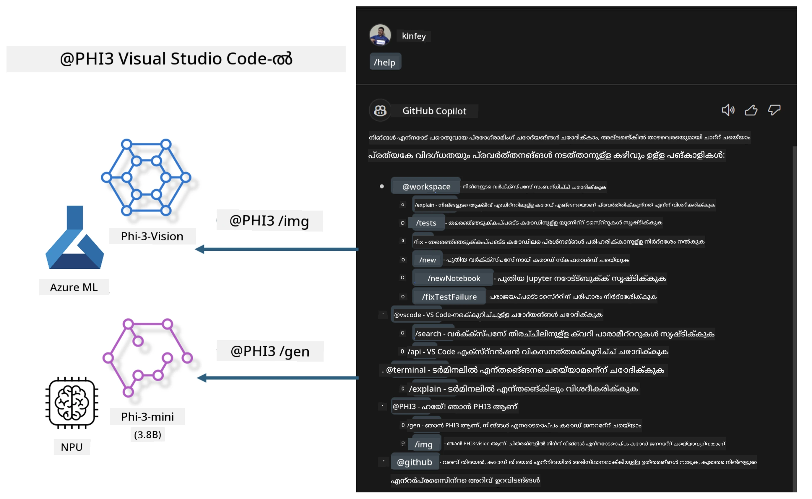

# **നിങ്ങളുടെ സ്വന്തം Visual Studio Code GitHub Copilot Chat Microsoft Phi-3 Family ഉപയോഗിച്ച് നിർമ്മിക്കുക**

GitHub Copilot Chat ൽ workflow agent നിങ്ങൾ ഉപയോഗിച്ചിട്ടുണ്ടോ? നിങ്ങളുടെ ടീമിന്റെ സ്വന്തം കോഡ് ഏജന്റ് നിങ്ങൾ നിർമ്മിക്കാനാഗ്രഹിക്കുന്നുവോ? ഈ പ്രായോഗിക ലാബ് ഓപ്പൺ സോഴ്‌സ് മോഡൽ ഉപയോഗിച്ച് എന്റർപ്രൈസ്-തലത്തിലുള്ള കോഡ് ബിസിനസ് ഏജന്റ് നിർമ്മിക്കാനുള്ള ശ്രമമാണ്.

## **അടിസ്ഥാനങ്ങൾ**

### **Microsoft Phi-3 തിരഞ്ഞെടുക്കേണ്ടത് എന്തുകൊണ്ട്**

Phi-3 ഒരു കുടുംബ സീരിസാണ്, വിവിധ ട്രെയിനിംഗ് പാരാമീറ്ററുകളിൽ അടിസ്ഥാനമാക്കി text generation, dialogue completion, மற்றும் code generation നു വേണ്ടി phi-3-mini, phi-3-small, phi-3-medium തുടങ്ങിയവ ഉൾപ്പെടുന്നു. Vision അടിസ്ഥാനമാക്കിയുള്ള phi-3-vision കൂടി ഉണ്ട്. ഇത് എന്റർപ്രൈസുകൾക്കോ വിവിധ ടീമുകൾക്കോ ഓഫ്ലൈൻ ജനറേറ്റീവ് AI പരിഹാരങ്ങൾ സൃഷ്ടിക്കാൻ അനുയോജ്യമാണ്.

Recommended to read this link [https://github.com/microsoft/PhiCookBook/blob/main/md/01.Introduction/01/01.PhiFamily.md](https://github.com/microsoft/PhiCookBook/blob/main/md/01.Introduction/01/01.PhiFamily.md)

### **Microsoft GitHub Copilot Chat**

GitHub Copilot Chat എക്സ്റ്റെൻഷൻ നിങ്ങളെ ഒരു ചാറ്റ് ഇന്റർഫേസിലൂടെ സഹായിക്കുന്നു, ഇത് VS Code ല്‍ നേരിട്ട് GitHub Copilot നോടു സംവദിച്ച് കോഡിംഗ്-ബന്ധമായ ചോദ്യങ്ങൾക്ക് ഉത്തരം ലഭ്യമാക്കാൻ സഹായിക്കുന്നു, എത്രയും വൈകാതെ ഡോക്യുമെന്റേഷൻ കാണുകയോ ഓൺലൈൻ ഫോറങ്ങൾ തിരയുകയോ ചെയ്യേണ്ടതില്ല.

Copilot Chat സൃഷ്ടിച്ച മറുപടിക്ക് വ്യക്തമാക്കലിനായി syntax highlighting, indentation, മറ്റ് ഫോർമാറ്റിംഗ് ഫീച്ചറുകൾ ഉപയോഗിക്കാൻ পারে. ഉപയോക്താവിന്റെ ചോദ്യത്തിന്റെ തരത്തിനനുസരിച്ച്, ഫലം Copilot ഉത്തരം സൃഷ്ടിക്കാനായി ഉപയോഗിച്ച കോൺടെക്സ്റ്റിലേക്ക് ലിങ്കുകൾ അല്ലെങ്കിൽ കോഡ് ഉദാഹരണങ്ങൾക്കുള്ള ബട്ടണുകൾ ഉൾക്കൊള്ളാവുന്നതാണ്, ഉദാഹരണത്തിന് സോഴ്സ് കോഡ് ഫയലുകൾ അല്ലെങ്കിൽ ഡോക്യുമെന്റേഷൻ.

- Copilot Chat നിങ്ങളുടെ ഡെവലപ്പർ ഫ്ലോയിലേക്ക് ഇന്റഗ്രേറ്റ് ചെയ്യുകയും നിങ്ങൾക്ക് ആവശ്യമുള്ള സ്ഥലങ്ങളിൽ സഹായം നൽകുകയും ചെയ്യുന്നു:

- എഡിറ്ററിൽ നിന്നോ ടെർമിനലിൽ നിന്നോ നേരിട്ട് ഇൻലൈൻ ചാറ്റ് സംവാദം തുടങ്ങുക, കോഡുചെയ്യുമ്പോൾ സഹായത്തിനായി

- എപ്പൊഴും സഹായത്തിനായി പക്കൽ ഒരു AI അസിസ്റ്റന്റായി പ്രവർത്തിക്കാൻ Chat കാഴ്ച ഉപയോഗിക്കുക

- ഒരു ചെറിയ ചോദ്യം ചോദിച്ച് രസകരമായി മുഴുവൻ പ്രവൃത്തിയെ തുടരാൻ Quick Chat ആരംഭിക്കുക

GitHub Copilot Chat നിങ്ങൾക്ക് വിവിധ സാഹചര്യങ്ങളിൽ ഉപയോഗിക്കാം, ഉദാഹരണത്തിന്:

- ഒരു പ്രശ്നം ഏറ്റവും മികച്ച രീതിയിൽ എങ്ങനെ പരിഹരിക്കാമെന്ന് സംബന്ധിച്ച കോഡിങ്ങ് ചോദ്യങ്ങൾക്ക് ഉത്തരമൊരുക്കൽ

- മറ്റൊരാളുടെ കോഡ് വിശദീകരിക്കൽയും മെച്ചപ്പെടുത്തലുകൾ നിർദ്ദേശിക്കൽ

- കോഡ് ഫിക്‌സുകൾ നിർദ്ദേശിക്കൽ

- യൂണിറ്റ് ടെസ്റ്റ് കേസുകൾ ජනെറേറ്റ് ചെയ്യൽ

- കോഡ് ഡോക്യുമെന്റേഷൻ ജനെറേറ്റ് ചെയ്യൽ

Recommended to read this link [https://code.visualstudio.com/docs/copilot/copilot-chat](https://code.visualstudio.com/docs/copilot/copilot-chat?WT.mc_id=aiml-137032-kinfeylo)

###  **Microsoft GitHub Copilot Chat @workspace**

Copilot Chat ൽ **@workspace** സൂചിപ്പിക്കുന്നത് നിങ്ങളുടെ മുഴുവൻ കോഡ്‌ബെയ്‌സിനെക്കുറിച്ചുള്ള ചോദ്യങ്ങൾ ചോദിക്കാൻ നിങ്ങളെ അനുവദിക്കുന്നു. ചോദ്യത്തിന്റെ അടിസ്ഥാനത്തിൽ, Copilot ആവശ്യസാധ്യമായ ഫയലുകളും സിംബോളുകളും ബുദ്ധിപൂർവം കണ്ടെത്തി അത് തന്റെ uttaram നിർമ്മാണത്തിൽ ലിങ്കുകളും കോഡ് ഉദാഹരണങ്ങളും ആയി റഫറൻസ് ചെയ്യുന്നു.

നിങ്ങളുടെ ചോദ്യത്തിന് ഉത്തരം നൽകാൻ, **@workspace** VS Code ൽ ഒരു ഡെവലപ്പർ കോഡ്‌بേസ് നാവിഗേറ്റ് ചെയ്യുമ്പോൾ ഉപയോഗിക്കുന്ന അതേ സ്രോതസ്സുകൾ സെർച്ച് ചെയ്യുന്നു:

- ഒരു .gitignore ഫയൽ വഴി ഒഴിവാക്കിയ ഫയർകൾ ഒഴികെയുള്ള വർക്ക്‌സ്പേസിലെ എല്ലാ ഫയലുകളും

- നഞ്ചലമായി ഇവയായുള്ള ഫോൾഡറും ഫയൽ നാമങ്ങളും ഉൾപ്പെടുന്ന ഡയറക്ടറി ഘടന

- വാർക്ക്‌സ്‌പേസ് GitHub റിപ്പോസിറ്ററിയും code search നാൽ ഇൻഡക്സെഡ് ആണെങ്കിൽ GitHub ന്റെ കോഡ് സെർച്ച് ഇൻഡെക്സ്

- വർക്ക്‌സ്‌പേസിലെ സിംബോളുകളും തീരുമാനം നിർവചനങ്ങളും

- നിലവിൽ തിരഞ്ഞെടുത്ത ടെക്സ്റ്റ് അല്ലെങ്കിൽ സജീവ എഡിറ്ററിൽ കാണപ്പെടുന്ന ടെക്സ്റ്റ്

Note: .gitignore ഒഴിവാക്കിയ ഫയലിനുള്ളിൽ ഒരു ഫയൽ തുറന്നിട്ടുണ്ടെങ്കിൽ അല്ലെങ്കിൽ അവയിൽ ടെക്സ്റ്റ് സിലെക്ട് ചെയ്തിട്ടുണ്ടെങ്കിൽ .gitignore ബൈപ്പാസ് ചെയ്യും.

Recommended to read this link [[https://code.visualstudio.com/docs/copilot/copilot-chat](https://code.visualstudio.com/docs/copilot/workspace-context?WT.mc_id=aiml-137032-kinfeylo)]

## **ഈ ലാബ് കുറിച്ച് കൂടുതൽ അറിയുക**

GitHub Copilot എന്റർപ്രൈസുകളിലെ പ്രോഗ്രാമിങ്ങ് കാര്യക്ഷമത വളരെ മെച്ചപ്പെടുത്തിച്ചിട്ടുണ്ട്, ഓരോ എന്റർപ്രൈസും GitHub Copilot ന്റെ ബന്ധപ്പെട്ട ഫീച്ചറുകൾ ഇഷ്‌ടാനുസരണം കസ്റ്റമൈസ് ചെയ്യണമെന്ന് ആഗ്രഹിക്കുന്നു. നിരവധി എന്റർപ്രൈസുകൾ അവരുടെ സ്വന്തം ബിസിനസ് സീനാരിയോസ് ആധികാരികമായി കസ്റ്റമൈസ് ചെയ്ത Extensions GitHub Copilot നുള്ളതുപോലെ തുറന്ന സോഴ്‌സ് മോഡലുകൾ അടിസ്ഥാനമാക്കി വികസിപ്പിച്ചിട്ടുണ്ട്. എന്റർപ്രൈസുകൾക്ക് കസ്റ്റമൈസ്ഡ് എക്സ്റ്റെൻഷനുകൾ നിയന്ത്രിക്കാൻ എളുപ്പമാണ്, പക്ഷേ ഇത് ഉപയോക്തൃ അനുഭവത്തെ ബാധിക്കാം. ഒടുവിൽ, സാധാരണ സാഹചര്യങ്ങളിലും പ്രൊഫഷണലിസത്തിലും കൈകാര്യം ചെയ്യുന്നതിൽ GitHub Copilot കൂടുതൽ ശക്തമായ ഫംഗ്ഷനുകൾ ഉണ്ടെന്ന് പറഞ്ഞാലും, അനുഭവം തുല്യമായി കുടിയേറാൻ സാധിക്കുകയാണെങ്കിൽ, സ്വന്തം എന്റർപ്രൈസ് എക്സ്റ്റെൻഷൻ കസ്റ്റമൈസ് ചെയ്യുന്നത് മെച്ചമായിരിക്കും. GitHub Copilot Chat എന്റർപ്രൈസുകൾക്ക് ചാറ്റ് അനുഭവം വിപുലീകരിക്കാൻ ബന്ധപ്പെട്ട APIs പ്രദാനം ചെയ്യുന്നു. സ്ഥിരമായ അനുഭവം നിലനിർത്തുകയും കസ്റ്റമൈസ്ഡ് ഫംഗ്ഷനുകൾ ഉണ്ടാകുകയുമാണ് മികച്ച ഉപയോക്തൃ അനുഭവം.

ഈ ലാബ് പ്രധാനമായും Phi-3 മോഡൽ ലോക്കൽ NPU-യുമായും Azure ഹൈബ്രിഡുമായും ചേർത്ത് GitHub Copilot Chat ൽ ഒരു കസ്റ്റം ഏജന്റ് ***@PHI3*** നിർമ്മിക്കുന്നതിന് ഉപയോഗിക്കുന്നു, ഇത് എന്ററ്പ്രൈസ് ഡെവലപ്പർമാർക്ക് കോഡ് ജനറേഷൻ***(@PHI3 /gen)*** പൂർത്തിയാക്കുന്നതിലും ചിത്രങ്ങളുടെ അടിസ്ഥാനത്തിൽ കോഡ് ജനറേറ്റ് ചെയ്യുന്നതിലുമൊക്കെ സഹായിക്കുന്നു***(@PHI3 /img)***.

### ***കുറിപ്പ്:*** 

ഈ ലാബ് നിലവിൽ Intel CPU യുടെ AIPC ലും Apple Silicon ലും നടപ്പിലാക്കിയിട്ടുണ്ട്. ഞങ്ങൾ Qualcomm പതിപ്പിലുള്ള NPU ആുന്നതിനുള്ള അപ്‌ഡേറ്റുകൾ തുടർന്നും നൽകുന്നതാണ്.

## **ലാബ്**

| Name | Description | AIPC | Apple |
| ------------ | ----------- | -------- |-------- |
| Lab0 - Installations(✅) | ബന്ധപ്പെട്ട പരിസ്ഥിതികളെയും ഇൻസ്റ്റലേഷൻ ടൂളുകളെയും കോൺഫിഗർ ചെയ്ത് ഇൻസ്റ്റാൾ ചെയ്യുക | [Go](./HOL/AIPC/01.Installations.md) |[Go](./HOL/Apple/01.Installations.md) |
| Lab1 - Run Prompt flow with Phi-3-mini (✅) | AIPC / Apple Silicon സംയോജിപ്പിച്ച്, ലോക്കൽ NPU ഉപയോഗിച്ച് Phi-3-mini മുഖേന കോഡ് ജനറേഷൻ സൃഷ്ടിക്കൽ | [Go](./HOL/AIPC/02.PromptflowWithNPU.md) |  [Go](./HOL/Apple/02.PromptflowWithMLX.md) |
| Lab2 - Deploy Phi-3-vision on Azure Machine Learning Service(✅) | Azure Machine Learning Service ന്റെ Model Catalog - Phi-3-vision ഇമേജ് ഡിപ്പ്ലോയ് ചെയ്ത് കോഡ് ജനറേറ്റ് ചെയ്യുക | [Go](./HOL/AIPC/03.DeployPhi3VisionOnAzure.md) |[Go](./HOL/Apple/03.DeployPhi3VisionOnAzure.md) |
| Lab3 - Create a @phi-3 agent in GitHub Copilot Chat(✅)  | GitHub Copilot Chat ൽ ഒരു കസ്റ്റം Phi-3 ഏജന്റ് സൃഷ്ടിച്ച് കോഡ് ജനറേഷൻ, ഗ്രാഫ് ജനറേഷൻ കോഡ്, RAG തുടങ്ങിയവ പൂർത്തിയാക്കുക | [Go](./HOL/AIPC/04.CreatePhi3AgentInVSCode.md) | [Go](./HOL/Apple/04.CreatePhi3AgentInVSCode.md) |
| Sample Code (✅)  | സാമ്പിൾ കോഡ് ഡൗൺലോഡ് ചെയ്യുക | [Go](../../../../../../../code/07.Lab/01/AIPC) | [Go](../../../../../../../code/07.Lab/01/Apple) |

## **സ്രോതസ്സുകൾ**

1. Phi-3 Cookbook [https://github.com/microsoft/Phi-3CookBook](https://github.com/microsoft/Phi-3CookBook)

2. GitHub Copilot കുറിച്ച് കൂടുതൽ അറിയാൻ [https://learn.microsoft.com/training/paths/copilot/](https://learn.microsoft.com/training/paths/copilot/?WT.mc_id=aiml-137032-kinfeylo)

3. GitHub Copilot Chat കുറിച്ച് കൂടുതൽ അറിയാൻ [https://learn.microsoft.com/training/paths/accelerate-app-development-using-github-copilot/](https://learn.microsoft.com/training/paths/accelerate-app-development-using-github-copilot/?WT.mc_id=aiml-137032-kinfeylo)

4. GitHub Copilot Chat API കുറിച്ച് കൂടുതൽ അറിയാൻ [https://code.visualstudio.com/api/extension-guides/chat](https://code.visualstudio.com/api/extension-guides/chat?WT.mc_id=aiml-137032-kinfeylo)

5. Azure AI Foundry കുറിച്ച് കൂടുതൽ അറിയാൻ [https://learn.microsoft.com/training/paths/create-custom-copilots-ai-studio/](https://learn.microsoft.com/training/paths/create-custom-copilots-ai-studio/?WT.mc_id=aiml-137032-kinfeylo)

6. Azure AI Foundry യുടെ Model Catalog കുറിച്ച് കൂടുതൽ അറിയാൻ [https://learn.microsoft.com/azure/ai-studio/how-to/model-catalog-overview](https://learn.microsoft.com/azure/ai-studio/how-to/model-catalog-overview)

---

<!-- CO-OP TRANSLATOR DISCLAIMER START -->
ഡിസ്ക്ലെയിമർ:
ഈ രേഖ AI വിവർത്തന സേവനമായ [Co-op Translator](https://github.com/Azure/co-op-translator) ഉപയോഗിച്ച് വിവർത്തനം ചെയ്തതാണ്. ഞങ്ങൾക്ക് കൃത്യതയിലേക്കുള്ള ശ്രമമുണ്ടെങ്കിലും, സ്വയമാറ്റം ചെയ്ത വിവർത്തനങ്ങളിൽ പിശകുകൾ അല്ലെങ്കിൽ വ്യത്യാസങ്ങൾ ഉണ്ടാകാൻ സാധ്യത ഉണ്ടെന്ന് ദയവായി ശ്രദ്ധിക്കുക. യഥാർത്ഥ ഭാരതീയ ഭാഷയിലുള്ള (അഥവാ അതിന്റെ മാതൃഭാഷയിൽ ഉള്ള) ഒറിജിനൽ ദസ്താവേസ് പ്രാമാണിക സ്രോതസ്സായി പരിഗണിക്കേണ്ടതാണ്. നിർണ്ണായക വിവരങ്ങൾക്ക് പ്രൊഫഷണൽ മനുഷ്യ വിവർത്തനം ശുപാർശ ചെയ്യപ്പെടുന്നു. ഈ വിവർത്തനം ഉപയോഗിക്കുന്നത് മൂലം ഉണ്ടാകുന്ന ഏതെങ്കിലും തെറ്റിദ്ധാരണകൾക്കും തെറ്റായ വ്യാഖ്യാനങ്ങൾക്കും ഞങ്ങൾ ഉത്തരവാദികളല്ല.
<!-- CO-OP TRANSLATOR DISCLAIMER END -->