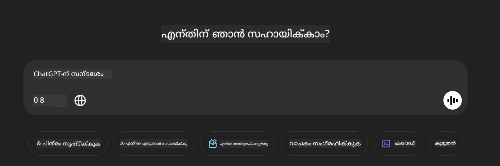

<!--
CO_OP_TRANSLATOR_METADATA:
{
  "original_hash": "83b94a515637dffaea3bae99278561a6",
  "translation_date": "2025-12-21T22:05:30+00:00",
  "source_file": "md/02.Application/04.Vision/Phi4/CreateFrontend/README.md",
  "language_code": "ml"
}
-->
## **Phi-4-multimodal ഉപയോഗിച്ച് ചിത്രങ്ങൾ വായിച്ച് കോഡ് സൃഷ്ടിക്കുക**

Phi-4-multimodal ന് ശക്തമായ ചിത്രം വായിക്കാനുള്ള കഴിവുകൾ ഉണ്ട്. ചുവടെയുള്ള ഫംഗ്ഷനുകൾ Python ഉപയോഗിച്ച് നടപ്പാക്കാൻ നമുക്ക് ശ്രമിക്കാം. ചിത്രം ഒരു ChatGPT പേജാണ്. 



### **സാമ്പിൾ കോഡ്**


```python

import requests
import torch
from PIL import Image
import soundfile
from transformers import AutoModelForCausalLM, AutoProcessor, GenerationConfig,pipeline,AutoTokenizer

model_path = 'Your Phi-4-multimodal location'

kwargs = {}
kwargs['torch_dtype'] = torch.bfloat16

processor = AutoProcessor.from_pretrained(model_path, trust_remote_code=True)

model = AutoModelForCausalLM.from_pretrained(
    model_path,
    trust_remote_code=True,
    torch_dtype='auto',
    _attn_implementation='flash_attention_2',
).cuda()

generation_config = GenerationConfig.from_pretrained(model_path, 'generation_config.json')

user_prompt = '<|user|>'
assistant_prompt = '<|assistant|>'
prompt_suffix = '<|end|>'

prompt = f'{user_prompt}Can you generate HTML + JS code about this image <|image_1|> ? Please step by step {prompt_suffix}{assistant_prompt}'

image = Image.open("./demo.png")

inputs = processor(text=prompt, images=[image], return_tensors='pt').to('cuda:0')

generate_ids = model.generate(
    **inputs,
    max_new_tokens=4096,
    generation_config=generation_config,
)

generate_ids = generate_ids[:, inputs['input_ids'].shape[1] :]

response = processor.batch_decode(
    generate_ids, skip_special_tokens=True, clean_up_tokenization_spaces=False
)[0]

print(response)

```

---

<!-- CO-OP TRANSLATOR DISCLAIMER START -->
ഡിസ്ക്ലെയിമർ:
ഈ പ്രമാണം AI വിവർത്തന സേവനമായ [Co-op Translator](https://github.com/Azure/co-op-translator) ഉപയോഗിച്ച് വിവർത്തനമാക്കിയ നാണ്. ഞങ്ങൾ കൃത്യതയ്ക്ക് പരിശ്രമിച്ചുകൊണ്ടിരിക്കുമ്പോഴും, ഓട്ടോമേറ്റഡ് വിവർത്തനങ്ങളിൽ പിശകുകൾ അല്ലെങ്കിൽ അസത്യതകൾ ഉണ്ടാകാവുന്നതായതിനാൽ ദയവായി ശ്രദ്ധിക്കുക. മൂലപ്രമാണം അതിന്റെ പ്രാഥമികവും അധികാരപരവുമായ ഉറവിടമായി കണക്കാക്കിയിരിക്കണം. നിർണായകമായ വിവരങ്ങൾക്ക് പ്രൊഫഷണൽ മനുഷ്യവിവർത്തനം ശുപാർശ ചെയ്യപ്പെടുന്നു. ഈ വിവർത്തനത്തിന്റെ ഉപയോഗം മൂലം ഉണ്ടായേക്കാവുന്ന തെറ്റിദ്ധാരണകൾക്കും തെറ്റായ വ്യാഖ്യാനങ്ങൾക്കും ഞങ്ങൾ ഉത്തരവാദികളല്ല.
<!-- CO-OP TRANSLATOR DISCLAIMER END -->