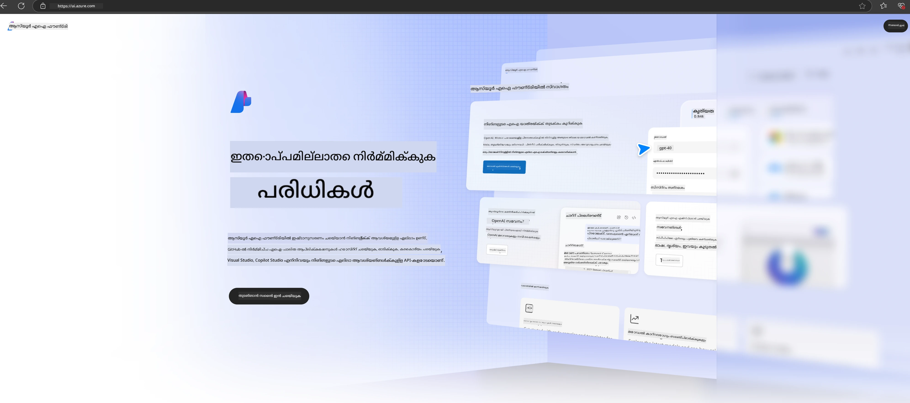

<!--
CO_OP_TRANSLATOR_METADATA:
{
  "original_hash": "3a1e48b628022485aac989c9f733e792",
  "translation_date": "2025-12-21T19:12:25+00:00",
  "source_file": "md/02.QuickStart/AzureAIFoundry_QuickStart.md",
  "language_code": "ml"
}
-->
# **Azure AI Foundry-ൽ Phi-3 ഉപയോഗിക്കൽ**

ജനറേറ്റീവ് AI-യുടെ വികസനത്തോടനുബന്ധിച്ചു, വ്യത്യസ്ത LLM-കളും SLM-കളും, എന്റർപ്രൈസ് ഡാറ്റയുടെ ഇന്റെഗ്രേഷൻ, ഫൈൻ-ട്യൂണിംഗ്/RAG പ്രവർത്തനങ്ങൾ, LLM/SLM സംയോജിച്ചതിന് ശേഷം വ്യത്യസ്ത എന്റർപ്രൈസ് ബിസിനസ്സുകളുടെ മൂല്യനിർണയം എന്നിവ ഒരു ഏകീകൃത പ്ലാറ്റ്ഫോം വഴി മാനേജ് ചെയ്യാൻ നാം ആഗ്രഹിക്കുന്നു, ഇതുവഴി ജനറേറ്റീവ് AI ഉപയോഗിച്ചുള്ള സ്മാർട്ട് അപ്ലിക്കേഷനുകൾ മികച്ച രൂപത്തിൽ നടപ്പിലാക്കാൻ സാധിക്കുന്നു. [Azure AI Foundry](https://ai.azure.com) ഒരു എന്റർപ്രൈസ്-തലത്തിൻറെ ജനറേറ്റീവ് AI അപ്ലിക്കേഷൻ പ്ലാറ്റ്‌ഫോം ആണ്.

Azure AI Foundry ഉപയോഗിച്ച്, നിങ്ങൾ വലിയ ഭാഷാ മോഡൽ (LLM) പ്രതികരണങ്ങൾ വിലയിരുത്താനും, മികച്ച പ്രകടനത്തിനായി prompt flow ഉപയോഗിച്ച് പ്രോമ്പ്റ്റ് അപ്ലിക്കേഷൻ ഘടകങ്ങൾ ഓർക്കസ്‌ട്രേറ്റ് ചെയ്യാനും കഴിയും. പ്രൂഫ് ഓഫ് കോൺസെപ്റ്റുകൾ പൂർണമായ ഉത്പാദന ഘട്ടങ്ങളായി മാറ്റുന്നതില്‍ പ്ലാറ്റ്ഫോം സ്കെയിലബിലിറ്റിക്ക് സഹായിക്കുന്നു. തുടർച്ചയായ നിരീക്ഷണംയും തിരുത്തലും ദ 长കാല വിജയത്തിന് പിന്തുണ നൽകും.

ഞങ്ങൾ എളുപ്പമായ നാല്‌ഘടകങ്ങളിലൂടെ Azure AI Foundry-ൽ Phi-3 മോഡൽ വേഗത്തിൽ ഡിപ്ലോയ് ചെയ്യാനും, തുടർന്ന് Azure AI Foundry ഉപയോഗിച്ച് Phi-3- സംബന്ധിച്ച Playground/Chat, Fine-tuning, മൂല്യനിർണ്ണയം തുടങ്ങിയ പ്രവൃത്തികൾ പൂർത്തീകരിക്കാനുമാകുന്നു.

## **1. തയ്യാറെടുപ്പ്**

നിങ്ങളുടെ മെഷീനിൽ ഇതിനകം തന്നെ [Azure Developer CLI](https://learn.microsoft.com/azure/developer/azure-developer-cli/overview?WT.mc_id=aiml-138114-kinfeylo) ഇൻസ്റ്റാൾ ചെയ്തിട്ടുണ്ടെങ്കിൽ, ഈ ടെംപ്ലേറ്റ് ഉപയോഗിക്കുന്നത് ഒരു പുതിയ ഡയറക്ടറിയിൽ ഈ കമാൻഡ് chạy ചെയ്യുന്നതുവരെ സിമ്പിൾ ആണ്.

## മാനുവൽ സൃഷ്ടി

Microsoft Azure AI Foundry പ്രോജക്ടും hub-ഉം സൃഷ്ടിക്കലിലൂടെ നിങ്ങളുടെ AI പ്രവർത്തനങ്ങൾ ക്രമീകരിക്കുകയും നിയന്ത്രിക്കാനുമായൊരു മികച്ച മാർഗ്ഗമാണ്. തുടക്കമെടുക്കുന്നതിനുള്ള ഘട്ടം ഘട്ടമായുള്ള ഗൈഡ് ഇവിടെ ഉണ്ട്:

### Azure AI Foundry-ൽ ഒരു പ്രോജക്ട് സൃഷ്ടിക്കൽ

1. **Azure AI Foundry-ലേക്ക് പോകുക**: Azure AI Foundry പോർട്ടലിലേക്ക് സൈൻ‌イン ചെയ്യുക.
2. **പ്രോജക്ട് സൃഷ്ടിക്കുക**:
   - നിങ്ങൾ ഇതിനകം ഒരു പ്രോജക്ടിൽ ഉണ്ടെങ്കിൽ, ഹോം പേജിലേക്ക് പോകാൻ പേജിന്റെ ഇടതു മുകളിൽ "Azure AI Foundry" തെരഞ്ഞെടുത്തതു്.
   - "+ Create project" തിരഞ്ഞെടുക്കുക.
   - പ്രോജക്ടിനുള്ള ഒരു പേര് നൽകുക.
   - നിങ്ങൾക്കു് hub ഉണ്ടെങ്കില്‍ അത് ഡീഫോൾട്ടായി തെരഞ്ഞെടുത്തിരിക്കും. നിങ്ങൾക്ക് ഏറെയുള്ള hub-കളിലേക്ക് ആക്സസ് ഉണ്ടെങ്കിൽ ഡ്രോപ്പ്ഡൗൺ നിന്ന് വ്യത്യസ്തമൊന്ന് തിരഞ്ഞെടുക്കാം. പുതിയൊരു hub സൃഷ്ടിക്കാൻ চাইാൻ നിങ്ങൾ "Create new hub" തിരഞ്ഞെടുക്കുകയും പേരൊന്നുകൂടെ നൽകുകയും ചെയ്യുക.
   - "Create" തിരഞ്ഞെടുക്കുക.

### Azure AI Foundry-ൽ ഒരു Hub സൃഷ്ടിക്കൽ

1. **Azure AI Foundry-ലേക്ക് പോകുക**: നിങ്ങളുടെ Azure അക്കൗണ്ടിൽ സൈൻ ഇൻ ചെയ്യുക.
2. **Hub സൃഷ്ടിക്കുക**:
   - ഇടതു മെനുവിൽ നിന്നുള്ള Management center തിരഞ്ഞെടുക്കുക.
   - "All resources" തിരഞ്ഞെടുക്കുക, തുടർന്ന് "+ New project"യുടെ അടുത്തുള്ള താഴത്തെ മുക്കം അടയാളം തിരഞ്ഞെടുക്കുകയും "+ New hub" തിരഞ്ഞെടുക്കുകയും ചെയ്യുക.
   - "Create a new hub" ഡയലോഗിൽ, നിങ്ങളുടെ hub-യ്ക്ക് ഒരു പേര് നൽകുക (ഉദാഹരണത്തിന്, contoso-hub) മറ്റു ഫീൽഡുകൾ ആവശ്യാനുസരണം തിരുത്തുക.
   - "Next" തിരഞ്ഞെടുക്കുക, വിവരങ്ങൾ പരിശോധിച്ച് പിന്നീട് "Create" തിരഞ്ഞെടുക്കുക.

കൂടുതൽ വിശദമായ നിർദ്ദേശങ്ങൾക്ക് ഔദ്യോഗിക [Microsoft ഡോക്യുമെന്റേഷൻ](https://learn.microsoft.com/azure/ai-studio/how-to/create-projects) കാണാവുന്നതാണ്.

സഫലമായി സൃഷ്ടിച്ചശേഷം, നിങ്ങൾ സൃഷ്ടിച്ച സ്റ്റודיo-യ്ക്ക് [ai.azure.com](https://ai.azure.com/) മുഖേന പ്രവേശിക്കാം.

ഒരു AI Foundry-യിൽ നിരവധി പ്രോജക്ടുകൾ থাকতে পারে. തയ്യാറെടുപ്പിന് AI Foundry-ൽ ഒരു പ്രോജക്ട് സൃഷ്ടിക്കുക.

Azure AI Foundry [QuickStarts](https://learn.microsoft.com/azure/ai-studio/quickstarts/get-started-code) സൃഷ്ടിക്കുക.

## **2. Azure AI Foundry-ൽ Phi മോഡൽ ഡിപ്ലോയ് ചെയ്യുക**

പ്രോജക്ടിന്റെ Explore ഓപ്‌ഷൻ ക്ലിക്കുചെയ്ത് Model Catalog പ്രവേശിച്ച് Phi-3 തിരഞ്ഞെടുത്ത്

Phi-3-mini-4k-instruct തിരഞ്ഞെടുക്കുക

Phi-3-mini-4k-instruct മോഡൽ ഡിപ്ലോയ് ചെയ്യാൻ 'Deploy' ക്ലിക്ക് ചെയ്യുക

> [!NOTE]
>
> ഡിപ്ലോയ് ചെയ്യുമ്പോൾ നിങ്ങൾക്ക് കമ്പ്യൂട്ടിംഗ് ശേഷി തിരഞ്ഞെടുക്കാൻ കഴിയും

## **3. Azure AI Foundry-ൽ Phi Playground ചാറ്റ്**

ഡിപ്ലോയ്‌മെന്റ് പേജിലേയ്ക്ക് പോകുക, Playground തിരഞ്ഞെടുക്കുക, ശേഷം Azure AI Foundry-വിലെ Phi-3-നോട് ചാറ്റ് ചെയ്യുക

## **4. Azure AI Foundry-യിൽ നിന്നുള്ള മോഡൽ ഡിപ്ലോയ് ചെയ്യൽ**

Azure Model Catalog-ൽനിന്ന് മോഡൽ ഡിപ്ലോയ് ചെയ്യുന്നതിനായി, നിങ്ങൾക്ക് താഴെയുള്ള ഘട്ടങ്ങൾ പിന്തുടരാം:

- Azure AI Foundry-ലേക്ക് സൈൻ ഇൻ ചെയ്യുക.
- Azure AI Foundry മോഡൽ കലക്ഷനിൽ നിന്നു് നിങ്ങളുടെ ഡിപ്ലോയ് ചെയ്യാനുള്ള മോഡൽ തിരഞ്ഞെടുക്കുക.
- മോഡലിന്റെ Details പേജിൽ, Deploy തിരഞ്ഞെടുക്കുക, തുടർന്ന് Serverless API with Azure AI Content Safety തിരഞ്ഞെടുക്കുക.
- നിങ്ങളുടെ മോഡലുകൾ നിങ്ങൾ ഡിപ്ലോയ് ചെയ്യാൻ പോകുന്ന പ്രോജക്ട് തിരഞ്ഞെടുക്കുക. Serverless API ഓഫറിങ് ഉപയോഗിക്കാൻ, നിങ്ങളുടെ വർക്ക്സ്പേസ് East US 2 അല്ലെങ്കിൽ Sweden Central региономിൽ ഉണ്ടായിരിക്കണം. Deployment നാമം കസ്റ്റമൈസ് ചെയ്യാവുന്നതാണ്.
- ഡിപ്ലോയ്‌മെന്റ് വിസാർഡിൽ Pricing and terms തിരഞ്ഞെടുക്കി വിലനിർണയവും ഉപയോഗ നിബന്ധനകളും കുറിച്ച് അറിയുക.
- Deploy തിരഞ്ഞെടുക്കുക. ഡിപ്ലോയ്‌മെന്റ് റെഡി ആന്റ് നിങ്ങളെ Deployments പേജിലേയ്ക്ക് റീഡയറക്ട് ചെയ്തതുവരെ കാത്തിരിക്കുക.
- മോഡലുമായി ഇടപെടാൻ "Open in playground" തിരഞ്ഞെടുക്കുക.
- നിങ്ങൾക്ക് Deployments പേജിലേക്ക് തിരിച്ച് പോകാമെന്നും, ഡിപ്ലോയ്‌മെന്റ് തിരഞ്ഞെടുക്കുകയും മുന്നോട്ടുള്ള Endpoint-ന്റെ Target URL-യും Secret Key-ഉം നോട്ട് ചെയ്ത് ഡിപ്ലോയ്‌മെന്റ് വിളിക്കാൻ ഇവ ഉപയോഗിക്കാമെന്നും അറിയാം.
- Endpoint-ന്റെ വിശദാംശങ്ങളും URL-യും ആക്സസ് കീകളും എല്ലായ്പ്പോഴും Build ടാബിലേക്ക് പോയി Components വിഭാഗത്തിൽനിന്ന് Deployments തിരഞ്ഞെടുക്കുന്നത് വഴി കണ്ടെത്താം.

> [!NOTE]
> ദയവായി ശ്രദ്ധിക്കുക: ഈ ഘട്ടങ്ങൾ നടക്കിക്കാൻ നിങ്ങളുടെ അക്കൗന്റിന് Resource Group-ൽ Azure AI Developer റോളിന്റെ അനുമതികൾ ഉണ്ടായിരിക്കണം.

## **5. Azure AI Foundry-ൽ Phi API ഉപയോഗിക്കൽ**

Postman-ൽ GET വഴി https://{Your project name}.region.inference.ml.azure.com/swagger.json ന് ആക്സസ് ചെയ്ത് Key ഇങ്ങനെ കംബൈൻ ചെയ്‌താൽ ലഭ്യമായ ഇന്റർഫേസുകൾക്കുറിച്ച് പഠിക്കാം

രിക്വസ്റ്റ് പാരാമീറ്ററുകളും, റിസ്‌പോൺസ് പാരാമീറ്ററുകളും നിങ്ങൾക്ക് വളരെ സൗകര്യത്തോടെ ലഭ്യമായിരിക്കും.

---

<!-- CO-OP TRANSLATOR DISCLAIMER START -->
അറിയിപ്പ്:
ഈ പ്രമാണം AI പരിഭാഷാ സേവനമായ [Co-op Translator](https://github.com/Azure/co-op-translator) ഉപയോഗിച്ചു വിവർത്തനം ചെയ്തതാണ്. ഞങ്ങൾ കൃത്യതയ്ക്ക് പരിശ്രമിച്ചന്നാലും, യന്ത്രവത്ക്കൃത വിവർത്തനങ്ങളിൽ പിശകുകൾ അല്ലെങ്കിൽ അകൃതതകൾ ഉണ്ടാകാം എന്ന് ദയവായി ശ്രദ്ധിക്കുക. മൂലരൂപം (അത് ഉള്ള സ്വദേശീയ ഭാഷയിൽ ഉള്ളത്) അധികാരപരമായ ഉറവിടമായി പരിഗണിക്കപ്പെടണം. നിർണ്ണായകമായ വിവരങ്ങൾക്ക് പ്രൊഫഷണൽ മനുഷ്യ വിവർത്തനം ശുപാർശ ചെയ്യപ്പെടുന്നു. ഈ വിവർത്തനത്തിന്റെ ഉപയോഗത്തിൽ നിന്നുള്ള ഏതെങ്കിലും തെറ്റിദ്ധാരണകൾക്കും തെറ്റായ വ്യാഖ്യാനങ്ങൾക്കും ഞങ്ങൾ ഉത്തരവാദികളല്ല.
<!-- CO-OP TRANSLATOR DISCLAIMER END -->