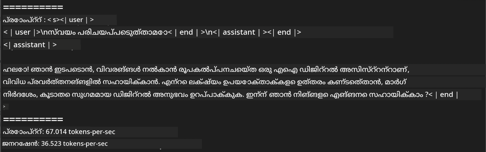
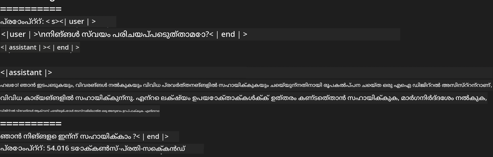

<!--
CO_OP_TRANSLATOR_METADATA:
{
  "original_hash": "dcb656f3d206fc4968e236deec5d4384",
  "translation_date": "2025-12-21T22:13:31+00:00",
  "source_file": "md/03.FineTuning/03.Inference/MLX_Inference.md",
  "language_code": "ml"
}
-->
# **Apple MLX ഫ്രെയിംവർക്കുമായി Phi-3 ഇൻഫറൻസ്**

## **MLX ഫ്രെയിംവർക് എന്താണ്**

MLX Apple സിലിക്കാനിൽ മെഷീൻ ലേണിംഗ് ഗവേഷണത്തിന് വേണ്ടി Apple machine learning research അവതരിപ്പിച്ച ഒരു അറേ ഫ്രെയിംവർക്ക് ആണ്.

MLX മെഷീൻ ലേണിംഗ് ഗവേഷകര്‍ക്കായി മെഷീൻ ലേണിംഗ് ഗവേഷകരാണ് രൂപകല്‍പ്പന ചെയ്തിരിക്കുന്നത്. ഫ്രെയിംവർക്ക് ഉപയോക്തൃ സൗഹൃദമാകാനുള്ളതായിരിക്കുമെങ്കിലും മോഡലുകൾ പരിശീലിപ്പിക്കാനും ഡിപ്ലോയുചെയ്യാനും എഫിഷ്യൻറായിട്ടാണ് രൂപകൽപ്പന ചെയ്തിരിക്കുന്നത്. ഫ്രെയിംവർക്കിന്റെ രൂപകൽപനയും ആശയപരമായ açıൽ ലളിതമാണ്.研究കര്‍ക്ക് MLX വಿಸ್ತാരിപ്പിക്കാനും മെച്ചപ്പെടുത്താനും പുതിയ ആശയങ്ങൾ വേഗത്തിൽ പരീക്ഷിക്കുന്നതിനായുള്ള സൗകര്യം നൽകുക എന്നതാണു ഞങ്ങളുടെ ലക്ഷ്യം.

MLX വഴി Apple Silicon ഉപകരണങ്ങളിൽ LLMകൾ വേഗത്തിലും മോഡലുകൾ ലൊക്കലായി വളരെ സൗകര്യപ്രദമായി ഓടിക്കാം.

## **MLX ഉപയോഗിച്ച് Phi-3-mini ഇൻഫറൻസ് ചെയ്യൽ**

### **1. നിങ്ങളുടെ MLX പരിസ്ഥിതി സജ്ജമാക്കുക**

1. Python 3.11.x
2. MLX ലൈബ്രറി ഇൻസ്റ്റാൾ ചെയ്യുക


```bash

pip install mlx-lm

```

### **2. MLX ഉപയോഗിച്ച് Terminal-ൽ Phi-3-mini ഓടിക്കൽ**


```bash

python -m mlx_lm.generate --model microsoft/Phi-3-mini-4k-instruct --max-token 2048 --prompt  "<|user|>\nCan you introduce yourself<|end|>\n<|assistant|>"

```

ഫലമായി (എന്റെ പരിസ്ഥിതി Apple M1 Max,64GB ആണ്) ആണ്



### **3. Terminal-ൽ MLX ഉപയോഗിച്ച് Phi-3-mini ക്വാണ്ടൈസേഷൻ ചെയ്യൽ**


```bash

python -m mlx_lm.convert --hf-path microsoft/Phi-3-mini-4k-instruct

```

***Note：*** മോഡൽ mlx_lm.convert വഴി ക്വാണ്ടൈസ് ചെയ്യാവുന്നതാണ്, ഒപ്പം ഡിഫോൾട്ട് ക്വാണ്ടൈസേഷൻ INT4 ആണ്. ഈ ഉദാഹരണം Phi-3-mini-നെ INT4 ആക്കി ക്വാണ്ടൈസ് ചെയ്യുന്നത് ആണു

മോഡൽ mlx_lm.convert വഴി ക്വാണ്ടൈസ് ചെയ്യാവുന്നതാണ്, ഡിഫോൾട്ട് ക്വാണ്ടൈസേഷൻ INT4 ആണ്. ഈ ഉദാഹരണം Phi-3-mini നെ INT4 ആക്കി ക്വാണ്ടൈസ് ചെയ്യുന്നതാണ്. ക്വാണ്ടൈസ് ചെയ്തശേഷം അത് ഡിഫോൾട്ട് ഡയറക്ടറിയായ ./mlx_model ൽ സൂക്ഷിച്ചിരിക്കും

Terminal-ൽ MLX ഉപയോഗിച്ച് ക്വാണ്ടൈസ് ചെയ്ത മോഡൽ പരീക്ഷിക്കാവുന്നതാണ്


```bash

python -m mlx_lm.generate --model ./mlx_model/ --max-token 2048 --prompt  "<|user|>\nCan you introduce yourself<|end|>\n<|assistant|>"

```

ഫലം:




### **4. Jupyter Notebook-ൽ MLX ഉപയോഗിച്ച് Phi-3-mini ഓടിക്കൽ**


***Note:*** ദയവായി ഈ സാമ്പിൾ [ഈ ലിങ്ക് ക്ലിക്ക് ചെയ്യുക](../../../code/03.Inference/MLX/MLX_DEMO.ipynb)


## **Resources**

1. Apple MLX ഫ്രെയിംവർക്കിനെ കുറിച്ച് അറിയുക [https://ml-explore.github.io](https://ml-explore.github.io/mlx/build/html/index.html)

2. Apple MLX GitHub Repo [https://github.com/ml-explore](https://github.com/ml-explore)

---

<!-- CO-OP TRANSLATOR DISCLAIMER START -->
ബാധ്യത നിഷേധം:
ഈ രേഖ AI തർജ്ജமാ സേവനമായ [Co-op Translator](https://github.com/Azure/co-op-translator) ഉപയോഗിച്ച് തർജ്ജമ ചെയ്തതാണ്. ഞങ്ങൾ കൃത്യതയ്ക്ക് 노력ിച്ചിരുന്നെങ്കിലും, സ്വയമേറ്റുള്ള തർജ്ജമകളിൽ പിശകുകൾ അല്ലെങ്കിൽ അപാസ്മാര്യമാകുന്ന വിവരങ്ങൾ ഉണ്ടാകാമെന്ന് ദയവായി ശ്രദ്ധിക്കുക. മാതൃഭാഷയിലെ മൂല രേഖ ആണ് അധികാരപരമായ ഉറവിടമായി പരിഗണിക്കേണ്ടത്. നിർണായകമായ വിവരങ്ങൾക്ക് പ്രൊഫഷണൽ മനുഷ്യ വിവർത്തനം ശുപാർശിക്കപ്പെടുന്നു. ഈ തർജ്ജമ ഉപയോഗിച്ചതിൽ നിന്നുണ്ടാകുന്ന ഏതെങ്കിലും തെറ്റിദ്ധാരണകൾക്കും വ്യാഖ്യാനപ്പിശകുകൾക്കും ഞങ്ങൾ ബാധ്യസ്ഥരല്ല.
<!-- CO-OP TRANSLATOR DISCLAIMER END -->