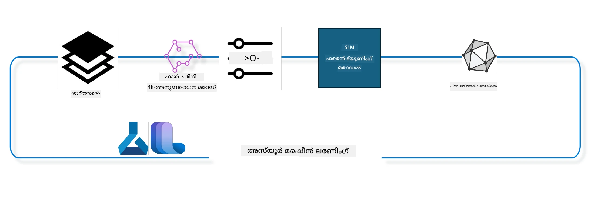

## Azure ML സിസ്റ്റം രജിസ്ട്രിയിൽ നിന്നുള്ള ചാറ്റ്-കമ്പ്ലീഷൻ കോംപോണന്റുകൾ ഉപയോഗിച്ച് മോഡൽ ഫൈൻ-ട്യൂൺ ചെയ്യുന്നത് എങ്ങനെ

ഈ ഉദാഹരണത്തിൽ, ultrachat_200k ഡാറ്റാസെറ്റ് ഉപയോഗിച്ച് 2 പേർ തമ്മിലുള്ള സംഭാഷണം പൂർത്തിയാക്കുന്നതിന് Phi-3-mini-4k-instruct മോഡൽ ഫൈൻ ട്യൂൺ ചെയ്യുന്നതിന് ശ്രമിക്കാം.



ഉദാഹരണം നിങ്ങൾക്ക് Azure ML SDKയും Python ഉം ഉപയോഗിച്ച് ഫൈൻ ട്യൂണിംഗ് എങ്ങനെ നടത്താമെന്ന് കാണിക്കും, പിന്നീട് ഫൈൻ ട്യൂൺ ചെയ്ത മോഡൽ ഓൺലൈൻ എൻഡ്‌പോയിന്റിലേക്ക് വിന്യസിച്ച് തത്സമയ വ്യാഖ്യാനം നടത്താൻ സഹായിക്കും.

### പരിശീലന ഡാറ്റ

നാം ultrachat_200k ഡാറ്റാസെറ്റ് ഉപയോഗിക്കും. ഇത് UltraChat ഡാറ്റാസെറ്റിന്റെ വളരെ ഫിൽട്ടർ ചെയ്ത പതിപ്പാണ്, ഇത് Zephyr-7B-β എന്ന അത്യാധുനിക 7b ചാറ്റ് മോഡൽ പരിശീലിപ്പിക്കാൻ ഉപയോഗിച്ചിരുന്നു.

### മോഡൽ

നാം Phi-3-mini-4k-instruct മോഡൽ ഉപയോഗിച്ച് ചാറ്റ്-കമ്പ്ലീഷൻ ടാസ്ക്കിനായി മോഡൽ ഫൈൻട്യൂൺ ചെയ്യാനുള്ള വിധം കാണിക്കും. നിങ്ങൾ ഈ നോട്ട്‌ബുക്ക് ഒരു പ്രത്യേക മോഡൽ കാർഡിൽ നിന്ന് തുറന്നുവെങ്കിൽ, ആ മോഡൽ നാമം മാറ്റുന്നതായി ശ്രദ്ധിക്കുക.

### ടാസ്കുകൾ

- ഫൈൻ ട്യൂൺ ചെയ്യാനായി ഒരു മോഡൽ തിരഞ്ഞെടുക്കുക.
- പരിശീലന ഡാറ്റ തിരഞ്ഞെടുക്കുകയും പരിശോധിക്കുകയും ചെയ്യുക.
- ഫൈൻ ട്യൂണിംഗ് ജോബ് കോൺഫിഗർ ചെയ്യുക.
- ഫൈൻ ട്യൂണിംഗ് ജോബ് പ്രവർത്തിപ്പിക്കുക.
- പരിശീലനവും വിലയിരുത്തലിനുമുള്ള മെട്രിക്‌സ് പരിശോധിക്കുക.
- ഫൈൻ ട്യൂൺ ചെയ്ത മോഡൽ രജിസ്റ്റർ ചെയ്യുക.
- ഫൈൻ ട്യൂൺ ചെയ്ത മോഡൽ തത്സമയ വ്യാഖ്യാനത്തിനായി വിന്യസിക്കുക.
- സ്രോതസുകൾ പരിചരണവിധേയമാക്കുക.

## 1. മുൻകൂർ ആവശ്യങ്ങൾ സജ്ജമാക്കുക

- ഡിപ്പെൻഡൻസികൾ ഇൻസ്റ്റാൾ ചെയ്യുക
- AzureML വർക്ക്‌സ്‌പേസുമായി ബന്ധപ്പെടുക. കൂടുതൽ വിവരങ്ങൾക്ക് set up SDK authentication കാണുക. താഴെ <WORKSPACE_NAME>, <RESOURCE_GROUP>, <SUBSCRIPTION_ID> എന്നിവ മാറ്റുക.
- azureml സിസ്റ്റം രജിസ്ട്രിയുമായി ബന്ധപ്പെടുക
- ഐച്ഛികമായ ഒരു പരീക്ഷണ നാമം സജ്ജമാക്കുക
- കംപ്യൂട്ട് പരിശോധിക്കുക അല്ലെങ്കിൽ സൃഷ്ടിക്കുക

> [!NOTE]
> ഒരു GPU നോഡ് ഒന്നിലധികം GPU കാർഡുകൾ അടങ്ങിയിരിക്കും. ഉദാഹരണത്തിന്, Standard_NC24rs_v3 എന്ന ഒരു നോഡിൽ 4 NVIDIA V100 GPUകൾ ഉണ്ടായിരിക്കാം, Standard_NC12s_v3യിൽ 2 NVIDIA V100 GPUകൾ ഉണ്ടായേക്കാം. ഈ വിവരങ്ങൾക്ക് docs സന്ദർശിക്കുക. GPU കാർഡുകളുടെ എണ്ണം gpus_per_node എന്ന പരാമീറ്ററിൽ സെറ്റ് ചെയ്യുന്നു. ഇത് ശരിയായി സജ്ജമാക്കുന്നത് GPUകൾ പൂർണ്ണമായി ഉപയോഗിക്കാൻ സഹായിക്കും. ശുപാർശ ചെയ്യുന്ന GPU കംപ്യൂട്ട് SKUs ഇവിടെയും ഇവിടെയും ലഭ്യമാണ്.

### Python ലൈബ്രറികൾ

താഴെ കൊടുത്ത സെൽ റൺ ചെയ്ത് ഡിപ്പെൻഡൻസികൾ ഇൻസ്റ്റാൾ ചെയ്യുക. ഒരു പുതിയ പരിസ്ഥിതിയിൽ ഇത് ഐച്ഛികമല്ല.

```bash
pip install azure-ai-ml
pip install azure-identity
pip install datasets==2.9.0
pip install mlflow
pip install azureml-mlflow
```

### Azure ML-നൊപ്പം ഇടപഴകൽ

1. ഈ Python സ്ക്രിപ്റ്റ് Azure Machine Learning (Azure ML) സർവീസുമായി ഇടപഴകാനാണ് ഉപയോഗിക്കുന്നത്. ഇത് ചെയ്യുന്നതിന്റെ വിശദവിവരങ്ങൾ:

    - azure.ai.ml, azure.identity, azure.ai.ml.entities പാക്കേജുകളിൽനിന്നും ആവശ്യമായ മോഡ്യൂളുകൾ ഇറക്കുമതി ചെയ്യുന്നു. കൂടാതെ time മോഡ്യൂള്‍ ഇമ്പോർട്ട് ചെയ്യുന്നു.

    - DefaultAzureCredential() ഉപയോഗിച്ച് ഓതൻറിക്കേഷൻ ശ്രമിക്കും, ഇത് അസ്യൂർ ക്ലൗഡിൽ പ്രവർത്തിക്കുന്ന അപ്ലിക്കേഷനുകൾ দ্রুত തുടക്കം കുറിക്കാൻ ലളിതമായ ഓതൻറിക്കേഷൻ അനുഭവം നൽകുന്നു. പരാജയപ്പെട്ടാൽ InteractiveBrowserCredential() ഉപയോഗിച്ച് ഇന്ററാക്ടീവ് ലോഗിൻ പ്രോംപ്റ്റ് നൽകുന്നു.

    - പിന്നീട് from_config 방법ം ഉപയോഗിച്ച് MLClient നിലവാരം സൃഷ്ടിക്കാൻ ശ്രമിക്കും, ഇത് ഡീഫോൾട്ട് കോൺഫിഗർ ഫയൽ (config.json) വായിക്കുന്നു. പരാജയപ്പെട്ടാൽ subscription_id, resource_group_name, workspace_name എന്നിവ നൽകിയാണ് MLClient സൃഷ്ടിക്കുന്നത്.

    - "azureml" എന്ന Azure ML രജിസ്ട്രിക്കായി മറ്റൊരു MLClient സൃഷ്ടിക്കുന്നു. ഈ രജിസ്ട്രിയിൽ മോഡലുകൾ, ഫൈൻ-ട്യൂണിംഗ് പൈപ്പ്‌ലൈൻ, പരിസ്ഥിതികൾ സ്റ്റോർ ചെയ്യുന്നു.

    - experiment_name "chat_completion_Phi-3-mini-4k-instruct" എന്ന് സെറ്റ് ചെയ്യുന്നു.

    - തത്സമയ സ്റ്റാമ്പ് ഉപയോഗിച്ച് യുനീക്ക് നാമങ്ങളും പതിപ്പുകളും സൃഷ്ടിക്കാൻ ഇപ്പോഴത്തെ സമയം (എപ്പോക്സ് മുതൽ സെക്കന്റുകളിൽ) ഇന്റേജർ ആയി മാറ്റി സ്ട്രിങാക്കി സൃഷ്ടിക്കുന്നു.

    ```python
    # Azure ML-ലെയും Azure Identity-ലെയും ആവശ്യമായ മോഡ്യൂളുകൾ ഇറക്കുമതി ചെയ്യുക
    from azure.ai.ml import MLClient
    from azure.identity import (
        DefaultAzureCredential,
        InteractiveBrowserCredential,
    )
    from azure.ai.ml.entities import AmlCompute
    import time  # time മോഡ്യൂൾ ഇറക്കുമതി ചെയ്യുക
    
    # DefaultAzureCredential ഉപയോഗിച്ച് ഓർത്തന്റിക്കേഷൻ ചെയ്യാൻ ശ്രമിക്കുക
    try:
        credential = DefaultAzureCredential()
        credential.get_token("https://management.azure.com/.default")
    except Exception as ex:  # DefaultAzureCredential പ്രവർത്തിക്കാതെ പോയാൽ, InteractiveBrowserCredential ഉപയോഗിക്കുക
        credential = InteractiveBrowserCredential()
    
    # ഡിഫോൾട്ട് കോൺഫിഗറേഷൻ ഫയൽ ഉപയോഗിച്ച് MLClient ഉദാഹരണം സൃഷ്ടിക്കാൻ ശ്രമിക്കുക
    try:
        workspace_ml_client = MLClient.from_config(credential=credential)
    except:  # അതു പരാജയപ്പെട്ടാൽ, വിശദാംശങ്ങൾ കൈമെത്തിച്ച് MLClient ഉദാഹരണം സൃഷ്ടിക്കുക
        workspace_ml_client = MLClient(
            credential,
            subscription_id="<SUBSCRIPTION_ID>",
            resource_group_name="<RESOURCE_GROUP>",
            workspace_name="<WORKSPACE_NAME>",
        )
    
    # "azureml" എന്ന പേരിൽ Azure ML രജിസ്ട്രിക്ക് മറ്റൊരു MLClient ഉദാഹരണം സൃഷ്ടിക്കുക
    # ഈ രജിസ്ട്രിയിലാണ് മോഡലുകൾ, ഫൈൻ-ട്യൂണിംഗ് പൈപ്പ്ലൈനുകൾ, അന്തരീക്ഷങ്ങൾ സംഭരിക്കുന്നത
    registry_ml_client = MLClient(credential, registry_name="azureml")
    
    # പരീക്ഷണത്തിന്റെ പേര് സജ്ജമാക്കുക
    experiment_name = "chat_completion_Phi-3-mini-4k-instruct"
    
    # പേരുകൾക്കും വേർഷൻസിനും പ്രത്യേകത ആവശ്യമായ യൂണിക് ടൈംസ്റ്റാമ്പ് ജനറേറ്റ് ചെയ്യുക
    timestamp = str(int(time.time()))
    ```

## 2. ഫൈൻ ട്യൂൺ ചെയ്യാൻ ഒരു ഫൗണ്ടേഷൻ മോഡൽ തെരയുക

1. Phi-3-mini-4k-instruct ഒരു 3.8 ബില്യൺ പാരാമീറ്ററുകളുള്ള, ലഘുലേഖിത, സ്റ്റേറ്റ് ഓഫ് ദ आർട്ട് ഓപ്പൺ മോഡൽ ആണ്, Phi-2 മോഡലിനെ അടിസ്ഥാനമാക്കിയുള്ള ഡാറ്റാ സെറ്റുകൾ ഉപയോഗിച്ച് നിർമ്മിച്ചതാണ്. ഈ മോഡൽ Phi-3 മോഡൽ കുടുംബത്തിലെതാണ്, മിനി വേർഷനുകൾ 4K, 128K എന്ന രണ്ടു വേരിയന്റുകളായി ലഭ്യമാണ്, ഇത് സപ്പോർട്ടുചെയ്യുന്ന കോൺടെക്സ്റ്റ് നീളമാണ് (ടോക്കണുകളിൽ). പ്രത്യേക ആവശ്യത്തിനായി ഫൈൻ ട്യൂൺ ചെയ്യേണ്ടതുണ്ട്. AzureML സ്റ്റുഡിയോയിലെ മോഡൽ കാറ്റലോഗിൽ ചാറ്റ്-കമ്പ്ലീഷൻ ടാസ്ക് ഫിൽട്ടർ ചെയ്ത് ഈ മോഡലുകൾ ബ്രൗസ് ചെയ്യാം. ഈ ഉദാഹരണത്തിൽ Phi-3-mini-4k-instruct മോഡൽ ഉപയോഗിക്കുന്നു. നിങ്ങൾ വേറെ മോഡൽ തുറന്നിട്ടുണ്ടെങ്കിൽ, മോഡൽ നാമം പതിപ്പ് അനുസരിച്ച് മാറ്റുക.

> [!NOTE]
> മോഡലിന്റെ മോഡൽ ഐഡി പ്രോപർട്ടി. ഇത് ഫൈൻ ട്യൂണിംഗ് ജോബ് ഇൻപുട്ടായി നൽകും. ഇത് AzureML സ്റ്റുഡിയോ മോഡൽ കാറ്റലോഗിലെ മോഡൽ ഡീറ്റെയിൽസ് പേജിൽ Asset ID ഫീൽഡ് ആയി കാണാം.

2. ഈ Python സ്ക്രിപ്റ്റ് Azure Machine Learning (Azure ML) സർവീസുമായി ഇടപഴകുന്നു. ചെയ്യുന്നതിന്റെ വിശദാംശങ്ങൾ:

    - model_name "Phi-3-mini-4k-instruct" എന്ന് സെറ്റ് ചെയ്യുന്നു.

    - registry_ml_client ഓബ്‌ജക്റ്റിന്റെ models പ്രാപർട്ടിയിലെ get മെഥഡ്ി ഉപയോഗിച്ച്, വ്യക്തമാക്കിയ മോഡലിന്റെ ഏറ്റവും പുതിയ പതിപ്പ് Azure ML രജിസ്ട്രിയിൽ നിന്നു ലഭ്യമാക്കുന്നു. get മെഥഡ് രണ്ട് arguments എടുക്കുന്നു: മോഡലിന്റെ പേര്, ഏറ്റവും പുതിയ പതിപ്പെന്ന് ഇല്ലസ്‌ലാബ്.

    - fine-tuning-യ്ക്ക് ഉപയോഗിക്കാനുള്ള മോഡലിന്റെ പേര്, പതിപ്പ്, ഐഡി കൺസോളിൽ പ്രിന്റ് ചെയ്യുന്നു. string.format മെഥഡ് ഉപയോഗിച്ച് മത്സ്യങ്ങൾ കൂട്ടിച്ചേർക്കുന്നു. foundation_model ഒബ്‌ജക്റ്റിന്റെ പ്രോപർട്ടികളായി വരുന്നു.

    ```python
    # മോഡലിന്റെ പേര് സജ്ജമാക്കുക
    model_name = "Phi-3-mini-4k-instruct"
    
    # Azure ML രജിസ്ട്രിയില്‍ നിന്നുള്ള മോഡലിന്റെ ഏറ്റവും പുതിയ പതിപ്പ് നേടുക
    foundation_model = registry_ml_client.models.get(model_name, label="latest")
    
    # മോഡലിന്റെ പേര്, പതിപ്പ്, ഐഡി പ്രിന്റ് ചെയ്യുക
    # ട്രാക്കിംഗിനും ഡീബഗ് ചെയ്യുന്നതിന് ഈ വിവരം സാധ്യമാണ്
    print(
        "\n\nUsing model name: {0}, version: {1}, id: {2} for fine tuning".format(
            foundation_model.name, foundation_model.version, foundation_model.id
        )
    )
    ```

## 3. ജോബിനായി ഉപയോഗിക്കുന്ന കംപ്യൂട്ട് സൃഷ്ടിക്കുക

ഫൈൻട്യൂൺ ജോബ് GPU കംപ്യൂട്ടിനോടെയാണ് പ്രവർത്തിക്കുന്നത്. കംപ്യൂട്ട് വലിപ്പം മോഡലിന്റെ വലുപ്പം അനുസരിച്ചിരിക്കും, നിരവധി തവണ ശരിയായ കംപ്യൂട്ട് കണ്ടെത്തുന്നത് ബുദ്ധിമുട്ടാണ്. ഈ സെലിൽ, ശരിയായ കംപ്യൂട്ട് തിരഞ്ഞെടുക്കാൻ ഉപയോക്താവിനെ സഹായിക്കുന്നു.

> [!NOTE]
> താഴെ നൽകിയ കംപ്യൂട്ടുകൾ ഏറ്റവും അനുകൂലമായ കോൺഫിഗറേഷനിലാണ് പ്രവർത്തിക്കുന്നത്. കോൺഫിഗറേഷനിൽ മാറ്റം CUDA Out Of Memory പിശക് വരുത്താം. അപ്പോൾ കംപ്യൂട്ട് വലിയ സൈസിലേക്കു അപ്‌ഗ്രേഡ് ചെയ്യാൻ ശ്രമിക്കുക.

> [!NOTE]
> താഴെ compute_cluster_size തിരഞ്ഞെടുക്കുമ്പോൾ കംപ്യൂട്ട് നിങ്ങളുടെ റിസോഴ്‌സ് ഗ്രൂപ്പിൽ ലഭ്യമായിരിക്കണമെന്ന് ഉറപ്പാക്കുക. ലഭ്യമല്ലെങ്കിൽ കംപ്യൂട്ട് റിസോഴ്‌സ് ആക്‌സസ് നേടാൻ അപേക്ഷിക്കാവുന്നതാണ്.

### ഫൈൻ ട്യൂണിംഗിന് മോഡൽ പിന്തുണ പരിശോധന

1. ഈ Python സ്ക്രിപ്റ്റ് Azure Machine Learning (Azure ML) മോഡലുമായി ഇടപഴകുന്നു. വിശദാംശങ്ങൾ:

    - Python abstrast syntax grammar പ്രോസസ് ചെയ്യാൻ ast മോഡ്യൂൾ ഉപയോഗിക്കുന്നു.

    - foundation_model-ൽ finetune_compute_allow_list എന്ന ടാഗ് ഉണ്ടോ എന്ന് പരിശോധിക്കുന്നു. Azure ML-യിൽ ടാഗുകൾ key-value കീസിന്റെ തരം ആണ്, മോഡലുകൾ ഫിൽട്ടർ ചെയ്യാനും ക്രമീകരിക്കാനും ഉപയോഗിക്കുന്നു.

    - finetune_compute_allow_list ടാഗ് ഉണ്ടെങ്കിൽ, ast.literal_eval ഉപയോഗിച്ച് അതിലെ value (string) സുരക്ഷിതമായി Python ലിസ്റ്റിലേക്ക് പാഴ്സർ ചെയ്യുന്നു. ഇത് computes_allow_list ഊർജ്ജസ്വലമാക്കുന്നു. തുടർന്ന് ലിസ്റ്റിൽ നിന്നായി കംപ്യൂട്ട് സൃഷ്ടിക്കേണ്ടതാണെന്ന് സന്ദേശം പ്രിന്റ് ചെയ്യുന്നു.

    - ടാഗ് ഇല്ലെങ്കിൽ computes_allow_list None ആക്കുകയും മോഡലിന്റെ ടാഗുകളിൽ ഇത് ഇല്ലെന്ന് അറിയിക്കുകയും ചെയ്യുന്നു.

    - സംക്ഷേപത്തിൽ, മോഡൽ മेटഡാറ്റയിൽ പ്രത്യേക ടാഗ് പരിശോധിച്ച് അത് നിലവിലുണ്ടെങ്കിൽ ലിസ്റ്റ് ആക്കി പ്രദാനം ചെയ്യുന്നു.

    ```python
    # Python ന്റെ സാരാംശസംവിധാന വ്യാകരണവൃക്ഷങ്ങള്‍ പ്രോസസ്സ് ചെയ്യാന്‍ ഫംഗ്ഷനുകള്‍ നല്‍കുന്ന ast മോഡ്യൂള്‍ ഇറക്കുമതി ചെയ്യുക
    import ast
    
    # മോഡലിന്‍റെ ടാഗുകളിലെ 'finetune_compute_allow_list' ടാഗ് ഉണ്ടോ എന്ന് പരിശോധിക്കുക
    if "finetune_compute_allow_list" in foundation_model.tags:
        # ടാഗ് ഉണ്ടെങ്കില്‍, ആ ടാഗിന്റെ മൂല്യം (ഒരു സ്ട്രിങ്) സുരക്ഷിതമായി Python ലിസ്റ്റായി പാഴ്‌സ് ചെയ്യാന്‍ ast.literal_eval ഉപയോഗിക്കുക
        computes_allow_list = ast.literal_eval(
            foundation_model.tags["finetune_compute_allow_list"]
        )  # സ്ട്രിങ് Python ലിസ്റ്റിലാക്കി മാറ്റുക
        # ലിസ്റ്റില് നിന്ന് ഒരു കംപ്യൂട്ട് സൃഷ്ടിക്കണം എന്ന്示ൃഷ്ടി വാക്ക് പ്രസിദ്ധീകരിക്കുക
        print(f"Please create a compute from the above list - {computes_allow_list}")
    else:
        # ടാഗ് ഇല്ലെങ്കില്‍, computes_allow_list None ആക്കി സജ്ജമാക്കുക
        computes_allow_list = None
        # 'finetune_compute_allow_list' ടാഗ് മോഡലിന്‍റെ ടാഗുകളുടെ ഭാഗമല്ല എന്ന്示ൃഷ്ടിവചനം പ്രസിദ്ധീകരിക്കുക
        print("`finetune_compute_allow_list` is not part of model tags")
    ```

### കംപ്യൂട്ട് ഇൻസ്റ്റൻസ് പരിശോധിക്കൽ

1. ഈ Python സ്ക്രിപ്റ്റ് Azure Machine Learning (Azure ML) സർവീസുമായി ഇടപഴകുന്നു, ഒരു കംപ്യൂട്ട് ഇൻസ്റ്റൻസ് പരിശോധിക്കുന്നു. ഇത് ചെയ്യുന്നതിന്റെ വിശദാംശം:

    - compute_cluster എന്ന നാമത്തിലുളള കംപ്യൂട്ട് ഇൻസ്റ്റൻസ് Azure ML വർക്ക്‌സ്‌പേസിൽ നിന്ന് സേമനാകൂറിയായി നോക്കുന്നു. പ്രൊവിഷനിംഗ് സ്റ്റേറ്റ് "failed" ആണ് എങ്കിൽ ValueError ഉതവി.

    - computes_allow_list None അല്ലെങ്കിൽ അതിലെ എല്ലാ വലിപ്പങ്ങളും lowercase ആക്കി ഇപ്പോഴത്തെ compute_instance.size ഉണ്ടായുണ്ടോ എന്ന് പരിശോധിക്കുന്നു. ഇല്ലെങ്കിൽ ValueError ഉതവി.

    - computes_allow_list None ആണെങ്കിൽ, അനുവദനീയമല്ലാത്ത GPU VM സൈസുകളുടെ ലിസ്റ്റിൽ compute_instance.size ഉണ്ടെന്ന് പരിശോധിക്കുന്നു. ഉണ്ട് എങ്കിൽ ValueError ഉതവി.

    - വർക്ക്‌സ്‌പേസിലെ ലഭ്യമായ എല്ലാ compute size-കൾ 조회 ചെയ്ത് compute_instance.size-നൊപ്പം ഒത്തുപോകുന്നവയുടെ GPU എണ്ണം കണ്ടെത്തി gpu_count_found=True ആക്കുന്നു.

    - gpu_count_found=True ആണെങ്കിൽ GPU എണ്ണ പ്രിന്റ് ചെയ്യുന്നു, അല്ലെങ്കിൽ ValueError ഉതവി.

    - സംക്ഷേപം, ഈ സ്ക്രിപ്റ്റ് compute ഇൻസ്റ്റൻസിന്റെ provisioning, allow list, deny list പരിശോധിക്കുകയും GPU എണ്ണ സാന്ദ്രത ഉറപ്പു വരുത്തുകയും ചെയ്യുന്നു.
    
    ```python
    # എക്സപ്ഷൻ സന്ദേശം പ്രിന്റ് ചെയ്യുക
    print(e)
    # Compute വലുപ്പം വർക്ക്‌സ്പേസിൽ ലഭ്യമല്ലെങ്കിൽ ValueError ഉരട്ടുക
    raise ValueError(
        f"WARNING! Compute size {compute_cluster_size} not available in workspace"
    )
    
    # Azure ML വർക്ക്‌സ്പേസിൽ നിന്നുള്ള compute ഇൻസ്റ്റൻസ് പിഴിയെടുക്കുക
    compute = workspace_ml_client.compute.get(compute_cluster)
    # compute ഇൻസ്റ്റന്റിന്റെ provisioning നില "failed" ആണോ എന്ന് പരിശോധിക്കുക
    if compute.provisioning_state.lower() == "failed":
        # provisioning നില "failed" ആണെങ്കിൽ ValueError ഉരട്ടുക
        raise ValueError(
            f"Provisioning failed, Compute '{compute_cluster}' is in failed state. "
            f"please try creating a different compute"
        )
    
    # computes_allow_list None അല്ലാത്തതായിരുന്നാൽ പരിശോധിക്കുക
    if computes_allow_list is not None:
        # computes_allow_listൽ ഉള്ള എല്ലാ compute വലുപ്പങ്ങളും ചെറിയ അക്ഷരങ്ങളിൽ മാറ്റുക
        computes_allow_list_lower_case = [x.lower() for x in computes_allow_list]
        # compute ഇൻസ്റ്റന്റിന്റെ വലുപ്പം computes_allow_list_lower_caseൽ ഉണ്ടോ എന്ന് പരിശോധിക്കുക
        if compute.size.lower() not in computes_allow_list_lower_case:
            # compute ഇൻസ്റ്റന്റിന്റെ വലുപ്പം computes_allow_list_lower_caseൽ ഇല്ലെങ്കിൽ ValueError ഉരട്ടുക
            raise ValueError(
                f"VM size {compute.size} is not in the allow-listed computes for finetuning"
            )
    else:
        # പിന്തുണയില്ലാത്ത GPU VM വലുപ്പങ്ങളുടെ ലിസ്റ്റ് നിർവചിക്കുക
        unsupported_gpu_vm_list = [
            "standard_nc6",
            "standard_nc12",
            "standard_nc24",
            "standard_nc24r",
        ]
        # compute ഇൻസ്റ്റന്റിന്റെ വലുപ്പം unsupported_gpu_vm_listൽ ഉണ്ടോ എന്ന് പരിശോധിക്കുക
        if compute.size.lower() in unsupported_gpu_vm_list:
            # compute ഇൻസ്റ്റന്റിന്റെ വലുപ്പം unsupported_gpu_vm_listൽ ഉണ്ടെങ്കിൽ ValueError ഉരട്ടുക
            raise ValueError(
                f"VM size {compute.size} is currently not supported for finetuning"
            )
    
    # compute ഇൻസ്റ്റന്റിലെ GPUകളുടെ എണ്ണം കണ്ടെത്തിയെന്ന് തെളിയിക്കാൻ ഒരു ഫ്ലാഗ് തുടങ്ങി തുടങ്ങി
    gpu_count_found = False
    # വർക്ക്‌സ്പേസിൽ ലഭ്യമായ എല്ലാ compute വലുപ്പങ്ങളുടെ ലിസ്റ്റ് പിഴിയെടുക്കുക
    workspace_compute_sku_list = workspace_ml_client.compute.list_sizes()
    available_sku_sizes = []
    # ലഭ്യമായ compute വലുപ്പങ്ങളുടെ ലിസ്റ്റിൽ ഇട്ടറേറ്റ് ചെയ്യുക
    for compute_sku in workspace_compute_sku_list:
        available_sku_sizes.append(compute_sku.name)
        # compute വലുപ്പത്തിന്റെ പേരും compute ഇൻസ്റ്റന്റിന്റെ വലുപ്പവും പൊരുത്തപ്പെടുന്നോ എന്ന് പരിശോധിക്കുക
        if compute_sku.name.lower() == compute.size.lower():
            # പൊരുത്തപ്പെട്ടാൽ, ആ compute വലുപ്പത്തിനുള്ള GPUയുടെ എണ്ണം പിഴിയെടുത്ത് gpu_count_found എന്നിവയെ True ആയി സജ്ജമാക്കുക
            gpus_per_node = compute_sku.gpus
            gpu_count_found = True
    # gpu_count_found True ആണെങ്കിൽ, compute ഇൻസ്റ്റന്റിലെ GPUകളുടെ എണ്ണം പ്രിന്റ് ചെയ്യുക
    if gpu_count_found:
        print(f"Number of GPU's in compute {compute.size}: {gpus_per_node}")
    else:
        # gpu_count_found False ആണെങ്കിൽ ValueError ഉരട്ടുക
        raise ValueError(
            f"Number of GPU's in compute {compute.size} not found. Available skus are: {available_sku_sizes}."
            f"This should not happen. Please check the selected compute cluster: {compute_cluster} and try again."
        )
    ```

## 4. മോഡൽ ഫൈൻ-ട്യൂണിംഗിന് ഡാറ്റാസെറ്റ് തിരയ്‌ക്കുക

1. നാം ultrachat_200k ഡാറ്റാസെറ്റ് ഉപയോഗിക്കുന്നു. ഡാറ്റാസെറ്റിന് നാല് സ്പ്ളിറ്റുകളുണ്ട്, സൂപ്പർവൈസ്ഡ് ഫൈൻ-ട്യൂണിംഗിന് (sft) അനുയോജ്യം.
ജനറേഷൻ റാങ്കിംഗും (gen). ഓരോ സ്പ്ളിറ്റിന് എത്ര ഉദാഹരണങ്ങളാണെന്ന് താഴെ കാണിക്കുന്നു:

    ```bash
    train_sft test_sft  train_gen  test_gen
    207865  23110  256032  28304
    ```

1. അടുത്ത കുറേ സെല്ലുകൾ ഫൈൻ ട്യൂണിംഗിന് ഡാറ്റ ബേസിക് റെഡി ചെയ്യുന്നതാണ്:

### ചില ഡാറ്റാ പംക്തികൾ ദൃശ്യമാക്കുക

സാമ്പിൾ വേഗമായി ഓടട്ടെ എന്നതിനാൽ train_sft, test_sft ഫയലുകളിൽ വായിലെ 5% മാത്രം സേവ് ചെയ്യുക. ഇതിനാൽ ഫൈൻ ട്യൂൺ ചെയ്ത മോഡലിന്റെ കൃത്യത താഴ്ന്നിരിക്കും, അതുകൊണ്ട് യഥാർത്ഥ ഉപയോഗത്തിന് ഈ മോഡൽ ഉപയോഗിക്കരുത്. download-dataset.py ultrachat_200k ഡാറ്റാസെറ്റ് ഡൗൺലോഡ് ചെയ്ത് ഫൈൻട്യൂൺ പൈപ്പ്‌ലൈൻ കോംപോണന്റ് ഫോർമാറ്റിലേക്ക് മാറ്റാൻ ഉപയോഗിക്കുന്നു. ഡാറ്റാസെറ്റ് വലുതായതിനാൽ ഇവിടെ ഭാഗികം മാത്രം ഉണ്ട്.

1. താഴെ കാണുന്ന സ്ക്രിപ്റ്റ് 5% മാത്രം ഡാറ്റ ഡൗൺലോഡ് ചെയ്യുന്നു. dataset_split_pc പാരാമീറ്റർ വഴിയുള്ള ശതമാനം ഉയർത്തുന്നെങ്കിൽ കൂടുതലായി ഡാറ്റ ലഭിക്കും.

> [!NOTE]
> ചില ഭാഷാ മോഡലുകൾക്ക് വ്യത്യസ്ത ഭാഷാ കോഡുകൾ ഉണ്ടാകാം, അതിനാൽ ഡാറ്റാസെറ്റിലെ കോളം നാമങ്ങൾ അതനുസരിച്ച് ആവശ്യമുള്ളതാണ്.

1. ഡാറ്റ ഇങ്ങനെ കാണപ്പെടും:
ചാറ്റ്-കമ്പ്ലീഷൻ ഡാറ്റാസെറ്റ് parquet ഫോർമാറ്റിൽ സൂക്ഷിക്കുന്നു. ഓരോ എൻട്രിയിലും ചുവടെയുള്ള സ്കീമ ഉപയോഗിക്കുന്നു:

    - JSON (JavaScript Object Notation) ഡോക്യുമെന്റ് ആണ് ഇത്, കോഡ് അല്ല, ഡാറ്റ സംഭരണം-പ്രവഹനം ചെയ്യാനുള്ള ഫോർമാറ്റ്. ഘടന ഇതാണ്:

    - "prompt": AI അസിസ്റ്റന്റിന് നൽകുന്ന ഒരു ടാസ്‌ക് അല്ലെങ്കിൽ ചോദ്യത്തിന് സ്ട്രിംഗ് മൂല്യം.

    - "messages": ഒക്ടറുടെ ഒരു അറേ ആണ്, ഓരോ ഒബ്ജക്റ്റും ഉപയോക്താവും AI അസിസ്റ്റന്റും തമ്മിലുള്ള സംഭാഷണത്തിലെ സന്ദേശം പ്രതിനിധീകരിക്കുന്നു. ഓരോ മെസേജ് ഒബ്ജക്റ്റിലും രണ്ട് കീകൾ അടങ്ങിയിരിക്കുന്നു:

    - "content": സന്ദേശത്തിന്റെ ഉള്ളടക്കത്തിന്റെ സ്ട്രിംഗ് മൂല്യം.
    - "role": സന്ദേശം അയച്ച വ്യക്തിയുടെ പദവി, "user" അല്ലെങ്കിൽ "assistant" ആകാം.
    - "prompt_id": പ്രോംപ്റ്റിന്റെ യുനീക് ഐഡന്റിഫയർ.

1. പ്രത്യേക JSON ഡോക്യുമെന്റിൽ, ഉപയോക്താവ് dystopian കഥയ്ക്ക് മുഖ്യകഥാപാത്രം സൃഷ്ടിക്കാൻ AI അസിസ്റ്റന്റോട് בקשה ചെയ്യും. അസിസ്റ്റന്റ് മറുപടി പറയുന്നു, ഉപയോക്താവ് കൂടുതൽ വിവരങ്ങൾ ആവശ്യപ്പെടുന്നു, അസിസ്റ്റന്റ് അതിൽ സമ്മതിക്കും. മുഴുവൻ സംഭാഷണം പ്രത്യേക prompt_id-യുമായി ബന്ധപ്പെട്ടിരിക്കുന്നു.

    ```python
    {
        // The task or question posed to an AI assistant
        "prompt": "Create a fully-developed protagonist who is challenged to survive within a dystopian society under the rule of a tyrant. ...",
        
        // An array of objects, each representing a message in a conversation between a user and an AI assistant
        "messages":[
            {
                // The content of the user's message
                "content": "Create a fully-developed protagonist who is challenged to survive within a dystopian society under the rule of a tyrant. ...",
                // The role of the entity that sent the message
                "role": "user"
            },
            {
                // The content of the assistant's message
                "content": "Name: Ava\n\n Ava was just 16 years old when the world as she knew it came crashing down. The government had collapsed, leaving behind a chaotic and lawless society. ...",
                // The role of the entity that sent the message
                "role": "assistant"
            },
            {
                // The content of the user's message
                "content": "Wow, Ava's story is so intense and inspiring! Can you provide me with more details.  ...",
                // The role of the entity that sent the message
                "role": "user"
            }, 
            {
                // The content of the assistant's message
                "content": "Certainly! ....",
                // The role of the entity that sent the message
                "role": "assistant"
            }
        ],
        
        // A unique identifier for the prompt
        "prompt_id": "d938b65dfe31f05f80eb8572964c6673eddbd68eff3db6bd234d7f1e3b86c2af"
    }
    ```

### ഡാറ്റ ഡൗൺലോഡ് ചെയ്യുക

1. ഈ Python സ്ക്രിപ്റ്റ് ഡാറ്റാസെറ്റ് ഡൗൺലോഡ് ചെയ്യാൻ download-dataset.py സഹായം ഉപയോഗിക്കുന്നു. ചെയ്യുന്നതിന്റെ വിശദാംശങ്ങൾ:

    - ഓസ് മൂഡ്യൂൾ ഇറക്കുമതി ചെയ്യുന്നു, ഓപ്പറേറ്റിംഗ് സിസ്റ്റം ആശ്രയമുള്ള പ്രവർത്തനങ്ങൾ സൗകര്യമാക്കുന്നു.

    - os.system ഉപയോഗിച്ച് ഷെൽ കമാൻഡ് റൺ ചെയ്യുന്നു: download-dataset.py സ്ക്രിപ്റ്റ്, dataset HuggingFaceH4/ultrachat_200k, ഡൗൺലോഡ് ഡയറക്ടറി ultrachat_200k_dataset, dataset_split_pc 5% ആയി പിരിച്ചു. റിസൾട്ട് സ്റ്റാറ്റസ് exit_status-ൽ സൂക്ഷിക്കുന്നു.

    - exit_status 0 അല്ലെങ്കിൽ, കമാൻഡ് പരാജയപ്പെട്ടെന്നത്; Exception ഉയർത്തുന്നു.

    - സംക്ഷേപത്തിൽ, ഡാറ്റാസെറ്റ് ഡൗൺലോഡ് കമാൻഡ് ഓടിക്കുന്നു, പരാജയപ്പെട്ടാൽ പിശക് ഉയർത്തുന്നു.

    ```python
    # ഓപ്പറേറ്റിംഗ് സിസ്റ്റം ആശ്രിത ഫംഗ്ഷനലിറ്റി ഉപയോഗിക്കുന്ന ഒരു മാർഗം നൽകുന്ന os മോഡ്യൂൾ ഇറക്കുമതി ചെയ്യുക
    import os
    
    # പ്രത്യേക കമാൻഡ്-ലൈൻ ആഗ്രുമെന്റുകളോടെ ഷെല്ലിൽ download-dataset.py സ്ക്രിപ്റ്റ് പ്രവർത്തിപ്പിക്കാൻ os.system ഫംഗ്ഷൻ ഉപയോഗിക്കുക
    # ആഗ്രുമെന്റുകൾ ഡ 다운로드 ചെയ്യേണ്ട ഡാറ്റാസെറ്റ് (HuggingFaceH4/ultrachat_200k), ഡ 다운로드 ചെയ്യാനുള്ള ഡയറക്ടറി (ultrachat_200k_dataset), ഡാറ്റാസെറ്റിന്റെ വേർപെടുത്താനുള്ള ശതമാനം (5) വ്യക്തമാക്കുന്നു
    # os.system ഫംഗ്ഷൻ പ്രവർത്തിപ്പിച്ച കമാൻഡിന്റെ എക്‌സിറ്റ് സ്റ്റേറ്റസ് നൽകുന്നു; ഈ സ്റ്റേറ്റസ് exit_status വേരിയബിൾ-ൽ സൂക്ഷിക്കുന്നു
    exit_status = os.system(
        "python ./download-dataset.py --dataset HuggingFaceH4/ultrachat_200k --download_dir ultrachat_200k_dataset --dataset_split_pc 5"
    )
    
    # exit_status 0 ആകാത്തതു പരിശോധിക്കുക
    # യൂണിക്സ് പോലുള്ള ഓപ്പറേറ്റിംഗ് സിസ്റ്റങ്ങളിൽ, 0 എക്‌സിറ്റ് സ്റ്റേറ്റസായി ഏറ്റവും അധികം കമാൻഡ് വിജയിച്ചിരിക്കുന്നു എന്നാണ് സൂചിപ്പിക്കുന്നത്, മറ്റു സംഖ്യകൾ പിശക് സൂചിപ്പിക്കുന്നു
    # exit_status 0 ആണെങ്കിൽ അല്ലെങ്കിൽ, ഡാറ്റാസെറ്റ് ഡ 다운로드 ചെയ്യുന്നതിൽ പിശക് ഉണ്ടെന്ന് സൂചിപ്പിക്കുന്ന സന്ദേശത്തോടെ Exception ഉന്നയിക്കുക
    if exit_status != 0:
        raise Exception("Error downloading dataset")
    ```

### ഡാറ്റ ഒരു DataFrame-ലേക്ക് ലോഡ് ചെയ്യുക

1. ഈ Python സ്ക്രിപ്റ്റ് JSON Lines ഫയൽ pandas DataFrame-ലേക്ക് ലോഡ് ചെയ്ത് ആദ്യം 5 വരി 보여줍니다. ഇതിന്റെ വിശദാംശങ്ങൾ:

    - pandas ലൈബ്രറി ഇറക്കുമതി ചെയ്യുന്നു, ഡാറ്റാ മാനിപ്പുലേഷൻക്കും അനാലിസിസിനും ശക്തമായ ടൂൾ.

    - pandas ഡിസ്പ്ലേ ഓപ്ഷനുകളിൽ പരമാവധി കോളം വീതി 0 ആയി സെറ്റ് ചെയ്യുന്നു, അതായത് കണ്ടപ്പോൾ മുഴുവൻ എഴുത്തും കാണിക്കും, truncate ചെയ്യുകയില്ല.
    - ഇത് pd.read_json ഫംഗ്ഷൻ ഉപയോഗിച്ച് ultrachat_200k_dataset ഡയറക്ടറിയിലെ train_sft.jsonl ഫയൽ ഒരു DataFrame ആയി ലോഡ് ചെയ്യുന്നു. lines=True ആർക്ക്യൂമെന്റ് ഫയലിന്റെ JSON Lines ഫോർമാറ്റിൽ ഉള്ളതായി സൂചിപ്പിക്കുന്നു, അതായത് ഓരോ വരി ഒരു സ്വതന്ത്ര JSON ഒബ്ജക്റ്റാണ്.

    - ഇത് head മെത്തഡ് ഉപയോഗിച്ച് DataFrame ന്റെ ആദ്യ 5 വരികൾ പ്രദർശിപ്പിക്കുന്നു. DataFrame 5-ൽ കുറവ് വരികൾ ഉണ്ടെങ്കിൽ അവ എല്ലാം പ്രദർശിപ്പിക്കും.

    - സാംഗ്രഹത്തിൽ, ഈ സ്ക്രിപ്റ്റ് JSON Lines ഫയൽ ഒരു DataFrame ആയി ലോഡ് ചെയ്ത് ആദ്യ 5 വരികൾ പൂർണ്ണ കോളം ടെക്സ്റ്റോടുകൂടി പ്രദർശിപ്പിക്കുന്നു.
    
    ```python
    # pandas ലൈബ്രറി ഇറക്കുമതി ചെയ്യുക, ഇത് ശക്തമായ ഡാറ്റ കൈമാറ്റവും വിശകലനവും സാഹായക ലൈബ്രറിയാണ്
    import pandas as pd
    
    # pandas പ്രകടന ഓപ്‌ഷനുകളിലെ പരമാവധി കോളം വീതി 0 ആയി സജ്ജമാക്കുക
    # ഇത് അർത്ഥം ഡാറ്റാഫ്രെയിം പ്രിന്റ് ചെയ്തപ്പോൾ ഓരോ കോളത്തിന്റെ പൂര്‍ണ്ണ പാഠം മുറിക്കാതെ കാണിക്കുക എന്നതാണ്
    pd.set_option("display.max_colwidth", 0)
    
    # pd.read_json ഫങ്ഷൻ ഉപയോഗിച്ച് ultrachat_200k_dataset ഡയറക്ടറിയിലെ train_sft.jsonl ഫയൽ ഡാറ്റാഫ്രെയിം ആയി ലോഡ് ചെയ്യുക
    # lines=True ആർഗുമെന്റ് ഫയൽ JSON ലൈൻസ് ഫോർമാറ്റിൽ ആണെന്ന് സൂചിപ്പിക്കുന്നു, ഓരോ ലൈനും ഒരു വ്യത്യസ്ത JSON ഒബ്ജക്ടാണ്
    df = pd.read_json("./ultrachat_200k_dataset/train_sft.jsonl", lines=True)
    
    # ഡാറ്റാഫ്രെയിമിന്റെ ആദ്യ 5 വരികൾ പ്രദർശിപ്പിക്കാൻ head മെതഡ് ഉപയോഗിക്കുക
    # ഡാറ്റാഫ്രെയിമിൽ 5 നൂറിൽ കുറവ് വരികൾ ഉള്ളെങ്കിൽ അവ എല്ലാവരും കാണിക്കും
    df.head()
    ```

## 5. മോഡലും ഡാറ്റയും ഇൻപുട്ടായി ഉപയോഗിച്ച് ഫൈൻട്യൂണിംഗ് ജോബ് സമർപ്പിക്കുക

ചാറ്റ്-കമ്പ്ലിഷൻ പൈപ്പ്ലൈൻ ഘടകം ഉപയോഗിക്കുന്ന ജോബ് സൃഷ്ടിക്കുക. ഫൈൻട്യൂണിങ്ങിനു പിന്തുണയുള്ള എല്ലാ പാരാമീറ്ററുകളും കൂടുതലായി അറിഞ്ഞു മനസ്സിലാക്കാം.

### ഫൈൻട്യൂൺ പാരാമീറ്ററുകൾ നിർവചിക്കൽ

1. ഫൈൻട്യൂൺ പാരാമീറ്ററുകൾ 2 വിഭാഗങ്ങളാക്കി ഗ്രൂപ്പ് ചെയ്യാം - ട്രെയിനിംഗ് പാരാമീറ്ററുകൾ, ഓപ്റ്റിമൈസേഷൻ പാരാമീറ്ററുകൾ

1. ട്രെയിനിംഗ് പാരാമീറ്ററുകൾ താഴെപറഞ്ഞവ പോലെ ട്രെയിനിംഗ് പാത്തിനികൾ നിർവചിക്കുന്നു -

    - ഉപയോഗിക്കേണ്ട ഓപ്റ്റിമൈസർ, ഷെഡ്യൂളർ
    - ഫൈൻട്യൂൺ മെറ്റ്രിക് മെച്ചപ്പെടുത്താനുള്ളത്
    - ട്രെയിനിംഗ് സ്റ്റെപ്പുകളുടെ എണ്ണം, ബാച്ച് സൈസും തുടങ്ങിയവ
    - ഓപ്റ്റിമൈസേഷൻ പാരാമീറ്ററുകൾ GPU മെമ്മറി ഓപ്റ്റിമൈസേഷനും കംപ്യൂട്ട് റിസോഴ്‌സുകൾ ഫലപ്രദമായി ഉപയോഗിക്കുന്നതിനും സഹായിക്കുന്നു.

1. താഴെ ഈ വിഭാഗത്തിലുണ്ടായ ചില പാരാമീറ്ററുകൾ നൽകിയിരിക്കുന്നു. ഓരോ മോഡലിന് ഓപ്റ്റിമൈസേഷൻ പാരാമീറ്ററുകൾ വ്യത്യസ്തമാണ്, മോഡലിനൊപ്പം പാക്കേജ് ചെയ്യപ്പെട്ടിരിക്കുന്നു ഇവ കൈകാര്യം ചെയ്യുന്നതിന്.

    - ഡീപ്പ്സ്പീഡ്, ലോര (LoRA) സജീവമാക്കുക
    - മിശ്രപ്രഷിഷൻ (mixed precision) ട്രെയിനിംഗ് സജീവമാക്കുക
    - മൾട്ടി-നോഡ് ട്രെയിനിംഗ് സജീവമാക്കുക

> [!NOTE]
> സൂപ്പർവൈസ്ഡ് ഫൈൻട്യൂണിംഗ്_ALIGNMENT നഷ്ടപ്പെടുത്തുകയോ കേടുപാടുകൾ സൃഷ്ടിക്കുകയോ ചെയ്യാം. ഇത് പരിശോധിച്ച് ഫൈൻട്യൂണിംഗ് കഴിഞ്ഞ് അലൈൻമെന്റ് സ്റ്റേജ് നടത്താൻ ശുപാർശ ചെയ്യുന്നു.

### ഫൈൻട്യൂണിംഗ് പാരാമീറ്ററുകൾ

1. ഈ Python സ്ക്രിപ്റ്റ് മെഷീൻ ലേണിംഗ് മോഡലിന്റെ ഫൈൻട്യൂണിംഗിനുള്ള പാരാമീറ്ററുകൾ ക്രമീകരിക്കുന്നു. ഇതുകൊണ്ട് ചെയ്യുന്നത് ചുവടെ പറയുന്നവയാണ്:

    - ട്രൈനിംഗ് എപ്പോക്‌സ് സംഖ്യ, ട്രെയിനിംഗ്/എവാല്യൂഎഷൻ ബാച്ച് സൈസ്, പഠന വേഗം, ലേണിങ് റേറ്റ് ഷെഡ്യൂളർ തരം തുടങ്ങിയ ഡിഫualറ്റ് ട്രെയിനിംഗ് പാരാമീറ്ററുകൾ സജ്ജമാക്കുന്നു.

    - Layer-wise Relevance Propagation (LoRa) അപേക്ഷിക്കുന്നതും ഡീപ്പ്സ്പീഡ് യോജിപ്പിയ്ക്കുന്നതും, ഡീപ്പ്സ്പീഡ് സ്റ്റേജ് എന്നിവയും അടങ്ങിയ ഡിഫൗൾട്ട് ഓപ്റ്റിമൈസേഷൻ പാരാമീറ്ററുകൾ സജ്ജമാക്കുന്നു.

    - ട്രെയിനിംഗ്, ഓപ്റ്റിമൈസേഷൻ പാരാമീറ്ററുകൾ ഒത്തുചേർത്തു finetune_parameters എന്ന ഡിക്ഷണറിയായി സജ്ജമാക്കുന്നു.

    - foundation_model യുടെ മോഡല്-സ്പെസിഫിക് ഡിഫൗൾട്ട് പാരാമീറ്ററുകൾ ഉണ്ടെങ്കിൽ അത് പരിശോധിച്ച് മുന്നറിയിപ്പും കാണിച്ചതിന് ശേഷം finetune_parameters അപ്ഡേറ്റ് ചെയ്യുന്നു. ast.literal_eval ഫംഗ്ഷൻ മോഡല്-സ്പെസിഫിക് ഡിഫൗൾറ്റുകൾ പൈതൺ ഡിക്ഷണറിയാക്കി പരിവർത്തനം ചെയ്യാൻ ഉപയോഗിക്കുന്നു.

    - റൺ നടത്താനായി ഉപയോഗിക്കേണ്ട ഫൈന്ട്യൂണിംഗ് പാരാമീറ്ററുകളുടെ അന്തിമ സജ്ജീകരണം പ്രിന്റ് ചെയ്യുന്നു.

    - സംഗ്രഹിച്ച്, ഈ സ്ക്രിപ്റ്റ് മെഷീൻ ലേണിംഗ് മോഡലിന്റെ ഫൈന്ട്യൂണിംഗിനുള്ള പാരാമീറ്ററുകൾ ക്രമീകരിച്ച് പ്രദർശിപ്പിക്കുന്നു, ഡിഫാൾട്ട് പാരാമീറ്ററുകൾ മോഡല്-സ്പെസിഫിക് പാരാമീറ്ററുകൾ കൊണ്ട് മറികടക്കാവുന്നതും ആണ്.

    ```python
    # പരിശീലന എപ്പോക്കുകളുടെ എണ്ണം, പരിശീലനവും വിലയിരുത്തലിനും ബാച്ച് വലിപ്പങ്ങൾ, പഠന നിരക്ക്, പഠന നിരക്ക് ഷെഡ്യൂളർ തരം போன்ற മുൻനിർണ്ണയ പരിശീലന പാരാമീറ്ററുകൾ സജ്ജമാക്കുക
    training_parameters = dict(
        num_train_epochs=3,
        per_device_train_batch_size=1,
        per_device_eval_batch_size=1,
        learning_rate=5e-6,
        lr_scheduler_type="cosine",
    )
    
    # ലെയർ-വൈസ് റിലവൻസ് പ്രോപഗേഷൻ (LoRa) പ്രയോഗിക്കേണ്ടതാണോ എന്നതും DeepSpeed ഉം DeepSpeed ഘട്ടവും ഉൾപ്പെടെയുള്ള മുൻനിർവ്വചിത ഓപ്റ്റിമൈസേഷൻ പാരാമീറ്ററുകൾ സജ്ജമാക്കുക
    optimization_parameters = dict(
        apply_lora="true",
        apply_deepspeed="true",
        deepspeed_stage=2,
    )
    
    # പരിശീലനവും ഓപ്റ്റിമൈസേഷനും പാരാമീറ്ററുകളും finetune_parameters എന്ന ഒറ്റ ഡിക്ഷണറിയായി സംയോജിപ്പിക്കുക
    finetune_parameters = {**training_parameters, **optimization_parameters}
    
    # foundation_model ന് മോഡൽ-നിർദ്ദിഷ്ട മുൻനിർണ്ണയ പാരാമീറ്ററുകൾ ഉണ്ടോ എന്ന് പരിശോധിക്കുക
    # ഉണ്ടെങ്കിൽ ഒരു മുന്നറിയിപ്പ് സന്ദേശം പ്രിന്റ് ചെയ്ത് finetune_parameters ഡിക്ഷണറിയിൽ ഈ മോഡൽ-നിർദ്ദിഷ്ട മുൻനിർണ്ണയങ്ങൾ അപ്ഡേറ്റ് ചെയ്യുക
    # ast.literal_eval ഫങ്ഷൻ ഉപയോഗിച്ച് മോഡൽ-നിർദ്ദേശിച്ച മുൻനിർണ്ണയങ്ങളെ സ്ട്രിംഗ് നിന്ന് പൈത്തൺ ഡിക്ഷണറിയായി മാറ്റുന്നു
    if "model_specific_defaults" in foundation_model.tags:
        print("Warning! Model specific defaults exist. The defaults could be overridden.")
        finetune_parameters.update(
            ast.literal_eval(  # സ്ട്രിംഗ് പൈത്തൺ ഡിക്ഷണറിയിലാക്കി മാറ്റുക
                foundation_model.tags["model_specific_defaults"]
            )
        )
    
    # റൺ-ക്കായി ഉപയോഗിക്കുന്ന അന്തിമ fine-tuning പാരാമീറ്ററുകളുടെ സെറ്റ് പ്രിന്റ് ചെയ്യുക
    print(
        f"The following finetune parameters are going to be set for the run: {finetune_parameters}"
    )
    ```

### ട്രെയിനിംഗ് പൈപ്പ്ലൈൻ

1. ഈ Python സ്ക്രിപ്റ്റ് മെഷീൻ ലേണിംഗ് ട്രെയിനിംഗ് പൈപ്പ്ലൈനിന് ഒരു ഡിസ്പ്ലേ നാമം സൃഷ്ടിക്കാൻ ഒരു ഫംഗ്ഷൻ നിർവചിച്ച്, ആ ഫംഗ്ഷൻ വിളിച്ച് ഡിസ്പ്ലേ നാമം ജനറേറ്റ് ചെയ്ത് പ്രിന്റ് ചെയ്യുന്നു. ഇതിന്റെ പ്രവർത്തനം ചുവടെക്കുറിക്കുന്നു:

1. get_pipeline_display_name എന്ന ഫംഗ്ഷൻ നിർവചിച്ചിട്ടുണ്ട്. ഇത് ട്രെയിനിംഗ് പൈപ്പ്ലൈൻക്ക് ബന്ധപ്പെട്ട വ്യത്യസ്ത പാരാമീറ്ററുകൾ അടിസ്ഥാനമാക്കി ഡിസ്പ്ലേ നാമം സൃഷ്ടിക്കുന്നു.

1. ഫംഗ്ഷനിനുള്ളിൽ, ഓരോ ഉപകരണത്തിലെ ബാച്ച് സൈസ്, ഗ്രാഡിയന്റ് അക്കുമുലേഷൻ സ്റ്റെപ്പുകൾ, ഓരോ നോഡിലെ GPU കളുടെ എണ്ണം, ഫൈന്ട്യൂണിംഗിന് ഉപയോഗിക്കുന്ന നോഡുകളുടെ എണ്ണം എന്നിവ ഗുണിച്ച് മൊത്തം ബാച്ച് സൈസ് കണക്കാക്കുന്നു.

1. പഠന വേഗം ഷെഡ്യൂളർ തരം, ഡീപ്പ്സ്പീഡ് പ്രയോഗിച്ചോ, ഡീപ്പ്സ്പീഡ് സ്റ്റേജ്, Layer-wise Relevance Propagation (LoRa) ഉപയോഗിച്ചത്, മodeled checkpoint ല്‍ സൂക്ഷിക്കേണ്ട പരമാവധി എണ്ണം, പരമാവധി സെക്വൻസ് നീളം എന്നിവ ലഭിക്കുന്നു.

1. എല്ലാ പാരാമീറ്ററുകളും ഹൈഫന്‍ ഉപയോഗിച്ച് വേർതിരിച്ച് ഉൾപ്പെടുത്തുന്ന ഒരു സ്ട്രിംഗ് നിർമ്മിക്കുന്നു. ഡീപ്പ്സ്പീഡ് അല്ലെങ്കിൽ ലോര ഉപയോഗിച്ചെങ്കിൽ "ds" കൂടെ ഡീപ്പ്സ്പീഡ് സ്റ്റേജ് അല്ലെങ്കിൽ "lora" ചേർക്കുന്നു; ഉപയോഗിച്ചില്ലെങ്കിൽ "nods" അല്ലെങ്കിൽ "nolora" ചേർക്കുന്നു.

1. ഫംഗ്ഷൻ ഈ സ്ട്രിംഗ് റിട്ടേൺ ചെയ്യുന്നു, ഇത് ട്രെയിനിംഗ് പൈപ്പ്ലൈനിന് ഡിസ്പ്ലേ നാമമായി ഉപയോഗിക്കുന്നു.

1. ഫംഗ്ഷൻ നിർവചിച്ചതിന് ശേഷം ഇത് വിളിച്ച് ഡിസ്പ്ലേ നാമം പ്രിന്റ് ചെയ്യുന്നു.

1. സംഗ്രഹിച്ച്, ഈ സ്ക്രിപ്റ്റ് വ്യത്യസ്ത പാരാമീറ്ററുകൾ അടിസ്ഥാനമാക്കി മെഷീൻ ലേണിംഗ് ട്രെയിനിംഗ് പൈപ്പ്ലൈനിന് ഡിസ്പ്ലേ നാമം സൃഷ്ടിച്ച് അത് പ്രിന്റ് ചെയ്യുന്നു.

    ```python
    # പരിശീലന പൈപ്പ്‌ലൈനിനായി പ്രദർശന പേരു നിർമ്മിക്കാൻ ഒരു ഫംഗ്ഷൻ നിർവചിക്കുക
    def get_pipeline_display_name():
        # هر ڊيوائس بيچ سائيز جو ضرب ڪري مجموعي بيچ سائيز ڳڻيو، گريڊينٽ گڏ ڪرڻ جا قدم، هر نوڊ لاءِ GPUs جو تعداد، ۽ fine-tuning لاءِ نوڊز جو تعداد
        batch_size = (
            int(finetune_parameters.get("per_device_train_batch_size", 1))
            * int(finetune_parameters.get("gradient_accumulation_steps", 1))
            * int(gpus_per_node)
            * int(finetune_parameters.get("num_nodes_finetune", 1))
        )
        # لرننگ ريٽ شيڊولر قسم حاصل ڪريو
        scheduler = finetune_parameters.get("lr_scheduler_type", "linear")
        # DeepSpeed പ്രയോഗിച്ചിട്ടുണ്ടോ എന്ന് നേടുക
        deepspeed = finetune_parameters.get("apply_deepspeed", "false")
        # DeepSpeed ഘട്ടം നേടുക
        ds_stage = finetune_parameters.get("deepspeed_stage", "2")
        # DeepSpeed പ്രയോഗിച്ചിട്ടുണ്ടെങ്കിൽ, പ്രദർശന പെയിൽ "ds" ചേർത്ത ശേഷം DeepSpeed ഘട്ടം ഉൾപ്പെടുത്തുക; അല്ലെങ്കിൽ "nods" ചേർക്കുക
        if deepspeed == "true":
            ds_string = f"ds{ds_stage}"
        else:
            ds_string = "nods"
        # ലെയർ-വൈസ് റിലവൻസ്സ് പ്രൊപ്പഗേഷൻ (LoRa) പ്രയോഗിച്ചിട്ടുണ്ടോ എന്ന് നേടുക
        lora = finetune_parameters.get("apply_lora", "false")
        # LoRa പ്രയോഗിച്ചിട്ടുണ്ടെങ്കിൽ പ്രദർശന പേരിൽ "lora" ചേർക്കുക; അല്ലെങ്കിൽ "nolora" ചേർക്കുക
        if lora == "true":
            lora_string = "lora"
        else:
            lora_string = "nolora"
        # സൂക്ഷിക്കേണ്ട മോഡൽ ചെക്ക്പോയിന്റുകളുടെ പരിമിതിയെക്കുറിച്ച് നേടുക
        save_limit = finetune_parameters.get("save_total_limit", -1)
        # പരമാവധി സീക്വൻസ് ദൈർഘ്യം നേടുക
        seq_len = finetune_parameters.get("max_seq_length", -1)
        # എല്ലാ പാരാമീറ്ററുകളും ഹയഫനുകൾ ഉപയോഗിച്ച് ബന്ധിപ്പിച്ച് പ്രദർശന പേര് രൂപീകരിക്കുക
        return (
            model_name
            + "-"
            + "ultrachat"
            + "-"
            + f"bs{batch_size}"
            + "-"
            + f"{scheduler}"
            + "-"
            + ds_string
            + "-"
            + lora_string
            + f"-save_limit{save_limit}"
            + f"-seqlen{seq_len}"
        )
    
    # പ്രദർശന പേര് സൃഷ്ടിക്കാൻ ഫംഗ്ഷൻ വിളിക്കുക
    pipeline_display_name = get_pipeline_display_name()
    # പ്രദർശന പേര് പ്രിന്റ് ചെയ്യുക
    print(f"Display name used for the run: {pipeline_display_name}")
    ```

### പൈപ്പ്ലൈൻ ക്രമീകരിക്കൽ

Azure Machine Learning SDK ഉപയോഗിച്ച് മെഷീൻ ലേണിംഗ് പൈപ്പ്ലൈൻ നിർവചിച്ച് ക്രമീകരിക്കുന്ന Python സ്ക്രിപ്റ്റ്. ഇതിന്റെ പ്രവർത്തനം ചുവടെ:

1. Azure AI ML SDK ന്റെ ആവശ്യമായ മോഡ്യൂളുകൾ ഇമ്പോർട്ട് ചെയ്യുന്നു.

1. "chat_completion_pipeline" എന്ന പേരിൽ രജിസ്റ്ററിയിൽ നിന്ന് പൈപ്പ്ലൈൻ ഘടകം വീണ്ടെടുക്കുന്നു.

1. `@pipeline` ഡെക്കറേറ്റർ ഉപയോഗിച്ച് `create_pipeline` ഫംഗ്ഷൻ നിർവചിക്കുന്നു. പൈപ്പ്ലൈന്റെ പേര് `pipeline_display_name` ആയി സജ്ജമാക്കുന്നു.

1. `create_pipeline` ഫംഗ്ഷനിൽ, ഫീച്ചർചെയ്ത പൈപ്പ്ലൈൻ ഘടകം വിവിധ പാരാമീറ്ററുകളുമായാണു പ്രാരംഭീകരിക്കുന്നത്, മോഡൽ പാത, വ്യത്യസ്ത ഘട്ടങ്ങൾക്കുള്ള കംപ്യൂട്ട് ക്ലസ്റ്ററുകൾ, ട്രെയിനിംഗ്/ടെസ്റ്റിങ്ങിനുള്ള ഡാറ്റാസെറ്റ് സ്‌പ്ലിറ്റുകൾ, ഫൈന്ട്യൂണിംഗിന് ഉപയോഗിക്കുന്ന GPU-കളുടെ എണ്ണം തുടങ്ങിയവ ഉൾപ്പെടുന്നു.

1. ഫൈൻട്യൂണിംഗ് ജോബ് ഔട്ട്പുട്ട് പൈപ്പ്ലൈൻ ജോബ് ഔട്ട്പുട്ടിലേക്ക് മാപ്പ് ചെയ്യുന്നു. ഇത് ഫൈൻട്യൂൺ ചെയ്ത മോഡൽ റജിസ്‌ട്രേഷൻ എളുപ്പമാക്കാൻ സഹായിക്കുന്നു, ഓൺലൈനോ ബാച്ച് എന്റ്പോയിൻറ്റിലേക്ക് മോഡൽ വിന്യാസം ചെയ്യുന്നതിനുള്ള മുൻ‌കരുതലാണ്.

1. `create_pipeline` ഫംഗ്ഷൻ വിളിച്ച് പൈപ്പ്ലൈന്റെ ഒരു ഇന്സ്റ്റൻസ് സൃഷ്ടിക്കുന്നു.

1. പൈപ്പ്ലൈന്റെ `force_rerun` സജ്ജീകരണം `True` ആയി സജ്ജമാക്കുന്നു, അതായത് മുൻപ് ജോബുകളിൽ നിന്നുള്ള കാഷ് ഫലങ്ങൾ ഉപയോഗിക്കില്ല.

1. പൈപ്പ്ലൈന്റെ `continue_on_step_failure` സജ്ജീകരണം `False` ആയി സജ്ജമാക്കുന്നു, ഇത് വഴി ഏതെങ്കിലും ഘട്ടം പരാജയപ്പെടുകയായിരുന്നെങ്കിൽ പൈപ്പ്ലൈൻ നിർത്തും.

1. സാംഗ്രഹത്തിൽ, Azure Machine Learning SDK ഉപയോഗിച്ച് ചാറ്റ് കമ്പ്ലിഷൻ ടാസ്കിനുള്ള മെഷീൻ ലേണിംഗ് പൈപ്പ്ലൈൻ നിർവചിച്ച് ക്രമീകരിക്കുന്ന സ്‌ക്രിപ്റ്റാണ് ഇത്.

    ```python
    # Azure AI ML SDK-യിലെ ആവശ്യമായ മോഡ്യൂളുകൾ ഇറക്കുമതി ചെയ്യുക
    from azure.ai.ml.dsl import pipeline
    from azure.ai.ml import Input
    
    # രജിസ്ട്രിയിൽ നിന്നുള്ള "chat_completion_pipeline" എന്ന് പേരുള്ള പൈപ്പ്‌ലൈൻ ഘടകം നേടുക
    pipeline_component_func = registry_ml_client.components.get(
        name="chat_completion_pipeline", label="latest"
    )
    
    # @pipeline ഡെക്കറേറ്ററും create_pipeline ഫങ്ഷനും ഉപയോഗിച്ച് പൈപ്പ്‌ലൈൻ ജോബ് നിർവചിക്കുക
    # പൈപ്പ്‌ലൈനിന്റെ പേര് pipeline_display_name ആയി സജ്ജീകരിക്കും
    @pipeline(name=pipeline_display_name)
    def create_pipeline():
        # വേറിട്ട പാരാമീറ്ററുകളോടെ കിട്ടിയ പൈപ്പ്‌ലൈൻ ഘടകം ആരംഭിക്കുക
        # ഇതിൽ മോഡൽ പാത, വ്യത്യസ്ത ഘട്ടങ്ങളിലെ കംപ്യൂട്ട് ക്ലസ്റ്ററുകൾ, പരിശീലനത്തിനും പരിശോധനയ്ക്കുമുള്ള ഡാറ്റാസെറ്റ് വിഭാഗങ്ങൾ, ഫൈൻ-ട്യൂണിംഗിനുള്ള GPU കളം എന്നിവ ഉൾപ്പെടുന്നു
        chat_completion_pipeline = pipeline_component_func(
            mlflow_model_path=foundation_model.id,
            compute_model_import=compute_cluster,
            compute_preprocess=compute_cluster,
            compute_finetune=compute_cluster,
            compute_model_evaluation=compute_cluster,
            # ഡാറ്റാസെറ്റ് വിഭാഗങ്ങളെ പാരാമീറ്ററുകളിലേക്ക് മാപ്പ് ചെയ്യുക
            train_file_path=Input(
                type="uri_file", path="./ultrachat_200k_dataset/train_sft.jsonl"
            ),
            test_file_path=Input(
                type="uri_file", path="./ultrachat_200k_dataset/test_sft.jsonl"
            ),
            # പരിശീലന ക്രമീകരണങ്ങൾ
            number_of_gpu_to_use_finetuning=gpus_per_node,  # കംപ്യൂട്ടിലുള്ള ലഭ്യമായ GPU കള എണ്ണം സജ്ജീകരിക്കുക
            **finetune_parameters
        )
        return {
            # ഫൈൻ ട്യൂണിംഗ് ജോബിന്റെ ഔട്ട്പുട്ടിനെ പൈപ്പ് ലൈനിന്റെ ഔട്ട്പുട്ടിലേക്ക് മാപ്പ് ചെയ്യുക
            # ഇതിലൂടെ ഫൈൻ ട്യൂൺ ചെയ്ത മോഡൽ എളുപ്പത്തിൽ രജിസ്റ്റർ ചെയ്യാൻ കഴിയും
            # ഓൺലൈൻ അല്ലെങ്കിൽ ബാച്ച് എൻഡ്‌പോയിന്റിലേക്ക് മോഡൽ വിന്യസിക്കാൻ മോഡൽ രജിസ്റ്റർ ചെയ്യേണ്ടതാണ്
            "trained_model": chat_completion_pipeline.outputs.mlflow_model_folder
        }
    
    # create_pipeline ഫങ്ഷൻ വിളിച്ച് പൈപ്പ്‌ലൈനിന്റെ ഒരു ഉദാഹരണം സൃഷ്ടിക്കുക
    pipeline_object = create_pipeline()
    
    # മുമ്പത്തെ ജോബുകളിൽ നിന്നുള്ള കാഷെഡ് ഫലങ്ങൾ ഉപയോഗിക്കരുത്
    pipeline_object.settings.force_rerun = True
    
    # സ്റ്റെപ്പ് ഫെയിൽ ആയാലും തുടരെ പോകാനുള്ള ക്രമീകരണം False ആക്കുക
    # ഇത് നിത്യോടനം പൈപ്പ് ലൈൻ ഏതെങ്കിലും ഘട്ടം പരാജയപ്പെടുകയാണെങ്കിൽ നിർത്തും എന്ന അർത്ഥം கொண்டതാണ്
    pipeline_object.settings.continue_on_step_failure = False
    ```

### ജോബ് സമർപ്പിക്കൽ

1. ഈ Python സ്ക്രിപ്റ്റ് Azure Machine Learning വർക്‌സ്‌പേസിലേക്ക് മെഷീൻ ലേണിംഗ് പൈപ്പ്ലൈൻ ജോബ് സമർപ്പിച്ച് പിന്നീട് ജോബ് പൂർത്തിയാകുന്നതിനു കാത്തിരിക്കുന്നു. ഇത് ചെയ്യുന്നത് ചുവടെച്ചൊല്ലിയിരിക്കുന്നു:

    - workspace_ml_client ൽ jobs ഓബ്ജക്ടിന്റെ create_or_update മേത്തഡ് വിളിച്ച് പൈപ്പ്ലൈൻ ജോബ് സമർപ്പിക്കുന്നു. പ്രവർത്തിപ്പിക്കാവുന്ന പൈപ്പ്ലൈൻ pipeline_object ഉപയോഗിച്ച് സൂചിപ്പിക്കുന്നു; ജോബ് ഗണിക്കപ്പെടുന്ന പരീക്ഷണത്തിന് experiment_name ഉപയോഗിക്കുന്നു.

    - തുടർന്ന് workspace_ml_clientjobsയുടെ stream മേത്തഡ് വിളിച്ച് പൈപ്പ്ലൈൻ ജോബിന്റെ പൂർത്തീകരണം അവസാനിക്കാൻ കാത്തിരിക്കുന്നു. കാത്തിരിക്കുന്ന ജോബ് pipeline_job ഓബ്ജക്ടിന്റെ name അറ്റ്രിബ്യൂട്ട് ആണ്.

    - സംഗ്രഹിച്ച്, ഈ സ്ക്രിപ്റ്റ് Azure Machine Learning വർക്‌സ്‌പേസിലേക്ക് മെഷീൻ ലേണിംഗ് പൈപ്പ്ലൈൻ ജോബ് സമർപ്പിച്ച് ആ ജോബ് പൂർത്തിയാകുന്നത് കാത്തിരിക്കുന്നു.

    ```python
    # പൈപ്പ്‌లൈൻ ജോബ് Azure മെഷീൻ ലേർണിംഗ് വർക്‌സ്പേസിലേക്ക് സമർപ്പിക്കുക
    # ഓടിക്കേണ്ട പൈപ്പ്‌ലൈനിനെ pipeline_object ആണ് വ്യക്തമാക്കുന്നത്
    # ജോബ് ഓടിക്കുന്ന പരീക്ഷണം experiment_name ആണ് വ്യക്തമാക്കുന്നത്
    pipeline_job = workspace_ml_client.jobs.create_or_update(
        pipeline_object, experiment_name=experiment_name
    )
    
    # പൈപ്പ്‌ലൈനിന്റെ ജോബ് പൂർത്തിയാകുന്നത് വരെ കാത്തിരിക്കുക
    # കാത്തிருக்கേണ്ട ജോബ് pipeline_job ഓബ്ജക്റ്റിന്റെ name ആട്രിബ്യൂട്ട് വഴി വ്യക്തമാക്കുന്നു
    workspace_ml_client.jobs.stream(pipeline_job.name)
    ```

## 6. ഫൈന്ട്യൂൺ ചെയ്ത മോഡൽ വർക്‌സ്‌പേസിൽ രജിസ്റ്റർ ചെയ്യുക

ഫൈന്ട്യൂൺ ജോബിന്റെ ഔട്ട്പുട്ടായ മോഡൽ നാം രജിസ്റ്റർ ചെയ്യും. ഇതുവഴി ഫൈൻട്യൂൺ ചെയ്ത മോഡലും ഫൈൻട്യൂൺ ജോബും തമ്മിൽ ലിനിയേജ് ട്രാക്ക് ചെയ്യും. ഫൈൻട്യൂൺ ജോബ് മൊത്തത്തിൽ ഫൗണ്ടേഷൻ മോഡലിലേക്കും ഡാറ്റയിലേക്കും ട്രെയിനിംഗ് കോഡിലേക്കും ലിനിയേജ് ട്രാക്ക് ചെയ്യുന്നു.

### ML മോഡൽ രജിസ്റ്റർ ചെയ്യൽ

1. ഈ Python സ്ക്രിപ്റ്റ് Azure Machine Learning പൈപ്പ്ലൈനിൽ പരിശീലിപ്പിച്ച ഒരു മെഷീൻ ലേണിംഗ് മോഡൽ രജിസ്റ്റർ ചെയ്യുന്നു. പ്രവർത്തനം ചുവടെ:

    - Azure AI ML SDK-യിലെ ആവശ്യമായ മോഡ്യൂളുകൾ ഇമ്പോർട്ട് ചെയ്യുന്നു.

    - pipeline job എ നിന്നുളള trained_model ഔട്ട്പുട്ട് ലഭ്യമാണോ എന്ന് workspace_ml_clientjobs.get വഴി പരിശോധിക്കുന്നു, അതിന്റെ outputs attribute ഉപയോഗിച്ച്.

    - pipeline ജോബ് നാമവും ഔട്ട്പുട്ട് "trained_model" ന്റെ നാമവും ഉപയോഗിച്ച് പരിശീലിച്ച മോഡലിന്റെ പാത്ത് സൃഷ്ടിക്കുന്നു.

    - ഫൈന്ട്യൂൺ ചെയ്ത മോഡലിന് പേരിനും പതിപ്പിനും "-ultrachat-200k" ചേർത്ത് സ്ലാഷ്('/') അടുങ്ങിയാൽ ഹൈഫനായി മാറ്റുന്നു.

    - മോഡൽ രജിസ്റ്റർ ചെയ്യുന്നതിനായി മോഡൽ പാത്ത്, മോഡൽ തരം (MLflow മോഡൽ), പേര്, പതിപ്പ്, വിവരണം അടങ്ങിയ Model ഓബ്‌ജക്റ്റ് സൃഷ്ടിക്കുന്നു.

    - workspace_ml_clientmodels.create_or_update മേത്തഡ് വിളിച്ച് രജിസ്റ്റർ ചെയ്യുന്നു.

    - രജിസ്റ്റർ ചെയ്ത മോഡൽ പ്രിന്റ് ചെയ്യുന്നു.

1. സംഗ്രഹിച്ച്, ഈ സ്ക്രിപ്റ്റ് Azure Machine Learning പൈപ്പ്ലൈനിൽ പരിശീലനെടുത്ത മെഷീൻ ലേണിംഗ് മോഡൽ രജിസ്റ്റർ ചെയ്യുകയാണ്.
    
    ```python
    # Azure AI ML SDK ഇൽ നിന്ന് ആവശ്യമായ മോഡ്യൂളുകൾ ഐംപോർട്ട് ചെയ്യുക
    from azure.ai.ml.entities import Model
    from azure.ai.ml.constants import AssetTypes
    
    # പൈപ്പലൈൻ ജോബിൽ നിന്ന് `trained_model` ഔട്ട്പുട്ട് ലഭ്യമായിട്ടുണ്ടോ എന്ന് പരിശോധിക്കുക
    print("pipeline job outputs: ", workspace_ml_client.jobs.get(pipeline_job.name).outputs)
    
    # പൈപ്പലൈൻ ജോബ് നാമവും ഔട്ട്പുട്ട് നാമം ("trained_model") ഉൾപ്പെടുത്തി സ്ട്രിംഗ് ഫോർമാറ്റ് ചെയ്ത് പരിശീലിത മോഡലിനു പാത നിർമ്മിക്കുക
    model_path_from_job = "azureml://jobs/{0}/outputs/{1}".format(
        pipeline_job.name, "trained_model"
    )
    
    # ഒറിജിനൽ മോഡൽ നാമത്തിന്റെ അവസാനം "-ultrachat-200k" ചേർത്ത് സ്ലാഷ് ചിലവഴിച്ചിടുന്നതുകൾ ഹൈഫനുകൾ കൊണ്ട് മാറ്റി സൂക്ഷിച്ച നാമം നിർവചിക്കുക
    finetuned_model_name = model_name + "-ultrachat-200k"
    finetuned_model_name = finetuned_model_name.replace("/", "-")
    
    print("path to register model: ", model_path_from_job)
    
    # വിവിധ പാരാമീറ്ററുകളുമായി Model ഒബ്‌ജക്ട് സൃഷ്ടിച്ച് മോഡൽ രജിസ്റ്റർ ചെയ്യാനുള്ള തയ്യാറെടുപ്പ് നടത്തുക
    # ഇതിൽ മോഡൽ പാത, മോഡൽ തരം (MLflow മോഡൽ), മോഡൽ നാമം, പതിപ്പ്, മോഡൽ വിവരണം എന്നിവ ഉൾപ്പെടുന്നു
    prepare_to_register_model = Model(
        path=model_path_from_job,
        type=AssetTypes.MLFLOW_MODEL,
        name=finetuned_model_name,
        version=timestamp,  # പതിപ്പ് വിഭ്രം ഒഴിവാക്കാൻ ടൈംസ്റ്റാമ്പ് പതിപ്പായി ഉപയോഗിക്കുക
        description=model_name + " fine tuned model for ultrachat 200k chat-completion",
    )
    
    print("prepare to register model: \n", prepare_to_register_model)
    
    # മോഡൽ ഒബ്‌ജക്ട് ആർഗ്യുമെന്റ് ആയി ഉപയോജിച്ച് workspace_ml_client ലെ models ഒബ്‌ജക്ടിന്റെ create_or_update മെത്തഡ് ഉപയോഗിച്ച് മോഡൽ രജിസ്റ്റർ ചെയ്യുക
    registered_model = workspace_ml_client.models.create_or_update(
        prepare_to_register_model
    )
    
    # രജിസ്റ്റർ ചെയ്ത മോഡൽ അച്ചടിക്കുക
    print("registered model: \n", registered_model)
    ```

## 7. ഫൈൻട്യൂൺ ചെയ്ത മോഡൽ ഓൺലൈൻ എന്റ്പോയിന്റിലേക്ക് വിന്യാസമാക്കുക

ഓൺലൈൻ എന്റ്പോയിന്റുകൾ മോഡൽ ഉപയോഗിക്കേണ്ട ആപ്ലിക്കേഷനുകളുമായി സംയോജിപ്പിക്കാൻ പുല്ലുന്ന ദീർഘസുസ്ഥിര REST API നൽകുന്നു.

### എന്റ്പോയിന്റ് നിയന്ത്രണം

1. ഈ Python സ്ക്രിപ്റ്റ് Azure Machine Learning-ൽ രജിസ്റ്റർ ചെയ്ത മോഡലിന് ഒരു മാനേജ് ചെയ്ത ഓൺലൈൻ എന്റ്പോയിന്റ് സൃഷ്ടിക്കുന്നു. പ്രവർത്തനം:

    - Azure AI ML SDK-യിൽ നിന്നുള്ള ആവശ്യമായ മോഡ്യൂളുകൾ ഇമ്പോർട്ട് ചെയ്യുന്നു.

    - "ultrachat-completion-" എന്ന സ്ട്രിങിൽ ടൈംസ്റ്റാമ്പ് ചേർത്ത് അതുവഴി ഓൺലൈൻ എന്റ്പോയിന്റിന് വ്യത്യസ്തമായ ഒരു പേര് നിർവചിക്കുന്നു.

    - ManagedOnlineEndpoint ഓബ്ജക്റ്റ് സൃഷ്ടിച്ച്, പേരും വിവരണവും, അതുപോലെ authentication mode "key" എന്നിവയുമായി ഓൺലൈൻ എന്റ്പോയിന്റ് സൃഷ്ടിക്കാൻ തയ്യാറെടുക്കുന്നു.

    - workspace_ml_client.begin_create_or_update മെത്തഡ് വിളിച്ച് ഓൺലൈൻ എന്റ്പോയിന്റ് സൃഷ്ടിക്കുന്നു, പിന്നീട് wait മേത്തഡ് വിളിച്ച് സൃഷ്ടിക്കൽ പൂർത്തീകരണം വരെ കാത്തിരിക്കുന്നു.

1. സംഗ്രഹിച്ച്, ഈ സ്ക്രിപ്റ്റ് Azure Machine Learning-ൽ രജിസ്റ്റർ ചെയ്ത മോഡലിനായി മാനേജ് ചെയ്ത ഓൺലൈൻ എന്റ്പോയിന്റ് സൃഷ്ടിക്കുന്നു.

    ```python
    # Azure AI ML SDK ലെ ആവശ്യമായ മോഡ്യൂളുകൾ ഇറക്കുമതി ചെയ്യുക
    from azure.ai.ml.entities import (
        ManagedOnlineEndpoint,
        ManagedOnlineDeployment,
        ProbeSettings,
        OnlineRequestSettings,
    )
    
    # "ultrachat-completion-" എന്ന സ്ട്രിംഗിന് ടൈംസ്റാംപ് ചേർത്ത് ഓൺലൈൻ എന്റ്പോയിന്റിന് അതുല്യമായ പേര് നിർവ്വചിക്കുക
    online_endpoint_name = "ultrachat-completion-" + timestamp
    
    # വ്യത്യസ്ത പാരാമീറ്ററുകൾ ഉള്ള ManagedOnlineEndpoint ഒബ്ജക്റ്റ് സൃഷ്ടിച്ച് ഓൺലൈൻ എന്റ്പോയിന്റ് സൃഷ്ടിക്കാനുള്ള തയ്യാറെടുപ്പ്
    # ഇതിൽ എന്റ്പോയിന്റിന്റെ പേര്, എന്റ്പോയിന്റിന്റെ വിവരണം, അതിന്റെ ഓഥന്റിക്കേഷൻ മോഡ് ("key") എന്നിവ ഉൾപ്പെടും
    endpoint = ManagedOnlineEndpoint(
        name=online_endpoint_name,
        description="Online endpoint for "
        + registered_model.name
        + ", fine tuned model for ultrachat-200k-chat-completion",
        auth_mode="key",
    )
    
    # ManagedOnlineEndpoint ഒബ്ജക്റ്റ് ആർഗ്യമെന്റായി ഉപയോഗിച്ച് workspace_ml_client ന്റെ begin_create_or_update മെത്തഡ് വിളിച്ച് ഓൺലൈൻ എന്റ്പോയിന്റ് സൃഷ്ടിക്കുക
    # തുടർന്ന് wait മെത്തഡ് വിളിച്ച് സൃഷ്ടിക്കൽ പ്രക്രിയ പൂർത്തിയാകും വരെ കാത്തിരിക്കുക
    workspace_ml_client.begin_create_or_update(endpoint).wait()
    ```

> [!NOTE]
> വിന്യാസത്തിന് പിന്തുണയുള്ള SKU-കളുടെ പട്ടിക ഇവിടെ കണ്ടെത്താം - [Managed online endpoints SKU list](https://learn.microsoft.com/azure/machine-learning/reference-managed-online-endpoints-vm-sku-list)

### ML മോഡൽ വിന്യാസം

1. ഈ Python സ്ക്രിപ്റ്റ് Azure Machine Learning-ൽ രജിസ്റ്റർ ചെയ്ത മെഷീൻ ലേണിംഗ് മോഡൽ മാനേജ് ചെയ്ത ഓൺലൈൻ എന്റ്പോയിന്റിലേക്ക് വിന്യാസമാക്കുന്നു. ചുരുക്കം:

    - പൈതൺ abstract syntax grammar ന്റെ ട്രീസ് പ്രോസസ്സിംഗിനുള്ള ഫംഗ്ഷനുകൾ നൽകുന്ന ast മോഡ്യൂൾ ഇമ്പോർട്ട് ചെയ്യുന്നു.

    - വിന്യാസത്തിനുള്ള ഇൻസ്റ്റൻസ് തരം "Standard_NC6s_v3" ആയി സജ്ജമാക്കുന്നു.

    - foundation_model ൽ inference_compute_allow_list ടാഗ് ഉണ്ടോ എന്ന് പരിശോധിച്ച് അതുണ്ടെങ്കിൽ string നിന്ന് പൈതൺ ലിസ്റ്റിലേക്ക് മാറ്റി അത് inference_computes_allow_list ആക്കി സജ്ജമാക്കുന്നു. ഇല്ലെങ്കിൽ None സജ്ജമാക്കുന്നു.

    - നിർദേശിച്ച ഇൻസ്റ്റൻസ് തരം allow list-ൽ ഉണ്ടോ എന്ന് പരിശോധിച്ച് ഇല്ലെങ്കിൽ ഉപയോഗതാവുന്ന ഇന്സ്റ്റൻസ് തരം തിരഞ്ഞെടുക്കാൻ ഉപയോക്താവിനോട് പറയുന്ന സന്ദേശം പ്രിന്റ് ചെയ്യുന്നു.

    - ManagedOnlineDeployment ഓബ്ജക്റ്റ് സൃഷ്ടിച്ച് deployment നാമം, എന്റ്പോയിന്റ് നാമം, മോഡൽ ഐഡി, ഇൻസ്റ്റൻസ് തരം, എണ്ണം, ലിവ്‌നസ് പ്രൊബ് സെറ്റിംഗുകളും, റിലറ്റ് സെറ്റിംഗുകളും ഉൾപ്പെടുത്തി deployment സൃഷ്ടിക്കാൻ തയ്യാറെടുക്കുന്നു.

    - begin_create_or_update തന്ത്രം വിളിച്ച് deployment സൃഷ്ടിക്കുകയും wait മേത്തഡ് വിളിച്ച് പൂർത്തിയാകുംവരെ കാത്തിരിക്കുന്നു.

    - എന്റ്പോയിന്റിന് 100% ട്രാഫിക് "demo" deployment-ലേക്ക് ദിശാനിർദ്ദേശമാക്കുന്നു.

    - workspace_ml_client.begin_create_or_update വിളിച്ച് എന്റ്പോയിന്റ് അപ്ഡേറ്റ് ചെയ്ത് result മേത്തഡ് വിളിച്ച് അപ്ഡേറ്റു പൂർത്തിയാകുന്നതുവരെ കാത്തിരിക്കുന്നു.

1. സംഗ്രഹിച്ച്, Azure Machine Learning-ൽ രജിസ്റ്റർ ചെയ്ത ML മോഡൽ മാനേജ് ചെയ്ത ഓൺലൈൻ എന്റ്പോയിന്റിലേക്ക് വിന്യാസമാക്കുന്ന സ്ക്രിപ്റ്റാണ് ഇത്.

    ```python
    # Python അബ്സ്ട്രാക്റ്റ് സിന്റാക്സ് ഗ്രാമറിന്റെ മരങ്ങൾ പ്രോസസ്സ് ചെയ്യുന്നതിനുള്ള ഫങ്ഷനുകൾ നൽകുന്ന ast മോഡ്യൂൾ ഇറക്കുമതി ചെയ്യുക
    import ast
    
    # ഡിപ്പ്ലോയ്മെന്റിനുള്ള ഇൻസ്റ്റൻസ് ടൈപ്പ് സജ്ജമാക്കുക
    instance_type = "Standard_NC6s_v3"
    
    # ഫൗണ്ടേഷൻ മോഡലിൽ `inference_compute_allow_list` ടാഗ് ഉണ്ടോ എന്ന് പരിശോധിക്കുക
    if "inference_compute_allow_list" in foundation_model.tags:
        # ഉണ്ടങ്കിൽ, ടാഗ് മൂല്യം സ്ട്രിംഗിൽ നിന്ന് Python ലിസ്റ്റിലേയ്ക്ക് മാറ്റി `inference_computes_allow_list`-യ്ക്ക് നിയമിക്കുക
        inference_computes_allow_list = ast.literal_eval(
            foundation_model.tags["inference_compute_allow_list"]
        )
        print(f"Please create a compute from the above list - {computes_allow_list}")
    else:
        # ഇല്ലെങ്കിൽ, `inference_computes_allow_list`-നെ `None` ആയി സജ്ജമാക്കുക
        inference_computes_allow_list = None
        print("`inference_compute_allow_list` is not part of model tags")
    
    # സ്പെസിഫൈ ചെയ്‌ത ഇൻസ്റ്റൻസ് ടൈപ്പ് അംഗീകൃത പട്ടികയിൽ ഉണ്ടോ എന്ന് പരിശോധിക്കുക
    if (
        inference_computes_allow_list is not None
        and instance_type not in inference_computes_allow_list
    ):
        print(
            f"`instance_type` is not in the allow listed compute. Please select a value from {inference_computes_allow_list}"
        )
    
    # വിവിധ പാരാമീറ്ററുകളുമായി `ManagedOnlineDeployment` ഒബ്‌ജക്ട് സൃഷ്ടിച്ച് ഡിപ്പ്ലോയ്മെന്റ് സൃഷ്ടിക്കാനുള്ള തയ്യാറെടുപ്പ് നടത്തുക
    demo_deployment = ManagedOnlineDeployment(
        name="demo",
        endpoint_name=online_endpoint_name,
        model=registered_model.id,
        instance_type=instance_type,
        instance_count=1,
        liveness_probe=ProbeSettings(initial_delay=600),
        request_settings=OnlineRequestSettings(request_timeout_ms=90000),
    )
    
    # `workspace_ml_client`-ന്റെ `begin_create_or_update` മെതഡിൽ `ManagedOnlineDeployment` ഒബ്‌ജക്ട് арг്യുമെന്റായി നൽകി ഡിപ്പ്ലോയ്മെന്റ് സൃഷ്ടിക്കുക
    # പിന്നീട് `wait` മെതഡ് വിളിച്ച് സൃഷ്ടിക്കൽ പ്രവർത്തനം പൂർത്തിയാവുന്നത് വരെ കാത്തിരിക്കുക
    workspace_ml_client.online_deployments.begin_create_or_update(demo_deployment).wait()
    
    # എൻഡ്‌ പോയിന്റ് ട്രാഫിക് സെറ്റ് ചെയ്ത് 100% ട്രാഫിക് "demo" ഡിപ്പ്ലോയ്മെന്റിലേക്ക് കൈമാറുക
    endpoint.traffic = {"demo": 100}
    
    # `workspace_ml_client`-ന്റെ `begin_create_or_update` മെതഡിൽ `endpoint` ഒബ്‌ജക്ട് арг്യുമെന്റായി നൽകി എൻഡ്‌ പോയിന്റ് അപ്ഡേറ്റ് ചെയ്യുക
    # തുടർന്ന് `result` മെതഡ് വിളിച്ച് അപ്ഡേറ്റ് പ്രവർത്തനം പൂർത്തിയാവുന്നത് വരെ കാത്തിരിക്കുക
    workspace_ml_client.begin_create_or_update(endpoint).result()
    ```

## 8. സാമ്പിൾ ഡാറ്റ ഉപയോഗിച്ച് എന്റ്പോയിന്റ് പരീക്ഷണം

ടെസ്റ്റ് ഡാറ്റാസെറ്റിൽ നിന്ന് ചില സാമ്പിൾ ഡാറ്റ എടുക്കും, ഓൺലൈൻ എന്റ്പോയിന്റിലേക്ക് ഇൻഫെറൻസ് വേണ്ടി സമർപ്പിക്കും. തുടർന്ന് സ്കോർ ചെയ്ത ലേബലുകളും ഗ്രൗണ്ട് ത്രൂത്ത് ലേബലുകളുമായി പരസ്യപ്പെടുത്തും.

### ഫലങ്ങൾ വായിക്കുന്നു

1. ഈ Python സ്ക്രിപ്റ്റ് JSON Lines ഫയൽ pandas DataFrame ആയി വായിച്ച്, ഒരു യാദൃച്ഛിക സാമ്പിൾ തെരഞ്ഞെടുത്ത് ഇൻഡെക്സ് റീസെറ്റ് ചെയ്യുന്നു. ചുരുക്കം:

    - ./ultrachat_200k_dataset/test_gen.jsonl ഫയൽ pandas DataFrame ആയി വായിക്കുന്നു. JSON Lines ഫോർമാറ്റിലാണെന്നു lines=True ഉപയോഗിച്ച് read_json വിളിക്കുന്നു.

    - DataFrame ല് നിന്നൊരു യാദൃച്ഛികനോര വരി `n=1` ഉപയോഗിച്ച് sample ഫോംഗ്ഷൻ ഉപയോഗിച്ച് തിരഞ്ഞെടുത്തിരിക്കുന്നു.

    - reset_index(drop=True) ഉപയോഗിച്ച് ഇൻഡെക്സ് റീസെറ്റ് ചെയ്യുന്നു, പഴയ ഇൻഡെക്സ് കളയുകയും പുതിയ ഡിഫോൾട്ട് ഇന്റിജർ ഇൻഡെക്സ് നൽകുകയും ചെയ്യുന്നു.

    - head(2) ഉപയോഗിച്ച് DataFrame-ന്റെ ആദ്യ 2 വരികൾ കാണിക്കുന്നു, എന്നാൽ സാമ്പിൾ എടുത്തത് 1 വരിയാണെന്നതിനാൽ മാത്രം 1 വരി പ്രദർശിപ്പിക്കും.

1. സംഗ്രഹിച്ച്, JSON Lines ഫയൽ pandas DataFrame ആയി വായിച്ച്, 1 വരി യാദൃച്ഛികമായി തെരഞ്ഞെടുത്ത് ഇൻഡെക്സ് റീസെറ്റ് ചെയ്ത് ആദ്യ വരി പ്രദർശിപ്പിക്കുന്ന സ്ക്രിപ്റ്റാണ് ഇത്.
    
    ```python
    # pandas ലൈബ്രറി ഇമ്പോർട്ട് ചെയ്യുക
    import pandas as pd
    
    # JSON Lines ഫയൽ './ultrachat_200k_dataset/test_gen.jsonl' pandas DataFrame ആയി വായിക്കുക
    # 'lines=True' ആർക്ക്യൂമെന്റ് ഫയൽ JSON Lines ഫോർമാറ്റിൽ ആയതിനാൽ, ഓരോ വരിയും ഒരു സ്വതന്ത്ര JSON ഒബ്ജക്ട് ആണെന്ന് സൂചിപ്പിക്കുന്നു
    test_df = pd.read_json("./ultrachat_200k_dataset/test_gen.jsonl", lines=True)
    
    # DataFrame-യിൽ നിന്ന് 1 വരി രാൻഡം സാമ്പിൾ എടുക്കുക
    # 'n=1' ആർക്ക്യൂമെന്റ് തിരഞ്ഞെടുക്കാൻ വേണ്ട രാൻഡം വരികളുടെ എണ്ണം വ്യക്തമാക്കുന്നു
    test_df = test_df.sample(n=1)
    
    # DataFrame-ന്റെ ഇൻഡക്‌സ് റീസെറ്റ് ചെയ്യുക
    # 'drop=True' ആർക്ക്യൂമെന്റ് അഥവാ പഴയ ഇൻഡക്‌സ് വെടിവെച്ച് ഡീഫോൾട്ട് ഇൻറേജർ മൂല്യങ്ങളുള്ള പുതിയ ഇൻഡക്‌സ് ഉപയോഗിക്കണമെന്നും സൂചിപ്പിക്കുന്നു
    # 'inplace=True' ആർക്ക്യൂമെന്റ് DataFrame പുതിയ ഒബ്ജക്ട് സൃഷ്ടിക്കാതെ തന്നെ ത്പരിവർത്തനം ചെയ്യണമെന്നും സൂചിപ്പിക്കുന്നു
    test_df.reset_index(drop=True, inplace=True)
    
    # DataFrame-ന്റെ ആദ്യ 2 വരികൾ പ്രദർശിപ്പിക്കുക
    # എന്നാൽ സാമ്പിൾ ചെയ്തതിനു ശേഷം DataFrame-ൽ ഒരു വരി മാത്രമേ ഉള്ളൂ, അതിനാൽ ആ ഒരേ வரിയാണ് പ്രദർശിപ്പിക്കുന്നത്
    test_df.head(2)
    ```

### JSON ഒബ്ജക്റ്റ് സൃഷ്ടിക്കുക

1. ഈ Python സ്ക്രിപ്റ്റ് പ്രത്യേക പാരാമീറ്ററുകളോടെ JSON ഒബ്ജക്റ്റ് സൃഷ്ടിച്ച് ഫയലായി സംരക്ഷിക്കുന്നു. ചുരുക്കം:

    - JSON ഡാറ്റ കൈകാര്യം ചെയ്യാൻ ഫംഗ്ഷനുകൾ നൽകുന്ന json മോഡ്യൂൾ ഇമ്പോർട്ട് ചെയ്യുന്നു.
    - ഒരു മെഷീൻ ലേണിംഗ് മോഡലിനായുള്ള പാരാമീറ്ററുകളെ പ്രതിനിധീകരിക്കുന്ന കീകളും മൂല്യങ്ങളും ഉള്ള ഒരു ഡിക്ഷണറി parameters സൃഷ്ടിക്കുന്നു. കീകൾ "temperature", "top_p", "do_sample", "max_new_tokens" എന്നാണ്, അവരുടെ അനുയോജ്യമായ മൂല്യങ്ങൾ 0.6, 0.9, True, 200 എന്നിങ്ങനെയാണ്.

    - മറ്റൊരു ഡിക്ഷണറി test_json ആണ് സൃഷ്ടിക്കുന്നത്, ഇതിൽ രണ്ട് കീകൾ ഉണ്ട്: "input_data" എന്നും "params" എന്നും. "input_data"യുടെ മൂല്യം മറ്റൊരു ഡിക്ഷണറിയാണ്, അതിൻറ കീകൾ "input_string" ഉം "parameters" ഉം ആണ്. "input_string"യുടെ മൂല്യം test_df ഡാറ്റാഫ്രെയിമിൽ നിന്ന് ആദ്യ സന്ദേശം അടങ്ങിയ ഒരു ലിസ്റ്റാണ്. "parameters"യുടെ മൂല്യം മുമ്പ് സൃഷ്ടിച്ച parameters ഡിക്ഷണറിയാണ്. "params" പട്ടിക ഒരു വെള്ളിയാക്കപ്പെട്ട ഡിക്ഷണറിയാണ്.

    - sample_score.json എന്ന ഫയൽ തുറക്കുന്നു
    
    ```python
    # JSON ഡാറ്റയിൽ പ്രവർത്തിക്കുന്ന ഫംഗ്ഷനുകൾ നൽകുന്ന json മോഡ്യൂൾ ഇമ്പോർട്ട് ചെയ്യുക
    import json
    
    # ഒരു മെഷീൻ ലേണിംഗ് മോഡലിന്റെ പാരാമീറ്ററുകൾ പ്രതിനിധാനം ചെയ്യുന്ന കീകളും മൂല്യങ്ങളും ഉള്ള ഒരു ഡിക്ഷണറി `parameters` സൃഷ്ടിക്കുക
    # കീകൾ "temperature", "top_p", "do_sample", "max_new_tokens" എന്നിവയാണ്, അവയുടെ അനുസരിച്ചുള്ള മൂല്യങ്ങൾ യഥാക്രമം 0.6, 0.9, True, 200 ആണ്
    parameters = {
        "temperature": 0.6,
        "top_p": 0.9,
        "do_sample": True,
        "max_new_tokens": 200,
    }
    
    # രണ്ട് കീകൾ ഉള്ള മറ്റൊരു ഡിക്ഷണറി `test_json` സൃഷ്ടിക്കുക: "input_data" மற்றும் "params"
    # "input_data" യുടെ മൂല്യം "input_string" എന്ന കീയും "parameters" എന്ന കീയും ഉള്ള മറ്റൊരു ഡിക്ഷണറിയാണ്
    # "input_string" യുടെ മൂല്യം `test_df` DataFrame ൽ നിന്നുള്ള ആദ്യ സന്ദേശം അടങ്ങിയ ലിസ്റ്റാണ്
    # "parameters" യുടെ മൂല്യം മുൻപുണ്ടാക്കിയ `parameters` ഡിക്ഷണറിയാണ്
    # "params" യുടെ മൂല്യം ഒരു ശൂന്യ ഡിക്ഷണറിയാണ്
    test_json = {
        "input_data": {
            "input_string": [test_df["messages"][0]],
            "parameters": parameters,
        },
        "params": {},
    }
    
    # `./ultrachat_200k_dataset` ഡയറക്ടറിിലുള്ള `sample_score.json` എന്ന ഫയൽ എഴുതൽ മോഡിൽ തുറക്കുക
    with open("./ultrachat_200k_dataset/sample_score.json", "w") as f:
        # `test_json` ഡിക്ഷണറി JSON ഫോർമാറ്റിൽ `json.dump` ഫോങ്‌ഷൻ ഉപയോഗിച്ച് ഫയലിലേക്കു എഴുതുക
        json.dump(test_json, f)
    ```

### എൻഡ്പോയിന്റ് വിളിക്കൽ

1. ഈ Python സ്ക്രിപ്റ്റ് Azure Machine Learning ൽ ഓൺലൈൻ എൻഡ്പോയിന്റ് വിളിച്ച് ഒരു JSON ഫയലിന് സ്കോർ നൽകുന്നു. ഇത് എന്ത് ചെയ്യുന്നതിന്റെ വിവരണം ചുവടെ കൊടുത്തിരിക്കുന്നു:

    - workspace_ml_client ഒബ്ജക്റ്റിന്റെ online_endpoints പ്രോപ്പർട്ടി-യുടെ invoke മേതഡ് 호출ിക്കുന്നു. ഈ മേതഡ് ഓൺലൈൻ എൻഡ്പോയിന്റിലേക്ക് ഒരു അഭ്യർത്ഥന അയക്കാനും മറുപടി നേടാനും ഉപയോഗിക്കുന്നു.

    - എൻഡ്പോയിന്റിന്റെ പേര് and deployment_name argument ഉം ഉൾപ്പെടുത്തി ഓഫ് endpoint_name യും deployment_name യും വ്യക്തമാക്കുന്നു. ഈ കേസ്-ൽ, online_endpoint_name വകിയിലാണ് എന്റ്പോയ്ൻറിന്റെ പേര് സൂക്ഷിച്ചിരിക്കുന്നത്, deployment_name "demo" ആണ്.

    - സ്കോർ ചെയ്യേണ്ട JSON ഫയലിന്റെ പാത request_file argument ഉപയോഗിച്ച് വ്യക്തമാക്കുന്നു. ഈ കേസ്-ൽ, ഫയൽ ./ultrachat_200k_dataset/sample_score.json ആണ്.

    - എൻഡ്പോയിന്റ് നൽകിയ മറുപടി response എന്ന വെരിയബിളിൽ സൂക്ഷിക്കുന്നു.

    - മുകളിലുള്ള നിശ്ചല മറുപടി പ്രിന്റ് ചെയ്യുന്നു.

1. സംക്ഷിപ്തമായി പറയാൻ ആണെങ്കിൽ, ഈ സ്ക്രിപ്റ്റ് Azure Machine Learning ൽ ഓൺലൈൻ എൻഡ്പോയിന്റ് വിളിച്ച് JSON ഫയലിന് സ്കോർ നൽകുകയും മറുപടി പ്രിന്റ് ചെയ്യുകയും ചെയ്യുന്നു.

    ```python
    # Azure മെഷീൻ ലേണിങ്ങിലെ ഓൺലൈൻ എൻഡ്പോയിന്റ് `sample_score.json` ഫയൽ സ്കോർ ചെയ്യാൻ വിളിക്കുക
    # ഓൺലൈൻ എൻഡ്പോയിന്റിലേക്ക് അഭ്യർത്ഥന അയയ്ക്കാനും മറുപടി ലഭിക്കാനും `workspace_ml_client` ഓബ്‌ജക്റ്റിലെ `online_endpoints` പ്രോപ്പർട്ടിയിലെ `invoke` മെത്തഡ് ഉപയോഗിക്കുന്നു
    # `endpoint_name` അര്‍ഗുമെന്റ് എൻഡ്പോയിന്റിന്റെ പേരാണ് വ്യക്തമാക്കുന്നത്, അത് `online_endpoint_name` വേരിയബിൾ-ში സൂക്ഷിക്കുന്നു
    # `deployment_name` അര്‍ഗുമെന്റ് ഡിപ്ലോയ്മെന്റിന്റെ പേരാണ് വ്യക്തമാക്കുന്നത്, അത് "demo" ആണു്
    # `request_file` അര്‍ഗുമെന്റ് സ്കോർ ചെയ്യേണ്ട JSON ഫയലിന്റെ പാത വ്യക്തമാക്കുന്നു, അത് `./ultrachat_200k_dataset/sample_score.json` ആണു്
    response = workspace_ml_client.online_endpoints.invoke(
        endpoint_name=online_endpoint_name,
        deployment_name="demo",
        request_file="./ultrachat_200k_dataset/sample_score.json",
    )
    
    # എൻഡ്പോയിന്റിൽ നിന്ന് ലഭിച്ച മൂടിയ മറുപടി പ്രിന്‍റ് ചെയ്യുക
    print("raw response: \n", response, "\n")
    ```

## 9. ഓൺലൈൻ എൻഡ്പോയിന്റ് നശിപ്പിക്കുക

1. ഓൺലൈൻ എൻഡ്പോയിന്റ് ഇല്ലാതാക്കാൻ മതി, അല്ലെങ്കിൽ എൻഡ്പോയിന്റ് ഉപയോഗിച്ചുകൊണ്ടിരിക്കുന്ന കംപ്യൂട്ട് ബില്ലിംഗ് മീറ്റർ പ്രവർത്തിക്ക നിലനിൽക്കും. ഈ Python കോഡ് Azure Machine Learning ൽ ഒരു ഓൺലൈൻ എൻഡ്പോയിന്റ് ഇല്ലാതാക്കുന്നു. താഴെ അവിത് എന്ത് ചെയ്യുന്നു എന്നുള്ള വിശദീകരണം കൊടുത്തിരിക്കുന്നു:

    - workspace_ml_client ഒബ്ജക്റ്റിന്റെ online_endpoints പ്രോപ്പർട്ടി-യിലെ begin_delete method-നെ വിളിക്കുന്നു. ഈ method ഒരു ഓൺലൈൻ എൻഡ്പോയിന്റ് ഇല്ലാതാക്കലിന് തുടക്കം കുറിക്കാനാണ് ഉപയോഗിക്കുന്നത്.

    - name argument ഉപയോഗിച്ച് ഇല്ലാതാക്കേണ്ട എൻഡ്പോയിന്റിന്റെ പേര് വ്യക്തമാക്കുന്നു. ഈ കേസ്-ൽ online_endpoint_name വകിയിലാണ് അത് സൂക്ഷിച്ചിരിക്കുന്നത്.

    - ഇല്ലാതാക്കൽ പ്രക്രിയ പൂർത്തിയായെന്നു ഉറപ്പുവരുത്താൻ wait method വിളിക്കുന്നു. ഇത് ബ്ലോക്കിംഗ് ഓപ്പറേഷൻ ആകുന്നു, അതായത് ഇല്ലാതാക്കൽ പൂർത്തിയാകുന്നതുവരെ സ്ക്രിപ്റ്റ് തുടർന്നുപോകാൻ അനുവദിക്കില്ല.

    - സംക്ഷേപത്തിൽ, ഈ കോഡ് Azure Machine Learning ൽ ഒരു ഓൺലൈൻ എൻഡ്പോയിന്റ് ഇല്ലാതാക്കൽ തുടങ്ങിയിട്ട് അത് പൂർത്തിയാകാൻ കാത്തിരിക്കുന്നു.

    ```python
    # Azure മെഷീൻ ലേണിങ്ങിലെ ഓൺലൈൻ എൻഡ്‌പോയിന്റ് നീക്കംചെയ്യുക
    # `workspace_ml_client` ഒബ്ജക്റ്റിന്റെയുളള `online_endpoints` പ്രോപ്പർട്ടിയിലെ `begin_delete` മെതഡ് ഒരു ഓൺലൈൻ എൻഡ്‌പോയിന്റ് നീക്കംചെയ്യൽ ആരംഭിക്കാൻ ഉപയോഗിക്കുന്നു
    # നീക്കംചെയ്യേണ്ട എൻഡ്‌പോയിന്റിന്റെ പേര് `online_endpoint_name` വെറിയബിളിൽ സൂക്ഷിച്ചിരിക്കുന്നതിനാൽ, `name` ആർഗ്യുമെന്റ് ആ പേര് വ്യക്തമാക്കുന്നു
    # നീക്കംചെയ്യൽ പ്രവർത്തനം പൂർത്തിയാവുന്നത് വരെ കാത്തിരിക്കാൻ `wait` മെതഡ് വിളിക്കുന്നു. ഇത് ഒരു തടസ്സപ്പെടുത്തുന്ന പ്രവർത്തനമാണ്, അതായത് നീക്കം പൂർത്തിയായതിനുള്ള സമയത്ത് സ്ക്രിപ്റ്റ് മുന്നോട്ട് പോകാൻ അനുവദിക്കില്ല
    workspace_ml_client.online_endpoints.begin_delete(name=online_endpoint_name).wait()
    ```

---

<!-- CO-OP TRANSLATOR DISCLAIMER START -->
**അസ്വീകാര്യ തെളിവ്**:
ഈ പ്രമാണം AI വിവർത്തന സേവനം [Co-op Translator](https://github.com/Azure/co-op-translator) ഉപയോഗിച്ച് വിവർത്തനമാക്കിയതാണ്. കൃത്യതയ്ക്കായി ശ്രമിക്കുന്നതിനിടയിലും, സ്വയംചരിത്ര വിവർത്തനങ്ങളിൽ പിഴവുകൾ അല്ലെങ്കിൽ തെറ്റായ വിവരങ്ങൾ ഉണ്ടാകാമെന്നും ദയവായി ശ്രദ്ധിക്കുക. യഥാർത്ഥ പ്രമാണം അതിന്റെ സ്വദേശഭാഷയിൽ അദ്ധ്യക്ഷാവകാശമുള്ള ഉറവിടമായിരിക്കണം. നിർണായക വിവരങ്ങൾക്കായി, പ്രൊഫഷണൽ മാനുഷിക വിവർത്തനം ശുപാർശ ചെയ്യപ്പെടുന്നു. ഈ വിവർത്തനം ഉപയോഗിച്ചതിൽ നിന്ന് ഉണ്ടായിയിരിക്കുന്ന ഏത് തെറ്റായ ധാരണകൾക്കും അല്ലെങ്കിൽ തെറ്റിദ്ധാരണകൾക്കും ഞങ്ങളെ ബാധിക്കില്ല.
<!-- CO-OP TRANSLATOR DISCLAIMER END -->