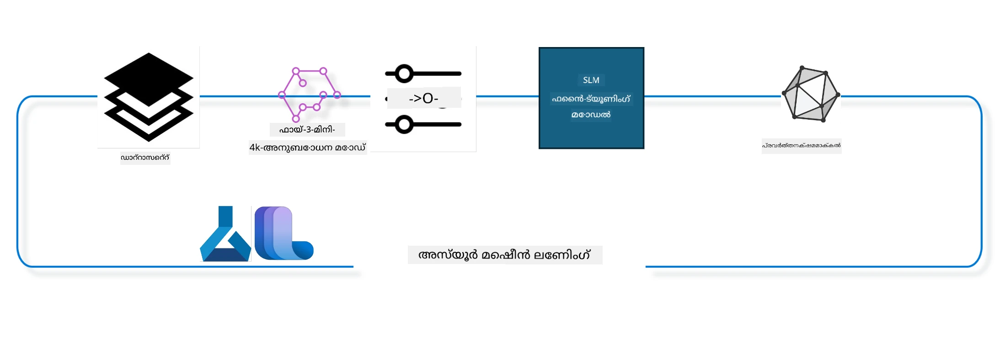

## Azure ML സിസ്റ്റം രജിസ്ട്രിയിൽ നിന്ന് ചാറ്റ്-കോംപ്ലീഷൻ ഘടകങ്ങൾ ഉപയോഗിച്ച് മോഡൽ ഫൈൻ-ട്യൂൺ ചെയ്യുന്നത് എങ്ങനെ

ഈ ഉദാഹരണത്തിൽ, ultrachat_200k ഡാറ്റാസെറ്റ് ഉപയോഗിച്ച് 2 ആളുകൾ തമ്മിലുള്ള സംവാദം പൂർത്തിയാക്കാൻ Phi-3-mini-4k-instruct മോഡൽ ഫൈൻ-ട്യൂൺ ചെയ്യുന്നതാണ് ചെയ്യുന്നത്.



ഈ ഉദാഹരണം Azure ML SDKയും Pythonഉം ഉപയോഗിച്ച് ഫൈൻ ട്യൂണിംഗ് എങ്ങനെ നടത്തണമെന്നും, തുടർന്ന് ഫൈൻ ട്യൂൺ ചെയ്ത മോഡൽ ഓൺലൈൻ എന്റ്പോയിന്റിലേക്ക് വിനിയോഗിച്ച് realtime ഇൻഫറൻസ് എങ്ങനെ നടത്തണമെന്നും കാണിക്കും.

### പരിശീലന ഡാറ്റ

ultrachat_200k ഡാറ്റാസെറ്റ് ഉപയോഗിക്കും. ഇത് UltraChat ഡാറ്റാസെറ്റിന്റെ شدتമായി ഫിൽട്ടർ ചെയ്ത ഒരു പതിപ്പാണ്, Zephyr-7B-β എന്ന 7b കൂടുകളുള്ള state-of-the-art chat മോഡൽ ട്രെയിൻ ചെയ്യാൻ ഉപയോഗിച്ചത്.

### മോഡൽ

Phi-3-mini-4k-instruct മോഡൽ ഉപയോഗിച്ച് ചാറ്റ്-കോംപ്ലീഷൻ ടാസ്കിനായി മോഡൽ എങ്ങനെ ഫൈൻട്യൂൺ ചെയ്യാമെന്ന് കാണിക്കും. നിങ്ങൾ ഈ നോട്ട്‌ബുക്ക് ഒരു പ്രത്യേക മോഡൽ കാർഡിൽനിന്ന് തുറന്നിരിക്കുകയാണെങ്കിൽ, അതിന് പകരം ആ മോഡലിന്റെ പേര് മാറ്റണം.

### ടാസ്കുകൾ

- ഫൈൻ ട്യൂണിംഗിന് ഒരു മോഡൽ തിരഞ്ഞെടുക്കുക.
- പരിശീലന ഡാറ്റ തിരഞ്ഞെടുക്കുകയും പരിശോധിക്കുകയും ചെയ്യുക.
- ഫൈൻ ട്യൂണിംഗ് ജോബ് ക്രമീകരിക്കുക.
- ഫൈൻ ട്യൂണിംഗ് ജോബ് നടത്തുക.
- പരിശീലനവും മൂല്യനിർണയ മെത്രിക്സും പരിശോധിക്കുക.
- ഫൈൻ ട്യൂൺ ചെയ്ത മോഡൽ രജിസ്റ്റർ ചെയ്യുക.
- ഫൈൻ ട്യൂൺ മോഡൽ realtime ഇൻഫറൻസിനായി വിനിയോഗിക്കുക.
- ഉറവിടങ്ങൾ ശേഖരിക്കുക.

## 1. മുൻപ്രത്യാശകൾ ക്രമീകരിക്കുക

- ആശ്രിതങ്ങൾ ഇൻസ്റ്റാൾ ചെയ്യുക
- AzureML വർക്ക്സ്പേസുമായി ബന്ധിപ്പിക്കുക. കൂടുതൽ അറിയാൻ set up SDK authentication കാണുക. താഴെ <WORKSPACE_NAME>, <RESOURCE_GROUP> ഉം <SUBSCRIPTION_ID> ഉം മാറ്റുക.
- azureml സിസ്റ്റം രജിസ്ട്രിയുമായി ബന്ധിപ്പിക്കുക
- ഒരു ഐച്ഛിക പരീക്ഷണം പേര് സജ്ജമാക്കുക
- കംപ്യൂട്ട് പരിശോധിക്കുക അല്ലെങ്കിൽ സൃഷ്ടിക്കുക.

> [!NOTE]
> ഒരു GPU നോഡിൽ ഒന്നിലധികം GPU കാർഡുകൾ ഉണ്ടാകാം. ഉദാഹരണത്തിന്, Standard_NC24rs_v3 ന്റെ ഒരു നോഡിൽ 4 NVIDIA V100 GPUകൾ ഉണ്ട്, Standard_NC12s_v3 ൽ 2 NVIDIA V100 GPUകൾ ഉണ്ട്. ഈ വിവരങ്ങൾക്കായി ഡോക്സുകൾ കാണുക. ഓരോ നോഡിലുമുള്ള GPU കാർഡുകളുടെ എണ്ണം param gpus_per_node ൽ ക്രമീകരിച്ചിരിക്കുന്നു. ശരിയായി ക്രമീകരിക്കുമ്പോൾ നോഡിലെ എല്ലാ GPUകളും ഉപയോഗിക്കപ്പെടും. ശുപാർശ ചെയ്യുന്ന GPU കംപ്യൂട്ട് SKUs ഇവിടെയും ഇവിടെയും ലഭ്യമാണ്.

### Python ലൈബ്രറികൾ

താഴെ കൊടുത്ത സെൽ ഉപയോഗിച്ച് ആശ്രിതങ്ങൾ ഇൻസ്റ്റാൾ ചെയ്യുക. പുതിയ പരിസരത്ത് ഈ ഘട്ടം ഐച്ഛികമല്ല.

```bash
pip install azure-ai-ml
pip install azure-identity
pip install datasets==2.9.0
pip install mlflow
pip install azureml-mlflow
```

### Azure ML- ilə ആശയവിനിമയം

1. ഈ Python സ്ക്രിപ്റ്റ് Azure Machine Learning (Azure ML) സേവനത്തോടൊപ്പം പ്രവർത്തിക്കുന്നു. ഇതിന്റെ വിശദാംശങ്ങൾ:

    - azure.ai.ml, azure.identity, azure.ai.ml.entities പാക്കേജുകളിൽ നിന്നും ആവശ്യമായ മോഡ്യൂളുകൾ ഇറക്കുമതി ചെയ്യുന്നു. കൂടാതെ time മോഡ്യൂളും ഇറക്കുമതി ചെയ്യുന്നു.

    - DefaultAzureCredential() ഉപയോഗിച്ച് ഓട്ടന്റിക്കേഷൻ ശ്രമിക്കുന്നു. ഇത് Azure ക്ലൗഡിൽ പ്രവർത്തിക്കുന്ന അപ്ലിക്കേഷനുകൾ തുടക്കം കുറിക്കാൻ എളുപ്പമുള്ള ഓട്ടന്റിക്കേഷൻ അനുഭവമാണ്. അത് പരാജയപ്പെട്ടാൽ, interactive login prompt നൽകുന്ന InteractiveBrowserCredential() രണ്ടാം വഴി ഉപയോഗിക്കുന്നു.

    - തുടർന്ന് MLClient എന്ന എൻസ്റ്റന്റ് from_config മേധിത്വത്തിൽ സൃഷ്ടിക്കാൻ ശ്രമിക്കുന്നു, ഇത് ഡിഫോൾട്ട് config ഫയലിൽ നിന്നാണ് പാരായണം ചെയ്യുന്നത് (config.json). പരാജയപ്പെട്ടാൽ subscription_id, resource_group_name, workspace_name കൊടുക്കിക്കൊണ്ട് MLClient സൃഷ്ടിക്കുന്നു.

    - azureml എന്ന് പേരുള്ള Azure ML രജിസ്ട്രിക്കായി മറ്റൊരു MLClient സൃഷ്ടിക്കുന്നു. മോഡലുകൾ, ഫൈൻ-ട്യൂണിംഗ് പൈപ്പ്‌ലൈൻ, പരിസ്ഥിതികൾ ഇവിടെ സൂക്ഷിച്ചിരിക്കുന്നു.

    - experiment_name “chat_completion_Phi-3-mini-4k-instruct” ആയി സജ്ജമാക്കുന്നു.

    - സജ്ജമായ ഒരു timestamp സ്രഷ്ടിക്കുന്നു, ഇപ്പോഴത്തെ സമയം സെക്കൻഡുകളിൽ എന്ന ഫ്ലോട്ടിങ്ങ് പോയിന്റ് നമ്പർ ഇന്റേജറാക്കി മാറ്റി, അവസാനത്തിൽ സ്ട്രിംഗാക്കി മാറ്റുന്നു. ഇത്തരമൊരു ടൈംസ്റ്റാമ്പ് യുണീക്ക് പേരുകളും പതിപ്പുകളും സൃഷ്ടിക്കാൻ ഉപയോഗിക്കാം.

    ```python
    # Azure ML ഉം Azure Identity ഉം നിന്നുള്ള ആവശ്യമായ മൊഡ്യൂളുകൾ Import ചെയ്യുക
    from azure.ai.ml import MLClient
    from azure.identity import (
        DefaultAzureCredential,
        InteractiveBrowserCredential,
    )
    from azure.ai.ml.entities import AmlCompute
    import time  # time മോഡ്യൂൾ import ചെയ്യുക
    
    # DefaultAzureCredential ഉപയോഗിച്ച് authentication ശ്രമിക്കുക
    try:
        credential = DefaultAzureCredential()
        credential.get_token("https://management.azure.com/.default")
    except Exception as ex:  # DefaultAzureCredential പരാജയപ്പെടുന്ന പക്ഷം, InteractiveBrowserCredential ഉപയോഗിക്കുക
        credential = InteractiveBrowserCredential()
    
    # ഡിഫോൾട്ട് config ഫയൽ ഉപയോഗിച്ച് MLClient ഇൻസ്റ്റൻസ് സൃഷ്ടിക്കാൻ ശ്രമിക്കുക
    try:
        workspace_ml_client = MLClient.from_config(credential=credential)
    except:  # അത് പരാജയപ്പെടുമ്പോൾ, വിശദാംശങ്ങൾ മാനുവൽ ആയി നൽകി MLClient ഇൻസ്റ്റൻസ് സൃഷ്ടിക്കുക
        workspace_ml_client = MLClient(
            credential,
            subscription_id="<SUBSCRIPTION_ID>",
            resource_group_name="<RESOURCE_GROUP>",
            workspace_name="<WORKSPACE_NAME>",
        )
    
    # "azureml" എന്ന പേരിലുള്ള Azure ML രജിസ്ട്രിക്കായുള്ള മറ്റൊരു MLClient ഇൻസ്റ്റൻസ് സൃഷ്ടിക്കുക
    # ഈ രജിസ്ട്രിയാണ് മോഡലുകൾ, ഫൈൻ-ട്യൂണിംഗ് പൈപ്പ്‌ലൈൻകൾ, പരിസരങ്ങൾ എന്നിവ സംഭരിക്കുന്ന സ്ഥലം
    registry_ml_client = MLClient(credential, registry_name="azureml")
    
    # പരീക്ഷണത്തിന്റെ പേര് സജ്ജീകരിക്കുക
    experiment_name = "chat_completion_Phi-3-mini-4k-instruct"
    
    # പേരുകൾക്കും വേർഷനുകൾക്കും വേണമെങ്കിലും അത്യന്തം സവിശേഷമായ ഒരു ടൈംസ്റ്റാമ്പ് സൃഷ്ടിക്കുക
    timestamp = str(int(time.time()))
    ```

## 2. ഫൈൻ-ട്യൂണിംഗിന് അടിസ്ഥാന മോഡൽ തിരഞ്ഞെടുക്കുക

1. Phi-3-mini-4k-instruct 3.8B പാരാമീറ്റർ‌സ്, നീലവരു ഉളള, ഔപ്പൺ മോഡലാണ്. Phi-2 ഉപയോഗിച്ച ഡാറ്റാസെറ്റുകളിൽ അടിസ്ഥാനപ്പെടുത്തി നിർമ്മിച്ചതാണ്. മോഡൽ Phi-3 കുടുംബത്തിലെതാണ്. മിനി പതിപ്പിൽ 4K, 128K എന്ന രണ്ടു വെരിയന്റുകളുണ്ട്, അവ похуденияക്കോ આધാരമായ ടോകൺ കണ്ടക്സ്റ്റ്-ലെംഗ്ത്സാണ്, ഫൈൻ ട്യൂൺ ചെയ്യണം ഞങ്ങളുടെ പ്രത്യേക ഉദ്ദേശ്യത്തിനായി. AzureML Studioയിൽ Model Catalog ൽ ഈ മോഡലുകൾ ചാറ്റ്-കോംപ്ലീഷൻ ടാസ്ക് ഫിൽട്ടർ ചെയ്തും കാണാം. ഈ ഉദാഹരണത്തിൽ Phi-3-mini-4k-instruct മോഡൽ ഉപയോഗിക്കുന്നു. നിങ്ങൾ വ്യത്യസ്ത മോഡലിന് ഈ നോട്ട്‌ബുക്ക് തുറന്നാൽ മോഡൽ നാമവും പതിപ്പും അനുയോജ്യമായി മാറ്റുക.

> [!NOTE]
> മോഡലിന്റെ id പ്രോപ്പർട്ടി. ഫൈൻ ട്യൂണിംഗ് ജോബിന് ഇൻപുട്ടായി ഇത് നൽകും. ഇത് AzureML Studio Model Catalog മോഡൽ വിശദാംശങ്ങളിൽ Asset ID ഫീൽഡ് ആയി ലഭ്യമാണ്.

2. ഈ Python സ്ക്രിപ്റ്റ് Azure Machine Learning (Azure ML) സേവനത്തോടൊപ്പം പ്രവർത്തിക്കുന്നു. ഇതിന്റെ വിശദാംശങ്ങൾ:

    - model_name "Phi-3-mini-4k-instruct" ആയി സജ്ജമാക്കുന്നു.

    - Azure ML രജിസ്ട്രിയിലുള്ള registry_ml_client.models.get മെത്ത് സെക്ഷൻ ഉപയോ​ഗിച്ച് ഈ പേരുള്ള മോഡലിന്റെ ഏറ്റവും പുതിയ പതിപ്പ് തിരയുന്നു. get() method രണ്ട്_argument_method ആണ്, മോഡലിന്റെ പേര്, തുടർന്ന് ലേബൽ (latest എൻട്രി).

    - fine-tuning USERക്ക് ഉപയോഗിക്കുന്ന മോഡലിന്റെ പേര്, പതിപ്പ്, id സന്ദേശമായി consoleൽ പ്രിന്റ് ചെയ്യുന്നുണ്ട്. ഫോർമാറ്റ് method ഓർമ്മിപ്പിച്ച മൂല്യങ്ങൾ സ്ട്രിംഗിലേക്ക് ചേർക്കാൻ ഉപയോഗിക്കുന്നു. name, version, id foundation_model പ്രോപ്പർട്ടികളിൽ നിന്നെടുത്തതാണ്.

    ```python
    # മോഡലിന്റെชื่อ സജ്ജീകരിക്കുക
    model_name = "Phi-3-mini-4k-instruct"
    
    # Azure ML രജിസ്ട്രിയിൽ നിന്ന് മോഡലിന്റെ ഏറ്റവും പുതിയ പതിപ്പ് ലഭിക്കുക
    foundation_model = registry_ml_client.models.get(model_name, label="latest")
    
    # മോഡലിന്റെชื่อ, പതിപ്പ്, ഐഡി പ്രിന്റ് ചെയ്യുക
    # ട്രാക്കിങ്ങിനും ഡീബഗിംഗിനും ഈ വിവരങ്ങൾ ഉപയോഗപ്രദമാണ്
    print(
        "\n\nUsing model name: {0}, version: {1}, id: {2} for fine tuning".format(
            foundation_model.name, foundation_model.version, foundation_model.id
        )
    )
    ```

## 3. ജോബിനായി ഉപയോഗിക്കുന്ന കംപ്യൂട്ട് സൃഷ്ടിക്കുക

ഫൈൻട്യൂൺ ജോബ് GPU കംപ്യൂട്ട് മാത്രമേ ഉപയോഗിക്കുകയുള്ളൂ. കംപ്യൂട്ടിന്റെ വലുപ്പം മോഡലിന്റെ വലിപ്പത്തിനനുസരിച്ച് വ്യത്യാസപ്പെടും, ശരിയായ കംപ്യൂട്ട് തിരഞ്ഞെടുക്കാൻ പ്രയാസം ഉണ്ടാവാം. ഈ സെല്ലിൽ ഉപയോക്താവിനെ ശരിയായ കംപ്യൂട്ട് തിരഞ്ഞെടുക്കാൻ സഹായിക്കുന്നു.

> [!NOTE]
> താഴെപ്പറയുന്ന കംപ്യൂട്ടുകൾ ഏറ്റവും ഓപ്റ്റിമൈസ് ചെയ്ത കോൺഫിഗറേഷനും കൂടിയാണ്. കോൺഫിഗറേഷൻ മാറ്റം Cuda Out Of Memory error ഉണ്ടാക്കാം. അന്നാവശ്യമായാൽ വലുതായ കംപ്യൂട്ട് സൈസിലേക്ക് അപ്‌ഗ്രേഡ് ചെയ്യാൻ ശ്രമിക്കുക.

> [!NOTE]
> താഴെ compute_cluster_size തിരഞ്ഞെടുക്കുമ്പോൾ കംപ്യൂട്ട് നിങ്ങളുടെ resource group-ൽ ലഭ്യമാണെന്ന് ഉറപ്പാക്കുക. ലഭ്യമാകുന്നില്ലെങ്കിൽ കംപ്യൂട്ട് റിസോഴ്‌സുകൾ പ്രവേശനത്തിന് അപേക്ഷിക്കാവുന്നതാണ്.

### ഫൈൻ ട്യൂണിംഗിന് മോഡൽ പിന്തുണ പരിശോധിക്കൽ

1. ഈ Python സ്ക്രിപ്റ്റ് Azure Machine Learning (Azure ML) മോഡലിനോട് പ്രവർത്തിക്കുന്നു. ദീർഘമായി:

    - ast മോഡ്യൂൾ ഇറക്കുമതി ചെയ്യുന്നു, Python റോട്ട് സൂചകങ്ങൾ സുസ്ഥിരമായി മാനിപ്പുലേറ്റ് ചെയ്യാൻ.

    - foundation_model ഓബ്ജക്ടിന് finetune_compute_allow_list എന്ന ടാഗ് ഉണ്ടോ എന്ന് പരിശോധിക്കുന്നു. Azure ML ടാഗുകൾ key-value ആയിരിക്കും, മോഡലുകൾ സേർച്ച് ചെയ്യാനും ഫിൽട്ടർ ചെയ്യാനും ഉപയോഗിക്കുന്നു.

    - finetune_compute_allow_list ഉണ്ട് എങ്കിൽ ast.literal_eval ഉപയോഗിച്ച് ടാഗിന്റെയിൽ അടങ്ങിയുള്ള value (string) Python list ആയി മാറ്റുന്നു. അത് computes_allow_list ൽ സൂക്ഷിക്കുന്നു. തുടർന്ന് കംപ്യൂട്ട് അത് ലിസ്റ്റിൽ നിന്നും തിരഞ്ഞെടുക്കണമെന്നും സന്ദേശം പ്രിന്റ് ചെയ്യുന്നു.

    - finetune_compute_allow_list ഇല്ലെങ്കിൽ computes_allow_list None ആക്കി സജ്ജമാക്കുന്നു, ടാഗ് ഇല്ലെന്ന വിവരം പ്രിന്റ് ചെയ്യുന്നു.

    - സംക്ഷിപ്തം, സ്ക്രിപ്റ്റ് മോഡലിന്റെ ടാഗിൽ ഈ പ്രത്യേക ടാഗ് പരിശോധിച്ച് ലിസ്റ്റായി പരിവർത്തനം ചെയ്ത് ഉപയോക്താവിനുള്ള ഫീഡ്‌ബാക്ക് നൽകുന്നു.

    ```python
    # Python സംഖ്യാത്മക സിന്താക്സ് വ്യാകരണം മരങ്ങളാണ് പ്രോസസ്സ് ചെയ്യുന്നതിന് ഫംഗ്ഷനുകൾ നൽകുന്ന ast മോഡ്യൂൾ ഇറക്കുമതി ചെയ്യുക
    import ast
    
    # മോഡലിന്റെ ടാഗുകളിൽ 'finetune_compute_allow_list' ടാഗ് ഉണ്ടോ എന്ന് പരിശോധിക്കുക
    if "finetune_compute_allow_list" in foundation_model.tags:
        # ടാഗ് ഉണ്ടെങ്കിൽ, ast.literal_eval ഉപയോഗിച്ച് ടാഗിന്റെ മൂല്യം (ഒരു സ്ട്രിങ്) സുരക്ഷിതമായി Python ലിസ്റ്റായി പാഴ്‌സുചെയ്യുക
        computes_allow_list = ast.literal_eval(
            foundation_model.tags["finetune_compute_allow_list"]
        )  # സ്ട്രിങ് python ലിസ്റ്റിലാക്കി മാറ്റുക
        # ലിസ്റ്റിൽ നിന്ന് ഒരു കംപ്യൂട്ട് സൃഷ്‌ടിക്കേണ്ടതായി ഒരു സന്ദേശം പ്രിന്‍റ് ചെയ്യുക
        print(f"Please create a compute from the above list - {computes_allow_list}")
    else:
        # ടാഗ് ഇല്ലെങ്കിൽ, computes_allow_list None ആക്കി സജ്ജീകരിക്കുക
        computes_allow_list = None
        # 'finetune_compute_allow_list' ടാഗ് മോഡലിന്റെ ടാഗുകളുടെ ഭാഗമല്ല എന്ന സന്ദേശം പ്രിന്‍റ് ചെയ്യുക
        print("`finetune_compute_allow_list` is not part of model tags")
    ```

### കംപ്യൂട്ട് ഇൻസ്റ്റൻസ് പരിശോധിക്കൽ

1. ഈ Python സ്ക്രിപ്റ്റ് Azure Machine Learning (Azure ML) സേവനത്തോടൊപ്പം കംപ്യൂട്ട് ഇൻസ്റ്റൻസിൽ വിവിധ പരിശോധനകൾ നടത്തുന്നു. വിശദാംശങ്ങൾ:

    - compute_clusterൽ സൂക്ഷിച്ചിരിക്കുന്ന പേരിൽ കംപ്യൂട്ട് ഇൻസ്റ്റൻസ് Azure ML വർക്ക്സ്പേസിൽ നിന്ന് തിരഞ്ഞെടുത്തു, അതിന്റെ provisioning state "failed" ആണെങ്കിൽ ValueError ഉയരുന്നു.

    - computes_allow_list None അല്ലെങ്കിൽ, ലിസ്റ്റിലുള്ള എല്ലാ സൈസുകളും lowercase ആക്കുംയും, നിലവിലെ കംപ്യൂട്ടിന്റെ സൈസ് ലിസ്റ്റിലുണ്ടോ എന്ന് പരിശോധിക്കും. അല്ല എങ്കിൽ ValueError ഉയരുന്നതാണ്.

    - computes_allow_list None ആണെങ്കിൽ, കംപ്യൂട്ട് VM സൈസ് unsupported GPU VM size ലിസ്റ്റിൽ ഉണ്ടോ എന്ന് പരിശോധിക്കും; ഉണ്ടെങ്കിൽ ValueError ഉയരും.

    - വർക്ക്സ്പേസിലുള്ള എല്ലാ ലഭ്യമായ കംപ്യൂട്ട് സൈസുകളുടെ ലിസ്റ്റ് വീക്ഷിച്ച് നിലവിലെ കംപ്യൂട്ട് അഭോക്തൃത്തിയിലുള്ളGpu എണ്ണം കണ്ടെത്തി gpu_count_found വാല്യു സജ്ജമാക്കും.

    - gpu_count_found True ആണെങ്കിൽ GPUs എണ്ണ പ്രിന്റ് ചെയ്യുന്നു; False ആണെങ്കിൽ ValueError ഉയരും.

    - സംക്ഷേപം, സ്പെസിഫിക് കംപ്യൂട്ട് ഇൻസ്റ്റൻസിന് provisioning നിലവാരം, അളവ്, GPU എണ്ണം തുടങ്ങിയവ പരിശോധന നടത്തുന്നു.

    
    ```python
    # തെറ്റിന്റെ സന്ദേശം പ്രിന്റ് ചെയ്യുക
    print(e)
    # വർക്ക്സ്പേസിൽ കംപ്യൂട്ട് വലുപ്പം ലഭ്യമല്ലെങ്കിൽ ValueError ഉയർത്തുക
    raise ValueError(
        f"WARNING! Compute size {compute_cluster_size} not available in workspace"
    )
    
    # Azure ML വർക്ക്സ്പേസിൽ നിന്നുള്ള കംപ്യൂട്ട് ഇൻസ്റ്റൻസ് പുനരുദ്ധരിക്കുക
    compute = workspace_ml_client.compute.get(compute_cluster)
    # കംപ്യൂട്ട് ഇൻസ്റ്റൻസിന്റെ പ്രൊവിഷനിങ് നില "വിഫലമായിരിക്കുന്നു" എന്നാണോ എന്ന് പരിശോധിക്കുക
    if compute.provisioning_state.lower() == "failed":
        # പ്രൊവിഷനിങ് നില "വിഫലമായിരിക്കുന്നു" എങ്കിൽ ValueError ഉയർത്തുക
        raise ValueError(
            f"Provisioning failed, Compute '{compute_cluster}' is in failed state. "
            f"please try creating a different compute"
        )
    
    # computes_allow_list None അല്ലെന്നായി പരിശോധിക്കുക
    if computes_allow_list is not None:
        # computes_allow_list-ലെ എല്ലാ കംപ്യൂട്ട് വലുപ്പങ്ങളും küçükകേസ്-ലേക്ക് മാറ്റുക
        computes_allow_list_lower_case = [x.lower() for x in computes_allow_list]
        # കംപ്യൂട്ട് ഇൻസ്റ്റൻസിന്റെ വലിപ്പം computes_allow_list_lower_case-ൽ ഉണ്ടോ എന്ന് പരിശോധിക്കുക
        if compute.size.lower() not in computes_allow_list_lower_case:
            # കംപ്യൂട് ഇൻസ്റ്റൻസിന്റെ വലിപ്പം computes_allow_list_lower_case-ൽ ഇല്ലെങ്കിൽ ValueError ഉയർത്തുക
            raise ValueError(
                f"VM size {compute.size} is not in the allow-listed computes for finetuning"
            )
    else:
        # പിന്തുണയ്ക്കാത്ത GPU VM വലുപ്പങ്ങളുടെ ലിസ്റ്റ് നിർവചിക്കുക
        unsupported_gpu_vm_list = [
            "standard_nc6",
            "standard_nc12",
            "standard_nc24",
            "standard_nc24r",
        ]
        # കംപ്യൂട്ട് ഇൻസ്റ്റൻസിന്റെ വലിപ്പം unsupported_gpu_vm_list-ൽ ഉണ്ടോ എന്ന് പരിശോധിക്കുക
        if compute.size.lower() in unsupported_gpu_vm_list:
            # കംപ്യൂട്ട് ഇൻസ്റ്റൻസിന്റെ വലിപ്പം unsupported_gpu_vm_list-ൽ ഉണ്ടെങ്കിൽ ValueError ഉയർത്തുക
            raise ValueError(
                f"VM size {compute.size} is currently not supported for finetuning"
            )
    
    # കംപ്യൂട്ട് ഇൻസ്റ്റൻസിലെ GPU-കളുടെ എണ്ണം കണ്ടെത്തിയിട്ടുണ്ടോയെന്ന് പരിശോധിക്കാനുള്ള ഫ്ലാഗ് ആരംഭിക്കുക
    gpu_count_found = False
    # വർക്ക്സ്പേസിൽ ലഭ്യമായ എല്ലാ കംപ്യൂട്ട് വലുപ്പങ്ങളുടെ ലിസ്റ്റ് പുനരുദ്ധരിക്കുക
    workspace_compute_sku_list = workspace_ml_client.compute.list_sizes()
    available_sku_sizes = []
    # ലഭ്യമായ കംപ്യൂട്ട് വലുപ്പങ്ങളുടെ ലിസ്റ്റിൽ ലൂപ് നടത്തുക
    for compute_sku in workspace_compute_sku_list:
        available_sku_sizes.append(compute_sku.name)
        # കംപ്യൂട്ട് വലുപ്പത്തിന്റെ നാമം കംപ്യൂട്ട് ഇൻസ്റ്റൻസിന്റെ വലിപ്പവുമായി പൊരുത്തപ്പെടുന്നുണ്ടോ എന്ന് പരിശോധിക്കുക
        if compute_sku.name.lower() == compute.size.lower():
            # പൊരുത്തപ്പെടുന്നെങ്കിൽ ആ കംപ്യൂട്ട് വലുപ്പത്തിന് GPU-കളുടെ എണ്ണം പുനരുദ്ധരിച്ച് gpu_count_found=True ആക്കി മാറ്റുക
            gpus_per_node = compute_sku.gpus
            gpu_count_found = True
    # gpu_count_found=True ആണെങ്കിൽ കംപ്യൂട്ട് ഇൻസ്റ്റൻസിലെ GPU-കളുടെ എണ്ണം പ്രിന്റ് ചെയ്യുക
    if gpu_count_found:
        print(f"Number of GPU's in compute {compute.size}: {gpus_per_node}")
    else:
        # gpu_count_found=False ആണെങ്കിൽ ValueError ഉയർത്തുക
        raise ValueError(
            f"Number of GPU's in compute {compute.size} not found. Available skus are: {available_sku_sizes}."
            f"This should not happen. Please check the selected compute cluster: {compute_cluster} and try again."
        )
    ```

## 4. മോഡൽ ഫൈനട്യൂണിംഗ് ചെയ്യാനായി ഡാറ്റാസെറ്റ് തിരഞ്ഞെടുക്കുക

1. ultrachat_200k ഡാറ്റാസെറ്റ് ഉപയോഗിക്കുന്നു. ഡാറ്റാസെറ്റിന് നാല് പാർട്ടീഷനുകളുണ്ട്, Supervised fine-tuning (sft)ക്ക് അനുയോജ്യമായവ.
Generation ranking (gen). ഓരോ സ്‌പ്ലിറ്റിലുള്ള ഉദാഹരണങ്ങളുടെ എണ്ണം ഇപ്രകാരമാണ്:

    ```bash
    train_sft test_sft  train_gen  test_gen
    207865  23110  256032  28304
    ```

1. അടുത്തുള്ള സെല്ലുകൾ ഈ അടിസ്ഥാന വിവരങ്ങൾ ഫൈനട്യൂണിംഗിന് തയ്യാറാക്കുന്നു:

### ചില ഡാറ്റാ പംക്തികൾ ദൃശ്യവത്കരിക്കുക

ഈ സാമ്പിൾ വേഗത്തിൽ പ്രവർത്തിക്കേണ്ടതിനാൽ, train_sft, test_sft ഫയലുകളിൽ 5% മാത്രം സേവ് ചെയ്യുന്നു. അതിനാൽ ഫൈൻ ട്യൂൺ ചെയ്ത മോഡലിന്റെ കൃത്യത കുറവാകും, അതിനാൽ യഥാർത്ഥ ഉപയോഗത്തിന് ഉപദുഖകരം ആയിരിക്കും.
download-dataset.py ultrachat_200k ഡാറ്റാസെറ്റ് ഡൗൺലോഡ് ചെയ്ത് ഫൈനട്യൂൺ പൈപ്പ്‌ലൈൻ ഘടകങ്ങൾ ഉപയോഗിക്കാൻ അനുയോജ്യമായ ഫോർമാറ്റിലേക്ക് മാറ്റാൻ ഉപയോഗിക്കുന്നു. ഡാറ്റാസെറ്റ് വലുതായതിനാൽ ഇതിൽ പൂർണ്ണ ഡാറ്റയില്ല.

1. താഴെ കൊടുത്തുള്ള സ്ക്രിപ്റ്റ് 5% ഡാറ്റ മാത്രമാണ് ഡൗൺലോഡ് ചെയ്യുന്നത്. dataset_split_pc പാരാമീറ്റർ മാറ്റി ഇത് വർദ്ധിപ്പിക്കാം.

> [!NOTE]
> ചില ഭാഷാമോഡലുകൾ വ്യത്യസ്തമായ ഭാഷാ കോഡുകൾക്കൊപ്പം വരുകയും അങ്ങനെ ഡാറ്റാസെറ്റിലെ കോളം നാമങ്ങൾ അവനുസരിച്ച് വേണം.

1. ഇങ്ങനെ ഡാറ്റ കാണണം എന്നൊരു ഉദാഹരണം
ചാറ്റ്-കോംപ്ലീഷൻ ഡാറ്റാസെറ്റ് parquet ഫോർമാറ്റിലാണുള്ളത്, ഓരോ എൻട്രിയും താഴെ പറയുന്ന സ്‌കീമ ഉപയോഗിക്കുന്നു:

    - JSON (JavaScript Object Notation) ഡോക്യുമെന്റ് ആണ് ഇത്, ഡാറ്റ בינിമയത്തിന് വളരെ ജനപ്രിയമായ ഫോർമാറ്റ്. ഇത് കോഡ് അല്ല, ഡാറ്റ സൂക്ഷിക്കാൻ വഴിയാണ്. ഇവയുടെ ഘടന:

    - "prompt": ഇതിൽ ടെക്സ്റ്റായി ഒരു ടാസ്ക് അല്ലെങ്കിൽ AI അസിസ്റ്റന്റിനോട് ചോദിക്കുന്ന ചോദ്യം ഉൾക്കൊള്ളുന്നു.

    - "messages": സ്രോഡുള്ള അറെ ഒരു കോളക്ഷൻ. ഓരോ മെസേജും ഉപയോക്താവും AI അസിസ്റ്റന്റും തമ്മിലുള്ള സംഭാഷണത്തിൽ നിന്നാണ്. ഓരോ മെസേജിനും രണ്ട് ഫീൽഡുകൾ ഉണ്ട്:

    - "content": മെസേജിന്റെ ഉള്ളടക്കം
    - "role": അയച്ച വ്യക്തിയുടെ വേഷം വിവക്ഷിക്കുന്നു, "user" അല്ലെങ്കിൽ "assistant" ആകാം.
    - "prompt_id": വ്യക്തമായ പ്രോംപ്റ്റിൻറെ ഐഡന്റിഫയർ.

1. ഈ JSON ഡോക്യുമെന്റിൽ, ഒരു സംഭാഷണം പ്രതിപാദിക്കുന്നു, യുപയോഗകനാണ് dystopian കഥക് പ്രതിനായകനെ സൃഷ്ടിക്കാൻ AI അസിസ്റ്റന്റിനോട് ചോദിക്കുന്നത്. അസിസ്റ്റന്റ് മറുപടി നൽകുന്നു. തുടർന്നും യുപയോഗകൻ കൂടുതൽ വിശദീകരണം തേടുന്നു. അസിസ്റ്റന്റ് അതിന് സമ്മതിക്കുന്നു. മുഴുവൻ സംഭാഷണവും ഒരു പ്രത്യേക prompt id യിൽ ബന്ധിപ്പിച്ചിട്ടുണ്ട്.

    ```python
    {
        // The task or question posed to an AI assistant
        "prompt": "Create a fully-developed protagonist who is challenged to survive within a dystopian society under the rule of a tyrant. ...",
        
        // An array of objects, each representing a message in a conversation between a user and an AI assistant
        "messages":[
            {
                // The content of the user's message
                "content": "Create a fully-developed protagonist who is challenged to survive within a dystopian society under the rule of a tyrant. ...",
                // The role of the entity that sent the message
                "role": "user"
            },
            {
                // The content of the assistant's message
                "content": "Name: Ava\n\n Ava was just 16 years old when the world as she knew it came crashing down. The government had collapsed, leaving behind a chaotic and lawless society. ...",
                // The role of the entity that sent the message
                "role": "assistant"
            },
            {
                // The content of the user's message
                "content": "Wow, Ava's story is so intense and inspiring! Can you provide me with more details.  ...",
                // The role of the entity that sent the message
                "role": "user"
            }, 
            {
                // The content of the assistant's message
                "content": "Certainly! ....",
                // The role of the entity that sent the message
                "role": "assistant"
            }
        ],
        
        // A unique identifier for the prompt
        "prompt_id": "d938b65dfe31f05f80eb8572964c6673eddbd68eff3db6bd234d7f1e3b86c2af"
    }
    ```

### ഡാറ്റ ഡൗൺലോഡ് ചെയ്യുക

1. ഈ Python സ്ക്രിപ്റ്റ് download-dataset.py എന്ന ഹെൽപ്പർ സ്ക്രിപ്റ്റ് ഉപയോഗിച്ച് ഡാറ്റാസെറ്റ് ഡൗൺലോഡ് ചെയ്യാൻ ഉപയോഗിക്കുന്നു. വിശദാംശങ്ങൾ:

    - os മോഡ്യൂൾ ഇറക്കുമതി ചെയ്യുന്നു, ഇത് ഓപ്പറേറ്റിങ് സിസ്റ്റം ആശ്രിത ഫംഗ്ഷണാലിറ്റികൾ പരസ്യപ്പെടുത്തുന്നു.

    - os.system ഉപയോഗിച്ച് ഷെല്ലിൽ താഴെ പറയുന്ന argument കളോടെ download-dataset.py ഓടിക്കുന്നു: ഡാറ്റാസെറ്റ്: HuggingFaceH4/ultrachat_200k, ഡൗൺലോഡ് ഡയറക്ടറി: ultrachat_200k_dataset, ഡാറ്റാ വിഭജന ശതമാനം: 5. os.system കമാൻഡിന്റെ exit സ്റ്റാറ്റസ് exit_status വേരിയബിളിൽ സേവ് ചെയ്യുന്നു.

    - exit_status 0 അല്ലെങ്കിൽ, ഡാറ്റാസെറ്റ് ഡൗൺലോഡിൽ പിശക് ഉണ്ടായതായി Exception ഉയർത്തുന്നു.

    - മൊഴിപ്പെങ്ക എന്ന് പറഞ്ഞാൽ, ഹെൽപ്പർ സ്ക്രിപ്റ്റ് ഡാറ്റ ഡൗൺലോഡ് ചെയ്യാൻ ഓടിക്കുന്നു, പരാജയപ്പെട്ടാൽ പിശക് ഉയർത്തുന്നു.

    
    ```python
    # ഓപ്പറേറ്റിംഗ് സിസ്റ്റം ആശ്രിത ഫങ്ഷനാലിറ്റി ഉപയോഗിക്കുന്ന ഒരു മാർഗം നൽകുന്ന os മോഡ്യൂൾ ഇറക്കുമതി ചെയ്യുക
    import os
    
    # os.system ഫംഗ്ഷൻ ഉപയോഗിച്ച് ഷെല്ലിൽ സ്പെസിഫിക് കമാൻഡ്-ലൈൻ ആArguments ഉപയോഗിച്ച് download-dataset.py സ്ക്രിപ്റ്റ് പ്രവർത്തിപ്പിക്കുക
    # ആArguments ഡാറ്റാസെറ്റ് (HuggingFaceH4/ultrachat_200k) ഡൗൺലോഡ് ചെയ്യാനുള്ളത്, ഡൗൺലോഡ് ചെയ്യാനുള്ള ഡയറക്ടറി (ultrachat_200k_dataset), ഡാറ്റാസെറ്റ് വിഭജിക്കാനുള്ള ശതമാനം (5) എന്നിവ വ്യക്തമാക്കുന്നു
    # os.system ഫങ്ഷൻ പ്രവർത്തിപ്പിച്ച കമാൻഡിന്റെ എക്സിറ്റ് സ്റ്റാറ്റസ് վերադարձിക്കുന്നു; ഈ സ്റ്റാറ്റസ് exit_status എന്ന വാരിയബിളിൽ സേവ് ചെയ്യുന്നു
    exit_status = os.system(
        "python ./download-dataset.py --dataset HuggingFaceH4/ultrachat_200k --download_dir ultrachat_200k_dataset --dataset_split_pc 5"
    )
    
    # exit_status 0 അല്ലെങ്കിൽ എന്ന് പരിശോധിക്കുക
    # യൂണിക്‌സ് പോലുള്ള ഓപ്പറേറ്റിംഗ് സിസ്റ്റങ്ങളിൽ, 0 എക്സിറ്റ് സ്റ്റാറ്റസ് സാധാരണമെന്ന സൂചിപ്പിക്കുന്നു, മറ്റ് ഏതെങ്കിലും സംഖ്യ എറർ സൂചിപ്പിക്കുന്നു
    # exit_status 0 അല്ലെങ്കിൽ Exception ഉയർത്തുക, ഡാറ്റാസെറ്റും ഡൗൺലോഡ് ചെയ്യുന്നതിൽ പിശക് ഉണ്ടെന്ന് സൂചിപ്പിക്കുന്ന സന്ദേശത്തോടെ
    if exit_status != 0:
        raise Exception("Error downloading dataset")
    ```

### ഡാറ്റ DataFrame ലേക്ക് ലോഡ് ചെയ്യുന്നു
1. ഈ Python സ്ക്രിപ്റ്റ് ഒരു JSON Lines ഫയൽ pandas DataFrame-ലേക്ക് ലോഡ് ചെയ്യുകയും ആദ്യ 5 വരികൾ പ്രദർശിപ്പിക്കുകയും ചെയ്യുന്നു. ഇതിന്റെ പ്രവർത്തന വിശദീകരണം ചുവടെ നൽകിയിരിക്കുന്നു:

    - അത് pandas ലൈബ്രറി ഇറക്കുമതി ചെയ്യുന്നു, അത്ൊരു ശക്തമായ ഡാറ്റ മാനിപ്പുലേഷൻ കൂടാതെ വിശകലന ലൈബ്രറിയാണ്.

    - pandas' ഡിസ്പ്ലേ ഓപ്ഷനുകളുടെ പരമാവധി കോളം വീതി 0 ആക്കി സജ്ജമാക്കുന്നു. അതായത് DataFrame പ്രിന്റ് ചെയ്യുമ്പോൾ ഓരോ കോളത്തിന്റെയും പൂർണ്ണ ടെക്സ്റ്റും ക്ഷീരവിമർശം കൂടാതെ പ്രദർശിപ്പിക്കും.

    - pd.read_json ഫംഗ്ഷൻ ഉപയോഗിച്ച് ultrachat_200k_dataset ഡയറക്ടറിയിലെ train_sft.jsonl ഫയൽ DataFrame-ലേക്ക് ലോഡ് ചെയ്യുന്നു. lines=True ആഗ്യൂമെന്റ് ഫയൽ JSON Lines ഫോർമാറ്റിൽ ഉള്ളതായി സൂചിപ്പിക്കുന്നു, ഇത് ഓരോ വരിയും സ്വതന്ത്ര JSON ഒബ്ജക്റ്റ് ആണെന്ന് കാണിക്കുന്നു.

    - head മെത്തഡ് ഉപയോഗിച്ച് DataFrame-ന്റെ ആദ്യ 5 വരികൾ പ്രദർശിപ്പിക്കുന്നു. DataFrame-ലുള്ള വരികള്‍ 5 ലളിതംകാണുമെങ്കിൽ അവ എല്ലാം പ്രദർശിപ്പിക്കും.

    - സമാപനത്തിൽ, ഈ സ്ക്രിപ്റ്റ് JSON Lines ഫയൽ ഒരു DataFrame-ലേക്ക് ലോഡ് ചെയ്യുകയും ആരംഭത്തിലെ 5 വരികൾ മുഴുവൻ കോളം ടെക്സ്റ്റോടുകൂടി പ്രദർശിപ്പിക്കുകയും ചെയ്യുന്നത് ആണ്.
    
    ```python
    # ശക്തമായ ഡാറ്റ മാനിപുലേഷൻ, വിശകലന ലൈബ്രറിയായ പാൻഡാസ് ലൈബ്രറി ഇറക്കുമതി ചെയ്യുക
    import pandas as pd
    
    # പാൻഡാസിന്റെ പ്രദർശന ഓപ്ഷനുകൾക്കുള്ള പരമാവധി കോളം വീതി 0 ആയി സജ്ജീകരിക്കുക
    # ഡാറ്റാഫ്രേം പ്രിന്റ് ചെയ്യുമ്പോൾ ഓരോ കോളത്തിന്റെയും പൂർണ്ണ വാചകം മുറിച്ചവാതാകാതെ പ്രദർശിപ്പിക്കും എന്നതാണ് ഇതിന്റെ അർത്ഥം
    pd.set_option("display.max_colwidth", 0)
    
    # ultrachat_200k_dataset ഡയറക്ടറിയിലുള്ള train_sft.jsonl ഫയൽ ഡാറ്റാഫ്രേമിലേക്ക് ലോഡ് ചെയ്യാൻ pd.read_json ഫംഗ്ഷൻ ഉപയോഗിക്കുക
    # lines=True അർഗുമെന്റ് ഫയൽ JSON ലൈൻസ് ഫോർമാറ്റിൽ ആണെന്ന് സൂചിപ്പിക്കുന്നു, ഓരോ വരിയും വേറെ JSON ഒബ്ജക്റ്റാണ്
    df = pd.read_json("./ultrachat_200k_dataset/train_sft.jsonl", lines=True)
    
    # ഡാറ്റാഫ്രേമിന്റെ ആദ്യ 5 വരി പ്രദർശിപ്പിക്കാൻ head മാർഗം ഉപയോഗിക്കുക
    # ഡാറ്റാഫ്രേമിലെയും വരികൾ 5-ലേക്കാൾ കുറവാണെങ്കിൽ അവയുടെ മുഴുവൻ വരികളും പ്രദർശിപ്പിക്കും
    df.head()
    ```

## 5. മ_del fine tuning ജോബ് മോഡൽ മ_del ഡാറ്റ ഇൻപുട്ടുകളായി ഉപയോഗിച്ച് സമർപ്പിക്കുക

ചാറ്റ്-കമ്പ്ലീഷൻ പൈപ്പ്‌ലൈൻ ഘടകം ഉപയോഗിക്കുന്ന ജോബ് സൃഷ്ടിക്കുക. ഫൈൻ ട്യൂണിംഗിന് പിന്തുണയുള്ള എല്ലാ പാരാമീറ്ററുകളെക്കുറിച്ചും കൂടുതൽ അറിയുക.

### ഫൈൻട്യൂൺ പാരാമീറ്ററുകൾ നിർവചിക്കുക

1. ഫൈൻട്യൂൺ പാരാമീറ്ററുകൾ 2 വിഭാഗങ്ങളായി വിഭജിക്കാം - പരിശീലന പാരാമീറ്ററുകൾ, പ്രാസെസ്സിംഗ് പാരാമീറ്ററുകൾ

1. പരിശീലന പാരാമീറ്ററുകൾ പരിശീലനവുമായി ബന്ധപ്പെട്ട ഘടകങ്ങൾ നിർവചിക്കുന്നു, ഉദാഹരണത്തിന് -

    - ഉപയോഗിക്കേണ്ട оптимызаർ, ഷെഡ്യൂളർ
    - ഫൈൻട്യൂൺ മെച്ചപ്പെടുത്താൻ എന്ത് മെത്രിക്ക് ഉപയോഗിക്കും
    - പരിശീലന ഘട്ടങ്ങൾ, ബാച്ച് വലുപ്പം എന്നിവയും
    - പ്രാസെസ്സിംഗ് പാരാമീറ്ററുകൾ GPU മെമ്മറി ലളിതമാക്കാനും കംപ്യൂട്ട് റിസോഴ്സ് കാര്യക്ഷമമായി ഉപയോഗിക്കാനും സഹായിക്കും.

1. താഴെ കൊടുത്തിരിക്കുന്നവ ഈ വിഭാഗത്തിനു gehören ചെയ്യുന്നു. പ്രാസെസ്സിംഗ് പാരാമീറ്ററുകൾ ഓരോ മോഡലിനുമുള്ള വ്യത്യാസങ്ങൾ കൈകാര്യം ചെയ്യുന്നതിനായി മോഡലോടൊപ്പം പാക്ക് ചെയ്തിരിക്കുന്നു.

    - Deepspeed, LoRA സജീവമാക്കുക
    - മിശ്ര സങ്കീർണ്ണത പരിശീലനം സജീവമാക്കുക
    - മൾട്ടി-നോഡ് പരിശീലനം സജീവമാക്കുക

> [!NOTE]
> സൂപ്പർവൈസ്ഡ് ഫൈൻട്യൂണിംഗിലൂടെ_ALIGNMENT_ നഷ്ടപ്പെടാനോ കഠിനമായ മറക്കലോ ഉണ്ടാകാം. ഈ പ്രശ്നം പരിശോധിക്കുകയും ഫൈൻട്യൂൺ ചെയ്തശേഷം ALIGNMENT ഘട്ടം നടത്തുകയും ചെയ്യാൻ ഞങ്ങൾ ശുപാർശ ചെയ്യുന്നു.

### ഫൈൻട്യൂൺ പാരാമീറ്ററുകൾ

1. ഈ Python സ്ക്രിപ്റ്റ് മെഷീൻ ലേണിംഗ് മോഡൽ ഫൈൻട്യൂണിംഗിനുള്ള പാരാമീറ്ററുകള്‍ സജ്ജീകരിക്കുന്നു. കടപ്പാട് ചുവടെ:

    - നിശ്കർഷിത പരിശീലന പാരാമീറ്ററുകൾ സജ്ജീകരിക്കുന്നു, ഉദാഹരണത്തിന് ഘട്ടങ്ങളുടെ എണ്ണം, ട്രെയ്‌നി പാടുകൾക്കും വിലയിരുത്തലിനും ബാച്ച് വലുപ്പം, പഠന നിരക്കും ലേണിംഗ് റേറ്റ് ഷെഡ്യൂളർ തരം.

    - നിശ്കർഷിത പ്രാസെസ്സിംഗ് പാരാമീറ്ററുകൾ സജ്ജീകരിക്കുന്നു, ഉദാഹരണത്തിന് Layer-wise Relevance Propagation (LoRa), DeepSpeed പ്രയോഗം, DeepSpeed ഘട്ടം.

    - പരിശീലനവും പ്രാസെസ്സിംഗും പാരാമീറ്ററുകളും finetune_parameters എന്ന ഏക ഡിക്ഷണറിയായി ചേർക്കുന്നു.

    - foundation_model-ന് മോഡൽ-സ്പെസിഫിക് നിശ്ചിത പാരാമീറ്ററുകൾ ഉണ്ടോ എന്ന് പരിശോധിക്കുന്നു. ഉണ്ടെങ്കിൽ, ഒരു മുന്നറിയിപ്പ് പ്രിന്റ് ചെയ്ത്, ആ മോഡൽ-സ്പെസിഫിക് നിശ്ചിത പാരാമീറ്ററുകൾ finetune_parameters ഡിക്ഷണറിയിൽ അപ്ഡേറ്റ് ചെയ്യുന്നു. ast.literal_eval ഫംഗ്ഷൻ ഈ പാരാമീറ്ററുകൾ സ്റ്റ്രിംഗ് മുതൽ Python ഡിക്ഷണറിയായി മാറ്റാനായി ഉപയോഗിക്കുന്നു.

    - റൺ-നുള്ള അവസാനം ഉപയോഗിക്കാനുള്ള ഫൈന്ട്യൂൺ പാരാമീറ്ററുകളുടെ സജ്ജീകരണം പ്രിന്റ് ചെയ്യുന്നു.

    - മാതൃകയായി, ഈ സ്ക്രിപ്റ്റ് ഫൈന്ട്യൂൺ പാരാമീറ്ററുകൾ സജ്ജീകരിച്ച് പ്രദർശിപ്പിക്കുന്നു, മോഡൽ-സ്പെസിഫിക് ഡിഫോൾട്ടുകൾ ഉപയോഗിച്ച് ഡീഫോൾട്ടുകൾ മറികടക്കാനുള്ള സൗകര്യത്തോടെ.

    ```python
    # പരിശീലന എപ്പോക്സുകളുടെ എണ്ണം, പരിശീലനത്തിനും മൂല്യനിർണയത്തിനും ഉപയോഗിക്കുന്ന ബാച്ച് വലിപ്പങ്ങൾ, പഠന നിരക്ക്, പഠന നിരക്ക് ഷെഡ്യൂളർ തരം തുടങ്ങിയ ഡീഫോൾട്ട് പരിശീലന പാരാമീറ്ററുകൾ സജ്ജമാക്കുക
    training_parameters = dict(
        num_train_epochs=3,
        per_device_train_batch_size=1,
        per_device_eval_batch_size=1,
        learning_rate=5e-6,
        lr_scheduler_type="cosine",
    )
    
    # Layer-wise Relevance Propagation (LoRa)യും DeepSpeedും പ്രയോഗിക്കണോ എന്നതും DeepSpeed ഘട്ടവും പോലുള്ള ഡീഫോൾട്ട് ഓപ്റ്റിമൈസേഷൻ പാരാമീറ്ററുകൾ സജ്ജമാക്കുക
    optimization_parameters = dict(
        apply_lora="true",
        apply_deepspeed="true",
        deepspeed_stage=2,
    )
    
    # പരിശീലനവും ഓപ്റ്റിമൈസേഷൻ പാരാമീറ്ററുകളും finetune_parameters എന്ന ഏക ഡിക്ഷണറിയിലാക്കി സംയോജിപ്പിക്കുക
    finetune_parameters = {**training_parameters, **optimization_parameters}
    
    # foundation_model ന് മോഡൽ-വിശിഷ്ടമായ യാതൊരു ഡീഫോൾട്ട് പാരാമീറ്ററുകളും ഉണ്ടോ എന്ന് പരിശോധിക്കുക
    # ഉണ്ടെങ്കിൽ, മുന്നറിയിപ്പ് സന്ദേശം പ്രിന്റ് ചെയ്ത് finetune_parameters ഡിക്ഷണറി ഈ മോഡൽ-വിശിഷ്ട ഡീഫോൾട്ടുകളാൽ അപ്ഡേറ്റ് ചെയ്യുക
    # മോഡൽ-വിശിഷ്ട ഡീഫോൾട്ടുകളെ ഒരു സ്ട്രിങിൽ നിന്നു Python ഡിക്ഷണറിയയിലേക്ക് മാറ്റാനായി ast.literal_eval ഫംഗ്ഷൻ ഉപയോഗിക്കുന്നു
    if "model_specific_defaults" in foundation_model.tags:
        print("Warning! Model specific defaults exist. The defaults could be overridden.")
        finetune_parameters.update(
            ast.literal_eval(  # സ്ട്രിംഗ് Python ഡിക്ഷണറിയായി പരിവർത്തനം ചെയ്യുക
                foundation_model.tags["model_specific_defaults"]
            )
        )
    
    # റൺ നടത്താൻ ഉപയോഗിക്കുന്ന ഫൈൻ-ട്യൂണിംഗ് പാരാമീറ്ററുകളുടെ അന്തിമ സെറ്റ് പ്രിന്റ് ചെയ്യുക
    print(
        f"The following finetune parameters are going to be set for the run: {finetune_parameters}"
    )
    ```

### പരിശീലന പൈപ്പ്‌ലൈൻ

1. ഈ Python സ്ക്രിപ്റ്റ് മെഷീൻ ലേണിംഗ് പരിശീലന പൈപ്പ്‌ലൈൻക്ക് ഒരു പ്രദർശന നാമം സൃഷ്ടിക്കാൻ ഫംഗ്ഷൻ നിർവചിച്ച് അത് വിളിച്ച് പ്രിന്റ് ചെയ്യുന്നു. പരിപൂർണ്ണ വിവരണം ചുവടെ:

1. get_pipeline_display_name ഫംഗ്ഷൻ നിർവചിച്ചിരിക്കുന്നു. ഈ ഫംഗ്ഷൻ വിവിധ പൈപ്പ്‌ലൈൻ സംബന്ധിച്ച പാരാമീറ്ററുകൾ അടിസ്ഥാനപ്പെടുത്തി പ്രദർശന നാമം സൃഷ്ടിക്കുന്നു.

1. ഫംഗ്ഷനിൽ, മൊത്തം ബാച്ച് വലിപ്പം കുറിക്കാൻ ഓരോ ഉപകരണത്തിന്റെയും ബാച്ച് വലുപ്പം, ഗ്രേഡിയന്റ് സഞ്ചിതഘട്ടങ്ങൾ, നോഡിൽ GPU-കളുടെ എണ്ണം, ഫൈൻട്യൂണിങ്ങിനായുള്ള നോഡുകളുടെ എണ്ണം ഗുണിക്കുന്നു.

1. പഠന നിരക്ക് ഷെഡ്യൂളർ തരം, DeepSpeed പ്രയോഗം, DeepSpeed ഘട്ടം, LoRa പ്രയോഗം, സൂക്ഷിക്കാൻ നിശ്ചയിച്ചുള്ള മോഡൽ ചെക്ക്പോയിന്റുകളുടെ പരിധി, പരമാവധി സീക്വൻസ് നീളം ഉൾപ്പെടെ മറ്റു പാരാമീറ്ററുകൾ ഗ്രഹിക്കുന്നു.

1. ഈ എല്ലാ പാരാമീറ്ററുകളും ഹീഫെൻ ഉപയോഗിച്ച് വേർതിരിച്ച് ഉള്ള ഒരു സ്ട്രിംഗ് നിർമ്മിക്കുന്നു. DeepSpeed അല്ലെങ്കിൽ LoRa പ്രയോഗിച്ചുണ്ടെങ്കിൽ, സ്ട്രിംഗ് "ds" പിന്നെ DeepSpeed ഘട്ടം അല്ലെങ്കിൽ "lora" ഉൾപ്പെടും. ഇല്ലെങ്കിൽ "nods" അല്ലെങ്കിൽ "nolora" ഉൾപ്പെടും.

1. ഫംഗ്ഷൻ ഈ സ്ട്രിംഗ് റിട്ടേൺ ചെയ്യുന്നു, അത് പരിശീലന പൈപ്പ്‌ലൈനിന്റെ പ്രദർശന നാമമായിരിക്കും.

1. ഫംഗ്ഷൻ നിർവ്വചിച്ചതിന് ശേഷം ഇത് വിളിച്ചു പ്രദർശന നാമം സൃഷ്ടിക്കുകയും പ്രിന്റ് ചെയ്യുകയും ചെയ്യുന്നു.

1. സംക്ഷേപത്തിൽ, ഈ സ്ക്രിപ്റ്റ് വിവിധ പാരാമീറ്ററുകൾ ആധാരമാക്കി മെഷീൻ ലേണിംഗ് പരിശീലന പൈപ്പ്‌ലൈന്റെ പ്രദർശന നാമം സൃഷ്ടിച്ച് അത് പ്രിന്റ് ചെയ്യുന്നതാണ്.

    ```python
    # പരിശീലന പൈപ്പ്‌ലൈൻയ്ക്ക് ഒരു പ്രദർശന നാമം സൃഷ്‌ടിക്കാൻ ഒരു ഫังก്ഷൻ നിർവ്വചിക്കുക
    def get_pipeline_display_name():
        # ഓരോ ഉപകരണത്തിന്റെയും ബാച്ച് വലുപ്പം, ഗ്രേഡിയന്റ് അക്ക്യൂമുലേഷൻ ഘട്ടങ്ങളുടെ എണ്ണം, ഓരോ നോഡിന്‌പ്രതി GPUുകളുടെ എണ്ണം, ഫൈൻ-ട്യൂണിംഗിനായി ഉപയോഗിക്കുന്ന നോഡുകളുടെ എണ്ണം ഗുണിച്ച് മൊത്തം ബാച്ച് വലുപ്പം കണക്കാക്കുക
        batch_size = (
            int(finetune_parameters.get("per_device_train_batch_size", 1))
            * int(finetune_parameters.get("gradient_accumulation_steps", 1))
            * int(gpus_per_node)
            * int(finetune_parameters.get("num_nodes_finetune", 1))
        )
        # ലേണിംഗ് റേറ്റ് ഷെഡ്യൂളർ തരം ലഭിക്കൂ
        scheduler = finetune_parameters.get("lr_scheduler_type", "linear")
        # ഡീപ്‌സ്‌പീഡ് പ്രയോഗിച്ചതാണോ എന്ന് പരിശോധിക്കൂ
        deepspeed = finetune_parameters.get("apply_deepspeed", "false")
        # ഡീപ്‌സ്‌പീഡ് സ്റ്റേജ് ലഭിക്കൂ
        ds_stage = finetune_parameters.get("deepspeed_stage", "2")
        # ഡീപ്‌സ്പീഡ് പ്രയോഗിച്ചാൽ പ്രദർശന നാമത്തിൽ "ds" ൽ തുടർന്നുള്ള ഡീപ്‌സ്‌പീഡ് സ്റ്റേജ് ഉൾപ്പെടുത്തുക; അല്ലെങ്കിൽ "nods" ഉൾപ്പെടുത്തുക
        if deepspeed == "true":
            ds_string = f"ds{ds_stage}"
        else:
            ds_string = "nods"
        # ലെയർ-വൈസ് റിലവൻസ് പ്രൊപ്പഗേഷൻ (LoRa) പ്രയോഗിച്ചതാണോ എന്ന് പരിശോധിക്കുക
        lora = finetune_parameters.get("apply_lora", "false")
        # LoRa പ്രയോഗിച്ചാൽ പ്രദർശന നാമത്തിൽ "lora" ഉൾപ്പെടുത്തുക; അല്ലെങ്കിൽ "nolora" ഉൾപ്പെടുത്തുക
        if lora == "true":
            lora_string = "lora"
        else:
            lora_string = "nolora"
        # പിടിച്ചുപറിയേണ്ട മോഡൽ ചെക്ക്‌പോയിന്റുകളുടെ എണ്ണം നിയന്ത്രണം ലഭിക്കൂ
        save_limit = finetune_parameters.get("save_total_limit", -1)
        # പരമാവധി ശ്രേണി നീളം ലഭിക്കൂ
        seq_len = finetune_parameters.get("max_seq_length", -1)
        # ഈ എല്ലാ പാരാമീറ്ററുകളെയും ഹൈഫനുകൾ ഉപയോഗിച്ച് കൂട്ടിച്ചേർത്ത് പ്രദർശന നാമം നിർമിക്കുക
        return (
            model_name
            + "-"
            + "ultrachat"
            + "-"
            + f"bs{batch_size}"
            + "-"
            + f"{scheduler}"
            + "-"
            + ds_string
            + "-"
            + lora_string
            + f"-save_limit{save_limit}"
            + f"-seqlen{seq_len}"
        )
    
    # പ്രദർശന നാമം സൃഷ്‌ടിക്കാൻ ഫังก്ഷൻ വിളിക്കുക
    pipeline_display_name = get_pipeline_display_name()
    # പ്രദർശന നാമം പ്രിന്റ് ചെയ്യുക
    print(f"Display name used for the run: {pipeline_display_name}")
    ```

### പൈപ്പ്‌ലൈൻ കോൺഫിഗറേഷൻ

ഈ Python സ്ക്രിപ്റ്റ് Azure Machine Learning SDK ഉപയോഗിച്ച് മെഷീൻ ലേണിംഗ് പൈപ്പ്‌ലൈൻ നിർവചിച്ച് കോൺഫിഗർ ചെയ്യുന്നു. ചുവടെ വിശദീകരണം:

1. Azure AI ML SDK-യുടെ ആവശ്യമായ മോഡ്യുലുകൾ ഇറക്കുമതി ചെയ്യുന്നു.

1. രജിസ്ട്രിയിൽ നിന്ന് "chat_completion_pipeline" എന്ന പേരുൾപ്പെട്ട പൈപ്പ്‌ലൈൻ ഘടകം എടുത്തെടുക്കുന്നു.

1. `@pipeline` ഡിസ്കറേറ്ററും `create_pipeline` ഫംഗ്ഷനും ഉപയോഗിച്ച് പൈപ്പ്‌ലൈൻ ജോബ് നിർവചിക്കുന്നു. പൈപ്പ്‌ലൈന്റെ പേര് `pipeline_display_name` ആയി സെറ്റ് ചെയ്തിരിക്കുന്നു.

1. `create_pipeline` ഫംഗ്ഷനിൽ, നനഞ്ഞ പിൻ-മുറിയുള്ള പൈപ്പ്‌ലൈൻ ഘടകം നിരവധി പാരാമീറ്ററുകളോടെ ഇൻഷ്യലൈസ് ചെയ്യുന്നു, മോഡൽ പാത, വ്യത്യസ്ത ഘട്ടങ്ങളിലെ കംപ്യൂട്ട് ക്ലസ്റ്ററുകൾ, പരിശീലനവും ടെസ്റ്റിംഗും dataset വിഭജനങ്ങൾ, ഫൈൻട്യൂണിംഗിനുള്ള GPU-കളുടെ എണ്ണം, മറ്റ് ഫൈൻട്യൂൺ പാരാമീറ്ററുകൾ എന്നിവ ഉൾപ്പെടുന്നു.

1. ഫൈൻട്യൂൺ ജോബിന്റെ ഔട്ട്‌പുട്ട് പൈപ്പ്‌ലൈൻ ജോബ്രിന്റെ ഔട്ട്‌പുട്ടിലേക്ക് മാപ്പിങ് ചെയ്യുന്നു. ഇതിലൂടെ ഫൈൻ-ട്യൂൺ ചെയ്ത മോഡൽ എളുപ്പത്തിൽ രജിസ്റ്റർ ചെയ്യാനാകും, അത് ഓൺലൈൻ അല്ലെങ്കിൽ ബാച്ച് എൻഡ്പോയിന്റിലേക്ക് ഡിപ്ലോയ് ചെയ്യുന്നതിനായി ആവശ്യമാണ്.

1. `create_pipeline` ഫംഗ്ഷൻ കോളിംഗ് മുഖേന പൈപ്പ്‌ലൈൻ ഇനം സൃഷ്ടിക്കുന്നു.

1. പൈപ്പ്‌ലൈന്റെ `force_rerun` സെറ്റിംഗ് `True` ആക്കി, കഴിഞ്ഞ ജോബുകളിൽ നിന്നും കാഷ് ചെയ്ത ഫലങ്ങൾ ഉപയോഗിക്കില്ല.

1. പൈപ്പ്‌ലൈന്റെ `continue_on_step_failure` സെറ്റിംഗ് `False` ആക്കി, ഏതെങ്കിലും ഘട്ടം പരാജയപ്പെടുമ്പോൾ പൈപ്പ്‌ലൈൻ നിർത്തും.

1. സംക്ഷേപത്തിൽ, ഈ സ്ക്രിപ്റ്റ് Azure Machine Learning SDK ഉപയോഗിച്ച് ഒരു ചാറ്റ്-കമ്പ്ലീഷൻ ടാസ്കിന് മെഷീൻ ലേണിംഗ് പൈപ്പ്‌ലൈൻ നിർവചിക്കുകയും കോൺഫിഗർ ചെയ്യുകയും ചെയ്യുന്നു.

    ```python
    # Azure AI ML SDK-യിൽ നിന്നുള്ള ആവശ്യമായ മോഡ്യൂളുകൾ ഇറക്കുമതി ചെയ്യുക
    from azure.ai.ml.dsl import pipeline
    from azure.ai.ml import Input
    
    # രജിസ്ട്രിസ്ട്രീയിൽ നിന്നുള്ള "chat_completion_pipeline" എന്ന പൈപ്പ്‌ലൈൻ ഘടകം എടുത്തുക
    pipeline_component_func = registry_ml_client.components.get(
        name="chat_completion_pipeline", label="latest"
    )
    
    # @pipeline ഡെക്കറേറ്ററും create_pipeline ഫังก്ഷനും ഉപയോഗിച്ച് പൈപ്പ്‌ലൈൻ ജോബ് നിശ്ചയിക്കുക
    # പൈപ്പ്‌ലൈന്റെ പേര് pipeline_display_name ആയി സജ്ജീകരിക്കുന്നു
    @pipeline(name=pipeline_display_name)
    def create_pipeline():
        # വിവിധ പാരാമീറ്ററുകളെ ഉപയോഗിച്ച് എടുത്ത പൈപ്പ്‌ലൈൻ ഘടകം ആരംഭിക്കുക
        # ഇതിൽ മോഡൽ പാത, വിവിധ ഘട്ടങ്ങൾക്കായി കംപ്യൂട്ട് ക്ലസ്റ്ററുകൾ, പരിശീലനത്തിനും പരിശോദനയ്ക്കും dataset വിഭാഗങ്ങൾ, ഫൈനട്യൂണിങ്ങിനുള്ള GPUകളുടെ എണ്ണം, മറ്റ് ഫൈനട്യൂണിങ്ങ് പാരാമീറ്ററുകൾ എന്നിവ ഉള്‍പ്പെടുന്നു
        chat_completion_pipeline = pipeline_component_func(
            mlflow_model_path=foundation_model.id,
            compute_model_import=compute_cluster,
            compute_preprocess=compute_cluster,
            compute_finetune=compute_cluster,
            compute_model_evaluation=compute_cluster,
            # dataset വിഭാഗങ്ങളെ പാരാമീറ്ററുകളുമായി മാപ്പ് ചെയ്യുക
            train_file_path=Input(
                type="uri_file", path="./ultrachat_200k_dataset/train_sft.jsonl"
            ),
            test_file_path=Input(
                type="uri_file", path="./ultrachat_200k_dataset/test_sft.jsonl"
            ),
            # പരിശീലന ക്രമീകരണങ്ങൾ
            number_of_gpu_to_use_finetuning=gpus_per_node,  # കംപ്യൂട്ടിൽ ലഭ്യമായ GPUകളുടെ എണ്ണമായി സജ്ജീകരിക്കുക
            **finetune_parameters
        )
        return {
            # ഫൈനട്യൂണിങ് ജോബിന്റെ ഔട്ട്പുട്ട് പൈപ്പ്‌ലൈൻ ജോബിന്റെ ഔട്ട്പുട്ടിലേക്ക് മാപ്പ് ചെയ്യുക
            # ഫൈനട്യൂണുചെയ്‌ത മോഡൽ ലളിതമായി രജിസ്റ്റർ ചെയ്യുവാനായാണ് ഇത് ചെയ്യുന്നത്
            # മോഡൽ ഓൺലൈൻ അല്ലെങ്കിൽ ബാച്ച് എൻഡ്‌പോയിന്റിലേക്ക് പുനഃപ്രയോഗിക്കുവാൻ രജിസ്റ്റർ ചെയ്യേണ്ടതാണ്
            "trained_model": chat_completion_pipeline.outputs.mlflow_model_folder
        }
    
    # create_pipeline ഫങ്ഷൻ വിളിച്ച് പൈപ്പ്‌ലൈന്റെ ഒരു ഉദാഹരണം സൃഷ്‌ടിക്കുക
    pipeline_object = create_pipeline()
    
    # മുൻ ജോബുകളിൽ നിന്നുള്ള സഞ്ചിത ഫലങ്ങൾ ഉപയോഗിക്കരുത്
    pipeline_object.settings.force_rerun = True
    
    # പടി പരാജയപ്പെടുമ്പോൾ തുടർച്ച തുടരുന്നതു False ആയി സജ്ജീകരിക്കുക
    # പദവികൾ ഏതെങ്കിലും ഒന്ന് പരാജയമായാൽ പൈപ്പ്ലൈൻ നിർത്തുമെന്ന് ഇതിന്റെ അർത്ഥം ആണ്
    pipeline_object.settings.continue_on_step_failure = False
    ```

### ജോബ് സമർപ്പിക്കുക

1. ഈ Python സ്ക്രിപ്റ്റ് Azure Machine Learning വർക്ക്‌സ്പേസിലേക്ക് മെഷീൻ ലേണിംഗ് പൈപ്പ്‌ലൈൻ ജോബ് സമർപ്പിച്ച് അത് പൂർത്തിയാകുന്നത് വരെ കാത്തിരിക്കുന്നു. ചുരുക്കം:

    - workspace_ml_client-ൽ jobs ഒബ്ജക്റ്റിന്റെ create_or_update മെത്തഡ് വിളിച്ചു പൈപ്പ്‌ലൈൻ ജോബ് സമർപ്പിക്കുന്നു. പ്രവർത്തിക്കേണ്ട പൈപ്പ്‌ലൈൻ pipeline_object ആയും, പരീക്ഷണത്തിന്റെ പേരായി experiment_name കൊടുത്തിരിക്കുന്നു.

    - പിന്നീട് jobs ഒബ്ജക്റ്റിന്റെ stream മെത്തഡ് വിളിച്ച് pipeline_job-ന്റെ name ആട്രിബ്യൂട്ട് ഉപയോഗിച്ച് ജോബ് പൂർത്തിയാകുന്നത് വരെ കാത്തിരിക്കുന്നു.

    - സംക്ഷേപത്തിൽ, ഈ സ്ക്രിപ്റ്റ് Azure Machine Learning വാർക്ക്‌സ്പേസിലേക്ക് മെഷീൻ ലേണിംഗ് പൈപ്പ്‌ലൈൻ ജോബ് സമർപ്പിക്കുകയും ജോബ് പൂർത്തിയാകുന്നത് വരെ കാത്തിരിക്കുകയും ചെയ്യുന്നു.

    ```python
    # Azure Machine Learning ജോലിസ്ഥലത്ത് പൈപ്പ്ലൈൻ ജോലി സമർപ്പിക്കുക
    # പ്രവർത്തിപ്പിക്കേണ്ട പൈപ്പ്ലൈൻ pipeline_object വഴി വ്യക്തമാക്കുന്നു
    # ജോലി നടത്തുന്ന പ്രയോഗം experiment_name വഴി വ്യക്തമാക്കുന്നു
    pipeline_job = workspace_ml_client.jobs.create_or_update(
        pipeline_object, experiment_name=experiment_name
    )
    
    # പൈപ്പ്ലൈൻ ജോലി പൂർത്തിയാകാൻ കാത്തിരിക്കുക
    # കാത്തിരിക്കുന്നത് pipeline_job ഒബ്ജക്റ്റിന്റെ name ആട്രിബ്യൂട്ട് വഴി വ്യക്തമാക്കുന്നു
    workspace_ml_client.jobs.stream(pipeline_job.name)
    ```

## 6. ഫൈൻ ട്യൂൺ ചെയ്ത മോഡൽ വർക്ക്‌സ്പേസിൽ രജിസ്റ്റർ ചെയ്യുക

ഫൈൻ ട്യൂണിങ്ങിന്റെ ഔട്ട്‌പുട്ടിൽ നിന്നും മോഡൽ രജിസ്റ്റർ ചെയ്യും. ഇത് ഫൈൻ ട്യൂൺ ചെയ്ത മോഡലിനും ഫൈൻ ട്യൂൺ ജോബിനും ഇടയിലുള്ള ലിനിയേജ് (പാരമ്പര്യം) ട്രാക്ക് ചെയ്യും. ഫൈൻ ട്യൂൺ ജോബ് ഫണ്ടേഷൻ മോഡലേ, ഡാറ്റാ, പരിശീലന കോഡ് എന്നിവയുടെ ലിനിയേജും ട്രാക്ക് ചെയ്യും.

### ML മോഡൽ രജിസ്റ്റർ ചെയ്യൽ

1. ഈ Python സ്ക്രിപ്റ്റ് Azure Machine Learning പൈപ്പ്‌ലൈൻ ഉപയോഗിച്ച് പരിശീലിച്ച ഒരു മെഷീൻ ലേണിംഗ് മോഡൽ രജിസ്റ്റർ ചെയ്യുന്നു. വിശദീകരണം:

    - Azure AI ML SDK-യിൽ നിന്നുള്ള ആവശ്യമായ മോഡ്യൂളുകൾ ഇറക്കുമതി ചെയ്യുന്നു.

    - pipeline ജോബ് outputയിൽ trained_model ലഭ്യമാണോയെന്ന് പരിശോധിക്കുന്നു. workspace_ml_client-ൽ jobs ഒബ്ജക്റ്റിന്റെ get മെത്തഡ് വിളിച്ച് അതിന്റെ outputs ആട്രിബ്യൂട്ട് ആക്‌സസ് ചെയ്യുന്നു.

    - pipeline job ന്റെ പേരു ഉപയോഗിച്ച് ഏത് ഔട്ട്‌പുട്ട് ആണ് ("trained_model") എന്നതും ഉൾപ്പെടുത്തി പരിശീലിത മോഡലിന്റെ പാത തയ്യാറാക്കുന്നു.

    - fine-tuned മോഡലിനായുള്ള ഒരു പേര് നിർവചിക്കുന്നു, അത് യഥാർത്ഥ മോഡൽ നാമത്തിൽ "-ultrachat-200k" ചേർത്ത് സ്ലാഷ് ചിഹ്നങ്ങൾ ഹൈഫനുകളായി മാറ്റുന്നു.

    - Model ഒബ്ജക്റ്റ് സൃഷ്ടിച്ച് മോഡൽ പാത, മോഡൽ തരം (MLflow മോഡൽ), പേര്, പതിപ്പ്, വിവരണം എന്നിവ നൽകി മോഡൽ രജിസ്റ്റർ ചെയ്യാനുള്ള സജ്ജീകരണം ഒരുക്കുന്നു.

    - workspace_ml_client-ൽ models ഒബ്ജക്റ്റിന്റെ create_or_update മെത്തഡ് വിളിച്ച് Model ഒബ്ജക്റ്റുമായി മോഡൽ രജിസ്റ്റർ ചെയ്യുന്നു.

    - രജിസ്റ്റർ ചെയ്ത മോഡൽ പ്രിന്റ് ചെയ്യുന്നു.

1. സംക്ഷേപത്തിൽ, ഈ സ്ക്രിപ്റ്റ് Azure Machine Learning pipeline-ൽ പരിശീലനം നേടിയ ഒരു മെഷീൻ ലേണിംഗ് മോഡൽ രജിസ്റ്റർ ചെയ്യുന്നു.
    
    ```python
    # Azure AI ML SDK യിൽ നിന്നുള്ള ആവശ്യമായ മോഡ്യൂളുകൾ ഇമ്പോർട്ട് ചെയ്യുക
    from azure.ai.ml.entities import Model
    from azure.ai.ml.constants import AssetTypes
    
    # പൈപ്പ്ലൈൻ ജോലിയിൽ നിന്നുള്ള `trained_model` ഔട്ട്പുട്ട് ലഭ്യമാണോ എന്ന് പരിശോധിക്കൂ
    print("pipeline job outputs: ", workspace_ml_client.jobs.get(pipeline_job.name).outputs)
    
    # പൈപ്പ്ലൈൻ ജോലിയുടെ പേര് மற்றும் ഔട്ട്പുട്ടിന്റെ പേര് ("trained_model") ഉപയോഗിച്ച് ഒരു പാത നിർമ്മിക്കുക
    model_path_from_job = "azureml://jobs/{0}/outputs/{1}".format(
        pipeline_job.name, "trained_model"
    )
    
    # പ്രധാന മോഡൽ നാമത്തിൽ "-ultrachat-200k" ചേർത്ത്, ഏതുവിധം സ്ലാഷുകൾ ഹൈഫൻമാർക്കുകളായി മാറിച്ചതായി ഫൈൻ-ടuned ചെയ്ത മോഡലിന് ഒരു പേര് നിർവചിക്കുക
    finetuned_model_name = model_name + "-ultrachat-200k"
    finetuned_model_name = finetuned_model_name.replace("/", "-")
    
    print("path to register model: ", model_path_from_job)
    
    # വിവിധ പാരാമീറ്ററുകൾ ഉപയോഗിച്ച് Model ഒബ്ജക്റ്റ് സൃഷ്ടിച്ച് മോഡൽ രജിസ്റ്റർ ചെയ്യാൻ തയ്യാറെടുക്കുക
    # ഇതിൽ മോഡലിന്റെ പാത, മോഡലിന്റെ തരം (MLflow മോഡൽ), മോഡലിന്റെ പേര്, പതിപ്പ്, മോഡലിന്റെ വിവരണം എന്നിവ ഉൾപ്പെടുന്നു
    prepare_to_register_model = Model(
        path=model_path_from_job,
        type=AssetTypes.MLFLOW_MODEL,
        name=finetuned_model_name,
        version=timestamp,  # പതിപ്പ് കലഹങ്ങൾ ഒഴിവാക്കാൻ ടൈംസ്റ്റാമ്പ് പതിപ്പായി ഉപയോഗിക്കുക
        description=model_name + " fine tuned model for ultrachat 200k chat-completion",
    )
    
    print("prepare to register model: \n", prepare_to_register_model)
    
    # Model ഒബ്ജക്റ്റ് ആർഗുമെന്റായി ഉപയോഗിച്ച് workspace_ml_client-യിലെ models ഒബ്ജക്റ്റിന്റെ create_or_update മെത്തഡ് വിളിച്ചുതുടങ്ങുക
    registered_model = workspace_ml_client.models.create_or_update(
        prepare_to_register_model
    )
    
    # രജിസ്റ്റർ ചെയ്ത മോഡൽ പ്രിന്റ് ചെയ്യുക
    print("registered model: \n", registered_model)
    ```

## 7. ഫൈൻ ട്യൂൺ ചെയ്ത മോഡൽ ഓൺലൈൻ എൻഡ്പോയിന്റിലേക്ക് ഡിപ്ലോയ്മെന്റ് ചെയ്യുക

ഓൺലൈൻ എൻഡ്പോയിന്റുകൾ മോഡൽ ഉപയോഗിക്കാൻ ആപ്ലിക്കേഷനുകൾക്ക് സംയോജിപ്പിക്കാൻ ഉപയോഗിക്കുന്ന സ്ഥിരമായ REST API നൽകുന്നു.

### എൻഡ്പോയിന്റ് മാനേജ് ചെയ്യുക

1. ഈ Python സ്ക്രിപ്റ്റ് Azure Machine Learning-ൽ രേഖപ്പെടുത്തിയ മോഡലിനായി മാനേജുചെയ്‌ത ഓൺലൈൻ എൻഡ്പോയിന്റ് സൃഷ്ടിക്കുന്നു. വിശദീകരണം:

    - Azure AI ML SDK-യിൽ നിന്നുള്ള ആവശ്യമായ മോഡ്യൂളുകൾ ഇറക്കുമതി ചെയ്യുന്നു.

    - "ultrachat-completion-" എന്ന സ്ട്രინგിന് ടൈംസ്റ്റാമ്പ് ചേർത്ത് ഓൺലൈൻ എൻഡ്പോയിന്റിനായി ഒരു വ്യത്യസ്തമായ പേര് നിർവചിക്കുന്നു.

    - ManagedOnlineEndpoint ഒബ്ജക്റ്റ് സൃഷ്ടിച്ച് എൻഡ്പോയിന്റിന്റെ പേര്, വിവരണം, ഓതന്റിക്കേഷൻ മോഡ് ("key") എന്നിവയോടുകൂടി എൻഡ്പോയിന്റ് സൃഷ്ടിക്കാൻ സജ്ജമാക്കുന്നു.

    - workspace_ml_client-ൽ ManagedOnlineEndpoint ഒബ്ജക്റ്റ് ഉപയോഗിച്ച് begin_create_or_update മെത്തഡ് വിളിച്ച് എൻഡ്പോയിന്റ് സൃഷ്ടിക്കുന്നു. ശേഷം wait മെത്തഡ് വിളിച്ച് സൃഷ്ടിക്കൽ പൂർത്തിയാകുന്നത് വരെ കാത്തിരിക്കുന്നു.

1. സംক্ষেপത്തിൽ, ഈ സ്ക്രിപ്റ്റ് Azure Machine Learning-ൽ രേഖപ്പെടുത്തിയ മോഡലിന് മാനേജുചെയ്‌ത ഓൺലൈൻ എൻഡ്പോയിന്റ് സൃഷ്ടിക്കുന്നു.

    ```python
    # Azure AI ML SDK ൽ നിന്ന് ആവശ്യമായ മോഡ്യൂളുകൾ ഇറക്കുമതി ചെയ്യുക
    from azure.ai.ml.entities import (
        ManagedOnlineEndpoint,
        ManagedOnlineDeployment,
        ProbeSettings,
        OnlineRequestSettings,
    )
    
    # "ultrachat-completion-" എന്ന സ്ട്രിങിന് ടൈംസ്റ്റാംപ് ചേർത്ത് ഓൺലൈൻ എൻഡ്പോയിന്റിനായി ഒരു വ്യത്യസ്തമായ പേര് നിർവചിക്കുക
    online_endpoint_name = "ultrachat-completion-" + timestamp
    
    # ManagedOnlineEndpoint ഒബ്ജക്റ്റ് വിവിധ പാരാമീറ്ററുകളോടെ സൃഷ്ടിച്ച് ഓൺലൈൻ എൻഡ്പോയിന്റ് സൃഷ്ടിക്കാൻ തയ്യാറെടുക്കുക
    # ഇതിൽ എൻഡ്പോയിന്റിന്റെ പേര്, എൻഡ്പോയിന്റിന്റെ വിവരണം,.authentication mode ("key") എന്നിവ ഉൾപ്പെടുന്നു
    endpoint = ManagedOnlineEndpoint(
        name=online_endpoint_name,
        description="Online endpoint for "
        + registered_model.name
        + ", fine tuned model for ultrachat-200k-chat-completion",
        auth_mode="key",
    )
    
    # ManagedOnlineEndpoint ഒബ്ജക്റ്റ് ആർഗ്യുമെന്റായി നൽകി workspace_ml_client ന്റെ begin_create_or_update മെത്തഡ് വിളിച്ച് ഓൺലൈൻ എൻഡ്പോയിന്റ് സൃഷ്ടിക്കുക
    # ശേഷം wait മെത്തഡ് വിളിച്ച് സൃഷ്ടി പ്രക്രിയ പൂർത്തിയാകുന്നത് വരെ കാത്തിരിക്കുക
    workspace_ml_client.begin_create_or_update(endpoint).wait()
    ```

> [!NOTE]
> ഡിപ്പ്ലോയ്‌മെൻറ് പിന്തുണയ്ക്കുന്ന SKU-കളുടെ പട്ടിക ഇവിടെ കാണാം - [Managed online endpoints SKU list](https://learn.microsoft.com/azure/machine-learning/reference-managed-online-endpoints-vm-sku-list)

### ML മോഡൽ ഡിപ്ലോയ് ചെയ്യൽ

1. ഈ Python സ്ക്രിപ്റ്റ് Azure Machine Learning-ൽ രജിസ്റ്റർ ചെയ്ത മെഷീൻ ലേണിംഗ് മോഡൽ ഒരു മാനേജുചെയ്‌ത ഓൺലൈൻ എൻഡ്പോയിന്റിലേക്ക് ഡിപ്ലോയ് ചെയ്യുന്നു. വിശദീകരണം:

    - Python абстракт് സിന്റാക്സ് ട്രീ പ്രോസസ്സിങ്ങിന് ഉപയോഗിക്കുന്ന ast മോഡ്യൂൾ ഇറക്കുമതി ചെയ്യുന്നു.

    - ഡിപ്ലോയ്‌മെന്റിനുള്ള ഇന്റെൻസ്‌റ്റൻസ് തരം "Standard_NC6s_v3" ആയി നിശ്ചയിക്കുന്നു.

    - foundation_model ൽ inference_compute_allow_list ടാഗ് ഉണ്ടോ എന്ന് പരിശോധിക്കുന്നു. ഉണ്ടെങ്കിൽ, അതിന്റെ മൂല്യം സ്റ്റ്രിംഗ് നിന്ന് Python ലിസ്റ്റായി മാറ്റി inference_computes_allow_list-ൽ ഇടുന്നു. ഇല്ലെങ്കിൽ, None ആക്കി സജ്ജീകരിക്കുന്നു.

    - നിശ്ചയിച്ച instance type allow list-ലുണ്ടോ എന്ന് പരിശോധിക്കുന്നു. ഉണ്ടാകാതെപോയാൽ, ഉപയോക്താവിനെ allow list-ൽ നിന്നുള്ള instance type തിരഞ്ഞെടുക്കാൻ ഓർമ്മിപ്പിക്കുന്ന സന്ദേശം പ്രിന്റ് ചെയ്യുന്നു.

    - ManagedOnlineDeployment ഒബ്ജക്റ്റ് സൃഷ്ടിച്ച് ഡിപ്ലോയ്‌മെന്റിന്റെ പേര്, എൻഡ്പോയിന്റിന്റെ പേർ, മോഡൽ ID, instance type ಮತ್ತು എണ്ണം, ലൈവ്നസ്സ് പ്രോബ് ക്രമീകരണങ്ങൾ, അഭ്യർത്ഥന ക്രമീകരണങ്ങൾ എന്നിവ നൽകുന്നു.

    - workspace_ml_client-ൽ ManagedOnlineDeployment ഒബ്ജക്റ്റ് ഉപയോഗിച്ച് begin_create_or_update മെത്തഡ് വിളിച്ച് ഡിപ്ലോയ്‌മെന്റ് സൃഷ്ടിച്ചു, wait മെത്തഡ് ഉപയോഗിച്ച് സൃഷ്ടി പൂർത്തിയാകുന്നത് വരെ കാത്തിരിക്കുന്നു.

    - എൻഡ്പോയിന്റിന് 100% ട്രാഫിക് "demo" ഡിപ്ലോയ്‌മെന്റിലേക്ക് ഇതുവരെ നിശ്ചയിക്കുന്നു.

    - begin_create_or_update മെത്തഡ് വിളിച്ച് എൻഡ്പോയിന്റ് അപ്ഡേറ്റ് ചെയ്ത്, result മെത്തഡ് വിളിച്ച് അപ്ഡേറ്റും പൂർത്തിയാകുന്നത് വരെ കാത്തിരിക്കുന്നു.

1. സംക്ഷേപത്തിൽ, ഈ സ്ക്രിപ്റ്റ് Azure Machine Learning-ൽ രജിസ്റ്റർ ചെയ്ത മെഷീൻ ലേണിംഗ് മോഡൽ മാനേജുചെയ്‌ത ഓൺലൈൻ എൻഡ്പോയിന്റിലേക്ക് ഡിപ്ലോയ് ചെയ്യുന്നു.

    ```python
    # പൈതൺ അബ്സ്ട്രാക്ട്_Syntax_ഗ്രാമർ ծառുകൾ പ്രോസസ്സ് ചെയ്യാൻ ഫങ്ഷനുകൾ നൽകുന്ന ast മോഡ്യൂൾ ഇമ്പോർട്ട് ചെയ്യുക
    import ast
    
    # ഡിപ്ലോയ്മെന്റിനുള്ള ഇൻസ്റ്റൻസ് പ്രকাৰം സജ്ജമാക്കുക
    instance_type = "Standard_NC6s_v3"
    
    # ഫൗണ്ടേഷൻ മോഡലിൽ `inference_compute_allow_list` ടാഗ് ഉണ്ടായിട്ടുള്ളതായി പരിശോധിക്കുക
    if "inference_compute_allow_list" in foundation_model.tags:
        # അത് ഉള്ളെങ്കിൽ, ടാഗ് മൂല്യം സ്ട്രിംഗിൽ നിന്ന് പൈതൺ ലിസ്റ്റായി മാറ്റി `inference_computes_allow_list` എന്നതിനോട് അസൈൻ ചെയ്യുക
        inference_computes_allow_list = ast.literal_eval(
            foundation_model.tags["inference_compute_allow_list"]
        )
        print(f"Please create a compute from the above list - {computes_allow_list}")
    else:
        # ഇല്ലെങ്കിൽ, `inference_computes_allow_list` ന് `None` സജ്ജമാക്കുക
        inference_computes_allow_list = None
        print("`inference_compute_allow_list` is not part of model tags")
    
    # നിർദ്ദേശിച്ച ഇൻസ്റ്റൻസ് ടൈപ്പ് അങ്ങനെ അനുവദനീയമായ ലിസ്റ്റിൽ ഉണ്ടോ എന്ന് പരിശോധിക്കുക
    if (
        inference_computes_allow_list is not None
        and instance_type not in inference_computes_allow_list
    ):
        print(
            f"`instance_type` is not in the allow listed compute. Please select a value from {inference_computes_allow_list}"
        )
    
    # മേധാവിത്വമുള്ള ഓൺലൈൻ ഡിപ്ലോയ്മെന്റ് ഓബ്‌ജെക്റ്റ് വിവിധ പാരാമീറ്ററുകൾ ഉപയോഗിച്ച് സൃഷ്ടിച്ച് ഡിപ്ലോയ്മെന്റ് സജ്ജമാക്കുക
    demo_deployment = ManagedOnlineDeployment(
        name="demo",
        endpoint_name=online_endpoint_name,
        model=registered_model.id,
        instance_type=instance_type,
        instance_count=1,
        liveness_probe=ProbeSettings(initial_delay=600),
        request_settings=OnlineRequestSettings(request_timeout_ms=90000),
    )
    
    # `workspace_ml_client` ന്‍റെ `begin_create_or_update` മേധോഡ് വിളിച്ച് `ManagedOnlineDeployment` ഓബ്‌ജെക്റ്റ് ഉപയോഗിച്ച് ഡിപ്ലോയ്മെന്റ് സൃഷ്ടിക്കുക
    # തുടർന്ന് `wait` മേധോഡ് വിളിച്ച് സൃഷ്ടി ഓപ്പറേഷൻ പൂർത്തിയാകുന്നതുവരെ കാത്തിരിക്കുക
    workspace_ml_client.online_deployments.begin_create_or_update(demo_deployment).wait()
    
    # എന്റ്പോയിന്റിന്റെ ട്രാഫിക് ഡെമോ ഡിപ്ലോയ്മെന്റിലേക്ക് 100% മാറുന്നതിനായി സജ്ജമാക്കുക
    endpoint.traffic = {"demo": 100}
    
    # `workspace_ml_client` ന്റെ `begin_create_or_update` മേധോഡ് വിളിച്ച് `endpoint` ഓബ്‌ജെക്റ്റ് ഉപയോഗിച്ച് എന്റ്പോയിന്റ് അപ്ഡേറ്റ് ചെയ്യുക
    # പിന്നീട് `result` മേധോഡ് വിളിച്ച് അപ്ഡേറ്റ് ഓപ്പറേഷൻ പൂർത്തിയാകുന്നതുവരെ കാത്തിരിക്കുക
    workspace_ml_client.begin_create_or_update(endpoint).result()
    ```

## 8. എൻഡ്പോയിന്റ് സാമ്പിൾ ഡാറ്റ ഉപയോഗിച്ച് പരിശോധിക്കുക

ടെസ്റ്റ് ഡാറ്റാസെറ്റ് നിന്ന് ചില സാമ്പിൾ ഡാറ്റയെ എടുത്ത് ഓൺലൈൻ എൻഡ്പോയിന്റിലേക്ക് ഇൻഫറൻസ് വേണ്ടി സമർപ്പിക്കും. തുടർന്ന് സ്കോർ ചെയ്ത ലേബലുകളും ഗ്രൗണ്ട് ട്രൂത്ത് ലേബലുകളും പാറുക.

### ഫലങ്ങൾ വായിക്കുക

1. ഈ Python സ്ക്രിപ്റ്റ് JSON Lines ഫയൽ pandas DataFrame-ൽ വായിച്ച് ഒരു റാൻഡം സാമ്പിൾ എടുത്ത് ഇൻഡക്സ് റീസെറ്റ് ചെയ്യുന്നു. വിശദീകരണം:

    - ./ultrachat_200k_dataset/test_gen.jsonl ഫയൽ pandas DataFrame-ൽ വായിക്കുന്നു. lines=True ആഗ്യൂമെന്റ് ഉപയോഗിക്കുന്നതുകൊണ്ട് ഫയൽ JSON Lines ഫോർമാറ്റിൽ ഉള്ളതാണ്, ഓരോ വരിയും സ്വതന്ത്ര JSON ഒബ്ജക്റ്റ് ആണെന്ന് സൂചിപ്പിക്കുന്നു.

    - DataFrame-യിൽ നിന്ന് 1 വരി റാൻഡം സാമ്പിൾ എടുക്കുന്നു. sample ഫംഗ്ഷൻ n=1 എന്ന аргументы ഉപയോഗിക്കുന്നു.

    - DataFrame-ന്റെ ഇൻഡക്സ് reset ചെയ്യുന്നു. reset_index ഫംഗ്ഷൻ drop=True കൊണ്ട് പഴയ ഇൻഡക്‌സ് കളയുകയാണ്.

    - head(2) ഫംഗ്ഷൻ ഉപയോഗിച്ച് DataFrame-ന്റെ ആദ്യ 2 വരികൾ പ്രദർശിപ്പിക്കുന്നു. എങ്കിലും സാമ്പിൾ 1 വരിയുള്ളതിനാൽ ആ 1 വരി മാത്രം കാണിക്കും.

1. സമാപനത്തിൽ, ഈ സ്ക്രിപ്റ്റ് JSON Lines ഫയൽ pandas DataFrame-ൽ വായിച്ച് 1 റാൻഡം വരി സാമ്പിൾ എടുത്ത് ഇൻഡക്സ് റീസെറ്റ് ചെയ്ത് ആദ്യ വരി പ്രദർശിപ്പിക്കുന്നു.
    
    ```python
    # pandas ലൈബ്രറി ഇറക്കുമതി ചെയ്യുക
    import pandas as pd
    
    # JSON Lines ഫയൽ './ultrachat_200k_dataset/test_gen.jsonl' pandas DataFrame ആയി വായിക്കുക
    # 'lines=True' ആർഗ്യുമെന്റ് файл JSON Lines ഫോർമാറ്റിലാണെന്ന് സൂചിപ്പിക്കുന്നു, ഇവിടെ ഓരോ ലൈൻ വ്യത്യസ്ത JSON ഒബ്ജക്റ്റാണ്
    test_df = pd.read_json("./ultrachat_200k_dataset/test_gen.jsonl", lines=True)
    
    # DataFrame-ൽ നിന്ന് 1 നിരയുടെ ഒരു റാൻഡം സാമ്പിൾ എടുക്കുക
    # 'n=1' ആർഗ്യുമെന്റ് റാൻഡം തെരഞ്ഞെടുത്ത നിരകളുടെ എണ്ണം വ്യക്തമാക്കുന്നു
    test_df = test_df.sample(n=1)
    
    # DataFrame-ന്റെ ഇൻഡക്സ് റീസെറ്റ് ചെയ്യുക
    # 'drop=True' ആർഗ്യുമെന്റ് പ്രാഥമിക ഇൻഡക്സ് ഒഴിവാക്കി പുതിയ ഡിഫോൾട്ട് പൂർത്തി മൂല്യങ്ങളുള്ള ഇൻഡക്സ് ഉപയോഗിക്കണമെന്ന് സൂചിപ്പിക്കുന്നു
    # 'inplace=True' ആർഗ്യുമെന്റ് DataFrame പുത്തൻ ഒബ്ജക്റ്റ് സൃഷ്ടിക്കാതെ നേരിട്ട് മാറ്റാൻ സഹായിക്കുന്നു
    test_df.reset_index(drop=True, inplace=True)
    
    # DataFrame-ന്റെ ആദ്യ 2 നിരകൾ പ്രദർശിപ്പിക്കുക
    # എന്നാൽ, സാമ്പിൾ എടുത്ത ശേഷം DataFrame-ൽ ഒരു നിര മാത്രമുള്ളതിനാൽ, അത് ആ ഒരു നിര മാത്രം പ്രദർശിപ്പിക്കും
    test_df.head(2)
    ```

### JSON ഒബ്ജക്റ്റ് സൃഷ്ടിക്കുക
1. ഈ Python സ്‌ക്രിപ്റ്റ് ഒരു നിശ്ചിത പാരാമീറ്ററുകളുള്ള JSON ഒബ്ജക്റ്റ് സൃഷ്ടിച്ച് അത് ഒരു ഫയലിലേക്ക് സേവ് ചെയ്യുകയാണു്. ചെയ്യുന്നതിന്റെ വിശദീകരണം ചുവടെ കൊടുക്കുന്നു:

    - JSON ഡാറ്റ കൈകാര്യം ചെയ്യുന്നതിനുള്ള ഫംഗ്ഷനുകൾ നൽകുന്ന json മോഡ്യൂൾ ഇറക്കുമതി ചെയ്യുന്നു.

    - മെഷീൻ ലേണിംഗ് മോഡലിനുള്ള പാരാമീറ്ററുകളായി പ്രവര്‍ത്തിക്കുന്ന കീ-വാല്യുക്കളുള്ള parameters എന്ന ഡിക്ഷണറി സൃഷ്ടിക്കുന്നു. കീകൾ "temperature", "top_p", "do_sample", "max_new_tokens" ആയിരിക്കുന്നു, അവയുടെ മൂല്യങ്ങൾ 0.6, 0.9, True, 200 എന്നിവർ വേണമെങ്കിൽ.

    - "input_data" എന്നും "params" എന്നും രണ്ട് കീകൾ ഉള്ള test_json എന്ന മറ്റൊരു ഡിക്ഷണറി സൃഷ്ടിക്കുന്നു. "input_data" യുടെ മൂല്യം മറ്റൊരു ഡിക്ഷണറിയാണ്, അത് "input_string" ഒപ്പം "parameters" കീകൾ ഉണ്ട്. "input_string" യുടെ മൂല്യം test_df DataFrame-ൽ നിന്നുള്ള ആദ്യ സന്ദേശത്തിന്റെ ഒരു ലിസ്റ്റാണ്. "parameters" ന്റെ മൂല്യം മുൻപ് സൃഷ്ടിച്ച parameters ഡിക്ഷണറിയാണ്. "params"യുടെ മൂല്യം ശൂന്യമായ dict ആണ്.

    - sample_score.json എന്ന ഒരു ഫയൽ തുറക്കുന്നു
    
    ```python
    # JSON ഡേറ്റയുമായി പ്രവർത്തിക്കാൻ സഹായിക്കുന്ന ഫംഗ്ഷനുകൾ നൽകുന്ന json മODULE ഇറക്കുമതി ചെയ്യുക
    import json
    
    # മെഷീൻ ലേണിംഗ് മോഡലിന് വേണ്ടി പാരാമീറ്ററുകളെ പ്രതിനിധാനം ചെയ്യുന്ന കീകളും മൂല്യങ്ങളുമായി ഒരു ഡിക്ഷണറി `parameters` സൃഷ്‌ടിക്കുക
    # കീകൾ "temperature", "top_p", "do_sample", "max_new_tokens" ആകും, അവയുടെ മൂല്യങ്ങൾ യഥാക്രമം 0.6, 0.9, True, 200 ആകും
    parameters = {
        "temperature": 0.6,
        "top_p": 0.9,
        "do_sample": True,
        "max_new_tokens": 200,
    }
    
    # "input_data"യും "params"ും എന്ന രണ്ട് കീകളുള്ള മറ്റൊരു ഡിക്ഷണറി `test_json` സൃഷ്‌ടിക്കുക
    # "input_data"യുടെ മൂല്യം "input_string"യും "parameters"ഉം ഉൾപ്പെടുന്ന മറ്റൊരു ഡിക്ഷണറിയാണ്
    # "input_string"യുടെ മൂല്യം `test_df` DataFrame-ൽ നിന്നുള്ള ആദ്യ സന്ദേശവുമായി ഉള്ള ലിസ്റ്റ് ആകും
    # "parameters"യുടെ മൂല്യം ഇതിന് മുമ്പ് സൃഷ്‌ടിച്ച `parameters` ഡിക്ഷണറിയായിരിക്കും
    # "params"യുടെ മൂല്യം ഒരു ശൂന്യമായ ഡിക്ഷണറിയാണ്
    test_json = {
        "input_data": {
            "input_string": [test_df["messages"][0]],
            "parameters": parameters,
        },
        "params": {},
    }
    
    # `./ultrachat_200k_dataset` ഡയറക്ടറിയിലുള്ള `sample_score.json` എന്ന ഫയൽ എഴുത്തു മോഡിൽ തുറക്കുക
    with open("./ultrachat_200k_dataset/sample_score.json", "w") as f:
        # `json.dump` ഫംഗ്ഷൻ ഉപയോഗിച്ച് `test_json` ഡിക്ഷണറി JSON രൂപത്തിൽ ആ ഫയലിൽ എഴുതുക
        json.dump(test_json, f)
    ```

### എൻഡ്പോയിന്റ് വിളിക്കൽ

1. ഈ Python സ്‌ക്രിപ്റ്റ് Azure Machine Learning ലെ ഒരു ഓൺലൈൻ എൻഡ്പോയിന്റ് വിളിച്ച് JSON ഫയലിന് സ്കോർ നൽകുന്നു. അതിന്റെ പ്രവർത്തനം ചുവടെ വിശകലനം ചെയ്തിരിക്കുന്നു:

    - workspace_ml_client എന്ന объക്ടിന്റെ online_endpoints പ്രോപ്പർട്ടിയിലെ invoke മെതოდის സ 호출ിക്കുന്നു. ഈ മെതോഡ് ഒരു ഓൺലൈൻ എൻഡ്പോയിന്റിലേക്ക് അഭ്യർത്ഥന അയച്ചു പ്രതികരണം നേടാനായി ഉപയോഗിക്കുന്നു.

    - endpoint_name, deployment_name എന്ന ആർഗുമെന്റുകൾ ഉപയോഗിച്ച് എൻഡ്പോയിന്റിന്റെയും ഡിപ്ലോയ്മെന്റിന്റെയും പേരുകൾ വ്യക്തമാക്കുന്നു. ഈ കൃത്യത്തിൽ, online_endpoint_name എന്ന് വാരിയബിളിൽ എൻഡ്പോയിന്റ് നാമം സൂക്ഷിക്കപ്പെട്ടിരിക്കുന്നു, ഡിപ്ലോയ്മെന്റ് നാമം "demo" ആണ്.

    - request_file ആർഗുമെന്റിലൂടെ സ്കോർ ചെയ്യേണ്ട JSON ഫയലിന്റെ പാത വ്യക്തമാക്കുന്നു. ഈ ഉദാഹരണത്തിൽ, ഫയൽ പാത ./ultrachat_200k_dataset/sample_score.json ആണു്.

    - എൻഡ്പോയിന്റിൽ നിന്നുള്ള പ്രതികരണം response എന്ന വാരിയബിളിൽ സൂക്ഷിക്കുന്നു.

    - നിര്‍മ്മലമായ (raw) പ്രതികരണം പ്രിന്റ് ചെയ്യുന്നു.

1. സംഗ്രഹമായി, ഈ സ്‌ക്രിപ്റ്റ് Azure Machine Learning ലെ ഒരു ഓൺലൈൻ എൻഡ്പോയിന്റ് വിളിച്ച് ഒരു JSON ഫയലിന് സ്കോർ നൽകുകയും പ്രതികരണം പ്രിന്റ് ചെയ്യുകയും ചെയ്യുന്നു.

    ```python
    # Azure Machine Learning ൽ ഓൺലൈൻ എൻഡ്‌പോയിന്റ് വിളിച്ചുചെത്തിച്ച് `sample_score.json` ഫയൽ സ്‌കോർ ചെയ്യുക
    # `workspace_ml_client` ഒബ്‌ജക്ടിന്റെ `online_endpoints` സ്വഭാവത്തിലെ `invoke` മെത്തഡ് ഓൺലൈൻ എൻഡ്‌പോയിന്റിലേക്കുള്ള അഭ്യർഥന അയയ്ക്കാനും പ്രതികരണം ലഭിക്കാനും ഉപയോഗിക്കുന്നു
    # `endpoint_name` വാദം എൻഡ്‌പോയിന്റിന്റെ പേര് നിർദ്ദേശിക്കുന്നു, ഇത് `online_endpoint_name` വേരിയബിൾ ൽ സൂക്ഷിച്ചിരിക്കുന്നു
    # `deployment_name` വാദം ഡിപ്ലോയ്മെന്റിന്റെ പേര് നിർദ്ദേശിക്കുന്നു, അത് "demo" ആണ്
    # `request_file` വാദം സ്‌കോർ ചെയ്യേണ്ട JSON ഫയലിന്റെ പാത്ത് പരാമർശിക്കുന്നു, അത് `./ultrachat_200k_dataset/sample_score.json` ആണ്
    response = workspace_ml_client.online_endpoints.invoke(
        endpoint_name=online_endpoint_name,
        deployment_name="demo",
        request_file="./ultrachat_200k_dataset/sample_score.json",
    )
    
    # എൻഡ്‌പോയിന്റിൽ നിന്നുള്ള rå പ്രതികരണം പ്രിന്റ് ചെയ്യുക
    print("raw response: \n", response, "\n")
    ```

## 9. ഓൺലൈൻ എൻഡ്പോയിന്റ് അഴിച്ചുവിടുക

1. ഓൺലൈൻ എൻഡ്പോയിന്റ് ഇല്ലാതാക്കുക മറക്കരുത്, അല്ലെങ്കിൽ എൻഡ്പോയിന്റ് ഉപയോഗിക്കുന്ന കമ്പ്യൂട്ടിങ്ങിനുള്ള ബില്ലിംഗ് മീറ്റർ തുടരും. ഈ Python കോഡ് Azure Machine Learning ലെ ഒരു ഓൺലൈൻ എൻഡ്പോയിന്റ് ഇല്ലാതാക്കുന്നൊരു ലൈനാണ്. അതിന്റെ പ്രവർത്തനം ചുവടെ നൽകിയിരിക്കുന്നു:

    - workspace_ml_client объക്ടിന്റെ online_endpoints പ്രോപ്പർട്ടിയിലെ begin_delete മെതോഡ് വിളിക്കുന്നു. ഈ മെതോഡ് ഒരു ഓൺലൈൻ എൻഡ്പോയിന്റ് ഇല്ലാതാക്കൽ ആരംഭിക്കാൻ ഉപയോഗിക്കുന്നു.

    - name ആർഗുമെന്റിലൂടെ ഇല്ലാതാക്കേണ്ട എൻഡ്പോയിന്റിന്റെ പേര് വ്യക്തമാക്കുന്നു. ഈ കൃത്യത്തിൽ, online_endpoint_name വാരിയബിളിൽ എൻഡ്പോയിന്റ് പേര് സൂക്ഷിച്ചിട്ടുണ്ട്.

    - wait മെതോഡ് വിളിച്ചു ഇല്ലാതാക്കൽ പ്രക്രിയ പൂർത്തിയാകുന്നത് വരെ കാത്തിരിക്കുന്നു. ഇത് ഒരു ബ്ലോക്കിംഗ് ഓപ്പറേഷൻ ആണ്, അതായത് ഈ പ്രക്രിയതീർസ്ടാരണമായോളും പ്രോഗ്രാം തുടരുമല്ല.

    - സംഗ്രഹത്തിൽ, ഈ കോഡ് Azure Machine Learning ലെ ഒരു ഓൺലൈൻ എൻഡ്പോയിന്റ് ഇല്ലാതാക്കൽ ആരംഭിച്ച്, പ്രവർത്തനം പൂർണ്ണമാകുന്നത് വരെ കാത്തിരിക്കുന്നു.

    ```python
    # Azure Machine Learning-ൽ ഓൺലൈൻ എന്റ്പോയിന്റ് നീക്കം ചെയ്യുക
    # ഓൺലൈൻ എന്റ്പോയിന്റിന്റ് നീക്കം തുടങ്ങി തുടങ്ങാൻ `workspace_ml_client` ഒബ്രക്റ്റിന്റെ `online_endpoints` പ്രോപ്പർട്ടി ഉള്ള `begin_delete` മേധഡ് ഉപയോഗിക്കുന്നു
    # നീക്കം ചെയ്യാനുള്ള എന്റ്പോയിന്റിന്റെ പേര് `name` ആर्गുമെന്റ് ആയി നൽകുന്നു, ഇത് `online_endpoint_name` വേരിയബിളിൽ സൂക്ഷിച്ചിരിക്കുന്നു
    # നീക്കം ചെയ്യാനുള്ള ഓപ്പറേഷൻ പൂർത്തിയാകുന്നതിന് കാത്തിരിക്കാനായി `wait` മേധഡ് വിളിക്കുന്നു. ഇത് ഒരു ബ്ലോക്കിംഗ് ഓപ്പറേഷൻ ആണ്, അതായത് നീക്കം പൂർത്തിയാകുന്നത് വരെ സ്ക്രിപ്റ്റ് മുന്നോട്ട് പോകുന്നതു തടയുന്നു
    workspace_ml_client.online_endpoints.begin_delete(name=online_endpoint_name).wait()
    ```

---

<!-- CO-OP TRANSLATOR DISCLAIMER START -->
**തള്ളിപ്പറയൽ**:  
ഈ രേഖ AI അന്വയം സേവനം [Co-op Translator](https://github.com/Azure/co-op-translator) ഉപയോഗിച്ച് പരിഭാഷ ചെയ്തതാണ്. ഞങ്ങൾ സത്യാന്വേഷണ വിഷയത്തിൽ尽力 ചെയ്യുന്നുവെങ്കിലും, സ്വയം സൃഷ്ടിച്ച പരിഭാഷയിൽ പിശകുകളോ ക്ഷാമങ്ങളോ ഉണ്ടായിരിക്കാം. സ്രഷ്ടൃദർശ്യഭാഷയിലുള്ള മൂല രേഖ മാത്രമാണ് ആധികാരിക ഉറവിടം. നിർണായക വിവരങ്ങൾക്ക് പ്രൊഫഷണൽ മനുഷ്യ പരിഭാഷ നിർദ്ദേശിക്കപ്പെടുന്നു. ഈ പരിഭാഷ ഉപയോഗിക്കുന്നതിൽ നിന്നുണ്ടായ ഏതെങ്കിലും തെറ്റുപറയലുകൾക്കും അന്വയങ്ങൾക്കും ഞങ്ങൾക്ക് ഉത്തരവാദിത്വമില്ല.
<!-- CO-OP TRANSLATOR DISCLAIMER END -->