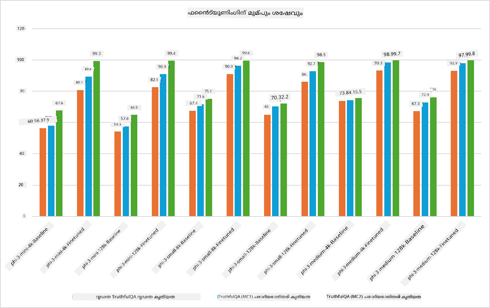

<!--
CO_OP_TRANSLATOR_METADATA:
{
  "original_hash": "cb5648935f63edc17e95ce38f23adc32",
  "translation_date": "2025-12-21T18:58:26+00:00",
  "source_file": "md/03.FineTuning/FineTuning_Scenarios.md",
  "language_code": "ml"
}
-->
## ഫൈൻ-ട്യൂണിംഗ് സാഹചര്യമാർ

**പ്ലാറ്റ്ഫോം** ഇതിൽ Azure AI Foundry, Azure Machine Learning, AI Tools, Kaito, ONNX Runtime തുടങ്ങിയ വിവിധ ടെക്നോളജികൾ ഉൾപ്പെടുന്നു. 

**ഇൻഫ്രാസ്ട്രക്ചർ** ഇതിൽ CPUയും FPGAയും ഉൾപ്പെടുന്നു, ഫൈൻ-ട്യൂണിംഗ് പ്രക്രിയയ്ക്ക് അവ അനിവാര്യമാണ്. ഓരോ ടെക്നോളജിക്കുമായുള്ള ഐക്കണുകൾ ഞാൻ കാണിക്കാം.

**ടൂളുകളും ഫ്രെയിംവർക്കും** ഇതിൽ ONNX Runtime ഉം ONNX Runtime ഉം ഉൾപ്പെടുന്നു. ഞാൻ ഓരോ ടെക്നോളജിക്കുമുള്ള ഐക്കണുകൾ കാണിച്ചുതരാം।
[ONNX Runtime ഉം ONNX Runtime ഉം വേണ്ടി ഐക്കണുകൾ ചേർക്കുക]

Microsoft ടെക്നോളജികളോടുകൂടെ ഫൈൻ-ട്യൂണിംഗ് പ്രക്രിയ വിവിധ ഘടകങ്ങളും ഉപകരണങ്ങളും ഉൾക്കൊള്ളുന്നു. ഈ ടെക്നോളജികൾ മനസ്സിലാക്കി ഉപയോഗപ്പെടുത്തുന്നതിലൂടെ നാം നമ്മുടെ ആപ്ലിക്കേഷനുകൾ ഫലപ്രദമായി ഫൈൻ-ട്യൂൺ ചെയ്ത് മികച്ച പരിഹാരങ്ങൾ സൃഷ്ടിക്കാനാകും. 

## മോഡൽ സേവനമായി

ഹോസ്റ്റുചെയ്ത ഫൈൻ-ട്യൂണിംഗ് ഉപയോഗിച്ച് മോഡൽ ഫൈൻ-ട്യൂൺ ചെയ്യുക, കമ്പ്യൂട്ട് സൃഷ്ടിക്കേണ്ടതും മാനേജ് ചെയ്യേണ്ടതും ഇല്ല.

Phi-3-mini, Phi-3-medium മോഡലുകൾക്ക് സർവർലെസ് ഫൈൻ-ട്യൂണിംഗ് ലഭ്യമാണ്, ഡെവലപ്പർമാർക്ക് കമ്പ്യൂട്ട് ഒരുക്കാതെ ക്ലൗഡ് ಮತ್ತು എജ് സാഹചര്യങ്ങൾക്കുള്ള മോഡലുകൾ ദ്രുതവും എളുപ്പവുമായി ഇഷ്ടാനുസൃതമാക്കാൻ ഇത് അനുവദിക്കുന്നു. കൂടാതെ, Phi-3-small ഇപ്പോൾ Models-as-a-Service അരക്കത്തിൽ വഴി ലഭ്യമാണ് എന്ന് ഞങ്ങൾ പ്രഖ്യാപിച്ചിട്ടുണ്ട്, അതിലൂടെ ഡെവലപ്പർമാർക്ക് അടിസ്ഥാന ഇൻഫ്രാസ്ട്രക്ചർ മാനേജ് ചെയ്യേണ്ടാതെ എഐ വികസനം വേഗത്തിൽ ആരംഭിക്കാം.

## മോഡൽ പ്ലാറ്റ്ഫോമായി

ഉപയോക്താക്കൾ അവരുടെ സ്വന്തം കമ്പ്യൂട്ട് മാനേജ് ചെയ്ത് മോഡലുകൾ ഫൈൻ-ട്യൂൺ ചെയ്യുന്നു.

[ഫൈൻ-ട്യൂണിംഗ് സാമ്പിൾ](https://github.com/Azure/azureml-examples/blob/main/sdk/python/foundation-models/system/finetune/chat-completion/chat-completion.ipynb)

## ഫൈൻ-ട്യൂണിംഗ് സാഹചര്യങ്ങൾ 

| | | | | | | |
|-|-|-|-|-|-|-|
|സാഹചര്യങ്ങൾ|LoRA|QLoRA|PEFT|DeepSpeed|ZeRO|DORA|
|പ്രി-ട്രെയിന്‍ ചെയ്ത LLM-കളെ പ്രത്യേക ടാസ്കുകളിലോ ഡൊമെയ്‌നുകളിലോ അനുയോജ്യമാക്കൽ|ഉണ്ട്|ഉണ്ട്|ഉണ്ട്|ഉണ്ട്|ഉണ്ട്|ഉണ്ട്|
|ടെക്സ്റ്റ് ക്ലാസിഫിക്കേഷൻ, നെയ്മഡ് എന്റിറ്റി റികഗ്നിഷൻ, മെഷീൻ ട്രാൻസ്ലേഷൻ പോലുള്ള NLP ജോലികൾക്ക് ഫൈൻ-ട്യൂണിംഗ്|ഉുണ്ട്|ഉണ്ട്|ഉണ്ട്|ഉണ്ട്|ഉണ്ട്|ഉണ്ട്|
|QA ജോലികൾക്ക് ഫൈൻ-ട്യൂണിംഗ്|ഉണ്ട്|ഉണ്ട്|ഉണ്ട്|ഉണ്ട്|ഉണ്ട്|ഉണ്ട്|
|ചാറ്റ്ബോട്ടുകളിൽ മനുഷ്യൻ പോലുള്ള പ്രതികരണങ്ങൾ സൃഷ്ടിക്കാൻ ഫൈൻ-ട്യൂണിംഗ്|ഉണ്ട്|ഉണ്ട്|ഉണ്ട്|ഉണ്ട്|ഉണ്ട്|ഉണ്ട്|
|സംഗീതം, കല, അല്ലെങ്കിൽ മറ്റ് സൃഷ്ടിപരമായ രൂപങ്ങൾ സൃഷ്ടിക്കാൻ ഫൈൻ-ട്യൂണിംഗ്|ഉണ്ട്|ഉണ്ട്|ഉണ്ട്|ഉണ്ട്|ഉണ്ട്|ഉണ്ട്|
|കമ്പ്യൂട്ടേഷൻ റിസോഴ്‌സ് ಹಾಗೂ സാമ്പത്തിക ചെലവുകൾ കുറക്കൽ|ഉണ്ട്|ഉണ്ട്|ഇല്ല|ഉണ്ട്|ഉണ്ട്|ഇല്ല|
|സ്മൃതി ഉപയോഗം കുറക്കൽ|ഇല്ല|ഉണ്ട്|ഇല്ല|ഉണ്ട്|ഉണ്ട്|ഉണ്ട്|
|ഫൈൻ-ട്യൂണിംഗ് കാര്യക്ഷമമാക്കാൻ കുറവ് പാരാമീറ്ററുകൾ ഉപയോഗിക്കൽ|ഇല്ല|ഉണ്ട്|ഉണ്ട്|ഇല്ല|ഇല്ല|ഉണ്ട്|
|ലഭ്യമായ എല്ലാ GPU ഡിവൈസുകളുടെ ആകെ GPU സ്മൃതിക്ക് ആക്സസ് നൽകുന്ന ഒരു മെമ്മറി-ക്ഷമമായ ഡാറ്റ പാരലലിസം രൂപം|ഇല്ല|ഇല്ല|ഇല്ല|ഉണ്ട്|ഉണ്ട്|ഉണ്ട്|

## ഫൈൻ-ട്യൂണിംഗ് പ്രകടന ഉദാഹരണങ്ങൾ

---

<!-- CO-OP TRANSLATOR DISCLAIMER START -->
ഡിസ്ക്ലെയിമര്‍:
ഈ രേഖ AI വിവര്‍ത്തന സേവനം [Co-op Translator](https://github.com/Azure/co-op-translator) ഉപയോഗിച്ച് വിവര്‍ത്തനമാക്കിയതാണ്. ഞങ്ങള്‍ കൃത്യതയ്ക്ക് ശ്രമിച്ചിരുന്നെങ്കിലും, യന്ത്രവല്‍ക്കൃതമായി നടത്തിയ വിവര്‍ത്തനങ്ങളില്‍ പിശകുകള്‍ അല്ലെങ്കില്‍ അകൃത്യതകള്‍ ഉണ്ടായിരിക്കാന്‍ സാധ്യതയുണ്ടെന്നത് ദയവായി ശ്രദ്ധിക്കുക. യഥാര്‍ത്ഥമായി ഉള്ളത് ആ ഭാഷയിലുള്ള(orig) രേഖയാണ് അതിന്റെ ഔദ്യോഗികമായ ആധാരം എന്നു കരുതപ്പെടേണ്ടത്. നിര്‍ണായകവായ വിവരങ്ങള്‍ക്കായി പ്രൊഫഷണല്‍ മനുഷ്യ വിവര്‍ത്തനം ശുപാര്‍ശ ചെയ്യപ്പെടുന്നു. ഈ വിവര്‍ത്തനത്തിന്റെ ഉപയോഗത്തില്‍ നിന്നുണ്ടാകുന്ന ഏതെങ്കിലും തെറ്റിദ്ധാരണകള്‍ക്കോ തെറ്റായ വ്യാഖ്യാനങ്ങള്‍ക്കോ ഞങ്ങള്‍ ഉത്തരവാദികളല്ല.
<!-- CO-OP TRANSLATOR DISCLAIMER END -->